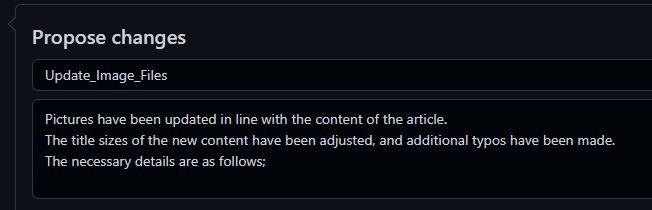
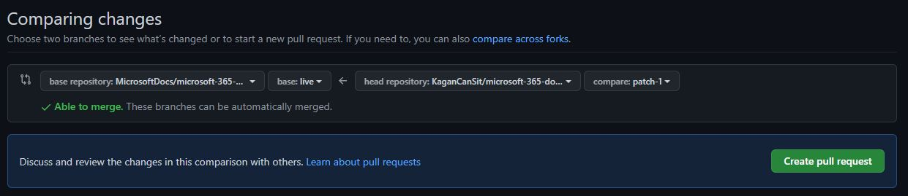

# <a name="hi"> [Microsoft Docs](docs.microsoft.com) İçeriklerine Katkıda Bulunma Kılavuzuna Hoş Geldiniz! </a>

Github üzerinde barındırılan ve aktif olarak Microsoft Docs içeriklerimizi barındırdığımız depomuzu keşfettiğinize göre Microsoft Docs içeriklerine dair kapsamlı sorularınıza yanıt bulmak, bizlerin daha doğru, kısa ve anlaşılabilir içerikler oluşturması için katkıda bulunmak veya Microsoft Docs üzerinde yazılmış olan içeriklere kısaca bir göz atmak isteyebilirsiniz. Aşağıda bazı sorularının yanıtlarını alabileceğine eminim. 

Hadi başlayalım!

## <a name="intro_description"> Microsoft Docs İçerikleri Nerede Tutulur? Ve Nasıl Yönetilir?</a>

Microsoft belge kümelerinin birçoğu açık kaynaktır ve GitHub’da barındırılır. Tüm belge kümeleri tamamen açık kaynak değildir, ancak birçoğunun çekme istekleri (PR) yoluyla değişiklik önerebileceğiniz genel kullanıma yönelik depoları vardır. Bu açık kaynak yaklaşımı ürün mühendisleri, içerik ekipleri ve müşteriler arasındaki iletişimi kolaylaştırır ve geliştirir. Başka çeşitli avantajları da vardır:

- İhtiyaç duyulan, aktif olarak kullanılan içeriklerin güncelliği ve aktif problemlere karşı fark edilen hatalı veya gözden kaçan noktaları yakalamamızı sağlarken bir yandan da belgeler hakkında geri bildirim sağlar. Bu durum içeriklerin iyileştirilmesi, sorunların erken fark edilmesi gibi noktalarda bizlere ışık tutar.
- Bu sayede bizler hızlı, aktif ve güncel bir içerik üretimi, takibi ve denetimi sağlayabiliyoruz.
- Açık kaynak depoları, içeriği sürekli olarak geliştirmeyi kolaylaştırmak için açık depolarda güncelleştirilir. Ayrı bir ortam veya araca çoğu zaman ihtiyaç duymaz. Bu durum katkıda bulunmak isteyenler içinde büyük kolaylık sağlamaktadır.

Microsoft Docs kullanıcı deneyimlerini daha da kolaylaştırmak için GitHub iş akışları ile doğrudan tümleşiktir. Kullanıcıların görüntülemekte oldukları ve düzenlenebilir olarak belirlenmiş içeriklerini rahatça düzenleyebilmelerini ve bizlere ulaştırabilmesini sağlar. Bunun yanı sıra yeni konuları gözden geçirebilir veya kalite sorunları hakkında geri bildirimler aracılığıyla yardım edebilirsiniz.

## <a name="learn-how-to-contribute">Microsoft Docs İçeriklerine Katkıda Bulunmak</a>

İlgilenen herkes Microsoft Docs içeriklerine katkıda bulunabilir ve gelişmesine yardımcı olabilir. Bu işlemi kolay ve hızlı bir şekilde yapabilmeniz için yazılı olarak bulunan içeriklerin Markdown dosyalarını Github üzerinde düzenleyebilir ve onaylanması için çekme isteği (PR) aracılığıyla sunabilirsiniz. Yapmış olduğunuz katkı onaylanması durumunda katkıda bulunan olarak [buradaki adres](https://github.com/MicrosoftDocs/microsoft-365-docs/graphs/contributors) üzerinde ve katkı sağladığınız makalenin katkıda bulunanlar kısmında listelenirsiniz: 

Bu bizim içinde çok değerli ve şimdiden ayırdığınız zaman, emek için teşekkür ederiz.

## [GitHub](GitHub.com)'ı Kullanarak Bir Makaleyi Hızlı Bir Şekilde Güncelleştirme

Yazım hatası, içerik düzenlenmesi gibi güncelleştirmeler yapan katkıda bulunanlar, herhangi bir ek yazılım yüklemek zorunda kalmadan dosyayı doğrudan GitHub'da düzenleyebilir. Birazdan bu düzenlemeyi hızlı ve efektif bir biçimde nasıl yapacağınızı sizlere anlatacağız. Bunun yanı sıra hazırlamış olduğumuz [bu iki dakikalık videoda](https://www.microsoft.com/videoplayer/embed/RE1XQTG) nasıl katkıda bulunacağınıza dair sizlere yardımcı olacaktır.

1. İlk olarak düzenleme yapabilmek ve istekte bulunabilmek için [GitHub](https://github.com/login) hesabınız ile oturum açın. Hesabınız yok mu? Önemli değil ücretsiz olarak Github'a kayıt olabilirsiniz.
   
   

2. Düzenlemek istediğiniz sayfa içeriğinin Markdown dosyasına ulaşabilmek için direk olarak bu depo içerisinde arama yapabilir veya Microsoft Docs üzerinde ilgili makalenin üzerinde yer alan **kalem** ikonuna tıklayabilirsiniz.
   
   

> Not: Eğer var olan makale içeriğinin üzerinde "kalem" ikonu bulunmuyor ise içerik genel katkılara açık olmayabilir.

3. Ardından ulaşmış olduğunuz Markdown dosyasının sağ üstüne yer alan menü üzerinden bu dosyayı düzenle kalem **simgesine tıklamanız** gerekir.

      

4. Bu işlemin ardından dosyada değişiklik yapabileceğiniz satır numaralı bir düzenleme sayfası açılır. Dosya GitHub Markdown dili kullanılarak yazılır ve düzenlenebilir. Markdown'ı kullanma hakkında yardım için bkz. [Markdown'da Ustalık Sahibi Olmak](https://guides.github.com/features/mastering-markdown/). Değişikliklerinizi **ilerlerken** görüntülemek ve içeriğin görünümüne dair fikir sahibi olabilmek için "Değişiklikleri Önizleme (Preview)" sekmesini seçebilirsiniz.
      
      
      

5. Değişiklik yapmayı bitirdikten sonra, sayfanın **en altındaki** "Dosya Değişikliğini Öner (Propose Changes)" bölümüne gidin:

   - Kısa bir başlık gereklidir. Varsayılan olarak başlık dosyanın adıdır, ancak bunu değiştirebilirsiniz. Bizler yapmış olduğunuz kısa değişikliği açıklayan bir isim olmasını öneririz. Örneğin "resimler_güncellendi" gibi.
   - İsteğe bağlı olarak kısmında ise, güncelleştirmiş olduğunuz kısımları ne için güncellediğinizden ve hangi noktalarda değişiklikler yaptığınızdan bahsedebilir. Bizlerin değerlendirmesi için kolaylık ve hız sağlayabilirsiniz.
   
   

   Hazırsanız, yeşil "Dosya Değişikliğini Öner( Propose Changes)" **düğmesine** tıklayın.

   
   

6. Görüntülenen karşılaştırma değişiklikleri sayfasında ,  **yeşil çekme isteği (PR) oluştur düğmesine** tıklayın.

   

> Son birkaç adımda ne göreceğinizi, verim bilgisinde izinlerinizi belirler. Özel ayrıcalıkları olmayan kişiler, dosya **değişikliği öner bölümünü ve** sonraki onay sayfalarını açıklandığı gibi görebilirler. Kendi çekme isteklerini oluşturma ve onaylama izinleri olan kişiler (Yönetici, Geliştirici), yeni bir dal oluşturmak için ek seçenekler ve daha az onay sayfası oluşturmak için ek seçeneklerle benzer değişiklikler yapın bölümünü görebilirler.

   Burada önemli olan şu şekildedir: Yönergeleri dikkalti bir biçimde takip edin!

7. Çekme İsteğiniz(Pull Request) detaylı bir şekilde gözden geçirilmesinin ardından sizlere yeniden isteğiniz üzerinden dönüş yapılacak veya onaylanırsa içerik güncellenecektir.

## Microsoft Açık Kaynak Kullanım Şartları

Bu projede [Microsoft Açık Kaynak Kullanım Şartları](https://opensource.microsoft.com/codeofconduct/) benimsenmiştir. Daha fazla bilgi için Yürütme [Kuralları SSS](https://opensource.microsoft.com/codeofconduct/faq/) bölümüne bakın veya diğer [opencode@microsoft.com](mailto:opencode@microsoft.com) veya yorumlarınızı görmek için ilgili bölüme ulaşın.

### Katkıda Bulunan

Bu proje katılımları ve önerileri karşılar. Çoğu katkı için, gerekli olduğu ve aslında gerekli olduğunu beyan edilen Katılımcı Lisans Sözleşmesi'ne (CLA) onaylamanızı gerektirir ve gerçekten de katkınızı kullanma haklarınızı bize sağlarsınız. Ayrıntılar için ziyaret edin <https://cla.microsoft.com>.

Bir çekme isteği gönderdiğinizde, bir CLA-bot, PR'yi uygun şekilde süslemeniz (ör. etiket, açıklama) gerekip gerek olmadığını otomatik olarak belirler. Robot tarafından sağlanan yönergeleri takip edin. Bu durum onay almanıza büyük katkı sağlayacak ve sürece hızlandıracaktır.

### Yasal Bildirimler

Microsoft ve tüm katkıda bulunanlar size [creative Commons Attribution 4.0](https://creativecommons.org/licenses/by/4.0/legalcode) Uluslararası Genel Lisans altındaki bu depoda yer alan Microsoft belgeleri ve diğer içerik için lisans dosyasına bakın  ve [MIT](https://opensource.org/licenses/MIT) Lisansı altındaki depoda bulunan herhangi bir koda lisans veren bir lisans vermek için LISANS [KODU](LICENSE-CODE) dosyasına bakın.

Microsoft, Windows, Microsoft Azure ve/veya diğer Microsoft ürün ve hizmetleri Microsoft'un ABD ve/veya diğer ülkelerdeki ticari markaları veya tescilli ticari markaları olabilir.

Bu projenin lisansları size Microsoft adlarını, logolarını veya ticari markalarını kullanma hakları vermekle aynı değildir. Microsoft'un genel ticari marka yönergeleri burada bulunabilir <https://go.microsoft.com/fwlink/?LinkID=254653>.

Gizlilik bilgilerine <https://privacy.microsoft.com/>

Microsoft ve tüm katkıda bulunanlar, ima, etopla ya da başka herhangi bir şekilde ilgili telif hakkı, patent veya ticari marka kapsamında diğer tüm hakları rezerve ediyor.