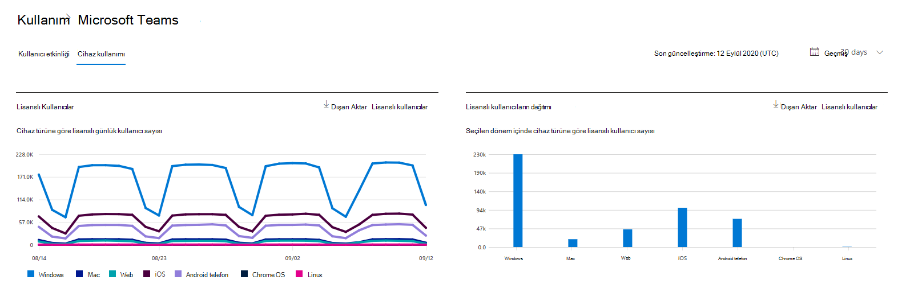
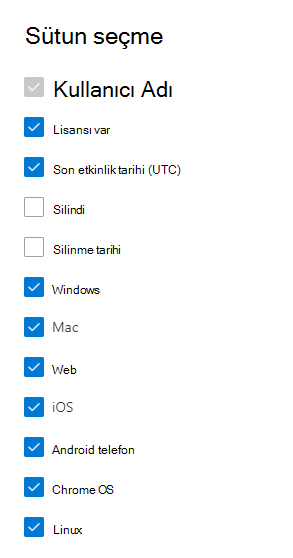

# Yönetim merkezinde raporları Microsoft 365 - cihaz kullanımını Microsoft Teams

Microsoft 365 Raporları panosu, kuruluşunuzdaki ürünler genelindeki etkinliğe genel bakışı gösterir. Bu pano sayesinde her bir üründeki etkinliklerle ilgili daha ayrıntılı bilgi edinmek için ürün düzeyinde raporları ayrıntılı olarak inceleyebilirsiniz. [Raporlara genel bakış konusunu](activity-reports.md) gözden geçirin. Microsoft Teams uygulama kullanımı raporunda, kuruluşunuzda kullanılan Microsoft Teams uygulamalarıyla ilgili öngörüler edinebilirsiniz.
  
## Microsoft Teams uygulama kullanımı raporuna ulaşma

1. Yönetim merkezinde, **Raporlar** \> <a href="https://go.microsoft.com/fwlink/p/?linkid=2074756" target="_blank">Kullanımı</a> sayfasına gidin. 
2. Pano giriş sayfasında, Microsoft Teams etkinlik kartındaki **Daha fazla görüntüle** düğmesine tıklayın.
  
## Microsoft Teams uygulama kullanımı raporunu yorumlama

Cihaz **kullanımı** sekmesini seçerek cihaz kullanımını Teams raporunda görüntüleyebilirsiniz. 

Rapora sütun eklemek veya rapordan sütun kaldırmak için Sütunları **seç'i** seçin.    

Dışarı **Aktar bağlantısını** seçerek rapor verilerini bir Excel .csv dosyasına da aktarabilirsiniz. Bu işlem tüm kullanıcıların verilerini dışarı aktarır ve daha fazla çözümleme yapmak için basit sıralama ve filtreleme işlemlerini kullanmanıza olanak tanır. 2000'den az kullanıcınız varsa, raporun kendi içindeki tabloda sıralama ve filtreleme yapabilirsiniz. 2000'den çok kullanıcınız varsa, filtrelemek ve sıralamak için verileri dışarı aktarmanız gerekir. 

**Microsoft Teams cihaz kullanımı** raporu, son 7 gün, 30 gün, 90 gün veya 180 günlük eğilimler için görüntülenebilir. Ancak raporda belirli bir gün seçerseniz, tablo geçerli tarihten itibaren (raporun oluşturulduğu tarihten değil) 28 güne kadar olan verileri gösterir.
  
|Öğe|Açıklama|
|:-----|:-----|
|**Metrik**|**Tanım**|
|Kullanıcı adı    |Kullanıcının görünen adı.    |
|Windows    |Kullanıcı Windows tabanlı bir bilgisayarda Teams masaüstü istemcisinde etkinse seçilir.    |
|Mac    |Kullanıcı macOS bilgisayardaki Teams masaüstü istemcisinde etkinse seçilir.    |
|iOS    |Kullanıcı iOS için Teams mobil istemcisinde etkinse seçilir.    |
|Android telefon    | Kullanıcı Android için Teams mobil istemcisinde etkinse seçilir.    |
|Chrome OS    |Kullanıcının ChromeOS bilgisayardaki Teams masaüstü istemcisinde etkin olup olmadığını seçin.|
|Linux    | Kullanıcı bir Linux bilgisayardaki Teams masaüstü istemcisinde etkinse seçilir.    |
|Web    |Kullanıcı cihazlardaki Teams web istemcisinde etkinse seçilir.|
|Son etkinlik tarihi (UTC)    |Kullanıcının bir Teams etkinliğine katıldığı son tarih (UTC).    |
|Lisanslıdır|Kullanıcı Teams kullanma lisansına sahipse seçilir.|

## Ayrıca bkz.
[kullanıcı etkinlik raporunu Microsoft Teams](../activity-reports/microsoft-teams-user-activity-preview.md) 

[kullanım etkinliği raporunu Microsoft Teams](../activity-reports/microsoft-teams-usage-activity.md) 
