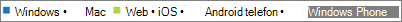

# Microsoft 365 Yönetim Merkezinde Raporlar - Microsoft Teams kullanımı ile ilgili raporlar

Rapor Microsoft 365 panosu, kurum kurum genelindeki ürünlerde etkinliğin genel görünümünü gösterir. Bu pano sayesinde her bir üründeki etkinliklerle ilgili daha ayrıntılı bilgi edinmek için ürün düzeyinde raporları ayrıntılı olarak inceleyebilirsiniz. [Raporlara genel bakış konusunu](activity-reports.md) gözden geçirin. Microsoft Teams uygulama kullanımı raporunda, kuruluşunuzda kullanılan Microsoft Teams uygulamalarıyla ilgili öngörüler edinebilirsiniz.
 
## Microsoft Teams uygulama kullanımı raporuna ulaşma

1. Yönetim merkezinde, **Raporlar** \> <a href="https://go.microsoft.com/fwlink/p/?linkid=2074756" target="_blank">Kullanımı</a> sayfasına gidin.

    
2. Rapor **seçin açılan listesinde,** Rapor kullan'ı **Microsoft Teams** \> **seçin**.
  
## Microsoft Teams uygulama kullanımı raporunu yorumlama

**Kullanıcılar** ve **Dağılım** grafiklerine bakarak Microsoft Teams uygulama kullanımını görüntüleyebilirsiniz. 
  

  
|Öğe|Açıklama|
|:-----|:-----|
|1.    |**Microsoft Teams cihaz kullanımı** raporu, son 7 gün, 30 gün, 90 gün veya 180 günlük eğilimler için görüntülenebilir. Ancak rapordaki herhangi bir günü seçersiniz tablo (7), mevcut tarihten (raporun oluşturulma tarihi değil) itibaren 28 güne kadar olan verileri gösterir.    |
|2.    |Her raporda yer alan veriler genellikle son 24 - 48 saati kapsar.    |
|3.    |**Kullanıcılar** görünümü uygulamaya göre günlük benzersiz kullanıcı sayısını gösterir.    |
|4.    |**Dağıtım** görünümü seçilen süre içinde uygulamaya göre benzersiz kullanıcı sayısını gösterir.    |
|5.    | **Kullanıcılar** grafiğinde Y ekseni, uygulamaya göre kullanıcıların sayısıdır.     **Dağıtım** grafiğindeki Y ekseni, belirtilen uygulamayı kullanan kullanıcıların sayısıdır.     Grafiklerdeki X ekseni, söz konusu rapor için seçilen tarih aralığıdır.    |
|6.    |Göstergede bir öğe seçerek grafikte gördüğünüz seriyi filtrenin ekleyebilirsiniz. Örneğin, Kullanıcılar grafiğinde  Windows ilgili bilgileri **görmek için Windows**, **Mac****, Aramalar**, **Web**, **Android** telefon veya **Windows** telefon seçin. Bu seçim değiştirildiğinde kılavuz tablosundaki bilgiler değişmez.    |
|7.    | Görüntülenen grupların listesi, en geniş raporlama zaman aralığında (180 gün) var olan (silinmemiş) tüm grupların kümesine göre belirlenir. Etkinlik sayısı, tarih seçimine göre değişir.    NOT: Aşağıdaki listede yer alan tüm öğeleri, siz ekleyene kadar sütunlarda görmeyebilirsiniz.  **Kullanıcı adı**, kullanıcının e-posta adresidir. Asıl e-posta adresini görüntüleyebilir veya bu alanın anonim olmasını sağlayabilirsiniz.    **Son Etkinlik Tarihi (UTC)**, bir uygulamada kullanıcının bir Microsoft Teams etkinliğine katıldığı son tarihi gösterir.    **Silinmiş**, silinen ekip sayısını gösterir. Ekip silinmişse ancak raporlama dönemi içinde etkinliği varsa, kılavuzda silinmiş ayarı doğru değeriyle gösterilir.    **Silinme tarihi**, ekibin silindiği tarihtir.    Belirtilen süre boyunca kullanıcı bir Windows uygulamasında etkinse **Windows** işaretlenir.    Kullanıcı, belirtilen süre boyunca bir Mac uygulamasında etkinse **Mac** işaretlenir.    Kullanıcı, belirtilen süre boyunca bir web uygulamasında etkinse **Web** işaretlenir.    Kullanıcı, belirtilen süre boyunca bir iOS uygulamasında etkinse **iOS** işaretlenir.    Belirtilen süre boyunca kullanıcı bir Android telefon uygulamasında etkinse, **Android telefon** işaretlenir.    Kullanıcı, belirtilen süre boyunca bir Windows Phone uygulamasında etkinse **Windows Phone** işaretlenir.     Kuruluşunuzun ilkeleri nedeniyle kişisel kullanıcı bilgilerinin bulunduğu raporları görüntüleyemiyorsanız bu raporların gizlilik ayarını değiştirebilirsiniz. Aşağıdaki çalışma **sayfalarındaki Etkinlik Raporları'nın** kullanıcı düzeyi ayrıntılarını [nasıl gizleyim? Microsoft 365 yönetim merkezi](activity-reports.md).    |
|8.    |Raporda **sütun** eklemek veya kaldırmak için Sütunlar'ı seçin.    |
|9.    |Ayrıca, Dışarı Aktar bağlantısını seçerek rapor Excel .csv bir çalışma dosyasına da **aktarabilirsiniz**. Bu işlem tüm kullanıcıların verilerini dışarı aktarır ve daha fazla çözümleme yapmak için basit sıralama ve filtreleme işlemlerini kullanmanıza olanak tanır. 2000'den az kullanıcınız varsa, raporun kendi içindeki tabloda sıralama ve filtreleme yapabilirsiniz. 2000'den çok kullanıcınız varsa, filtrelemek ve sıralamak için verileri dışarı aktarmanız gerekir.    |
|||
   
  

