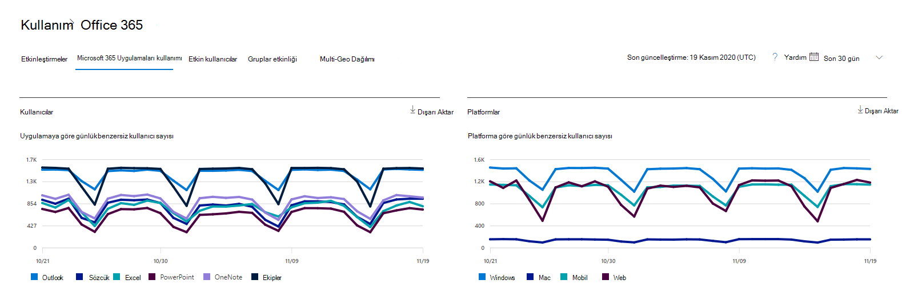

# Yönetim merkezinde raporları Microsoft 365 - kullanımı Microsoft 365 Uygulamaları

Microsoft 365 Raporları panosu, kuruluşunuzdaki ürünler genelindeki etkinliğe genel bakışı gösterir. Bu pano sayesinde her bir üründeki etkinliklerle ilgili daha ayrıntılı bilgi edinmek için ürün düzeyinde raporları ayrıntılı olarak inceleyebilirsiniz. [Raporlara genel bakış konusuna](activity-reports.md) göz atın.

Örneğin, Microsoft 365 Uygulamaları uygulamalarını kullanma lisansına sahip her kullanıcının etkinliğini, uygulamalar genelindeki etkinliklerine ve platformlar arasında nasıl kullanıldıklarına bakarak anlayabilirsiniz.

> [!NOTE]
> Paylaşılan bilgisayar etkinleştirmeleri bu rapora dahil değildir.

## Microsoft 365 Uygulamaları kullanım raporuna nasıl ulaşabilirsiniz?

1. Yönetim merkezinde, **Raporlar** \> <a href="https://go.microsoft.com/fwlink/p/?linkid=2074756" target="_blank">Kullanımı</a> sayfasına gidin. 
2. Pano giriş sayfasında, Etkin kullanıcılar - Microsoft 365 Uygulamaları kartındaki **Daha fazla görüntüle** düğmesine tıklayın.

## Microsoft 365 Uygulamaları kullanım raporunu yorumlama

**Kullanıcılar** ve **Platform** grafiklerine bakarak kullanıcınızın Microsoft 365 Uygulamaları etkinliğine ilişkin bir görünüm elde edebilirsiniz.

> [!div class="mx-imgBorder"]
> 

|Öğe|Açıklama|
|---|---|
|1.|**Microsoft 365 Uygulamaları kullanım** raporu son 7 gün, 30 gün, 90 gün veya 180 günlük eğilimler için görüntülenebilir. Ancak raporda belirli bir gün seçerseniz, tablo geçerli tarihten itibaren (raporun oluşturulduğu tarihten değil) 28 güne kadar olan verileri gösterir.|
|2.|Her rapordaki veriler genellikle son iki güne kadar kapsar. Altı günde bir, veri kalitesini sağlamak için raporu küçük güncelleştirmelerle yenileyeceğiz.|
|3.|**Kullanıcılar** görünümü, her uygulama için etkin kullanıcı sayısı (Outlook, Word, Excel, PowerPoint, OneNote ve Teams) eğilimi gösterir. "Etkin kullanıcılar", bu uygulamalar içinde herhangi bir kasıtlı eylem gerçekleştiren kullanıcılardır.|
|4.|**Platformlar** görünümü, her platform için (Windows, Mac, Web ve Mobil) tüm uygulamalarda etkin kullanıcıların eğilimini gösterir.|
|5.|**Kullanıcılar** grafiğinde Y ekseni, ilgili uygulamanın benzersiz etkin kullanıcı sayısıdır. **Platformlar** grafiğinde Y ekseni, ilgili platform için benzersiz kullanıcı sayısıdır. Her iki grafikteki X ekseni, belirli bir platformda bir uygulamanın kullanıldığı tarihtir.|
 6.|Göstergede bir öğe seçerek grafikte gördüğünüz seriyi filtreleyebilirsiniz. Örneğin, **Kullanıcılar** grafiğinde Outlook, Word, Excel, PowerPoint, OneDrive veya Teams seçerek yalnızca her biriyle ilgili bilgileri görebilirsiniz. Bu seçimin değiştirilmesi, altındaki kılavuz tablosundaki bilgileri değiştirmez.|
|7.|Tablo, kullanıcı başına verilerin dökümünü gösterir. Tablodaki sütunları ekleyebilir veya kaldırabilirsiniz.    **Kullanıcı adı**, Microsoft Apps etkinliği gerçekleştiren kullanıcının e-posta adresidir.  **Son etkinleştirme tarihi (UTC),** kullanıcının Microsoft 365 Uygulamaları aboneliğini bir makinede etkinleştirdiği veya paylaşılan bilgisayarda oturum açtığı ve uygulamayı kendi hesabıyla başlattığı en son tarihtir.   **Son etkinlik tarihi (UTC),** kullanıcı tarafından kasıtlı bir etkinliğin gerçekleştirildiği son tarihtir. Belirli bir tarihte gerçekleştirilen etkinliği görmek için, grafikte doğrudan tarihi seçin.  Diğer sütunlar, kullanıcının seçilen dönemde o uygulama için (Microsoft 365 Uygulamaları içinde) o platformda etkin olup olmadığını belirler.|
|8.|**Rapora sütun** eklemek veya rapordan sütun kaldırmak için Sütunları seç simgesini seçin.|
|9.|Dışarı **Aktar bağlantısını** seçerek rapor verilerini bir Excel .csv dosyasına da aktarabilirsiniz. Bu, tüm kullanıcılar için verileri dışarı aktarır ve daha fazla analiz için basit toplama, sıralama ve filtreleme gerçekleştirmenize olanak tanır. 100'den az kullanıcınız varsa, raporun içindeki tablonun içinde sıralama ve filtreleme yapabilirsiniz. 100'den fazla kullanıcınız varsa, filtrelemek ve sıralamak için verileri dışarı aktarmanız gerekir.|
