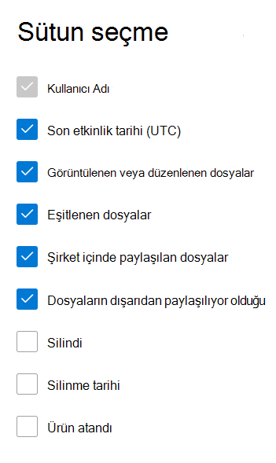

# Microsoft 365 Merkezinde Rapor Raporları - OneDrive İş raporları

Rapor Microsoft 365 panosu, kurum kurum genelindeki ürünlerde etkinliğin genel görünümünü gösterir. Bu pano sayesinde ürünlerin her birindeki etkinliklerle ilgili daha ayrıntılı bilgi edinmek için ürün düzeyinde raporları ayrıntılı olarak inceleyebilirsiniz. [Raporlara genel bakış konusuna](activity-reports.md) göz atın.
  
Örneğin, OneDrive kullanma lisansı olan her kullanıcının etkinliğini anlamak için OneDrive'da dosyalarla etkileşimlerine bakabilirsiniz. Ayrıca, paylaşılan dosya sayısına bakarak işbirliği düzeyini anlamanıza da yardımcı olabilir.

## OneDrive Etkinlik raporuna nasıl ulaşabilirim?

1. Yönetim merkezinde, **Raporlar** \> <a href="https://go.microsoft.com/fwlink/p/?linkid=2074756" target="_blank">Kullanımı</a> sayfasına gidin. 
2. Pano giriş sayfasında, pano kartında **Daha fazla** görüntüle OneDrive tıklayın.
  
## OneDrive İş etkinlik raporunu yorumlama

Etkinlik sekmesini seçerek çalışma OneDrive etkinlikleri **görüntüleyebilirsiniz**. 

Raporda **sütun eklemek** veya kaldırmak için Sütunları seç'i seçin.    

Ayrıca, Dışarı Aktar bağlantısını seçerek Excel .csv verilerini bir Excel .csv dosyasına **aktarabilirsiniz**. Bu işlem tüm kullanıcıların verilerini dışarı aktarır ve daha fazla çözümleme yapmak için basit sıralama ve filtreleme işlemlerini kullanmanıza olanak tanır. 2000'den az kullanıcınız varsa, raporun kendi içindeki tabloda sıralama ve filtreleme yapabilirsiniz. 2000'den çok kullanıcınız varsa, filtrelemek ve sıralamak için verileri dışarı aktarmanız gerekir.

**OneDrive İş aktivite** raporu, son 7 gün, 30 gün, 90 gün veya 180 günlük eğilimler için görüntülenebilir. Ancak rapordaki belirli bir günü seçersiniz, tablo geçerli tarihten (raporun oluşturulma tarihine değil) itibaren 28 güne kadar olan verileri gösterir.
  
|Öğe|Açıklama|
|:-----|:-----|
|**Metrik**|**Tanım**|
|Kullanıcı Adı    |Hesap sahibi olan kullanıcının OneDrive.    |
|Son etkinlik tarihi (UTC)    |Seçilen tarih aralığı için Dosya hesabında OneDrive etkinlik gerçekleştirilen son tarih. . Belirli bir tarihte gerçekleştirilen etkinliği görmek için, grafikte doğrudan tarihi seçin.    |
|Görüntülenen veya düzenlenen dosyalar    |Kullanıcının karşıya yükleytiği, indirdiğiniz, değiştirdiğiniz veya görüntülediğiniz dosya sayısı.     |
|Eşitlenen dosyalar    |Kullanıcının yerel cihazından hesap hesabıyla eşitlenen dosya OneDrive.   |
|Şirket içinde paylaşılan dosyalar    | Kuruluş içindeki kullanıcılarla veya gruplarda bulunan kullanıcılarla (dış kullanıcılar da dahil) paylaşılan dosya sayısı.    |
|Dışarıdan paylaşılan dosyalar    |Kuruluşun dışındaki kullanıcılarla paylaşılan dosya sayısı.  |
|Silindi    | Bu, kullanıcının lisansının kaldırıldığına işarettir.    NOT: Seçilen dönem içinde bir süre lisanslı olduğu sürece, silinen kullanıcının etkinliği raporda görüntülenir. **Silindi** sütunu, kullanıcının artık etkin olamayacağını ama rapordaki verilere katkıda bulunduğunu belirlemenize yardımcı olur.    |
|Silinme tarihi    |Kullanıcının lisansının kaldırıldığı tarih.  |
|Ürün atandı    |Kullanıcıya Microsoft 365 lisansları olan ürünler.|
|||