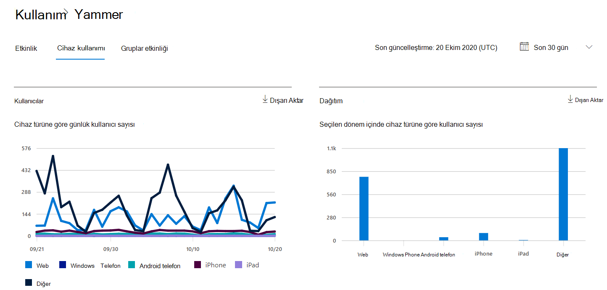

# Microsoft 365 Merkezinde Raporları - Cihaz Yammer raporuna bakın

Rapor Microsoft 365 panosu, kurum kurum genelindeki ürünlerde etkinliğin genel görünümünü gösterir. Bu pano sayesinde her bir üründeki etkinliklerle ilgili daha ayrıntılı bilgi edinmek için ürün düzeyinde raporları ayrıntılı olarak inceleyebilirsiniz. [Raporlara genel bakış konusuna](activity-reports.md) göz atın.
  
Yammer cihaz kullanım raporları kullanıcılarınızın Yammer'ı hangi cihazlar üzerinde kullandığı hakkında bilgi verir. Cihaz türüne göre günlük kullanıcı sayısını ve cihaz türüne göre kullanıcı sayısını görüntüleyebilirsiniz. Bu bilgilerin ikisi de seçili bir zaman aralığında görüntülenebilir. Dilerseniz, kullanıcı başına ayrıntıları da görüntüleyebilirsiniz.
 
## Yammer cihaz kullanım raporuna nasıl ulaşabilirim?

1. Yönetim merkezinde, **Raporlar** \> <a href="https://go.microsoft.com/fwlink/p/?linkid=2074756" target="_blank">Kullanımı</a> sayfasına gidin. 
2. Pano giriş sayfasında, pano kartında **Daha fazla** görüntüle Yammer tıklayın.
  
## Cihaz Yammer raporunu yorumlama

Cihaz kullanımı sekmesini seçerek OneDrive raporuna **bakabilirsiniz**. 

Raporda **sütun eklemek** veya kaldırmak için Sütunları seç'i seçin.    

Ayrıca, Dışarı Aktar bağlantısını seçerek Excel .csv verilerini bir Excel .csv dosyasına **aktarabilirsiniz**. Bu işlem tüm kullanıcıların verilerini dışarı aktarır ve daha fazla çözümleme yapmak için basit sıralama ve filtreleme işlemlerini kullanmanıza olanak tanır. 2000'den az kullanıcınız varsa, raporun kendi içindeki tabloda sıralama ve filtreleme yapabilirsiniz. 2000'den çok kullanıcınız varsa, filtrelemek ve sıralamak için verileri dışarı aktarmanız gerekir. 

En **Yammer kullanım** raporu, son 7 gün, 30 gün, 90 gün veya 180 günlük eğilimler için görüntülenebilirsiniz. Ancak rapordaki belirli bir günü seçersiniz, tablo geçerli tarihten (raporun oluşturulma tarihine değil) itibaren 28 güne kadar olan verileri gösterir.
  
|Öğe|Açıklama|
|:-----|:-----|
|**Metrik**|**Tanım**|
|Kullanıcı Adı    |Kullanıcının e-posta adresi. Asıl e-posta adresini görüntüleyebilir veya bu alanın anonim olmasını sağlayabilirsiniz. Bu kılavuzda, hesap hesabını kullanarak Yammer veya çoklu oturum açma Microsoft 365 kullanarak ağa oturum açan kullanıcılar görüntülenir.   |
|Görünen ad    |Kullanıcının tam adı. Asıl e-posta adresini görüntüleyebilir veya bu alanın anonim olmasını sağlayabilirsiniz.    |
|Kullanıcı durumu    |Üç değerden biri: Etkin, Silindi veya Askıya Alındı. Bu raporlarda etkin, askıya alınan ve silinen kullanıcıların verileri gösterilir. Bunlar bekleyen kullanıcıları yansıtmaz, çünkü bekleyen kullanıcılar iletileri gönderemez, okuyamaz veya beğenemez.     |
|Durum değişiklik tarihi (UTC)    |Bu tarihte kullanıcının durumunun hangi tarihte değiştir Yammer.    |
|Son etkinlik tarihi (UTC)    |Kullanıcının bir etkinlikte katıldığı son tarih (UTC Yammer.    |
|Web    |Kullanıcının web üzerinde e-posta Yammer olduğunu gösterir.    |
|Windows telefonu    | Kullanıcının başka bir telefonda telefon Yammer olduğunu Windows gösterir.    |
|Android telefon    |Kullanıcının bir Android telefonda Yammer kullanıcı adını kullandırdı olduğunu gösterir.  |
|iphone   | Kullanıcının bir dosyada kimlik Yammer olduğunu iPhone.    |
|ipad    |Kullanıcının bir dosyada kimlik Yammer olduğunu iPad.  |
|diğer    |Kullanıcının daha önce listelenmiyorsa Yammer kullanıcı adını başka bir cihazda kullandı olup olmadığını gösterir.  |
|||