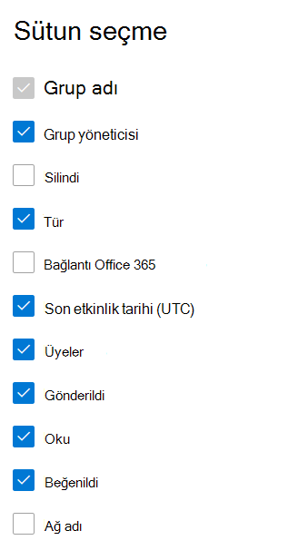

# Yönetim merkezinde raporları Microsoft 365 - Yammer grupları etkinlik raporu

Microsoft 365 Raporları panosu, kuruluşunuzdaki ürünler genelindeki etkinliğe genel bakışı gösterir. Bu pano sayesinde her bir üründeki etkinliklerle ilgili daha ayrıntılı bilgi edinmek için ürün düzeyinde raporları ayrıntılı olarak inceleyebilirsiniz. [Raporlara genel bakış konusuna](activity-reports.md) göz atın. Yammer grupları etkinlik raporunda, kuruluşunuzdaki Yammer gruplarının etkinliğiyle ilgili öngörüler edinebilir, kaç Yammer grubunun oluşturulduğunu ve kullanıldığını görebilirsiniz.
 
## Yammer grupları etkinlik raporuna Nasıl yaparım? ulaşabilirsiniz?

1. Yönetim merkezinde, **Raporlar** \> <a href="https://go.microsoft.com/fwlink/p/?linkid=2074756" target="_blank">Kullanımı</a> sayfasına gidin. 
2. Pano giriş sayfasında, Yammer kartındaki **Daha fazla görüntüle** düğmesine tıklayın.
  
## Yammer grupları etkinlik raporunu yorumlama

Gruplar etkinlik sekmesini seçerek Yammer raporundaki **grup** etkinliklerini görüntüleyebilirsiniz. 

Rapora sütun eklemek veya rapordan sütun kaldırmak için Sütunları **seç'i** seçin.    

Dışarı **Aktar bağlantısını** seçerek rapor verilerini bir Excel .csv dosyasına da aktarabilirsiniz. Bu işlem tüm kullanıcıların verilerini dışarı aktarır ve daha fazla çözümleme yapmak için basit sıralama ve filtreleme işlemlerini kullanmanıza olanak tanır. 2000'den az kullanıcınız varsa, raporun kendi içindeki tabloda sıralama ve filtreleme yapabilirsiniz. 2000'den fazla kullanıcınız varsa, filtrelemek ve sıralamak için verileri dışarı aktarmanız gerekir. 

**Yammer grupları aktivite** raporu son 7 gün, 30 gün, 90 gün veya 180 günlük eğilimler için görüntülenebilir. Ancak raporda belirli bir gün seçerseniz, tablo geçerli tarihten itibaren (raporun oluşturulduğu tarihten değil) 28 güne kadar olan verileri gösterir.
  
|Öğe|Açıklama|
|:-----|:-----|
|**Metrik**|**Tanım**|
|Grup adı    |Grubun adı.   |
|Grup yöneticisi    |Grup yöneticisinin veya sahibinin adı.    |
|Silindi    |Silinen Yammer gruplarının sayısı. Bu bayrak doğru olarak ayarlanırsa, raporlama dönemi içinde etkinlik gerçekleştirmiş gruplar daha sonra silinmiş olsa bile kılavuzda gösterilir.    |
|Tür    |Genel veya özel grup türü.   |
|Office 365 bağlı    |Yammer grubunun da Microsoft 365 bir grup olup olmadığını gösterir.   |
|Son etkinlik tarihi (UTC)    | Bir iletinin grup tarafından okunduğu, gönderildiği veya beğenildiği en son tarih.    |
|Üyeler    | Gruptaki üye sayısı.    |
|Yayınlanan    |Raporlama döneminde Yammer grubuna gönderilen ileti sayısı.  |
|Okuma    |Raporlama döneminde Yammer grubunda okunan konuşma sayısı.    |
|Sevdim    |Raporlama döneminde Yammer grubunda beğenilen iletilerin sayısı.  |
|Ağ adı    |Grubun ait olduğu ağın tam adı. |
|||