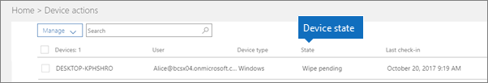

# Cihaz durumları

Bu makale diğer Microsoft 365 İş Ekstra.

**Cihaz eylemleri** listesindeki (Yönetim giriş sayfası \> **Cihaz eylemleri**) cihazlar aşağıdaki durumlarda olabilir.
  

  
|**Durum**|**Açıklama**|
|:-----|:-----|
|Intune tarafından yönetilen    |Tarafından Microsoft 365 İş Ekstra.    |
|Devre dışı bırakma bekliyor    |Microsoft 365 İş Ekstra verileri cihazdan kaldırmaya hazırlanıyor.    |
|Devre dışı bırakma sürüyor    |Microsoft 365 İş Ekstra şu anda cihazdan şirket verilerini kaldıran bir sistemdir.    |
|Devre dışı bırakma başarısız    | Şirket verilerini kaldırma işlemi başarısız oldu.    |
|Kaldır işlemi iptal edildi    |Kaldır eylemi iptal edildi.    |
|Temizleme işlemi beklemede    |Fabrika sıfırlamasının başlatılması bekleniyor.    |
|Temizleme işlemi sürüyor    |Fabrika sıfırlaması gönderildi.    |
|Temizleme başarısız oldu    |Fabrika sıfırlaması yapamadım.    |
|Temizleme işlemi iptal edildi    |Fabrika temizleme işlemi iptal edildi.    |
|Uygun olmayan durumda    |Bekleyen (veya devam eden) bir eylem var, ancak cihaz 30+ gün boyunca iade edildi.    |
|Silme bekliyor    |Silme eylemi bekliyor.    |
|Bulundu    |Microsoft 365 İş Ekstra cihazı algıladı.    |
   
