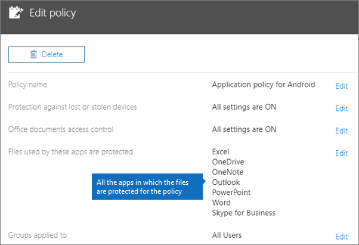
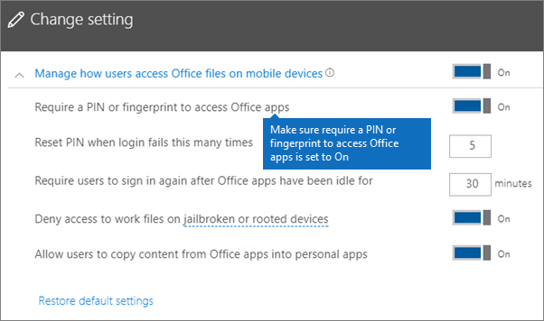
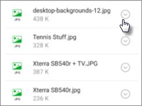

# Android veya iOS cihazlarda uygulama koruma ayarlarını doğrulama

> [!NOTE]
> İş için Microsoft Defender, 1 Mart 2022'de başlayarak Microsoft 365 İş Ekstra müşterilerine dağıtılıyor. Bu teklif, cihazlar için ek güvenlik özellikleri sağlar. [İş için Defender hakkında daha fazla bilgi edinin](../../security/defender-business/mdb-overview.md)

Android veya iOS cihazlarda uygulama koruma ayarlarını doğrulamak için aşağıdaki bölümlerde yer alan yönergeleri izleyin.
  
## Android
  
### Uygulama koruma ayarlarının kullanıcı cihazlarında çalışıp çalışmadığını denetleyin

Uygulamaları korumak [için Android veya iOS cihazlar için uygulama koruma ayarlarını ayarladıktan](../../business-premium/m365bp-app-protection-settings-for-android-and-ios.md) sonra, seçtiğiniz ayarların çalıştığını doğrulamak için bu adımları izleyebilirsiniz. 
  
İlk olarak, ilkenin doğruladığınız uygulamaya uygulandığından emin olun.
  
1. Microsoft 365 İş Ekstra [yönetim merkezinde](https://admin.microsoft.com) **İlkeleri** \> **Düzenleme ilkesi'ne** gidin.
    
2. Kurulum sırasında oluşturduğunuz ayarlar **için Android için Uygulama ilkesi'ni** veya oluşturduğunuz başka bir ilkeyi seçin ve örneğin Outlook için uygulandığını doğrulayın. 
    
    
  
### Office uygulamalarına erişim için PIN veya parmak izi isteme doğrulaması

**İlkeyi düzenle** bölmesinde **Office belgelerine erişim denetimi**'nin yanındaki **Düzenle**'yi seçin, **Kullanıcıların mobil cihazlardan Office dosyalarına erişimini yönet**'i genişletin ve **Office uygulamalarına erişim için PIN veya parmak izi iste** seçeneğinin **Açık** olduğundan emin olun.
  

  
1. Kullanıcının Android cihazında Outlook açın ve kullanıcının Microsoft 365 İş Ekstra kimlik bilgileriyle oturum açın.
    
2. Ayrıca PIN girmeniz veya parmak izi kullanmanız istenir.
    
    
  
### Birkaç başarısız girişimden sonra PIN sıfırlama doğrulaması

**İlkeyi düzenle** bölmesinde, **belgelere erişim denetimi Office** yanındaki **Düzenle'yi** seçin, **Kullanıcıların mobil cihazlarda Office dosyalara nasıl erişeceğini yönet'i** genişletin ve **başarısız deneme sayısı sonrasında PIN'i sıfırla seçeneğinin** bir sayı olarak ayarlandığından emin olun. Bu, varsayılan olarak 5'tir. 
  
1. Kullanıcının Android cihazında Outlook açın ve kullanıcının Microsoft 365 İş Ekstra kimlik bilgileriyle oturum açın.
    
2. İlke tarafından belirtilen sayıda yanlış PIN girin. PIN'i sıfırlamak için **PIN Deneme Sınırına Ulaşıldı** ifadesini belirten bir istem görürsünüz. 
    
    
  
3. **PIN'i Sıfırla**'ya basın. Kullanıcının Microsoft 365 İş Ekstra kimlik bilgileriyle oturum açmanız istenir ve ardından yeni bir PIN ayarlamanız gerekir.
    
### Kullanıcıları, tüm çalışma dosyalarını OneDrive İş'e kaydetmeye zorlama doğrulaması

**İlkeyi düzenle** bölmesinde **Kaybolmuş veya çalınmış cihaz koruması**'nın yanındaki **Düzenle**'yi seçin, **Cihaz kaybolursa veya çalınırsa çalışma dosyalarını koru**'yu genişletin ve **Kullanıcıları, tüm çalışma dosyalarını OneDrive İş'e kaydetmeye zorla** seçeneğinin **Açık** olduğundan emin olun.
  

  
1. Kullanıcının Android cihazında Outlook açın ve kullanıcının Microsoft 365 İş Ekstra kimlik bilgileriyle oturum açın ve istenirse bir PIN girin.
    
2. Eki olan bir e-posta açın ve ekin bilgilerinin yanındaki aşağı ok simgesine dokunun.
    
    
  
    Ekranın alt kısmında **Cihaza kaydedilemiyor** ifadesini görürsünüz. 
    
    
  
    > [!NOTE]
    > Şu anda Android için OneDrive İş'e kaydetme etkinleştirilmemiştir; dolayısıyla, yalnızca yerel olarak kaydetmenin engellendiğini görebilirsiniz. 
  
### Office uygulamaları şu kadar süre boşta kalırsa kullanıcıların yeniden oturum açmasını isteme doğrulaması

**İlkeyi düzenle** bölmesinde, **belgelere erişim denetimi Office** yanındaki **Düzenle'yi** seçin, **Kullanıcıların mobil cihazlarda Office dosyalara nasıl erişeceğini yönet'i** genişletin ve **Office uygulamalar boşta bırakıldıktan sonra kullanıcıların yeniden oturum açmasını gerektir** seçeneğinin birkaç dakika olarak ayarlandığından emin olun. Bu, varsayılan olarak 30 dakikadır. 
  
1. Kullanıcının Android cihazında Outlook açın ve kullanıcının Microsoft 365 İş Ekstra kimlik bilgileriyle oturum açın ve istenirse bir PIN girin.
    
2. Şimdi Outlook gelen kutusunu görüyor olmalısınız. Android cihazına en az 30 dakika (veya ilkede belirttiğinizden daha uzun bir süre) boyunca dokunmayın ve boşta beklemesini sağlayın. Cihaz büyük olasılıkla kararacaktır.
    
3. Android cihazda yeniden erişim Outlook.
    
4. Outlook yeniden erişebilmeniz için pin kodunuzu girmeniz istenir.
    
### Şifreli çalışma dosyalarını koruma doğrulaması

**İlkeyi düzenle** bölmesinde **Kaybolmuş veya çalınmış cihaz koruması**'nın yanındaki **Düzenle**'yi seçin, **Cihaz kaybolursa veya çalınırsa çalışma dosyalarını koru**'yu genişletin ve **Şifreli çalışma dosyalarını koru** seçeneğinin **Açık**, **Kullanıcıları, tüm çalışma dosyalarını OneDrive İş'e kaydetmeye zorla** seçeneğinin **Kapalı** olarak ayarlandığından emin olun.
  
1. Kullanıcının Android cihazında Outlook açın ve kullanıcının Microsoft 365 İş Ekstra kimlik bilgileriyle oturum açın ve istenirse bir PIN girin.
    
2. Birkaç resim dosyası eki içeren bir e-posta açın.
    
3. Kaydetmek için ekin bilgilerinin yanındaki aşağı ok simgesine dokunun.
    
    
  
4. Outlook'un cihazınızdaki fotoğraflara, medyaya ve dosyalara erişmesine izin vermeniz istenebilir. **İzin Ver**'e dokunun.
    
5. Ekranın en altında, **Cihaza Kaydet**'i seçin ve ardından **Galeri** uygulamasını açın. 
    
6. Listede şifrelenmiş bir fotoğraf (birden çok resim dosyası eki kaydettiyseniz daha fazla olabilir) görüyor olmalısınız. Resimler listesinde, ortasında beyaz bir dairenin içinde beyaz bir ünlem işareti bulunan gri bir kare olarak gösteriliyor olabilir.
    
    
  
## iOS
  
### Uygulama koruma ayarlarının kullanıcı cihazlarında çalışıp çalışmadığını denetleme

Uygulamaları korumak amacıyla [iOS cihazları için uygulama yapılandırmalarını ayarlayın](../../business-premium/m365bp-protection-settings-for-windows-10-devices.md) ve seçtiğiniz ayarların çalıştığını doğrulamak için aşağıdaki adımları izleyin. 
  
İlk olarak, ilkenin doğruladığınız uygulamaya uygulandığından emin olun.
  
1. Microsoft 365 İş Ekstra [yönetim merkezinde](https://admin.microsoft.com) **İlkeleri** \> **Düzenleme ilkesi'ne** gidin.
    
2. Kurulum sırasında oluşturduğunuz ayarlar **için iOS için Uygulama ilkesi'ni** veya oluşturduğunuz başka bir ilkeyi seçin ve örneğin Outlook için uygulandığını doğrulayın. 
    
    
  
### Office uygulamalarına erişmek için PIN istemeyi doğrulama

**İlkeyi düzenle** bölmesinde **Office belgelerine erişim denetimi**'nin yanındaki **Düzenle**'yi seçin, **Kullanıcıların mobil cihazlardan Office dosyalarına erişimini yönet**'i genişletin ve **Office uygulamalarına erişim için PIN veya parmak izi iste** seçeneğinin **Açık** olduğundan emin olun.
  

  
1. Kullanıcının iOS cihazında Outlook açın ve kullanıcının Microsoft 365 İş Ekstra kimlik bilgileriyle oturum açın.
    
2. Ayrıca PIN girmeniz veya parmak izi kullanmanız istenir.
    
    
  
### Birkaç başarısız girişimden sonra PIN sıfırlama doğrulaması

**İlkeyi düzenle** bölmesinde, **belgelere erişim denetimi Office** yanındaki **Düzenle'yi** seçin, **Kullanıcıların mobil cihazlarda Office dosyalara nasıl erişeceğini yönet'i** genişletin ve **başarısız deneme sayısı sonrasında PIN'i sıfırla seçeneğinin** bir sayı olarak ayarlandığından emin olun. Bu, varsayılan olarak 5'tir. 
  
1. Kullanıcının iOS cihazında Outlook açın ve kullanıcının Microsoft 365 İş Ekstra kimlik bilgileriyle oturum açın.
    
2. İlke tarafından belirtilen sayıda yanlış PIN girin. PIN'i sıfırlamak için **PIN Deneme Sınırına Ulaşıldı** ifadesini belirten bir istem görürsünüz. 
    
    
  
3. **Tamam**'a basın. Kullanıcının Microsoft 365 İş Ekstra kimlik bilgileriyle oturum açmanız istenir ve ardından yeni bir PIN ayarlamanız gerekir.
    
### Kullanıcıları, tüm çalışma dosyalarını OneDrive İş'e kaydetmeye zorlama doğrulaması

**İlkeyi düzenle** bölmesinde **Kaybolmuş veya çalınmış cihaz koruması**'nın yanındaki **Düzenle**'yi seçin, **Cihaz kaybolursa veya çalınırsa çalışma dosyalarını koru**'yu genişletin ve **Kullanıcıları, tüm çalışma dosyalarını OneDrive İş'e kaydetmeye zorla** seçeneğinin **Açık** olduğundan emin olun.
  

  
1. Kullanıcının iOS cihazında Outlook açın ve kullanıcının Microsoft 365 İş Ekstra kimlik bilgileriyle oturum açın ve istenirse bir PIN girin.
    
2. Ek içeren bir e-postayı açın ve eki açıp ekranın altındaki **Kaydet**'i seçin. 
    
    
  
3. OneDrive İş için yalnızca bir seçenek görüyor olmanız gerekir. Yoksa **Hesap Ekle'ye** dokunun ve **Depolama Hesabı Ekle ekranından OneDrive İş** seçin. İstendiğinde oturum açmak için son kullanıcının Microsoft 365 İş Ekstra sağlayın. 
    
    **Kaydet**'e tıklayıp **OneDrive İş**'i seçin.
    
### Office uygulamaları belirli bir süre boyunca boşta kalırsa kullanıcının tekrardan oturum açmasını istemeyi doğrulama

**İlkeyi düzenle** bölmesinde, **belgelere erişim denetimi Office** yanındaki **Düzenle'yi** seçin, **Kullanıcıların mobil cihazlarda Office dosyalara nasıl erişeceğini yönet'i** genişletin ve **Office uygulamalar boşta bırakıldıktan sonra kullanıcıların yeniden oturum açmasını gerektir** seçeneğinin birkaç dakika olarak ayarlandığından emin olun. Bu, varsayılan olarak 30 dakikadır. 
  
1. Kullanıcının iOS cihazında Outlook açın ve kullanıcının Microsoft 365 İş Ekstra kimlik bilgileriyle oturum açın ve istenirse bir PIN girin.
    
2. Şimdi Outlook gelen kutusunu görüyor olmanız gerekir. iOS cihazına en az 30 dakika (veya ilkede belirttiğinizden daha uzun bir süre) boyunca dokunmayın. Cihaz büyük olasılıkla kararır.
    
3. iOS cihazda yeniden erişim Outlook.
    
4. Outlook yeniden erişebilmeniz için pin kodunuzu girmeniz istenir.
    
### Şifreli çalışma dosyalarını koruma doğrulaması

**İlkeyi düzenle** bölmesinde **Kaybolmuş veya çalınmış cihaz koruması**'nın yanındaki **Düzenle**'yi seçin, **Cihaz kaybolursa veya çalınırsa çalışma dosyalarını koru**'yu genişletin ve **Şifreli çalışma dosyalarını koru** seçeneğinin **Açık**, **Kullanıcıları, tüm çalışma dosyalarını OneDrive İş'e kaydetmeye zorla** seçeneğinin **Kapalı** olarak ayarlandığından emin olun.
  
1. Kullanıcının iOS cihazında Outlook açın ve kullanıcının Microsoft 365 İş Ekstra kimlik bilgileriyle oturum açın ve istenirse bir PIN girin.
    
2. Birkaç resim dosyası eki içeren bir e-posta açın.
    
3. Eke dokunun ve sonrasında altındaki **Kaydet** seçeneğine dokunun. 
    
4. Giriş ekranından **Fotoğraflar** uygulamasını açın. Şifreli bir resmin (birden çok resim dosyası eki kaydettiyseniz daha fazla olabilir) kaydedildiğini, ancak şifrelenmiş olduğunu görürsünüz. 
    

## Ayrıca bkz.

[İş planları için Microsoft 365 güvenliğini sağlamaya yönelik en iyi yöntemler](../security-and-compliance/secure-your-business-data.md)