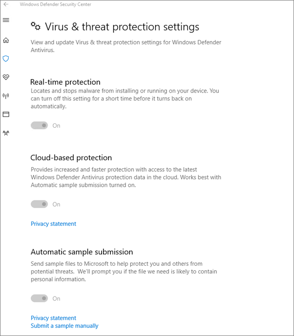

# Bilgisayarlar için cihaz koruma Windows 10 doğrulama

> [!NOTE]
> İş için Microsoft Defender 1 Mart 2022 Microsoft 365 İş Ekstra müşterilere sunulmaktadır. Bu teklif, cihazlar için ek güvenlik özellikleri sağlar. [İş için Defender hakkında daha fazla bilgi öğrenin](../../security/defender-business/mdb-overview.md).

## Cihaz ilkelerinin Windows 10 ayar olduğunu doğrulama

Cihaz [ilkelerini ayarladikten](protection-settings-for-windows-10-pcs.md) sonra, ilkenin kullanıcıların cihazlarında etkiliksi birkaç saat sürebilir. İlkelerin, kullanıcıların cihazlarında çeşitli ekranlara Windows Ayarlar ilkelerin etkili olduğunu onaylayın. Kullanıcılar mobil cihazlarında Windows Update Microsoft Defender Virüsten Koruma ayarlarını değiştire Windows 10, çoğu seçenek gri görünür.
  
1. Şu **ayarlara Ayarlar** \> **Update &amp; Windows** \> **Yeniden** \> **Başlatma seçenekleri'ne** gidin ve tüm ayarların gri renkte görüntü olduğunu onaylayın. 
    
    
  
2. Gelişmiş seçenekleri  **Ayarlar'e &amp;** \> **Windows'e** \> \> **gidin** ve tüm ayarların gri renkte görüntü olduğunu onaylayın. 
    
    
  
3. Güncelleştirme **Ayarlar-Posta** \> **Windows &amp;** \> **Güncelleştirme Gelişmiş seçenekleri** \> **Güncelleştirmelerin** \> **nasıl teslim edileceklerini seçin**.
    
    Bazı ayarların kuruluş tarafından gizlenmiş veya yönetilen bir ileti (kırmızı renkle) olduğunu ve tüm seçeneklerin gri renkte olduğunu onaylayın.
    
    
  
4. Güvenlik Merkezi'Windows Defender açmak için güvenlik **Ayarlar** \> **&amp;** \> Güncelleştirme'ye **Windows Defender** \> **Windows Defender** \> **&amp;** \> **&amp;** Virüsten Koruma Virüs tehdit koruması ayarlarını aç'a tıklayın. 
    
5. Tüm seçeneklerin gri renkte olduğunu doğrulayın. 
    
    
  
## İlgili içerik

[Microsoft 365 belgeleri ve kaynakları için belgeler](/admin)\
[PC'lerde cihaz Windows 10 yapılandırmalarını ayarlamaİsneden](protection-settings-for-windows-10-pcs.md)
 [iş planları için güvenlik Microsoft 365 10 yolu](../security-and-compliance/secure-your-business-data.md)