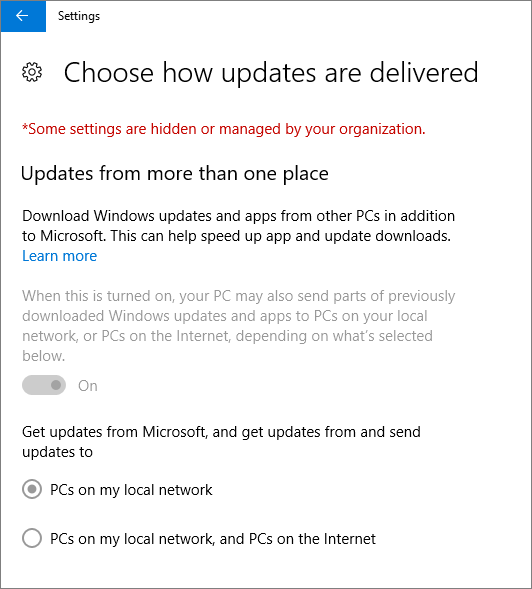

# Windows 10 bilgisayarlar için cihaz koruma ayarlarını doğrulama

> [!NOTE]
> İş için Microsoft Defender, 1 Mart 2022'de başlayarak Microsoft 365 İş Ekstra müşterilerine dağıtılıyor. Bu teklif, cihazlar için ek güvenlik özellikleri sağlar. [İş için Defender hakkında daha fazla bilgi edinin](../../security/defender-business/mdb-overview.md).

## Windows 10 cihaz ilkelerinin ayarlandığını doğrulayın

[Cihaz ilkelerini ayarladıktan](../../business-premium/m365bp-protection-settings-for-windows-10-pcs.md) sonra, ilkenin kullanıcıların cihazlarında etkili olması birkaç saat kadar sürebilir. Kullanıcıların cihazlarında çeşitli Windows Ayarlar ekranlarına bakarak ilkelerin geçerli olduğunu onaylayabilirsiniz. Kullanıcılar Windows 10 cihazlarında Windows Update ve Microsoft Defender Virüsten Koruma ayarlarını değiştiremeyeceğinden, birçok seçenek gri görünür.
  
1. **Ayarlar** \> Güvenliği \> **güncelleştir &amp;** **Windows Update** \> **Yeniden başlatma seçenekleri'ne** gidin ve tüm ayarların gri olduğunu onaylayın.

    
  
2. **Ayarlar** \> Güvenliği \> **güncelleştir &amp;** **Windows Update** \> **Gelişmiş seçenekler'e** gidin ve tüm ayarların gri olduğunu onaylayın.

    
  
3. **Ayarlar** \> **Güncelleştirme &amp; güvenliği** \> **Windows Update** \> **Gelişmiş seçenekler** \> **Güncelleştirmelerin nasıl teslim edilir seçin** bölümüne gidin.

    Bazı ayarların kuruluşunuz tarafından gizlendiğini veya yönetildiğini ve tüm seçeneklerin gri olduğunu belirten iletiyi (kırmızı) görebildiğinizi onaylayın.

    
  
4. Windows Defender Güvenlik Merkezi'ni açmak için **Ayarlar** \> **Güvenliği güncelleştir'e &amp;** \> gidin **Windows Defender** \> **Windows Defender Güvenlik Merkezi** \> **Virüs iş parçacığı koruması Virüs &amp;** **&amp; tehdit koruması**\> ayarlarını aç'a tıklayın.

5. Tüm seçeneklerin gri renkte olduğunu doğrulayın.

    
  
## İlgili içerik

[İş belgeleri ve kaynakları için Microsoft 365](/admin)

[Windows 10 pc'ler](../../business-premium/m365bp-protection-settings-for-windows-10-devices.md)
 için cihaz yapılandırmalarını ayarlama İş [planları için Microsoft 365 güvenliğini sağlamaya yönelik en iyi yöntemler](../../admin/security-and-compliance/secure-your-business-data.md)
