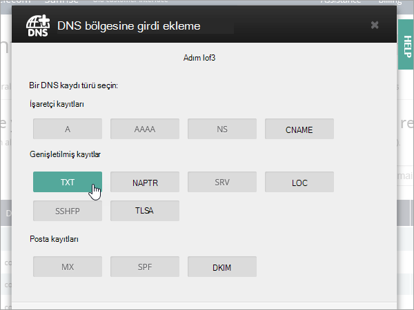

# OVH'deki DNS kayıtlarınızı Microsoft 365'e bağlama

Aradığınızı bulamazsanız, [Etki Alanları SSS sayfasını inceleyin](../setup/domains-faq.yml).

DNS barındırma sağlayıcınız OVH ise, etki alanınızı doğrulamak ve e-posta, Skype Kurumsal Online vb. için DNS kayıtlarını ayarlamak için bu makaledeki adımları izleyin.

OVH'de bu kayıtları ekledikten sonra, etki alanınız Microsoft hizmetleriyle çalışacak şekilde ayarlanır.

> [!NOTE]
> Genellikle, DNS değişikliklerinin etkili olması yaklaşık 15 dakika sürer. Bununla birlikte, yaptığınız değişikliğin İnternet'in DNS sistemi genelinde güncelleştirilmesi bazen daha uzun sürebilir. DNS kayıtlarını ekledikten sonra posta akışı sorunlarıyla veya başka sorunlarla karşılaşırsanız, [Etki alanı adınızı veya DNS kayıtlarınızı değiştirdikten sonra sorunları giderme](../get-help-with-domains/find-and-fix-issues.md) konusuna bakın.

## Doğrulama için bir TXT kaydı ekleme

Etki alanınızı Microsoft ile kullanmadan önce, etki alanına sahip olduğunuzdan emin olmamız gerekir. Etki alanı kayıt şirketinizde hesabınızda oturum açıp DNS kaydını oluşturabilmek, Microsoft'a etki alanının sahibi olduğunuzu kanıtlar.

> [!NOTE]
> Bu kayıt yalnızca etki alanının sahibi olduğunuzu doğrulamak için kullanılır; başka hiçbir şeyi etkilemez. Dilerseniz bu kaydı daha sonra silebilirsiniz.

1. Başlamak için [bu bağlantıyı](https://www.ovh.com/manager/) kullanarak OVH'deki etki alanları sayfanıza gidin. Oturum açmanız istenir.

    

1. Pano giriş sayfasındaki **Tüm etkinliğimi görüntüle'nin** altında, düzenlemek istediğiniz etki alanının adını seçin.

1. **DNS bölgesi'ne tıklayın**.

    

1. **Giriş ekle'yi** seçin.

    

1. **TXT'yi** seçin

    

1. Yeni kayıt kutularına, aşağıdaki tablodaki değerleri yazın ya da bu tablodan kopyalayıp yapıştırın. TTL değeri atamak için, açılan listeden **Özel'i** seçin ve metin kutusuna değeri yazın.

   |Kayıt türü|Alt etki alanı|TTL|Değer|
   |---|---|---|---|
   |TXT|(boş bırakın)|3600 (saniye)|MS=msxxxxxxxxx    **Not:** Bu bir örnektir. Burada, tablodan belirli **Hedef veya İşaret Edilen Adres** değerinizi kullanın.  [Bunu nasıl bulabilirim?](../get-help-with-domains/information-for-dns-records.md)|

1. **İleri**'yi seçin.

1. **Onayla'yı** seçin.

    

1. Yeni oluşturduğunuz kaydın İnternet genelinde güncelleştirilebilmesi için devam etmeden önce birkaç dakika bekleyin.

Artık kaydı etki alanı kayıt şirketinizin sitesine eklediğinize göre, Microsoft'a geri dönüp kaydı istemeniz gerekir. Microsoft doğru TXT kaydını bulduğunda etki alanınız doğrulanır.

Microsoft 365'te kaydı doğrulamak için:

1. Yönetim merkezinde **Ayarlar** \> <a href="https://go.microsoft.com/fwlink/p/?linkid=834818" target="_blank">**Etki Alanları'na**</a> gidin.

1. Etki Alanları sayfasında, doğrulamakta olduğunuz etki alanını seçin ve **kurulumu başlat'ı** seçin.

    :::image type="content" source="../../media/dns-IONOS/IONOS-DomainConnects-2.png" alt-text="Kurulumu başlat'ı seçin.":::

1. **Devam**'ı seçin.

1. **Etki alanını doğrula** sayfasında **Doğrula'yı** seçin.

> [!NOTE]
>  Genellikle, DNS değişikliklerinin etkili olması yaklaşık 15 dakika sürer. Bununla birlikte, yaptığınız değişikliğin İnternet'in DNS sistemi genelinde güncelleştirilmesi bazen daha uzun sürebilir. DNS kayıtlarını ekledikten sonra posta akışı sorunlarıyla veya başka sorunlarla karşılaşırsanız, [Etki alanı adınızı veya DNS kayıtlarınızı değiştirdikten sonra sorunları giderme](../get-help-with-domains/find-and-fix-issues.md) konusuna bakın.

## Etki alanınız için e-postanın Microsoft'a gelmesi için bir MX kaydı ekleyin

1. Başlamak için [bu bağlantıyı](https://www.ovh.com/manager/) kullanarak OVH'deki etki alanları sayfanıza gidin. Oturum açmanız istenir.

    

1. Pano giriş sayfasındaki **Tüm etkinliğimi görüntüle'nin** altında, düzenlemek istediğiniz etki alanının adını seçin.

1. **DNS bölgesi'ne tıklayın**.

    

1. **Giriş ekle'yi** seçin.

    

1. **MX'i** seçin.

    

1. Yeni kayıt kutularına, aşağıdaki tablodaki değerleri yazın ya da bu tablodan kopyalayıp yapıştırın. TTL değeri atamak için, açılan listeden **Özel'i** seçin ve metin kutusuna değeri yazın.

    > [!NOTE]
    > Varsayılan olarak OVH, hedef için göreli gösterimi kullanır ve bu da etki alanı adını hedef kaydın sonuna ekler. Bunun yerine mutlak gösterimi kullanmak için, aşağıdaki tabloda gösterildiği gibi hedef kayda bir nokta ekleyin.

   |Alt etki alanı|TTL|Öncelik|Hedef|
   |---|---|---|---|
   |(boş bırakın)|3600 (saniye)|0    Öncelik hakkında daha fazla bilgi için bkz. [MX önceliği nedir?](../setup/domains-faq.yml)|\<domain-key\>.mail.protection.outlook.com.    **Not:** Microsoft hesabınızdan alın *\<domain-key\>* . [Bunu nasıl bulabilirim?](../get-help-with-domains/information-for-dns-records.md)|

    

1. **İleri**'yi seçin.

    

1. **Onayla'yı** seçin.

    

1. **DNS bölgesi** sayfasındaki listedeki diğer MX kayıtlarını silin. Her kaydı seçin ve **Eylemler** sütununda çöp kutusu **Sil** simgesini seçin.

    

1. **Onayla'yı** seçin.

## Microsoft için gereken CNAME kaydını ekleme

1. Başlamak için [bu bağlantıyı](https://www.ovh.com/manager/) kullanarak OVH'deki etki alanları sayfanıza gidin. Oturum açmanız istenir.

    

1. Pano giriş sayfasındaki **Tüm etkinliğimi görüntüle'nin** altında, düzenlemek istediğiniz etki alanının adını seçin.

1. **DNS bölgesi'ne tıklayın**.

    

1. **Giriş ekle'yi** seçin.

    

1. **CNAME'i** seçin.

    

1. Yeni kayıt kutularına, aşağıdaki tablonun ilk satırındaki değerleri yazın ya da bu tablodan kopyalayıp yapıştırın. TTL değeri atamak için, açılan listeden **Özel'i** seçin ve metin kutusuna değeri yazın.

   |Alt etki alanı|TTL|Hedef|
   |---|---|---|
   |autodiscover|3600 (saniye)|autodiscover.outlook.com.|

    

1. **İleri**'yi seçin.

    

1. **Onayla'yı** seçin.

## SPF'nin gereksiz e-postaları önlemesine yardımcı olmak için TXT kaydı ekleme

> [!IMPORTANT]
> Bir etki alanına yönelik SPF için birden fazla TXT kaydına sahip olamazsınız. Etki alanınızda birden fazla SPF kaydı varsa bu durum, e-posta hatalarının yanı sıra teslimat ve istenmeyen posta sınıflandırma sorunlarına neden olabilir. Etki alanınız için zaten bir SPF kaydınız varsa, Microsoft için yeni bir tane oluşturmayın. Bunun yerine, her iki değer kümesini içeren  *tek*  bir SPF kaydına sahip olmak için gerekli Microsoft değerlerini geçerli kayda ekleyin.

1. Başlamak için [bu bağlantıyı](https://www.ovh.com/manager/) kullanarak OVH'deki etki alanları sayfanıza gidin. Oturum açmanız istenir.

    

1. Pano giriş sayfasındaki **Tüm etkinliğimi görüntüle'nin** altında, düzenlemek istediğiniz etki alanının adını seçin.

1. **DNS bölgesi'ne tıklayın**.

    

1. **Giriş ekle'yi** seçin.

    

1. **TXT'yi** seçin.

1. In the boxes for the new record, type or copy and paste the following values. TTL değeri atamak için, açılan listeden **Özel'i** seçin ve metin kutusuna değeri yazın.

   |Alt etki alanı|TTL|Değer|
   |---|---|---|
   |(boş bırakın)|3600 (saniye)|v=spf1 include:spf.protection.outlook.com -all <br/**Not:** Tüm aralıkların doğru kalması için bu girdiyi kopyalayıp yapıştırmanızı öneririz.|

    

1. **İleri**'yi seçin.

    

1. **Onayla'yı** seçin.

    

## Gelişmiş seçenek: Skype Kurumsal

Bu seçeneği yalnızca kuruluşunuz Microsoft Teams'in yanı sıra sohbet, konferans aramaları ve görüntülü aramalar gibi çevrimiçi iletişim hizmetleri için Skype Kurumsal kullanıyorsa belirtin. Skype için 4 kayıt gerekir: Kullanıcıdan kullanıcıya iletişim için 2 SRV kaydı ve oturum açmak ve kullanıcıları hizmete bağlamak için 2 CNAME kaydı.

### Gerekli iki SRV kaydını ekleme

1. Başlamak için [bu bağlantıyı](https://www.ovh.com/manager/) kullanarak OVH'deki etki alanları sayfanıza gidin. Oturum açmanız istenir.

    

1. Pano giriş sayfasındaki **Tüm etkinliğimi görüntüle'nin** altında, düzenlemek istediğiniz etki alanının adını seçin.

1. **DNS bölgesi'ne tıklayın**.

    

1. **Giriş ekle'yi** seçin.

    

1. **SRV'yi** seçin.

1. In the boxes for the new record, type or copy and paste the following values. TTL değeri atamak için, açılan listeden **Özel'i** seçin ve metin kutusuna değeri yazın.

   |Alt etki alanı|TTL (Saniye)|Öncelik|Ağırlık|Bağlantı noktası|Hedef|
   |---|---|---|---|---|---|
   |_sip._tls|3600 (s.)|100|1|443|sipdir.online.lync.com. **Bu değer nokta (.) ile bitmelidir.**>  **Not:** Tüm aralıkların doğru kalması için bu girdiyi kopyalayıp yapıştırmanızı öneririz.|
   |_sipfederationtls._tcp|3600 (s.)|100|1|5061|sipfed.online.lync.com. **Bu değer nokta (.) ile bitmelidir.**  **Not:** Tüm aralıkların doğru kalması için bu girdiyi kopyalayıp yapıştırmanızı öneririz.|

1. Diğer SRV kaydını eklemek için **Başka bir kayıt ekle'yi** seçin, tablonun bir sonraki satırında yer alan değerleri kullanarak bir kayıt oluşturun ve ardından **Kayıt oluştur'u** seçin.

> [!NOTE]
> Genellikle, DNS değişikliklerinin etkili olması yaklaşık 15 dakika sürer. Bununla birlikte, yaptığınız değişikliğin İnternet'in DNS sistemi genelinde güncelleştirilmesi bazen daha uzun sürebilir. DNS kayıtlarını ekledikten sonra posta akışıyla veya diğer sorunlarla karşılaşıyorsanız, bkz. [Etki alanınızı veya DNS kayıtlarınızı ekledikten sonra sorunları bulma ve düzeltme](../get-help-with-domains/find-and-fix-issues.md).

### Skype Kurumsal için gereken iki CNAME kaydını ekleme

1. Başlamak için [bu bağlantıyı](https://www.ovh.com/manager/) kullanarak OVH'deki etki alanları sayfanıza gidin. Oturum açmanız istenir.

    

1. Pano giriş sayfasındaki **Tüm etkinliğimi görüntüle'nin** altında, düzenlemek istediğiniz etki alanının adını seçin.

1. **DNS bölgesi'ne tıklayın**.

    

1. **Giriş ekle'yi** seçin.

    

1. **CNAME'i** seçin.

    

1. Yeni kayıt kutularına, aşağıdaki tablonun ilk satırındaki değerleri yazın ya da bu tablodan kopyalayıp yapıştırın. TTL değeri atamak için, açılan listeden **Özel'i** seçin ve metin kutusuna değeri yazın.

   |Alt etki alanı|TTL|Hedef|
   |---|---|---|
   |sip|3600 (s.)|sipdir.online.lync.com.    **Bu değer nokta (.) ile bitmelidir.**|
   |lyncdiscover|3600 (s.)|webdir.online.lync.com.    **Bu değer nokta (.) ile bitmelidir.**|

1. **İleri**'yi seçin.

    

1. **Onayla'yı** seçin.

1. Diğer CNAME kaydını ekleyin.

> [!NOTE]
> Genellikle, DNS değişikliklerinin etkili olması yaklaşık 15 dakika sürer. Bununla birlikte, yaptığınız değişikliğin İnternet'in DNS sistemi genelinde güncelleştirilmesi bazen daha uzun sürebilir. DNS kayıtlarını ekledikten sonra posta akışı sorunlarıyla veya başka sorunlarla karşılaşırsanız, [Etki alanı adınızı veya DNS kayıtlarınızı değiştirdikten sonra sorunları giderme](../get-help-with-domains/find-and-fix-issues.md) konusuna bakın.

## Gelişmiş seçenek: Microsoft 365 için Intune ve Mobil Cihaz Yönetimi

Bu hizmet, etki alanınıza bağlanan mobil cihazları güvenli ve uzaktan yönetmenize yardımcı olur. Mobil Cihaz Yönetimi, kullanıcıların cihazları hizmete kaydedebilmesi için iki CNAME kaydına ihtiyaç duyar.

### Mobile Cihaz Yönetimi için gereken iki CNAME kaydını ekleme

1. Başlamak için [bu bağlantıyı](https://www.ovh.com/manager/) kullanarak OVH'deki etki alanları sayfanıza gidin. Oturum açmanız istenir.

    

1. Pano giriş sayfasındaki **Tüm etkinliğimi görüntüle'nin** altında, düzenlemek istediğiniz etki alanının adını seçin.

1. **DNS bölgesi'ne tıklayın**.

    

1. **Giriş ekle'yi** seçin.

    

1. **CNAME'i** seçin.

    

1. Yeni kayıt kutularına, aşağıdaki tablonun ilk satırındaki değerleri yazın ya da bu tablodan kopyalayıp yapıştırın. TTL değeri atamak için, açılan listeden **Özel'i** seçin ve metin kutusuna değeri yazın.

   |Alt etki alanı|TTL|Hedef|
   |---|---|---|
   |enterpriseregistration   |3600 (s.)|enterpriseregistration.windows.net.    **Bu değer nokta (.) ile bitmelidir.**|
   |enterpriseenrollment|3600 (s.)|enterpriseenrollment-s.manage.microsoft.com.    **Bu değer nokta (.) ile bitmelidir.**|

1. **İleri**'yi seçin.

    

1. **Onayla'yı** seçin.

1. Diğer CNAME kaydını ekleyin.

> [!NOTE]
> Genellikle, DNS değişikliklerinin etkili olması yaklaşık 15 dakika sürer. Bununla birlikte, yaptığınız değişikliğin İnternet'in DNS sistemi genelinde güncelleştirilmesi bazen daha uzun sürebilir. DNS kayıtlarını ekledikten sonra posta akışı sorunlarıyla veya başka sorunlarla karşılaşırsanız, [Etki alanı adınızı veya DNS kayıtlarınızı değiştirdikten sonra sorunları giderme](../get-help-with-domains/find-and-fix-issues.md) konusuna bakın.