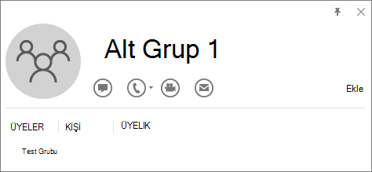

# Tümleşik uygulamalar portalında iş ortakları tarafından Microsoft 365 Uygulamaları test edin ve dağıtın

Microsoft 365 yönetim merkezi tek mağaza uygulamalarını, özel iş kolu uygulamalarını ve Microsoft 365 iş ortağı uygulamalarını tek bir konumdan dağıtma esnekliği sağlar. Konuma Tümleşik uygulamalar'daki Microsoft Yönetim merkezi ayarlarından erişilebilir. Tümleşik uygulamalar portalından Microsoft iş ortakları tarafından satın alınan ve lisanslı uygulamaları bulma, test etme ve tam olarak dağıtma olanağı, kuruluşunuzun iş hizmetlerini düzenli olarak güncel tutmak ve verimli bir şekilde çalışmasını sağlamak için gereken kolaylık ve avantajları sağlar.

Kuruluşunuz için iş ortaklarından uygulama satın alma ve lisanslama Microsoft 365 hakkında ek bilgi için bkz. [Microsoft 365 yönetim merkezi Microsoft 365 Uygulamaları yönetme ve dağıtma](https://techcommunity.microsoft.com/t5/microsoft-365-blog/manage-and-deploy-microsoft-365-apps-from-the-microsoft-365/ba-p/1194324).

İş ortaklarının bu uygulamaları nasıl oluşturduğu hakkında daha fazla bilgi için bkz. [Ticari market için SaaS teklifi planlama](https://go.microsoft.com/fwlink/?linkid=2158277)

Tümleşik uygulamalar portalına yalnızca genel yöneticiler erişebilir ve yalnızca dünya çapındaki müşteriler tarafından kullanılabilir. Bu özellik bağımsız ve kamu bulutlarında kullanılamaz.

Tümleşik uygulamalar portalı, kuruluşunuza dağıtılan iş ortaklarının tek uygulamalarını ve Microsoft 365 uygulamalarını içeren uygulamaların listesini görüntüler. Yalnızca web uygulamaları, SPFx uygulamaları, Office Eklentileri ve Teams uygulamaları listelenir. Web uygulamaları için iki tür uygulama görebilirsiniz.

- appsource.microsoft.com'de kullanılabilen ve kuruluş adına onay veren yöneticiler tarafından dağıtılabilir SaaS uygulamaları.
- Office eklentileriyle bağlantılı SAML galeri uygulamaları.

## Tümleşik uygulamalar portalında uygulamaları yönetme

İş ortaklarından satın alınan ve lisanslı Microsoft 365 Uygulamaları test ve dağıtımını yönetebilirsiniz.

1. Yönetim merkezinde **Ayarlar** ve ardından **Tümleşik uygulamalar'ı** seçin.

2. **Yönet** bölmesini açmak için **Diğer uygulamalar kullanılabilir** **durumunu** içeren bir uygulama seçin. **Kullanılabilir daha fazla uygulamanın** durumu, henüz dağıtılmamış ISV'lerden daha fazla tümleştirme olduğunu bilmenizi sağlar.

3. **Genel Bakış** sekmesinde **Dağıt'ı** seçin. Bazı uygulamalar, Dağıt'ı seçebilmek için önce kullanıcı eklemenizi gerektirir.

4. **Kullanıcılar'ı** seçin, **Bu bir test dağıtımı mı**, ardından **Tüm kuruluş**, **Belirli kullanıcılar/gruplar** veya **Yalnızca ben'i** seçin. Uygulamayı kuruluşun tamamına dağıtmak için beklemeyi tercih ediyorsanız **Dağıtımı test** et'i de seçebilirsiniz. Belirli kullanıcılar veya gruplar Microsoft 365 grubu, güvenlik grubu veya dağıtım grubu olabilir.

5. **Güncelleştir'i** ve ardından **Bitti'yi** seçin. Şimdi Genel Bakış sekmesinde Dağıt'ı seçebilirsiniz.

6. Uygulama bilgilerini gözden geçirin ve **dağıt'ı** seçin.

7. Dağıtım tamamlandı sayfasında **Bitti'yi** seçin ve **Genel Bakış** sekmesinde testin veya tam dağıtımın ayrıntılarını gözden geçirin.

8. Uygulamanın durumu **Güncelleştirme bekliyor** ise, yönet bölmesini açmak ve uygulamayı güncelleştirmek için uygulamaya tıklayabilirsiniz.

## Test ve tam dağıtım için yayımlanmış uygulamaları bulma

Tümleşik uygulamalar sayfasındaki listede henüz görünmeyen yayımlanmış uygulamaları bulabilir, test edebilir ve tam olarak dağıtabilirsiniz. Uygulamaları yönetim merkezinden satın alıp lisanslayarak, Microsoft ve Microsoft iş ortağı uygulamalarını tek bir konumdan listenize ekleyebilirsiniz.

1. Yönetim merkezinde, sol gezinti bölmesinde **Ayarlar** ve ardından <a href="https://admin.microsoft.com/adminportal/home?#/Settings/IntegratedApps" target="_blank">**Tümleşik uygulamalar'ı**</a> seçin.

2. Uygulamaların görünümünü almak için **Uygulamaları al'ı** seçin.

3. **Yayımlanan Microsoft 365 Uygulamaları** uygulamalar sayfasında Şimdi **edinin'i** seçerek dağıtmak istediğiniz uygulamayı seçin. Birincil olarak görüntülenen uygulamalar Word, PowerPoint, Excel, Outlook eklentileri, Teams uygulama ve SharePoint uygulamalarıdır (SharePoint Framework teknolojisine dayalıdır). İzinleri kabul edin ve **Devam'ı** seçin.

5. Dağıtılmayı beklemeyi belirten iletinin yanındaki sayfanın üst kısmında **Dağıt'ı** seçin.

    Seçilen uygulama bir ISV tarafından bir SaaS teklifine bağlıysa, bu bağlantılı teklifin parçası olan diğer tüm uygulamalar Yapılandırma sayfasında görünür. Tüm uygulamaları dağıtmayı seçerseniz **İleri'yi** seçin. Aksi takdirde **Düzenle'yi** seçin ve dağıtılmasını istediğiniz uygulamaları seçin. Bazı uygulamalar **, Dağıt'ı** seçebilmek için önce kullanıcı eklemenizi gerektirir.

6. **Kullanıcı ekle'yi** seçin, **Bu bir test dağıtımı mı**, ardından **Tüm kuruluş'u** veya **Belirli kullanıcılar/gruplar'ı** veya **Yalnızca ben'i** seçin.

    Belirli kullanıcılar/gruplar Microsoft 365 grubu, güvenlik grubu veya dağıtılmış grup olabilir. Uygulamayı kuruluşun tamamına dağıtmak için beklemeyi tercih ediyorsanız **Dağıtımı test** et'i de seçebilirsiniz.

7. **İzin isteğini kabul et** sayfasına gitmek için **İleri'yi** seçin. Uygulamaların her birinin uygulama özellikleri ve izinleri listelenir. Uygulamanın onayı gerekiyorsa **İzinleri kabul et'i** seçin. Yalnızca bir genel yönetici onay verebilir.

8. Dağıtımı gözden geçirmek için **İleri'yi** ve **ardından Dağıtımı bitir'i** seçin. Bu dağıtımı görüntüle'yi seçerek **Genel Bakış** **sekmesinden dağıtımı** görüntüleyebilirsiniz. Microsoft 365 yönetim merkezi, dağıtılan her uygulamanın durumunu ve uygulamayı dağıtılan tarihi görebilirsiniz.

> [!NOTE]
> Bir uygulama daha önce Tümleşik Uygulamalar portalı dışında bir yerden dağıtıldıysa **Dağıtım Türü** **Özel'dir.**

## Desteklenmeyen senaryolar

Aşağıdaki senaryolar için Tümleşik uygulamalar portalından iş ortağı tarafından tek bir mağaza uygulaması veya Microsoft 365 Uygulamaları dağıtamazsınız.

- Aynı eklenti birden fazla SaaS teklifine bağlıdır.
- SaaS teklifi eklentilere bağlıdır, ancak Microsoft Graph ile tümleştirilmez ve AAD Uygulama Kimliği sağlanmaz.
- SaaS teklifi eklentilere bağlıdır, ancak Microsoft Graph tümleştirmesi için sağlanan AAD Uygulama Kimliği birden çok SaaS teklifi arasında paylaşılır.

## Test ve tam dağıtım için özel iş kolu uygulamalarını Upload

1. Yönetim merkezinde, sol gezinti bölmesinde **Ayarlar** ve ardından **Tümleşik uygulamalar'ı** seçin.

2. **Özel uygulamalar Upload** seçin. Yalnızca Word, PowerPoint, Excel ve Outlook için özel bir uygulama satırı desteklenir.

3. Cihazınızdan bildirim dosyasını Upload veya bir URL bağlantısı ekleyin. Bazı uygulamalar, Dağıt'ı seçebilmek için önce kullanıcı eklemenizi gerektirir.

4. **Kullanıcı ekle'yi** seçin, **Bu bir test Dağıtımı mı**, **tüm kuruluş'u** veya **Belirli kullanıcılar/gruplar'ı** veya **Yalnızca ben'i** seçin.

    Belirli kullanıcılar/gruplar Microsoft 365 grubu, güvenlik grubu veya dağıtılmış grup olabilir. Uygulamayı kuruluşun tamamına dağıtmak için beklemek istiyorsanız **Dağıtımı test** et'i de seçebilirsiniz.

5. **İzin isteğini kabul et** sayfasına gitmek için **İleri'yi** seçin. Uygulamaların özellikleri ve izinleri listelenir. Uygulamanın onayı gerekiyorsa **İzinleri kabul et'i** seçin. Yalnızca bir genel yönetici onay verebilir.

6. Dağıtımı gözden geçirmek için **İleri'yi** ve **ardından Dağıtımı bitir'i** seçin. Bu dağıtımı görüntüle'yi seçerek **Genel Bakış** **sekmesinden dağıtımı** görüntüleyebilirsiniz.

## Tümleşik uygulamalarda eklentileri dağıtmaya hazırlanma

Office Eklentileri, belgelerinizi kişiselleştirmenize ve web'deki bilgilere erişme şeklinizi kolaylaştırmanıza yardımcı olur (bkz. Office Eklentinizi kullanmaya başlama). 

Eklentiler aşağıdaki avantajları sağlar: 

- İlgili Office uygulaması başlatıldığında eklenti otomatik olarak indirilir. Eklenti eklenti komutlarını destekliyorsa, eklenti otomatik olarak Office uygulamasının içindeki şeritte görünür. 

- Yönetici eklentiyi kapatır veya silerse veya kullanıcı Azure Active Directory veya eklentinin atandığı bir gruptan kaldırılırsa, eklentiler artık kullanıcılar için görünmez. 

Eklentiler, mac ve Çevrimiçi Office uygulamaları Windows üç masaüstü platformunda desteklenir. Ayrıca iOS ve Android 'de de desteklenir (Yalnızca Mobil Eklentiler Outlook). 

Tüm kullanıcılar için eklentinin istemcide görünmesi 24 saati bulabilir. 

Bugün hem Exchange Yöneticileri hem de Genel Yöneticiler Tümleşik uygulamalardan eklenti dağıtabilir.   

### Başlamadan önce

Eklentilerin dağıtımı için kullanıcıların Microsoft 365 İş lisansları (Business Basic, Business Standard, Business Premium), Office 365 Kurumsal lisansları (E1/E3/E5/F3) veya Microsoft 365 Kurumsal lisansları (E3/E5/F3) kullanmaları gerekir. Ayrıca kullanıcıların kuruluş kimliklerini kullanarak Office oturum açmaları ve Exchange Online ve etkin Exchange Online posta kutularına sahip olmaları gerekir. Abonelik dizininizin içinde veya Azure Active Directory federasyonda olması gerekir. 

Dağıtım aşağıdakileri desteklemez: 

- Office 2013'te Word, Excel veya PowerPoint'i hedef alan eklentiler 
- Şirket içi dizin hizmeti 
- Exchange Şirket İçi Posta Kutusuna Eklenti Dağıtımı 
- Bileşen Nesne Modeli (COM) veya Office için Visual Studio Araçları (VSTO) eklentilerinin dağıtımı. 
- İş için Microsoft 365 Uygulamaları ve Enterprise için Microsoft 365 Uygulamaları gibi Exchange Online içermeyen Microsoft 365 dağıtımları.  

### Office Gereksinimleri 

Word, Excel ve PowerPoint eklentileri için kullanıcılarınızın aşağıdakilerden birini kullanıyor olması gerekir: 
- Windows bir cihazda, Microsoft 365 İş lisanslarının Sürüm 1704 veya üzeri (Business Basic, Business Standard, Business Premium), Office 365 Kurumsal lisansları (E1/E3/E5/F3) veya Microsoft 365 Kurumsal lisansları (E3/E5/F3). 
- Mac'te Sürüm 15.34 veya üzeri. 

Outlook için kullanıcılarınızın aşağıdakilerden birini kullanıyor olması gerekir: 
- Microsoft 365 business lisanslarının (Business Basic, Business Standard, Business Premium), Office 365 Kurumsal lisanslarının (E1/E3/E5/F3) veya Microsoft 365 Kurumsal lisanslarının (E3/E5/F3) 1701 veya sonraki sürümleri. 
- Office Professional Plus 2019 veya Office Standard 2019 sürümü 1808 veya üzeri. 
- Office Professional Plus 2016 (MSI) veya Office Standard 2016 (MSI) sürüm 16.0.4494.1000 veya üzeri.
    > [!NOTE]
    > Outlook MSI sürümleri, yönetici tarafından yüklenen eklentileri "Eklentilerim" bölümünde değil uygun Outlook şeridinde gösterir.  
- Office Professional Plus 2013 (MSI) veya Office Standard 2013 (MSI) sürümü 15.0.4937.1000 veya üzeri.
- Office Mac 2016 sürüm 16.0.9318.1000 veya üzeri. 
- iOS için Outlook mobil sürüm 2.75.0 veya üzeri. 
- Android için Outlook mobil sürüm 2.2.145 veya üzeri. 

### Exchange Online gereksinimleri 
Microsoft Exchange, eklenti bildirimlerini kuruluşunuzun kiracısında depolar. Eklentileri dağıtan yönetici ve bu eklentileri alan kullanıcılar OAuth kimlik doğrulamasını destekleyen bir Exchange Online sürümünde olmalıdır. 

Kullanılan mevcut yapılandırmanın hangisi olduğunu öğrenmek için kuruluşunuzun Exchange yöneticisiyle görüşün. Kullanıcı başına OAuth bağlantısı, [Test-OAuthConnectivity](/powershell/module/exchange/test-oauthconnectivity) PowerShell cmdlet komutu kullanılarak doğrulanabilir. 

### Kullanıcı ve grup atamaları
Eklentinin dağıtımı şu anda Microsoft 365 grupları, dağıtım listeleri ve güvenlik grupları dahil olmak üzere Azure Active Directory tarafından desteklenen grupların çoğunda desteklenmektedir. Dağıtım, üst grup içermeyen üst düzey gruplardaki veya gruplardaki kullanıcıları destekler, ancak iç içe gruplardaki veya üst grupları olan gruplardaki kullanıcıları desteklemez. 

> [!NOTE]
> Posta hesabı etkin olmayan güvenlik grupları şu anda desteklenmemektedir. 

Aşağıdaki örnekte Sandra, Sheila ve Satış Departmanı grubu bir eklentiye atanmıştır. Batı Sahili Satış Bölümü iç içe bir grup olduğundan, Burak ve Ahmet hiçbir eklentiye atanmaz. 

### Bir grubun iç içe gruplar içerip içermediğini öğrenme

Bir grubun iç içe gruplar içerip içermediğini saptamanın en kolay yolu, Outlook içindeki kişi kartlarını görüntülemektir. E-postanın **Kime** alanına grup adını girer ve çözümlendiğinde grup adını seçerseniz, bu ad size kullanıcı veya iç içe gruplar içerip içermediğini gösterir. Aşağıdaki örnekte, Test Grubu için Outlook kişi kartının **Üyeler** sekmesinde, hiçbir kullanıcıyı olmadığı ve yalnızca iki alt grubu olduğu gösteriliyor. 

Grubun, herhangi bir grubun üyesi olup olmadığını öğrenmek için grubu çözerek ters sorgu da yapabilirsiniz. Aşağıdaki örnekte, Alt Grup 1'in Outlook kişi kartının <b>Üyelik</b> sekmesinde, Test Grubunun bir üyesi olduğunu görebilirsiniz. 

Azure Active Directory Graph API kullanarak bir grup içindeki grupların listesini bulmak üzere sorgu çalıştırabileceğinizi unutmayın. Daha fazla bilgi için bkz[. Gruplarda işlemler | başvuru Graph API](/previous-versions/azure/ad/graph/api/groups-operations). 

## Office Eklentileri dağıtmak için önerilen yaklaşım 
Aşamalı bir yaklaşım kullanarak eklentilerin dağıtımını yapmak için aşağıdakileri öneririz: 
1. Eklentiyi küçük bir iş paydaşları kümesine ve BT departmanının üyelerine dağıtın. **Bu bir test dağıtımı mı**? bayrağını açabilirsiniz. Dağıtım başarılı olursa 2. adıma geçin. 

2. Eklentiyi işletmedeki daha fazla kişiye dağıtın. Yine sonuçları değerlendirin ve başarılı olursa tam dağıtıma devam edin. 

3. Tüm kullanıcılar için tam dağıtım gerçekleştirin. **Bu bir Test dağıtımı mı**? bayrağını kapatın. 

Hedef kitlenin boyutuna bağlı olarak, dağıtım adımları ekleyebilir veya kaldırabilirsiniz.  

## Yönetim merkezini kullanarak Office Eklentisi dağıtma 

1. Yönetim merkezinde **Ayarlar** ve ardından **Tümleşik uygulamalar'ı** seçin. 

2. Sayfanın üst kısmındaki **Uygulama al'ı** seçin. AppSource ekli biçimde yüklenir. Bir eklentiyi arayın veya sol gezinti bölmesindeki Ürün'e tıklayarak bu eklentiyi bulun.  Eklenti ISV tarafından bir SaaS uygulamasına veya diğer uygulama ve eklentilere bağlıysa ve SaaS uygulaması ücretli bir uygulamaysa, lisansı satın almanız veya Dağıtmanız için bir iletişim kutusu gösterilir. Lisansı satın alıp almadığınızdan bağımsız olarak dağıtıma devam edebilirsiniz. **Dağıt'ı** seçin.  

3. Tüm uygulamaların listelendiği **Yapılandırma** sayfasını görürsünüz. Uygulamayı dağıtmak için izinleriniz veya doğru erişiminiz yoksa ilgili bilgiler vurgulanır. Dağıtmak istediğiniz uygulamaları seçebilirsiniz. **İleri'yi** seçerek **Kullanıcılar** sayfasını görüntülersiniz. Eklenti ISV tarafından bağlanmadıysa, Kullanıcılar sayfasına yönlendirilirsiniz. 

4. Eklentinin kime dağıtılacağını belirtmek için **Herkes**, **Belirli kullanıcılar/gruplar** veya **Yalnızca ben'i** seçin. Belirli kullanıcıları veya grupları bulmak için Arama kutusunu kullanın. Eklentiyi test ediyorsanız **Bu bir test dağıtımı mı**?'ı seçin. 

5. **İleri**'yi seçin. Uygulamanın Microsoft 365 sertifikası varsa tüm uygulama özellikleri ve izinleri tek bir bölmede ve sertifika bilgileriyle birlikte görüntülenir. Sertifikasyon logosunun seçilmesi, kullanıcının sertifika hakkında daha fazla ayrıntı görmesine olanak tanır.  

6. Gözden geçirin ve ardından **Dağıtımı bitir'i** seçin.  

7. Eklenti dağıtıldığında yeşil bir "onay işareti" simgesi görüntülenir. Eklentiyi test etmek için sayfadaki yönergeleri izleyin. 

> [!NOTE]
> Kullanıcıların uygulama şeridindeki eklenti simgesini görüntülemek için Office yeniden başlatmış olması gerekebilir. Outlook eklentilerin uygulama şeritlerinde görünmesi 24 saat kadar sürebilir. 

Kullanıcılara ve gruplara dağıtılan eklentinin kullanılabilir olduğunu bildirmek iyi bir uygulamadır. Eklentinin ne zaman ve nasıl kullanılacağını açıklayan bir e-posta göndermeyi göz önünde bulundurun. Kullanıcıların eklentiyle ilgili sorunları varsa yardımcı olabilecek yardım içeriğini veya SSS'leri ekleyin veya bu içeriğe bağlantı sağlayın. 

## Kullanıcılar ve gruplara eklenti atamayla ilgili önemli noktalar 

Genel yöneticiler ve Exchange yöneticileri herkese veya belirli kullanıcılara ve gruplara bir eklenti atayabilir. Her bir seçeneğin bir anlamı vardır: 

- **Herkes** Bu seçenek, eklentiyi kuruluştaki her kullanıcıya atar. Bu seçeneği kullanırken dikkatli olun ve yalnızca kuruluşunuz için gerçekten evrensel olan eklentiler için kullanın. 

- **Kullanıcı** Bir eklentiyi tek bir kullanıcıya atar ve sonra eklentiyi yeni bir kullanıcıya dağıtırsanız, önce yeni kullanıcıyı eklemeniz gerekir. 

- **Grup** Bir gruba eklenti atarsanız, gruba eklenen kullanıcılara otomatik olarak eklenti atanır. Bir kullanıcı gruptan kaldırıldığında, kullanıcı eklentiye erişimi kaybeder. Her iki durumda da yöneticiden ek işlem yapılması gerekmez. 

- **Sadece ben** Eklentiyi yalnızca kendinize atarsanız, eklenti yalnızca hesabınıza atanır ve bu da eklentiyi test etmek için idealdir. 

Kuruluşunuz için doğru seçenek yapılandırmanıza bağlıdır. Ancak, grupları kullanarak atamalar yapmanızı öneririz. Yönetici olarak, her seferinde tek tek kullanıcılar atamak yerine grupları kullanarak ve bu grupların üyeliğini denetleyerek eklentileri yönetmeyi daha kolay bulabilirsiniz. Bazı durumlarda, kullanıcıları el ile atayarak belirli kullanıcılara atamalar yaparak küçük bir kullanıcı kümesine erişimi kısıtlamak isteyebilirsiniz. 

### Office Eklentilerin güvenliği hakkında daha fazla bilgi 
Office Eklentileri, eklentiyle ilgili bazı meta verileri içeren bir XML bildirim dosyasını birleştirir, ancak en önemlisi tüm kodu ve mantığı içeren bir web uygulamasına işaret eder. Eklentiler, özellikleri açısından farklılık gösterebilir. Örneğin, şu işlemleri yapabilirler:
- Veri görüntüleme 
- Bağlamsal hizmet sağlamak amacıyla bir kullanıcının belgesini okuma 
- Kullanıcıya değer sağlamak amacıyla, kullanıcının belgesini okuma veya belgeye yazma  

Office Eklentilerin türleri ve özellikleri hakkında daha fazla bilgi için, özellikle de "Office Eklentisinin Anatomisi" bölümü Office [Eklentiler platformuna genel bakış](/office/dev/add-ins/overview/office-add-ins) bölümüne bakın. 

Eklentilerin kullanıcının belgeleriyle etkileşim kurabilmesi için, ihtiyaç duyduğu izinleri bildirim kısmında belirtmesi gerekir. Beş düzeyli JavaScript API erişim-izinler modeli, görev bölmesi eklentilerini kullananların gizliliğini ve güvenliğini sağlar. Office Mağazası eklentilerinin çoğu, ReadWriteDocument seviyesindedir ve neredeyse tüm eklentiler en az ReadDocument düzeyini destekler. İzin düzeyleri hakkında daha fazla bilgi için bkz. [İçerikte API kullanımı ve görev bölmesi eklentileri için izin isteme](/office/dev/add-ins/develop/requesting-permissions-for-api-use-in-content-and-task-pane-add-ins). 

Bildirim güncelleştirmeleri sırasında genellikle eklentinin simgesinde ve metninde değişiklik yapılır. Bazen eklenti komutları da değişebilir. Ancak eklenti izinleri değiştirilmez. Eklentiye dair tüm kod ve mantığın bulunduğu web uygulaması, tüm web uygulamalarında olduğu gibi, her an değişebilir. 

Eklentilerin güncelleştirmeleri aşağıdaki gibi olur: 
- İş kolu eklentisi: Bir **yöneticinin** açıkça bir bildirimi karşıya yüklediği bu durumda, eklenti, meta veri değişikliklerini desteklemek için yöneticinin yeni bir bildirim dosyası yüklemesini gerektirir. İlgili Office uygulamalarını tekrar başlattığınızda eklenti güncelleştirilir. Web uygulaması her an değişebilir. 

- **Office Store eklentisi**: Yönetici Office Store'dan bir eklenti seçtiğinde, Office Store'da bir eklenti güncelleştirilirse, ilgili Office uygulamaları bir sonraki başlatışında eklenti güncelleştirilir. Web uygulaması her an değişebilir. 

> [!NOTE]
> Word için, Excel ve PowerPoint, Microsoft 365 bağlantısı ve/veya SharePoint eklentileri için destek gerekmeyen şirket içi bir ortamdaki kullanıcılara eklenti dağıtmak için SharePoint [Uygulama Kataloğu](https://dev.office.com/docs/add-ins/publish/publish-task-pane-and-content-add-ins-to-an-add-in-catalog) kullanır. Outlook için Microsoft 365 bağlantısı olmadan şirket içi bir ortamda dağıtmak üzere Exchange denetim masası kullanın.  

## Eklenti durumları
Eklenti **Açık** veya **Kapalı** durumda olabilir. 

| Durum | Durum nasıl oluşur? | Etki |
|:-----|:-----|:-----|
|**Etkin**    |Yönetici, eklentiyi karşıya yükledi ve kullanıcılara veya gruplara atadı.    |Eklentiye atanan kullanıcılar ve gruplar bunu ilgili istemcilerde görür.    |
|**Kapalı**    |Yönetici eklentiyi kapattı.    |Eklentiye atanan kullanıcılar ve gruplar artık buna erişemez.    Eklenti durumu Etkin olarak değiştirilirse, kullanıcılar ve gruplar buna yeniden erişebilir.    |
|**Silindi**    |Yönetici eklentiyi sildi.    |Eklentiye atanan kullanıcılar ve gruplar artık buna erişemez.    |
 
Artık kimse kullanmıyorsa eklentiyi silmeyi göz önünde bulundurun. Örneğin, bir eklentinin yalnızca yılın belirli zamanlarında kullanılması durumunda eklentinin kapatılması mantıklı olabilir. 

## Yönetim merkezini kullanarak Office Eklentisini yönetme

Dağıtım sonrasında, yöneticiler eklentilere kullanıcı erişimini de yönetebilir. 

1. Yönetim merkezinde **Ayarlar** ve ardından **Tümleşik uygulamalar'ı** seçin. 
2. Tümleşik uygulamalar sayfasında, uygulamaların listesi, diğer uygulamalarla bağlantılı olan tek eklentiler veya eklentiler olacaktır. 
3. **Yönet** bölmesini açmak için **Diğer uygulamalar kullanılabilir** **durumunu** içeren bir uygulama seçin. **Kullanılabilir daha fazla uygulamanın** durumu, henüz dağıtılmamış ISV'lerden daha fazla tümleştirme olduğunu bilmenizi sağlar. 
4. **Genel Bakış** sekmesinde **Dağıt'ı** seçin. Bazı uygulamalar, Dağıt'ı seçebilmek için önce kullanıcı eklemenizi gerektirir. 
5. **Kullanıcılar'ı** seçin, **Bu bir test dağıtımı mı**, ardından **Tüm kuruluş**, **Belirli kullanıcılar/gruplar** veya **Yalnızca ben'i** seçin. Uygulamayı kuruluşun tamamına dağıtmak için beklemeyi tercih ediyorsanız **Dağıtımı test** et'i de seçebilirsiniz. Belirli kullanıcılar veya gruplar Microsoft 365 grubu, güvenlik grubu veya dağıtım grubu olabilir. 
6. **Güncelleştir'i** ve ardından **Bitti'yi** seçin. Şimdi **Genel Bakış** sekmesinde **Dağıt'ı** seçebilirsiniz. 
7. Uygulama bilgilerini gözden geçirin ve **dağıt'ı** seçin.
8. **Dağıtım tamamlandı** sayfasında **Bitti'yi** seçin ve **Genel Bakış** sekmesinde testin veya tam dağıtımın ayrıntılarını gözden geçirin. 
9. Uygulamanın durumu **Güncelleştirme bekliyor** ise, **yönet** bölmesini açmak ve uygulamayı güncelleştirmek için uygulamaya tıklayabilirsiniz. 
10. Yalnızca kullanıcıları güncelleştirmek için **Kullanıcılar** sekmesini seçin ve uygun değişikliği yapın. Değişikliklerinizi yaptıktan sonra **Güncelleştir'i** seçin.  

## Eklentiyi silme

Dağıtılan bir eklentiyi de silebilirsiniz.

1. Yönetim merkezinde **Ayarlar** ve ardından **Tümleşik uygulamalar'ı** seçin.
2. Yönetim bölmesini görüntülemek için herhangi bir satır seçin. 
3. **Yapılandırma** sekmesini seçin. 
4. Silmek istediğiniz eklentiyi seçin ve ardından **Kaldır'ı** seçin.  

> [!NOTE]
>  Eklenti başka bir yönetici tarafından dağıtıldıysa Kaldır düğmesi devre dışı bırakılır. Eklentiyi yalnızca uygulamayı dağıtan yönetici veya genel yönetici silebilir.

## Exchange yöneticisinin eklenti dağıtamadığı senaryolar 

bir Exchange Yöneticisinin eklenti dağıtamayacağı iki durum vardır:
- Bir eklentinin MS Graph API'leri için izin alması ve genel yöneticiden onay alması gerekiyorsa.
- Bir eklenti iki veya daha fazla eklentiye ve web uygulamasına bağlıysa ve bu eklentilerden en az biri başka bir yönetici (exchange/global) tarafından dağıtılıyorsa ve kullanıcı ataması tekdüzen değilse. Eklentilerin dağıtımına yalnızca kullanıcı ataması zaten dağıtılmış olan tüm uygulamalar için aynı olduğunda izin veririz.  

## Sık sorulan sorular

### Tümleşik uygulamalara erişmek için hangi yönetici rolüne ihtiyacım var?

Tümleşik Uygulamalara yalnızca genel yöneticiler erişebilir. Tümleşik uygulamalar diğer yöneticiler için sol gezinti bölmesinde gösterilmez.

### Sol gezinti bölmesinde Ayar'ın altında Eklenti'yi neden görüyorum ama Tümleşik uygulamalar'ı göremiyorum?

Bunun birkaç nedeni olabilir:

- Oturum açan yönetici bir Exchange yöneticisidir.
- Müşteri bağımsız buluttadır ve Tümleşik uygulamalar deneyimi henüz bağımsız bulut müşterilerinin kullanımına sunulmuştur.

### Tümleşik uygulamalardan hangi uygulamaları dağıtabilirim?

Tümleşik uygulamalar Web Apps, Teams uygulaması, Excel, PowerPoint, Word, Outlook eklentileri ve SPFx uygulamalarının dağıtımına olanak sağlar. Tümleşik uygulamalar, eklentiler için şirket içi Exchange posta kutularına değil çevrimiçi posta kutularına Exchange dağıtımı destekler.

### Yöneticiler uygulamaları silebilir veya kaldırabilir mi?

Evet. Genel yöneticiler uygulamaları silebilir veya kaldırabilir.

- Liste görünümünden bir uygulama seçin. **Yapılandırma** sekmesinde, hangi uygulamaların kaldırılacağını seçin.  

### Tümleşik uygulamalar bağımsız bulutta kullanılabilir mi?

Hayır. Tümleşik uygulamalar bağımsız bulut müşterilerinin kullanımına sunulmaz.

### Tümleşik uygulamalar kamu bulutlarında kullanılabilir mi?

Hayır. Tümleşik uygulamalar kamu bulutu müşterilerinin kullanımına sunulmaz.
