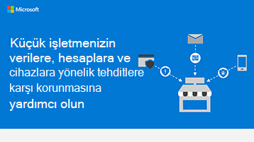

# Küçük işletmeler için güvenlik bilgileri grafiği

**Özet:** İşletmenizin yüzlerine tehdit olarak karşı karşıya olan temel terimleri ve verilerinizi, hesaplarınızı ve cihazlarınızı korumak için neler yapabilirim hakkında bilgi edinebilirsiniz. İşletmeler için Microsoft 365 yöneticisi olarak, işlerinizi daha güvenli hale etmeye ve her çalışana iş verilerinizi ve cihazlarınızı güvende tutma hakkında bilgi edinen yardımcı olun.

Aşağıdaki POWERPOINT PDF ve PDF bağlantıları tabloid biçiminde (genel muhasebe, 11 x 17 veya A3 olarak da bilinir) indirilebilir ve yazdırılabilir.

[PDF](downloads/smbthreatprotection-infographic.pdf) |  [PowerPoint](downloads/smbthreatprotection-infographic.pptx)
