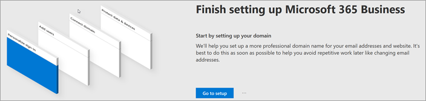
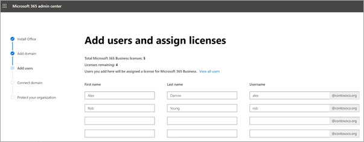

# Kurulum sihirbazında Microsoft 365 İş Ekstra ayarlama

## İzleyin: Microsoft 365 kurulumuna genel bakış

Microsoft 365 İş Ekstra kurulumuna genel bakış için bu videoyu izleyin.  

> [!VIDEO https://www.microsoft.com/videoplayer/embed/RE4jZwg] 

## İzleme: Microsoft 365 İş Ekstra ayarlama

> [!VIDEO https://www.microsoft.com/videoplayer/embed/RE471FJ?autoplay=false]

1. <a href="https://go.microsoft.com/fwlink/p/?linkid=2024339" target="_blank">Microsoft 365 yönetim merkezi</a> oturum açın ve **Kuruluma git'i** seçin. Kurulum sihirbazı başlatılır.
1. Kurulumunuz tamamlandıktan sonra Microsoft yönetim merkezine dönün. Yönetim merkezinde **kurulum** sayfasında Windows 10 ilkeleri, DLP vb. gibi özellikleri ayarlamaya devam edebilirsiniz.

## Etki alanınızı, kullanıcılarınızı ekleme ve ilkeleri ayarlama

Microsoft 365 İş Ekstra satın aldığınızda, sahip olduğunuz bir etki alanını kullanma veya [kayıt](../admin-overview/sign-up-for-office-365.md) sırasında bir etki alanı satın alma seçeneğiniz vardır.

- Kaydolduğunda yeni bir etki alanı satın aldıysanız, etki alanınız ayarlanmıştır ve [Kullanıcı ekle ve lisans ata'ya](#add-users-and-assign-licenses) geçebilirsiniz.

### Oturum açmayı kişiselleştirmek için etki alanınızı ekleme

1. Genel yönetici kimlik bilgilerinizi kullanarak [Microsoft 365 yönetim merkezi](https://admin.microsoft.com) oturum açın. 

2. Sihirbazı başlatmak **için Kuruluma git'i** seçin.

    

3. **Office uygulamalarınızı yükleyin** sayfasında, isteğe bağlı olarak uygulamaları kendi bilgisayarınıza yükleyebilirsiniz.
    
4. **Etki alanı ekle** adımında, kullanmak istediğiniz etki alanı adını girin (contoso.com gibi).

    > [!IMPORTANT]
    > Kayıt sırasında bir etki alanı satın aldıysanız, burada **Etki alanı ekle** adımını görmezsiniz. Bunun yerine [Kullanıcı ekle'ye](#add-users-and-assign-licenses) gidin.

    

    
4. Etki alanının sahibi olduğunuzu doğrulayan [Microsoft 365 için herhangi bir DNS barındırma sağlayıcısında DNS kayıtları oluşturma](/office365/admin/get-help-with-domains/create-dns-records-at-any-dns-hosting-provider) sihirbazındaki adımları izleyin. Etki alanı konağınızı biliyorsanız bkz. [Microsoft 365 için etki alanı ekleme](/microsoft-365/admin/setup/add-domain).

    Barındırma sağlayıcınız GoDaddy veya [etki alanı bağlantısı](/office365/admin/get-help-with-domains/domain-connect) etkinleştirilmiş başka bir konaksa işlem kolaydır ve otomatik olarak oturum açmanız ve Microsoft'un sizin adınıza kimlik doğrulaması yapmasına izin vermeniz istenir.

    

### Kullanıcı ekleme ve lisans atama

Sihirbaza kullanıcı ekleyebilirsiniz, ancak [daha sonra yönetim merkezinde de kullanıcı ekleyebilirsiniz](../add-users/add-users.md) . Ayrıca, yerel bir etki alanı denetleyiciniz varsa [Azure AD Bağlan](/azure/active-directory/hybrid/how-to-connect-install-express) ile kullanıcı ekleyebilirsiniz.

#### Sihirbaza kullanıcı ekleme

Sihirbaza eklediğiniz tüm kullanıcılara otomatik olarak bir Microsoft 365 İş Ekstra lisansı atanır.

1. Microsoft 365 İş Ekstra aboneliğinizde mevcut kullanıcılar varsa (örneğin, Azure AD Bağlan kullandıysanız), bunlara şimdi lisans atama seçeneğine sahip olursunuz. Bu kullanıcılara da lisans ekleyerek işleme devam edin.

2. Kullanıcıları ekledikten sonra, eklediğiniz yeni kullanıcılarla kimlik bilgilerini paylaşma seçeneğine de sahip olursunuz. Bunları yazdırabilir, e-posta ile gönderebilir veya indirebilirsiniz.

### Etki alanınızı bağlama

> [!NOTE]
> .onmicrosoft etki alanını kullanmayı seçtiyseniz veya kullanıcıları ayarlamak için Azure AD Bağlan kullandıysanız, bu adımı görmezsiniz.
  
Hizmetleri ayarlamak için DNS ana bilgisayarınızda veya etki alanı kayıt şirketinizde bazı kayıtları güncelleştirmeniz gerekir.
  
1. Kurulum sihirbazı, genellikle kayıt şirketinizi algılar ve kayıt şirketinin web sitesinde NS kayıtlarınızı güncelleştirmek için adım adım yönergelere ulaşabileceğiniz bir bağlantı verir. Ayarlamıyorsa, [herhangi bir etki alanı kayıt şirketiyle Microsoft 365 ayarlamak için ad sunucularını değiştirin](../get-help-with-domains/change-nameservers-at-any-domain-registrar.md). 

    - Dns kayıtlarınız varsa (örneğin, var olan bir web sitesi) ancak DNS ana bilgisayarınız [etki alanı bağlantısı](/office365/admin/get-help-with-domains/domain-connect) için etkinleştirildiyse **, Benim için kayıt ekle'yi** seçin. **çevrimiçi hizmetler seçin** sayfasında tüm varsayılanları kabul edin ve **İleri'yi** seçin ve DNS barındırma sağlayıcınızın sayfasında **Yetki ver'i** seçin.
    - Diğer DNS ana bilgisayarlarıyla (etki alanı bağlantısı için etkinleştirilmemiş) mevcut DNS kayıtlarınız varsa, mevcut hizmetlerin bağlı kalmasını sağlamak için kendi DNS kayıtlarınızı yönetmek istersiniz. Daha fazla bilgi için bkz. [etki alanı temelleri](/office365/admin/get-help-with-domains/dns-basics) .

        

2. Sihirbazdaki adımları izleyin; e-posta ve diğer hizmetler sizin için ayarlanır.

### Kuruluşunuzu koruma 

Sihirbazda ayarladığınız ilkeler, *Tüm Kullanıcılar* adlı bir [Güvenlik grubuna](/office365/admin/create-groups/compare-groups#security-groups) otomatik olarak uygulanır. Ayrıca, yönetim merkezinde ilke atamak için ek gruplar da oluşturabilirsiniz.

1. **Gelişmiş siber tehditlere karşı korumayı artırın** sayfasında, [Office 365 Gelişmiş Tehdit Koruması'nın Office](../../security/office-365-security/defender-for-office-365.md) uygulamalarındaki dosyaları ve bağlantıları taramasına izin vermek için varsayılanları kabul ettiğiniz önerilir.

    

2. **Hassas veri sızıntılarını engelle** sayfasında, Office uygulamalarda hassas verileri izlemek ve bunların kuruluşunuz dışında yanlışlıkla paylaşılmasını önlemek için Microsoft Purview Veri Kaybı Önleme'yi açmak için varsayılanları kabul edin.

3. Mobil uygulamalar **için Office'de verileri koru** sayfasında, mobil uygulama yönetimini açık bırakın, ayarları genişletin ve gözden geçirin ve ardından **Mobil uygulama yönetimi ilkesi oluştur'u** seçin.

    

## Güvenli Windows 10 bilgisayarları

Sol gezinti bölmesinde **Kurulum'u** seçin ve ardından **Oturum açma ve güvenlik** **bölümünden Windows 10 bilgisayarlarınızın güvenliğini sağlayın'ı** seçin. Başlamak için **Görünüm'ü** seçin. Tüm yönergeler için bkz. [Windows 10 bilgisayarlarınızın güvenliğini sağlama](secure-win-10-pcs.md).

## Office 365 istemci uygulamalarını dağıtma

Kurulum sırasında Office uygulamaları otomatik olarak yüklemeyi seçtiyseniz, kullanıcılar iş kimlik bilgilerini kullanarak Windows cihazlarından Azure AD'de oturum açtıktan sonra uygulamalar Windows 10 cihazlarına yüklenir.

mobil iOS veya Android cihazlara Office yüklemek için bkz. [Microsoft 365 İş Ekstra kullanıcılar için mobil cihazları ayarlama](set-up-mobile-devices.md).

ayrıca Office tek tek yükleyebilirsiniz. Yönergeler için bkz. [PC veya Mac'e Office yükleme](https://support.microsoft.com/office/4414eaaf-0478-48be-9c42-23adc4716658).

## İlgili içerik

[İş için Microsoft 365 eğitim videoları](../../business-video/index.yml) (bağlantı sayfası)
