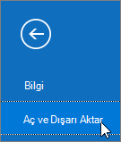

# E-posta ve kişileri Microsoft 365'e geçirme

YouTube'da [Microsoft 365 küçük işletme yardımına](https://go.microsoft.com/fwlink/?linkid=2197659) göz atın.

E-postayı Gmail'den veya başka bir e-posta sağlayıcısından Microsoft 365'e aktarma veya geçirme.
  
 **Bu konuda yardım ister misiniz?**  [İş için Microsoft 365 desteğine başvurun](../../business-video/get-help-support.md). 

> [!TIP]
> Bu konuda verilen adımlarla ilgili yardıma ihtiyacınız varsa[bir Microsoft küçük işletme uzmanıyla çalışmayı](https://go.microsoft.com/fwlink/?linkid=2186871) göz önünde bulundurun. İşletme Yardımı ile, işletmenizi büyütürken katılımdan gündelik kullanıma kadar her aşamada siz ve çalışanlarınız günün 24 saati küçük işletme uzmanlarına erişebilirsiniz.
  
Bu görev için masaüstünüzde yüklü bir Outlook sürümü kullanmanız gerekir. Outlook, Microsoft 365 [planlarının](https://go.microsoft.com/fwlink/p/?LinkId=723731) çoğuna dahildir.
  
## İzleyin: E-postayı içeri aktarma ve yeniden yönlendirme

[YouTube kanalımızda](https://go.microsoft.com/fwlink/?linkid=2197916) bu videoya ve diğer videolara göz atın.

> [!VIDEO https://www.microsoft.com/videoplayer/embed/40f7df36-9e24-44e5-8791-e9ed0dd8fd21?autoplay=false]

Microsoft 365'e kaydoldıktan sonra eski bir hesaba giden e-postanız olabilir; örneğin, iş için gmail veya Outlook hesabı kullandıysanız. Hem yeni hem de eski hesapları kullanmaya devam edebilir veya eski hesaptan verileri yeni hesabınıza aktarabilirsiniz.

## Gmail'i Microsoft 365'e geçirme

E-postayı, kişileri ve takvimi Gmail'den Microsoft 365 ile Outlook'a aktarmak veya geçirmek için şu adımları izleyin:
  
- [Gmail'i Outlook'a aktarma](https://support.microsoft.com/office/20fdb8f2-fed8-4b14-baf0-bf04b9c44bf7)
    
- [Kişileri Outlook'a aktarma](https://support.microsoft.com/office/bb796340-b58a-46c1-90c7-b549b8f3c5f8)
    
- [Google Takvim'i içeri aktarma](https://support.microsoft.com/office/098ed60c-936b-41fb-83d6-7e3786437330)

## İzleme: Takvimleri içeri aktarma
    
> [!VIDEO https://www.microsoft.com/videoplayer/embed/c1e45708-9a92-475b-910b-f5aa40614d92?autoplay=false]
  
## Outlook pst dosyalarını Microsoft 365'e (masaüstü) aktarma

E-postayı, kişileri ve takvimleri Outlook'tan .pst dosyasına aktarmak ve ardından bu dosyayı Microsoft 365 ile Outlook'a aktarmak için şu adımları izleyin:
  
1. [E-postayı, kişileri ve takvimi dışarı aktarma](https://support.microsoft.com/office/14252b52-3075-4e9b-be4e-ff9ef1068f91)
    
2. [Postayı, kişileri ve takvimi içeri aktarma](https://support.microsoft.com/office/431a8e9a-f99f-4d5f-ae48-ded54b3440ac)
    
Yalnızca kişileri istiyorsanız şu adımları izleyin:
  
1. [Kişileri Outlook'tan dışarı aktarma](https://support.microsoft.com/office/10f09abd-643c-4495-bb80-543714eca73f)
    
2. [Kişileri Outlook'a aktarma](https://support.microsoft.com/office/bb796340-b58a-46c1-90c7-b549b8f3c5f8)
    
İşlemi başlatmak için Outlook'u açın ve **Dosya** \> **Aç &amp; Dışarı Aktarma** **İçeri/Dışarı**\> Aktarma'yı seçin.
  

  
## Outlook'ta diğer e-posta hesaplarını görme

Outlook'ta başka bir sağlayıcıdan (Gmail, Yahoo veya Live.com gibi) gelen e-postalarınızı görmek mi istiyorsunuz? İçeri aktarmaya veya geçirmeye gerek yoktur. Diğer hesaplarınıza Microsoft 365 posta kutunuzla aynı yerden erişebilmek ve bu hesaplara gönderilen e-postaları göndermek, almak ve okumak için Outlook veya Outlook Web App ayarlayabilirsiniz.
  
### Outlook (masaüstü)

Outlook'a özel Gmail hesabınız gibi bir hesap ekleyin.
  
- Outlook'u açın, ardından **Dosya** \> **Ekle hesabı'na** gidin.
    
Daha ayrıntılı adımlara mı ihtiyacınız var? Bkz. [Hesap ekleme](https://support.microsoft.com/office/6e27792a-9267-4aa4-8bb6-c84ef146101b).
  

  
## Birden çok posta kutusu: Yöneticiler e-postayı, kişileri ve takvimleri Microsoft 365'e toplu olarak aktarabilir

Kaynak e-posta sisteminize bağlı olarak, çeşitli toplu geçiş yöntemleri arasından seçim yapabilirsiniz. Hangi yöntemin size uygun olduğunu belirlemek [için Birden çok e-posta hesabını Microsoft 365'e geçirmenin yolları](/Exchange/mailbox-migration/mailbox-migration) makalesini okuyun.

## İlgili içerik

[İş için Microsoft 365 kurulumunuzu planlama](plan-your-setup.md) (makale)\
[Office uygulamalarını yükleme](install-applications.md) (bağlantı sayfası)\
[Microsoft 365 yönetim merkezi genel bakış](Microsoft 365 yönetim merkezi genel bakış](.. /admin-overview/admin-center-overview.md) (video)