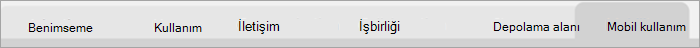

# Microsoft 365 kullanım analizinde raporlarda gezinin ve raporları kullanın

Panoda ana kullanım ve benimseme ölçümlerine ilişkin hızlı bir genel bakış sağlanır. En üst düzey ölçümleri seçerek, daha fazla ayrıntı ve içgörü sağlayan raporlara erişebilirsiniz. Her rapor sekmesi, kuruluşunuz için kullanım ve benimsemeye ilişkin verilerin belirli bir açıdan görselleştirmesini içerir. Toplanan veriler her raporun başlığında açıklanmıştır ve görüntülemekte olduğu rapor sekmesindeki görselleştirmeler hakkında daha fazla bilgi içeren bir kutucuk görüntülenir.

Raporlarınızla çalışmaya başlamak için birkaç ipucunu burada bulabilirsiniz:

- Her üst düzey rapora gitmek için Yönetim Özeti sayfasında sol veya ilgili bir  metrik üzerinde gezinti sekmelerini kullanın.

    

- Bu düzeydeki farklı raporlara gitmek için, her üst düzey raporun üst kısmında bulunan gezinti sekmelerini kullanın.

    

- Çoğu rapor, görüntülemek istediğiniz ürün, özellik özniteliği veya AAD üzerinde filtre uygulamanız gereken bir dilimleyici içerir. Bunlar tekli veya çoklu seçim olabilir.

    

    

- Ayrıntıları içeren bir açıklama balonunu görüntülemek için veri noktalarının üzerine gelin.

    

Şablon uygulamasının örneğini alan kullanıcı, raporu ihtiyaçlarına göre özelleştirebilme olanağına sahip olur. Şablon uygulamasını özelleştirmek için:

- Raporun **en üstünde** Raporu düzenle'yi seçin.

    

- Temeldeki [veri kümelerini](usage-analytics-data-model.md) kullanarak kendi görsellerinizi oluşturun.

- Kendi Power BI Desktop için başka kaynaklar kullanın.

Raporlarınızı paylaşmak için paylaş düğmesini seçmeniz  seçin.

Raporları nasıl özelleştireceğinizi öğrenmek için bkz: [Microsoft 365 kullanım analizinde raporları özelleştirme](customize-reports.md).

Power BI yardım belgelerinde çok daha fazla bilgi bulabilirsiniz:

- [Power BI kavramlar](/power-bi/service-basic-concepts)

    Pano, veri kümeleri, raporlar ve diğer kavramları Power BI öğrenin.

- [Power BI ile çalışmaya başlama](/power-bi/service-get-started?wt.mc_id=O365_Reports_PBI_contentpack)

    Power BI'daki temel işlevleri öğrenin. Power BI Masaüstü uygulamasının nasıl kullanılacağı ile ilgili bağlantılar bulun.

- [Panoları ve raporları paylaşma](/power-bi/service-share-dashboards)

    Raporları iş arkadaşlarınızla veya kuruluş dışındaki çalışanlarla nasıl paylaşabilirsiniz? Raporu veya raporun filtrelenmiş sürümünü de paylaşabilirsiniz.