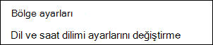
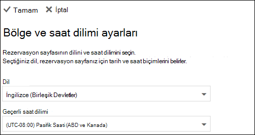

# Microsoft Bookings'te dil ve saat dilimlerini ayarlama

Microsoft Bookings kullanıyorsanız ve Bookings yanlış zamanda oluşturuldu ise saat dilimi ayarlarınızın değişmesi gerekebilir. Benzer şekilde, bazı rezervasyonlar yanlış dilde ise dil ayarlarınızı değiştirmeniz gerekebilir.

Bookings için iki ayrı dil ve saat dilimi ayarı vardır. İlk ayar, rezervasyon takviminin dilini ve saat dilimini kontrol eder ve oturum açan kullanıcının Web üzerinde Outlook takviminde varsayılan ayar kullanılarak ayarlanır. İkinci ayar, müşterilerin kullanmakta olduğu self servis rezervasyon sayfasını etkiler ve yalnızca o sayfa için dili ve saat dilimini kontrol eden "bölgesel ayarlar" sayfası kullanılarak ayarlanır.

## Rezervasyon takvimi için dil ve saat dilimi ayarlama

Rezervasyon takvimi, oturum açan kullanıcının dil ve saat dilimi ayarlarını kullanır. Örneğin, oturum açan kullanıcının saat dilimi Doğu Standart Saati (EST) olarak ayarlanmışsa, rezervasyon takvimi EST'de mevcut randevu başlangıç ve bitiş saatlerini gösterir. Bu saat dilimi başlangıçta kullanıcının kullanıcı hesabı ve Microsoft 365 Web üzerinde Outlook ayarlanmıştır.

Rezervasyon takviminin dilini ve saat dilimini ayarlamak için:

1. Giriş Microsoft 365 giriş sayfasında (aşağıdaki Outlook gösterildiği gibi) veya Uygulama Başlatıcı'da Microsoft 365 seçin.

   

1. Outlook açıldıktan sonra, kişisel ve hesap ayarlarınızı  açmak için ekranın sağ üst köşesindeki dişli simgesini seçin, ardından panel arama kutusunda "saat dilimi" **Ayarlar** seçin. Panel, bu hesap için geçerli kişisel dil ve saat dilimi ayarlarınızı gösterecek şekilde güncelleştirmesi gerekir. Yukarıda da belirtildiği gibi, bu ayar rezervasyon takviminin dilini ve saat dilimini de kontrol eder.

1. Dil veya Geçerli saat dilimi kutusunda aşağı açılan oku seçerek ve istediğiniz ayarı **seçerek** dili veya saat dilimini değiştirebilirsiniz.

1. **Kaydet**'e tıklayın. Uygulama Ayarlar, yeniden Web üzerinde Outlook başlatılır ve yeni dil ve saat dilimi ayarları uygulanır.

## Rezervasyon sayfasının dilini ve saat dilimini ayarlama

1. Uygulama Microsoft 365 başlatıcısını ve ardından **Bookings'i seçin**.

1. Gezinti bölmesinde Rezervasyon sayfası'ni **ve ardından Dil** ve **saat dilimi ayarlarını değiştir'i seçin**.

   

1. Dilinizi ve geçerli saat diliminizi seçin ve Tamam'ı seçin.

   
