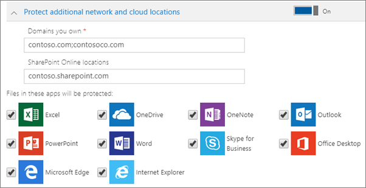

# Windows 10 cihazlara yönelik uygulama koruma ayarlarını belirlemeSet application protection settings for Windows 10 devices

Bu makale Microsoft 365 Business Premium için geçerlidir.This article applies to Microsoft 365 Business Premium.

## Windows 10 için uygulama yönetimi ilkesi oluşturmaCreate an app management policy for Windows 10

Kullanıcılarınızın işle ilgili görevleri gerçekleştirdikleri kişisel Windows 10 cihazları varsa, verilerinizi bu cihazlarda da koruma altına alabilirsiniz.If your users have personal Windows 10 devices on which they perform work tasks, you can protect your data on those devices as well.
  
1. 'deki yönetici merkezine <a href="https://go.microsoft.com/fwlink/p/?linkid=837890" target="_blank">https://admin.microsoft.com</a> gidin.Go to the admin center at <a href="https://go.microsoft.com/fwlink/p/?linkid=837890" target="_blank">https://admin.microsoft.com</a>. 
    
2. Sol daki gezinmede, **Aygıt** \> **İlkeleri** \> **Ekle'yi**seçin.On the left nav, choose **Devices** \> **Policies** \> **Add**.

3. **İlke ekle** bölmesinde bu ilke için benzersiz bir ad girin.On the **Add policy** pane, enter a unique name for this policy. 
    
4. **İlke türü**'nün altında **Windows 10 için Uygulama Yönetimi**'ni seçin.Under **Policy type**, choose **Application Management for Windows 10**.
    
5. **Cihaz türü altında,** **Kişisel** veya **Şirket Owned**seçin.Under **Device type**, choose either **Personal** or **Company Owned**.
    
6. **İş dosyalarını şifrele** seçeneği otomatik olarak açılır.The **Encrypt work files** is turned on automatically. 
    
7. Kullanıcıların çalışma dosyalarını kendi bilgisayarlarına kaydetmelerini istemiyorsanız, **Kullanıcıların şirket verilerini kişisel dosyalara kopyalamasını engelle ve çalışma dosyalarını OneDrive İş'e kaydetmelerini zorla** ilkesini **Açık** olarak ayarlayın.Set **Prevent users from copying company data to personal files and force them to save work files to OneDrive for Business** to **On** if you don't want the users to save work files on their PC. 
    
9. **Windows aygıtlarında verileri kurtar'ı**genişletin.Expand **Recover data on Windows devices**. **Açmanızı**öneririz.We recommend that you turn it **On**.
    
    Veri Kurtarma Aracısı sertifikasının konumuna göz atabilmek için önce bir tane oluşturmanız gerekir.Before you can browse to the location of the Data Recovery Agent certificate, you have to first create one. Talimatlar için [bkz.](https://go.microsoft.com/fwlink/p/?linkid=853700)For instructions, see [Create and verify an Encrypting File System (EFS) Data Recovery Agent (DRA) certificate](https://go.microsoft.com/fwlink/p/?linkid=853700).
    
    Varsayılan olarak iş dosyalarınız, cihazda depolanan ve kullanıcının profili ile ilişkilendirilmiş bir gizli anahtar kullanılarak şifrelenir.By default, work files are encrypted using a secret key that is stored on the device and associated with the user's profile. Yalnızca kullanıcı dosyanın şifresini çözebilir ve dosyayı açabilir.Only the user can open and decrypt the file. Bununla birlikte, cihaz kaybolursa veya kullanıcı kaldırılırsa, dosya şifrelenmiş halde kalabilir.However, if a device is lost or a user is removed, a file can be stuck in an encrypted state. Yönetici, dosyanın şifresini çözmek için Veri Kurtarma Aracısı (DRA) sertifikasını kullanabilir.An admin can use the Data Recovery Agent (DRA) certificate to decrypt the file.
    
    
  
10. Listelenen tüm uygulamalardaki dosyaların korunduğundan emin olmak için ek etki alanları veya SharePoint Online konumları eklemek istiyorsanız, **ek ağ ve bulut konumlarını** koruyun'u genişletin.Expand **Protect additional network and cloud locations** if you want to add additional domains or SharePoint Online locations to make sure that files in all the listed apps are protected. Alanlara birden çok öğe girmeniz gerekiyorsa, öğeler arasında noktalı virgül (;) kullanın.If you need to enter more than one item for either field, use a semicolon (;) between the items.
    
    
  
11. Next decide **Who will get these settings?** If you don't want to use the default **All Users** security group, choose **Change**, choose the security groups who will get these settings \> **Select**.Next decide **Who will get these settings?** If you don't want to use the default **All Users** security group, choose **Change**, choose the security groups who will get these settings \> **Select**.
    
12. Son olarak, **Ekle**'yi seçerek ilkeyi kaydedin ve cihazlarınıza atayın.Finally, choose **Add** to save the policy, and assign it to devices. 
