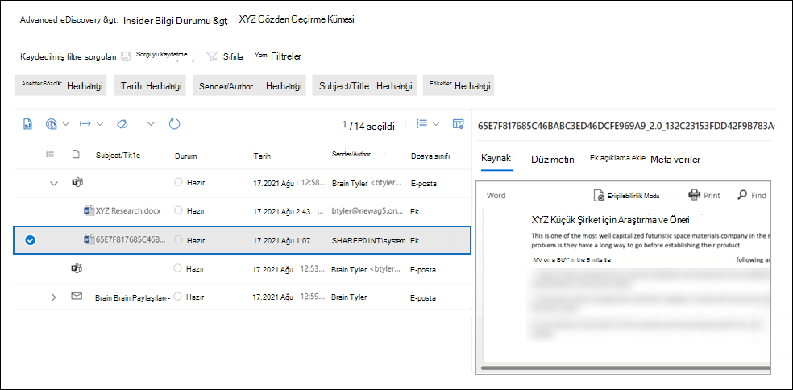

# E-postalarda bulut Advanced eDiscovery (önizleme) toplama

Bulut ekleri, genellikle site içinde veya başka bir SharePoint depolanan belgelere OneDrive. Dolayısıyla, e-posta iletisine veya sohbet görüşmesine bir Teams kopyasını eklemek yerine, dosyanın bağlantısını paylaşma seçeneğiniz vardır. Bulut ekleri, belgeleri paylaşmak ve organizasyonlu diğer kişiler ile işbirliği yapmak için etkili bir yol sağlar. Ancak eBulma iş akışı sırasında bulut ekleri, paylaşılan belgeye gerçek içeriği değil yalnızca bulut eki bağlantısı bir eBulma aramasinde döndürüleceği için zorluk gösterir. Bu soruna çözüm olarak, Advanced eDiscovery ekleri toplamak için iki çözüm sağlar:  

- Bulut eke bağlı bir belgenin canlı sürümünü toplama.

- Belgenin bir bulut eksinde paylaşılırken sürümünü toplama.

## Bulut eklerini toplama

Bir taslak koleksiyonu  oluşturmanıza ve arama sonuçlarında bulut ekleri içeren öğelere sahipseniz, taslak koleksiyonunu gözden geçirme kümesine işlerken bulut ekin hedefini toplama seçeneğiniz vardır. Bu seçeneği tercih ettiyseniz, Advanced eDiscovery bulut eke bağlı olan belgeleri gözden geçirme kümesine ekler. Bu, hedef belgeleri gözden geçirmenize ve belgenin olay veya incelemenize uygun olup olmadığını belirlemenizi sağlar.

Aşağıdaki ekran görüntüsünde, koleksiyonu gözden geçirme kümesine işlerken bulut eklerinin hedeflerini ekleme seçeneği gösterir.

> [!NOTE]
>- Advanced eDiscovery'da yeni  büyük/harf biçimini kullanıyorsanız, gözden geçirme kümesine bulut ekleri ekleme seçeneği varsayılan olarak seçilidir ve seçilmez. 
>- Ayrıca, bulut eklerinin tüm sürümlerini (paylaşılan sürüme ek olarak) gözden geçirme kümesine ekleme seçeneğiniz de vardır.  
Koleksiyonu gözden geçirme kümesine kaydetme yönergeleri için bkz. [Taslak koleksiyonunu gözden geçirme kümesine kaydetme](commit-draft-collection.md).

## Bulut eksinde paylaşılan sürümü toplama

Bulut Advanced eDiscovery toplamaya yönelik en iyi iş akışı, yalnızca bulut eklerinin en güncel sürümünü gözden geçirme kümesine eklemeyi içerir. Bu, bir gözden geçirme kümesinde toplanan ve eklenen sürümün, özgün olarak bulut eksinde paylaşılan sürümden farklı olduğu anlamına gelir. Dolayısıyla, bulut ekinde yer alan ve paylaşıldığı sırada bulut ekinde yer alan içerik kaldırılmış ve gözden geçirme kümesine eklenmiş olan geçerli sürümde yer almayabilirsiniz.

Kuruluşlar artık belgenin sürümünü bulut eki Microsoft 365 bir zamanda korumak için bekletme etiketlerini saklama seçeneğine sahiptir. Bunu yapmak için, organizasyonunız bir bekletme etiketi oluşturabilir, etiketi bulut eklere uygula seçeneğini belirleyin ve sonra etiketi otomatik olarak SharePoint ve OneDrive. Bu yapılandırmayı oluşturduktan sonra, dosya paylaşılırken belgenin bir kopyası oluşturulur. Ayrıca, belge değiştirilirse ve yeniden bulut eki olarak paylaşılırsa, değiştirilen sürüm de korunur. Dosya değiştirilir ve yeniden paylaşılırsa, dosyanın yeni bir sürümü olarak yeni bir kopyası korunur.

Bulut eklerinin paylaşılan sürümlerinin korunması, kurum gerek geçerli canlı sürüm yerine belgenin paylaşılan belirli sürümüyle ilgili olabilecek içeriğin korunmasına ve toplanmasına yardımcı olur. Bu bekletme çözümünü gerçekleştirdikten sonra, hem bulut eklerinin geçerli canlı sürümü hem de bulut ekte paylaşılan sürüm toplanır ve gözden geçirme kümesine eklenir.

Bir bekletme etiketini ayarlama ve bunu bulut eklerine otomatik olarak uygulama yönergeleri için bkz. Bulut eklerine [otomatik olarak etiket uygulama](apply-retention-labels-automatically.md#auto-apply-labels-to-cloud-attachments).

Aşağıdaki ekran görüntüsünde, gözden geçirme kümesine *eklenmiş olan XYZ Research.docx* adlı bir bulut eki belgesi yer aldı. Belge bir sohbet görüşmesinde bulut eki Teams paylaşıldı. Gözden geçirme kümesi, özgün olarak bulut eksinde paylaşılan sürümü de içerir. Bulut eklerinin bu sürümünün adının sistem tarafından oluşturulmuş olduğunu ve yazarın e-posta olarak **SharePoint.**

Buna ek olarak, geçerli canlı sürüm ve paylaşılan sürüm, üst nesnenin **FamilyId** değeriyle (e-posta iletisi veya sohbet görüşmesi gibi) aynı **FamilyId** özelliği Teams vardır. Bu sayede bulut eklerini, içinde paylaşıldıları öğeyle gruplandırabilirsiniz.

Bekletme etiketini uygulayan ve bu etiketi SharePoint belgelerine otomatik olarak uygulaytıktan sonra, taslak koleksiyonunu gözden geçirme kümesine işlerken bulut eklerini toplama seçeneğini yine seçersiniz. Bulut ekleri toplanıyorsa, hem geçerli canlı sürüm hem de başlangıçta paylaşılan sürüm gözden geçirme kümesine eklenir.
