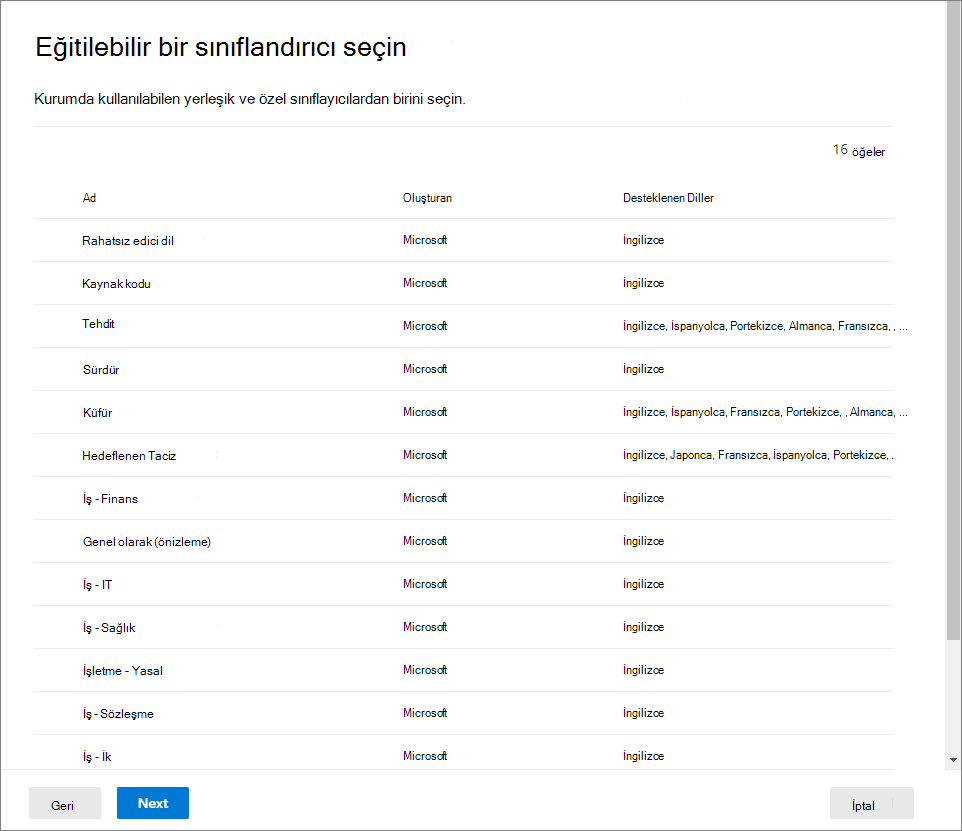

# <a name="automatically-apply-a-retention-label-to-retain-or-delete-content"></a>İçeriği tutmak veya silmek için otomatik olarak bekletme etiketi uygulama

>*[Microsoft 365 uyumluluğu için lisans & kılavuzu.](/office365/servicedescriptions/microsoft-365-service-descriptions/microsoft-365-tenantlevel-services-licensing-guidance/microsoft-365-security-compliance-licensing-guidance)*

> [!NOTE]
> Bu senaryo, SharePoint'ta belge [](records-management.md#records) kümesi veya kitaplık gibi bir düzenleme yapısı için yasal düzenlemelere veya varsayılan etiketlere ya da Exchange. Bu senaryolar için yayımlanmış [bir bekletme etiketi ilkesi gerekir](create-apply-retention-labels.md).

Bekletme etiketlerinin en güçlü [özelliklerinden biri, bunları](retention.md) belirtilen koşullarla eşleşen içeriğe otomatik olarak uygulayabilme özelliğidir. Bu durumda, kuruluşta olan kişilerin bekletme etiketlerini uygulamaları gerek değildir. Microsoft 365 onlar için bu işi yapar.
  
Bekletme etiketlerinin otomatik olarak uygulanması güçlü bir neden olduğundan:
  
- Kullanıcılarınızı tüm sınıflandırmalar için eğitmek zorunda değilsiniz.
    
- Tüm içeriği doğru şekilde sınıflandırmak için kullanıcılara güvenmeniz gerek değildir.
    
- Kullanıcıların artık veri yönetimi ilkeleri hakkında bilgileri olmalıdır; onlar da çalışmalarına odaklanabilirsiniz.
    
İçeriğin önceden bir bekletme etiketi uygulanmamışsa ve hassas bilgiler, anahtar sözcükler veya aranabilir özellikler ya da eğitilebilir sınıflandırıcılar için bir eşleşme içeriyorsa, bekletme etiketlerini içeriğe otomatik [olarak uygulayabilirsiniz](classifier-get-started-with.md). Artık önizlemede, bulutta veya başka dosyalarda depolanan bulut eklere otomatik olarak bir SharePoint etiketi OneDrive.

> [!TIP]
> Toplantı kayıtlarını ve duyarlılık [Teams olan öğeleri](#microsoft-teams-meeting-recordings) [tanımlamak için aranabilir özellikleri kullanın](#identify-files-and-emails-that-have-a-sensitivity-label).

Bekletme etiketini şu koşulları temel alarak otomatik olarak uygulama işlemleri:


İki yönetici adımı için aşağıdaki yönergeleri kullanın.

> [!NOTE]
> Otomatik ilkeler, öğelere bekletme etiketlerini otomatik olarak uygulamak için hizmet tarafı etiketlemeyi koşullarla kullanır. Ayrıca, şunları gerçekleştirseniz otomatik olarak etiket ilkesine sahip bir bekletme etiketi uygulayabilirsiniz: 
>
> - Bir çalışma belgesinde belge anlama modeline bekletme SharePoint Syntex
> - SharePoint ve Outlook için varsayılan bekletme Outlook
> - Bekletme kurallarını kullanarak e-postaya bekletme Outlook uygulama
>
> Bu senaryolar için bkz [. Bekletme etiketlerini yayımlama ve bunları uygulamalarda uygulama](create-apply-retention-labels.md).

## <a name="before-you-begin"></a>Başlamadan önce

Kuruluşun genel yöneticisinin bekletme etiketlerini ve ilkelerini oluşturma ve düzenlemeye yönelik tam izinleri vardır. Genel yönetici olarak oturum açmadısanız, kullandığınız çözüme bağlı olarak kayıt yönetimi veya bilgi [](get-started-with-records-management.md#permissions) yönetimi için izin [](get-started-with-information-governance.md#permissions-for-retention-policies-and-retention-labels)bilgilerine bakın.

Öğelere uygulamak [istediğiniz bekletme etiketlerini](file-plan-manager.md#create-retention-labels) oluşturduğunuzdan emin olun.

## <a name="how-to-create-an-auto-apply-retention-label-policy"></a>Otomatik uygulama bekletme etiketi ilkesi oluşturma

Bekletme etiketi ilkenizi uyarlanabilir mi yoksa statik mi olacağını **oluşturmadan** önce karar **verin**. Daha fazla bilgi için bkz. [Bekletme için uyarlanabilir veya statik ilke kapsamları](retention.md#adaptive-or-static-policy-scopes-for-retention). Uyarlanabilir bir ilke kullanmaya karar verdiyseniz, bekletme etiketi ilkenizi oluşturmadan önce bir veya birden çok uyarlanabilir kapsam oluşturmanız ve ardından bekletme etiketi ilkesi oluşturma işlemi sırasında bu kapsamları seçmeniz gerekir. Yönergeler için bkz. [Uyarlanabilir kapsamlar için yapılandırma bilgileri](retention-settings.md#configuration-information-for-adaptive-scopes).

Otomatik uygulama ilkesi  oluşturmada, belirttiğiniz koşulları temel alarak otomatik olarak içeriğe uygulanacak bir bekletme etiketi seçersiniz.

1. Gezinti [Microsoft 365 uyumluluk merkezi](https://compliance.microsoft.com/) konumlardan birini seçin:
    
    - Kayıt yönetimini kullanıyorsanız:
        - **Çözümler** >  **Otomatik > >** **için Kayıt** yönetimi > **İlkeler sekmesi**
    
    - Bilgi idaresi kullanıyorsanız:
        - **Çözümler** >  **Bilgi yönetimi** >  **Otomatik olarak** etiket > **için Etiket ilkeleri sekmesi**
    
    Çözümlerinizi gezinti bölmesinde hemen görmüyor musunuz? Önce, Hepsini **göster'i seçin**.

2. Bu otomatik etiket ilkesi için bir ad ve açıklama girin ve ardından Sonraki'yi **seçin**.

3. Bu **etiketi uygulamak istediğiniz içerik türünü seçin için**, kullanılabilir koşullardan birini seçin. Seçenekler hakkında daha fazla bilgi için bu sayfanın Bekletme [etiketlerini otomatik olarak uygulama için koşulları](#configuring-conditions-for-auto-apply-retention-labels) yapılandırma bölümüne bakın.

4. Oluşturulecek **bekletme ilkesi türünü seçin sayfasında**, Başlamadan önce yönergelerinden seçime bağlı olarak Uyarlanabilir veya [Statik'i](#before-you-begin) seçin. Uyarlanabilir kapsamları daha önce oluşturmadıysanız Uyarlanabilir'i  seçebilirsiniz, ancak seçecek herhangi bir uyarlanabilir kapsam çalışmay olduğundan sihirbazı bu seçenekle bitiresiniz.

5. Seçtiğiniz kapsama bağlı olarak:
    
    -  Uyarlanabilir'i seçtiyseniz: Uyarlanabilir ilke kapsamlarını ve konumlarını seçin sayfasında  Kapsam ekle'yi seçin ve oluşturulmuş bir veya birden çok uyarlanabilir kapsam seçin. Ardından bir veya daha fazla konum seçin. Seçebilirsiniz konumlar, eklenen kapsam [türlerine bağlıdır](retention-settings.md#configuration-information-for-adaptive-scopes) . Örneğin, yalnızca bir Kullanıcı kapsamı türü eklediysanız **,** e-postayla ilgili e-Exchange **seçebilirsiniz** ancak **SharePoint seçebilirsiniz**. 
    
    - Statik: **Konum** seçin **sayfasında** konumların herhangi birini açıp kapatın. Her konum için, ilkeyi varsayılan olarak bırakarak ilkeyi [](retention-settings.md#a-policy-that-applies-to-entire-locations)konumun tamamına uygulayabilir ya da içerir ve [dışarıda bırakır](retention-settings.md#a-policy-with-specific-inclusions-or-exclusions)
    
    Konum seçenekleri hakkında daha fazla bilgi için bkz. [Konumlar](retention-settings.md#locations).

6. Bir bekletme etiketi seçmek için sihirbazda istemleri izleyin ve sonra yapılandırma tercihlerinizi gözden geçirerek gönderin.

Var olan bir bekletme etiketi ilkesi düzenlemek için (ilke türü Otomatik Uygula'dır **), ilkeyi** seçin ve sonra da Düzenle  seçeneğini seçerek Bekletme ilkesi **yapılandırmasını düzenleyin**.

İçerik otomatik uygula etiket ilkesi kullanılarak etiket yapıldıktan sonra, uygulanan etiket, içeriği veya ilkeyi değiştirerek veya yeni bir otomatik uygulama etiket ilkesiyle otomatik olarak kaldırılamaz veya değiştirilemez. Daha fazla bilgi için bkz [. Bir defada tek bir bekletme etiketi](retention.md#only-one-retention-label-at-a-time).

> [!NOTE]
> Otomatik uygulama bekletme etiketi ilkesi hiçbir zaman içeriğe uygulanmış var olan bir bekletme etiketinin yerini tutmaz. Yapılandırılan koşulları kullanarak içeriği yeniden etiketlemek için geçerli bekletme etiketini var olan içerikten el ile kaldırmanız gerekir.

### <a name="configuring-conditions-for-auto-apply-retention-labels"></a>Bekletme etiketlerini otomatik olarak uygulamak için koşulları yapılandırma

Bekletme etiketlerini, içerik şu içerikler içerdiğinde otomatik olarak içeriğe uygulayabilirsiniz:

- [Belirli türlerde hassas bilgi](#auto-apply-labels-to-content-with-specific-types-of-sensitive-information)

- [Bir sorguyla eşan belirli anahtar sözcükler veya aranabilir özellikler](#auto-apply-labels-to-content-with-keywords-or-searchable-properties)

- [Eğitilebilir sınıflayıcılar için bir eşleşme](#auto-apply-labels-to-content-by-using-trainable-classifiers)

Ya da bekletme etiketlerini yeni paylaşılan bulut eklere [otomatik olarak uygulayabilirsiniz](#auto-apply-labels-to-cloud-attachments).

Bekletme etiketlerini hassas bilgiler, anahtar sözcükler veya aranabilir özelliklere veya eğitilebilir sınıflayıcılara göre otomatik olarak uygulanacak şekilde yapılandırıyorken, bekletme etiketlerinin ne zaman otomatik olarak uygulana olacağını belirlemek için aşağıdaki tabloyu kullanın.

Exchange:

|Koşul|Geçişteki (gönderilen veya alınan) öğeler |Var olan öğeler (kalan veriler)|
|:-----|:-----|:-----|
|Hassas bilgi türleri - yerleşik| Evet | Hayır |
|Hassas bilgi türleri - özel| Evet | Hayır |
|Belirli anahtar sözcükler veya aranabilir özellikler| Evet |Evet |
|Eğitime uygun sınıflayıcılar| Evet | Evet (yalnızca son altı ay) |

SharePoint ve OneDrive:

|Koşul|Yeni veya değiştirilmiş öğeler |Var olan öğeler |
|:-----|:-----|:-----|
|Hassas bilgi türleri - yerleşik| Evet | Evet |
|Hassas bilgi türleri - özel| Evet | Hayır |
|Belirli anahtar sözcükler veya aranabilir özellikler| Evet |Evet |
|Eğitime uygun sınıflayıcılar| Evet | Evet (yalnızca son altı ay) |

Buna SharePoint, taslakta olan veya hiç yayımlanmış olmayan öğeler de bu senaryo için destek desteklemez.

#### <a name="auto-apply-labels-to-content-with-specific-types-of-sensitive-information"></a>Belirli türdeki hassas bilgilere sahip içeriğe otomatik etiket uygulama

> [!IMPORTANT]
> Hassas bilgileri tanımarak otomatik olarak uygulayan e-postalar için, tüm posta kutuları otomatik olarak eklenir. Bu, posta kutularının gelen Microsoft 365 içerir.
> 
> Her ne kadar grup posta kutuları genellikle **Microsoft 365 Grupları** konumu seçerek dahil edilirse de, bu belirli ilke yapılandırması için grupların konumu yalnızca SharePoint grupların Microsoft 365 içerir.

Hassas bilgiler için otomatik uygula bekletme etiketi ilkeleri ekleyebilirsiniz ve bu şablonlarda veri kaybı önleme (DLP) ilkesi oluşturmayla aynı ilke şablonları listesi görüntülenir. Her şablon belirli türde hassas bilgileri aramanız için önceden yapılandırılmıştır. Aşağıdaki örnekte, hassas bilgi türleri Gizlilik kategorisine ve ABD Kişisel  Bilgileri **(PII) Verileri şablonuna göredir**:


Duyarlılık bilgi türleri hakkında daha fazla bilgi edinmek için bkz[. Hassas bilgi türleri hakkında bilgi.](sensitive-information-type-learn-about.md#learn-about-sensitive-information-types) Şu anda [, bu senaryo için hassas bilgi türleri ve](sit-learn-about-exact-data-match-based-sits.md#learn-about-exact-data-match-based-sensitive-information-types) belge parmak izi [tanıma hakkında](document-fingerprinting.md) tam eşleşme hakkında bilgi edinebilirsiniz.

İlke şablonunu seçdikten sonra, herhangi bir tür hassas bilgi ekleyebilir veya kaldırabilir, güvenlik düzeyini ve örnek sayısını değiştirebilirsiniz. Önceki örnek ekran görüntüsünde, bekletme etiketinin yalnızca şu zamanlarda otomatik olarak uygulanması için bu seçenekler değiştirilmiştir:
  
- Algılanan hassas bilgilerin türünün eşleşme doğruluğu (veya güven [düzeyi) en](sensitive-information-type-learn-about.md#more-on-confidence-levels) azından iki hassas bilgi türü için Orta güven ve bir  tane için yüksek **güven düzeyi vardır**. Birçok hassas bilgi türü birden çok modelle tanımlanır; burada daha yüksek bir eşleşme doğruluğuna sahip bir desenin bulun olması için daha fazla kanıt (örneğin anahtar sözcükler, tarihler veya adresler) gerekirken, daha düşük bir eşleşme doğruluğuna sahip bir desen için daha az kanıt gerekir. Güven düzeyi ne kadar düşüktür, içeriğin koşulla eşleşmesi o kadar kolay olur, ancak daha fazla yanlış pozitif sonuç için olasıdır.

- İçerikte, bu üç hassas bilgi türü arasında 1 ile 9 örneği vardır. Varsayılan değer Olarak **Değeri'dir**.

Bu seçenekler hakkında daha fazla bilgi için, DLP belgelerinin Uymalarını kolaylaştıracak veya zorlaştıracak ayarlama kuralları [ile ilgili aşağıdaki kılavuza bakın](data-loss-prevention-policies.md#tuning-rules-to-make-them-easier-or-harder-to-match).

> [!IMPORTANT]
> Hassas bilgi türlerinin en fazla benzersiz örnek sayısı parametresini tanımlamanın iki farklı yolu vardır. Daha fazla bilgi edinmek için bkz [. SIT için örnek sayısı desteklenen değerler](create-a-custom-sensitive-information-type.md#instance-count-supported-values-for-sit).

Bekletme etiketlerini otomatik olarak uygulamak için hassas bilgi türlerini kullanmayı dikkate almak için:

- Özel hassas bilgi türleri kullanıyorsanız, bunlar aynı dosya ve ürünlerdeki var olan öğeleri otomatik SharePoint OneDrive.

- E-postalar için, dahil etmek veya hariç tutmak istediğiniz belirli alıcıları seçesiniz; yalnızca **Tüm alıcılar ayarı** destekler ve yalnızca bu yapılandırma için bu ayarın Microsoft 365 içerir. 

#### <a name="auto-apply-labels-to-content-with-keywords-or-searchable-properties"></a>Anahtar sözcükler veya aranabilir özellikler içeren içeriğe otomatik olarak etiketler uygulama

Belirli sözcükleri, tümcecikleri veya aranabilir özelliklerin değerlerini içeren bir sorgu kullanarak içeriği otomatik olarak içeriklere uygulayabilirsiniz. VE, VEYA ve NOT gibi arama işleçlerini kullanarak sorguyu daraltabilirsiniz.


Anahtar Sözcük Sorgu Dili(KQL) kullanan sorgu söz dizimi hakkında daha fazla bilgi için bkz. [Anahtar Sözcük Sorgu Dili (KQL) söz dizimi başvurusu](/sharepoint/dev/general-development/keyword-query-language-kql-syntax-reference).

Sorgu tabanlı otomatik uygulama ilkeleri, içeriği tanımlamak için eBulma içerik arama ile aynı arama dizinini kullanır. Kullanabileceğiniz aranabilir özellikler hakkında daha fazla bilgi için bkz. Anahtar sözcük [sorguları ve İçerik Arama için arama koşulları](keyword-queries-and-search-conditions.md).

Bekletme etiketlerini otomatik olarak uygulamak için anahtar sözcükleri veya aranabilir özellikleri kullanırken dikkat gereken bazı şeyler:

- Daha SharePoint için, bu KQL sorgularında gezinilen özellikler ve özel özellikler destek desteklemez ve belgeler için yalnızca önceden tanımlanmış yönetilen özellikler kullan gerekir. Bununla birlikte, kiracı düzeyinde eşlemeleri, varsayılan olarak iyileştirici olarak etkinleştirilmiş önceden tanımlanmış yönetilen özelliklerle kullanabilirsiniz (RefinableDate00-19, RefinableString00-99, RefinableInt00-49, RefinableDecimals00-09 ve RefinableDouble00-09). Daha fazla bilgi için bkz[. SharePoint Server'da](/SharePoint/technical-reference/crawled-and-managed-properties-overview) gezinilen ve yönetilen özelliklere genel bakış ve yönergeler için bkz. [Yeni yönetilen özellik oluşturma](/sharepoint/manage-search-schema#create-a-new-managed-property).

- Özel özelliği iyileştirici özelliklerden biri ile eşlerken, bekletme etiketi için KQL sorgunuzda kullanmadan önce 24 saat bekleyin.

- Yönetilen SharePoint diğer adlar kullanılarak yeniden adlandırılamaz, ancak bunları etiketlerinizin KQL sorgularında kullanmayın. Her zaman yönetilen özelliğin gerçek adını belirtin; örneğin, "RefinableString01".

- Boşluk veya özel karakter içeren değerleri aramak için, tümceciği içeren çift tırnak işareti (`" "`) kullanın; örneğin, `subject:"Financial Statements"`.

- Bir öğeyi *URL'sine* göre *eşleşmesi için Yol* yerine DocumentLink özelliğini kullanın. 

- Son ek joker karakter aramaları ( `*cat`örneğin) veya alt dize joker karakter aramaları ( `*cat*`örneğin) destek desteklemez. Bununla birlikte, ön ek joker karakter aramaları `cat*`(örneğin) de destekler.

- KıSMEN dizine alan öğelerin, istediğiniz öğeleri etiketlemeden veya NOT işlecini kullanırken etiketleme dışında tutmak istediğiniz öğeleri etiketlemeden sorumlu olduğunu fark edebilirsiniz. Daha fazla bilgi için bkz [. İçerik Arama'da Kısmen dizine alınan öğeler](partially-indexed-items-in-content-search.md).


Örnek sorgular:

| workload | Örnek |
|:-----|:-----|
|Exchange   | `subject:"Financial Statements"` |
|Exchange   | `recipients:garthf@contoso.com` |
|SharePoint | `contenttype:document` |
|SharePoint | `site:https://contoso.sharepoint.com/sites/teams/procurement AND contenttype:document`|
|Exchange veya SharePoint | `"customer information" OR "private"`|

Daha karmaşık örnekler:

Aşağıdaki formlar için SharePoint sorgusu, söz Excel anahtar sözcükler parola, parola veya pw içerdiği zaman Word belgelerini veya **elektronik tablolarını** **tanımlar**:

```
(password OR passwords OR pw) AND (filetype:doc* OR filetype:xls*)
```

Aşağıdaki Açıklama sorgusu Exchange bir e-postaya ekli olduğunda word **nda** veya gizlilik sözleşmesi olmayan tümcecik  içeren tüm Word belgelerini veya PDF'lerini tanımlar:

```
(nda OR "non disclosure agreement") AND (attachmentnames:.doc* OR attachmentnames:.pdf)
```

Aşağıdaki Kayıt Sorgusu SharePoint kredi kartı numarası içeren belgeleri tanımlar: 

```
sensitivetype:"credit card number"
```

Aşağıdaki sorgu, yasal içerik içeren belgeleri veya e-postaları tanımlamak için tipik bazı anahtar sözcükleri içerir:

```
ACP OR (Attorney Client Privilege*) OR (AC Privilege)
```

Aşağıdaki sorgu, insan kaynakları için belgeleri veya e-postaları tanımlamak için tipik anahtar sözcükler içerir: 

```
(resume AND staff AND employee AND salary AND recruitment AND candidate)
```

Bu son örnekte, anahtar sözcükler arasında her zaman işleçleri dahil etmek için en iyi uygulamanın  geleni kullandığını unutmayın. Anahtar sözcükler (veya iki özellik:değer ifadesi) arasında boşluk kullanmak VE kullanmakla aynıdır. her zaman işleç ekleyerek, bu örnek sorgunun anahtar sözcüklerden herhangi birini içeren içerik yerine yalnızca bu anahtar sözcükleri içeren içeriği tanımlaması daha kolaydır. Anahtar sözcüklerden herhangi birini içeren içeriği tanımlamayı tercih etmekse, VE yerine VEYA belirtin. Bu örnekte de olduğu gibi, işleçleri her zaman belirttiğinizde sorgunun doğru yorumlanması kolaylaşır. 

##### <a name="microsoft-teams-meeting-recordings"></a>Microsoft Teams kayıtlarını kaydetme

> [!NOTE]
> Toplantı kayıtlarını koruma ve Teams, kayıtlar başka bir kayda veya başka bir kayda OneDrive SharePoint. Daha fazla bilgi için bkz[. Toplantı OneDrive İş Ve SharePoint Stream veya Stream kullanma](/MicrosoftTeams/tmr-meeting-recording-change).

Kullanıcıların Microsoft Teams hesapları veya başka bir OneDrive depolanan toplantı kayıtlarını tanımlamak SharePoint, Anahtar Sözcük sorgu düzenleyicisi için **aşağıdakini belirtin**:

```
ProgID:Media AND ProgID:Meeting
```

Çoğu zaman toplantı kayıtları toplantı kayıtlarına OneDrive. Ancak kanal toplantılarında, toplantılara SharePoint.

##### <a name="identify-files-and-emails-that-have-a-sensitivity-label"></a>Duyarlılık etiketi olan dosyaları ve e-postaları tanımlama

Belirli bir duyarlılık SharePoint e OneDrive Exchange e-postalarında dosyaları tanımlamak için Anahtar Sözcük sorgu düzenleyicisi için **aşağıdakini belirtin**:[](sensitivity-labels.md)

```
InformationProtectionLabelId:<GUID>
```

GUID'i bulmak için Güvenlik ve [Uyumluluk](/powershell/module/exchange/get-label) Merkezi [PowerShell'den Get-Label & kullanın](/powershell/exchange/scc-powershell):

````powershell
Get-Label | Format-Table -Property DisplayName, Name, Guid
````

#### <a name="auto-apply-labels-to-content-by-using-trainable-classifiers"></a>Eğitilebilir sınıflayıcıları kullanarak içeriği otomatik olarak uygulama

Eğitilebilir bir sınıflandırıcı seçeneğini tercih ettiyseniz, önceden eğitilebilir veya özel eğitime uygun sınıflandırıcılardan birini veya birkaçını seçebilirsiniz:



> [!CAUTION]
> Rahatsız Edici Dil ön eğitimcisini, yüksek sayıda yanlış pozitif sonuç üretmiş olduğu için kullanımdandan alıkıyoruz. Bu sınıflandırıcıyı kullanma; şu anda kullanıyorsanız iş işlemlerinizi devre dışı taşımanızı ve bunun yerine Hedefli **Taciz, Küfür** ve **Tehdit** ön eğitimcilerini kullanmanızı öneririz.

Bu seçeneği kullanarak otomatik olarak etiket uygulamak için, SharePoint posta kutularının en az 10 MB verisi olmalıdır.

Eğitilebilir sınıflandırıcılar hakkında daha fazla bilgi için bkz[. Eğitilebilir sınıflandırıcılar hakkında bilgi.](classifier-learn-about.md)

> [!TIP]
> Sınıf sınıfı için eğitilebilir nitelenebilir Exchange bkz[. İçerik gezgininde sınıflandırıcıyı yeniden sınırlama](classifier-how-to-retrain-content-explorer.md).

Bekletme etiketlerini otomatik olarak uygulamak için eğitilebilir sınıflayıcıları kullanırken göz önünde bulundurabilirsiniz:

- Altı aydan daha eski SharePoint öğeleri OneDrive etiket ve etiketlerini otomatik olarak etiketleyemz.

#### <a name="auto-apply-labels-to-cloud-attachments"></a>Bulut ekleri için etiketleri otomatik olarak uygulama

> [!NOTE]
> Bu seçenek, önizlemede aşamalı olarak aşamalı olarak aşamalı olarak yayınlar ve değişebilir.

Kiracınıza kullanıcıların iletişimleri üzerinden gönderilen tüm dosya kopyalarını yakalamak ve tutmak için bu seçeneği kullanabilirsiniz. Bu seçeneği, bekletme ilkeleriyle birlikte iletişim hizmetlerinin kendi tercihleri, bekletme Exchange Teams.

> [!IMPORTANT]
> Bulut ekleri için bekletme etiketlerini otomatik olarak uygulamak üzere bir etiket seçerek, etiket bekletme ayarının Bekletme dönemini başlatma ayarının Öğelerin etiketli olduğu zaman olduğundan **emin olur**.

Bulut ekleri, bazen modern ekler olarak da bilinen, bulutta depolanan dosyalara eklenmiş bağlantıları kullanan bir paylaşım mekanizmasıdır. Bunlar, sürüm denetimi gibi işbirliği avantajlarıyla paylaşılan içerikler için merkezi bir depolamayı destekler. Bulut ekleri, dosyanın kopyaları veya dosyaya bir URL metin bağlantısı ekli değildir. Dosya ve posta ekleri için desteklenen bulut ekleri için görsel denetim listelerine Outlook [Teams](/office365/troubleshoot/retention/cannot-retain-cloud-attachments#cloud-attachments-in-teams).[](/office365/troubleshoot/retention/cannot-retain-cloud-attachments#cloud-attachments-in-outlook)

Uyumluluk amacıyla bulut eklerine bekletme etiketi uygulama seçeneğini belirtirseniz, paylaşımla birlikte bu dosyanın bir kopyası oluşturulur. Seçtiğiniz bekletme etiketi daha sonra eBulma kullanılarak tanımlanmamış olan kopyaya uygulanır. Kullanıcılar, KorumaYılı Saklama kitaplığında depolanan kopyanın farkında değildir. Bekletme etiketi iletinin kendisine veya özgün dosyasına uygulanmaz.

Dosya değiştirilir ve yeniden paylaşılırsa, dosyanın yeni bir kopyası Saklama Saklama kitaplığına yeni bir sürüm olarak kaydedilir. Neden Öğeler etiketlenmiş etiketli etiket ayarını kullanmalı? gibi daha fazla bilgi için bkz[. Bekletme bulut ekleriyle nasıl çalışır](retention-policies-sharepoint.md#how-retention-works-with-cloud-attachments)?

Bu seçenek için desteklenen bulut ekleri, belge, video ve resim gibi farklı dosya ve dosyalarda SharePoint OneDrive. Daha Teams sohbet iletisinde paylaşılan bulut ekleri ve standart ve özel kanallar de desteklemektedir. Toplantı davetleri ve toplantı davetleri ve e-posta Teams uygulamalar Outlook bulut ekleri destek desteklemez. Bulut ekleri kullanıcılar tarafından paylaşılıyor olmalı; robotlar aracılığıyla gönderilen bulut ekleri desteklenelemez.

Bu seçenek için gerekli olsa da, paylaşılan sürümün doğru şekilde yakalanması için SharePoint siteleriniz ve OneDrive hesaplarınız için sürüm paylaşımının etkinleştirildiğinden emin olun. Sürüm henüz etkinleştirilmemişse, kullanılabilir son sürüm korunur. Taslakta yer alan veya hiç yayınlanmamış belgeler desteklenemektedir.

Bulut ekleri için bekletme etiketlerini otomatik olarak uygulamak üzere bir etiket seçerek, etiket bekletme ayarının Bekletme dönemini başlangıç tarihi  olarak Öğelerin etiketli olduğu zaman olduğundan **emin olun**. 

Bu seçenek için konumları yapılandırarak şunları tercihebilirsiniz:

- **SharePoint sitelerinde** depolanan paylaşılan dosyalar, SharePoint grupları ile bağlantılı olmayan ekip siteleri ve klasik Microsoft 365 siteleri içerir. 
- **Microsoft 365 gruplarıyla** bağlantılı ekip sitelerinde depolanan paylaşılan dosyalar için grup Microsoft 365 içerir.
- **OneDrive sayfalarında** depolanan paylaşılan dosyaların hesaplarını OneDrive.

Özgün dosyaları, e-posta iletilerini veya gelen iletileri korumak ya da silmek için ayrı bekletme ilkeleri Teams gerekir.

> [!NOTE]
> Bulut eklerini bekletmenizin, ekleri içeren iletiyle aynı anda sona erer; aynı korumayı elde etmek için bekletme etiketini yapılandırın ve sonra Exchange ve Teams için bekletme ilkeleriniz gibi eylemleri ve zamanlamaları silin.

Bulut eklerine bekletme etiketlerini otomatik olarak uygulama hakkında dikkat etmek için:

- Yalnızca yeni paylaşılan bulut ekleri bekletme için otomatik olarak etiketlenmiş olur.

- E-posta Teams paylaşılan Outlook bulut ekleri destek desteklemez.

- Aşağıdaki öğeler, korunan bulut ekleri olarak destek desteklemez:
    - SharePoint, sayfa, liste, form, klasör, belge kümesi ve diğer OneNote.
    - Bu dosyalara erişimi olan kullanıcılar tarafından paylaşılan dosyalar.
    - Bulut eki gönderilmeden önce silinen dosyalar. Bu durum, kullanıcı önce dosyanın hala kullanılabilir olduğunu onaylamadan önceden paylaşılan bir eki başka bir iletiden kopyalayıp yapıştırıyorsa olabilir. Ya da dosya silindiğinde biri eski bir iletiyi iletir.
    - Konuklar veya kuruluş dışındaki kullanıcılar tarafından paylaşılan dosyalar.
    - Taslak e-postalarda ve gönderilmez iletilerde yer alan dosyalar.
    - Boş dosyalar.

## <a name="how-long-it-takes-for-retention-labels-to-take-effect"></a>Bekletme etiketlerinin etkilisi ne kadar sürer?

Hassas bilgiler, anahtar sözcükler veya aranabilir özelliklere ya da eğitilebilir sınıflayıcılara dayalı bekletme etiketlerini otomatik olarak uygulayıyorken, bekletme etiketlerinin uygulanması yedi gün kadar zaman alabiliyor:
  


Beklenen etiketler yedi gün sonra görünmüyorsa, uyumluluk merkezinde Etiket ilkeleri sayfasından  seçerek otomatik uygulama ilkesi durumunu kontrol edin. Kapalı durumunu **(Hata)** ve konumlara ilişkin ayrıntılarda ilkenin dağıtılması beklenenden uzun (SharePoint için) veya ilkeyi yeniden dağıtmayı (OneDrive için) denemek için bir ileti görüyorsanız, ilke dağıtımını yeniden denemek için [Set-RetentionCompliancePolicy](/powershell/module/exchange/set-retentioncompliancepolicy) PowerShell komutunu çalıştırmayı deneyin:

1. [Bağlan ve Uyumluluk & PowerShell'e.](/powershell/exchange/connect-to-scc-powershell)

2. Aşağıdaki komutu çalıştırın:
    
    ```PowerShell
    Set-RetentionCompliancePolicy -Identity <policy name> -RetryDistribution
    ```

## <a name="updating-retention-labels-and-their-policies"></a>Bekletme etiketlerini ve onların ilkelerini güncelleştirme

Hassas bilgiler, anahtar sözcükler veya aranabilir özellikler ya da eğitime uygun sınıflayıcılar için otomatik olarak yapılandırılan bekletme etiketi ilkelerinin otomatik olarak uygulanması için: İlkeden bir bekletme etiketi içeriğe zaten uygulandığında, yeni tanımlanan içeriğe ek olarak seçili etiket ve ilkenin yapılandırmasında değişiklik bu içeriğe otomatik olarak uygulanır.

Bulut ekleri için yapılandırılmış bekletme etiketi ilkelerini otomatik uygula: Bu ilke var olan dosyalar yerine yeni paylaşılan dosyalara uygulandığından, seçilen etiket ve ilkenin yapılandırmasında yapılan bir değişiklik otomatik olarak yalnızca yeni paylaşılan içeriğe uygulanır.

Bazı ayarlar, etiket veya ilke oluşturulduktan ve kaydedildikten sonra değiştirilemez. Bu ayarlar şunlardır:
- Bekletme etiketlerinin ve onların ilkelerinin adları, kapsam türü (uyarlanabilir veya statik) ve bekletme süresi dışında bekletme ayarları. Bununla birlikte, bekletme süresi öğelerin etiketli olduğu zamanların dayandır olduğu bekletme dönemini değiştiremezsiniz.
- Öğeleri kayıt olarak işaretleme seçeneği.

### <a name="deleting-retention-labels"></a>Bekletme etiketlerini silme

Şu anda herhangi bir bekletme etiketi ilkesinde yer olmayan, olay tabanlı bekletme için yapılandırılmamış bekletme etiketlerini silebilir veya öğeleri yasal düzenleme kayıtları olarak işaretebilirsiniz.

Öğelere uygulanmışsa silebilirsiniz bekletme etiketleri için silme işlemi başarısız olur ve etiketli öğeleri tanımlamak için içerik gezginine bir bağlantı elde edersiniz.

Bununla birlikte, içerik gezgininin etiketlenmiş öğeleri göstermesi iki gün kadar zaman alır. Bu senaryoda, bekletme etiketi içerik gezgininin bağlantısını göstermeden silinebilir.

## <a name="locking-the-policy-to-prevent-changes"></a>Değişiklikleri önlemek için ilkeyi kilitleme

Hiç kimsenin ilkeyi kapatamaya, ilkeyi silene veya ilkeyi daha az kısıtlayıcı hale döndürene emin olmak için bkz. Bekletme ilkeleri ve bekletme etiketi ilkelerine yönelik değişiklikleri kısıtlamak için Koruma [Kilidi'ne bakın](retention-preservation-lock.md).

## <a name="next-steps"></a>Sonraki adımlar

Otomatik etiket ilkelerinize uygulanan etiketleri izlemenize yardımcı olmak için:

- [Bekletme etiketlerini izleme](retention.md#monitoring-retention-labels)
- [Belirli bir bekletme etiketine sahip tüm içeriği bulmak için İçerik Arama'nın kullanımı](retention.md#using-content-search-to-find-all-content-with-a-specific-retention-label)
- [Bekletme eylemlerini denetleme](retention.md#auditing-retention-actions)

SharePoint'ta yönetilen özelliklerle otomatik uygulama bekletme etiketi ilkesinin ve bekletme dönemini başlatmak için olay tabanlı bekletmenin kullandığı örnek bir senaryo için bkz. [SharePoint'de](auto-apply-retention-labels-scenario.md) depolanan belgelerin yaşam döngüsünü yönetmek için bekletme etiketlerini kullanma.
