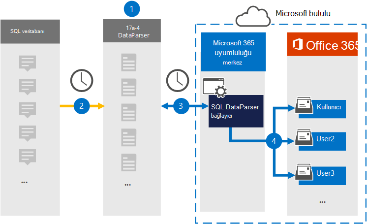

# Verilerinizi arşivlemek için bağlayıcıyı SQL ayarlama

SQL veritabanındaki verileri SQL veritabanındaki kullanıcı posta kutularına içeri ve arşivlemek için SQL [DataParser'ı](https://www.17a-4.com/sql-dataparser/) 17a-4 LLC Microsoft 365 kullanın. DataParser' SQL üçüncü taraf bir veri kaynağından öğeleri yakalayan ve bu öğeleri başka bir öğeye aktaran bir Microsoft 365. Yeni SQL DataParser bağlayıcısı, SQL verilerini e-posta iletisi biçimine dönüştürür ve sonra bu öğeleri Microsoft 365.

Kullanıcı SQL kutularında veriler depo kullandıktan sonra, Microsoft 365 Saklama, eBulma, bekletme ilkeleri ve bekletme etiketleri ve iletişim uyumluluğu gibi uyumluluk özelliklerini uygulayabilirsiniz. SQL'da verileri içeri aktarma ve arşivlemek için Microsoft 365 bağlayıcısı kullanmak, kurum kuruluş ve mevzuat ilkeleriyle uyumlu kalmalarına yardımcı olabilir.

## Verileri arşivlemeye SQL genel bakış

Aşağıdaki genel bakış makalesinde, bağlayıcı içinde yer alan verileri arşivlemek SQL kullanma Microsoft 365.

1. Verileriniz DataParser'ı ayarlamak ve yapılandırmak için, 17a-4 SQL çalışır.

2. Düzenli aralıklarla, SQL DataParser tarafından toplanan öğeler. DataParser, iletinin içeriğini de e-posta iletisi biçimine dönüştürür.

3. Veri SQL VeriParser bağlayıcısı Microsoft 365 uyumluluk merkezi DataParser'a bağlanır ve iletileri Microsoft bulutunda güvenli bir Azure Depolama konuma bağlar.

4. Kullanıcı posta kutularında **SQL DataParser** adlı Gelen Kutusu klasöründe bir alt klasör oluşturulur ve SQL bu klasöre aktarılır. Bağlayıcı, E-posta özelliğinin değerini kullanarak hangi posta kutusuna öğe *aktarılamayacaklarını* belirler. Her SQL öğesi, her katılımcının e-posta adresiyle doldurulan bu özelliği içerir.

## Bağlayıcıyı ayarlamadan önce

- Microsoft bağlayıcıları için bir DataParser hesabı oluşturun. Bunu yapmak için [17a-4 LLC ile iletişime geçin](https://www.17a-4.com/contact/). Bağlayıcıyı 1. Adımda  oluşturdukta bu hesapta oturum açın.

- 1. Adımda SQL DataParser bağlayıcısını oluşturan (ve 3. Adımda tamamlayan) kullanıcıya Veri Bağlayıcısı Yönetici rolü atanabilir. Bu rol, sayfanın en son veri **bağlayıcıları sayfasına bağlayıcı** eklemek Microsoft 365 uyumluluk merkezi. Bu rol varsayılan olarak birden çok rol gruplarına eklenir. Bu rol gruplarının listesi için, Güvenlik ve Uyumluluk Merkezi'nde İzinler bölümündeki "Güvenlik ve uyumluluk merkezlerindeki roller" [& bakın](../security/office-365-security/permissions-in-the-security-and-compliance-center.md#roles-in-the-security--compliance-center). Alternatif olarak, bir yönetici özel bir rol grubu oluşturabilir, Veri Bağlayıcısı Yönetici rolü ata sonrasında uygun kullanıcıları üye olarak ekleyebilir. Yönergeler için aşağıdaki İzinler bölümündeki "Özel bir rol grubu oluşturma" [bölümüne Microsoft 365 uyumluluk merkezi](microsoft-365-compliance-center-permissions.md#create-a-custom-role-group).

- Bu 17a-4 veri bağlayıcısı, ABD GCC tarafından Microsoft 365 ortamlarda kullanılabilir. Üçüncü taraf uygulamaları ve hizmetleri, kuruluş müşteri verilerini Microsoft 365 altyapısının dışında olan üçüncü taraf sistemlerde depolamayı, iletip işlemeyi ve bu nedenle de Microsoft 365 uyumluluk ve veri koruma taahhütleri kapsamında değildir. Microsoft, bu ürünün üçüncü taraf uygulamalara bağlanmak için kullanılabileceğiyle ilgili hiçbir beyanda yoktur ve bu üçüncü taraf uygulamaların FEDRAMP uyumlu olduğunu da ima eder.

## 1. Adım: DataParser bağlayıcısı SQL ayarlama

İlk adım, ana sayfada Veri bağlayıcıları sayfasına erişmek Microsoft 365 uyumluluk merkezi verileri için bir 17a-4 SQL oluşturmaktır.

1. Veri Bağlayıcıları'ne <https://compliance.microsoft.com> **gidin ve ardından VeriParser** >  **SQL tıklayın**.

2. **VeriParser SQL açıklaması** sayfasında Bağlayıcı **ekle'ye tıklayın**.

3. Hizmet Koşulları **sayfasında Kabul Et'e** **tıklayın**.

4. Bağlayıcıyı tanımlayan benzersiz bir ad girin ve Ardından Sonraki'ye **tıklayın**.

5. 17a-4 hesabınızla oturum açın ve VeriParser bağlantı SQL adımları tamamlayın.

## 2. Adım: SQL DataParser bağlayıcıyı yapılandırma

DataParser bağlayıcısı için gereken bağlayıcıyı yapılandırmak için 17a-4 SQL ile çalışabilirsiniz.

## 3. Adım: Kullanıcıları eşleme

Yeni SQL DataParser bağlayıcısı, verileri Microsoft 365 e-posta adreslerine aktarmadan önce kullanıcıları otomatik olarak kendi Microsoft 365.

## 4. Adım: DataParser SQL izleme

DataParser bağlayıcısı SQL, bağlayıcının durumunu bağlayıcının son Microsoft 365 uyumluluk merkezi.

1. Sol gezinti <https://compliance.microsoft.com> çubuğunda **Veri bağlayıcıları'na** gidin ve bu bağlayıcılara tıklayın.

2. Bağlayıcılar **sekmesine** tıklayın ve SQL özellikleri ve bağlayıcıyla ilgili bilgileri içeren açılır sayfayı görüntülemek için oluşturduğunuz VeriParser bağlayıcısı öğesini seçin.

3. **Bağlayıcının kaynak durumunun altında**, **Bağlayıcının durum günlüğünü** açmak (veya kaydetmek) için Günlüğü indir bağlantısına tıklayın. Bu günlük, Microsoft buluta aktarılan verileri içerir.

## Bilinen sorunlar

Şu anda ekleri veya 10 MB'den büyük öğeleri içeri aktarmayı desteklemez. Daha büyük öğeler için destek daha sonraki bir tarihte kullanılabilir.
