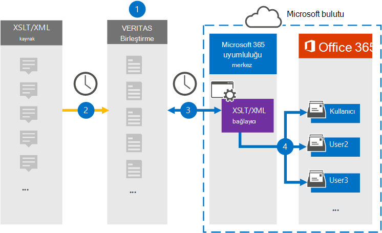

# XSLT/XML verilerini arşivleye bağlayıcı ayarlama

[!include[Purview banner](../includes/purview-rebrand-banner.md)]

Web sayfası kaynağındaki verileri Microsoft 365 kuruluşunuzdaki kullanıcı posta kutularına aktarmak ve arşivlemek için Microsoft Purview uyumluluk portalında bir Veritas bağlayıcısı kullanın. Veritas size XSLT (Genişletilebilir Stil Sayfası Dil Dönüştürmeleri) kullanılarak oluşturulan dosyaların, XML dosyalarını Microsoft 365 aktarılabilir diğer dosya biçimlerine (HTML veya metin gibi) dönüştürmeye olanak tanıyan bir XSLT[/XML bağlayıcısı](https://globanet.com/xslt-xml) sağlar. Bağlayıcı, XSLT/XML kaynağındaki bir öğenin içeriğini e-posta iletisi biçimine dönüştürür ve ardından dönüştürülen öğeyi Microsoft 365 posta kutularına aktarır.

XSLT/XML verileri kullanıcı posta kutularında depolandıktan sonra, Dava Tutma, eBulma ve bekletme ilkeleri ile bekletme etiketleri gibi Microsoft Purview özelliklerini uygulayabilirsiniz. Microsoft 365'da verileri içeri aktarmak ve arşivlerken XSLT/XML bağlayıcısı kullanmak, kuruluşunuzun kamu ve mevzuat ilkeleriyle uyumlu kalmasına yardımcı olabilir.

## XSLT/XML verilerini arşivleme genel bakış

Aşağıdaki genel bakış, Microsoft 365'da XSLT/XML kaynak verilerini arşivlerken bağlayıcı kullanma işlemini açıklar.

1. Kuruluşunuz bir XSLT/XML sitesi ayarlamak ve yapılandırmak için XSLT/XML kaynağıyla çalışır.

2. 24 saatte bir, XSLT/XML kaynağından gelen sohbet iletileri Veritas Merge1 sitesine kopyalanır. Bağlayıcı ayrıca içeriği e-posta iletisi biçimine dönüştürür.

3. Uyumluluk portalında oluşturduğunuz XSLT/XML bağlayıcısı her gün Veritas Merge1 sitesine bağlanır ve iletileri Microsoft bulutunda güvenli bir Azure Depolama konumuna aktarır.

4. Bağlayıcı, 3. Adımda açıklandığı gibi otomatik kullanıcı eşlemesinin *Email* özelliğinin değerini kullanarak dönüştürülen ileti öğelerini belirli kullanıcıların posta kutularına aktarır. Kullanıcı posta kutularında Gelen Kutusu klasöründe **XSLT/XML** adlı yeni bir alt klasör oluşturulur ve ileti öğeleri bu klasöre aktarılır. Bağlayıcı bunu *Email* özelliğinin değerini kullanarak yapar. Her ileti, iletinin her katılımcısının e-posta adresiyle doldurulan bu özelliği içerir.

## Başlamadan önce

- Microsoft bağlayıcıları için bir Veritas Merge1 hesabı oluşturun. Bu hesabı oluşturmak için [Veritas Müşteri Desteği'ne](https://www.veritas.com/content/support/) başvurun. 1. Adımda bağlayıcıyı oluştururken bu hesapta oturum açarsınız.

- 1. Adımda XSLT/XML bağlayıcısını oluşturan (ve 3. Adımda tamamlayan) kullanıcıya Veri Bağlayıcısı Yönetici rolü atanmalıdır. Bu rol, uyumluluk portalındaki **Veri bağlayıcıları sayfasına bağlayıcı** eklemek için gereklidir. Bu rol varsayılan olarak birden çok rol grubuna eklenir. Bu rol gruplarının listesi için Güvenlik [& Uyumluluk Merkezi'ndeki İzinler bölümündeki "Güvenlik ve uyumluluk merkezlerindeki](../security/office-365-security/permissions-in-the-security-and-compliance-center.md#roles-in-the-security--compliance-center) roller" bölümüne bakın. Alternatif olarak, kuruluşunuzdaki bir yönetici özel bir rol grubu oluşturabilir, Veri Bağlayıcısı Yönetici rolünü atayabilir ve ardından uygun kullanıcıları üye olarak ekleyebilir. Yönergeler için [Microsoft Purview uyumluluk portalındaki İzinler](microsoft-365-compliance-center-permissions.md#create-a-custom-role-group) bölümündeki "Özel rol grubu oluşturma" bölümüne bakın.

- Bu Veritas veri bağlayıcısı, Microsoft 365 ABD Kamu bulutundaki GCC ortamlarda genel önizleme aşamasındadır. Üçüncü taraf uygulamalar ve hizmetler, kuruluşunuzun müşteri verilerinin Microsoft 365 altyapısı dışında olan ve bu nedenle Microsoft Purview ve veri koruma taahhütleri kapsamında olmayan üçüncü taraf sistemlerde depolanmasını, iletilmesini ve işlenmesini içerebilir. Microsoft, üçüncü taraf uygulamalara bağlanmak için bu ürünün kullanıldığının, bu üçüncü taraf uygulamaların FEDRAMP uyumlu olduğunu ifade ettiğini ifade etmemektedir.

## 1. Adım: XSLT/XML bağlayıcısı ayarlama

İlk adım, uyumluluk portalında **Veri Bağlayıcıları'na** erişmek ve XSLT/XML verileri için bir bağlayıcı oluşturmaktır.

1. [https://compliance.microsoft.com](https://compliance.microsoft.com/) Adresine gidin ve **Veri bağlayıcılarıXSLT** > **/XML'e** tıklayın.

2. **XSLT/XML** ürün açıklaması sayfasında **Yeni bağlayıcı ekle'ye** tıklayın.

3. **Hizmet koşulları** sayfasında **Kabul Et'e** tıklayın.

4. Bağlayıcıyı tanımlayan benzersiz bir ad girin ve **İleri'ye** tıklayın.

5. Bağlayıcıyı yapılandırmak için Merge1 hesabınızda oturum açın.

## 2. Adım: XSLT/XML bağlayıcısı yapılandırma

İkinci adım, Merge1 sitesinde XSLT/XML bağlayıcısını yapılandırmaktır. Veritas Merge1 sitesinde XSLT/XML bağlayıcısını yapılandırma hakkında bilgi için bkz. [Birleştirme1 Üçüncü Taraf Bağlayıcıları Kullanıcı Kılavuzu](https://docs.ms.merge1.globanetportal.com/Merge1%20Third-Party%20Connectors%20XSLT-XML%20User%20Guide%20.pdf).

**Kaydet & Son'a** tıkladıktan sonra, uyumluluk portalındaki bağlayıcı sihirbazındaki **Kullanıcı eşleme** sayfası görüntülenir.

## 3. Adım: Kullanıcıları eşleme ve bağlayıcı kurulumunu tamamlama

1. Kullanıcıları eşlemek ve uyumluluk portalında bağlayıcı kurulumunu tamamlamak için aşağıdaki adımları izleyin:

2. **XSLT/XML kullanıcılarını Microsoft 365 kullanıcılarla eşle** sayfasında otomatik kullanıcı eşlemesini etkinleştirin. XSLT/XML öğeleri, kuruluşunuzdaki kullanıcıların *e-posta adreslerini içeren E-posta* adlı bir özellik içerir. Bağlayıcı bu adresi bir Microsoft 365 kullanıcıyla ilişkilendirebiliyorsa, öğeler söz konusu kullanıcının posta kutusuna aktarılır.

3. **İleri'ye** tıklayın, ayarlarınızı gözden geçirin ve yeni bağlayıcının içeri aktarma işleminin ilerleme durumunu görmek için **Veri bağlayıcıları** sayfasına gidin.

## 4. Adım: XSLT/XML bağlayıcısını izleme

XSLT/XML bağlayıcısını oluşturduktan sonra bağlayıcının durumunu uyumluluk portalında görüntüleyebilirsiniz.

1. Sol gezinti bölmesinde **Veri bağlayıcıları'na** [https://compliance.microsoft.com](https://compliance.microsoft.com) gidin ve tıklayın.

2. **Bağlayıcılar** sekmesine tıklayın ve açılır sayfayı görüntülemek için **XSLT/XML** bağlayıcısını seçin. Bu sayfa, bağlayıcı hakkındaki özellikleri ve bilgileri içerir.

3. Bağlayıcının durum günlüğünü açmak (veya kaydetmek) için **Kaynakla bağlayıcı durumu** altında **Günlüğü indir** bağlantısına tıklayın. Bu günlük, Microsoft buluta aktarılan verileri içerir.

## Bilinen sorunlar

- Şu anda 10 MB'tan büyük eklerin veya öğelerin içeri aktarılmasını desteklemiyoruz. Daha büyük öğeler için destek daha sonraki bir tarihte sağlanacaktır.