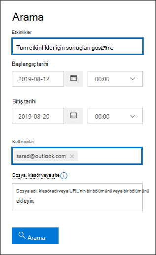

# <a name="search-the-audit-log-to-investigate-common-support-issues"></a>Yaygın destek sorunlarını araştırmak için denetim günlüğünde arama yapma

Bu makalede, yaygın destek sorunlarını araştırmanıza yardımcı olması için denetim günlüğü arama aracının nasıl kullanılacağı açıklanmaktadır. Bu, denetim günlüğünü kullanarak şunları içerir:

- Güvenliği aşılmış bir hesaba erişmek için kullanılan bilgisayarın IP adresini bulma
- Posta kutusu için e-posta iletmeyi kimin ayarladığını belirleme
- Kullanıcının posta kutusunda e-posta öğelerini silip silmediğini belirleme
- Kullanıcının gelen kutusu kuralı oluşturup oluşturmadığını belirleme
- Kuruluşunuzun dışındaki bir kullanıcı tarafından neden başarılı bir oturum açma işlemi olduğunu araştırma
- E5 lisansı olmayan kullanıcılar tarafından gerçekleştirilen posta kutusu etkinliklerini arama
- Temsilci kullanıcılar tarafından gerçekleştirilen posta kutusu etkinliklerini arama

## <a name="using-the-audit-log-search-tool"></a>Denetim günlüğü arama aracını kullanma

Bu makalede açıklanan sorun giderme senaryolarının her biri, Microsoft Purview uyumluluk portalı denetim günlüğü arama aracını kullanmayı temel alır. Bu bölümde, denetim günlüğünde arama yapmak için gereken izinler listelenir ve denetim günlüğü aramalarına erişme ve bunları çalıştırma adımları açıklanmaktadır. Her senaryo bölümünde bir denetim günlüğü arama sorgusunun nasıl yapılandırıldığını ve denetim kayıtlarındaki arama ölçütlerine uyan ayrıntılı bilgilerde nelerin arandığını açıklar.

### <a name="permissions-required-to-use-the-audit-log-search-tool"></a>Denetim günlüğü arama aracını kullanmak için gereken izinler

Denetim günlüğünde arama yapmak için Exchange Online'da View-Only Denetim Günlükleri veya Denetim Günlükleri rolüne atanmış olmanız gerekir. Varsayılan olarak, bu roller <a href="https://go.microsoft.com/fwlink/p/?linkid=2059104" target="_blank">Exchange yönetim merkezindeki</a> **İzinler** sayfasındaki Uyumluluk Yönetimi ve Kuruluş Yönetimi rol gruplarına atanır. Office 365 ve Microsoft 365'teki genel yöneticiler otomatik olarak Exchange Online Kuruluş Yönetimi rol grubunun üyeleri olarak eklenir. Daha fazla bilgi için bkz. [Exchange Online rol gruplarını yönetme](/Exchange/permissions-exo/role-groups).

### <a name="running-audit-log-searches"></a>Denetim günlüğü aramalarını çalıştırma

Bu bölümde, denetim günlüğü aramalarını oluşturma ve çalıştırmayla ilgili temel bilgiler açıklanmaktadır. Bu makaledeki her sorun giderme senaryosu için başlangıç noktası olarak bu yönergeleri kullanın. Daha ayrıntılı adım adım yönergeler için bkz [. Denetim günlüğünde arama](search-the-audit-log-in-security-and-compliance.md#step-1-run-an-audit-log-search) yapma.

1. <https://compliance.microsoft.com/auditlogsearch> adresine gidin ve iş veya okul hesabınızı kullanarak oturum açın.
  
    **Denetim** sayfası görüntülenir.
  
    
  
2. Aşağıdaki arama ölçütlerini yapılandırabilirsiniz. Bu makaledeki her sorun giderme senaryosu, bu alanları yapılandırmak için belirli yönergeler önerir.
  
   a. **Başlangıç tarihi** ve **Bitiş tarihi:** Bu dönemde gerçekleşen olayları görüntülemek için bir tarih ve saat aralığı seçin. Son yedi gün varsayılan olarak seçilir. Tarih ve saat Eşgüdümlü Evrensel Saat (UTC) biçiminde gösterilir. Belirtebileceğiniz maksimum tarih aralığı 90 gündür.

   b. **Faaliyetleri:** Arama yapabileceğiniz etkinlikleri görüntülemek için açılan listeyi seçin. Aramayı çalıştırdıktan sonra yalnızca seçili etkinliklere ilişkin denetim kayıtları görüntülenir. **Tüm etkinlikler için sonuçları göster** seçildiğinde, diğer arama ölçütlerine uyan tüm etkinliklerin sonuçları görüntülenir. Ayrıca bazı sorun giderme senaryolarında bu alanı boş bırakmanız gerekir.
  
    c. **Kullanıcı:** Bu kutuya tıklayın ve arama sonuçlarını görüntülemek üzere bir veya daha fazla kullanıcı seçin. Bu kutuda seçtiğiniz kullanıcılar tarafından gerçekleştirilen seçili etkinliğin denetim kayıtları sonuç listesinde görüntülenir. Kuruluşunuzdaki tüm kullanıcıların (ve hizmet hesaplarının) girdilerini döndürmek için bu kutuyu boş bırakın.
  
    d. **Dosya, klasör veya site:** Belirtilen anahtar sözcüğü içeren klasör dosyasıyla ilgili etkinliği aramak için bir dosya veya klasör adının bir kısmını veya tümünü yazın. Ayrıca bir dosya veya klasörün URL'sini de belirtebilirsiniz. URL kullanıyorsanız, tam URL yolunu yazdığınızdan veya URL'nin yalnızca bir bölümünü yazdığınızdan emin olun, özel karakter veya boşluk eklemeyin. Kuruluşunuzdaki tüm dosya ve klasörlerin girdilerini döndürmek için bu kutuyu boş bırakın. Bu alan, bu makaledeki tüm sorun giderme senaryolarında boş bırakılır.
  
3. Arama ölçütlerinizi kullanarak aramayı çalıştırmak için **Ara'yı** seçin.
  
    Arama sonuçları yüklenir ve birkaç dakika sonra denetim günlüğü arama aracındaki bir sayfada görüntülenir. Bu makaledeki bölümlerin her biri, belirli sorun giderme senaryosu bağlamında aranacak şeyler hakkında rehberlik sağlar.

    Denetim günlüğü arama sonuçlarını görüntüleme ve dışarı aktarma hakkında daha fazla bilgi için bkz:

    - [Arama sonuçlarını görüntüleme](search-the-audit-log-in-security-and-compliance.md#step-2-view-the-search-results)
  
    - [Arama sonuçlarını dışarı aktarma](search-the-audit-log-in-security-and-compliance.md#step-3-export-the-search-results-to-a-file)

## <a name="find-the-ip-address-of-the-computer-used-to-access-a-compromised-account"></a>Güvenliği aşılmış bir hesaba erişmek için kullanılan bilgisayarın IP adresini bulma

Herhangi bir kullanıcı tarafından gerçekleştirilen bir etkinliğe karşılık gelen IP adresi çoğu denetim kaydına dahil edilir. Kullanılan istemci hakkındaki bilgiler de denetim kaydına eklenir.

Bu senaryo için bir denetim günlüğü arama sorgusu şu şekilde yapılandırılır:

**Faaliyetleri:** Servis talebinizle ilgiliyse, aranacak belirli bir etkinliği seçin. Güvenliği aşılmış hesapların sorunlarını gidermek için, Exchange **posta kutusu etkinlikleri altında Kullanıcı posta kutusu etkinliğinde oturum açtı** seçeneğini **belirlemeyi** göz önünde bulundurun. Bu, posta kutusunda oturum açarken kullanılan IP adresini gösteren denetim kayıtlarını döndürür. Aksi takdirde, tüm etkinliklerin denetim kayıtlarını döndürmek için bu alanı boş bırakın. 

> [!TIP]
> Bu alanı boş bırakmak, kullanıcının bir kullanıcı hesabında oturum açtığını belirten bir Azure Active Directory etkinliği olan **UserLoggedIn** etkinliklerini döndürür. **UserLoggedIn** denetim kayıtlarını görüntülemek için arama sonuçlarında filtrelemeyi kullanın.

**Başlangıç tarihi** ve **Bitiş tarihi:** Araştırmanıza uygun bir tarih aralığı seçin.

**Kullanıcı:** Güvenliği aşılmış bir hesabı araştırıyorsanız hesabı tehlikeye girmiş olan kullanıcıyı seçin. Bu, söz konusu kullanıcı hesabı tarafından gerçekleştirilen etkinliklerin denetim kayıtlarını döndürür.

**Dosya, klasör veya site:** Bu alanı boş bırakın.

Aramayı çalıştırdıktan sonra, her etkinliğin IP adresi arama sonuçlarındaki **IP adresi** sütununda görüntülenir. Açılır sayfada daha ayrıntılı bilgileri görüntülemek için arama sonuçlarında kaydı seçin.

## <a name="determine-who-set-up-email-forwarding-for-a-mailbox"></a>Posta kutusu için e-posta iletmeyi kimin ayarladığını belirleme

Posta kutusu için e-posta iletme yapılandırıldığında, posta kutusuna gönderilen e-posta iletileri başka bir posta kutusuna iletilir. İletiler kuruluşunuzun içindeki veya dışındaki kullanıcılara iletilebilir. Posta kutusunda e-posta iletme ayarlandığında, kullanılan temel Exchange Online cmdlet'i **Set-Mailbox'dır**.

Bu senaryo için bir denetim günlüğü arama sorgusu şu şekilde yapılandırılır:

**Faaliyetleri:** Aramanın tüm etkinlikler için denetim kayıtlarını döndürmesi için bu alanı boş bırakın. Bu, **Set-Mailbox** cmdlet'iyle ilgili tüm denetim kayıtlarını döndürmek için gereklidir.

**Başlangıç tarihi** ve **Bitiş tarihi:** Araştırmanıza uygun bir tarih aralığı seçin.

**Kullanıcı:** Belirli bir kullanıcı için e-posta iletme sorununu araştırmadığınız sürece bu alanı boş bırakın. Bu, herhangi bir kullanıcı için e-posta iletmenin ayarlandığını belirlemenize yardımcı olur.

**Dosya, klasör veya site:** Bu alanı boş bırakın.

Aramayı çalıştırdıktan sonra arama sonuçları sayfasında **Sonuçları filtrele'yi** seçin. **Etkinlik** sütun başlığı altındaki kutuya **, Yalnızca Set-Mailbox** cmdlet'iyle ilgili denetim kayıtlarının görüntülenmesi için **Posta Kutusu Ayarla** yazın.


Bu noktada, etkinliğin e-posta iletmeyle ilgili olup olmadığını belirlemek için her denetim kaydının ayrıntılarına bakmanız gerekir. **Ayrıntılar** açılır sayfasını görüntülemek için denetim kaydını seçin ve ardından **Daha fazla bilgi'yi** seçin. Aşağıdaki ekran görüntüsü ve açıklamalar, posta kutusunda e-posta iletmenin ayarlandığını gösteren bilgileri vurgular.


a. **ObjectId** alanında, e-posta iletmenin ayarlandığı posta kutusunun diğer adı görüntülenir. Bu posta kutusu, arama sonuçları sayfasındaki **Öğe** sütununda da görüntülenir.

b. **Parametreler** alanında *ForwardingSmtpAddress* değeri, posta kutusunda e-posta iletmenin ayarlandığını gösterir. Bu örnekte posta, alpinehouse.onmicrosoft.com kuruluş dışındaki mike@contoso.com e-posta adresine iletilir.

c. *DeliverToMailboxAndForward* parametresinin *True* değeri, iletinin bir kopyasının sarad@alpinehouse.onmicrosoft.com teslim ettiğini *ve* bu örnekte mike@contoso.com olan *ForwardingSmtpAddress* parametresi tarafından belirtilen e-posta adresine iletildiğini gösterir. *DeliverToMailboxAndForward* parametresinin değeri *False* olarak ayarlanırsa, e-posta yalnızca *ForwardingSmtpAddress* parametresi tarafından belirtilen adrese iletilir. **ObjectId** alanında belirtilen posta kutusuna teslim edilmemiştir.

d. **UserId** alanı, **ObjectId** alanında belirtilen posta kutusunda e-posta iletmeyi ayarlayan kullanıcıyı gösterir. Bu kullanıcı, arama sonuçları sayfasındaki **Kullanıcı** sütununda da görüntülenir. Bu durumda, posta kutusunun sahibi, posta kutusuna e-posta iletmeyi ayarlamış gibi görünüyor.

Posta kutusunda e-posta iletmenin ayarlanmaması gerektiğini belirlerseniz, PowerShell'Exchange Online aşağıdaki komutu çalıştırarak e-postayı kaldırabilirsiniz:

```powershell
Set-Mailbox <mailbox alias> -ForwardingSmtpAddress $null 
```

E-posta iletmeyle ilgili parametreler hakkında daha fazla bilgi için [, Set-Mailbox](/powershell/module/exchange/set-mailbox) makalesine bakın.

## <a name="determine-if-a-user-deleted-email-items"></a>Kullanıcının e-posta öğelerini silip silmediğini belirleme

Ocak 2019'dan itibaren Microsoft, tüm Office 365 ve Microsoft kuruluşları için posta kutusu denetim günlüğünü varsayılan olarak açar. Bu, posta kutusu sahipleri tarafından gerçekleştirilen belirli eylemlerin otomatik olarak günlüğe kaydedildiği ve posta kutusu denetim günlüğünde bunları aradığınızda ilgili posta kutusu denetim kayıtlarının kullanılabildiği anlamına gelir. Posta kutusu denetimi varsayılan olarak açılmadan önce, bunu kuruluşunuzdaki her kullanıcı posta kutusu için el ile etkinleştirmeniz gerekiyordu. 

Varsayılan olarak günlüğe kaydedilen posta kutusu eylemleri, posta kutusu sahipleri tarafından gerçekleştirilen SoftDelete ve HardDelete posta kutusu eylemlerini içerir. Bu, denetim günlüğünde silinen e-posta öğeleriyle ilgili olayları aramak için aşağıdaki adımları kullanabileceğiniz anlamına gelir. Varsayılan olarak üzerinde posta kutusu denetimi hakkında daha fazla bilgi için bkz. [Posta kutusu denetimini yönetme](enable-mailbox-auditing.md).

Bu senaryo için bir denetim günlüğü arama sorgusu şu şekilde yapılandırılır:

**Faaliyetleri:** **Exchange posta kutusu etkinlikleri'nin** altında aşağıdaki etkinliklerden birini veya ikisini birden seçin:

- **Silinmiş Öğeler klasöründen silinen iletiler:** Bu etkinlik **, SoftDelete** posta kutusu denetim eylemine karşılık gelir. Bu etkinlik, kullanıcı öğeyi seçip **Shift+Delete** tuşlarına basarak kalıcı olarak sildiğinde de günlüğe kaydedilir. Bir öğe kalıcı olarak silindikten sonra, silinen öğe saklama süresi dolana kadar kullanıcı öğeyi kurtarabilir.

- **İletiler posta kutusundan temizlenir:** Bu etkinlik **, HardDelete** posta kutusu denetim eylemine karşılık gelir. Bu, kullanıcı Kurtarılabilir Öğeler klasöründeki bir öğeyi temizlediğinde günlüğe kaydedilir. Yöneticiler, silinmiş öğe saklama süresi dolana kadar veya kullanıcının posta kutusu beklemedeyse daha uzun süre boyunca temizlenmiş öğeleri aramak ve kurtarmak için güvenlik ve uyumluluk merkezindeki İçerik Arama aracını kullanabilir.

**Başlangıç tarihi** ve **Bitiş tarihi:** Araştırmanıza uygun bir tarih aralığı seçin.

**Kullanıcı:** Bu alanda bir kullanıcı seçerseniz, denetim günlüğü arama aracı belirttiğiniz kullanıcı tarafından silinmiş (SoftDeleted veya HardDeleted) e-posta öğeleri için denetim kayıtlarını döndürür. Bazen e-postayı silecek kullanıcı posta kutusu sahibi olmayabilir.

**Dosya, klasör veya site:** Bu alanı boş bırakın.

Aramayı çalıştırdıktan sonra, geçici olarak silinen öğelerin veya sabit silinen öğelerin denetim kayıtlarını görüntülemek için arama sonuçlarını filtreleyebilirsiniz. **Ayrıntılar** açılır sayfasını görüntülemek için denetim kaydını seçin ve ardından **Daha fazla bilgi'yi** seçin. Silinen öğe hakkında konu satırı ve öğenin silindiği konum gibi ek bilgiler **AffectedItems** alanında görüntülenir. Aşağıdaki ekran görüntüleri, geçici olarak silinen bir öğeden **AffectedItems** alanının bir örneğini ve sabit silinmiş bir öğeyi gösterir.

**Geçici olarak silinen öğe için AffectedItems alanı örneği**


**Sabit silinmiş öğe için AffectedItems alanı örneği**


### <a name="recover-deleted-email-items"></a>Silinen e-posta öğelerini kurtarma

Silinen öğelerin saklama süresi dolmadıysa kullanıcılar geçici olarak silinen öğeleri kurtarabilir. Exchange Online'de, varsayılan silinmiş öğelerin saklama süresi 14 gündür, ancak yöneticiler bu ayarı en fazla 30 güne artırabilir. Silinen öğeleri kurtarma yönergeleri için [Web üzerinde Outlook'de kullanıcıları Silinmiş öğeleri veya e-postaları](https://support.office.com/article/Recover-deleted-items-or-email-in-Outlook-Web-App-C3D8FC15-EEEF-4F1C-81DF-E27964B7EDD4) kurtarma makalesine işaret edin.

Daha önce açıklandığı gibi, silinmiş öğe saklama süresinin dolmamış olması veya posta kutusunun beklemede olması durumunda, bekleme süresi dolana kadar öğeler tutulursa, yöneticiler sabit silinmiş öğeleri kurtarabilir. İçerik araması çalıştırdığınızda, Kurtarılabilir Öğeler klasöründeki geçici olarak silinen ve sabit silinen öğeler, arama sorgusuyla eşleşiyorsa arama sonuçlarında döndürülür. İçerik aramalarını çalıştırma hakkında daha fazla bilgi için bkz. [Office 365'da İçerik Arama](content-search.md).

> [!TIP]
> Silinen e-posta öğelerini aramak için denetim kaydındaki **AffectedItems** alanında görüntülenen konu satırının tamamını veya bir bölümünü arayın.

## <a name="determine-if-a-user-created-an-inbox-rule"></a>Kullanıcının gelen kutusu kuralı oluşturup oluşturmadığını belirleme

Kullanıcılar Exchange Online posta kutuları için bir gelen kutusu kuralı oluşturduğunuzda, ilgili denetim kaydı denetim günlüğüne kaydedilir. Gelen kutusu kuralları hakkında daha fazla bilgi için bkz:

- [Web üzerinde Outlook gelen kutusu kurallarını kullanma](https://support.office.com/article/use-inbox-rules-in-outlook-on-the-web-8400435c-f14e-4272-9004-1548bb1848f2)
- [Outlook'ta kuralları kullanarak e-posta iletilerini yönetme](https://support.office.com/article/Manage-email-messages-by-using-rules-C24F5DEA-9465-4DF4-AD17-A50704D66C59)

Bu senaryo için bir denetim günlüğü arama sorgusu şu şekilde yapılandırılır:

**Faaliyetleri:** **Exchange posta kutusu etkinlikleri'nin** altında aşağıdaki etkinliklerden birini veya ikisini birden seçin:

- **New-Gelen KutusuRule Outlook Web App yeni gelen kutusu kuralı oluşturun**. Bu etkinlik, Outlook web uygulaması kullanılarak veya PowerShell Exchange Online gelen kutusu kuralları oluşturulduğunda denetim kayıtlarını döndürür.

- **Outlook istemcisinden gelen kutusu kuralları güncelleştirildi**. Bu etkinlik, Outlook masaüstü istemcisi kullanılarak gelen kutusu kuralları oluşturulduğunda, değiştirildiğinde veya kaldırıldığında denetim kayıtlarını döndürür.

**Başlangıç tarihi** ve **Bitiş tarihi:** Araştırmanıza uygun bir tarih aralığı seçin.

**Kullanıcı:** Belirli bir kullanıcıyı araştırmadığınız sürece bu alanı boş bırakın. Bu, herhangi bir kullanıcı tarafından ayarlanan yeni gelen kutusu kurallarını belirlemenize yardımcı olur.

**Dosya, klasör veya site:** Bu alanı boş bırakın.

Aramayı çalıştırdıktan sonra, bu etkinliğin tüm denetim kayıtları arama sonuçlarında görüntülenir. **Ayrıntılar** açılır sayfasını görüntülemek için bir denetim kaydı seçin ve ardından **Daha fazla bilgi'yi** seçin. Gelen kutusu kuralı ayarları hakkındaki bilgiler **Parametreler** alanında görüntülenir. Aşağıdaki ekran görüntüsü ve açıklamalar, gelen kutusu kuralları hakkındaki bilgileri vurgular.


a. **ObjectId** alanında, gelen kutusu kuralının tam adı görüntülenir. Bu ad, kullanıcının posta kutusunun diğer adını (örneğin, SaraD) ve gelen kutusu kuralının adını içerir (örneğin, "İletileri yöneticiden taşıma").

b. **Parametreler** alanında, gelen kutusu kuralının koşulu görüntülenir. Bu örnekte koşul *From* parametresi tarafından belirtilir. *From* parametresi için tanımlanan değer, gelen kutusu kuralının admin@alpinehouse.onmicrosoft.com tarafından gönderilen e-posta üzerinde hareket ettiğini gösterir. Gelen kutusu kurallarının koşullarını tanımlamak için kullanılabilecek parametrelerin tam listesi için [New-InboxRule](/powershell/module/exchange/new-inboxrule) makalesine bakın.

c. *MoveToFolder* parametresi gelen kutusu kuralının eylemini belirtir. Bu örnekte, admin@alpinehouse.onmicrosoft.com alınan iletiler *AdminSearch* adlı klasöre taşınır. Ayrıca, gelen kutusu kuralının eylemini tanımlamak için kullanılabilecek parametrelerin tam listesi için [New-InboxRule](/powershell/module/exchange/new-inboxrule) makalesine bakın.

d. **UserId** alanı, **ObjectId** alanında belirtilen gelen kutusu kuralını oluşturan kullanıcıyı gösterir. Bu kullanıcı, arama sonuçları sayfasındaki **Kullanıcı** sütununda da görüntülenir.

## <a name="investigate-why-there-was-a-successful-login-by-a-user-outside-your-organization"></a>Kuruluşunuzun dışındaki bir kullanıcı tarafından neden başarılı bir oturum açma işlemi olduğunu araştırma

Denetim günlüğündeki denetim kayıtlarını gözden geçirirken, dış kullanıcının Kimliğinin Azure Active Directory tarafından doğrulandığını ve kuruluşunuzda başarıyla oturum açtığını belirten kayıtlar görebilirsiniz. Örneğin, contoso.onmicrosoft.com'daki bir yönetici, farklı bir kuruluştan (örneğin, fabrikam.onmicrosoft.com) bir kullanıcının contoso.onmicrosoft.com başarıyla oturum açtığını gösteren bir denetim kaydı görebilir. Benzer şekilde, kuruluşunuzda başarıyla oturum açmış Outlook.com veya Live.com gibi Microsoft Hesabı (MSA) olan kullanıcıları gösteren denetim kayıtları görebilirsiniz. Bu gibi durumlarda, denetlenen etkinlik **Kullanıcı oturum açmış** olur. 

Bu davranış tasarımdan kaynaklanır. Dizin hizmeti olan Azure Active Directory (Azure AD), dış kullanıcı kuruluşunuzdaki bir SharePoint sitesine veya OneDrive konumuna erişmeye çalıştığında *doğrudan kimlik doğrulaması* olarak adlandırılan bir şeye izin verir. Dış kullanıcı bunu yapmaya çalıştığında kimlik bilgilerini girmesi istenir. Azure AD kimlik bilgilerini kullanıcının kimliğini doğrulamak için kullanır, yani yalnızca Azure AD kullanıcının söylediği kişi olduğunu doğrular. Denetim kaydındaki başarılı oturum açma işleminin göstergesi, kullanıcının kimliğini doğrulamanın Azure AD sonucudur. Başarılı oturum açma, kullanıcının kuruluşunuzdaki herhangi bir kaynağa erişebileceği veya başka eylemler gerçekleştirebileceği anlamına gelmez. Yalnızca kullanıcının kimliğinin Azure AD tarafından doğrulandığını gösterir. Geçişli bir kullanıcının SharePoint veya OneDrive kaynaklarına erişebilmesi için, kuruluşunuzdaki bir kullanıcının bir kaynağı paylaşım daveti veya anonim paylaşım bağlantısı göndererek dış kullanıcıyla açıkça paylaşması gerekir. 

> [!NOTE]
> Azure AD, doğrudan kimlik doğrulamasına yalnızca SharePoint Online ve OneDrive İş gibi *birinci taraf uygulamalar* için izin verir. Diğer üçüncü taraf uygulamalar için buna izin verilmez.

Burada, doğrudan kimlik doğrulamasının bir sonucu olan Oturum **Açan Kullanıcının denetim kaydındaki** ilgili özelliklerin bir örneği ve açıklamaları verilmiştir. **Ayrıntılar** açılır sayfasını görüntülemek için denetim kaydını seçin ve ardından **Daha fazla bilgi'yi** seçin.


   a. Bu alan, kuruluşunuzdaki bir kaynağa erişmeye çalışan kullanıcının kuruluşunuzun Azure AD bulunamadığını gösterir.

   b. Bu alan, kuruluşunuzdaki bir kaynağa erişmeye çalışan dış kullanıcının UPN'sini görüntüler. Bu kullanıcı kimliği, denetim kaydındaki **User** ve **UserId** özelliklerinde de tanımlanır.

   c. **ApplicationId** özelliği, oturum açma isteğini tetikleyen uygulamayı tanımlar. Bu denetim kaydındaki ApplicationId özelliğinde görüntülenen 00000003-0000-0ff1-ce00-000000000000 değerinin SharePoint Online olduğunu gösterir. OneDrive İş aynı ApplicationId'ye de sahiptir.

   d. Bu, geçiş kimlik doğrulamasının başarılı olduğunu gösterir. Başka bir deyişle, kullanıcının kimliği Azure AD tarafından başarıyla doğrulandı. 

   e. **15'in RecordType** değeri, denetlenen etkinliğin (UserLoggedIn) Azure AD bir Güvenli Belirteç Hizmeti (STS) oturum açma olayı olduğunu gösterir.

UserLoggedIn denetim kaydında görüntülenen diğer özellikler hakkında daha fazla bilgi için, Office 365 [Yönetim Etkinliği API'sinin şemasındaki Azure AD ilgili şema bilgilerine](/office/office-365-management-api/office-365-management-activity-api-schema#azure-active-directory-base-schema) bakın.

Doğrudan kimlik doğrulaması nedeniyle **başarılı bir Kullanıcının denetim etkinliğinde oturum açmasıyla** sonuçlanan iki örnek senaryo aşağıda verilmiştir: 

  - Microsoft Hesabı (SaraD@outlook.com gibi) olan bir kullanıcı, fourthcoffee.onmicrosoft.com'daki bir OneDrive İş hesabındaki bir belgeye erişmeye çalıştı ve fourthcoffee.onmicrosoft.com'da SaraD@outlook.com için karşılık gelen bir konuk kullanıcı hesabı yok.

  - Bir kuruluşta İş veya Okul hesabı (pilarp@fabrikam.onmicrosoft.com gibi) olan bir kullanıcı contoso.onmicrosoft.com'da bir SharePoint sitesine erişmeye çalıştı ve contoso.onmicrosoft.com'da pilarp@fabrikam.com için karşılık gelen bir konuk kullanıcı hesabı yok.

### <a name="tips-for-investigating-successful-logins-resulting-from-pass-through-authentication"></a>Doğrudan kimlik doğrulamasından kaynaklanan başarılı oturum açma bilgilerini araştırma ipuçları

- Denetim günlüğünde, **Kullanıcı denetim kaydında oturum açmış** olan dış kullanıcı tarafından gerçekleştirilen etkinlikler için arama yapın. **Kullanıcılar** kutusuna dış kullanıcı için UPN yazın ve senaryonuzla ilgiliyse bir tarih aralığı kullanın. Örneğin, aşağıdaki arama ölçütlerini kullanarak bir arama oluşturabilirsiniz:

   

    **Kullanıcının oturum açtığı** etkinliklere ek olarak, kuruluşunuzdaki bir kullanıcının kaynakları dış kullanıcıyla paylaştığını ve dış kullanıcının kendisiyle paylaşılan bir belgeye erişip erişmediğini, değiştirdiğini veya indirdiğini belirten diğer denetim kayıtları döndürülebilir.

- Bir dosyanın, denetim **kaydında oturum açmış bir Kullanıcı** tarafından tanımlanan dış kullanıcıyla paylaşıldığını gösteren SharePoint paylaşım etkinliklerini arayın. Daha fazla bilgi için bkz. [Denetim günlüğünde paylaşım denetimini kullanma](use-sharing-auditing.md).

- Dış kullanıcıyla ilgili diğer etkinlikleri aramak için Excel'i kullanabilmek için araştırmanızla ilgili kayıtları içeren denetim günlüğü arama sonuçlarını dışarı aktarın. Daha fazla bilgi için bkz.  [Denetim günlüğü kayıtlarını dışarı aktarma, yapılandırma ve görüntüleme](export-view-audit-log-records.md).

## <a name="search-for-mailbox-activities-performed-by-users-with-non-e5-licenses"></a>E5 lisansı olmayan kullanıcılar tarafından gerçekleştirilen posta kutusu etkinliklerini arama

Kuruluşunuzda [posta kutusu denetimi varsayılan olarak](enable-mailbox-auditing.md) açık olsa bile uyumluluk merkezini, **Search-UnifiedAuditLog** cmdlet'ini veya Office 365 Yönetim Etkinliği API'sini kullanarak bazı kullanıcılar için posta kutusu denetim olaylarının denetim günlüğü aramalarında bulunmadığını fark edebilirsiniz. Bunun nedeni, posta kutusu denetim olaylarının yalnızca birleştirilmiş denetim günlüğünde arama yapmak için önceki yöntemlerden biri olduğunda E5 lisansı olan kullanıcılar için döndürülecek olmasıdır.

E5 olmayan kullanıcıların posta kutusu denetim günlüğü kayıtlarını almak için aşağıdaki geçici çözümlerden birini gerçekleştirebilirsiniz:

- Tek tek posta kutularında posta kutusu denetimini el ile etkinleştirin (Exchange Online PowerShell'de komutunu çalıştırın`Set-Mailbox -Identity <MailboxIdentity> -AuditEnabled $true`). Bunu yaptıktan sonra uyumluluk merkezini, **Search-UnifiedAuditLog** cmdlet'ini veya Office 365 Yönetim Etkinliği API'sini kullanarak posta kutusu denetim etkinliklerini arayın.
  
  > [!NOTE]
  > Posta kutusu denetimi posta kutusunda zaten etkin görünüyorsa ancak aramalarınız sonuç döndürmezse _AuditEnabled_ parametresinin `$false` değerini olarak değiştirin ve sonra öğesine geri dönün `$true`.
  
- Exchange Online PowerShell'de aşağıdaki cmdlet'leri kullanın:

  - Belirli kullanıcılar için posta kutusu denetim günlüğünde arama yapmak için [Search-MailboxAuditLog](/powershell/module/exchange/search-mailboxauditlog).

  - Belirli kullanıcılar için posta kutusu denetim günlüğünde arama yapmak ve sonuçların belirtilen alıcılara e-posta yoluyla gönderilmesini sağlamak için [New-MailboxAuditLogSearch](/powershell/module/exchange/new-mailboxauditlogsearch).

## <a name="search-for-mailbox-activities-performed-in-a-specific-mailbox-including-shared-mailboxes"></a>Belirli bir posta kutusunda gerçekleştirilen posta kutusu etkinliklerini arama (paylaşılan posta kutuları dahil)

Uyumluluk merkezindeki denetim günlüğü arama aracındaki **Kullanıcılar** açılan listesini veya Exchange Online PowerShell'deki **Search-UnifiedAuditLog -UserIds** komutunu kullandığınızda, belirli bir kullanıcı tarafından gerçekleştirilen etkinlikleri arayabilirsiniz. Posta kutusu denetim etkinlikleri için bu tür bir arama, belirtilen kullanıcı tarafından gerçekleştirilen etkinlikleri arar. Aynı posta kutusunda gerçekleştirilen tüm etkinliklerin arama sonuçlarında döndürüldüğünü garanti etmez. Örneğin, belirli bir kullanıcı tarafından gerçekleştirilen posta kutusu etkinlikleri arandığında başka bir kullanıcının posta kutusuna erişim izinleri atanmış bir temsilci kullanıcı tarafından gerçekleştirilen etkinlikler döndürülmeyeceği için, denetim günlüğü araması temsilci kullanıcı tarafından gerçekleştirilen etkinlikler için denetim kayıtlarını döndürmez. (Temsilci kullanıcı, başka bir kullanıcının posta kutusuna SendAs, SendOnBehalf veya FullAccess posta kutusu izni atanmış olan kişidir.)

Ayrıca, denetim günlüğü arama aracında veya **Search-UnifiedAuditLog -UserId'lerde** **Kullanıcı** açılan listesinin kullanılması, paylaşılan posta kutusunda gerçekleştirilen etkinlikler için sonuç döndürmez.

Belirli bir posta kutusunda gerçekleştirilen etkinlikleri aramak veya paylaşılan posta kutusunda gerçekleştirilen etkinlikleri aramak için **Search-UnifiedAuditLog** cmdlet'ini çalıştırırken aşağıdaki söz dizimini kullanın:

```powershell
Search-UnifiedAuditLog  -StartDate <date> -EndDate <date> -FreeText (Get-Mailbox <mailbox identity).ExchangeGuid
```

Örneğin, aşağıdaki komut Ağustos 2020 ile Ekim 2020 arasında Contoso Uyumluluk Ekibi paylaşılan posta kutusunda gerçekleştirilen etkinliklerin denetim kayıtlarını döndürür:

```powershell
Search-UnifiedAuditLog  -StartDate 08/01/2020 -EndDate 10/31/2020 -FreeText (Get-Mailbox complianceteam@contoso.onmicrosoft.com).ExchangeGuid
```

Alternatif olarak, belirli bir posta kutusunda gerçekleştirilen etkinliğin denetim kayıtlarını aramak için **Search-MailboxAuditLog** cmdlet'ini kullanabilirsiniz. Bu, paylaşılan posta kutusunda gerçekleştirilen etkinlikleri aramayı içerir.

Aşağıdaki örnek, Contoso Uyumluluk Ekibi paylaşılan posta kutusunda gerçekleştirilen etkinlikler için posta kutusu denetim günlüğü kayıtlarını döndürür:

```powershell
Search-MailboxAuditLog -Identity complianceteam@contoso.onmicrosoft.com -StartDate 08/01/2020 -EndDate 10/31/2020 -ShowDetails
```

Aşağıdaki örnek, temsilci kullanıcılar tarafından belirtilen posta kutusunda gerçekleştirilen etkinlikler için posta kutusu denetim günlüğü kayıtlarını döndürür:

```powershell
Search-MailboxAuditLog -Identity <mailbox identity> -StartDate <date> -EndDate <date> -LogonTypes Delegate -ShowDetails
```

**Ayrıca New-MailboxAuditLogSearch** cmdlet'ini kullanarak denetim günlüğünde belirli bir posta kutusunu arayabilir ve sonuçların belirtilen alıcılara e-posta yoluyla gönderilmesini sağlayabilirsiniz.