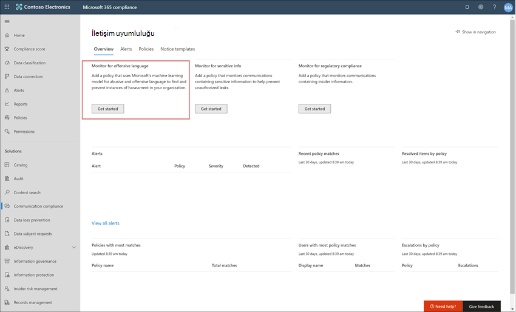

# Örnek olay inceleme - Contoso iletişimleri kontrol, metin Microsoft Teams, metin Exchange uygunsuz bir metin Yammer yapılandırıyor

E-posta iletişim Microsoft 365, iletileri uygunsuz metinlerle algılamanıza, yakalamanıza ve üzerinde işlemnize yardımcı olarak iletişim risklerini en aza indirmeye yardımcı olur. uygunsuz metinler küfür, tehdit, taciz ve uygunsuz görüntüler içerebilir. Önceden tanımlanmış ve özel ilkeler, iç ve dış iletişimleri ilke eşleşmeleri için taramanızı sağlar ve böylelikle bunlar belirlenen gözden geçirenler tarafından inceleştirilebilir. Gözden geçirenler, kuruluş içinde taranan e-postayı, Microsoft Teams, Yammer veya üçüncü taraf iletişimlerini inceler ve kuruluş ileti standartlarına uygun olduğundan emin olmak için uygun düzeltme eylemleri gerçekleştirebilirsiniz.

Contoso Corporation, uygun olmayan metni izlemek için hızla bir ilkeyi yapılandırması gereken kurgusal bir kuruluş. Bu kullanıcılar öncelikle e Microsoft 365 e-posta, Microsoft Teams ve Yammer desteği için kullanıyor, ancak iş yerindeki tacizle ilgili şirket politikasının zorunlu kılınmalarını yeni gereksinimlerle karşılamıyor. Contoso IT yöneticileri ve uyumluluk uzmanları, Microsoft 365 ile çalışmanın temellerini anlamak için temel bir yol gösterici bilgiler ediner ve iletişim uyumluluğunu hızla çalışmaya başlama konusunda uzlası bir kılavuz arıyor.

Bu örnek olay, uygunsuz metinle ilgili iletişimleri izlemek için iletişim uyumluluk ilkesi hızla yapılandırmayla ilgili temel bilgileri kapsayacaktır. Bu kılavuz şunları içerir:

- 1. Adım - İletişim uyumluluğunu planlama
- 2. Adım - Posta'da iletişim uyumluluğuna Microsoft 365
- 3. Adım - Önkoşulları yapılandırma ve iletişim uyumluluk ilkesi oluşturma
- 4. Adım - Uyarıların araştırma ve düzeltmesi

## 1. Adım: İletişim uyumluluğunu planlama

Contoso IT yöneticileri ve uyumluluk uzmanları, Microsoft 365'daki uyumluluk çözümleriyle ilgili çevrimiçi web seminerlerine katıldılar ve iletişim uyumluluk ilkelerinin iş yeri saldırılarını azaltmak için güncelleştirilmiş kurumsal ilke gereksinimlerini karşılamalarına yardımcı olacaklarına karar verdi. Birlikte çalışarak, Microsoft Teams'ta gönderilen sohbetler, Yammer'ta gönderilen sohbetler, özel iletiler ve topluluk konuşmaları için uygun olmayan metinleri ve Exchange Online'te gönderilen e-posta iletilerini izlemek üzere bir iletişim uyumluluk ilkesi oluşturmak ve etkinleştirmek üzere bir plan geliştirildi. Planları tanımlamayı içerir:

- İletişim uyumluluğu özelliklerine erişmesi gereken IT yöneticileri.
- İletişim ilkelerini oluşturması ve yönetmesi gereken uyumluluk uzmanları.
- İletişim uyumluluğu uyarılarını araştırması ve düzeltmesi gereken diğer departmanlarda (İnsan Kaynakları, Yasal, vb.) uyumluluk uzmanları ve diğer iş arkadaşları.
- İletişim uyumluluğu için uygun olmayan metin ilkesi kapsamında yer alan kullanıcılar.

### Lisanslama

İlk adım, Contoso'nun lisanslama Microsoft 365 uyumluluk çözümü için destek olduğunu onaylamaktır. İletişim uyumluluğuna erişmek ve bu uyumluluğu kullanmak için, Contoso IT yöneticilerinin Contoso'da aşağıdakilerden birinin olduğunu doğrulamaları gerekir:

- Microsoft 365 E5 (ücretli veya deneme sürümü)
- Microsoft 365 E3 + Microsoft 365 E5 Uyumluluk eklenti
- Microsoft 365 E3 + Microsoft 365 E5 Insider Risk Yönetimi eklentisi
- Microsoft 365 A5 (ücretli veya deneme sürümü)
- Microsoft 365 A3 + Uyumluluk Microsoft 365 A5 eklentiyi ekleme
- Microsoft 365 A3 + Microsoft 365 A5 Insider Risk Yönetimi eklentisi
- Microsoft 365 G5 aboneliği (ücretli veya deneme sürümü)
- Microsoft 365 G5 aboneliği + Microsoft 365 G5 Uyumluluk eklentiniz
- Microsoft 365 G5 aboneliği + Microsoft 365 G5 Insider Risk Yönetimi eklentisinde
- Office 365 Kurumsal E5 aboneliği (ücretli veya deneme sürümü)
- Office 365 Kurumsal E3 aboneliği + Office 365 Gelişmiş Uyumluluk eklentiyi içerir (artık yeni abonelikler için kullanılamaz, nota bakın)

Ayrıca, iletişim uyumluluk ilkelerine dahil olan kullanıcıların yukarıdaki lisanslardan biri atanmalıdır.

> [!IMPORTANT]
> Office 365 Gelişmiş Uyumluluk artık tek başına abonelik olarak satılmaz. Geçerli aboneliklerin süresi dolduğunda, müşteriler aynı veya ek uyumluluk özelliklerini içeren yukarıdaki aboneliklerden birini kullanmalı.

Contoso IT yöneticileri, Contoso için lisans desteğini doğrulamak için aşağıdaki adımları izleyin:

1. IT yöneticileri Oturum Açma Bilgileri'Microsoft 365 yönetim merkezi <https://admin.microsoft.com> ve <a href="https://go.microsoft.com/fwlink/p/?linkid=842264" target="_blank">**BillingLicenses'Microsoft 365 yönetim merkezi >**</a> >  gidin.

2. Burada, iletişim uyumluluğu için destek içeren [lisans seçeneklerine](communication-compliance-configure.md#subscriptions-and-licensing) sahip olduğunu onaylarlar.

### İletişim uyumluluğu izinleri

İletişim uyumluluğu özelliklerini yönetmek için izinleri yapılandırmak için kullanılan beş rol grubu vardır. İletişim **uyumluluğunu e-postada** menü seçeneği olarak Microsoft 365 uyumluluk merkezi bu yapılandırma adımlarına devam etmek için, Contoso yöneticilerine İletişim Uyumluluğu Yöneticisi *rolü* atanır.

Contoso, İletişim Uyumluluğu rol *grubunun* gruba tüm iletişim uyumluluk yöneticileri, analistler, tahminler ve görüntüleyicileri atamasına karar verir. Bu, Contoso'ya hızlı bir şekilde başlamalarını ve uyumluluk yönetim gereksinimlerini en iyi şekilde karşılamalarını kolaylaştırır.

|**Rol**|**Rol izinleri**|
|:-----|:-----|
| **İletişim Uyumluluğu** | Tek bir grupta, organizasyona iletişimi uyumluluğu yönetmek için bu rol grubunu kullanın. Belirlenen yöneticiler, analistler, analistler ve görüntüleyiciler için tüm kullanıcı hesaplarını ekleyerek, iletişim uyumluluk izinlerini tek bir grupta yapılandırabilirsiniz. Bu rol grubu tüm iletişim uyumluluğu izin rollerini içerir. bu yapılandırma, iletişim uyumluluğuyla hızlı bir şekilde çalışmaya başlamanın en kolay yoludur ve ayrı kullanıcı grupları için tanımlanmış ayrı izinlere ihtiyacı olan kuruluşlara iyi uyum sağlar. |
| **İletişim Uyumluluğu Yöneticisi** | Bu rol grubunu ilk başta iletişim uyumluluğunu yapılandırmak ve daha sonra iletişim uyumluluk yöneticilerini tanımlı bir grup haline çekmek için kullanın. Bu rol grubuna atanan kullanıcılar, iletişim uyumluluk ilkelerini, genel ayarları ve rol grubu atamalarını oluşturabilir, okuyabilir, güncelleştirabilir ve silebilir. Bu rol grubuna atanan kullanıcılar ileti uyarılarını görüntüamaz. |
| **İletişim Uyumluluğu Analisti** | İletişim uyumluluğu analistleri olarak görevecek kullanıcılara izin atamak için bu grubu kullanın. Bu rol grubuna atanmış olan kullanıcılar, Gözden Geçiren olarak atandığı ilkeleri iletiyi iletiyi gözden geçiricilerine gönderebilir (ileti içeriğine değil), ek gözden geçirenlere gönderebilir veya kullanıcılara bildirim gönderebilir. Analistler bekleyen uyarıları çözümleyemezse. |
| **İletişim Uyumluluğu Uyumluluk Uyumlulukları** | İletişim uyumluluğu uyumluluk uyumluluk uyumlulukları gibi davranacak kullanıcılara izinler atamak için bu grubu kullanın. Bu rol grubuna atanan kullanıcılar ileti meta verilerini ve içeriğini  neleri iletiyi gözden geçirenlere iletir, Advanced eDiscovery durumuna iyileştirmeyi, kullanıcılara bildirim gönderebilir ve uyarıyı çözebilir. |
| **İletişim Uyumluluğu Görüntüleyicisi** | İletişim raporlarını yönetecek kullanıcılara izin atamak için bu grubu kullanın. Bu rol grubuna atanan kullanıcılar, iletişim uyumluluğu giriş sayfasında tüm raporlama pencere öğelerine erişim sağlar ve tüm iletişim uyumluluk raporlarını  görebilirsiniz. |

1. Contoso IT yöneticileri, genel [yönetici Microsoft 365 uyumluluk merkezi](https://compliance.microsoft.com/permissions) kimlik bilgilerini kullanarak e-posta izinleri sayfasında oturum açın ve rolleri bu hesapta görüntülemek ve yönetmek için Microsoft 365.
2. Aşağıdaki Microsoft 365 uyumluluk merkezi, <a href="https://go.microsoft.com/fwlink/p/?linkid=2173597" target="_blank">**İzinler'e gider**</a> ve Office 365'de rolleri görüntülemek ve yönetmek için bağlantıyı Office 365.
3. Yöneticiler, İletişim Uyumluluğu *rol grubunu seçin* ve sonra da Rol grubunu **düzenle'yi seçin**.
4. Yöneticiler sol gezinti bölmesinde **Üye seç'i** ve sonra Düzenle'yi **seçin**.
5. **Ekle'yi seçer** ve sonra da iletişim uyumluluğunu yönetecek, araştıracak ve uyarıları gözden geçirecek tüm Contoso kullanıcıları için onay kutusunu seçerler.
6. Yöneticiler Ekle'yi **ve ardından** Bitti'yi **seçin**.
7. Contoso **kullanıcılarını rol** grubuna eklemek için Kaydet'i seçerler. Adımları tamamlamak **için Kapat'ı** seçerler.

## 2. Adım: Posta'da iletişim uyumluluğuna Microsoft 365

İletişim uyumluluğu için izinleri yapılandırdikten sonra, İletişim Uyumluluğu rol grubuna atanan Contoso IT yöneticileri ve uyumluluk uzmanları, uyumluluk çözümüne Microsoft 365. Contoso IT yöneticilerinin ve uyumluluk uzmanlarının iletişim uyumluluğuna erişmek ve yeni bir ilke oluşturmaya başlamanın çeşitli yolları vardır:

- Doğrudan iletişim uyumluluk çözümünden başlama
- Başlangıç Microsoft 365 uyumluluk merkezi
- Microsoft 365 çözüm kataloğundan başlama
- Başlangıç Microsoft 365 yönetim merkezi

### Doğrudan iletişim uyumluluk çözümünden başlama

Çözüme erişmenin en hızlı yolu, doğrudan İletişim uyumluluğu () **çözümünde oturum** açmadır<https://compliance.microsoft.com/supervisoryreview>. Bu bağlantı kullanılarak Contoso IT yöneticileri ve uyumluluk uzmanları, önceden tanımlanmış şablonlardan uyarıların durumunu hızla inceleyebilirsiniz ve yeni ilkeler oluşturabilirsiniz, iletişim uyumluluğu Genel Bakış panosuna yönlendiriliyor.

### Başlangıç Microsoft 365 uyumluluk merkezi

Contoso IT yöneticilerinin ve uyumluluk uzmanlarının iletişim uyumluluk çözümüne erişmesi için bir diğer kolay yol da doğrudan uyumluluk [çözümünde oturum](https://compliance.microsoft.com) Microsoft 365 uyumluluk merkezi. Oturum açmanın ardından, kullanıcıların tüm uyumluluk çözümlerini  görüntülemek için Tüm denetimi göster'i seçmeleri ve sonra da kullanmak için **İletişim uyumluluğu** çözümünü seçmeleri gerekir.

### Microsoft 365 çözüm kataloğundan başlama

Contoso IT yöneticileri ve uyumluluk uzmanları da Microsoft 365 kataloğunu seçerek iletişim uyumluluk çözümüne erişmeyi seçebilirler. Sol **gezintinin** **Çözümler bölümünde Kataloğu** seçerek, Microsoft 365 uyumluluk merkezi çözüm kataloğunu açabilir ve tüm uyumluluk çözümlerini Microsoft 365 açabilirler. Contoso IT yöneticileri **, Insider risk yönetimi bölümüne kadar aşağı** kaydırarak İletişim uyumluluğu bölümünü seçerek çalışmaya başlamayı tercih ediyor. Contoso IT yöneticileri ayrıca, ileriye doğru oturum aken daha hızlı erişim için iletişim uyumluluğu çözümünü sol gezinti bölmesine sabitlemek için Gezintide göster denetimlerini kullanmaya karar verir.

### Başlangıç Microsoft 365 yönetim merkezi

E-postadan başlayarak iletişim Microsoft 365 yönetim merkezi için Contoso IT [https://admin.microsoft.com)](https://admin.microsoft.com) yöneticileri ve uyumluluk uzmanları Microsoft 365 yönetim merkezi oturum Microsoft 365 uyumluluk merkezi 

Bu eylem Güvenlik **Office 365** Merkezi'nde açılır ve sayfanın en üstünde yer alan **başlıkta** Microsoft 365 uyumluluk merkezi bağlantının bağlantısını seçmesi gerekir.

Genel **web Microsoft 365 uyumluluk merkezi,** Contoso IT yöneticileri Tüm uyumluluk **çözümlerinin listesini** görüntülemek için Göster'i seçin.

Hepsi **göster'i seçdikten** sonra, Contoso IT yöneticileri iletişim uyumluluk çözümüne erişim sağlar.

## 3. Adım: Önkoşulları yapılandırma ve iletişim uyumluluk ilkesi oluşturma

İletişim uyumluluk ilkesine başlamanız için, Contoso IT yöneticilerinin uygun olmayan metni izlemek üzere yeni ilkeyi ayarlamadan önce yapılandırmaları gereken bazı önkoşullar vardır. Bu önkoşullar tamamlandıktan sonra, Contoso IT yöneticileri ve uyumluluk uzmanları yeni ilke ve uyumluluk uzmanları yapılandırarak oluşturulan uyarıları incelemeye ve düzeltmeye başlayabilir.

### Microsoft 365'de denetimi etkinleştirme

İletişim uyumluluğu, uyarıları göstermek ve gözden geçirenlerin sındırma eylemlerini izlemek için denetim günlükleri gerektirir. Denetim günlükleri, tanımlı bir kuruluş ilkesiyle ilişkili tüm etkinliklerin özetidir veya iletişim uyumluluk ilkesinde herhangi bir değişiklik olduğu zaman.

Contoso IT yöneticileri, denetimi açmak [için adım adım yönergeleri gözden](turn-audit-log-search-on-or-off.md) geçirerek tamamlar. Denetimi açmaları sonrasında, denetim günlüğünün hazır olduğunu ve birkaç saat içinde hazırlık tamamlandıktan sonra bir arama çalıştıracaklarını söyleyen bir ileti görüntülenir. Contoso IT yöneticilerinin bu eylemi yalnızca bir kez yapmaları gerekir.

### Yerel Yammer için kiracıyı yapılandırma

İletişim uyumluluğu için, Yammer özel iletilerde ve ortak topluluk konuşmalarında uygunsuz metni izlemek için Yerel Modda olan bir kuruluş kiracısı gerekir.

Contoso IT yöneticileri, [Microsoft 365'te Yammer](/yammer/configure-your-yammer-network/overview-native-mode) Yerel Mod'a Genel Bakış makalesinde bilgileri gözden geçirmelerini ve Yammer anızı yerel mod için yerel mod için yapılandırma makalesinde yer alan geçiş aracını çalıştırma [adımlarını Microsoft 365](/yammer/configure-your-yammer-network/native-mode) emin olun.

### Kapsam içinde kullanıcılar için grup ayarlama

Contoso uyumluluk uzmanları, uygun olmayan metni izleyecek iletişim ilkesine tüm kullanıcıları eklemek istiyor. Her kullanıcı hesabını ilkeye ayrı olarak eklemeye karar vermiş olabilir ama bunun çok daha kolay olduğuna karar vermiş ve kullanıcılar için bu ilkeye uygun olarak  Tüm Kullanıcılar dağıtım grubunu kullanmak size zaman kazandırır.

Tüm Contoso kullanıcılarını eklemek için yeni bir grup oluşturmaları gerekir, bu nedenle aşağıdaki adımları gerçekleştirler:

1. Contoso IT yöneticileri, GRUP'ta oturum Microsoft 365 yönetim merkezi [(https://admin.microsoft.com)](https://admin.microsoft.com) ve **Grup** >  Grupları Microsoft 365 yönetim merkezi > <a href="https://go.microsoft.com/fwlink/p/?linkid=2052855" target="_blank">**gidin**</a>.
2. Grup **ekle'yi seçerler** ve yeni grup veya Dağıtım Microsoft 365 *oluşturmak için* sihirbazı *tamamlarlar*.

    

3. Yeni grup oluşturulduktan sonra, tüm Contoso kullanıcılarını yeni gruba eklemeleri gerekir. Bunlar Exchange **merkezini** [(https://outlook.office365.com/ecp)](https://outlook.office365.com/ecp) ve Exchange **centerrecipientsGroups gruplarına** >  <a href="https://go.microsoft.com/fwlink/?linkid=2183233" target="_blank">**gidin**</a>. >  Contoso IT yöneticileri Üyelik alanı ve onların oluşturduğu yeni *Tüm* Çalışanlar grubunu seçer ve tüm Contoso kullanıcılarını sihirbazda  yeni gruba eklemek için Düzenle denetimlerini seçer.

    

### Uygun olmayan metni izlemek için ilke oluşturma

Tüm önkoşullar tamamlandığında, Contoso için IT yöneticileri ve uyumluluk uzmanları uygun olmayan metni izlemek üzere iletişim uyumluluk ilkesi yapılandırmaya hazırdır. Yeni uygun olmayan metin ilkesi şablonunu kullanmak, bu ilkeyi yapılandırmak basit ve hızlı bir işlemdir.

1. Contoso IT yöneticileri ve uyumluluk uzmanları kuruluşta oturum **Microsoft 365 uyumluluk merkezi** sol gezinti **bölmesinden İletişim uyumluluğu** öğesini seçin. Bu eylem, iletişim **uyumluluk ilkesi** şablonlarına hızlı bağlantılar içeren Genel Bakış panosuyu açar. Bu şablonlar, **Şablon için Başla'ya** seçerek Uygun olmayan **metin şablonunu** izle'yi seçerler.

    

2. İlke şablonu sihirbazında, Contoso IT yöneticileri ve uyumluluk uzmanları gerekli üç alanı tamamlamak için birlikte **çalışır:** İlke **adı, Denetleme** için kullanıcılar veya **gruplar ve Gözden Geçirenler**.
3. İlke sihirbazı ilke için önceden bir ad önerdiği için, BILGI yönetimi ve uyumluluk uzmanları önerilen adı tutmaya ve kalan alanlara odaklanmaya karar verir. Bu kullanıcılar veya *grupların* Denetleme alanı için  Tüm kullanıcılar grubunu seçer ve Gözden Geçirenler alanı için ilke uyarılarını araştırması ve düzeltmesi gereken uyumluluk **uzmanlarını** seçerler. İlkeyi yapılandırmanın ve uyarı bilgilerini toplamaya başlamanın son adımı İlke **oluştur'a seçmektir**.

    

## 4. Adım: Uyarıları araştırma ve düzeltme

Artık uygun olmayan metni izleme iletişim uyumluluk ilkesi yapılandırıldığına göre, Contoso uyumluluk uzmanları için bir sonraki adım ilke tarafından oluşturulan uyarıları araştırmak ve düzeltmektir. İlkenin tüm iletişim kaynağı kanallarıyla iletişimleri tam olarak işlemesi ve uyarıların Uyarı panosunda görünür olması 24 **saat kadar sürer**.

Uyarılar oluşturulduktan sonra, Contoso uyumluluk uzmanları uygun olmayan metin sorunlarını [araştırmak](communication-compliance-investigate-remediate.md) ve düzeltmek için iş akışı yönergelerini takip eder.