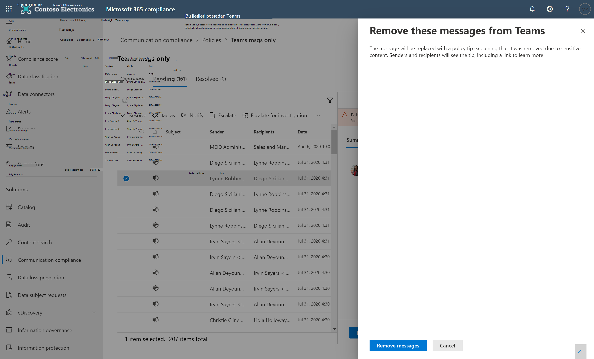

# <a name="investigate-and-remediate-communication-compliance-alerts"></a>İletişim uyumluluk uyarılarını araştırma ve düzeltme

İletişim uyumluluğu ilkelerinizi yapılandırdıktan sonra, İlke koşullarınıza uygun ileti sorunları için Microsoft 365 uyumluluk merkezi uyarıları almaya başlarsınız. Uyarı sorunlarını araştırmak ve düzeltmek için buradaki iş akışı yönergelerini izleyin.

## <a name="investigate-alerts"></a>Uyarıları araştırma

İlkeleriniz tarafından algılanan sorunları araştırmanın ilk adımı, İlkeler iletişim uyumluluk uyarılarını gözden geçirmek Microsoft 365 uyumluluk merkezi. Uyarı grubunu nasıl görüntülemeyi tercih ettiğinize bağlı olarak, iletişim uyumluluğu çözümü alanında uyarıları hızla araştırmanıza yardımcı olacak birkaç alan vardır:

- **İletişim uyumluluğu ilkesi sayfası**: Microsoft 365 uyumluluk merkezi kuruluşunda yönetici hesabının [](https://compliance.microsoft.com) kimlik bilgilerini kullanarak oturum a Microsoft 365, İletişim uyumluluğu İlkesi sayfasını görüntülemek için İletişim uyumluluğu **öğesini** seçin. Bu sayfada, her bir kuruluş için yapılandırılmış iletişim Microsoft 365 ilkeleri ve önerilen ilke şablonlarının bağlantıları görüntülenir. Listelenen her ilke gözden geçirmesi gereken uyarı sayısını, geçen ve çözümlenen öğelerin sayısını, ilkenin durumunu ve son ilke taramasının tarih ve saati içerir. İlkeyi seçme, ilkeyle eşleşmeler için bekleyen tüm uyarıları görüntüler, ilke ayrıntıları sayfasını başlatmak ve düzeltme eylemleri başlatmak için belirli bir uyarıyı seçin.
- **Uyarılar**: İlke **eşleşmelerine göre** >  gruplandı olarak son 30 günlük uyarıları görüntülemek için İletişim **uyumluluğuAlerts'e** gidin. Bu görünüm, önem düzeyine göre en fazla uyarıyı hangi iletişim uyumluluk ilkelerinin oluştur uygunluk ilkelerinin ortaya verdiğini hızla görmelerini sağlar. Düzeltme eylemleri başlatmak için, uyarıyla ilişkilendirilmiş ilkeyi seçerek **İlke ayrıntıları sayfasını** başlatabilirsiniz. İlke **ayrıntıları sayfasında**, Genel Bakış sayfasındaki etkinliklerin özetini gözden geçirebilir,  Bekleyen sayfasındaki uyarı iletilerini gözden geçirebilir ve üzerinde eylem  gerçekleştirebilir veya Çözümlenen sayfasında kapalı uyarı geçmişini **gözden geçirebilirsiniz**.
- **Raporlar**: İletişim **uyumluluğuReports'a**  >  gidin, iletişim uyumluluğu raporu pencere öğelerini görüntülemek için. Her widget, ilke eşleşmeleri ve düzeltme eylemleri hakkında daha ayrıntılı içgörülere erişim de içinde olmak üzere, iletişim uyumluluk etkinliklerine ve durumlarına genel bir bakış sağlar.

### <a name="using-filters"></a>Filtreleri kullanma

Sonraki adım, uyarıları araştırmanız daha kolay olacak şekilde iletileri sıralamaktır. İlke **ayrıntıları sayfasında** , iletişim uyumluluğu çeşitli ileti alanlarında çok düzeyli filtrelemeyi desteklemektedir ve ilke eşleşmeleri olan iletileri hızla araştırmanıza ve gözden geçirmenize yardımcı olur. Filtreleme, yapılandırılmış her ilke için bekleyen ve çözümlenmiş öğeler için kullanılabilir. Bir ilke için filtre sorgularını yapılandırarak veya belirli her ilkede kullanmak üzere özel ve varsayılan filtre sorgularını yapılandırarak kaydedebilirsiniz. Filtrenin alanlarını yapılandırdikten sonra, belirli filtre değerleri için yapılandırabilirsiniz uyarı iletisi kuyruğunda görüntülenen filtre alanlarının olduğunu görünür.

Tarih filtresi için, olayların tarih ve saati Eşgüdümli Evrensel Saat (UTC) içinde listelenir. Görünümler için iletilere filtre uygulama işlemi görüntülerken, kullanıcı yerel tarih/saati, kullanıcının yerel tarih/saati UTC'ye dönüştürme işlemini temel alarak sonuçları belirler. Örneğin, ABD'de Pasifik Gün Işığı Saati (PDT) kullanıcısı bir raporu 30/8/2021 ile 31/8/2021 arasındaki saat 00:00'da filtrelerse, rapor 30/8/2021 07:00 UTC ile 31/8/2021 07:00 UTC arasındaki iletileri içerir. Aynı kullanıcı Saat 00:00'da filtreleme için ABD Doğu Avrupa Saati'nde (EDT) yer aldı ise, rapor 30/8/2021 04:00 UTC ile 31/8/2021 04:00 UTC arasındaki iletileri içerir.

#### <a name="filter-details"></a>Filtre ayrıntıları

İletişim uyumluluk filtreleri, daha hızlı araştırma yapmak ve düzeltme eylemleri için uyarı iletilerini filtreleme ve sıralamaya olanak sağlar. Filtreleme, her ilke için **Bekleyen** ve **Çözümlenmiş** sekmelerinde bulunur. Kaydedilmiş bir filtre sorgusu olarak ayarlanmış bir filtreyi veya filtreyi kaydetmek için, bir veya birden çok değerin filtre seçimleri olarak yapılandırılması gerekir.

Aşağıdaki tabloda filtre ayrıntıları ana hatlarıyla açık):

|**Filtre**|**Ayrıntılar**|
|:-----|:-----|
| **Tarih** | İletinin, kuruluşta bir kullanıcı tarafından gönderildiği veya alın aldığı tarih. Tek bir güne göre filtrelemek için, sonuçları istediğiniz günle başlayan ve sonraki günle sona eren bir tarih aralığı seçin. Örneğin, sonuçları 20/9/2020 için filtrelemek istediysiniz, 20/9/2020-21/2020 filtre tarih aralığını seçersiniz.|
| **Dosya sınıfı** | İletinin sınıfını ileti türüne (ileti veya *eke* göre *) temel alır*. |
| **Eki var** | İletide ekin iletişim durumu. |
| **Öğe sınıfı** | İletinin kaynağı olarak ileti türü, e-posta, Microsoft Team sohbeti, Bloomberg vb. temel alınmalıdır. Sık kullanılan Öğe Türleri ve İleti Sınıfları hakkında daha fazla bilgi için bkz. [Öğe Türleri ve İleti Sınıfları](/office/vba/outlook/concepts/forms/item-types-and-message-classes). |
| **Alıcı etki alanları** | İletinin gönderildiği etki alanı. Bu etki alanı normalde Microsoft 365 etki alanınızdır. |
| **Alıcı** | İletinin gönderildiği kullanıcı. |
| **Gönderen** | İletiyi gönderen kişi. |
| **Gönderen etki alanı** | İletiyi gönderen etki alanı. |
| **Boyut** | KB olarak ileti boyutu. |
| **Konu/Başlık** | İleti konusu veya sohbet başlığı. |
| **Etiketler** | İletiye atanmış olan Etiketler: *Sorulabilir*, *Uyumlu* veya *Uyumlu Değil*. |
| **Dil** | İletide metnin algılandı dili. İleti, ileti metninin çoğunluğunun diline göre sınıflandırılır. Örneğin, hem Almanca hem de İtalyanca metin içeren bir ileti için, metnin çoğunluğu Almancadır, ileti Almanca (DE) olarak sınıflandırılır. Desteklenen diller: Çince (Basitleştirilmiş - ZH), İngilizce (EN), Fransızca (FR), Almanca (DE), İtalyanca (IT), Japonca (JP), Portekizce (PT) ve İspanyolca (ES). Örneğin, Almanca ve İtalyanca olarak sınıflandırılmış iletileri filtrelemek için, Dil filtresi arama kutusuna 'DE,IT' (2 basamaklı dil kodları) girin. İletinin algılanan dil sınıflandırması'nı görüntülemek için bir ileti seçin, İleti ayrıntılarını görüntüle'yi seçin ve E-postaYgulamaSıklama alanını kaydırın. |
| **İlerlediği yer** | İleti yükseltme eyleminin parçası olarak bulunan kişinin kullanıcı adı. |
| **Sınıflayıcılar** | İletiye uygulanacak yerleşik ve özel sınıflayıcıların adı. Bazı örnekler, *Hedefli Taciz*, *Küfür*, *Tehdit ve* daha fazlası olabilir.

#### <a name="to-configure-a-filter"></a>Filtreyi yapılandırmak için

1. Bir [Microsoft 365 uyumluluk merkezi yönetici hesabının](https://compliance.microsoft.com) kimlik bilgilerini kullanarak oturum Microsoft 365.

2. aşağıdaki Microsoft 365 uyumluluk merkezi **uyumluluğu'ne gidin**.

3. **İlkeler** sekmesini seçin ve sonra araştırma için bir ilke seçin, çift tıklayın ve İlke **sayfasını** açın.

4. İlke **sayfasında** , filtre öğelerini **görüntülemek için Bekleyen** **veya** Çözümlenmiş sekmesini seçin.

5. Filtreler ayrıntılarını **sayfasını** açmak için Filtreler **denetimine** tıklayın.

6. Bu uyarılara yönelik filtreleri etkinleştirmek için bir veya birden çok onay kutusunu seçin. Tarih, Gönderen, Konu/Başlık *, Sınıflandırıcılar**, Dil* *ve* daha *fazlası gibi çok* sayıda filtreden birini seçebilirsiniz.

7. Seçilen filtreyi varsayılan filtre olarak kaydetmek için Varsayılan olarak **kaydet'i seçin**. Bu filtreyi kaydedilmiş bir filtre olarak kullanmak için Bitti'yi **seçin**.

8. Seçili filtreleri filtre sorgusu olarak kaydetmek için, en az bir filtre değeri yapılandırdıktan  sonra Sorgu denetimi kaydet'i seçin. Filtre sorgusu için bir ad girin ve Kaydet'i **seçin**. Bu filtre yalnızca bu ilke için kullanılabilir ve Filtreler ayrıntıları sayfasının **Kaydedilmiş** filtre sorguları **bölümünde** listelenir.

    

### <a name="using-near-and-exact-duplicate-analysis"></a>Yakın ve tam olarak yinelenen çözümleme kullanma

İletişim uyumluluk ilkeleri, herhangi bir ek yapılandırma adımı olmadan yakın ve tam ileti yinelemelerini otomatik olarak tarar ve önceden gruplar. Bu görünüm, benzer iletiler üzerinde bire bir veya grup olarak hızla işlem alamanızı sağlar ve gözden geçirenler için ileti soruşturma yükünü azaltabilirsiniz. Yinelenenler algılandığında, düzeltme eylem araç  çubuğunda Yakın Yinelemeler ve/veya  Tam Yinelenenler denetimleri görüntülenir. Yakın veya tam yinelemeler bulunamasa da bu görünüm kullanılamaz.

#### <a name="to-remediate-duplicates"></a>Yinelemeleri düzeltmek için

1. Bir [Microsoft 365 uyumluluk merkezi yönetici hesabının](https://compliance.microsoft.com) kimlik bilgilerini kullanarak oturum Microsoft 365.

2. aşağıdaki Microsoft 365 uyumluluk merkezi **uyumluluğu'ne gidin**.

3. **İlkeler** sekmesini seçin ve sonra araştırma için bir ilke seçin, çift tıklayın ve İlke **sayfasını** açın.

4. İlke **sayfasında** , yinelenen iletileri görüntülemek **için Bekleyen** **veya** Çözümlenmiş sekmesini seçin.

5. Yinelenenler **ayrıntıları sayfasını açmak** **için Yakın Yinelemeler** veya Tam Yinelenenler denetimlerini seçin.

6. Bu iletilerin eylem denetimlerini düzeltmeye yönelik bir veya birden çok ileti seçin.

7. Eylemi **varsayılan** filtre **olarak** **seçili yinelenen iletilere** **uygulamak için** Çöz, Bildir, İlerle veya İndir'i seçin.

8. **İletilerin** düzeltme eylemlerini tamamladıktan sonra Kapat'ı seçin.

    

## <a name="remediate-alerts"></a>Uyarıları düzeltme

Uyarıları veya yapılandırmış olduğunuz filtrelemeyi gözden geçirmek için nereden başlar olun, bir sonraki adım uyarıyı düzeltmek için harekete geçirmektir. İlke veya Uyarılar sayfalarındaki aşağıdaki iş akışını kullanarak **uyarı düzeltmenizi** başlatabilirsiniz.

### <a name="step-1-examine-the-message-basics"></a>1. Adım: İletiyle ilgili temel bilgileri inceleme

 Bazen, bir iletinin hemen düzeltil sourcea veya konudan belli olur. İleti, ilkeye göre teşvik edilmiş veya yanlış şekilde eşlenmiş olabilir ve yanlış sınıflandırılmış olarak çözümlenmiş olabilir. Yanlış **sınıflandırılan içeriği** Microsoft'la paylaşmak, uyarıyı hemen çözmek ve bekleyen uyarı kuyruğundan kaldırmak için Sınıflandırılmamış olarak bildir denetimlerini seçin. Kaynak veya gönderen bilgilerinden, iletinin bu koşullarda nasıl yönlendirnebilir veya ele alıcı olacağını zaten biliyorabilirsiniz. Geçerli **iletilere etiket atamak** **veya belirli bir** gözden geçirene ileti göndermek için Farklı Etiketle veya İlerle denetimlerini kullanmayı göz önünde bulundurabilirsiniz.


### <a name="step-2-examine-the-message-details"></a>2. Adım: İleti ayrıntılarını inceleme

İletiyle ilgili temel bilgileri gözden geçirdikten sonra, ayrıntıları incelemek ve başka düzeltme eylemleri belirlemek için bir ileti açmanın zamanı geldi. İletinin üst bilgisini ve gövde bilgilerini görüntülemek için bir ileti seçin. Doğru eylemin ne olduğuna karar vermelerine yardımcı olmak için birkaç farklı seçenek ve görünüm vardır:

- **Ekler**: Bu seçenek, ilke koşullarına uygun modern ekleri incelemeye olanak sağlar. Modern eklerin içeriği metin olarak ayıklanır ve ilke için Bekleyen uyarılar panosunda görüntülenir. Daha fazla bilgi için, İletişim [uyumluluğu özellik başvurusuna bakın](/microsoft-365/compliance/communication-compliance-channels).
- **Kaynak**: Bu görünüm, web tabanlı ileti platformlarının çoğunda yaygın olarak görülen standart ileti görünümüdur. Üst bilgi normal stilde biçimlendirilen ve ileti gövdesi, biriktirilen grafik dosyalarını ve sözcük kaydırılmış metni destekler. [İlke için optik karakter tanıma (OCR)](communication-compliance-policies.md#optical-character-recognition-ocr) etkinse, ilke koşulluyla eşan basılı veya el yazısı metin içeren resimler bu görünümde ilişkili ileti için alt öğe olarak görüntülenecektir.
- **Düz metin**: Metin görünümü iletinin yalnızca satır numaralı metin görünümünü görüntüler ve ilgili iletişim uyumluluk ilkesinde belirtilen hassas bilgi türü terimleri veya anahtar sözcükler için iletilerde ve eklerde anahtar sözcük vurgulaması içerir. Anahtar sözcük vurgulama, ilgi alanı için uzun iletileri ve ekleri hızla taramanıza yardımcı olabilir. Bazı durumlarda, vurgulanan metin yalnızca ilke koşullarıyla eşleşen iletiler için eklerde olabilir. Anahtar sözcük vurgulama, bir ilkeye atanmış yerleşik sınıflayıcılar tarafından tanımlanan terimler için desteklenmiyor. Eklenmiş dosyalar görüntülenmez ve bu görünümü satır numaralama, birden çok gözden geçiren kişi arasında ilgili ayrıntılara başvurmak için yararlıdır.
- **Konuşma (önizleme)**: Sohbet Microsoft Teams için kullanılabilir, bu görünümde gözden geçirenlerin konuşma bağlamında etkinliği görüntülemelerine yardımcı olmak için uyarı iletisi öncesinde ve sonrasında en çok beş ileti görüntülenir. Bu bağlam gözden geçirenlerin iletileri hızla değerlendirmelerine ve daha bilinçli ileti çözümü kararları almalarına yardımcı olur. Tüm satır içi resimler, emojiler ve çıkartmalar da dahil olmak üzere konuşmalara gerçek zamanlı ileti eklemeleri Teams. İletilere resim veya metin dosyası ekleri görüntülenmez. Düzenlenen iletiler için veya konuşma penceresinden silinen iletiler için bildirimler otomatik olarak görüntülenir. İleti çözümlenirken, ilişkili konuşma iletileri çözülen iletiyle birlikte tutmaz. Konuşma iletileri, uyarı iletisi tanımlandıktan sonra 60 gün boyunca kullanılabilir.
- **Kullanıcı geçmişi**: Kullanıcı geçmişi görünümü, iletiyi gönderen kullanıcı için herhangi bir iletişim uyumluluk ilkesi tarafından oluşturulan diğer tüm uyarıları görüntüler.
- **Desen algılanan bildirim**: Zaman içinde birçok rahatsız etme ve rahatsız etme eylemi ve kullanıcının aynı davranışı tekrar tekrar gerçekleştirerek tekrar gerçekleştir: Desen *algılandı* bildirimi uyarı ayrıntılarında görüntülenir ve uyarıya dikkat çeker. Modellerin algılanması ilke temelindedir ve gönderen tarafından aynı alıcıya en az iki iletinin gönderildiği son 30 gün içerisinde davranışı değerlendirir. Şüpheliler ve gözden geçirenler bu bildirimi, uyarıyı uygun şekilde değerlendirmek üzere tekrarlanan davranışı belirlemek için kullanabilir.
- **Çeviri**: Bu görünüm, uyarı iletisi metnini otomatik olarak gözden geçiren her bir kullanıcı için Bir  Microsoft 365 için Görüntülenen dil ayarında yapılandırılan dile dönüştürür. Çeviri *görünümü* , çok dilli kullanıcılara sahip kuruluşlar için daha kapsamlı destek sağlar ve iletişim uyumluluğu gözden geçirme işlemi dışında ek çeviri hizmetleri ihtiyacı ortadan kalkmış olur. Microsoft çeviri hizmetleri kullanılarak, *Çeviri* görünümü gerektiğinde açılıp kapatabilirsiniz ve çok çeşitli dilleri destekler. Desteklenen dillerin tam listesi için bkz. [dillerin Microsoft Çeviri bakın](https://www.microsoft.com/translator/business/languages/). Dil Listesinde Çeviri *diller* Çeviri *görünümünde de* desteklenmiştir.

### <a name="step-3-decide-on-a-remediation-action"></a>3. Adım: Düzeltme eylemine karar verme

Artık uyarıyla ilgili iletinin ayrıntılarını gözden geçirdiniz, çeşitli düzeltme eylemleri seçebilirsiniz:

- **Çözümle**: Çöz **denetimi seçilmelidir** , iletiyi hemen Bekleyen **uyarılar** kuyruğundan kaldırır ve iletiye başka bir işlem işlem yoktur. Çöz'i **seçerek**, temelde başka sınıflandırmaya gerek kalmadan uyarıyı kapatmış olmazz. Tüm çözümlenmiş iletiler Çözülen **sekmesinde** görüntülenir.
- **Yanlış sınıflandırılan olarak rapor:** İletiyi her zaman, ileti gözden geçirme iş akışı sırasında herhangi bir noktada yanlış sınıflandırılma olarak çözebilirsiniz. Yanlış sınıflandırıltılı, uyarının işlem dışı olduğu veya uyarının uyarı işlemi ve herhangi bir eğitime uygun sınıflandırıcı tarafından yanlış oluşturulmuş olduğunu gösterir. Yanlış sınıflandırılan olarak öğeyi çözümlemek, eğitilebilir sınıflayıcıları geliştirmeye yardımcı olmak için ileti içeriğini, eklerini ve ileti konusunu (meta veriler dahil) Microsoft'a gönderir. Microsoft'a gönderilen veriler, kuruluşta yer alan kullanıcıları tanımlamak veya tanımlamak için kullanılmaktadır. İletide başka işlemler gerçekleştiremezsiniz ve sınıflandırılmamış tüm iletiler Çözümlendi **sekmesinde** görüntülenir.
- **Power Automate akışı (önizleme)**: Uyarı Power Automate için süreç görevlerini otomatikleştirmek üzere bir akış akışı kullanın. İletişim uyumluluğu, varsayılan olarak, gözden  geçirenlerin ileti uyarılarına sahip kullanıcılar için bildirim işlemini otomatikleştirmek için kullanabileceği bir iletişim uyumluluğu uyarı şablonuna sahip olduğunda Bildirim yöneticisini içerir. İletişim uyumluluğu içinde akış oluşturma Power Automate hakkında daha fazla bilgi için **, bu makalenin 5. Adım: Akış Power Automate** göz önünde bulundurabilirsiniz.
- **Etiketle**: İletiyi *uyumlu, uyumlu* olmayan veya kuruma yönelik ilkeler  ve standartlarla ilgili olarak şüpheli olarak işaretleyin. Etiket ve etiketleme açıklaması eklemek, yükseltmeler için veya diğer iç inceleme işlemlerinin bir parçası olarak ilke uyarılarını mikro filtre uygulamanıza yardımcı olur. Etiketleme tamamlandıktan sonra iletiyi, bekleyen gözden geçirme kuyruğutan dışarı taşımak için çözmeyi de seçebilirsiniz.
- **Bildirim**: Uyarıya **özel bir** bildirim şablonu atamak ve kullanıcıya uyarı bildirimi göndermek için Bildir denetimlerini kullanabilirsiniz. İletişim uyumluluğu ayarları alanında yapılandırılan uygun bildirim şablonunu  seçin ve iletiyi göndererek kullanıcıya e-postayla bir anımsatıcı göndermek ve sorunu çözmek için Gönder'i seçin.
- **İlerle**: **İlerle** denetimi kullanarak, kuruluşta başka kimlerin iletiyi gözden geçirmesi gerektiğini seçebilirsiniz. İleti uyarısının ek gözden geçirilmesi için bir e-posta bildirimi göndermek üzere iletişim uyumluluğu ilkesinde yapılandırılan gözden geçirenler listesinden seçim. Seçilen gözden geçiren, doğrudan gözden geçirilecek öğelere gitmek için e-posta bildiriminde bu bağlantıyı kullanabilir.
- **Soruşturma için yükseltme**: İnceleme için **İlerleten** denetimi kullanarak, bir veya birden çok [ileti için Advanced eDiscovery büyük/](overview-ediscovery-20.md)küçük harf kullanımı durumu oluşturabilirsiniz. Yeni vaka için bir ad ve notlar sağlarsınız ve ilkeyle eşleşen iletiyi gönderen kullanıcı otomatik olarak servis durumu koruyucu olarak atanır. Vakayı yönetmek için ek izinlere ihtiyacınız yok. Olay oluşturma, ileti için çözüm veya yeni bir etiket oluşturmaz. Düzeltme işlemi sırasında büyük/küçük harfe yakın bir durum oluştururken Advanced eDiscovery 100 ileti seçin. Tüm iletişim kanallarında, iletişim uyumluluğu tarafından izlenen iletiler de destekleniyor. Örneğin, bir kullanıcı için yeni bir olay Microsoft Teams 25 Exchange Online sohbeti, 25 Exchange Online e-posta Yammer Advanced eDiscovery ileti seçebilirsiniz.
- **Teams'ta** mesajı kaldırma: **Teams** denetiminde Mesajı kaldır'ı kullanarak Microsoft Teams kanalları, 1:1 ve grup sohbetleri uyarılarında tanımlanan uygunsuz iletileri ve içeriği engelleyebilirsiniz. Kaldırılan iletiler ve içerik, engellenmiş olduğunu ve görünümden kaldırma işlemi için geçerli olan ilkeyi açıklayan bir ilke ipucuyla değiştirilir. Alıcılara, ilgili ilke ve gözden geçirme işlemi hakkında daha fazla bilgi edinmek için ilke ipucunda bir bağlantı sağlanır. Gönderen, engellenen ileti ve içerik için bir ilke ipucu alır, ancak engellenen iletinin ayrıntılarını ve kaldırma işlemiyle ilgili içeriği gözden geçirebilirsiniz.

    

### <a name="step-4-determine-if-message-details-should-be-archived-outside-of-communication-compliance"></a>4. Adım: İleti ayrıntılarının iletişim uyumluluğu dışında arşivlenir olup olmadığını belirleme

İletileri ayrı bir depolama çözümünde arşivlemeniz gerekirse, ileti ayrıntıları dışarı aktarabilirsiniz veya indirilebilir. İndir **denetimi seçildiğinde,** seçilen iletiler otomatik olarak .ZIP dışında bir depolama alanına kaydedilecek bir Microsoft 365.

### <a name="step-5-consider-power-automate-flows"></a>5. Adım: Akış Power Automate göz önünde bulundur

[Microsoft Power Automate](/power-automate/getting-started), uygulamalar ve hizmetler genelinde eylemleri otomatik haleleştiren bir iş akışı hizmetidir. Şablonlardan gelen akışları kullanarak veya el ile oluşturulan bunları kullanarak, bu uygulama ve hizmetlerle ilişkili genel görevleri otomatik haleebilirsiniz. İletişim uyumluluğu Power Automate akışlarını etkinleştirebilir ve uyarılar ve kullanıcılar için önemli görevleri otomatik hale etkinleştirebilirsiniz. Kullanıcıların iletişim Power Automate uyarılarına ve diğer uygulamalarına sahip olduğunu yöneticilere bildirmek için kullanıcı akışlarını yapılandırabilirsiniz.

İletişim uyumluluğu Microsoft 365 abonelikleri olan müşterilerin, önerilen varsayılan iletişim uyumluluğu Power Automate şablonu kullanmak için ek iletişim Power Automate yoktur. Varsayılan şablon, kurumlarınızı destekleyecek şekilde özelleştirilebilir ve temel iletişim uyumluluğu senaryolarını kapsıyor olabilir. Bu şablonlarda premium Power Automate özelliklerini kullanmayı seçerseniz, Microsoft 365 uyumluluk bağlayıcısı kullanarak özel bir şablon oluşturun veya Microsoft 365'daki diğer uyumluluk alanları için Power Automate şablonlarını kullanırsanız, ek uyumluluk Power Automate lisansları vardır.

> [!IMPORTANT]
> Bu akışlarda test etme sırasında ek lisans doğrulaması isten Power Automate mi alasınız? Kuruluş, bu önizleme özelliği için henüz hizmet güncelleştirmeleri alamamıştır. Güncelleştirmeler dağıtılır ve iletişim uyumluluğu içeren Microsoft 365 aboneliklerine sahip tüm kuruluşlar, 30 Ekim 2020'ye kadar önerilen Power Automate şablonlarından oluşturulan akışlar için lisans desteğine sahip olması gerekir.


Aşağıdaki Power Automate uyumluluk uyarıları için süreç otomasyonunu desteklemek için müşterilere sağlanır:

- **Bir kullanıcının iletişim uyumluluğu uyarısı olduğunda yöneticiye** bildirme: Bazı kuruluşların, kullanıcı iletişim uyumluluğu uyarısı olduğunda hemen yönetim bildirimine ihtiyacı olabilir. Bu akış yapılandırıldığında ve seçildiğinde, olay yöneticisine tüm uyarılar hakkında aşağıdaki bilgileri içeren bir e-posta iletisi gönderilir:
  - Uyarı için geçerli ilke
  - Uyarının Tarihi/Saati
  - Uyarının önem düzeyi

#### <a name="create-a-power-automate-flow"></a>Akış Power Automate oluşturma

Önerilen Power Automate şablondan akış oluşturmak için, doğrudan uyarıda çalışırken otomatik **denetimden Power Automate** akışlarını yönet seçeneğini kullanırsınız. Akış akışlarını Power Automate **akışlarını Power Automate** için en az bir iletişim uyumluluk rol grubunun üyesi olmak gerekir.

Varsayılan şablondan yeni bir Power Automate akışı oluşturmak için aşağıdaki adımları tamamlayın:

1. Uyumluluk [Microsoft 365 uyumluluk merkezi](https://compliance.microsoft.com) İletişim  > **uyumluluğuPolicies'e** gidin ve gözden geçirmek istediğiniz uyarıya sahip ilkeyi seçin.
2. İlkeden Bekliyor sekmesini **seçin** ve bekleyen uyarıyı seçin.
3. Uyarı **Power Automate** menüsünde Seçenekler'i seçin.
4. İletişim **Power Automate**, sayfanın İletişim uyumluluğu şablonları bölümünden **bir varsayılan** şablon seçin.
5. Akış, akış için gereken ekli bağlantıları gösterir ve bağlantı durumları kullanılabilir durumda olursa görüntülenir. Gerekirse, kullanılabilir durumda görüntülenmeen tüm bağlantıları güncelleştirin. **Devam'ı seçin**.
6. Varsayılan olarak, önerilen akışlar önerilen iletişim uyumluluğu ile önceden yapılandırılmıştır ve akış için atanan görevi tamamlamak için Microsoft 365 hizmet veri alanları gerekir. Gerekirse, Gelişmiş seçenekleri göster denetimlerini kullanarak ve **akış bileşeni** için kullanılabilir özellikleri yapılandırarak akış bileşenlerini özelleştirin.
7. Gerekirse, Yeni adım düğmesini seçerek akışa ek **adımlar** ekleyin. Çoğu durumda, önerilen varsayılan şablonlar için bu değişiklik gerekli olmaması gerekir.
8. Daha **sonra yapılandırma** yapmak üzere akışı kaydetmek için Taslağı kaydet'i veya akışın yapılandırmasını tamamlamak için Kaydet'i seçin.
9. Akış **akışı** sayfasına dönmek için Power Automate seçin. Yeni şablon, Akışlarım sekmesinde akış olarak listelenir ve iletişim  uyumluluk uyarılarıyla çalışırken akışı oluşturan kullanıcıya Power Automate denetiminden otomatik olarak kullanılabilir.

#### <a name="share-a-power-automate-flow"></a>Akış Power Automate paylaşma

Varsayılan olarak Power Automate oluşturduğu akışlara yalnızca o kullanıcı tarafından kullanılabilir. Diğer iletişim uyumluluğu kullanıcılarının akışa erişimi ve akış kullanması için, akışı oluşturan kişi tarafından paylaşılıyor olması gerekir. Akışı paylaşmak için, doğrudan bir **uyarıda Power Automate** denetime sahip denetim kullanırsiniz.

Bir iletişim Power Automate paylaşmak için, en az bir iletişim uyumluluk rol grubunun üyesi olmak gerekir.
Veri akışı paylaşmak için aşağıdaki Power Automate tamamlayın:

1. Uyumluluk [Microsoft 365 uyumluluk merkezi](https://compliance.microsoft.com) İletişim  > **uyumluluğuPolicies'e** gidin ve gözden geçirmek istediğiniz uyarıya sahip ilkeyi seçin.
2. İlkeden Bekliyor sekmesini **seçin** ve bekleyen uyarıyı seçin.
3. Uyarı **Power Automate** menüsünde Seçenekler'i seçin.
4. Akış **Power Automate,** Akışlarım **veya Ekip akışları** **sekmesini** seçin.
5. Paylaşacak akışı seçin ve ardından akış seçenekleri **menüsünden** Paylaş'ı seçin.
6. Akış paylaşımı sayfasında, akış için sahip olarak eklemek istediğiniz kullanıcının veya grubun adını girin.
7. Bağlantı Kullanıldı **iletişim kutusunda** , eklenen **kullanıcının veya grubun** akışa tam erişime sahip olduğunu kabul etmek için Tamam'ı seçin.

#### <a name="edit-a-power-automate-flow"></a>Akış Power Automate düzenleme

Bir akışı düzenlemeniz gerekirse, doğrudan bir **uyarıda Power Automate** denetime sahip denetime sahip olursanız. Bir iletişim Power Automate düzenlemek için en az bir iletişim uyumluluk rol grubunun üyesi olmak gerekir.

Bir veri akışını düzenlemek için aşağıdaki Power Automate tamamlayın:

1. Uyumluluk [Microsoft 365 uyumluluk merkezi](https://compliance.microsoft.com) İletişim  > **uyumluluğuPolicies'e** gidin ve gözden geçirmek istediğiniz uyarıya sahip ilkeyi seçin.
2. İlkeden Bekliyor sekmesini **seçin** ve bekleyen uyarıyı seçin.
3. Uyarı **Power Automate** menüsünde Seçenekler'i seçin.
4. Sayfa **Power Automate,** düzenlemek için akış öğesini seçin. Akış **denetimi** menüsünden Düzenle'yi seçin.
5. Akış bileşeni **Ayarlar** >  **değiştirmek için** üç noktayı veya akış bileşenini **silmek** >  için üç noktayı seçin.
6. Akışı **düzenlemeyi** tamamlamak için **Kaydet'i** ve sonra Kapat'ı seçin.

#### <a name="delete-a-power-automate-flow"></a>Bir Power Automate silme

Bir akışı silmeniz gerekirse, doğrudan **uyarıda Power Automate** Denetim'i kullanırsanız. Bir iletişim Power Automate silmek için, en az bir iletişim uyumluluk rol grubunun üyesi olmak gerekir.

Veri akışı silmek için aşağıdaki Power Automate tamamlayın:

1. Uyumluluk [Microsoft 365 uyumluluk merkezi](https://compliance.microsoft.com) İletişim  > **uyumluluğuPolicies'e** gidin ve gözden geçirmek istediğiniz uyarıya sahip ilkeyi seçin.
2. İlkeden Bekliyor sekmesini **seçin** ve bekleyen uyarıyı seçin.
3. Uyarı **Power Automate** menüsünde Seçenekler'i seçin.
4. Sayfa **Power Automate, silmek** için akış öğesini seçin. Akış **denetimi** menüsünden Sil'i seçin.
5. Silme onayı iletişim kutusunda, akışı kaldırmak **için Sil'i** veya silme eylemden **çıkmak için** İptal'i seçin.

### <a name="step-6-consider-creating-notice-templates"></a>6. Adım: Bildirim şablonları oluşturmayı göz önünde bulundurabilirsiniz

Kullanıcılara, sorun çözümleme işleminin bir parçası olarak ilke eşleşmeleri için e-posta anımsatıcı bildirimi göndermek için bildirim şablonları oluşturabilirsiniz. Bildirimler yalnızca düzeltme için belirli bir uyarıyı oluşturan ilke eşleşmesi ile ilişkilendirilmiş kullanıcı e-posta adresine gönderebilirsiniz. Düzeltme iş akışının bir parçası olarak ilke ihlaline uygulamak için bir bildirim şablonu seçerseniz, şablonda tanımlanan alan değerlerini kabul etme veya gerektiğinde alanların üzerine yazmayı seçebilirsiniz.

Bildirimler şablonları, İletişim uyumluluğu ayarları alanında aşağıdaki ileti alanlarını tanımladığınız özel **e-posta şablonlarıdır** :

|**Alan**|**Gerekli**| **Ayrıntılar** |
|:-----|:-----|:-----|
|**Şablon adı** | Evet | Düzeltme sırasında bildirim iş akışında seç adınız olan bildirim şablonunun kolay adı, metin karakterlerini destekler. |
| **Gönderen adresi** | Evet | İlke eşleşmesi olan bir kullanıcı veya grup, kullanıcıya aboneliğiniz için Active Directory'den seçilmiş olan bir veya birden çok kullanıcının veya grubun adresi. |
| **Bilgi ve Gizli adresleri** | Hayır | Aboneliğinizin Active Directory'sinde seçilen, ilke eşleşmesi hakkında bildirilecek isteğe bağlı kullanıcılar veya gruplar. |
| **Konu** | Evet | İletinin konu satırlarında görüntülenen bilgiler metin karakterlerini destekler. |
| **İleti gövdesi** | Evet | İleti gövdesinde görüntülenen bilgiler, metin veya HTML değerlerini destekler. |

### <a name="html-for-notices"></a>Bildirimler için HTML

Bildirimler için metin tabanlı basit bir e-posta iletisinden daha fazlasını oluşturmak için, bildirim şablonunun ileti gövdesi alanında HTML kullanarak daha ayrıntılı bir ileti oluşturabilirsiniz. Aşağıdaki örnekte, temel HTML tabanlı bir e-posta bildirim şablonu için ileti gövdesi biçimi ve şöyledir:

```HTML
<!DOCTYPE html>
<html>
    <body>
        <h2>Action Required: Contoso Employee Code of Conduct Policy Training</h2>
        <p>A recent message you've sent has generated a policy alert for the Contoso Employee <a href='https://www.contoso.com'>Code of Conduct Policy</a>.</p>
        <p>You are required to attend the Contoso Employee Code of Conduct <a href='https://www.contoso.com'>training</a> within the next 14 days. Please contact <a href='mailto:hr@contoso.com'>Human Resources</a> with any questions about this training request.</p>
        <p>Thank you,</p>
        <p><em>Human Resources</em></p>
    </body>
</html>
```

> [!NOTE]
> İletişim uyumluluk bildirimi şablonlarında HTML href özniteliği uygulaması şu anda URL başvuruları için çift tırnak yerine yalnızca tek tırnak işaretlerini destekler.

## <a name="unresolve-messages-preview"></a>İletileri çözümlenmemiş (önizleme)

İletiler çözümlendiğinde, Bekleyen sekme görünümünden **kaldırılır** ve Çözümlenen sekme **görünümünde** görüntülenir. Çözümlenen görünümünde iletiler için araştırma ve düzeltme *eylemleri* kullanılamaz. Ancak, yanlışlıkla çözümlenen veya ilk çözümden sonra daha fazla araştırma yapılması gereken iletilerde ek eyleme gerek olan bazı örnekler olabilir. Çözümlenmemiş komut özelliğini kullanarak, bir veya birden çok iletilerini Çözümlendi *görünümünden* Bekleyen görünümüne *geri taşıabilirsiniz* .

İletileri çözümlenmemiş olarak göndermek için aşağıdaki adımları tamamlayın:

1. kendi Microsoft 365 uyumluluk merkezi İletişim [Uyumluluğu](https://compliance.microsoft.com) Analisti'ne veya İletişim Uyumluluğu Uyumluluk Uyumluluk Rol gruplarına atanan  bir kullanıcının kimlik bilgilerini  kullanarak Microsoft 365 olun.
2. aşağıdaki Microsoft 365 uyumluluk merkezi **uyumluluğu'ne gidin**.
3. **İlkeler** sekmesini seçin ve ardından çözülen uyarı iletisine yönelik ilkeyi seçin, ardından İlke sayfasını açmak **için çift** tıklayın.
4. İlke **sayfasında** Çözümlenen **sekmesini** seçin.
5. Çözülen **sekmesinde** , geri dönmek üzere Bekleyen'ye dönmek için bir veya birden çok ileti *seçin*.
6. Komut çubuğunda, **Çözümlenmemiş'i seçin**.
7. Çözümlenmemiş **öğe bölmesinde**, çözümlenmemiş eyleme uygulanabilir tüm yorumları ekleyin ve öğeyi yeniden Beklemede'ye taşımak için  Kaydet'i *seçin*.
8. Seçili öğelerin **görüntülendiğinden** emin olmak için Beklemede sekmesini seçin.