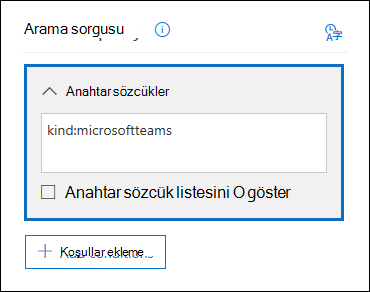
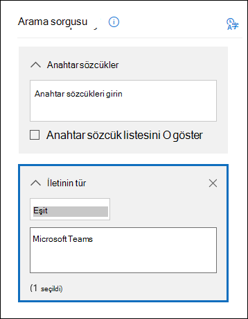

# <a name="feature-reference-for-content-search"></a>İçerik arama için özellik referansı

[!include[Purview banner](../includes/purview-rebrand-banner.md)]

Bu makalede İçerik aramanın özellikleri ve işlevleri açıklanmaktadır.

## <a name="content-search-limits"></a>İçerik arama sınırları

İçerik aramalarına uygulanan sınırların açıklaması için bkz. [İçerik arama sınırları](limits-for-content-search.md).

## <a name="building-a-search-query"></a>Arama sorgusu oluşturma

Arama sorgusu oluşturma, Boole arama işleçlerini ve arama koşullarını kullanma ve hassas bilgi türlerini ve kuruluşunuzun dışındaki kullanıcılarla paylaşılan içeriği arama hakkında ayrıntılı bilgi için bkz [. İçerik Arama için anahtar sözcük sorguları ve arama koşulları](keyword-queries-and-search-conditions.md).

Arama sorgusu oluşturmak için anahtar sözcük listesini kullanırken aşağıdakileri göz önünde bulundurun.

- Her satırdaki **anahtar sözcüklerin (veya anahtar sözcük** tümceciklerinin) **OR** işleci tarafından bağlandığı bir arama sorgusu oluşturmak için Anahtar sözcük listesini göster onay kutusunu seçmeniz ve ardından her anahtar sözcüğü ayrı bir satıra yazmanız gerekir. Anahtar sözcük kutusuna bir anahtar sözcük listesi yapıştırır veya anahtar sözcüğü yazdıktan sonra **Enter** tuşuna basarsanız, **or** işleci tarafından bağlanmaz. Burada, anahtar sözcüklerin listesinin nasıl ekleneceğine yönelik yanlış ve doğru örnekler verilmiştir.

    **Yanlış**

    

    **Doğru**

    

- Ayrıca bir Excel dosyasında veya düz metin dosyasındaki anahtar sözcüklerin veya anahtar sözcük tümceciklerinin listesini hazırlayabilir ve ardından listenizi kopyalayıp anahtar sözcük listesine yapıştırabilirsiniz. Bunu yapmak için **Anahtar sözcük listesini göster** onay kutusunu seçmeniz gerekir. Ardından anahtar sözcük listesindeki ilk satıra tıklayın ve listenizi yapıştırın. Excel veya metin dosyasındaki her satır anahtar sözcük listesinde ayrı bir satıra yapıştırılır.

- Anahtar sözcük listesini kullanarak bir sorgu oluşturduktan sonra, arama sorgusunu istediğiniz gibi yapmak için arama sorgusu söz dizimini doğrulamak iyi bir fikirdir. Ayrıntılar bölmesindeki **Sorgu** altında görüntülenen arama sorgusunda, anahtar sözcükler **(c:s)** metniyle ayrılır. Bu, anahtar sözcüklerin **OR** işlecine benzer bir mantıksal işleç tarafından bağlandığını gösterir. Benzer şekilde, arama sorgunuzda koşullar varsa, anahtar sözcükler ve koşullar **metinle (c:c)** ayrılır. Bu, anahtar sözcüklerin **and** işlecine benzer bir mantıksal işleçle koşullara bağlandığını gösterir. Anahtar sözcük listesi ve koşul kullanılırken sonuçlanan arama sorgusunun (Ayrıntılar bölmesinde görüntülenir) bir örneği aşağıda verilmiştir.

    

- İçerik araması çalıştırdığınızda, Microsoft 365 arama sorgunuzda desteklenmeyen karakterleri ve büyük harfe dönüştürülemeyen Boole işleçlerini otomatik olarak denetler. Desteklenmeyen karakterler genellikle gizlenir ve genellikle bir arama hatasına neden olur veya istenmeyen sonuçlar döndürür. Denetlenen desteklenmeyen karakterler hakkında daha fazla bilgi için bkz. [İçerik Arama sorgunuzda hatalar olup olmadığını denetleme](check-your-content-search-query-for-errors.md).

- İngilizce olmayan karakterler (çince karakterler gibi) için anahtar sözcükler içeren bir arama sorgunuz varsa, İçerik arama'da **Sorgu dili-ülke/bölgeKimlik** ve arama için bir dil-ülke kültür kodu değeri seçin. Varsayılan dil/bölge nötrdür. İçerik araması için dil ayarını değiştirmeniz gerekip gerekmediğini nasıl anlayabilirsiniz? Belirli içerik konumları aradığınız İngilizce olmayan karakterleri içeriyorsa ancak arama sonuç döndürmezse, bunun nedeni dil ayarı olabilir.

## <a name="partially-indexed-items"></a>Kısmen dizine eklenen öğeler

- Posta kutularında kısmen dizine alınan öğeler tahmini arama sonuçlarına eklenir. SharePoint ve OneDrive kısmen dizine alınan öğeler tahmini arama sonuçlarına dahil değildir. Daha fazla bilgi için bkz. [eBulma'da kısmen dizine alınan öğeler](partially-indexed-items-in-content-search.md).

## <a name="searching-onedrive-accounts"></a>OneDrive hesaplarında arama

- Kuruluşunuzdaki OneDrive sitelerinin URL'lerinin listesini toplamak için bkz. Kuruluşunuzdaki [tüm OneDrive konumlarının listesini oluşturma](/onedrive/list-onedrive-urls). Bu makaledeki bu betik, tüm OneDrive sitelerin listesini içeren bir metin dosyası oluşturur. Bu betiği çalıştırmak için SharePoint Online Management Shell'i yüklemeniz ve kullanmanız gerekir. Arama yapmak istediğiniz her OneDrive sitesine kuruluşunuzun Sitem etki alanının URL'sini eklediğinizden emin olun. Bu, tüm OneDrive içeren etki alanıdır; örneğin, `https://contoso-my.sharepoint.com`. Kullanıcının OneDrive sitesinin URL'sine bir örnek aşağıda verilmiştır: `https://contoso-my.sharepoint.com/personal/sarad_contoso_onmicrosoft.com`.

    Bir kişinin kullanıcı asıl adının (UPN) değiştirilmesi durumunda, OneDrive konumunun URL'si yeni UPN'yi içerecek şekilde değiştirilir. Böyle bir durumda, kullanıcının yeni OneDrive URL'sini ekleyerek ve eskisini kaldırarak içerik aramasını değiştirmeniz gerekir. Daha fazla bilgi için bkz[. UPN değişiklikleri OneDrive URL'sini nasıl etkiler](/onedrive/upn-changes)?

## <a name="searching-microsoft-teams-and-microsoft-365-groups"></a>Microsoft Teams ve Microsoft 365 Grupları arama

Bir Microsoft Ekibi veya Microsoft 365 Grubu ile ilişkili posta kutusunda arama yapabilirsiniz. Microsoft Teams Microsoft 365 Grupları üzerine oluşturulduğundan, arama benzerdir. Her iki durumda da yalnızca grup veya ekip posta kutusu aranılır. Grubun veya ekip üyelerinin posta kutuları aranmıyor. Bunları aramak için özel olarak aramaya eklemeniz gerekir.

Microsoft Teams ve Microsoft 365 Grupları içerik ararken aşağıdakileri göz önünde bulundurun.

- Teams ve Microsoft 365 Grupları'da bulunan içeriği aramak için, bir ekip veya grupla ilişkilendirilmiş posta kutusunu ve SharePoint sitesini belirtmeniz gerekir.

- Özel kanallardan gelen içerik, ekip posta kutusunda değil, her kullanıcının posta kutusunda depolanır. Özel kanallarda içerik aramak için bkz. [Özel ve paylaşılan kanalların keşfi](/microsoftteams/ediscovery-investigation#ediscovery-of-private-and-shared-channels).

- Bir ekibin veya Microsoft 365 Grubunun özelliklerini görüntülemek için **get-unifiedgroup** cmdlet'ini Exchange Online çalıştırın. Bu, bir ekip veya grupla ilişkili sitenin URL'sini almak için iyi bir yoldur. Örneğin, aşağıdaki komut Kıdemli Liderlik Ekibi adlı bir Microsoft 365 Grubu için seçili özellikleri görüntüler:

  ```text
  Get-UnifiedGroup "Senior Leadership Team" | FL DisplayName,Alias,PrimarySmtpAddress,SharePointSiteUrl
  DisplayName            : Senior Leadership Team
  Alias                  : seniorleadershipteam
  PrimarySmtpAddress     : seniorleadershipteam@contoso.onmicrosoft.com
  SharePointSiteUrl      : https://contoso.sharepoint.com/sites/seniorleadershipteam
  ```

    > [!NOTE]
    > **Get-UnifiedGroup** cmdlet'ini çalıştırmak için, Exchange Online'da View-Only Alıcılar rolüne veya View-Only Alıcılar rolüne atanmış bir rol grubunun üyesi olmanız gerekir.

- Kullanıcının posta kutusu arandığında, kullanıcının üyesi olduğu hiçbir ekip veya Microsoft 365 Grubu aranamaz. Benzer şekilde, bir ekipte veya Microsoft 365 Grubunda arama yaptığınızda, yalnızca belirttiğiniz grup posta kutusu ve grup sitesi aranılır. Grup üyelerinin posta kutuları ve OneDrive İş hesapları, siz onları aramaya açıkça eklemediğiniz sürece aranamaz.

- Bir ekibin veya Microsoft 365 Grubunun üyelerinin listesini almak için, özellikleri Microsoft 365 yönetim merkezi **Giriş** \> <a href="https://go.microsoft.com/fwlink/p/?linkid=2052855" target="_blank">**Grupları**</a> sayfasında görüntüleyebilirsiniz. Alternatif olarak, Exchange Online PowerShell'de aşağıdaki komutu çalıştırabilirsiniz:

  ```powershell
  Get-UnifiedGroupLinks <group or team name> -LinkType Members | FL DisplayName,PrimarySmtpAddress
  ```

    > [!NOTE]
    > **Get-UnifiedGroupLinks** cmdlet'ini çalıştırmak için, Exchange Online'da View-Only Alıcılar rolüne veya View-Only Alıcılar rolüne atanmış bir rol grubunun üyesi olmanız gerekir.

- Teams kanalının parçası olan konuşmalar, ekiple ilişkili posta kutusunda depolanır. Benzer şekilde, ekip üyelerinin kanalda paylaştığı dosyalar ekibin SharePoint sitesinde depolanır. Bu nedenle, kanaldaki konuşmaları ve dosyaları aramak için ekip posta kutusunu ve SharePoint sitesini içerik konumu olarak eklemeniz gerekir.

- Alternatif olarak, Teams'daki Sohbet listesinin bir parçası olan konuşmalar, sohbete katılan kullanıcıların Exchange Online posta kutusunda depolanır. Ayrıca kullanıcının Sohbet konuşmalarında paylaştığı dosyalar, dosyayı paylaşan kullanıcının OneDrive İş hesabında depolanır. Bu nedenle, Sohbet listesindeki konuşmaları ve dosyaları aramak için tek tek kullanıcı posta kutularını ve OneDrive İş hesaplarını içerik konumları olarak eklemeniz gerekir.

    > [!NOTE]
    > Exchange karma dağıtımda, şirket içi posta kutusu olan kullanıcılar Teams'daki Sohbet listesinin parçası olan konuşmalara katılabilir. Bu durumda, şirket içi posta kutusu olan kullanıcılar için bulut tabanlı depolama alanına ( *şirket içi kullanıcılar için bulut tabanlı posta kutusu* olarak adlandırılır) kaydedildiğinden bu konuşmalardaki içerik de aranabilir. Daha fazla bilgi için bkz[. Şirket içi kullanıcılar için Teams sohbet verilerini arama](search-cloud-based-mailboxes-for-on-premises-users.md).

- Her ekip veya ekip kanalı, not alma ve işbirliği için bir Wiki içerir. Wiki içeriği otomatik olarak .mht biçiminde bir dosyaya kaydedilir. Bu dosya, ekibin SharePoint sitesindeki Teams Wiki Verileri belge kitaplığında depolanır. Ekibin SharePoint sitesini aranacak içerik konumu olarak belirterek Wiki'de arama yapmak için İçerik Arama aracını kullanabilirsiniz.

    > [!NOTE]
    > Wiki'de ekip veya kanal arama özelliği (ekibin SharePoint sitesinde arama yaptığınızda) 22 Haziran 2017'de yayımlandı. Bu tarihte veya sonrasında kaydedilmiş veya güncelleştirilmiş wiki sayfaları aranabilir. Wiki sayfaları son kaydedilen veya bu tarihten önce güncelleştirilen sayfalar arama için kullanılamaz.

- bir Teams kanalındaki toplantılar ve aramalar için özet bilgiler, toplantıyı veya aramayı arayan kullanıcıların posta kutularında da depolanır. Bu, bu özet kayıtlarda arama yapmak için İçerik Arama'yı kullanabileceğiniz anlamına gelir. Özet bilgiler şunları içerir:

  - Toplantının veya aramanın tarihi, başlangıç saati, bitiş saati ve süresi

  - Her katılımcının toplantıya katıldığı veya toplantıdan ayrıldığı tarih ve saat ya da arama

  - Sesli mesaja gönderilen aramalar

  - Cevapsız veya yanıtlanmamış aramalar

  - İki ayrı çağrı olarak gösterilen arama aktarımları

  Toplantı ve arama özeti kayıtlarının aranabilmesi 8 saat kadar sürebilir.

  Arama sonuçlarında, toplantı özetleri **Tür alanında** **Toplantı**, arama özetleri ise **Çağrı** olarak tanımlanır. Ayrıca, bir Teams kanalının parçası olan konuşmalar ve 1xN sohbetler **Tür** alanında **anlık ileti** olarak tanımlanır.

  

   Daha fazla bilgi için bkz. [Microsoft Teams aramalar ve toplantılar için eBulma'yı başlatır](https://techcommunity.microsoft.com/t5/microsoft-teams-blog/microsoft-teams-launches-ediscovery-for-calling-and-meetings/ba-p/210947).

- Teams kanallarında, 1:1 sohbetlerinde ve 1xN sohbetlerinde uygulamalar tarafından oluşturulan kart içeriği posta kutularında depolanır ve aranabilir. *Kart*, kısa içerik parçaları için bir kullanıcı arabirimi kapsayıcısıdır. Kartların birden çok özelliği ve eki olabilir ve kart eylemlerini tetikleyebilecek düğmeler içerebilir. Daha fazla bilgi için bkz. [Kartlar](/microsoftteams/platform/task-modules-and-cards/what-are-cards)

  Diğer Teams içeriğinde olduğu gibi, kart içeriğinin depolandığı yer de kartın kullanıldığı yere bağlıdır. Teams kanalında kullanılan kartların içeriği Teams grup posta kutusunda depolanır. 1:1 ve 1xN sohbetler için kart içeriği, sohbet katılımcılarının posta kutularında depolanır.

  Kart içeriğini aramak için veya `itemclass:IPM.SkypeTeams.Message` arama koşullarını kullanabilirsiniz`kind:microsoftteams`. Arama sonuçlarını gözden geçirirken, Teams bir kanaldaki botlar tarafından oluşturulan kart **içeriğinde Sender/Author** e-posta özelliği olarak `<appname>@teams.microsoft.com`bulunur. Burada`appname`, kart içeriğini oluşturan uygulamanın adıdır. Kart içeriği bir kullanıcı tarafından oluşturulduysa **, Gönderen/Yazar** değeri kullanıcıyı tanımlar.

  İçerik arama sonuçlarında kart içeriğini görüntülerken, içerik iletiye ek olarak görünür. Ek, kart içeriğini oluşturan uygulamanın adı olan adlı `appname.html``appname` bir ektir. Aşağıdaki ekran görüntüleri, kart içeriğinin (Asana adlı bir uygulama için) Teams ve arama sonuçlarında nasıl göründüğünü gösterir.

  **Teams kart içeriği**

  

  **Arama sonuçlarında kart içeriği**

  

  > [!NOTE]
  > Şu anda arama sonuçlarında kart içeriğinden görüntüleri görüntülemek için (önceki ekran görüntüsündeki onay işaretleri gibi) Teams (https://teams.microsoft.com)arama sonuçlarını görüntülemek için kullandığınız tarayıcı oturumunda farklı bir sekmede) oturum açmanız gerekir. Aksi takdirde, görüntü yer tutucuları görüntülenir.

- **Kind** e-posta özelliğini veya **İleti türü** arama koşulunu kullanarak özel olarak Teams içeriği arayabilirsiniz.

  - **Kind** özelliğini anahtar sözcük arama sorgusunun bir parçası olarak kullanmak için, arama sorgusunun **Anahtar Sözcükler** kutusuna yazın`kind:microsoftteams`.

    

  - Arama koşulu kullanmak için **İleti türü** koşulunu ekleyin ve değerini `microsoftteams`kullanın.

    

   Koşullar **, AND** işleci tarafından anahtar sözcük sorgusuna mantıksal olarak bağlanır. Bu, bir öğenin hem anahtar sözcük sorgusuyla hem de arama sonuçlarında döndürülecek arama koşuluyla eşleşmesi gerektiği anlamına gelir. Daha fazla bilgi için [İçerik Arama için anahtar sözcük sorguları ve arama koşulları](keyword-queries-and-search-conditions.md#guidelines-for-using-conditions) bölümündeki "Koşulları kullanma yönergeleri" bölümüne bakın.

## <a name="searching-yammer-groups"></a>Yammer Grupları Arama

Yammer Gruplarındaki konuşma öğelerini özel olarak aramak için **ItemClass** e-posta özelliğini veya **Tür** arama koşulunu kullanabilirsiniz.

  - **ItemClass** özelliğini anahtar sözcük arama sorgusunun bir parçası olarak kullanmak için, arama sorgusunun **Anahtar Sözcükler** kutusuna aşağıdaki özellik:değer çiftlerinden birini (veya tümünü) yazabilirsiniz:

     - ItemClass:IPM.Yammer.message
     - ItemClass:IPM.Yammer.poll
     - ItemClass:IPM.Yammer.praise
     - ItemClass:IPM.Yammer.question

    Örneğin, Yammer iletileri döndürmek ve övme öğeleri Yammer için aşağıdaki arama sorgusunu kullanabilirsiniz:

    

  - Alternatif olarak, **E-posta yazın** koşulunu kullanabilir ve Yammer öğeleri döndürmek için **Yammer iletileri** seçebilirsiniz. Örneğin, aşağıdaki arama sorgusu "gizli" anahtar sözcüğünü içeren tüm Yammer konuşma öğelerini döndürür.

    

## <a name="searching-inactive-mailboxes"></a>Etkin olmayan posta kutularını arama

İçerik aramasında etkin olmayan posta kutularında arama yapabilirsiniz. Kuruluşunuzdaki etkin olmayan posta kutularının listesini almak için powershell Exchange Online komutunu `Get-Mailbox -InactiveMailboxOnly` çalıştırın. Alternatif olarak, Güvenlik & Uyumluluk Merkezi'nde **Bilgi idaresi** \> **Saklama'ya** gidebilir ve ardından **DiğerYükleme** \>**Etkin olmayan posta kutuları**.

Etkin olmayan posta kutularında arama yaparken göz önünde bulundurmak istediğiniz birkaç şey aşağıdadır.

- Mevcut bir içerik araması bir kullanıcı posta kutusu içeriyorsa ve bu posta kutusu devre dışı bırakılırsa, etkin olmayan duruma geldikten sonra aramayı yeniden çalıştırdığınızda içerik araması etkin olmayan posta kutusunda aramaya devam eder.

- Bazen kullanıcının etkin bir posta kutusu ve aynı SMTP adresine sahip etkin olmayan bir posta kutusu olabilir. Bu durumda, yalnızca içerik araması için konum olarak seçtiğiniz belirli posta kutusu aranılır. Başka bir deyişle, bir kullanıcının posta kutusunu aramaya eklerseniz, hem etkin hem de etkin olmayan posta kutularının arandığını varsayamazsınız. Yalnızca aramaya açıkça eklediğiniz posta kutusu aranacak.

- Etkin olmayan bir posta kutusunda arama yapmak üzere içerik araması oluşturmak için Güvenlik & Uyumluluk Merkezi PowerShell'i kullanabilirsiniz. Bunu yapmak için, bir nokta ( ön eklemeniz gerekir. ) yazın. Örneğin, aşağıdaki komut, e-posta adresi pavelb@contoso.onmicrosoft.com etkin olmayan bir posta kutusunda arama sağlayan bir içerik araması oluşturur:

   ```powershell
   New-ComplianceSearch -Name InactiveMailboxSearch -ExchangeLocation .pavelb@contoso.onmicrosoft.com -AllowNotFoundExchangeLocationsEnabled $true
   ```

- Aynı SMTP adresine sahip etkin bir posta kutusuna ve etkin olmayan posta kutusuna sahip olmaktan kaçınmanızı kesinlikle öneririz. Etkin olmayan posta kutusuna atanan SMTP adresini yeniden kullanmanız gerekiyorsa, etkin olmayan posta kutusunu kurtarmanızı veya etkin olmayan posta kutusunun içeriğini etkin bir posta kutusuna (veya etkin posta kutusunun arşivini) geri yüklemenizi ve sonra etkin olmayan posta kutusunu silmenizi öneririz. Daha fazla bilgi için aşağıdaki konulardan birine bakın:

  - [Office 365'da etkin olmayan posta kutusunu kurtarma](recover-an-inactive-mailbox.md)

  - [Office 365'da etkin olmayan posta kutusunu geri yükleme](restore-an-inactive-mailbox.md)

  - [Office 365'da etkin olmayan posta kutusunu silme](delete-an-inactive-mailbox.md)

## <a name="searching-disconnected-or-de-licensed-mailboxes"></a>Bağlantısı kesilmiş veya lisansı kaldırılmış posta kutularını arama

Exchange Online lisansı (veya Microsoft 365 lisansının tamamı) bir kullanıcı hesabından veya Azure Active Directory kaldırılırsa, kullanıcının posta kutusu *bağlantısı kesilmiş* bir posta kutusuna dönüşür. Bu, posta kutusunun artık kullanıcı hesabıyla ilişkili olmadığı anlamına gelir. Bağlantısı kesilmiş posta kutularını ararken şunlar olur:

- Lisans bir posta kutusundan kaldırılırsa, posta kutusu artık aranamaz.

- Mevcut içerik aramasında lisansın kaldırıldığı bir posta kutusu varsa, içerik aramasını yeniden çalıştırırsanız bağlantısı kesilmiş posta kutusundan hiçbir arama sonucu döndürülmeyecektir.

- İçerik araması oluşturmak için **New-ComplianceSearch** cmdlet'ini kullanır ve aranacak Exchange içerik konumu olarak bağlantısı kesilmiş bir posta kutusu belirtirseniz, içerik araması bağlantısı kesilmiş posta kutusundan arama sonucu döndürmez.

Verilerin aranabilir olması için bağlantısı kesilmiş bir posta kutusunda saklamanız gerekiyorsa, lisansı kaldırmadan önce posta kutusuna bir ayrı tutmanız gerekir. Bu, verileri korur ve ayrı tutma kaldırılana kadar bağlantısı kesilmiş posta kutusunun aranabilir olmasını sağlar. Ayrı tutmalar hakkında daha fazla bilgi için bkz. [Exchange Online posta kutusuna yerleştirilen ayrı tutmanın türünü belirleme](identify-a-hold-on-an-exchange-online-mailbox.md).

## <a name="searching-for-content-in-a-sharepoint-multi-geo-environment"></a>SharePoint Multi-Geo ortamında içerik arama

Bir eBulma yöneticisinin çok [coğrafi SharePoint bir ortamda](../enterprise/multi-geo-capabilities-in-onedrive-and-sharepoint-online-in-microsoft-365.md) SharePoint ve OneDrive farklı bölgelerde içerik araması gerekiyorsa, bunun gerçekleşmesi için aşağıdaki şeyleri yapmanız gerekir:

1. eBulma yöneticisinin araması gereken her uydu coğrafi konumu için ayrı bir kullanıcı hesabı oluşturun. Bu coğrafi konumdaki sitelerdeki içeriği aramak için eBulma yöneticisinin bu konum için oluşturduğunuz hesapta oturum açması ve ardından bir içerik araması çalıştırması gerekir.

2. eBulma yöneticisinin araması gereken her uydu coğrafi konumu (ve ilgili kullanıcı hesabı) için bir arama izinleri filtresi oluşturun. Bu arama izinlerinin her biri, eBulma yöneticisi bu konumla ilişkilendirilmiş kullanıcı hesabında oturum açtığında içerik aramasının kapsamını belirli bir coğrafi konumla sınırlar.

> [!TIP]
> [eKeşif'te (Premium)](overview-ediscovery-20.md) arama aracını kullanırken bu stratejiyi kullanmanız gerekmez. Bunun nedeni, Microsoft Purview eKeşif'te (Premium) SharePoint sitelerde ve OneDrive hesaplarında arama yaptığınızda tüm veri merkezlerinin aranıyor olmasıdır. Bölgeye özgü kullanıcı hesapları ve arama izinleri filtrelerinin bu stratejisini yalnızca İçerik Arama aracını kullanırken ve [eBulma servis talepleri](./get-started-core-ediscovery.md) ile ilişkili aramaları çalıştırırken kullanmanız gerekir.

Örneğin, bir eBulma yöneticisinin Kuzey Amerika, Avrupa ve Asya Pasifik'teki uydu konumlarında SharePoint ve OneDrive içeriği araması gerektiğini düşünelim. İlk adım, her konum için bir tane olmak üzere üç kullanıcı hesabı oluşturmaktır. Sonraki adım, her konum *ve* ilgili kullanıcı hesabı için bir tane olmak üzere üç arama izni filtresi oluşturmaktır. Bu senaryo için üç arama izni filtresi örneği aşağıda verilmiştir. Bu örneklerin her birinde **Bölge**, söz konusu coğrafi bölge için SharePoint veri merkezi konumunu, **Users** parametresi ise ilgili kullanıcı hesabını belirtir.

**Kuzey Amerika**

```powershell
New-ComplianceSecurityFilter -FilterName "SPMultiGeo-NAM" -Users ediscovery-nam@contoso.com -Region NAM -Action ALL
```

**Avrupa**

```powershell
New-ComplianceSecurityFilter -FilterName "SPMultiGeo-EUR" -Users ediscovery-eur@contoso.com -Region EUR -Action ALL
```

**Asya Pasifik**

```powershell
New-ComplianceSecurityFilter -FilterName "SPMultiGeo-APC" -Users ediscovery-apc@contoso.com -Region APC -Action ALL
```

Çok coğrafi ortamlarda içerik aramak için arama izinleri filtrelerini kullanırken aşağıdakileri göz önünde bulundurun:

- **Region** parametresi aramaları belirtilen uydu konumuna yönlendirir. Bir eBulma yöneticisi yalnızca arama izinleri filtresinde belirtilen bölgenin dışındaki SharePoint ve OneDrive siteleri ararsa, hiçbir arama sonucu döndürülür.

- **Region** parametresi, Exchange posta kutularının aramalarını denetlemez. Posta kutularında arama yaptığınızda tüm veri merkezleri aranıyor.

Çok coğrafi bir ortamda arama izinleri filtrelerini kullanma hakkında daha fazla bilgi [için, eBulma araştırmaları için uyumluluk sınırlarını ayarlama](set-up-compliance-boundaries.md#searching-and-exporting-content-in-multi-geo-environments) bölümündeki "Multi-Geo ortamlarında içerik arama ve dışarı aktarma" bölümüne bakın.
