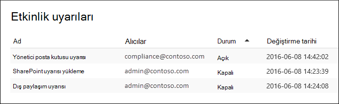

# Etkinlik uyarıları oluşturma

[!include[Purview banner](../includes/purview-rebrand-banner.md)]

Kullanıcılar Office 365'da belirli etkinlikler gerçekleştirdiğinde size e-posta bildirimi gönderecek bir etkinlik uyarısı oluşturabilirsiniz. Etkinlik uyarıları, denetim günlüğündeki olayları aramaya benzer, ancak uyarı oluşturduğunuz bir etkinlik için bir olay gerçekleştiğinde size e-posta iletisi gönderilir.

 **Denetim günlüğünde arama yerine neden etkinlik uyarıları kullanmalısınız?** Gerçekten bilmek istediğiniz belirli kullanıcılar tarafından gerçekleştirilen belirli etkinlik veya etkinlik türleri olabilir. Bu etkinlikler için denetim günlüğünde arama yapmayı unutmamak yerine, etkinlik uyarılarını kullanarak kullanıcılar bu etkinlikleri gerçekleştirirken Microsoft 365 size e-posta iletisi göndermesini sağlayabilirsiniz. Örneğin, bir kullanıcı SharePoint'da dosyaları sildiğinde sizi bilgilendirmek için bir etkinlik uyarısı oluşturabilir veya bir kullanıcı posta kutusundan iletileri kalıcı olarak sildiğinde sizi bilgilendirecek bir uyarı oluşturabilirsiniz. Size gönderilen e-posta bildirimi, hangi etkinliğin gerçekleştirildiği ve bunu gerçekleştiren kullanıcı hakkındaki bilgileri içerir.

> [!NOTE]
> Etkinlik uyarıları kullanım dışı bırakılıyor. Yeni etkinlik uyarıları oluşturmak yerine güvenlik ve uyumluluk merkezinde uyarı ilkelerini kullanmaya başlamanızı öneririz. Uyarı ilkeleri, herhangi bir kullanıcı belirli bir etkinliği gerçekleştirdiğinde uyarıyı tetikleyen bir uyarı ilkesi oluşturma ve güvenlik ve uyumluluk merkezindeki **Uyarıları görüntüle sayfasında uyarıları** görüntüleme gibi ek işlevler sağlar. Daha fazla bilgi için bkz [. Uyarı ilkeleri](alert-policies.md).

## Rolleri onaylama ve denetim günlüğünü yapılandırma

- Etkinlik uyarılarını yönetmek için Microsoft Purview uyumluluk portalında Kuruluş Yapılandırması rolüne atanmış olmanız gerekir. Varsayılan olarak, bu rol Uyumluluk Yöneticisi ve Kuruluş Yönetimi rol gruplarına atanır. Rol gruplarına üye ekleme hakkında daha fazla bilgi için bkz. [Kullanıcılara Microsoft Purview uyumluluk portalına erişim verme](../security/office-365-security/grant-access-to-the-security-and-compliance-center.md).

- Etkinlik uyarılarını kullanmaya başlayabilmeniz için önce sizin (veya başka bir yöneticinin) kuruluşunuz için denetim günlüğünü açmanız gerekir. Bunu yapmak için **Etkinlik uyarıları** sayfasında **Kullanıcı ve yönetici etkinliğini kaydetmeyi başlat'a** tıklamak gerekir. (Bu bağlantıyı görmüyorsanız, kuruluşunuz için denetim zaten açık durumdadır.) Uyumluluk portalındaki **Denetim günlüğü arama** sayfasında denetimi de açabilirsiniz ( **Denetim'e** gidin). Bunu kuruluşunuz için yalnızca bir kez yapmanız gerekir.

- Denetim günlüğünde arayabileceğiniz etkinlikler için uyarılar oluşturabilirsiniz. Uyarı oluşturabileceğiniz yaygın senaryoların (ve izlenecek etkinliğin) listesi için [Daha fazla bilgi](#more-information) bölümüne bakın.

- <a href="https://go.microsoft.com/fwlink/p/?linkid=2077149" target="_blank">Uyumluluk portalındaki</a> **Etkinlik uyarıları** sayfasını kullanarak yalnızca kuruluşunuzun adres defterinde listelenen kullanıcılar tarafından gerçekleştirilen etkinliklere yönelik uyarılar oluşturabilirsiniz. Bu sayfayı, adres defterinde listelenmeyen dış kullanıcılar tarafından gerçekleştirilen etkinliklere yönelik uyarılar oluşturmak için kullanamazsınız.

## Etkinlik uyarısı oluşturma

1. <a href="https://go.microsoft.com/fwlink/p/?linkid=2077149" target="_blank">Uyumluluk portalına</a> gidin.

2. İş veya okul hesabınızı kullanarak oturum açın.

3. **Etkinlik uyarıları** sayfasında Ekle simgesine tıklayın **Yeni, yeni**.

   Etkinlik uyarısı oluşturmak için açılan sayfa görüntülenir.

    

4. Etkinlik uyarısı oluşturmak için aşağıdaki alanları tamamlayın:

    1. **Ad** - Uyarı için bir ad yazın. Uyarı adları kuruluşunuzda benzersiz olmalıdır.

    1. **Açıklama** (İsteğe bağlı) - İzlenen etkinlikler ve kullanıcılar ve e-posta bildirimlerinin gönderildiği kullanıcılar gibi uyarıyı açıklayın. Açıklamalar, uyarının amacını diğer yöneticilere açıklamak için hızlı ve kolay bir yol sağlar.

    1. **Uyarı türü** - **Özel** seçeneğinin belirlendiğinden emin olun.

    1. **Bu uyarıyı şu durumlarda gönder** - **Bu uyarıyı gönder'e** tıklayın ve sonra şu iki alanı yapılandırın:

       - **Etkinlikler** - Uyarı oluşturabileceğiniz etkinlikleri görüntülemek için açılan listeye tıklayın. Bu, denetim günlüğünde arama yaptığınızda görüntülenen etkinlikler listesiyle aynıdır. Belirli bir veya daha fazla etkinliği seçebilir veya gruptaki tüm etkinlikleri seçmek için etkinlik grubu adına tıklayabilirsiniz. Bu etkinliklerin açıklaması için Denetim [günlüğünde arama](search-the-audit-log-in-security-and-compliance.md#audited-activities) yapma bölümündeki "Denetlenen etkinlikler" bölümüne bakın. Kullanıcı uyarıya eklediğiniz etkinliklerden herhangi birini gerçekleştirdiğinde, bir e-posta bildirimi gönderilir.

       - **Kullanıcılar** - Bu kutuya tıklayın ve bir veya daha fazla kullanıcı seçin. Bu kutudaki kullanıcılar **Etkinlikler** kutusuna eklediğiniz etkinlikleri gerçekleştirirse bir uyarı gönderilir. Kuruluşunuzdaki herhangi bir kullanıcı uyarı tarafından belirtilen etkinlikleri gerçekleştirdiğinde uyarı göndermek için **Kullanıcılar** kutusunu boş bırakın.

    1. **Bu uyarıyı gönder** - **Bu uyarıyı gönder'e** tıklayın ve **alıcılar kutusuna** tıklayın ve bir kullanıcı ( **Kullanıcılar** kutusunda belirtilen) bir etkinlik gerçekleştirdiğinde e-posta bildirimi alacak kullanıcıları eklemek için bir ad yazın ( **Etkinlikler** kutusunda belirtilir). Varsayılan olarak alıcı listesine eklendiğini unutmayın. Adınızı bu listeden kaldırabilirsiniz.

5. Uyarıyı oluşturmak için **Kaydet'e** tıklayın.

    Yeni uyarı **, Etkinlik uyarıları** sayfasındaki listede görüntülenir.

    

    Uyarının durumu **Açık** olarak ayarlanır. Uyarı gönderildiğinde e-posta bildirimi alacak alıcıların da listelendiğini unutmayın.

## Etkinlik uyarısını kapatma

E-posta bildiriminin gönderilmemesi için etkinlik uyarısını kapatabilirsiniz. Etkinlik uyarısını kapattıktan sonra, kuruluşunuz için etkinlik uyarıları listesinde görüntülenmeye devam eder ve özelliklerini görüntülemeye devam edebilirsiniz.

1. <a href="https://go.microsoft.com/fwlink/p/?linkid=2077149" target="_blank">Uyumluluk portalına</a> gidin.

2. İş veya okul hesabınızı kullanarak oturum açın.

3. Kuruluşunuzun etkinlik uyarıları listesinde, kapatmak istediğiniz uyarıya tıklayın.

4. **Uyarıyı düzenle** sayfasında, Durumu **Kapalı** olarak değiştirmek için **Açık** iki durumlu düğmesine tıklayın ve ardından **Kaydet'e** tıklayın.

    **Etkinlik uyarıları** sayfalarında uyarının durumu **Kapalı** olarak ayarlanır.

Etkinlik uyarısını yeniden açmak için bu adımları yineleyin ve **Kapalı** iki durumlu düğmesine tıklayarak durumu **Açık** olarak değiştirin.

## Daha fazla bilgi

- Aşağıda, uyumluluk portalındaki Bu uyarıyı gönderilen alanında (ve **Etkinlik uyarıları** sayfasında **Alıcılar** altında listelenmiştir) belirtilen kullanıcılara gönderilen e-posta bildiriminin bir örneği verilmiştir.

    

- Etkinlik uyarıları oluşturabileceğiniz bazı yaygın belge ve e-posta etkinlikleri aşağıdadır. Tablolar etkinliği, uyarı oluşturulacak etkinliğin adını ve **Etkinlikler** açılan listesinde etkinliğin altında listelendiği etkinlik grubunun adını açıklar. Etkinlik uyarıları oluşturabileceğiniz etkinliklerin tam listesini görmek için Denetim [günlüğünde arama'nın](search-the-audit-log-in-security-and-compliance.md#audited-activities) "Denetlenen etkinlikler" bölümüne bakın.

    > [!TIP]
    > Herhangi bir kullanıcı tarafından gerçekleştirilen tek bir etkinlik için etkinlik uyarısı oluşturmak isteyebilirsiniz. Veya bir veya daha fazla kullanıcı tarafından gerçekleştirilen birden çok etkinliği izleyen bir etkinlik uyarısı oluşturmak isteyebilirsiniz.

    Aşağıdaki tabloda, SharePoint veya OneDrive İş belgeyle ilgili bazı yaygın etkinlikler listelenir.

    | Bir kullanıcı bunu yaparsa... | Bu etkinlik için uyarı oluştur | Etkinlik grubu |
    |:-----|:-----|:-----|
    |Sitedeki bir belgeyi görüntüler.  |Erişilen dosya  |Dosya ve klasör etkinlikleri  |
    |Belgeyi düzenler veya değiştirir.  |Değiştirilen dosya  |Dosya ve klasör etkinlikleri  |
    |Belgeyi kuruluşunuzun dışındaki bir kullanıcıyla paylaşır.  |Dosya, klasör veya site paylaşma    Ve    Paylaşım daveti oluşturuldu    Daha fazla bilgi için bkz. [Denetim günlüğünde paylaşım denetimini kullanma](use-sharing-auditing.md).  |Paylaşım ve erişim isteği etkinlikleri  |
    |Belgeyi karşıya yükler veya indirir.  |Karşıya yüklenen dosya    Veya    İndirilen dosya  |Dosya ve klasör etkinlikleri  |
    |Sitenin erişim izinlerini değiştirir.  |Değiştirilen site izinleri  |Site yönetimi etkinlikleri  |

    Aşağıdaki tabloda, Exchange Online'da e-postayla ilgili bazı yaygın etkinlikler listelenir.

    | Bir kullanıcı bunu yaparsa... | Bu etkinlik için uyarı oluştur | Etkinlik grubu |
    |:-----|:-----|:-----|
    |Bir e-posta iletisini posta kutusundan kalıcı olarak siler (temizler).  |İletileri posta kutusundan temizleme  | Posta kutusu etkinliklerini Exchange  |
    |Paylaşılan posta kutusundan e-posta iletisi gönderir.  |Farklı Gönder izinleri kullanılarak gönderilen ileti    Ve    Adına Gönder izinleri kullanılarak gönderilen ileti  | Posta kutusu etkinliklerini Exchange  |

- Etkinlik uyarıları oluşturmak ve düzenlemek için Güvenlik & Uyumluluk Merkezi PowerShell'de **New-ActivityAlert** ve **Set-ActivityAlert** cmdlet'lerini de kullanabilirsiniz. Etkinlik uyarıları oluşturmak veya düzenlemek için bu cmdlet'leri kullanıyorsanız aşağıdaki şeyleri göz önünde bulundurun:

  - **Uyarıya Etkinlikler** açılan listesinde listelenmeyen bir etkinlik eklemek için bir cmdlet kullanırsanız, uyarının özellik sayfasında "Bu uyarının seçicide listelenmeyen özel işlemleri var" şeklinde bir ileti görüntülenir.

  - Etkinlik uyarısı oluşturmak veya düzenlemek için cmdlet'leri kullanmanın iyi bir nedeni, kuruluşunuzun dışındaki birine e-posta bildirimleri göndermektir. Bu dış kullanıcı, uyarının alıcı listesinde listelenir. Ancak bu dış kullanıcıyı uyarıdan kaldırırsanız, uyarıyı düzenle sayfası kullanılarak bu kullanıcı **uyarıya** yeniden eklenemez. **Dış kullanıcıyı Set-ActivityAlert** cmdlet'ini kullanarak yeniden eklemeniz veya yeni bir uyarıya aynı (veya farklı) dış kullanıcıyı eklemek için **New-ActivityAlert** cmdlet'ini kullanmanız gerekir.
