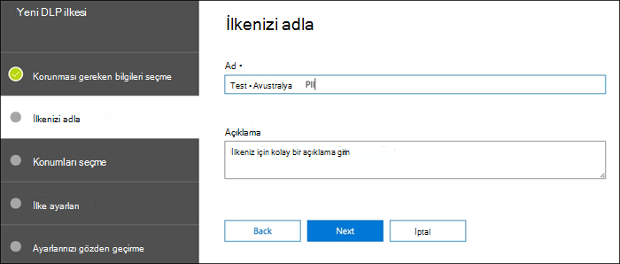
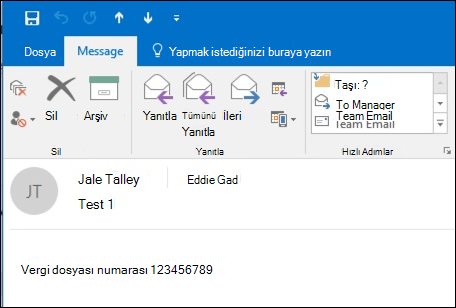
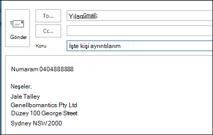

# <a name="create-test-and-tune-a-dlp-policy"></a>Bir DLP ilkesi oluşturma, test etme ve ayarlama

[!include[Purview banner](../includes/purview-rebrand-banner.md)]

Microsoft Purview Veri Kaybı Önleme (DLP), hassas bilgilerin yanlışlıkla veya yanlışlıkla paylaşılmasını önlemenize yardımcı olur.

DLP, kredi kartı numarası gibi hassas bilgiler için e-posta iletilerini ve dosyaları inceler. DLP kullanarak hassas bilgileri algılayabilir ve aşağıdaki gibi eylemler gerçekleştirebilirsiniz:

- Olayı denetim amacıyla günlüğe kaydetme
- E-postayı gönderen veya dosyayı paylaşan son kullanıcıya bir uyarı görüntüleme
- E-posta veya dosya paylaşımının gerçekleştirilmesine etkin bir şekilde engel olun

## <a name="permissions"></a>İzinler

DLP ilkeleri oluşturacak uyumluluk ekibinizin üyelerinin Uyumluluk Merkezi'ne yönelik izinlere sahip olması gerekir. Varsayılan olarak, kiracı yöneticinizin erişimi uyumluluk görevlilerine ve diğer kişilere erişim verebilir. Şu adımları izleyin:
  
1. Microsoft 365'de bir grup oluşturun ve gruba uyumluluk görevlileri ekleyin.
    
2. Güvenlik &amp; Uyumluluk Merkezi'nin **İzinler** sayfasında bir rol grubu oluşturun. 

3. Rol grubunu oluştururken Rol **Seç** bölümünü kullanarak rol grubuna şu rolü ekleyin: **DLP Uyumluluk Yönetimi**.
    
4. Daha önce oluşturduğunuz Microsoft 365 grubunu rol grubuna eklemek için **Üyeleri Seç** bölümünü kullanın.

DLP ilkeleri ve DLP raporları için yalnızca görüntüleme ayrıcalıklarına sahip rol grubu oluşturmak için **Yalnızca Görüntüleme DLP Uyumluluk Yönetimi** rolünü kullanın.

Daha fazla bilgi için bkz. [Kullanıcılara Office 365 Uyumluluk Merkezi'ne erişim verme](../security/office-365-security/grant-access-to-the-security-and-compliance-center.md).
  
Bu izinler, ilkeleri zorlamamak için bir DLP ilkesi oluşturmak ve uygulamak için gereklidir.

### <a name="roles-and-role-groups-in-preview"></a>Önizlemede Roller ve Rol Grupları

Önizlemede, erişim denetimlerinizde ince ayar yapmak için test yapabileceğiniz roller ve rol grupları vardır.

Aşağıda, önizleme aşamasında olan geçerli rollerin listesi yer alır. Bunlar hakkında daha fazla bilgi edinmek için bkz [. Güvenlik & Uyumluluk Merkezi'ndeki Roller](../security/office-365-security/permissions-in-the-security-and-compliance-center.md#roles-in-the-security--compliance-center)

- Information Protection Yöneticisi
- Information Protection Analisti
- Information Protection Araştırmacısı
- Information Protection Okuyucu

Aşağıda, önizleme aşamasında olan geçerli rol gruplarının listesi yer alır. Daha fazla bilgi için bkz [. Güvenlik & Uyumluluk Merkezi'nde rol grupları](../security/office-365-security/permissions-in-the-security-and-compliance-center.md#role-groups-in-the-security--compliance-center)

- Information Protection
- Information Protection Yöneticileri
- Information Protection Analistleri
- Information Protection Araştırmacıları
- Information Protection Okuyucular

## <a name="how-sensitive-information-is-detected-by-dlp"></a>DLP tarafından hassas bilgiler nasıl algılanır?

DLP, belirli anahtar sözcüklerin eşleşen desenlere yakınlığı gibi diğer göstergelerle birlikte normal ifade (RegEx) desen eşleştirmesine göre hassas bilgileri bulur. Örneğin, visa kredi kartı numarası 16 basamaktır. Ancak bu basamaklar 1111-1111-1111-1111, 1111 1111 1111 1111 veya 1111111111111111 gibi farklı şekillerde yazılabilir.

Herhangi bir 16 basamaklı dize mutlaka bir kredi kartı numarası değildir, bir yardım masası sisteminden bir bilet numarası veya bir donanım parçasının seri numarası olabilir. Kredi kartı numarası ile zararsız bir 16 basamaklı dize arasındaki farkı söylemek için, sayıların çeşitli kredi kartı markalarından bilinen bir desenle eşleşip eşleşmediğini onaylamak için bir hesaplama (sağlama toplamı) gerçekleştirilir.

DLP, kredi kartının son kullanma tarihi olabilecek yakın tarih değerleri olan "VISA" veya "AMEX" gibi anahtar sözcükler bulursa, DLP bu verileri dizenin kredi kartı numarası olup olmadığına karar vermesine yardımcı olmak için de kullanır.

Başka bir deyişle DLP, e-postadaki bu iki metin dizesi arasındaki farkı tanıyacak kadar akıllıdır:

- "Bana yeni bir dizüstü bilgisayar sipariş edebilir misin? 1111-1111-1111-1111, son kullanma tarihi 11/22 olan VIZE numaramı kullanın ve sahip olduğunuzda tahmini teslimat tarihini bana gönderin."
- "Dizüstü bilgisayarımın seri numarası 2222-2222-2222-2222 ve 11/2010 tarihinde satın alındı. Bu arada, seyahat vizem onaylandı mı?"

Bkz. Her bilgi türünün nasıl algılandığını açıklayan hassas bilgi türü [varlık tanımları](sensitive-information-type-entity-definitions.md) .

## <a name="where-to-start-with-data-loss-prevention"></a>Veri kaybı önleme ile nereden başlanmalıdır?

Veri sızıntısı riskleri tamamen belirgin olmadığında, DLP'yi uygulamaya tam olarak nereden başlamanız gerektiğini bulmak zordur. Neyse ki DLP ilkeleri "test modunda" çalıştırılabilir ve bunları açmadan önce bunların verimliliğini ve doğruluğunu ölçmenizi sağlar.

Exchange Online için DLP ilkeleri Exchange yönetim merkezi üzerinden yönetilebilir. Ancak Microsoft Purview uyumluluk portalı aracılığıyla tüm iş yükleri için DLP ilkelerini yapılandırabilirsiniz, bu nedenle bu makaledeki tanıtımlar için bunu kullanacağız. Microsoft Purview uyumluluk portalı veri **kaybı önlemeİlke** >  altında DLP ilkelerini bulacaksınız. Başlamak için **İlke oluştur'u** seçin.

Microsoft 365, ilke oluşturmak için kullanabileceğiniz bir dizi [DLP ilke şablonu](what-the-dlp-policy-templates-include.md) sağlar. Diyelim ki avustralyalı bir işsiniz. Avustralya'da şablonları filtreleyebilir ve Finansal, Tıbbi ve Sağlık ile Gizlilik'i seçebilirsiniz.


Bu tanıtım için Avustralya Vergi Dosya Numarası (TFN) ve Sürücü Lisans Numarası bilgi türlerini içeren Avustralya Kişisel Bilgileri (PII) Verileri'ni seçeceğim.


Yeni DLP ilkenize bir ad verin. Varsayılan ad DLP ilke şablonuyla eşleşecektir, ancak aynı şablondan birden çok ilke oluşturulabileceğinden, kendi adınıza daha açıklayıcı bir ad seçmelisiniz.



İlkenin uygulanacağı konumları seçin. DLP ilkeleri Exchange Online, SharePoint Online ve OneDrive İş için geçerli olabilir. Bu ilkeyi tüm konumlara uygulanacak şekilde yapılandırılmış olarak bırakacağım.


İlk **İlke Ayarlar** adımında şimdilik varsayılanları kabul edin. DLP ilkelerini özelleştirebilirsiniz, ancak varsayılanlar başlamak için iyi bir yerdir.


İleri'ye tıkladıktan sonra** size daha fazla özelleştirme seçeneği içeren daha fazla **İlke Ayarlar** sayfası sunulur. Yalnızca test ettiğiniz bir ilke için bazı ayarlamalar yapmaya buradan başlayabilirsiniz.

- İlke ipuçlarını şimdilik kapattım. Bu, yalnızca test ettiğiniz ve kullanıcılara henüz hiçbir şey göstermek istemediğinizde atabileceğiniz makul bir adımdır. İlke ipuçları, kullanıcılara bir DLP ilkesini ihlal etmek üzere olduklarına ilişkin uyarılar görüntüler. Örneğin, Outlook bir kullanıcı eklemiş olduğu dosyanın kredi kartı numaraları içerdiğini ve e-postalarının reddedilmesine neden olacağını belirten bir uyarı görür. İlke ipuçlarının amacı, uyumlu olmayan davranışı gerçekleşmeden önce durdurmaktır.
- Ayrıca örnek sayısını 10'dan 1'e düşürerek bu ilkenin yalnızca verilerin toplu paylaşımını değil Avustralya PII verilerinin paylaşımını algılamasını da sağladım.
- Olay raporu e-postasına başka bir alıcı da ekledim.


Son olarak, bu ilkeyi başlangıçta test modunda çalışacak şekilde yapılandırdım. Burada, test modundayken ilke ipuçlarını devre dışı bırakma seçeneği de olduğuna dikkat edin. Bu, ilkede ilke ipuçlarının etkinleştirilmesi için esneklik sağlar, ancak ardından testiniz sırasında bunları gösterme veya gizleme konusunda karar verir.


İlkeyi oluşturmayı tamamlamak için son gözden geçirme ekranında **Oluştur'a** tıklayın.

## <a name="test-a-dlp-policy"></a>DLP ilkesini test edin

İlkenin normal kullanıcı etkinliği tarafından tetiklenip tetiklenmesini bekleyebilir veya kendiniz tetiklemeyi deneyebilirsiniz. Daha önce DLP eşleşmelerini tetikleme hakkında bilgi sağlayan [Hassas bilgi türü varlık tanımlarına](sensitive-information-type-entity-definitions.md) bağlandım.

Örneğin, bu makale için oluşturduğum DLP ilkesi Avustralya vergi dosya numaralarını (TFN) algılar. Belgelere göre, eşleşme aşağıdaki ölçütlere bağlıdır.


 
TFN algılamasını oldukça künt bir şekilde göstermek için, "Vergi dosya numarası" sözcükleri ve yakın mesafede dokuz basamaklı bir dize içeren bir e-posta sorunsuz bir şekilde ilerler. DLP ilkesini tetiklememe nedeni, dokuz basamaklı dizenin yalnızca zararsız bir sayı dizesi değil, geçerli bir TFN olduğunu belirten sağlama toplamını geçirmesi gerektiğidir.



Buna karşılık, "Vergi dosya numarası" sözcüklerini ve sağlama toplamını geçen geçerli bir TFN'yi içeren bir e-posta ilkeyi tetikler. Buradaki kayıt için, kullandığım TFN geçerli, ancak orijinal olmayan TFN'ler oluşturan bir web sitesinden alındı. Bir DLP ilkesini test ederken en yaygın hatalardan biri geçerli olmayan ve sağlama toplamını geçmeyecek sahte bir numara kullanmak olduğundan (ve bu nedenle ilkeyi tetiklemeyeceğinden) bu tür siteler yararlıdır.


Olay raporu e-postası algılanan hassas bilgilerin türünü, kaç örneğin algılandığını ve algılamanın güvenilirlik düzeyini içerir.


DLP ilkenizi test modunda bırakır ve olay raporu e-postalarını analiz ederseniz, DLP ilkesinin doğruluğu ve uygulandığında ne kadar etkili olacağı konusunda bir his edinmeye başlayabilirsiniz. Olay raporlarına ek olarak, kiracınız genelinde ilke eşleşmelerinin toplu bir görünümünü görmek için [DLP raporlarını kullanabilirsiniz](view-the-dlp-reports.md) .

## <a name="tune-a-dlp-policy"></a>DLP ilkesini ayarlama

İlke isabetlerinizi analiz ettikçe, ilkelerin davranışında bazı ayarlamalar yapmak isteyebilirsiniz. Basit bir örnek olarak, bir e-postadaki bir TFN'nin sorun olmadığını belirleyebilirsiniz (yine de sorun olduğunu düşünüyorum, ancak tanıtım amacıyla bunu kullanalım), ancak iki veya daha fazla örnek bir sorundur. Birden çok örnek, bir çalışanın İk veritabanından dış tarafa (örneğin dış muhasebe hizmeti) CSV dışarı aktarmasını e-postayla göndermesi gibi riskli bir senaryo olabilir. Kesinlikle algılamayı ve engellemeyi tercih edeceğiniz bir şey.

Davranışı ayarlamak için Uyumluluk Merkezi'nde mevcut bir ilkeyi düzenleyebilirsiniz.


 
Konum ayarlarını, ilkenin yalnızca belirli iş yüklerine veya belirli sitelere ve hesaplara uygulanması için ayarlayabilirsiniz.


Ayrıca ilke ayarlarını yapabilir ve kuralları gereksinimlerinize daha uygun olacak şekilde düzenleyebilirsiniz.


DLP ilkesi içindeki bir kuralı düzenlerken şunları değiştirebilirsiniz:

- Kuralı tetikleyecek hassas veri örneklerinin türü ve sayısı da dahil olmak üzere koşullar.
- İçeriğe erişimi kısıtlama gibi gerçekleştirilen eylemler.
- Kullanıcıya e-posta istemcisinde veya web tarayıcısında görüntülenen ilke ipuçları olan kullanıcı bildirimleri.
- Kullanıcı geçersiz kılmaları, kullanıcıların yine de e-posta veya dosya paylaşımına devam etmeyi seçip seçemeyeceğini belirler.
- Yöneticilere bildirmek için olay raporları.


Bu tanıtım için ilkeye kullanıcı bildirimleri ekledim (bunu yeterli kullanıcı farkındalığı eğitimi olmadan yapmaya dikkat edin) ve kullanıcıların ilkeyi bir iş gerekçesiyle veya yanlış pozitif olarak işaretleyerek geçersiz kılmalarına izin verdim. Ayrıca, kuruluşunuzun ilkeleri hakkında ek bilgiler eklemek istiyorsanız e-posta ve ilke ipucu metnini özelleştirebilir veya kullanıcılardan soruları varsa desteğe başvurmalarını isteyebilirsiniz.


İlke, yüksek hacimli ve düşük hacimli işlemleri işlemek için iki kural içerir, bu nedenle her ikisini de istediğiniz eylemlerle düzenlemeyi unutmayın. Bu, vakaları özelliklerine bağlı olarak farklı bir şekilde tedavi etmek için bir fırsattır. Örneğin, düşük birim ihlalleri için geçersiz kılmalara izin verebilir, ancak yüksek birim ihlalleri için geçersiz kılmalara izin vermeyebilirsiniz.


Ayrıca, ilkeyi ihlal eden içeriğe erişimi gerçekten engellemek veya kısıtlamak istiyorsanız, bunu yapmak için kural üzerinde bir eylem yapılandırmanız gerekir.


İlke ayarlarına bu değişiklikleri kaydettikten sonra, ilkenin ana ayarlar sayfasına geri dönüp ilke test modundayken kullanıcılara ilke ipuçlarını gösterme seçeneğini etkinleştirmem gerekiyor. Bu, son kullanıcılarınıza DLP ilkeleri sunmanın ve üretkenliğini etkileyen çok fazla hatalı pozitif riski olmadan kullanıcı farkındalığı eğitimi gerçekleştirmenin etkili bir yoludur.


Sunucu tarafında (veya isterseniz bulut tarafında), çeşitli işlem aralıkları nedeniyle değişiklik hemen geçerli olmayabilir. Kullanıcıya yeni ilke ipuçlarını gösterecek bir DLP ilkesi değişikliği yapıyorsanız, kullanıcı Outlook istemcisinde değişikliklerin hemen geçerli olduğunu göremeyebilir ve bu da ilke değişikliklerini 24 saatte bir denetler. Test için işleri hızlandırmak istiyorsanız, [policyNudges anahtarından son indirme zaman damgasını temizlemek](https://support.microsoft.com/en-au/help/2823261/changes-to-a-data-loss-prevention-policy-don-t-take-effect-in-outlook?__hstc=18650278.46377037dc0a82baa8a30f0ef07a7b2f.1538687978676.1538693509953.1540315763430.3&__hssc=18650278.1.1540315763430&__hsfp=3446956451) için bu kayıt defteri düzeltmesini kullanabilirsiniz. Outlook, en son ilke bilgilerini bir sonraki yeniden başlatışınızda indirir ve e-posta iletisi oluşturma işlemine başlarsınız.

İlke ipuçlarını etkinleştirdiyseniz, kullanıcı ipuçlarını Outlook görmeye başlar ve ortaya çıktığında size hatalı pozitif sonuçları bildirebilir.


## <a name="investigate-false-positives"></a>Hatalı pozitif sonuçları araştırma

DLP ilke şablonları hemen kullanıma hazır değildir. Büyük olasılıkla ortamınızda bazı hatalı pozitif sonuçların oluştuğunu fark edersiniz. Bu nedenle, ilkelerinizi yeterince test etmek ve ayarlamak için zaman ayırarak DLP dağıtımına geçişinizi kolaylaştırmak çok önemlidir.

Burada hatalı pozitif bir örnek verilmiştir. Bu e-posta zararsızdır. Kullanıcı, cep telefonu numarasını bir kişiye sağlıyor ve e-posta imzasını dahil ediyor.


 
Ancak kullanıcı, e-postanın hassas bilgiler (özellikle avustralyalı bir sürücü lisans numarası) içerdiği konusunda uyarı veren bir ilke ipucu görür.


Kullanıcı hatalı pozitif durumu bildirebilir ve yönetici bunun neden oluştuğuna bakabilir. Olay raporu e-postasında, e-posta hatalı pozitif olarak işaretlenir.


Bu sürücü belgesi olayı, ayrıntılı bir şekilde incelenmek için iyi bir örnektir. Bu hatalı pozitif sonucun ortaya çıkma nedeni, "Avustralya Sürücü Lisansı" türünün "Sydney nsw" anahtar sözcüklerine (büyük/küçük harfe duyarlı değil) 300 karakterlik bir yakınlık içinde herhangi bir 9 basamaklı dize (10 basamaklı dizenin parçası olan bir dizenin parçası bile) tarafından tetiklenecek olmasıdır. Bu nedenle, telefon numarası ve e-posta imzası tarafından tetiklenen, çünkü kullanıcı Sidney'dedir.


Bir seçenek, avustralyalı sürücü lisans bilgi türünü ilkeden kaldırmaktır. DLP ilke şablonunun bir parçası olduğu için buradadır, ancak bunu kullanmak zorunda değiliz. Sürücü lisanslarıyla değil de yalnızca Vergi Dosya Numaralarıyla ilgileniyorsanız, yalnızca kaldırabilirsiniz. Örneğin, ilkedeki düşük birim kuralından kaldırabilirsiniz, ancak birden çok sürücü lisansı listesinin hala algılandığından yüksek hacimli kuralda bırakabilirsiniz.
 
Başka bir seçenek de örnek sayısını artırmaktır; böylece düşük hacimli sürücü lisansları yalnızca birden çok örnek olduğunda algılanır.


Örnek sayısını değiştirmeye ek olarak, eşleşme doğruluğunu (veya güvenilirlik düzeyini) de ayarlayabilirsiniz. Hassas bilgi türünüzün birden çok deseni varsa kuralınızdaki eşleşme doğruluğunu ayarlayarak kuralınızın yalnızca belirli desenlerle eşleşmesini sağlayabilirsiniz. Örneğin, hatalı pozitif sonuçları azaltmaya yardımcı olmak için kuralınızın eşleşme doğruluğunu yalnızca en yüksek güvenilirlik düzeyine sahip desenle eşleşecek şekilde ayarlayabilirsiniz. Güvenilirlik düzeyleri hakkında daha fazla bilgi için bkz. [Kurallarınızı ayarlamak için güvenilirlik düzeyini kullanma](data-loss-prevention-policies.md#match-accuracy).

Son olarak, biraz daha gelişmiş hale getirmek istiyorsanız, herhangi bir hassas bilgi türünü özelleştirebilirsiniz; örneğin, yukarıda tetiklenen hatalı pozitif sonucu ortadan kaldırmak için [Avustralya sürücü numarasının](sensitive-information-type-entity-definitions.md#australia-drivers-license-number) anahtar sözcükleri listesinden "Sidney NSW" öğesini kaldırabilirsiniz. XML ve PowerShell kullanarak bunun nasıl yapılacağını öğrenmek için bkz. [Yerleşik hassas bilgi türünü özelleştirme](customize-a-built-in-sensitive-information-type.md).

## <a name="turn-on-a-dlp-policy"></a>DLP ilkesini açma

DLP ilkenizin hassas bilgi türlerini doğru ve etkili bir şekilde algıladığından ve son kullanıcılarınızın ilkelerle ilgilenmeye hazır olduğundan memnun olduğunuzda, ilkeyi etkinleştirebilirsiniz.


 
İlkenin ne zaman geçerli olacağını görmek için bekliyorsanız[, Security & Uyumluluk Merkezi PowerShell'e Bağlan](/powershell/exchange/connect-to-scc-powershell) ve DistributionStatus'u görmek için [Get-DlpCompliancePolicy cmdlet'ini](/powershell/module/exchange/get-dlpcompliancepolicy) çalıştırın.

 ```powershell
 Get-DlpCompliancePolicy "Testing -Australia PII" -DistributionDetail | Select distributionstatus
 ```
DLP ilkesini açtıktan sonra, beklenen ilke eylemlerinin gerçekleştiğinden emin olmak için kendi son testlerinizi çalıştırmanız gerekir. Kredi kartı verileri gibi şeyleri test etmeye çalışıyorsanız, sağlama toplamlarını geçirecek ve ilkelerinizi tetikleyecek örnek kredi kartı veya diğer kişisel bilgilerin nasıl oluşturulacağıyla ilgili bilgilerin bulunduğu çevrimiçi web siteleri vardır.

Kullanıcı geçersiz kılmalarına izin veren ilkeler, ilke ipucunun bir parçası olarak bu seçeneği kullanıcıya sunar.


İçeriği kısıtlayan ilkeler, ilke ipucunun bir parçası olarak kullanıcıya uyarı sunar ve e-posta göndermesini engeller.


## <a name="summary"></a>Özet

Veri kaybı önleme ilkeleri, her türdeki kuruluşlar için yararlıdır. bazı DLP ilkelerini test etmek, ilke ipuçları, son kullanıcı geçersiz kılmaları ve olay raporları gibi şeyler üzerinde sahip olduğunuz denetim nedeniyle düşük riskli bir alıştırmadır. Kuruluşunuzda zaten ne tür ihlaller oluştuğunu görmek için bazı DLP ilkelerini sessizce test edebilir ve ardından düşük hatalı pozitif oranlarla ilkeler oluşturabilir, kullanıcılarınıza izin verilen ve izin verilmeyenler konusunda eğitebilir ve ardından DLP ilkelerinizi kuruluşa dağıtabilirsiniz.
