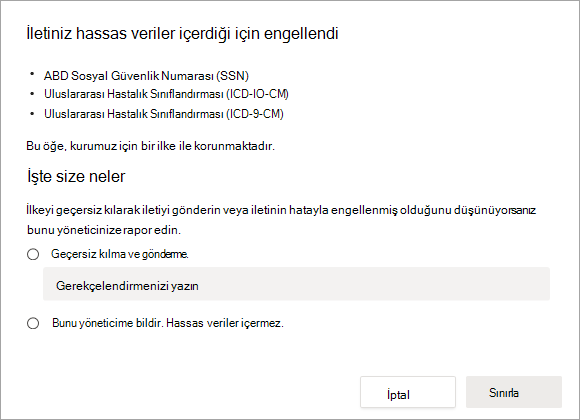
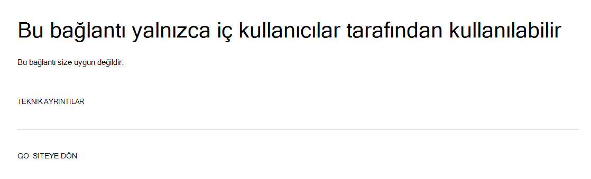

# Veri kaybı önleme ve Microsoft Teams

Kuruluşta veri kaybı önleme (DLP) varsa, bir kanalda veya sohbet oturumunda kişilerin hassas bilgileri paylaşmasını Microsoft Teams ilkeler tanımlayabilirsiniz. Aşağıda bu korumanın nasıl çalıştığının örneklerini verilmiştir:

- **Örnek 1: İletilerde hassas bilgileri koruma**. Bir kişinin bir sohbet veya kanalda hassas bilgileri konuklarla (dış Teams) paylaşmaya denemesi varsayalım. Bunu önlemek için tanımlanmış bir DLP ilkeye sahipseniz, dış kullanıcılara gönderilen hassas bilgilerle gönderilen iletiler silinir. Bu, DLP ilkenizin nasıl yapılandırıldıya göre otomatik olarak ve saniyeler içinde gerçekleşir.

    > [!NOTE]
    > DLP for Microsoft Teams blocks sensitive content when shared with Microsoft Teams users who have: - [ekiplerde ve](/MicrosoftTeams/guest-access) kanallarda konuk erişimi; veya - [dış erişim sağlar](/MicrosoftTeams/manage-external-access) . 
Dış sohbet oturumları için DLP, yalnızca gönderen ve alıcı yalnızca modda ve yerel Teams kullanıyorsa [Microsoft Teams çalışır](/microsoftteams/manage-external-access). DLP for Teams birlikte çalışma (yerel olmayan) federal sohbet  oturumları Skype Kurumsal birlikte çalışma ile ilgili iletileri engellemez.

- **Örnek 2: Belgelerde hassas bilgileri koruma**. Bir kişinin bir kanalda veya sohbette konuklarla belge Microsoft Teams ve belgede hassas bilgiler olduğunu varsayalım. Bunu engellemek için tanımlanmış bir DLP ilkeniz varsa, bu kullanıcılara belge açılmaz. DLP ilkeniz, koruma SharePoint için OneDrive güvenlik güvenliklerini ve güvenlik güvenliklerini içermesi gerekir. Bu, Microsoft Teams SharePoint'da gösterip bu SharePoint için DLP'ye örnek olarak ve bu nedenle kullanıcıların Office 365 DLP (Office 365 E3'ye dahil) lisansına sahip olduğunu, ancak kullanıcıların lisans sahibi Office 365 Gelişmiş Uyumluluk .)

## DLP Lisanslama Microsoft Teams

[Veri kaybı önleme](dlp-learn-about-dlp.md) özellikleri, aşağıdakiler için özel Microsoft Teams mesajları da dahil olmak üzere sohbet ve **kanal iletilerini içerecek şekilde genişletildi**:

- Office 365 E5/A5/G5
- Microsoft 365 E5/A5/G5
- Microsoft 365 E5/A5/G5 Bilgi Koruma ve Yönetim
- Microsoft 365 E5/A5/G5/F5 Uyumluluğu ve F5 Güvenlik & Uyumluluğu

Office 365 ve Microsoft 365 E3, SharePoint Online, OneDrive ve diğer Exchange Online. Bu ayrıca, Teams Online ve OneDrive'i kullandığı için SharePoint Teams aracılığıyla paylaşılan dosyaları da içerir.

Sohbet için DLP koruması için Teams E5 gerektirir.

Lisans gereksinimleri hakkında daha fazla bilgi edinmek için [Lisanslama Microsoft 365 Tenant-Level'ne bakın](/office365/servicedescriptions/microsoft-365-service-descriptions/microsoft-365-tenantlevel-services-licensing-guidance/microsoft-365-security-compliance-licensing-guidance).

> [!IMPORTANT]
> DLP yalnızca sohbet veya kanal dizisinde yer alan gerçek iletiler için geçerlidir. Kısa bir ileti önizlemesi içeren ve kullanıcının bildirim ayarlarına bağlı olarak görünen etkinlik bildirimleri, DLP'ye Teams. DLP ilkesi uygulandıktan ve hassas bilgiler kaldırıldıktan sonra bile, iletinin önizlemede görünen bölümünde yer alan tüm hassas bilgiler bildirimde görünür durumda kalır.

## DLP koruma kapsamı

DLP koruması bu varlıklara farklı Teams uygulanır.

|İlke kapsamı |Bu Teams Varlıklar |DLP koruması kullanılabilir olacak mı|
|---------|---------|---------|
|Tek tek kullanıcı hesapları     |1:1/n sohbetler         |Evet         |
|     |Genel sohbetler         |Hayır         |
|     |özel kanallar         |Evet         |
|Güvenlik grupları/dağıtım listeleri  | 1:1/n sohbetler         |Evet         |
|     |Genel sohbetler         |Hayır         |
|     |özel kanallar         |Evet        |
|Microsoft 365 grubu    |1:1/n sohbetler          |Hayır         |
|     |Genel sohbetler          |Evet        |
|     |özel kanallar|Hayır| 

## İlke ipuçları kullanıcıları eğit etmeye yardımcı olur

DLP'nin [Exchange, Outlook, Web üzerinde Outlook, SharePoint](data-loss-prevention-policies.md#policy-evaluation-in-exchange-online-outlook-and-outlook-on-the-web) [Online, OneDrive İş](data-loss-prevention-policies.md#policy-evaluation-in-onedrive-for-business-and-sharepoint-online-sites) sitelerinde ve [Office](data-loss-prevention-policies.md#policy-evaluation-in-the-office-desktop-programs) masaüstü istemcisinde olduğu gibi, bir eylem DLP ilkesi tetiklendiğinde ilke ipuçları görüntülenir. İşte ilke ipucu örneği:

Burada, gönderen bir sosyal güvenlik numarasını bir çalışma kanalında paylaşmayı Microsoft Teams etti. Ne **yapabilirim? bağlantısı** , gönderenin sorunu çözmesi için seçenekler sağlayan bir iletişim kutusu açar. Gönderenin ilkeyi geçersiz kılmayı kabul etmiş veya yöneticiye ilkeyi gözden geçirmesi ve çözmesi için bildirim göndererek bunu bildir bildirimler.

Kuruluşta, kullanıcıların bir DLP İlkesini geçersiz k olmasına izin vermeyi seçebilirsiniz. DLP ilkelerinizi yapılandırarak, varsayılan ilke ipuçlarını kullanabilir veya ilke ipuçlarını [özelleştirebilirsiniz](#to-customize-policy-tips) .

Bir gönderenin sosyal güvenlik numarasını bir kanalda paylaştığı örneğimize geri Teams, alıcının gördüğü şu olur:

> [!div class="mx-imgBorder"]
> 

### İlke ipuçlarını özelleştirmek için

Bu görevi gerçekleştirmek için, size DLP ilkelerini düzenleme izinleri olan bir rol atanmalıdır. Daha fazla bilgi edinmek için bkz. [İzinler](data-loss-prevention-policies.md#permissions).

1. Uyumluluk Merkezi'ne ([https://compliance.microsoft.com](https://compliance.microsoft.com)) gidin ve oturum açma.

2. Veri **kaybı önlemePolicy'yi** >  **seçin**.

3. Bir ilke seçin ve İlke **ayarları'nın yanında Düzenle'yi** **seçin**.

4. Yeni bir kural oluşturun veya ilke için var olan bir kuralı düzenleyin.

    > [!div class="mx-imgBorder"]
    > 

5. Kullanıcı bildirimleri **sekmesinde, E-posta** **metnini özelleştirin ve/veya** İlke **ipucu metnini özelleştirin seçeneklerini** belirleyin.

    > [!div class="mx-imgBorder"]
    >    

6. E-posta bildirimleri ve/veya ilke ipuçları için kullanmak istediğiniz metni belirtin ve ardından Kaydet'i **seçin**.

7. İlke **ayarları sekmesinde** Kaydet'i **seçin**.

Değişikliklerinizin, veri merkeziniz boyunca çalışmalarını ve kullanıcı hesaplarıyla eşitlemelerini yaklaşık bir saat kadar süreyle yapın.
 <!-- why are these syncing to user accounts? -->

## Varolan Microsoft Teams DLP ilkelerine konum olarak ekleme

Bu görevi gerçekleştirmek için, size DLP ilkelerini düzenleme izinleri olan bir rol atanmalıdır. Daha fazla bilgi edinmek için bkz. [İzinler](data-loss-prevention-policies.md#permissions).

1. Uyumluluk Merkezi'ne ([https://compliance.microsoft.com](https://compliance.microsoft.com)) gidin ve oturum açma.

2. Veri **kaybı önlemePolicy'yi** >  **seçin**.

3. Bir ilke seçin ve Konumlar'ın altındaki **değerlere bakın**. Yeni sohbet **Teams kanal iletileri görüyorsanız** artık hazırsınız. Bunu yoksa, Düzenle'yi **tıklatın**.

    > [!div class="mx-imgBorder"]
    > 

4. Durum **sütununda**, sohbet ve kanal **iletilerinin Teams için ilkeyi açabilirsiniz**.

    > [!div class="mx-imgBorder"]
    > 

5. Konumları **seçin sekmesinde tüm** hesapların varsayılan ayarını kullanın veya Belirli konumları **seçmeme izin ver'i seçin**. Şunları belirtsiniz:

    1. Dahil etmek veya dışarıda tutmak için en çok 1000 ayrı hesap
    1. Dahil veya hariç tutulacak dağıtım listeleri ve güvenlik grupları. 
    <!-- 1. the shared mailbox of a shared channel. **This is a public preview feature.**--> 
    
6. Sonra, **Sonraki'yi seçin**.

7. **Kaydet**'e tıklayın.

Değişikliklerinizin, veri merkeziniz boyunca çalışmalarını ve kullanıcı hesaplarıyla eşitlemelerini yaklaşık bir saat kadar süreyle yapın.
<!-- again, why user accounts? -->

## Yeni bir DLP ilkesi tanımlama Microsoft Teams

Bu görevi gerçekleştirmek için, size DLP ilkelerini düzenleme izinleri olan bir rol atanmalıdır. Daha fazla bilgi edinmek için bkz. [İzinler](data-loss-prevention-policies.md#permissions).

1. Uyumluluk Merkezi'ne ([https://compliance.microsoft.com](https://compliance.microsoft.com)) gidin ve oturum açma.

2. Veri **kaybı önlemePolicy** > + **İlke** >  **oluştur'ı seçin**.

3. Bir şablon [seçin ve](data-loss-prevention-policies.md#dlp-policy-templates) sonra da Sonraki'yi **seçin**.

    Örneğimizde, biz ABD'yi Kişisel Olarak Tanımlayıcı Bilgi Verileri şablonunu seçtik.

    > [!div class="mx-imgBorder"]
    >  

4. **İlkenizi adla** sekmesinde, ilke için bir ad ve açıklama belirtin ve sonra da Sonraki'yi **seçin**.

5. Konumları **seçin sekmesinde tüm** hesapların varsayılan ayarını kullanın veya Belirli konumları **seçmeme izin ver'i seçin**. Şunları belirtsiniz:

    1. Dahil etmek veya dışarıda tutmak için en çok 1000 ayrı hesap
    1. Dahil veya hariç tutulacak dağıtım listeleri ve güvenlik grupları. **Bu genel önizleme özelliğidir.**
    <!-- 1. the shared mailbox of a shared channel. **This is a public preview feature.**-->  

    

    > [!NOTE]
    > Hassas bilgiler içeren belgelerin Teams'ta uygunsuz şekilde paylaşılmay olduğundan emin olmak için sohbet ve kanal iletileriyle birlikte **SharePoint** siteleri ve **OneDrive** hesaplarının **da Teams emin olun**.

6. İlke **ayarları sekmesindeki** Korumak istediğiniz içerik türünü özelleştirin'in **altında, varsayılan** basit ayarları koruyun veya Gelişmiş **ayarları kullan'ı** ve sonra da İleri'yi **seçin**. Gelişmiş ayarları seçerseniz, ilkeniz için kurallar oluşturabilir veya düzenleyebilirsiniz. Bu konuda yardım almak için bkz. [Basit ayarlar - gelişmiş ayarlar](data-loss-prevention-policies.md#simple-settings-vs-advanced-settings).

7.  İlke **ayarları sekmesindeki** Hassas **bilgileri algılar miyiz? altında**, ayarları gözden geçirebilirsiniz. Burada, varsayılan ilke ipuçlarını ve e-posta [bildirimlerini saklayabilirsiniz veya](use-notifications-and-policy-tips.md) bunları özelleştirebilirsiniz.

    > [!div class="mx-imgBorder"]
    > 

    Ayarları gözden geçirmeyi veya düzenlemeyi bitirdikten sonra, Sonraki'yi **seçin**.

8. İlke **ayarları** sekmesinde, İlkeyi açmak mı yoksa öncelikle test etmek mi istediğiniz **?** altında, İlkeyi açma, [önce sınama](dlp-overview-plan-for-dlp.md#policy-deployment) veya şimdilik kapalı tutma arasında seçim yapın ve sonra Sonraki'yi **seçin**.

    > [!div class="mx-imgBorder"]
    > 

9. Ayarlarınızı **gözden geçirme sekmesinde** , yeni ilkenizin ayarlarını gözden geçirin. Değişiklik **yapmak için** Düzenle'yi seçin. Bitirdikten sonra Oluştur'a **seçin**.

Yeni ilkenizin, veri merkeziniz üzerinden ilerler ve kullanıcı hesaplarıyla eşitlenin yaklaşık bir saat kadar süreyle çalışmasına izin verme.

## Hassas belgelere dış erişimi engelleme

Hassas bilgiler SharePoint belgelere dış konuklar tarafından varsayılan olarak dış konuklar tarafından SharePoint veya Teams emin olmak için, aşağıdakini seçin:

- Yeni dosyaları varsayılan olarak hassas olarak işaretleyerek DLP tarayana ve paylaşmada güvenli olarak işaretleyerek belgelerin [korunmasını sebilirsiniz](/sharepoint/sensitive-by-default).

- Önerilen DLP ilkesi yapısı

    - **Koşullar**
        - İçerik, şu hassas bilgi türlerinden herhangi birini içerir: [Uygun olan tüm bilgileri seçin]
        
        - Kuruluşum dışındaki Microsoft 365 kuruluştan içerik paylaşılıyor
        
          > [!div class="mx-imgBorder"]
          > 

    - **Eylemler**
        - Dış kullanıcıların içeriğine erişimi kısıtlama
        
        - Kullanıcıları e-posta ve ilke ipuçlarıyla bilgilendirin
        
        - Yöneticiye olay raporları gönderme
        
        > [!div class="mx-imgBorder"]
        > 

DLP ilkesi, bir dış konukla hassas bilgiler içeren bir SharePoint paylaşmak için çalışırken DLP ilkesi:

> [!div class="mx-imgBorder"]
> 

Konuk dış engellemeyi de olan bir belgeyi aynı dosyada açmaya Teams DLP ilkesi çalışır:

> [!div class="mx-imgBorder"]
> 

## İlgili makaleler

- [DLP ilkesi oluşturma, sınama ve ayarlama](create-test-tune-dlp-policy.md)
- [DLP ilkeleri için e-posta bildirimleri gönderme ve ilke ipuçlarını gösterme](use-notifications-and-policy-tips.md)
