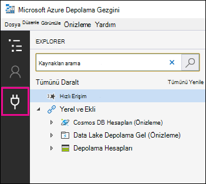

# Gözden geçirme kümesindeki belgeleri Azure Depolama hesabına aktarma

eBulma (Premium) durumundaki bir gözden geçirme kümesinden belgeleri dışarı aktardığınızda, bunları kuruluşunuz tarafından yönetilen bir Azure Depolama hesabına dışarı aktarma seçeneğiniz vardır. Bu seçeneği kullanırsanız belgeler Azure Depolama konumunuza yüklenir. Dışarı aktarıldıktan sonra, Azure Depolama Gezgini kullanarak belgelere erişebilir (ve bunları yerel bir bilgisayara veya başka bir konuma indirebilirsiniz). Bu makalede, belgeleri Azure Depolama hesabınıza dışarı aktarma ve dışarı aktarılan belgeleri indirmek üzere azure Depolama konumuna bağlanmak için Azure Depolama Gezgini kullanma yönergeleri sağlanır. Azure Depolama Gezgini hakkında daha fazla bilgi için bkz. [Azure Depolama Gezgini kullanma](/azure/storage/blobs/storage-quickstart-blobs-storage-explorer).

## Gözden geçirme kümesinden belgeleri dışarı aktarmadan önce

- Belgeleri gözden geçirme kümesinden dışarı aktarmak için Azure Depolama hesabınız için paylaşılan erişim imzası (SAS) belirteci ve depolama hesabındaki belirli bir kapsayıcının URL'sini sağlamanız gerekir. 2. Adım'ı gerçekleştirirken bunların elinizin altında olduğundan emin olun (örneğin, bir metin dosyasına kopyalanır)

  - **SAS belirteci**: SAS belirtecini azure Depolama hesabınız için aldığınızdan emin olun (kapsayıcı için değil). Azure Depolama hesabınız için bir SAS belirteci oluşturabilirsiniz. Bunu yapmak için Azure Depolama hesabına gidin ve depolama hesabı dikey penceresindeki **Ayarlar** ayarları altında **Erişim imzasını paylaş'ı** seçin. Varsayılan ayarları kullanın ve SAS belirtecini oluştururken tüm kaynak türlerine izin verin.

  - **Kapsayıcı URL'si**: Gözden geçirme kümesi belgelerini karşıya yüklemek için bir kapsayıcı oluşturmanız ve ardından kapsayıcının URL'sinin bir kopyasını almanız gerekir; örneğin, `https://ediscoverydata.blob.core.windows.net/exportdata`. URL'yi almak için Azure Depolama'deki kapsayıcıya gidin ve kapsayıcı dikey penceresinin **Ayarlar** bölümünde **Özellikler'i** seçin.

- Azure Depolama Gezgini indirip yükleyin. Yönergeler için bkz. [Azure Depolama Gezgini aracı](https://go.microsoft.com/fwlink/p/?LinkId=544842). Azure Depolama hesabınızdaki kapsayıcıya bağlanmak ve 1. Adımda dışarı aktardığınız belgeleri indirmek için bu aracı kullanırsınız.

## 1. Adım: Belgeleri gözden geçirme kümesinden dışarı aktarma

İlk adım, belgeleri gözden geçirme kümesinden dışarı aktarmak için bir dışarı aktarma işi oluşturmaktır. Tüm dışarı aktarma seçenekleri hakkında daha ayrıntılı yönergeler için bkz. [Belgeleri gözden geçirme kümesinden dışarı aktarma](export-documents-from-review-set.md). Aşağıdaki yordamda, belgeleri kuruluşunuzun Azure Depolama hesabına dışarı aktarma ayarları vurgulanır.

1. Microsoft Purview uyumluluk portalında eBulma (Premium) servis talebini açın, **Gözden geçirme kümeleri** sekmesini seçin ve ardından dışarı aktarmak istediğiniz gözden geçirme kümesini seçin.

2. Gözden geçirme kümesinde **ActionExport'a** >  tıklayın.

3. **Dışarı aktarma seçenekleri** açılır sayfasında, dışarı aktarma için bir ad (gerekli) ve açıklama (isteğe bağlı) yazın.

4. Belgeler, meta veriler, içerik ve seçenekler bölümlerindeki ayarları yapılandırın. Bu ayarlar hakkında daha fazla bilgi için bkz. [Belgeleri gözden geçirme kümesinden dışarı aktarma](export-documents-from-review-set.md).

5. **Çıkış seçenekleri** bölümünde **, Azure Depolama hesabınıza dışarı aktarılan Sıkıştırılmış dizin yapısını** seçin.

6. Kapsayıcı URL'sini ve depolama hesabınız için SAS belirtecini ilgili alanlara yapıştırın.

   

7. **Dışarı aktarma** işini oluşturmak için Dışarı Aktar'a tıklayın.

## 2. Adım: Dışarı aktarma işinden SAS URL'sini alma

Sonraki adım, 1. Adımda dışarı aktarma işini oluşturduktan sonra oluşturulan SAS URL'sini almaktır. Gözden geçirme kümesi belgelerini dışarı aktardığınız Azure Depolama hesabınızdaki kapsayıcıya bağlanmak için SAS URL'sini kullanırsınız.

1. **eBulma (Premium)** sayfasında büyük/küçük harfe gidin ve **Dışarı Aktarmalar** sekmesine tıklayın.

2. **Dışarı Aktarmalar** sekmesinde, indirmek istediğiniz dışarı aktarma işine tıklayın. Bu, 1. Adımda oluşturduğunuz dışarı aktarma işidir.

3. Açılır sayfadaki **Konumlar'ın** altında görüntülenen SAS URL'sini kopyalayın. Gerekirse, 3. Adımda erişebilmek için dosyayı bir metin dosyasına kaydedebilirsiniz.

   

   > [!TIP]
   > Dışarı aktarma işinde görüntülenen SAS URL'si, Azure Depolama hesabınızın kapsayıcı URL'si ve SAS belirtecinin birleştirilmiş bir sonucudur. Url'yi ve SAS belirtecini birleştirerek dışarı aktarma işinden kopyalayabilir veya kendiniz oluşturabilirsiniz.

## 3. Adım: Azure Depolama kapsayıcısına Bağlan

Son adım, Azure Depolama hesabınızdaki kapsayıcıya bağlanmak ve dışarı aktarılan belgeleri yerel bir bilgisayara indirmek için Azure Depolama Gezgini ve SAS URL'sini kullanmaktır.

1. İndirdiğiniz ve yüklediğiniz Azure Depolama Gezgini başlatın.

2. **Bağlan İletişim Kutusunu Aç** simgesine tıklayın.

   

3. **Azure Depolama Bağlan** sayfasında **Blob kapsayıcısı'na** tıklayın.

4. **Kimlik Doğrulama Yöntemini Seç** sayfasında **Paylaşılan erişim imzası (SAS)** seçeneğini belirleyin ve **ardından İleri'ye** tıklayın.

5. **Bağlantı Bilgilerini Girin** sayfasında, **Blob Kapsayıcı SAS URL'si** kutusuna SAS URL'sini (2. Adımda dışarı aktarma işinde elde ettiğiniz) yapıştırın.

    

    **Görünen ad** kutusunda kapsayıcı adının görüntülendiğine dikkat edin. Bu adı düzenleyebilirsiniz.

6. **Özet** sayfasını görüntülemek için **İleri'ye** tıklayın ve ardından **Bağlan'a** tıklayın.

    **Blob kapsayıcıları** düğümü (**Depolama Hesapları** > **(Bağlı Kapsayıcılar)** \> altında açılır.

    

    5. adımdaki görünen ada sahip adlı bir kapsayıcı içerir. Bu kapsayıcı, Azure Depolama hesabınızdaki kapsayıcıya indirdiğiniz her dışarı aktarma işi için bir klasör içerir. Bu klasörler, dışarı aktarma işinin kimliğine karşılık gelen bir kimlikle adlandırılır. Bu dışarı aktarma kimliklerini (ve dışarı aktarmanın adını) eBulma (Premium) servis talebinin **İşler** sekmesinde listelenen her **Dışarı aktarma işi için verileri hazırlama** açılır sayfasındaki **Destek bilgileri** altında bulabilirsiniz.

7. Dışarı aktarma işi klasörüne çift tıklayarak açın.

   Klasörlerin ve dışarı aktarma raporlarının listesi görüntülenir.

    

8. Dışarı aktarma işinden tüm içeriği dışarı aktarmak için **Yukarı** okuna tıklayarak dışarı aktarma işi klasörüne dönün ve ardından **İndir'e** tıklayın.

9. Dışarı aktarılan dosyaları indirmek istediğiniz konumu belirtin ve ardından Klasör seç'e tıklayın.

    Azure Depolama Gezgini indirme işlemini başlatır. Dışarı aktarılan öğelerin indirilmesinin durumu **Etkinlikler** bölmesinde görüntülenir. İndirme tamamlandığında bir ileti görüntülenir.

> [!NOTE]
> Azure Depolama Gezgini'da dışarı aktarma işinin tamamını indirmek yerine, indirilip görüntülemek üzere belirli öğeleri seçebilirsiniz.

## Daha fazla bilgi

- Dışarı aktarma işi klasörü aşağıdaki öğeleri içerir. Dışarı aktarma klasöründeki gerçek öğeler, dışarı aktarma işi oluşturulduğunda yapılandırılan dışarı aktarma seçenekleri tarafından belirlenir. Bu seçenekler hakkında daha fazla bilgi için bkz. [Belgeleri gözden geçirme kümesinden dışarı aktarma](export-documents-from-review-set.md).

  - Export_load_file.csv: Bu CSV dosyası, dışarı aktarılan her belge hakkında bilgi içeren ayrıntılı bir dışarı aktarma raporudur. Dosya, bir belgenin her meta veri özelliği için bir sütundan oluşur. Bu rapora dahil edilen meta verilerin listesi ve açıklaması için, [eBulma(Premium) içindeki Belge meta verileri alanlarındaki tablodaki](document-metadata-fields-in-advanced-ediscovery.md) **Dışarı aktarılan alan adı** sütununa bakın.

  - Summary.txt: Dışarı aktarma istatistikleri de dahil olmak üzere dışarı aktarmanın özetini içeren bir metin dosyası.

  - Extracted_text_files: Bu klasör, dışarı aktarılan her belgenin metin dosyası sürümünü içerir.

  - NativeFiles: Bu klasör, dışarı aktarılan her belgenin yerel dosya sürümünü içerir.

  - Error_files: Dışarı aktarma işi herhangi bir hata dosyası içerdiğinde bu klasör aşağıdaki öğeleri içerir:

    - ExtractionError.csv: Bu CSV dosyası, üst öğelerinden düzgün ayıklanmamış dosyalar için kullanılabilir meta verileri içerir.

    - ProcessingError: Bu klasör, işleme hataları olan belgeler içerir. Bu içerik bir öğe düzeyindedir; başka bir deyişle bir ek işleme hatasıyla karşılaşırsa, eki içeren belge de bu klasöre eklenir.
