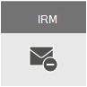

# E-posta şifreleme

Bu makalede, Microsoft 365 (OME), S/MIME, Bilgi Hakları Yönetimi (IRM) gibi Office 365 İleti Şifrelemesi şifreleme seçenekleri karşılaştırılıyor ve Aktarım Katmanı Güvenliği (TLS) sunulmaktadır.
  
Microsoft 365, e-posta güvenliğiyle ilgili iş ihtiyaçlarını karşılamanıza yardımcı olmak için birden çok şifreleme seçeneği sunar. Bu makalede, e-postayı e-posta şifrelemenin üç yolu Office 365. Bu özelliğin tüm güvenlik özellikleri hakkında daha fazla bilgi edinmek Office 365 Güven [Merkezi'Office 365 ziyaret edin](https://go.microsoft.com/fwlink/p/?LinkID=282470). Bu makalede, e-postayı güvenlik altına almak için Microsoft 365 yöneticilerine üç şifreleme türü Office 365:
  
- Office Şifrelemesi (OME) sağlar.

- Güvenli/Çok Amaçlı İnternet Posta Uzantıları (S/MIME).

- Bilgi Hakları Yönetimi (IRM).

## E-Microsoft 365 nasıl e-posta şifrelemesi kullanır?

Şifreleme, yalnızca yetkili bir alıcının bilgileri çözemesi ve tüketmesi için bilgilerin kodlanması işlemidir. Microsoft 365 iki şekilde şifreleme kullanır: hizmette ve müşteri denetiminde. Hizmette, şifreleme Microsoft 365 olarak kullanılır; herhangi bir şey yapılandırmanız da zorunda değildir. Örneğin, Microsoft 365 iki sunucu arasındaki bağlantıyı veya oturumu şifrelemek için Aktarım Katmanı Güvenliği (TLS) kullanır. 
  
E-posta şifreleme normalde şöyle çalışır:
  
- İleti, gönderenin makinesi veya iletilirken merkezi bir sunucu tarafından şifrelenir veya düz metinden okunamaz şifreleme metnine dönüşür.

- İletinin kesişme durumunda okunmalarını korumak için iletilirken şifreleme metninde kalır.

- İleti alıcı tarafından alındıktan sonra, ileti iki şekilden birini kullanarak okunabilir düz metne döner:

  - Alıcının makinesi iletinin şifresini çözmek için bir anahtar kullanır veya

  - Merkezi bir sunucu, alıcının kimliğini doğruladikten sonra, alıcı adına iletinin şifresini çözebilir.

Microsoft 365'ın sunucular arasında, Microsoft 365'de yer alan kuruluşlar veya Microsoft 365 dışındaki güvenilen bir iş ortağı arasında ve sunucular arasında iletişimin nasıl güvenli olduğu hakkında daha fazla bilgi için bkz. [Microsoft 365'Exchange Online  TS'yi kullanarak e-posta bağlantılarının güvenliğini Office 365](exchange-online-uses-tls-to-secure-email-connections.md).
    
## E-posta şifreleme seçeneklerini karşılaştırma Office 365

|E-posta şifreleme teknolojisi||||
|:-----|:-----|:-----|:-----|
|Nedir o?|Office 365 İleti Şifrelemesi (OME), hedef e-posta adresine (Gmail, Yahoo! Mail, Outlook.com vb.).   Yönetici olarak, şifreleme koşullarını tanımlayan aktarım kuralları kurarak bu kuralları kullanabilirsiniz. Kullanıcı kuralla eşleşen bir ileti gönderdiğide, şifreleme otomatik olarak uygulanır.   Şifreli iletileri görüntülemek için alıcılar tek seferlik geçiş koduna sahip olabilir, Microsoft hesabıyla oturum ya da alıcıyla ilişkilendirilmiş iş veya okul hesabıyla oturum Office 365. Alıcılar da şifreli yanıtlar gönderebilir. Şifreli iletileri görüntülemek veya Microsoft 365 yanıt göndermek için kullanıcı aboneliğine ihtiyaçları değildir.|IRM, e-posta iletilerine kullanım kısıtlamaları da uygulanan bir şifreleme çözümüdür. Bu, hassas bilgilerin yetkisiz kişiler tarafından yazdırılmaz, iletilme veya kopyanması için önlemeye yardımcı olur.   Azure Hak Yönetimi'Microsoft 365 (Azure RMS) kullanımıyla ilgili IRM özellikleri.|S/MIME, iletiyi hem şifreleme hem de dijital olarak imzalamanızı sağlayan sertifika tabanlı bir şifreleme çözümüdür. İleti şifrelemesi, yalnızca hedeflenen alıcının iletiyi açıp okuyabilmelerini sağlamaya yardımcı olur. Dijital imza, alıcının gönderenin kimliğini doğrulamasını sağlar.   Hem dijital imzalar hem de ileti şifreleme, dijital imzaları doğrulamak ve iletileri şifrelemek veya şifrelerini çözmek için gereken anahtarları içeren benzersiz dijital sertifikaların kullanımı yoluyla mümkün olur.   S/MIME kullanmak için, her alıcının ortak anahtarlarını dosyada bulundurabilirsiniz. Alıcıların güvenli kalması için kendi özel anahtarlarını korumaları gerekir. Alıcının özel anahtarları tehlikeye atılmışsa, alıcının yeni bir özel anahtara sahip olması ve ortak anahtarları tüm olası gönderenlere yeniden dağıtmış olması gerekir.|
|Ne işe geliyor?|OME:   İç veya dış alıcılara gönderilen iletileri şifreler.    Kullanıcıların Outlook.com, Yahoo! gibi herhangi bir e-posta adresine şifrelenmiş ileti göndermesini sağlar Mail ve Gmail.    Bir yönetici olarak e-posta görüntüleme portalını, kurum markasını yansıtacak şekilde özelleştirmenizi sağlar.   Microsoft anahtarları güvenli bir şekilde yönetir ve depolar, böylece sizin bunu yapmak zorunda değildir.   Şifreli ileti (HTML eki olarak gönderilir) tarayıcıda açılabilir olduğu sürece özel bir istemci tarafı yazılımı gerekmez.|IRM:   E-posta iletileri ve ekleri için çevrimiçi ve çevrimdışı koruma sağlamak üzere şifreleme ve kullanım kısıtlamalarını kullanır.   Yönetici olarak size, iletileri seçmek için IRM'yi otomatik olarak uygulamak için aktarım Outlook aktarım kurallarını ayarlama veya koruma kurallarını ayarlama olanağı verir.   Kullanıcıların şablon ve dosya (eski adı Outlook Web üzerinde Outlook) içinde el ile şablon uygulamalarını Outlook Web App.|S/MIME, dijital imzalarla gönderen kimlik doğrulamasını ve şifreleme ile ileti gizliliğini ele alır.|
|Peki bu neleri yapar?|OME, iletilere kullanım kısıtlamaları uygulamana izin vermez. Örneğin, alıcının şifreli bir iletiyi iletmesini veya yazdırmasini durdurmak için onu kullanasınız.|Bazı uygulamalar tüm cihazlarda IRM e-postalarını desteklemeyebilirsiniz. IRM e-postasını destekleyen bu ürünler ve diğer ürünler hakkında daha fazla bilgi için bkz [. İstemci cihazı özellikleri](/azure/information-protection/requirements#BKMK_ClientCapabilities).|S/MIME, şifreli iletilerin kötü amaçlı yazılım, istenmeyen posta veya ilkeler için taran olmasına izin vermez.|
|Öneriler senaryolar ve örnek senaryolar|İster tüketiciler ister diğer işletmeler olsun, kuruluş dışındaki kişiler için hassas iş bilgileri göndermek istediğiniz zaman OME'nin kullanılması önerilir. Örneğin:     Müşterilere kredi kartı deyimleri gönderen bir banka çalışanı     Hastanın tıbbi kayıtlarını gönderen bir doktor muayene muayenesi     Başka bir avukata gizli yasal bilgileri gönderen bir avukat|Kullanım kısıtlamaları ve şifreleme uygulamak istediğiniz zaman IRM'i öneririz. Örneğin:     Ekibine yeni ürünle ilgili gizli bilgiler gönderen bir yönetici "İteleyim" seçeneğini uygular.     Yöneticinin, Office 365 kullanan bir iş ortağının ekını içeren ve hem e-postanın hem de ekin korunmasını gerektiren başka bir şirketle teklif teklifi paylaşması gerekiyor.|S/MIME'nin, kurum veya alıcının kuruluşuna gerçek eşler arası şifreleme gerektirdiği zaman kullanılması önerilir.     S/MIME en çok aşağıdaki senaryolarda kullanılır:     Kamu kuruluşları diğer kamu kuruluşlarıyla iletişim kurar     Kamu kurumuyla iletişim halinde bir işletme|
||

## Microsoft 365 aboneliğim için hangi Microsoft 365 kullanılabilir?

Yeni aboneliğinizin e-posta şifreleme seçenekleri hakkında Microsoft 365 için bkz[. Exchange Online açıklama.](/office365/servicedescriptions/exchange-online-service-description/exchange-online-service-description) Burada, aşağıdaki şifreleme özellikleri hakkında bilgi bulabilirsiniz:
  
- Hem IRM özellikleri hem de OME dahil olmak üzere Azure RMS

- S/MIME

- TLS

- Beklemede verilerin şifreleniyor (BitLocker yoluyla)

Ayrıca, üçüncü taraf şifreleme araçlarını, ÖRNEĞIN PGP (Oldukça İyi Gizlilik) Microsoft 365, üçüncü taraf şifreleme araçlarını da kullanabilirsiniz. Microsoft 365 PGP/MIME'yi desteklemez ve PGP şifreli e-postaları göndermek ve almak için yalnızca PGP/Inline kullanabilirsiniz.

## Beklemede veriler için şifreleme ne olacak?

"Geri kalan veriler", etkin bir şekilde geçişte olmayan verileri ifade eder. Daha Microsoft 365 e-posta verileri BitLocker Sürücü Şifrelemesi kullanılarak şifrelenir. BitLocker, yetkisiz erişime karşı gelişmiş koruma sağlamak için Microsoft veri merkezlerinde sabit sürücüleri şifreler. Daha fazla bilgi edinmek için bkz. [BitLocker'a Genel Bakış](/previous-versions/windows/it-pro/windows-server-2012-R2-and-2012/hh831713(v=ws.11)).
  
## E-posta şifreleme seçenekleri hakkında daha fazla bilgi

Bu makalede hem e-posta şifreleme seçenekleri hem de TLS hakkında daha fazla bilgi için şu makalelere bakın:
  
**OME**
  
[Office 365 İleti Şifrelemesi (OME)](ome.md)
  
**IRM**
  
[Exchange Online'de Bilgi Hakları Yönetimi](./information-rights-management-in-exchange-online.md)
  
[Azure Hak Yönetimi nedir?](/azure/information-protection/what-is-azure-rms)
  
**S/MIME**
  
[İleti imzalama ve şifreleme için S/MIME](/Exchange/policy-and-compliance/smime/smime)
  
[S/MIME'i anlama](/previous-versions/tn-archive/aa995740(v=exchg.65))
  
[Ortak Anahtar Şifrelemeyi Anlama](/previous-versions/tn-archive/aa998077(v=exchg.65))
  
**TLS**
  
[Bağlayıcıları kullanarak özel posta akışını yapılandırma](/exchange/mail-flow-best-practices/use-connectors-to-configure-mail-flow/use-connectors-to-configure-mail-flow)
