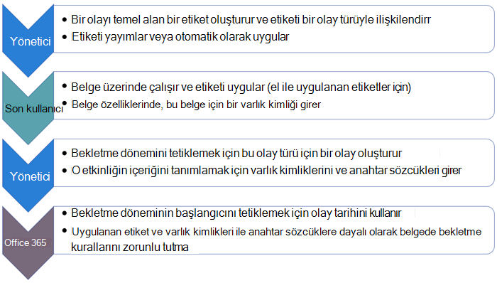
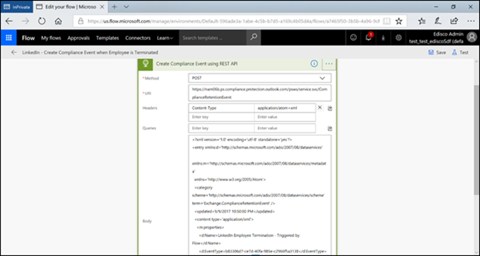

# <a name="start-retention-when-an-event-occurs"></a>Bir olay meydana geldiğinde saklamayı başlatma

>*[Güvenlik & uyumluluğu için Microsoft 365 lisanslama kılavuzu](/office365/servicedescriptions/microsoft-365-service-descriptions/microsoft-365-tenantlevel-services-licensing-guidance/microsoft-365-security-compliance-licensing-guidance).*

İçeriği koruduğunuzda saklama süresi genellikle içeriğin yaşına bağlıdır. Örneğin, oluşturulduktan sonra belgeleri yedi yıl saklayabilir ve sonra silebilirsiniz. Ancak [bekletme etiketlerini](retention.md#retention-labels) yapılandırırken, belirli bir olay türünün gerçekleştiği bir saklama süresini de temel alabilirsiniz. Olay, bekletme süresinin başlangıcını tetikler ve bu tür bir olay için bir bekletme etiketi uygulanmış olan tüm içerik, etiketin bekletme eylemlerinin bunlar üzerinde zorunlu tutulmasını sağlar.
  
Olay tabanlı saklamayı kullanma örnekleri:
  
- **Kuruluştan ayrılan çalışanlar** Çalışan kayıtlarının, bir çalışanın kuruluştan ayrıldığı zamandan itibaren 10 yıl boyunca saklanması gerektiğini varsayalım. 10 yıl geçtikten sonra, o çalışanın işe alınması, performansı ve sonlandırılmasıyla ilgili tüm belgeler elden çıkarılmalıdır. 10 yıllık saklama süresini tetikleyen olay, çalışanın kuruluştan ayrılmasıdır. 
    
- **Sözleşmenin sona erme tarihi** Sözleşmelerle ilgili tüm kayıtların, sözleşmenin süresi dolduğundan itibaren beş yıl boyunca saklanması gerektiğini varsayalım. Beş yıllık saklama süresini tetikleyen olay, sözleşmenin sona ermesidir. 
    
- **Ürün ömrü** Kuruluşunuzun teknik belirtimler gibi içerikler için ürünlerin son üretim tarihiyle ilgili saklama gereksinimleri olabilir. Bu durumda, son üretim tarihi saklama süresini tetikleyen olaydır. 
    
Olay tabanlı saklama genellikle kayıt yönetimi sürecinin bir parçası olarak kullanılır. Bu, şu anlama gelir:

- Olaylara dayalı bekletme etiketleri de genellikle öğeleri kayıt yönetimi çözümünün bir parçası olarak bir kayıt olarak işaretler. Daha fazla bilgi için bkz. [Kayıt yönetimi hakkında bilgi edinin](records-management.md).

- Kayıt olarak bildirilen ancak olay tetikleyicisi henüz gerçekleşmemiş bir belge süresiz olarak korunur. Bir olay, belgenin saklama süresini tetikleyene kadar ve süresi dolana kadar kayıtlar kalıcı olarak silinemez.

- Olaylara dayalı bekletme etiketleri genellikle saklama süresinin sonunda bir değerlendirme gözden geçirmesi tetikler, böylece kayıt yöneticisi içeriği el ile gözden geçirebilir ve atabilir. Daha fazla bilgi için bkz. [İçeriğin konumu](disposition.md).

Bir olayı temel alan bekletme etiketi, Microsoft 365'teki tüm bekletme etiketleriyle aynı özelliklere sahiptir. Daha fazla bilgi için bkz. [Bekletme ilkeleri ve bekletme etiketleri hakkında bilgi edinin](retention.md).

## <a name="understanding-the-relationship-between-event-types-labels-events-and-asset-ids"></a>Olay türleri, etiketler, olaylar ve varlık kimlikleri arasındaki ilişkiyi anlama

Olay tabanlı saklamayı başarıyla kullanmak için diyagramlarda gösterildiği gibi olay türleri, bekletme etiketleri, olaylar ve varlık kimlikleri arasındaki ilişkiyi ve aşağıdaki açıklamaları anlamak önemlidir: 
  

  

  
1. Farklı içerik türleri için bekletme etiketleri oluşturur ve bunları bir olay türüyle ilişkilendirirsiniz. Örneğin, ürün dosyalarının ve kayıtlarının farklı türleri için bekletme etiketleri Ürün Ömrü adlı bir olay türüyle ilişkilendirilir çünkü bu kayıtlar, ürünün kullanım ömrü sonuna ulaştığından itibaren 10 yıl boyunca saklanmalıdır.
    
2. Genellikle kayıt yöneticileri olan kullanıcılar bu bekletme etiketlerini içeriğe uygular ve (SharePoint ve OneDrive'daki belgeler için) her öğe için bir varlık kimliği girer. Bu örnekte varlık kimliği, kuruluş tarafından kullanılan bir ürün adı veya koddur. Ardından, her ürünün kayıtlarına bir bekletme etiketi atanır ve her kaydın varlık kimliği içeren bir özelliği vardır. Diyagram, bir **kuruluştaki tüm ürün kayıtlarının tüm içeriğini** temsil eder ve her öğe, kaydı olan ürünün varlık kimliğini taşır. 
    
3. Ürün Ömrü olay türüdür; belirli bir ürünün ömrünün sonuna ulaşması bir olaydır. Bu olay türünde bir olay gerçekleştiğinde (bu durumda, bir ürün kullanım ömrünün sonuna ulaştığında) şunları belirten bir olay oluşturursunuz:
    
   - Varlık kimliği (SharePoint ve OneDrive belgeleri için)
    
   - Anahtar sözcükler (Exchange öğeleri için). Bu örnekte kuruluş, ürün kayıtlarını içeren iletilerde bir ürün kodu kullandığından, Exchange öğeleri için anahtar sözcük SharePoint ve OneDrive belgelerinin varlık kimliğiyle işlevsel olarak aynıdır.
    
   - Olayın gerçekleştiği tarih. Bu tarih, bekletme döneminin başlangıcı olarak kullanılır. Bu tarih geçerli, geçmiş veya gelecekteki bir tarih olabilir.

4. Bir olay oluşturduktan sonra, bu olay tarihi, bu olay türünde bir bekletme etiketi olan ve belirtilen varlık kimliğini veya anahtar sözcüğü içeren tüm içerikle eşitlenir. Tüm bekletme etiketleri gibi bu eşitleme de yedi güne kadar sürebilir. Önceki diyagramda, kırmızı daire içine alınmış tüm öğelerin bekletme süreleri bu olay tarafından tetiklenir. Başka bir deyişle, bu ürün kullanım ömrü dolduğunda, bu olay söz konusu ürünün kayıtları için saklama süresini tetikler.

Bir olay için varlık kimliği veya anahtar sözcükler belirtmezseniz, bu olay türündeki bir bekletme etiketine sahip **tüm içeriğin** saklama süresinin olay tarafından tetikleneceğini anlamanız önemlidir. Bu, önceki diyagramda tüm içeriğin korunmaya başlayacağı anlamına gelir. Bu sonucun hedeflediğiniz sonuç olma olasılığı düşüktür.

Son olarak, her bekletme etiketinin kendi bekletme ayarları olduğunu unutmayın. Bu örnekte, hepsi 10 yıl belirtir, ancak bir olayın her etiketin farklı bir bekletme süresine sahip olduğu bekletme etiketlerini tetikleyebilmiştir.
  
## <a name="how-to-set-up-event-driven-retention"></a>Olay temelli saklamayı ayarlama

Olay temelli saklama için üst düzey iş akışı:
  

  
> [!TIP]
> Bekletme etiketlerini otomatik olarak uygulamak ve olay temelli [bekletme uygulamak için SharePoint'te](auto-apply-retention-labels-scenario.md) yönetilen özellikleri kullanma hakkında ayrıntılı bir senaryo için bkz. SharePoint'te depolanan belgelerin yaşam döngüsünü yönetmek için bekletme etiketlerini kullanma.

### <a name="step-1-create-a-label-whose-retention-period-is-based-on-an-event"></a>1. Adım: Bekletme süresi bir olayı temel alan bir etiket oluşturma

Bekletme etiketinizi oluşturmak ve yapılandırmak için Kayıt yönetimi için [bekletme etiketleri oluşturma](file-plan-manager.md#create-retention-labels) yönergelerine bakın. Ancak olay tabanlı saklamaya özgü:

- Bekletme etiketini oluştururken **Etiket ayarlarını tanımla** sayfasında **Öğeleri sonsuza kadar veya belirli bir süre boyunca tut'u** seçtiğinizden emin olun. Sonra:
    
    **Dönemi tanımla** sayfasında, dönemi ayarladıktan sonra, dönem **ne zaman başlasın?** için açılan listeden varsayılan olay türlerinden birini seçin. Veya Yeni olay türü oluştur'u seçerek kendi **olay türünüzü** oluşturun ve yapılandırma istemlerini izleyin:
    
    

Olay türü, bekletme etiketiyle ilişkilendirmek istediğiniz bir olayın genel açıklamasıdır.

Varsayılan olay türleri, daha kolay tanımlanabilmesi için açılan listede adından sonra **(olay türü)** içerir ve Olay **türlerini yönet** > **Kayıt yönetimi** > **Olayları** sekmesinden olay türünü görebilir ve oluşturabilirsiniz.

Olay tabanlı saklama, şu saklama ayarlarını gerektirir:
  
- İçeriği koruyun.
    
- İçeriği otomatik olarak silin veya saklama süresinin sonunda bir değerlendirme gözden geçirmesi tetikler.
  
Olay tabanlı saklama genellikle kayıt olarak bildirilen içerik için kullanılır, bu nedenle şimdi içeriği kayıt olarak işaretleyen seçeneği de belirlemeniz gerekip gerekmediğini denetlemek için [iyi bir zaman](records-management.md#records).

Yeni bir olay türü oluşturmak yerine mevcut bir olay türünü kullanıyorsanız, 3. adıma atlayın.

> [!NOTE]
> Bir olay türü seçtikten ve bekletme etiketini kaydettikten sonra olay türü değiştirilemez.

### <a name="step-2-create-a-new-event-type-for-your-label"></a>2. Adım: Etiketiniz için yeni bir olay türü oluşturma

Bekletme ayarları için **Yeni olay türü oluştur'u seçtiyseniz, olay türünüz** için bir ad ve açıklama girin. Ardından **İleri**, Gönder ve **Bitti'yi** seçin. 

**Dönemi tanımla** sayfasına dönün; **Dönem ne zaman başlamalıdır?** için, oluşturduğunuz olay türünü seçmek için açılan listeyi kullanın.

  
### <a name="step-3-publish-or-auto-apply-the-event-based-retention-labels"></a>3. Adım: Olay tabanlı bekletme etiketlerini yayımlama veya otomatik uygulama

Herhangi bir bekletme etiketinde olduğu gibi, içeriğe el ile veya otomatik olarak uygulanabilmek için olay tabanlı bir etiketi yayımlamanız veya otomatik olarak uygulamanız gerekir:
- [Bekletme etiketlerini yayımlama ve uygulamalarda uygulama](create-apply-retention-labels.md)
- [İçeriğe otomatik olarak bekletme etiketi uygulama](apply-retention-labels-automatically.md)

### <a name="step-4-enter-an-asset-id"></a>4. Adım: Varlık kimliği girme

İçeriğe olay tabanlı bir etiket uygulandıktan sonra, her öğe için bir varlık kimliği girebilirsiniz. Örneğin, kuruluşunuz şunları kullanabilir:
  
- İçeriği yalnızca belirli bir ürün için saklamak için kullanabileceğiniz ürün kodları.
    
- İçeriği yalnızca belirli bir proje için saklamak için kullanabileceğiniz proje kodları.
    
- İçeriği yalnızca belirli bir kişiye saklamak için kullanabileceğiniz çalışan kimlikleri.
    
Varlık Kimliği, SharePoint ve OneDrive'da kullanılabilen başka bir belge özelliğidir. Kuruluşunuz içeriği sınıflandırmak için diğer belge özelliklerini ve kimliklerini zaten kullanıyor olabilir. Öyleyse, olay oluştururken bu özellikleri ve değerleri de kullanabilirsiniz; aşağıdaki 6. adıma bakın. Önemli nokta, bu öğeyi bir olay türüyle ilişkilendirmek için belge özelliklerinde bazı *özellik:değer* bileşimi kullanmanız gerektiğidir.
  

  
### <a name="step-5-create-an-event"></a>5. Adım: Olay oluşturma

Bu olay türünün belirli bir örneği gerçekleştiğinde (örneğin, bir ürün kullanım ömrünün sonuna ulaştığında), Microsoft Purview uyumluluk portalı **Kayıt yönetimi** > **Olayları** sayfasına gidin ve **+ Oluştur'u** seçerek bir olay oluşturun. Olayı burada oluşturarak tetiklersiniz.


Kiracı başına en fazla 1.000.000 olay desteklenir.

### <a name="step-6-choose-the-same-event-type-used-by-the-label-in-step-2"></a>6. Adım: 2. adımda etiket tarafından kullanılan olay türünü seçin

Olayı oluşturduğunuzda, 2. adımdaki bekletme etiketi ayarlarında belirtilen olay türünü seçin. Örneğin, etiket ayarları için olay türünüz olarak **Ürün Ömrü'nü** seçtiyseniz, olayı oluştururken **Ürün Ömrü'nü** seçin. Yalnızca bu olay türüne ait saklama etiketleri uygulanmış içerikte bekletme süresi tetiklenir.


Alternatif olarak, farklı olay türlerine sahip birden çok bekletme etiketi için bir olay oluşturmanız gerekiyorsa **Mevcut Etiketleri Seç** seçeneğini belirleyin. Ardından, bu olayla ilişkilendirmek istediğiniz olay türleri için yapılandırılan etiketleri seçin.

### <a name="step-7-enter-keywords-or-query-for-exchange-asset-id-for-sharepoint-and-onedrive"></a>7. Adım: Exchange için anahtar sözcükleri veya sorguyu, SharePoint ve OneDrive için varlık kimliğini girin

Şimdi içeriğin kapsamını daraltacaksınız. Exchange içeriği için bunu anahtar sözcükler veya sorgu belirterek yaparsınız. SharePoint ve OneDrive içeriği için varlık kimliklerini belirterek bunu yaparsınız.

Exchange öğeleri için anahtar sözcükler veya Anahtar Sözcük Sorgu Dili (KQL) kullanan bir sorgu kullanın. Sorgu söz dizimi hakkında daha fazla bilgi için bkz [. Anahtar Sözcük Sorgu Dili (KQL) söz dizimi başvurusu](/sharepoint/dev/general-development/keyword-query-language-kql-syntax-reference). Exchange için kullanabileceğiniz aranabilir özellikler hakkında daha fazla bilgi için bkz [. İçerik Arama için anahtar sözcük sorguları ve arama koşulları](keyword-queries-and-search-conditions.md).

Varlık kimlikleri için bekletme yalnızca belirtilen *özellik:değer* çifti olan içerikte zorlanır. Örneğin, Varlık Kimliği özelliğini kullanıyorsanız, aşağıdaki resimde gösterilen varlık kimlikleri kutusuna girin `ComplianceAssetID:<value>` .

Varlık kimliği girmezse, bu olay türü etiketlerine sahip tüm içeriklere aynı saklama tarihi uygulanır.

Kuruluşunuz bu olay türüyle ilgili belgelere başka özellikler ve kimlikler uygulamış olabilir. Örneğin, belirli bir ürünün kayıtlarını algılamanız gerekiyorsa, kimlik özel ürün kimliğinizle "XYZ" değerinin birleşimi olabilir. Bu durumda, aşağıdaki resimde gösterilen varlık kimlikleri kutusuna girersiniz `ProductID:XYZ` .

Son olarak olayın gerçekleştiği tarihi seçin; bu tarih, saklama döneminin başlangıcı olarak kullanılır. Bir olay oluşturduktan sonra, bu olay tarihi söz konusu olay türü, varlık kimliği ve anahtar sözcükler veya sorgular için bekletme etiketine sahip tüm içerikle eşitlenir. Herhangi bir bekletme etiketinde olduğu gibi, bu eşitleme yedi güne kadar sürebilir.
  


Olay oluşturduktan sonra, bekletme ayarları zaten etiketlenmiş ve dizine alınmış içerik için geçerli olur. Bekletme etiketi, olay oluşturulduktan sonra yeni içeriğe eklenirse, aynı ayrıntılara sahip yeni bir olay oluşturmanız gerekir.

Bir olayın silinmesi, zaten etiketlenmiş içerik için geçerli olan bekletme ayarlarını iptal etmez. Şu anda, olaylar tetiklendikten sonra iptal edilemiyor.

## <a name="use-content-search-to-find-all-content-with-a-specific-label-or-asset-id"></a>Belirli bir etikete veya varlık kimliğine sahip tüm içeriği bulmak için İçerik Arama'yı kullanma

saklama etiketleri içeriğe atandıktan sonra, belirli bir bekletme etiketine sahip veya belirli bir varlık kimliği içeren tüm içeriği bulmak için içerik aramasını kullanabilirsiniz:
  
- Belirli bir bekletme etiketine sahip tüm içeriği bulmak için **Bekletme etiketi** koşulunu seçin ve ardından etiket adının tamamını veya bir kısmını girin ve joker karakter kullanın. 
    
- Belirli bir varlık kimliğine sahip tüm içeriği bulmak için, biçimini `ComplianceAssetID:<value>`kullanarak **ComplianceAssetID** özelliğini ve değerini girin. 
    
Daha fazla bilgi için bkz [. İçerik Arama için anahtar sözcük sorguları ve arama koşulları](keyword-queries-and-search-conditions.md).

## <a name="automate-events-by-using-powershell"></a>PowerShell kullanarak olayları otomatikleştirme

İş uygulamalarınızdan olay tabanlı saklamayı otomatikleştirmek için bir PowerShell betiği kullanabilirsiniz. Olay tabanlı saklama için kullanılabilen PowerShell cmdlet'leri:
  
- [Get-ComplianceRetentionEventType](/powershell/module/exchange/get-complianceretentioneventtype)
    
- [New-ComplianceRetentionEventType](/powershell/module/exchange/new-complianceretentioneventtype)
    
- [Remove-ComplianceRetentionEventType](/powershell/module/exchange/remove-complianceretentioneventtype)
    
- [Set-ComplianceRetentionEventType](/powershell/module/exchange/set-complianceretentioneventtype)
    
- [Get-ComplianceRetentionEvent](/powershell/module/exchange/get-complianceretentionevent)
    
- [New-ComplianceRetentionEvent](/powershell/module/exchange/new-complianceretentionevent)
    

Bekletme etiketleri ve ilkeleri oluşturmaya yönelik diğer cmdlet'leri tanımlamaya yardımcı olmak için bkz. [Bekletme ilkeleri ve bekletme etiketleri için PowerShell cmdlet'leri](retention-cmdlets.md).

## <a name="automate-events-by-using-a-rest-api"></a>REST API kullanarak olayları otomatikleştirme

Bekletme süresinin başlangıcını tetikleyen olayları otomatik olarak oluşturmak için REST API kullanabilirsiniz.

> [!NOTE]
> Artık önizleme aşamasında kullanıma sunulan [microsoft Graph API kayıt yönetimi için](compliance-extensibility.md#microsoft-graph-api-for-records-management-preview) kullanarak olayı oluşturabilir, ayrıca olay türleri ve bekletme etiketleri oluşturabilirsiniz.
> 
> Bu bölümdeki REST API'leri yakında kullanım dışı bırakılacağı ve çalışmayı durduracağı için bu Graph API'lerini denemenizi öneririz.

REST API, hizmetin kaynaklarına oluşturma/alma/güncelleştirme/silme erişimi sağlayan HTTP işlemleri kümelerini (yöntemler) destekleyen bir hizmet uç noktasıdır. Daha fazla bilgi için bkz. [REST API isteğinin/yanıtının bileşenleri](/rest/api/gettingstarted/#components-of-a-rest-api-requestresponse). Microsoft 365 REST API'sini kullanarak post ve GET yöntemleri kullanılarak olaylar oluşturulabilir ve alınabilir.

REST API'yi kullanmak için iki seçenek vardır:

- **Microsoft Power Automate veya bir** olayın otomatik olarak oluşmasını tetikleyen benzer bir uygulama. Microsoft Power Automate, diğer sistemlere bağlanmak için bir düzenleyici olduğundan özel bir çözüm yazmanız gerekmez. Daha fazla bilgi için [bkz. Power Automate web sitesi](https://flow.microsoft.com/en-us/).

- **Özel bir çözümün parçası olan PowerShell** (sürüm 6 veya üzeri) kullanarak olay oluşturmak için REST API'yi çağırmak için PowerShell veya HTTP istemcisi.

REST API'yi kullanmadan önce, genel yönetici olarak bekletme olayı çağrısı için kullanılacak URL'yi onaylayın. Bunu yapmak için REST API URL'sini kullanarak bir GET bekletme olayı çağrısı çalıştırın:

```http
https://ps.compliance.protection.outlook.com/psws/service.svc/ComplianceRetentionEvent
```

Yanıt kodunu denetleyin. 302 ise, yanıt üst bilgisinin Location özelliğinden yeniden yönlendirilen URL'yi alın ve aşağıdaki yönergeler yerine `https://ps.compliance.protection.outlook.com/psws/service.svc/ComplianceRetentionEvent` bu URL'yi kullanın.

Otomatik olarak oluşturulan olaylar, Microsoft Purview uyumluluk portalı > **Kayıt yönetimi** >  **Olaylarında** görüntülenerek onaylanabilir.

### <a name="use-microsoft-power-automate-to-create-the-event"></a>Olayı oluşturmak için Microsoft Power Automate'i kullanma

Microsoft 365 REST API'sini kullanarak olay oluşturan bir akış oluşturun:




#### <a name="create-an-event"></a>Olay oluşturma

REST API'yi çağırmak için örnek kod:

- **Yöntem**: POST
- **URL**: `https://ps.compliance.protection.outlook.com/psws/service.svc/ComplianceRetentionEvent`
- **Üst Bilgiler**: Key = content-Type, Value = application/atom+xml
- **Gövde**:

    ```xml
    <?xml version='1.0' encoding='utf-8' standalone='yes'?>
    
    <entry xmlns:d='http://schemas.microsoft.com/ado/2007/08/dataservices'
    
    xmlns:m='http://schemas.microsoft.com/ado/2007/08/dataservices/metadata'
    
    xmlns='http://www.w3.org/2005/Atom'>
    
    <category scheme='http://schemas.microsoft.com/ado/2007/08/dataservices/scheme' term='Exchange.ComplianceRetentionEvent' />
    
    <updated>9/9/2017 10:50:00 PM</updated>
    
    <content type='application/xml'>
    
    <m:properties>
    
    <d:Name>Employee Termination </d:Name>
    
    <d:EventType>99e0ae64-a4b8-40bb-82ed-645895610f56</d:EventType>
    
    <d:SharePointAssetIdQuery>1234</d:SharePointAssetIdQuery>
    
    <d:EventDateTime>2018-12-01T00:00:00Z </d:EventDateTime>
    
    </m:properties>
    
    </content>
    
    </entry>
    ```

- **Kimlik Doğrulaması**: Temel
- **Kullanıcı adı**: "Complianceuser"
- **Parola**: "Compliancepassword"


##### <a name="available-parameters"></a>Kullanılabilir parametreler


|Parametre|Açıklama|Notlar|
|--- |--- |--- |
|<d:Name></d:Name>|Olay için benzersiz bir ad belirtin,|Sondaki boşlukları veya şu karakterleri içeremez: % * \ & < \> \| # ? , : ;|
|<d:EventType></d:EventType>|Olay türü adı (veya Guid) girin|Örnek: "Çalışan sonlandırma". Olay türü bir bekletme etiketiyle ilişkilendirilmelidir.|
|<d:SharePointAssetIdQuery></d:SharePointAssetIdQuery>|"ComplianceAssetId:" + çalışan kimliği girin|Örnek: "ComplianceAssetId:12345"|
|<d:EventDateTime></d:EventDateTime>|Olay Tarihi ve Saati|Biçim: yyyy-MM-ddTHH:mm:ssZ, Örnek: 2018-12-01T00:00:00Z
|

###### <a name="response-codes"></a>Yanıt kodları

| Yanıt Kodu | Açıklama       |
| ----------------- | --------------------- |
| 302               | Yönlendirme              |
| 201               | Oluşturuldu               |
| 403               | Yetkilendirme Başarısız Oldu  |
| 401               | Kimlik Doğrulaması Başarısız Oldu |

##### <a name="get-events-based-on-a-time-range"></a>Zaman aralığına göre olayları alma

- **Yöntem**: GET

- **URL**: `https://ps.compliance.protection.outlook.com/psws/service.svc/ComplianceRetentionEvent?BeginDateTime=2019-01-11&EndDateTime=2019-01-16`

- **Üst Bilgiler**: Key = content-Type, Value = application/atom+xml

- **Kimlik Doğrulaması**: Temel

- **Kullanıcı adı**: "Complianceuser"

- **Parola**: "Compliancepassword"

###### <a name="response-codes"></a>Yanıt kodları

| Yanıt Kodu | Açıklama                   |
| ----------------- | --------------------------------- |
| 200               | Tamam, atom+ xml içindeki olayların listesi |
| 404               | Bulunamadı                         |
| 302               | Yönlendirme                          |
| 401               | Yetkilendirme Başarısız Oldu              |
| 403               | Kimlik Doğrulaması Başarısız Oldu             |

##### <a name="get-an-event-by-id"></a>Kimliğine göre olay alma

- **Yöntem**: GET

- **URL**: `https://ps.compliance.protection.outlook.com/psws/service.svc/ComplianceRetentionEvent('174e9a86-74ff-4450-8666-7c11f7730f66')`

- **Üst Bilgiler**: Key = content-Type, Value = application/atom+xml

- **Kimlik Doğrulaması**: Temel

- **Kullanıcı adı**: "Complianceuser"

- **Parola**: "Compliancepassword"

###### <a name="response-codes"></a>Yanıt kodları

| Yanıt Kodu | Açıklama                                      |
| ----------------- | ---------------------------------------------------- |
| 200               | Tamam, yanıt gövdesi atom+xml dosyasındaki olayı içerir |
| 404               | Bulunamadı                                            |
| 302               | Yönlendirme                                             |
| 401               | Yetkilendirme Başarısız Oldu                                 |
| 403               | Kimlik Doğrulaması Başarısız Oldu                                |

##### <a name="get-an-event-by-name"></a>Ada göre olay alma

- **Yöntem**: GET

- **URL**: `https://ps.compliance.protection.outlook.com/psws/service.svc/ComplianceRetentionEvent`

- **Üst Bilgiler**: Key = content-Type, Value = application/atom+xml

- **Kimlik Doğrulaması**: Temel

- **Kullanıcı adı**: "Complianceuser"

- **Parola**: "Compliancepassword"

###### <a name="response-codes"></a>Yanıt kodları

| Yanıt Kodu | Açıklama                                      |
| ----------------- | ---------------------------------------------------- |
| 200               | Tamam, yanıt gövdesi atom+xml dosyasındaki olayı içerir |
| 404               | Bulunamadı                                            |
| 302               | Yönlendirme                                             |
| 401               | Yetkilendirme Başarısız Oldu                                 |
| 403               | Kimlik Doğrulaması Başarısız Oldu                                |

### <a name="use-powershell-or-any-http-client-to-create-the-event"></a>Olayı oluşturmak için PowerShell veya herhangi bir HTTP istemcisi kullanma

PowerShell sürüm 6 veya üzeri olmalıdır.

PowerShell oturumunda aşağıdaki betiği çalıştırın:

```powershell
param([string]$baseUri)

$userName = "UserName"

$password = "Password"

$securePassword = ConvertTo-SecureString $password -AsPlainText -Force

$credentials = New-Object System.Management.Automation.PSCredential($userName, $securePassword)

$EventName="EventByRESTPost-$(([Guid]::NewGuid()).ToString('N'))"

Write-Host "Start to create an event with name: $EventName"

$body = "<?xml version='1.0' encoding='utf-8' standalone='yes'?>

<entry xmlns:d='http://schemas.microsoft.com/ado/2007/08/dataservices'

xmlns:m='http://schemas.microsoft.com/ado/2007/08/dataservices/metadata'

xmlns='http://www.w3.org/2005/Atom'>

<category scheme='http://schemas.microsoft.com/ado/2007/08/dataservices/scheme' term='Exchange.ComplianceRetentionEvent' />

<updated>7/14/2017 2:03:36 PM</updated>

<content type='application/xml'>

<m:properties>

<d:Name>$EventName</d:Name>

<d:EventType>e823b782-9a07-4e30-8091-034fc01f9347</d:EventType>

<d:SharePointAssetIdQuery>'ComplianceAssetId:123'</d:SharePointAssetIdQuery>

</m:properties>

</content>

</entry>"

$event = $null

try

{

$event = Invoke-RestMethod -Body $body -Method 'POST' -Uri "$baseUri/ComplianceRetentionEvent" -ContentType "application/atom+xml" -Authentication Basic -Credential $credentials -MaximumRedirection 0

}

catch

{

$response = $_.Exception.Response

if($response.StatusCode -eq "Redirect")

{

$url = $response.Headers.Location

Write-Host "redirected to $url"

$event = Invoke-RestMethod -Body $body -Method 'POST' -Uri $url -ContentType "application/atom+xml" -Authentication Basic -Credential $credentials -MaximumRedirection 0

}

}

$event | fl *
```
