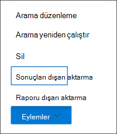

# <a name="export-content-search-results"></a>İçerik arama sonuçlarını dışarı aktarma

[!include[Purview banner](../includes/purview-rebrand-banner.md)]

İçerik araması başarıyla çalıştırıldıktan sonra, arama sonuçlarını yerel bir bilgisayara aktarabilirsiniz. E-posta sonuçlarını dışarı aktardığınızda, bunlar bilgisayarınıza PST dosyaları olarak indirilir. SharePoint ve OneDrive İş sitelerdeki içeriği dışarı aktardığınızda, yerel Office belgelerin kopyaları dışarı aktarılır. Dışarı aktarılan arama sonuçlarına dahil edilen başka belgeler ve raporlar da vardır.
  
İçerik aramasının sonuçlarını dışarı aktarmak için sonuçların hazırlanması ve yerel bir bilgisayara indirilmesi gerekir. Arama sonuçlarını dışarı aktarmaya yönelik bu adımlar, Microsoft Purview eBulma (Standart) servis talepleri ile ilişkili bir aramanın sonuçlarını dışarı aktarmak için de geçerlidir.
  
## <a name="before-you-export-search-results"></a>Arama sonuçlarını dışarı aktarmadan önce

- Arama sonuçlarını dışarı aktarmak için Microsoft Purview uyumluluk portalında Dışarı aktarma yönetimi rolüne sahip olmanız gerekir. Bu rol, yerleşik eBulma Yöneticisi rol grubuna atanır. Varsayılan olarak Kuruluş Yönetimi rol grubuna atanmaz. Daha fazla bilgi için bkz. [eBulma izinleri atama](assign-ediscovery-permissions.md).

- Arama sonuçlarını dışarı aktarmak için kullandığınız bilgisayarın aşağıdaki sistem gereksinimlerini karşılaması gerekir:
  
  - en son Windows sürümü (32 bit veya 64 bit)
  
  - Microsoft .NET Framework 4.7 veya üzeri
  
- eBulma Dışarı Aktarma Aracı'nı çalıştırmak için Microsoft Edge <sup>1</sup> kullanmanız gerekir. Arama sonuçlarını dışarı aktarmak için Internet Explorer 11'in kullanılması artık <sup>desteklenmiyor2</sup>.
  
  > [!NOTE]
  > <sup>1</sup> Microsoft Edge yapılan son değişikliklerin bir sonucu olarak, ClickOnce desteği artık varsayılan olarak etkin değildir. Edge'de ClickOnce desteğini etkinleştirme yönergeleri için bkz. [Microsoft Edge'de eBulma Dışarı Aktarma Aracı'nı kullanma](configure-edge-to-export-search-results.md). Ayrıca Microsoft, ClickOnce uygulamaları için üçüncü taraf uzantılar veya eklentiler üretmez. Üçüncü taraf uzantıları veya eklentileri olan desteklenmeyen bir tarayıcı kullanarak arama sonuçlarını dışarı aktarma desteklenmez.
  >
  > <sup>2</sup> Ağustos 2021'den itibaren Microsoft 365 uygulamalar ve hizmetler artık Internet Explorer 11'i (IE11) desteklemeyecektir ve kullanıcılar düşük bir deneyime sahip olabilir veya bu uygulama ve hizmetlere bağlanamayabilir. Bu uygulamalar ve hizmetler, desteğin sorunsuz bir şekilde sona ermesini sağlamak için önümüzdeki haftalar ve aylar içinde aşamalı olarak kullanıma sunulacaktır. Her uygulama ve hizmet, bağımsız zamanlamalarla aşamalı olarak kullanıma alınıyor. Daha fazla bilgi için bu [blog gönderisini inceleyin](https://techcommunity.microsoft.com/t5/microsoft-365-blog/microsoft-365-apps-say-farewell-to-internet-explorer-11-and/ba-p/1591666).

- 2. Adımda arama sonuçlarını indirmek için kullandığınız eBulma Dışarı Aktarma Aracı, otomasyonu desteklemez (betik kullanarak veya cmdlet'leri çalıştırarak). 1. Adım'daki hazırlık sürecini veya 2. Adım'daki indirme işlemini otomatikleştirmenizi kesinlikle öneririz. Bu işlemlerden birini otomatikleştirirseniz Microsoft Desteği sorunlarla karşılaşırsanız yardım sağlamaz.

- Arama sonuçlarını yerel bir bilgisayara indirmenizi öneririz. Şirketinizin güvenlik duvarı veya ara sunucu altyapısının arama sonuçlarını indirirken sorunlara neden olmasını ortadan kaldırmak için arama sonuçlarını ağınızın dışındaki bir sanal masaüstüne indirmeyi düşünebilirsiniz. Bu, çok sayıda dosyayı dışarı aktarırken Azure veri bağlantılarında oluşan zaman aşımlarını azaltabilir. Sanal masaüstleri hakkında daha fazla bilgi için bkz. [sanal masaüstü Windows](https://azure.microsoft.com/services/virtual-desktop).

- Arama sonuçlarını indirirken performansı artırmak için, büyük bir sonuç kümesi döndüren aramaları daha küçük aramalara bölmeyi göz önünde bulundurun. Örneğin, daha hızlı indirilebilen daha küçük bir sonuç kümesi döndürmek için arama sorgularında tarih aralıklarını kullanabilirsiniz.
  
- Arama sonuçlarını dışarı aktardığınızda, veriler yerel bilgisayarınıza indirilmeden önce geçici olarak Microsoft tarafından sağlanan azure Depolama konumunda depolanır. Kuruluşunuzun Azure'da .blob.core.windows.net (joker karakter dışarı **\*** aktarmanız için benzersiz bir tanımlayıcıyı temsil eder) uç noktasına bağlanaabildiğinden emin olun. Arama sonuçları verileri oluşturulduktan iki hafta sonra Azure Depolama konumundan silinir. 
  
- Kuruluşunuz İnternet ile iletişim kurmak için bir ara sunucu kullanıyorsa, arama sonuçlarını dışarı aktarmak için kullandığınız bilgisayarda ara sunucu ayarlarını tanımlamanız gerekir (böylece dışarı aktarma aracı proxy sunucunuz tarafından doğrulanabilir). Bunu yapmak için *machine.config* dosyasını Windows sürümünüzle eşleşen konumda açın. 
  
  - **32 bit:** `%windir%\Microsoft.NET\Framework\[version]\Config\machine.config`
  
  - **64 bit:** `%windir%\Microsoft.NET\Framework64\[version]\Config\machine.config`
  
    *machine.config* dosyasına ve `</configuration>` etiketleri arasında `<configuration>` bir yere aşağıdaki satırları ekleyin. ve `Port` değerlerini kuruluşunuz için doğru değerlerle değiştirmeyi `ProxyServer` unutmayın; örneğin, `proxy01.contoso.com:80`. 
  
    ```xml
    <system.net>
       <defaultProxy enabled="true" useDefaultCredentials="true">
         <proxy proxyaddress="https://ProxyServer :Port " 
                usesystemdefault="False" 
                bypassonlocal="True" 
                autoDetect="False" />
       </defaultProxy>
    </system.net>
    ```

- Bir aramanın sonuçları 7 günden eskiyse ve dışarı aktarma işi gönderirseniz, arama sonuçlarını güncelleştirmek için aramayı yeniden çalıştırmanızı isteyen bir hata iletisi görüntülenir. Böyle bir durumda dışarı aktarmayı iptal edin, aramayı yeniden çalıştırın ve dışarı aktarmayı yeniden başlatın.

## <a name="step-1-prepare-search-results-for-export"></a>1. Adım: Arama sonuçlarını dışarı aktarma için hazırlama

İlk adım, arama sonuçlarını dışarı aktarma için hazırlamaktır. Sonuçları hazırladığınızda, bunlar Microsoft bulutunda Microsoft tarafından sağlanan bir Azure Depolama konumuna yüklenir. Posta kutuları ve sitelerden gelen içerik, saatte en fazla 2 GB oranında karşıya yüklenir.
  
1. Uyumluluk portalında, sonuçları dışarı aktarmak istediğiniz içerik aramasını seçin.
  
2. Açılır sayfanın alt kısmındaki **Eylemler** menüsünde **Sonuçları dışarı aktar'a** tıklayın.

   

   **Dışarı aktarma sonuçları** açılır sayfası görüntülenir. İçeriği dışarı aktarmak için kullanılabilen dışarı aktarma seçenekleri, arama sonuçlarının posta kutularında veya sitelerde yer alıp almadığına veya her ikisinin birleşimine bağlıdır.

3. **Çıkış seçenekleri'nin** altında aşağıdaki seçeneklerden birini belirleyin:
  
   

    - **Tanınmayan biçime sahip olanlar hariç olmak üzere tüm öğeler şifrelenir veya başka nedenlerle dizine eklenmemiştir**. Bu seçenek yalnızca dizine alınan öğeleri dışarı aktarır.
  
    - **Tanınmayan biçime sahip öğeler de dahil olmak üzere tüm öğeler şifrelenir veya başka nedenlerle dizine eklenmemiştir**. Bu seçenek dizine alınmış ve dizine alınmamış öğeleri dışarı aktarır.
  
    - **Yalnızca tanınmayan biçime sahip olan, şifrelenen veya başka nedenlerle dizine eklenemeyen öğeler**. Bu seçenek yalnızca dizinlenmemiş öğeleri dışarı aktarır.

      Kısmen dizine alınan öğelerin nasıl dışarı aktarıldıklarının açıklaması için [Daha fazla bilgi](#more-information) bölümüne bakın. Kısmen dizine alınan öğeler hakkında daha fazla bilgi için bkz. [İçerik aramasında kısmen dizine alınan öğeler](partially-indexed-items-in-content-search.md).

4. **İçeriği farklı Exchange dışarı aktar'ın** altında aşağıdaki seçeneklerden birini belirleyin:
  
   

    - **Her posta kutusu için bir PST dosyası**: Arama sonuçlarını içeren her kullanıcı posta kutusu için bir PST dosyası dışarı aktarır. Kullanıcının arşiv posta kutusundan elde edilen sonuçlar aynı PST dosyasına eklenir. Bu seçenek, kaynak posta kutusundan posta kutusu klasör yapısını yeniden oluşturur.
  
    - **Tüm iletileri içeren bir PST dosyası**: Aramaya dahil edilen tüm kaynak posta kutularından gelen arama sonuçlarını içeren tek bir PST dosyasını (*Exchange.pst* olarak adlandırılır) dışarı aktarır. Bu seçenek, her ileti için posta kutusu klasör yapısını yeniden oluşturur.
  
    - **Tek bir klasördeki tüm iletileri içeren bir PST dosyası**: Arama sonuçlarını, tüm iletilerin tek bir üst düzey klasörde bulunduğu tek bir PST dosyasına aktarır. Bu seçenek, gözden geçirenlerin her öğenin özgün posta kutusu klasör yapısında gezinmek zorunda kalmadan öğeleri kronolojik düzende (öğeler gönderme tarihine göre sıralanır) gözden geçirmesine olanak tanır.
  
    - **Tek tek iletiler**: .msg biçimini kullanarak arama sonuçlarını tek tek e-posta iletileri olarak dışarı aktarır. Bu seçeneği seçerseniz, e-posta arama sonuçları dosya sistemindeki bir klasöre aktarılır. Tek tek iletilerin klasör yolu, sonuçları bir PST dosyasına aktardıysanız kullanılanla aynıdır.
  
5. Aşağıdaki ek seçenekleri yapılandırın:

   

   1. Yinelenen iletileri dışlamak **için Exchange içerik için yinelenenleri kaldırmayı etkinleştir** onay kutusunu seçin.
  
      Bu seçeneği belirtirseniz, arama yapılan posta kutularında aynı iletinin birden çok kopyası bulunsa bile iletinin yalnızca bir kopyası dışarı aktarılır. Dışarı aktarma sonuçları raporu (Results.csv adlı bir dosyadır), yinelenen iletinin bir kopyasını içeren posta kutularını (veya ortak klasörleri) tanımlayabilmeniz için yinelenen iletinin her kopyası için bir satır içerir. Yinelenenleri kaldırma ve yinelenen öğeleri tanımlama hakkında daha fazla bilgi için bkz. [eBulma arama sonuçlarında](de-duplication-in-ediscovery-search-results.md) yinelenenleri kaldırma.
  
   2. SharePoint belgelerin tüm sürümlerini dışarı aktarmak **için SharePoint dosyalar için sürümleri dahil et** onay kutusunu seçin. Bu seçenek yalnızca aramanın içerik kaynakları SharePoint veya OneDrive İş siteleri içerdiğinde görünür.
  
   3. **Sıkıştırılmış (sıkıştırılmış) bir klasördeki dosyaları dışarı aktar'ı seçin. Arama sonuçlarını sıkıştırılmış klasörlere aktarmak için yalnızca tek tek iletileri ve SharePoint belgeleri** onay kutusunu içerir. Bu seçenek yalnızca Exchange öğeleri tek tek iletiler olarak dışarı aktarmayı seçtiğinizde ve arama sonuçları SharePoint veya OneDrive belgeleri içerdiğinde görüntülenir. Bu seçenek öncelikle öğeler dışarı aktarıldığında Windows dosya yolu adlarında 260 karakter sınırına geçici bir çözüm bulmak için kullanılır. [Daha fazla bilgi](#more-information) bölümündeki "Dışarı aktarılan öğelerin dosya adları" bölümüne bakın.
   > [!IMPORTANT]
   > Sıkıştırılmış (sıkıştırılmış) bir klasördeki dosyaların dışarı aktarılması, dışarı aktarma sürelerini artırır.
  
6. **Dışarı aktarma** işlemini başlatmak için Dışarı Aktar'a tıklayın. Arama sonuçları indirilmeye hazırlanır, yani özgün içerik konumlarından toplanır ve ardından Microsoft bulutundaki bir Azure Depolama konumuna yüklenir. Bu işlem birkaç dakika sürebilir.

Dışarı aktarılan arama sonuçlarını indirme yönergeleri için sonraki bölüme bakın.
  
## <a name="step-2-download-the-search-results"></a>2. Adım: Arama sonuçlarını indirme

Sonraki adım, arama sonuçlarını Azure Depolama konumundan yerel bilgisayarınıza indirmektir.

> [!NOTE]
> Dışarı aktarılan arama sonuçları, 1. Adımda dışarı aktarma işini oluşturduktan sonraki 14 gün içinde indirilmelidir.
  
1. Uyumluluk portalındaki **İçerik arama** sayfasında **Dışarı Aktarmalar** sekmesini seçin
  
   Dışarı aktarma işlerinin listesini oluşturduğunuz dışarı aktarma işini gösterecek şekilde güncelleştirmek için **Yenile'ye** tıklamanız gerekebilir. Dışarı aktarma işlerinin adı, arama adına **eklenmiş _Export** karşılık gelen aramayla aynı ada sahiptir.
  
2. 1. Adımda oluşturduğunuz dışarı aktarma işini seçin.

3. Açılan sayfada **, Anahtarı dışarı aktar'ın** altında **Panoya kopyala'ya** tıklayın. Arama sonuçlarını indirmek için 6. adımda bu anahtarı kullanırsınız.
  
   > [!IMPORTANT]
   > Herkes eBulma Dışarı Aktarma aracını yükleyip başlatabileceğinden ve arama sonuçlarını indirmek için bu anahtarı kullanabileceğinden, parolaları veya güvenlikle ilgili diğer bilgileri koruyacağınız gibi bu anahtarı korumak için önlem almayı unutmayın.

4. Açılır sayfanın üst kısmında **Sonuçları indir'e** tıklayın.

5. **eBulma Dışarı Aktarma Aracı'nı** yüklemeniz istenirse **Yükle'ye** tıklayın.

6. **eBulma Dışarı Aktarma Aracı'nda** aşağıdakileri yapın:

   

   1. 3. adımda kopyaladığınız dışarı aktarma anahtarını uygun kutuya yapıştırın.
  
   2. Arama sonucu dosyalarını indirmek istediğiniz konumu belirtmek için **Gözat'a** tıklayın.
  
      > [!IMPORTANT]
      >  İndirme sırasındaki yüksek ağ etkinliği nedeniyle, arama sonuçlarını yalnızca yerel bilgisayarınızdaki bir iç sürücüdeki bir konuma indirmeniz gerekir. En iyi indirme deneyimi için şu yönergeleri izleyin: <br/>
      >- Arama sonuçlarını UNC yoluna, eşlenmiş bir ağ sürücüsüne, dış USB sürücüsüne veya eşitlenmiş bir OneDrive İş hesabına indirmeyin.<br/>
      >- Arama sonucunu indirdiğiniz klasör için virüsten koruma taramasını devre dışı bırakın.<br/>
      >- Eşzamanlı indirme işleri için arama sonuçlarını farklı klasörlere indirin.

7. Arama sonuçlarını bilgisayarınıza indirmek için **Başlat'a** tıklayın.
  
    **eBulma Dışarı Aktarma Aracı**, indirilecek kalan öğelerin sayısının (ve boyutunun) tahmini de dahil olmak üzere dışarı aktarma işlemiyle ilgili durum bilgilerini görüntüler. Dışarı aktarma işlemi tamamlandığında dosyalara indirildikleri konumdan erişebilirsiniz.

## <a name="more-information"></a>Daha fazla bilgi

Arama sonuçlarını dışarı aktarma hakkında daha fazla bilgi aşağıdadır.
  
[Dışarı aktarma sınırları](#export-limits)
  
[Raporları dışarı aktarma](#export-reports)
  
[Kısmen dizinlenmiş öğeleri dışarı aktarma](#exporting-partially-indexed-items)

[Tek tek iletileri veya PST dosyalarını dışarı aktarma](#exporting-individual-messages-or-pst-files)

[RMS korumalı e-posta iletilerinin ve şifrelenmiş dosya eklerinin şifresini çözme](#decrypting-rms-protected-email-messages-and-encrypted-file-attachments)

[Dışarı aktarılan öğelerin dosya adları](#filenames-of-exported-items)  
  
[Çeşitli](#miscellaneous)
  
### <a name="export-limits"></a>Dışarı aktarma sınırları

İçerik arama sonuçlarını dışarı aktarırken sınırlar hakkında bilgi için İçerik [araması için sınırlar](limits-for-content-search.md#export-limits) bölümündeki "Sınırları dışarı aktarma" bölümüne bakın.

### <a name="export-reports"></a>Raporları dışarı aktarma
  
- Arama sonuçlarını dışarı aktardığınızda, arama sonuçlarına ek olarak aşağıdaki raporlar da eklenir.
  
  - **Dışarı Aktarma Özeti** Dışarı aktarmanın özetini içeren bir Excel belgesi. Bu, arama yapılan içerik kaynağı sayısı, arama sonuçlarının tahmini ve indirilen boyutları ve dışarı aktarılan tahmini ve indirilen öğe sayısı gibi bilgileri içerir.
  
  - **Bildirim** Arama sonuçlarına dahil edilen her öğe hakkında bilgi içeren bir bildirim dosyası (XML biçiminde).
  
  - **Sonuç -ları** Arama sonucu olarak indirilen her öğe hakkında bilgi içeren bir Excel belgesi. E-posta için, sonuç günlüğü her ileti hakkında aşağıdakiler dahil olmak üzere bilgiler içerir:
  
    - İletinin kaynak posta kutusunda konumu (iletinin birincil posta kutusunda mı yoksa arşiv posta kutusunda mı olduğu dahil).
  
    - İletinin gönderildiği veya alındığı tarih.

    - İletideki Konu satırı.

    - İletinin göndereni ve alıcıları.

    - Arama sonuçlarını dışarı aktarırken yinelenenleri kaldırma seçeneğini etkinleştirdiyseniz iletinin yinelenen ileti olup olmadığı. Yinelenen iletilerin **Öğeye Çoğalt** sütununda, iletiyi yinelenen olarak tanımlayan bir değeri vardır. **Öğeye Çoğalt** sütunundaki değer, dışarı aktarılan iletinin öğe kimliğini içerir. Daha fazla bilgi için bkz. [eBulma arama sonuçlarında yinelenenleri kaldırma](de-duplication-in-ediscovery-search-results.md).

      SharePoint ve OneDrive İş sitelerindeki belgeler için sonuç günlüğü, aşağıdakiler dahil olmak üzere her belge hakkında bilgi içerir:

      - Belgenin URL'si.

      - Belgenin bulunduğu site koleksiyonunun URL'si.

      - Belgenin son değiştirildiği tarih.

      - Belgenin adı (sonuç günlüğündeki Konu sütununda bulunur).

  - **Dizine Alınmamış Öğeler** Arama sonuçlarına dahil edilecek kısmen dizinlenmiş öğeler hakkında bilgi içeren bir Excel belgesi. Arama sonuçları raporunu oluştururken kısmen dizine alınan öğeleri dahil etmezseniz, bu rapor yine indirilir, ancak boş kalır.

  - **Hatalar ve Uyarılar** Dışarı aktarma sırasında karşılaşılan dosyalar için hatalar ve uyarılar içerir. Her bir hataya veya uyarıya özgü bilgiler için Hata Ayrıntıları sütununa bakın.

  - **Atlanan Öğeler** arama sonuçlarını SharePoint ve OneDrive İş sitelerden dışarı aktardığınızda, dışarı aktarma işlemi genellikle atlanan öğeler raporu (SkippedItems.csv) içerir. Bu raporda belirtilen öğeler genellikle indirilmeyecek öğelerdir(klasör veya belge kümesi gibi). Bu tür öğelerin dışarı aktarılmaması tasarım gereğidir. Atlanan diğer öğeler için, atlanan öğeler raporundaki 'Hata Türü' ve 'Hata Ayrıntıları' alanı, öğenin atlanma nedenini ve diğer arama sonuçlarıyla birlikte indirilmenin nedenini gösterir.

  - **Trace.log** Dışarı aktarma işlemiyle ilgili ayrıntılı günlük bilgilerini içerir ve dışarı aktarma sırasında sorunların ortaya çıkarılmasına yardımcı olabilir. Arama sonuçlarını dışarı aktarmayla ilgili bir sorun hakkında Microsoft Desteği içeren bir bilet açarsanız, bu izleme günlüğünü sağlamanız istenebilir.
  
    > [!NOTE]
    > Gerçek arama sonuçlarını dışarı aktarmak zorunda kalmadan bu belgeleri dışarı aktarabilirsiniz. Bkz [. İçerik arama raporunu dışarı aktarma](export-a-content-search-report.md).
  
### <a name="exporting-partially-indexed-items"></a>Kısmen dizinlenmiş öğeleri dışarı aktarma
  
- Arama sonuçlarındaki tüm posta kutusu öğelerini döndüren bir içerik aramasından posta kutusu öğelerini dışarı aktarıyorsanız (arama sorgusuna dahil edilen anahtar sözcükler olmadığından), kısmen dizine alınan öğeler dizine alınmamış öğeleri içeren PST dosyasına kopyalanamaz. Bunun nedeni, kısmen dizine alınan öğeler de dahil olmak üzere tüm öğelerin otomatik olarak normal arama sonuçlarına dahil olmasıdır. Bu, kısmen dizinlenmiş öğelerin diğer, dizinlenmiş öğeleri içeren bir PST dosyasına (veya tek tek iletiler olarak) dahil olacağı anlamına gelir.

    Hem dizinlenmiş hem de kısmen dizine alınan öğeleri dışarı aktarırsanız veya tüm öğeleri döndüren bir içerik aramasından yalnızca dizine alınan öğeleri dışarı aktarırsanız, aynı sayıda öğe indirilir. İçerik aramasının tahmini arama sonuçları (uyumluluk portalındaki arama istatistiklerinde görüntülenir) kısmen dizine alınan öğelerin sayısı için ayrı bir tahmin içermesine rağmen bu durum ortaya çıkar. Örneğin, tüm öğeleri içeren bir arama için tahminde (arama sorgusunda anahtar sözcük yok) 1.000 öğenin bulunduğunu ve kısmen dizine alınan 200 öğenin de bulunduğunu gösterdiğini düşünelim. Bu durumda, arama tüm öğeleri döndürdüğünden, 1.000 öğe kısmen dizine alınan öğeleri içerir. Başka bir deyişle, arama tarafından döndürülen toplam 1.000 öğe vardır ve 1.200 öğe (beklediğiniz gibi) yoktur. Bu aramanın sonuçlarını dışarı aktarır ve dizine alınan ve kısmen dizine alınan öğeleri dışarı aktarmayı (veya yalnızca kısmen dizinlenmiş öğeleri dışarı aktarmayı) seçerseniz, 1.000 öğe indirilir. Bunun nedeni de, tüm öğeleri döndürmek için boş bir arama sorgusu kullandığınızda kısmen dizine alınan öğelerin normal (dizinli) sonuçlara eklenmesidir. Aynı örnekte, yalnızca kısmen dizine alınmış öğeleri dışarı aktarmayı seçerseniz, yalnızca 200 dizinlenmemiş öğe indirilir.

    Ayrıca, önceki örnekte (dizine alınmış ve kısmen dizine alınmış öğeleri dışarı aktardığınızda veya yalnızca dizine alınmış öğeleri dışarı aktardığınızda), dışarı aktarılan arama sonuçlarına dahil edilen **Dışarı Aktarma Özeti** raporunun daha önce açıklandığı gibi aynı nedenlerle 1.000 öğe tahmini öğe ve 1.000 indirilen öğeyi listelediğini unutmayın. 

- Sonuçları dışarı aktardığınız arama belirli içerik konumlarında veya kuruluşunuzdaki tüm içerik konumlarında yapılan bir aramaysa, yalnızca içerik konumlarından arama ölçütlerine uyan öğeleri içeren kısmi öğeler dışarı aktarılır. Başka bir deyişle, bir posta kutusunda veya sitede arama sonucu bulunamazsa, söz konusu posta kutusu veya sitedeki kısmen dizine alınan öğeler dışarı aktarılamaz. Bunun nedeni, kuruluştaki birçok konumdan kısmen dizine alınan öğeleri dışarı aktarmanın dışarı aktarma hataları olasılığını artırabileceği ve arama sonuçlarını dışarı aktarmak ve indirmek için gereken süreyi artırabileceğidir.

    Aramanın tüm içerik konumlarından kısmen dizinlenmiş öğeleri dışarı aktarmak için, aramayı tüm öğeleri döndürecek şekilde yapılandırın (arama sorgusundan anahtar sözcükleri kaldırarak) ve arama sonuçlarını dışarı aktardığınızda yalnızca kısmen dizine alınan öğeleri dışarı aktarın.

    
  
- Arama sonuçlarını SharePoint veya OneDrive İş sitelerden dışarı aktarırken, dizine alınmamış öğeleri dışarı aktarma özelliği, seçtiğiniz dışarı aktarma seçeneğine ve arama yapılan bir sitenin arama ölçütleriyle eşleşen dizine alınmış bir öğe içerip içermediğine de bağlıdır. Örneğin, belirli SharePoint veya OneDrive İş sitelerde arama yaparsanız ve arama sonucu bulunmazsa, hem dizine alınmış hem de dizine alınmamış öğeleri dışarı aktarmak için ikinci dışarı aktarma seçeneğini belirlerseniz bu sitelerden dizine alınmamış öğeler dışarı aktarılmaz. Bir siteden dizine alınan bir öğe arama ölçütlerine uymuyorsa, hem dizine alınmış hem de dizine alınmamış öğeler dışarı aktarılırken bu sitedeki dizine alınmamış tüm öğeler dışarı aktarılır. Aşağıdaki çizimde, bir sitenin arama ölçütleriyle eşleşen dizinlenmiş bir öğe içerip içermediğine bağlı olarak dışarı aktarma seçenekleri açıklanmaktadır.

    

    a. Yalnızca arama ölçütlerine uyan dizine alınan öğeler dışarı aktarılır. Kısmen dizine alınan hiçbir öğe dışarı aktarılmış değil.

    b. Bir siteden dizine alınan hiçbir öğe arama ölçütlerine uymuyorsa, aynı siteden kısmen dizine alınan öğeler dışarı aktarılamaz. Bir siteden dizine alınan öğeler arama sonuçlarında döndürülürse, o siteden kısmen dizine alınan öğeler dışarı aktarılır. Başka bir deyişle, arama ölçütleriyle eşleşen öğeleri içeren sitelerden yalnızca kısmen dizine alınan öğeler dışarı aktarılır.

    c. Bir sitenin arama ölçütlerine uyan öğeler içerip içermediğine bakılmaksızın, aramadaki tüm sitelerden kısmen dizine alınan tüm öğeler dışarı aktarılır.

    Kısmen dizinlenmiş öğeleri dışarı aktarmayı seçerseniz, içeriği farklı Exchange dışarı **aktar'ın** altında seçtiğiniz seçeneğe bakılmaksızın, kısmen dizine alınan posta kutusu öğeleri ayrı bir PST dosyasında dışarı aktarılır.

- Kısmen dizine alınan öğeler arama sonuçlarında döndürülürse (kısmen dizine alınan öğelerin diğer özellikleri arama ölçütleriyle eşleşdiğinden), kısmen dizine alınan öğeler normal arama sonuçlarıyla birlikte dışarı aktarılır. Bu nedenle, hem dizine alınan öğeleri hem de kısmen dizine alınan öğeleri dışarı aktarmayı seçerseniz ( **tanınmayan biçime sahip olanlar da dahil olmak üzere Tüm öğeler şifrelenir veya diğer nedenlerle dizine alınmazsa** dışarı aktarma seçeneği) normal sonuçlarla dışarı aktarılan kısmen dizine alınan öğeler Results.csv raporunda listelenir. Bunlar Dizinlenmemiş items.csv raporunda listelenmez.
  
### <a name="exporting-individual-messages-or-pst-files"></a>Tek tek iletileri veya PST dosyalarını dışarı aktarma
  
- İletinin dosya yolu adı Windows için karakter üst sınırını aşarsa, dosya yolu adı kesilir. Ancak özgün dosya yolu adı Bildirim ve Sonuçlar Günlüğü'nde listelenir.
  
- Daha önce açıklandığı gibi, e-posta arama sonuçları dosya sistemindeki bir klasöre aktarılır. Tek tek iletilerin klasör yolu, kullanıcının posta kutusundaki klasör yolunu çoğaltacak. Örneğin, kullanıcının gelen kutusundaki "ContosoCase101" adlı arama iletileri klasör yolunda  `~ContosoCase101\\<date of export\Exchange\user@contoso.com (Primary)\Top of Information Store\Inbox`yer alır.

- E-posta iletilerini tek bir klasördeki tüm iletileri içeren bir PST dosyasında dışarı aktarmayı seçerseniz, PST klasörünün en üst düzeyine **Silinmiş Öğeler** klasörü ve **Arama Klasörleri** klasörü eklenir. Bu klasörler boş.

- Daha önce belirtildiği gibi, RMS korumalı iletilerin dışarı aktarıldığında şifresini çözmek için e-posta arama sonuçlarını tek tek iletiler olarak dışarı aktarmanız gerekir. E-posta arama sonuçlarını PST dosyası olarak dışarı aktarırsanız şifrelenmiş iletiler şifrelenmiş olarak kalır.
  
### <a name="decrypting-rms-protected-email-messages-and-encrypted-file-attachments"></a>RMS korumalı e-posta iletilerinin ve şifrelenmiş dosya eklerinin şifresini çözme

İçerik aramasının sonuçlarına dahil edilen tüm hak korumalı (RMS korumalı) e-posta iletilerini dışarı aktardığınızda şifresi çözülür. Ayrıca, [Microsoft şifreleme teknolojisiyle](encryption.md) şifrelenen ve arama sonuçlarında yer alan bir e-posta iletisine eklenen tüm dosyaların şifresi dışarı aktarıldığında da çözülür. Bu şifre çözme özelliği, eBulma Yöneticisi rol grubunun üyeleri için varsayılan olarak etkindir. Bunun nedeni, RMS Şifre Çözme yönetim rolünün varsayılan olarak bu rol grubuna atanmış olmasıdır. Şifrelenmiş e-posta iletilerini ve eklerini dışarı aktarırken aşağıdakileri göz önünde bulundurun:
  
- Daha önce açıklandığı gibi, RMS korumalı iletileri dışarı aktarırken şifresini çözmek için arama sonuçlarını tek tek iletiler olarak dışarı aktarmanız gerekir. Arama sonuçlarını bir PST dosyasına aktarırsanız, RMS korumalı iletiler şifrelenmiş olarak kalır.

- Şifresi çözülen iletiler **ResultsLog** raporunda tanımlanır. Bu rapor **, Kod Çözme Durumu** adlı bir sütun içerir ve bu sütundaki **Kod Çözme** değeri, şifresi çözülen iletileri tanımlar.

- Arama sonuçlarını dışarı aktarırken dosya eklerinin şifresini çözmenin yanı sıra, arama sonuçlarının önizlemesini yaparken de şifresi çözülmüş dosyanın önizlemesini görüntüleyebilirsiniz. Hak korumalı e-posta iletisini yalnızca dışarı aktardıktan sonra görüntüleyebilirsiniz.

- Şu anda arama sonuçlarını dışarı aktarırken kullanılan şifre çözme özelliği, SharePoint ve OneDrive İş sitelerden şifrelenmiş içerik içermez. Ancak Microsoft şifreleme teknolojileriyle şifrelenen ve SharePoint Online ile OneDrive İş depolanan belgeler için yakında destek sunulacaktır.

- Birinin RMS korumalı iletilerin ve şifrelenmiş dosya eklerinin şifresini çözmesini engellemeniz gerekiyorsa, özel bir rol grubu oluşturmanız (yerleşik eBulma Yöneticisi rol grubunu kopyalayarak) ve ardından ÖZEL rol grubundan RMS Decrypt yönetim rolünü kaldırmanız gerekir. Ardından iletilerin şifresini çözmek istemediğiniz kişiyi özel rol grubunun bir üyesi olarak ekleyin.
  
### <a name="filenames-of-exported-items"></a>Dışarı aktarılan öğelerin dosya adları
  
- Yerel bilgisayarınıza aktarılan e-posta iletileri ve site belgeleri için tam yol adı için 260 karakterlik bir sınır (işletim sistemi tarafından uygulanır) vardır. Dışarı aktarılan öğelerin tam yol adı, öğenin özgün konumunu ve arama sonuçlarının indirildiği yerel bilgisayardaki klasör konumunu içerir. Örneğin, eBulma Dışarı Aktarma aracında arama sonuçlarının  `C:\Users\Admin\Desktop\SearchResults` indirilmesini belirtirseniz, indirilen e-posta öğesinin tam yol adı olacaktır  `C:\Users\Admin\Desktop\SearchResults\ContentSearch1\03.15.2017-1242PM\Exchange\sarad@contoso.com (Primary)\Top of Information Store\Inbox\Insider trading investigation.msg`.

- 260 karakterlik sınır aşılırsa, bir öğenin tam yol adı aşağıdakilere göre kesilir:

  - Tam yol adı 260 karakterden uzunsa, dosya adı sınırın altına inecek şekilde kısaltılır; Kesilen dosya adının (dosya uzantısı hariç) sekiz karakterden az olmayacağına dikkat edin.

  - Dosya adı kısaltıldıktan sonra tam yol adı hala çok uzunsa, öğe geçerli konumundan üst klasöre taşınır. Yol adı hala çok uzunsa işlem yinelenir: dosya adını kısaltın ve gerekirse üst klasöre yeniden taşıyın. Bu işlem, tam yol adı 260 karakter sınırının altına gelene kadar yinelenir.

  - Kesilmiş bir tam yol adı zaten varsa, dosya adının sonuna bir sürüm numarası eklenir; örneğin, `statusmessage(2).msg`.

    Bu sorunun azaltılmasına yardımcı olmak için arama sonuçlarını kısa yol adıyla bir konuma indirmeyi göz önünde bulundurun; örneğin, arama sonuçlarını adlı  `C:\Results` bir klasöre indirmek, dışarı aktarılan öğelerin yol adlarına, adlı  `C:\Users\Admin\Desktop\Results`bir klasöre indirmekten daha az karakter ekler.

- Site belgelerini dışarı aktardığınızda, belgenin özgün dosya adı da değiştirilebilir. Bu, özellikle beklemeye alınmış bir SharePoint veya OneDrive İş sitesinden silinmiş belgeler için gerçekleşir. Beklemedeki bir sitede bulunan bir belge silindikten sonra, silinen belge otomatik olarak sitenin Koruma Saklama kitaplığına taşınır (site beklemeye alındığında oluşturulur). Silinen belge Koruma Bekletme kitaplığına taşındığında, belgenin özgün dosya adına rastgele oluşturulmuş ve benzersiz bir kimlik eklenir. Örneğin, bir belgenin dosya adı ise  `FY2017Budget.xlsx` ve bu belge daha sonra silinip Koruma Bekletme kitaplığına taşınırsa, Koruma Bekletme kitaplığına taşınan belgenin dosya adı gibi  `FY2017Budget_DEAF727D-0478-4A7F-87DE-5487F033C81A2000-07-05T10-37-55.xlsx`bir şekilde değiştirilir. Koruma Bekletme kitaplığındaki bir belge İçerik aramasının sorgusuyla eşleşiyorsa ve bu aramanın sonuçlarını dışarı aktarırsanız, dışarı aktarılan dosya değiştirilmiş dosya adına sahiptir; bu örnekte, dışarı aktarılan belgenin dosya adı olacaktır  `FY2017Budget_DEAF727D-0478-4A7F-87DE-5487F033C81A2000-07-05T10-37-55.xlsx`.

    Sitede beklemede olan bir belge değiştirildiğinde (ve sitedeki belge kitaplığı için sürüm oluşturma etkinleştirildiğinde), Koruma Bekletme kitaplığında dosyanın bir kopyası otomatik olarak oluşturulur. Bu durumda, koruma kitaplığına kopyalanan belgenin dosya adına rastgele oluşturulmuş ve benzersiz bir kimlik de eklenir.

    Koruma Bekletme kitaplığına taşınan veya kopyalanan belgelerin dosya adlarının çakışmasının nedeni, çakışan dosya adlarını önlemektir. Sitelerde ayrı tutma ve Koruma Bekletme kitaplığı hakkında daha fazla bilgi için bkz. [SharePoint Server 2016'da yerinde saklamaya genel bakış](https://support.office.com/article/5e400d68-cd51-444a-8fe6-e4df1d20aa95).

### <a name="miscellaneous"></a>Çeşitli
  
- eBulma Dışarı Aktarma Aracı'nı kullanarak arama sonuçlarını indirirken şu hatayı alabilirsiniz: `System.Net.WebException: The remote server returned an error: (412) The condition specified using HTTP conditional header(s) is not met.` Bu geçici bir hatadır ve genellikle Azure Depolama konumunda oluşur. Bu sorunu çözmek için eBulma Dışarı Aktarma Aracı'nı yeniden başlatacak olan [arama sonuçlarını indirmeyi](#step-2-download-the-search-results) yeniden deneyin.

- Tüm arama sonuçları ve dışarı aktarma raporları İçerik araması ile aynı ada sahip bir klasöre eklenir. Dışarı aktarılan e-posta iletileri **Exchange** adlı bir klasörde bulunur. Belgeler **SharePoint** adlı bir klasörde bulunur.

- SharePoint ve OneDrive İş sitelerindeki belgeler için dosya sistemi meta verileri, belgeler yerel bilgisayarınıza aktarıldığında korunur. Bu, belgeler dışarı aktarıldığında oluşturulan ve son değiştirilen tarihler gibi belge özelliklerinin değiştirilmediği anlamına gelir.

- Arama sonuçlarınız SharePoint arama sorgusuyla eşleşen bir liste öğesi içerirse, listedeki tüm satırlar, arama sorgusuyla ve listedeki eklerle eşleşen öğeye ek olarak dışarı aktarılır. Bu davranışın nedeni, arama sonuçlarında döndürülen liste öğeleri için bir bağlam sağlamaktır. Ek liste öğeleri ve ekleri, dışarı aktarılan öğelerin sayısının arama sonuçlarının özgün tahmininden farklı olmasını sağlar.
