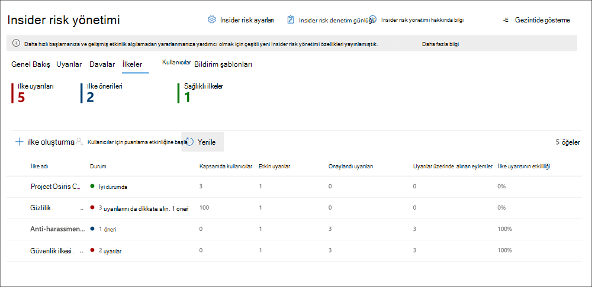

# <a name="insider-risk-management-policies"></a>Insider risk yönetimi ilkeleri

Insider risk yönetimi ilkeleri hangi kullanıcıların kapsam içinde olduğunu ve uyarılar için hangi tür risk göstergeleri yapılandırıldılarını belirler. Hızlı bir şekilde, tüm kuruluş kullanıcıları için geçerli olan bir ilke oluşturabilir veya bir ilkede yönetim için tek tek kullanıcıları veya grupları tanımlayabilirsiniz. İlkeler, birden çok veya belirli ilke koşullarına, Microsoft Teams sitelerine, SharePoint duyarlılık türlerine ve veri etiketlerine odaklanmak için içerik önceliklerini destekler. Şablonları kullanarak, belirli risk göstergeleri seçerek ilke göstergeleri için etkinlik eşiklerini özelleştirilebilir, risk puanlarını etkili bir şekilde özelleştirilebilir, uyarı düzeyini ve sıklığını özelleştirebilirsiniz. Buna ek olarak, risk puanı yüksek veya daha sıra dışı olan kullanıcı etkinliklerini belirlemeye yardımcı olur. İlke pencereleri, etkinlikleri uyarılara ilkeyi uygulamak için zaman dilimini tanımlamaya olanak sağlar ve ilkenin etkinleştirildikten sonra süresini belirlemek için kullanılır.

Yerleşik ilke [şablonlarıyla oluşturulan ilkelerin olası riskler](https://www.youtube.com/watch?v=kudK5ajZTUo) üzerinde hızlıca işlemde size nasıl yardımcı olduğunu genel bakış için Insider Risk Yönetimi İlkeleri Yapılandırma videosunu izleyin.

## <a name="policy-dashboard"></a>İlke panosu

**İlke panosu**, kurum ilkelerinizi, ilkenin durumunu hızla görmenizi, ilkeleri el ile ilkelere kullanıcı eklemenizi ve her ilkeyle ilişkili uyarıların durumunu görüntülemenizi sağlar.

- **İlke** adı: İlke sihirbazında ilkeye atanan addır.
- **Durum**: Her ilkenin durum durumu. İlke uyarılarının ve önerilerin sayısını veya sorun olmayan ilkeler için *Sağlıklı* durumu görüntüler.  Herhangi bir uyarı veya önerinin durum ayrıntılarını görmek için ilkeye tıkabilirsiniz.
- **Etkin uyarılar**: Her ilke için etkin uyarı sayısıdır.
- **Onaylandı** uyarıları: İlkeden son 365 gün içinde meydana gelen olaylarda toplam uyarı sayısı.
- **Uyarılar üzerinde alınan** eylemler: Son 365 gün için onaylanmış veya reddeden toplam uyarı sayısı.
- **İlke uyarısının** etkililiği: Uyarılarda edilen toplam eyleme bölünen onaylanmış toplam uyarılara göre belirlenen yüzde (geçen yıl içinde onaylanmış veya reddedilen uyarıların toplamıdır).



## <a name="policy-recommendations-from-analytics"></a>Analizlerden ilke önerileri

Insider risk analizi, insider risk ilkelerini yapılandırmadan, organizasyonumda olası insider risklerini değerlendirmenizi sağlar. Bu değerlendirme, kuruluşa daha yüksek kullanıcı riski olan olası alanları belirlemede yardımcı olabilir ve yapılandırmayı göz önünde bulundurarak göz önünde bulundurarak, insider risk yönetimi ilkelerinin türünü ve kapsamını belirlemeye yardımcı olabilir.

Insider risk analizi ve ilke önerileri hakkında daha fazla bilgi edinmek için bkz. [Insider risk yönetimi ayarları: Analiz](insider-risk-management-settings.md#analytics).

## <a name="policy-templates"></a>İlke şablonları

Insider risk yönetimi şablonları, ilkenin kullandığı risk göstergesi türlerini ve risk puanlama modelini tanımlayan, önceden tanımlanmış ilke koşullarıdır. İlke oluşturulmadan önce, her ilkenin ilke oluşturma sihirbazında atanmış bir şablonu olması gerekir. Insider risk yönetimi, her ilke şablonu için en çok beş ilkeyi destekler. İlke sihirbazıyla yeni bir Insider risk ilkesi  oluşturursanız, aşağıdaki ilke şablonlarından birini seçersiniz:

### <a name="data-theft-by-departing-users"></a>Ayrılan kullanıcılarla veri hırsızlığı

Kullanıcılar kuruluştan ayrıldıklarında, ayrılan kullanıcıların veri hırsızlığıyla ilişkili belirli risk göstergeleri vardır. Bu ilke şablonu, risk puanlama için exfiltration göstergeleri kullanır ve bu risk alanında algılama ve uyarılara odaklanır. Ayrılan kullanıcılardan ayrılan veri hırsızlığı, SharePoint Online'dan dosya indirmeyi, dosyaları yazdırmayı ve çalışma tarihleri ve bitiş tarihlerini yakın bulunan kişisel bulut mesajlaşma ve depolama hizmetlerine kopyalamayı kapsasa da olabilir. Microsoft 365 HR bağlayıcısını kullanarak veya Azure Active Directory'te kurum için kullanıcı hesabı silme işlemini otomatik olarak izleme seçeneği kullanılarak bu etkinliklerle ilgili risk göstergelerinin puanlama işlemi başlatılır ve bunların kullanıcı işe giriş durumuyla nasıl ilişkili olduğu.

> [!IMPORTANT]
> Bu şablonu kullanırken, Microsoft 365 ve fesih tarihi bilgilerini düzenli aralıklarla içeri aktaran bir İk bağlayıcısı yapılandırabilirsiniz. Microsoft 365 İk bağlayıcısını [kurum için](import-hr-data.md) yapılandırmaya yönelik adım adım kılavuz bilgiler için İk bağlayıcısı makalesine bakarak verileri içeri aktarın. İk bağlayıcısını kullanmama tercih ediyorsanız, ilke sihirbazında tetikleyici olaylarını yapılandırarak Azure AD'den silinen kullanıcı hesabı seçeneğini kullan gerekir.

### <a name="general-data-leaks"></a>Genel veri sızıntıları

Özellikle kullanıcılar, cihazlar ve hizmetler tarafından oluşturulan yeni verilerin hızlı bir şekilde büyümesi başta olmak üzere çoğu kuruluşta verileri korumak ve veri sızıntılarını önlemek zor bir sorundur. Kullanıcılar, giderek daha karmaşık ve zor veri sızıntılarını yönetmek için hizmetler ve cihazlar arasında bilgi oluşturma, depolama ve paylaşma gücü verir. Veri sızıntıları, yanlışlıkla kuruluş dışından bilgi ihlallerine veya kötü amaçlı veri hırsızlığına neden olabilir. Atanmış Veri Kaybı Önleme (DLP) ilkesi, yerleşik veya özelleştirilebilir tetikleyici etkinlikleriyle, bu şablon şüpheli SharePoint Çevrimiçi veri indirmeleri, dosya ve klasör paylaşımı, dosya yazdırma ve kişisel bulut mesajlaşma ve depolama hizmetlerine veri kopyalama ile ilgili gerçek zamanlı algılamaları puanlamaya başlar.

Veri *sızıntıları şablonu* kullanırken, kuruluşta yüksek önem düzeyi uyarıları için insider risk ilkesinde göstergeleri tetiklemek için bir DLP ilkesi atabilirsiniz. Bu şablonla oluşturulan ve yüksek önem düzeyi olan DLP ilkesi kuralı bir DLP ilke kuralı tarafından her Office 365, bu şablonla oluşturulan insider risk ilkeleri otomatik olarak yüksek önem düzeyi DLP uyarılarını inceler. Uyarı, Insider risk ilkesinde tanımlanmış kapsam içi bir kullanıcı içeriyorsa, uyarı insider risk ilkesi tarafından yeni bir uyarı olarak işlenir ve insider risk önem düzeyi ve risk puanı atanır. Ayrıca, seçilen göstergeleri bir ilke için olayları tetikleyen olarak atamayı da seçebilirsiniz. Bu esneklik ve özelleştirme, ilkenin kapsamını yalnızca göstergeler kapsamındaki etkinlikleri temel alar. Bu ilke, bu uyarıyı olay kapsamındaki diğer etkinliklerle bağlamda değerlendirmene olanak sağlar.

#### <a name="data-leaks-policy-guidelines"></a>Veri sızıntıları ilke yönergeleri

Insider risk yönetimi ilkeleriyle kullanmak üzere DLP ilkeleri oluştururken veya değiştirirken, aşağıdaki yönergeleri göz önünde bulundurarak:

- DLP ilkelerinize kural yapılandırdığınız zaman, veri exfiltasyonu  olaylarını önceliklendirme  ve Olay raporları ayarlarını Yüksek ayarına atarken seçmeli olun. Örneğin, hassas belgeleri bilinen bir rakipe e-postayla *gönderme,* Yüksek uyarı düzeyi bir exfiltasyonu olayı olabilir. Diğer DLP ilkesi kurallarında Olay raporları ayarlarında  Yüksek düzeyin fazla atan olması, insider risk yönetimi uyarı iş akışında gürültüyü artırabilir ve veri tahmincileri ile analistlerin bu uyarıları düzgün bir şekilde değerlendirmelerini zorlaştırabilir. Örneğin, DLP ilkelerinde *erişim* engelleme etkinliklerine erişmek için Yüksek uyarı düzeyleri atamak, gerçekten riskli kullanıcı davranışını ve etkinliklerini değerlendirmeyi daha zor hale getirdi.
- Tetikleyen olay olarak bir DLP ilkesi kullanırken, hem DLP hem de Insider risk yönetimi ilkeleri kapsamındaki kullanıcıları an bildiğinizden ve doğru şekilde yapılandırıldığından emin olun. Yalnızca Veri sızıntıları şablonunu kullanan Insider risk yönetimi ilkelerinin kapsamı içinde tanımlanan  kullanıcıların yüksek önem düzeyi DLP ilkesi uyarıları işlenir. Buna ek olarak, yalnızca yüksek önem düzeyi olan bir DLP uyarısı için kuralda kapsam içinde olarak tanımlanan kullanıcılar, Insider risk yönetimi ilkesi tarafından dikkate alınarak incelenecektir. Hem DLP hem de Insider risk ilkeleriniz içinde farkında olmadan kapsam içindeki kullanıcıları çakışan bir şekilde yapılandırmamanız önemlidir.

     Örneğin, DLP ilke kurallarınız yalnızca Satış Ekibi'nde yer alan kullanıcıları tanımıyorsa ve Veri sızıntıları şablonundan oluşturulan Insider risk  ilkesi tüm kullanıcıları kapsam içinde tanımlamışsa, Insider risk ilkesi aslında yalnızca Satış Ekibi'nde bulunan kullanıcılar için yüksek öneme sahip DLP uyarılarını işlemeyi sağlar. Insider risk ilkesi, bu örnekteki DLP kurallarında tanımlanmamış olan kullanıcıların işlemesi için yüksek öncelikli DLP uyarısı almaz. Buna karşılık, Veri sızıntıları şablonlarından oluşturulan Insider risk yönetimi  ilkeniz yalnızca Satış Ekibi'nde bulunan kullanıcıları kapsamıyorsa ve atanan DLP ilkesi tüm kullanıcılara kapsamında ise, insider risk ilkesi yalnızca Satış Ekibi üyeleri için yüksek öneme sahip DLP uyarılarını işleme akar. Insider risk yönetimi ilkesi, Satış Ekibi'nde yer almayacak tüm kullanıcılar için yüksek öneme sahip DLP uyarılarını yoksayacak.

- Bu Insider **risk yönetimi şablonu** için kullanılan DLP ilkesinde Olay raporları kuralı ayarının Yüksek önem düzeyi uyarıları için yapılandırıldığından emin olun. Yüksek *önem* düzeyi tetikleyen olaylar ve Insider risk yönetimi uyarıları, Düşük veya Orta olarak ayarlanmış Olay raporları alanıyla DLP ilkelerine yönelik kurallardan *oluşturulmaz*. 

    

     > [!NOTE]
     > Yerleşik şablonları kullanarak yeni bir DLP ilkesi oluştururken, Yüksek önem düzeyine yönelik Olay raporları ayarını yapılandırmak için Gelişmiş **DLP** kuralları oluştur veya özelleştir seçeneğini kullan'ı seçmeniz gerekir.

Veri sızıntıları şablonundan oluşturulan her Insider  risk yönetimi ilkesine, bu tetikleme olayı seçeneği kullanılırken yalnızca bir DLP ilkesi atanabilir. Veri sızıntıları şablonunu kullanan Insider risk ilkeleri için algılamak ve tetikleyen eylemler olarak kullanmak istediğiniz farklı etkinlikleri birleştiren, adanmış bir DLP **ilkesi oluşturmayı** göz önünde bulundurabilirsiniz.

DLP [ilkelerini yapılandırmayla ilgili adım](create-test-tune-dlp-policy.md) adım kılavuz için DLP ilkesi oluşturma, test ve ayarlama makalesine bakın.

### <a name="data-leaks-by-priority-users-preview"></a>Öncelik kullanıcıların veri sızıntıları (önizleme)

Verileri koruma ve kuruluşta kullanıcıların veri sızıntılarını önleme, hassas bilgilere erişim düzeyi veya risk geçmişine bağlı olabilir. Veri sızıntıları, yanlışlıkla kuruluş dışından çok hassas bilgilerin ortaya konulma veya kötü amaçlı veri hırsızlığını içerebilir. Etkinlik seçeneğini tetikleyen bir atanmış Veri Kaybı Önleme (DLP) ilkesiyle, bu şablon şüpheli etkinliğin gerçek zamanlı algılanmasına başlar ve daha yüksek önem düzeyine sahip insider risk uyarılarının ve uyarılarının olasılığının artmasına yol açabilir. Öncelikli kullanıcılar, Insider risk [yönetimi](insider-risk-management-settings.md#priority-user-groups-preview) ayarları alanında yapılandırılmış öncelik kullanıcı gruplarında tanımlanır.

Genel veri **sızıntıları şablonunda** olduğu gibi, bir DLP ilkesi de seçebilir ve insider risk ilkesinde kurum içinde yüksek önem düzeyi uyarıları için göstergeleri tetiklersiniz. Bu şablonu kullanırken DLP seçeneğiyle bir ilke oluştururken DLP ilkeleri için Veri sızıntıları ilke yönergelerini izleyin. Ayrıca, seçilen göstergeleri bir ilke için olayları tetikleyen olarak atamayı da seçebilirsiniz. Bu esneklik ve özelleştirme, ilkenin kapsamını yalnızca göstergelerin kapta olduğu etkinliklerin kapsamına yardımcı olur. Buna ek olarak, **Insider risk** >  yönetiminde oluşturulan öncelik kullanıcı grupları **atamalı Ayarlar** >  **Firyata kullanıcı grupları** ilkeye atanmaktadır.

### <a name="data-leaks-by-disgruntled-users-preview"></a>Göz korkutucu kullanıcıların veri sızıntıları (önizleme)

Kullanıcılar işe alma stresi yaşarsa, bunlar göz korkutucu olabilir ve bu da insider risk etkinliğinin artmasına neden olabilir. Bu şablon, disgruntlement ile ilişkilendirilmiş bir gösterge tanımsız olarak kullanıcı etkinliğini puanlamaya başlar. Örnek olarak performans geliştirme bildirimleri, düşük performans değerlendirmeleri veya iş düzeyindeki durum değişiklikleri örnek olarak verilmiştir. Korkutucu kullanıcılar için veri sızıntıları, çalışma stresi veya etkinliklerinin yanında SharePoint Online'dan dosya indirmeyi ve kişisel bulut mesajlaşması ve depolama hizmetlerine veri kopyalamayı içerebilir.

Bu şablonu kullanırken, düzenli aralıklarla performans geliştirme bildirimleri, düşük performans değerlendirme durumu veya Microsoft 365 düzeyi değişiklik bilgilerini içeri aktaran bir Microsoft 365 İk bağlayıcısı da yapılandırmanız gerekir. Microsoft 365 İk bağlayıcısını [kurum için](import-hr-data.md) yapılandırmaya yönelik adım adım kılavuz bilgiler için İk bağlayıcısı makalesine bakarak verileri içeri aktarın.

### <a name="general-security-policy-violations-preview"></a>Genel güvenlik ilkesi ihlalleri (önizleme)

Birçok kuruluşta, kullanıcıların cihazlarına yazılım yükleme veya görevlerine yardımcı olmak için cihaz ayarlarını değiştirme izni vardır. Kullanıcılar yanlışlıkla veya kötü amaçlı amaçlı yazılımlar yükleyebilir ya da cihazlarında ya da ağ kaynaklarınıza bilgi korumaya yardımcı olan önemli güvenlik özelliklerini devre dışı bırakabilirsiniz. Bu ilke şablonu, bu etkinlikleri puanlamaya başlamak ve bu risk alanına yönelik odak algılama ve uyarılar almak üzere Uç Nokta için Microsoft Defender'dan gelen güvenlik uyarılarını kullanır. Kullanıcıların güvenlik ilkesi ihlallerinin geçmişine sahip olduğu ve insider riskinin göstergesi olacak senaryolarda güvenlik ilkesi ihlallerine karşı içgörüler sağlamak için bu şablonu kullanın.

Güvenlik ihlal uyarılarını içeri aktaracak Defender Güvenlik Merkezi'nde Insider risk yönetimi tümleştirmesi için, kuruluşta Uç Nokta için Microsoft Defender For Endpoint'ı yapılandırmanız ve Insider risk yönetimi tümleştirmesi için Uç Nokta için Defender'ı etkinleştirmeniz gerekir. Insider risk yönetimi tümleştirmesi için Uç Nokta için Defender'ı yapılandırma hakkında daha fazla bilgi için bkz. Uç Nokta için [Defender'da gelişmiş özellikleri yapılandırma](/windows/security/threat-protection/microsoft-defender-atp/advanced-features#share-endpoint-alerts-with-microsoft-compliance-center).

### <a name="general-patient-data-misuse-preview"></a>Genel hasta verileri yanlış kullanımı (önizleme)

Sağlık kaydı verilerini korumak ve hasta kişisel verilerin yanlış kullanımını önlemek, sağlık sektörü kuruluşları için önemli bir sorundur. Bu kötüye kullanım, yetkisiz kişiler için gizli veri sızıntıları, hasta kayıtlarının sahte olarak değiştirilmesi veya hasta sağlık kayıtlarının çalınma durumlarını içerebilir. Kullanıcılar tarafından farkındalık, ihmal veya sahtekarlık olmamasından dolayı hasta verileri yanlış kullanımını önlemek, Sağlık Sigortası Taşınabilirlik ve Sorumluluk Yasası (HIPAA) ve Ekonomik ve Klinik Sağlık (HITECH) Yasası'nın yasal gereksinimlerini karşılamada da önemli bir bileşendir. Bu eylemlerin her ikisi de hasta korumalı sistem durumu bilgilerini (PHI) korumak için gereksinimleri sağlar.

Bu ilke şablonu, mevcut elektronik tıbbi kayıt (EMR) sistemlerinde barındırılan kayıtlarla ilişkilendirilmiş şüpheli etkinlikleri algılayan iç kullanıcılar için risk puanlamalarına olanak sağlar. Algılama hasta verilerine yetkisiz erişim, görüntüleme, değiştirme ve dışarı aktarma üzerinde odaklanıyor. EMR sisteminiz içinde erişim, eksfiltre veya obfuscation etkinlikleri algılamayı desteklemek için bir bağlayıcı yapılandırmanız gerekir ( [Microsoft Healthcare](import-healthcare-data.md) bağlayıcısı veya [Destansı](import-epic-data.md) bağlayıcısı).

Bu şablonu kullanırken, kuruluş profili verilerini Microsoft 365 için düzenli aralıklarla kuruluş profili verilerini içeri aktaran bir İk bağlayıcısı da yapılandırmanız gerekir. Organizasyon için İk bağlayıcısı bağlayıcısını yapılandırmaya yönelik adım adım kılavuz bilgiler için İk bağlayıcısı makalesine Microsoft 365 verileri içeri aktarma makalesine bakın.

### <a name="security-policy-violations-by-departing-users-preview"></a>Ayrılan kullanıcılarla güvenlik ilkesi ihlalleri (önizleme)

Pozitif veya negatif terimlerle ayrılan kullanıcılar, güvenlik ilkesi ihlalleri açısından daha yüksek riskler olabilir. Ayrılan kullanıcılar için yanlışlıkla veya kötü amaçlı güvenlik ihlallerine karşı korunmaya yardımcı olmak amacıyla, bu ilke şablonu güvenlikle ilgili etkinliklerle ilgili öngörüler sağlamak amacıyla Uç Nokta için Defender uyarılarını kullanır. Bu etkinlikler, kötü amaçlı yazılım veya diğer zararlı olabilecek uygulamaları yükleyerek ve cihazlarında güvenlik özelliklerini devre dışı bırakmayı içerir. [Microsoft 365 İk](import-hr-data.md) bağlayıcısını veya kuruluşu için Azure Active Directory'te kullanıcı hesabı silme işlemini otomatik olarak izleme seçeneğini kullanarak bu güvenlik etkinlikleriyle ilgili risk göstergelerinin puanlama işlemi başlatılır ve bunların kullanıcı işe giriş durumuyla nasıl ilişkili olduğu.

Güvenlik ihlal uyarılarını içeri aktaracak Defender Güvenlik Merkezi'nde Insider risk yönetimi tümleştirmesi için, kuruluşta Uç Nokta için Microsoft Defender For Endpoint'ı yapılandırmanız ve Insider risk yönetimi tümleştirmesi için Uç Nokta için Defender'ı etkinleştirmeniz gerekir. Insider risk yönetimi tümleştirmesi için Uç Nokta için Defender'ı yapılandırma hakkında daha fazla bilgi için bkz. Uç Nokta için [Defender'da gelişmiş özellikleri yapılandırma](/windows/security/threat-protection/microsoft-defender-atp/advanced-features#share-endpoint-alerts-with-microsoft-compliance-center).

### <a name="security-policy-violations-by-priority-users-preview"></a>Öncelik kullanıcıların güvenlik ilkesi ihlalleri (önizleme)

Kuruluşların kullanıcıların güvenlik ihlallerine karşı korunması, hassas bilgilere konumu, erişim düzeyi veya risk geçmişine bağlı olabilir. Öncelik kullanıcılarının güvenlik ihlalleri nedeniyle, bu ilke şablonu bu göstergeleri puanlamaya başlar ve bu kullanıcılara güvenlikle ilgili etkinlikler hakkında öngörüler sağlamak için Uç Nokta için Microsoft Defender uyarılarını kullanır. Bu etkinlikler, kötü amaçlı yazılım veya diğer zararlı olabilecek uygulamaları yükleyerek ve cihazlarında güvenlik özelliklerini devre dışı bırakma önceliğini yitiren kullanıcıları içerebilir. Öncelikli kullanıcılar, Insider risk yönetimi ayarları alanında yapılandırılmış öncelik kullanıcı gruplarında tanımlanır.

Güvenlik ihlal uyarılarını içeri aktaracak Defender Güvenlik Merkezi'nde Insider risk yönetimi tümleştirmesi için, kuruluşta Uç Nokta için Microsoft Defender For Endpoint'ı yapılandırmanız ve Insider risk yönetimi tümleştirmesi için Uç Nokta için Defender'ı etkinleştirmeniz gerekir. Insider risk yönetimi tümleştirmesi için Uç Nokta için Defender'ı yapılandırma hakkında daha fazla bilgi için bkz. Uç Nokta için [Defender'da gelişmiş özellikleri yapılandırma](/windows/security/threat-protection/microsoft-defender-atp/advanced-features#share-endpoint-alerts-with-microsoft-compliance-center). Buna ek olarak, **Insider risk** >  yönetiminde oluşturulan öncelik kullanıcı grupları **atamalı Ayarlar** >  **Firyata kullanıcı grupları** ilkeye atanmaktadır.

### <a name="security-policy-violations-by-disgruntled-users-preview"></a>Korkutucu kullanıcıların güvenlik ilkesi ihlalleri (önizleme)

Çalışma stresine neden olan kullanıcılar, yanlışlıkla veya kötü amaçlı güvenlik ilkesi ihlalleri nedeniyle daha yüksek risk altında olabilir. Bu stres, kullanıcının bir performans geliştirme planına yerleştirilme, düşük performans değerlendirme durumu veya geçerli konumundan indirilme konularını içerebilir. Bu ilke şablonu, bu kullanıcılar için bu etkinliklerle ilişkili bu göstergelere ve etkinliklere dayalı olarak risk puanlama başlatır.

Bu şablonu kullanırken, düzenli aralıklarla performans geliştirme bildirimleri, düşük performans değerlendirme durumu veya Microsoft 365 düzeyi değişiklik bilgilerini içeri aktaran bir Microsoft 365 İk bağlayıcısı da yapılandırmanız gerekir. Microsoft 365 İk bağlayıcısını [kurum için](import-hr-data.md) yapılandırmaya yönelik adım adım kılavuz bilgiler için İk bağlayıcısı makalesine bakarak verileri içeri aktarın.

Ayrıca, kuruluşta uç nokta için Microsoft Defender'ın yapılandırılmış ve güvenlik ihlal uyarılarını içeri aktaracak Defender Güvenlik Merkezi'nde Insider risk yönetimi tümleştirmesi için Uç Nokta için Defender'ı etkinleştirmeniz gerekir. Insider risk yönetimi tümleştirmesi için Uç Nokta için Defender'ı yapılandırma hakkında daha fazla bilgi için bkz. Uç Nokta için [Defender'da gelişmiş özellikleri yapılandırma](/windows/security/threat-protection/microsoft-defender-atp/advanced-features#share-endpoint-alerts-with-microsoft-compliance-center).

### <a name="policy-template-prerequisites-and-triggering-events"></a>İlke şablonu önkoşulları ve olayları tetikleme

Insider risk yönetimi ilkesi için seçtiğiniz şablona bağlı olarak, tetikleyen olaylar ve ilke önkoşulları değişiklik gösterir. Olayları tetiklemek, kullanıcının bir Insider risk yönetimi ilkesi için etkin olup olmadığını belirleyen önkoşullarıdır. Kullanıcı insider risk yönetimi ilkesine eklenirse ancak kullanıcının tetikleyici olayı yoksa, kullanıcılar panosuna el ile eklenmedikçe kullanıcı etkinliği ilke tarafından değerlendirilmez. İlke önkoşulları gerekli öğelerdir; böylelikle ilke, riski değerlendirmek için gerekli sinyal veya etkinlikleri alır.

Aşağıdaki tabloda, her Insider risk yönetimi ilkesi şablonundan oluşturulan ilkeler için tetiklenen olaylar ve önkoşullar listelenir:

| **İlke şablonu** | **İlkeler için olayları tetikleme** | **Önkoşullar** |
| :------------------ | :--------------------------------- | :---------------- |
| **Ayrılan kullanıcılarla veri hırsızlığı** | İk bağlayıcısının veya hesap silme işleminin Azure Active Directory tarihi göstergesi | (isteğe bağlı) Microsoft 365 ve tarih göstergeleri için yapılandırılmış İk bağlayıcısı |
| **Genel veri sızıntıları** | Yüksek önem düzeyi uyarısı veya *yerleşik exfiltration* olayı tetikleyen veri sızıntı ilke etkinliği | Yüksek önem düzeyi uyarıları için *yapılandırılmış* DLP ilkesi <br><br> VEYA <br><br> Özelleştirilmiş tetikleyici göstergeleri |
| **Öncelikli kullanıcıların veri sızıntıları** | Yüksek önem düzeyi uyarısı veya *yerleşik exfiltration* olayı tetikleyen veri sızıntı ilke etkinliği | Yüksek önem düzeyi uyarıları için *yapılandırılmış* DLP ilkesi <br><br> VEYA <br><br> Özelleştirilmiş tetikleyici göstergeleri <br><br> Insider risk ayarlarında yapılandırılmış öncelik kullanıcı grupları |
| **Göz korkutucu kullanıcıların veri sızıntıları** | İk bağlayıcısı performans iyileştirmesi, kötü performans veya iş düzeyi değişim göstergeleri | Microsoft 365 göstergeleri için yapılandırılmış bir İk bağlayıcısı |
| **Genel güvenlik ilkesi ihlalleri** | Uç Nokta için Microsoft Defender tarafından algılanan güvenlik denetimlerinin veya istenmeyen yazılımların savunması | Uç nokta aboneliği için Active Microsoft Defender <br><br> Yapılandırılmış kimlikle Uç Nokta tümleştirmesi Microsoft 365 uyumluluk merkezi Microsoft Defender |
| **Genel hasta verileri yanlış kullanımı** | EMR sistemlerinden güvenlik denetimlerinin savunulun <br><br> İk sistemlerinden kullanıcı ve hasta adresi eşleştirme göstergeleri | İlke veya insider risk ayarlarında seçilen sağlık erişimi göstergeleri <br><br> Microsoft 365 eşleştirmesi için yapılandırılmış bir İk bağlayıcısı <br><br> Yapılandırılmış Microsoft Healthcare veya Destansı bağlayıcısı |
| **Ayrılan kullanıcılarla güvenlik ilkesi ihlalleri** | İk bağlayıcısı veya hesap silme işlemiyle ilgili Azure Active Directory tarihi göstergeleri | (isteğe bağlı) Microsoft 365 ve tarih göstergeleri için yapılandırılmış İk bağlayıcısı <br><br> Uç nokta aboneliği için Active Microsoft Defender <br><br> Yapılandırılmış kimlikle Uç Nokta tümleştirmesi Microsoft 365 uyumluluk merkezi Microsoft Defender |
| **Öncelikli kullanıcıların güvenlik ilkesi ihlalleri** | Uç Nokta için Microsoft Defender tarafından algılanan güvenlik denetimlerinin veya istenmeyen yazılımların savunması | Uç nokta aboneliği için Active Microsoft Defender <br><br> Yapılandırılmış kimlikle Uç Nokta tümleştirmesi Microsoft 365 uyumluluk merkezi Microsoft Defender <br><br> Insider risk ayarlarında yapılandırılmış öncelik kullanıcı grupları |
| **Korkutucu kullanıcının güvenlik ilkesi ihlalleri** | İk bağlayıcısı performans iyileştirmesi, kötü performans veya iş düzeyi değişim göstergeleri | Microsoft 365 göstergeleri için yapılandırılmış bir İk bağlayıcısı <br><br> Uç nokta aboneliği için Active Microsoft Defender <br><br> Yapılandırılmış kimlikle Uç Nokta tümleştirmesi Microsoft 365 uyumluluk merkezi Microsoft Defender |

## <a name="prioritize-content-in-policies"></a>İlkelerde içeriğe öncelik belirleme

Insider risk yönetimi ilkeleri, içeriğin nerede depolandığına veya nasıl sınıflandırıl bulunduğuna bağlı olarak daha yüksek öncelik belirtmeyi destekler. İçeriği öncelik olarak belirtmek ilişkili etkinlikler için risk puanını artırır ve bu da yüksek önem düzeyi uyarısı oluşturma ihtimalini artırır. Bununla birlikte, ilgili içerik yerleşik veya özel hassas bilgi türleri içerdiği veya ilkede öncelik olarak belirlendiği sürece bazı etkinlikler uyarı oluşturmaz.

Örneğin, çok gizli bir SharePoint için SharePoint siteniz vardır. Bu sitenin bilgi sızıntıları SharePoint projenin güvenliğini tehlikeye atarak başarısını önemli ölçüde etkiler. Bir Veri sızıntıları SharePoint bu sitenin önceliklerini belirlemekle, uygun etkinlikler için risk puanları otomatik olarak artırılır. Bu önceliklendirme, bu etkinliklerin insider risk uyarısı oluşturma olasılığını artırır ve uyarının önem düzeyini artırır.

İlke sihirbazında bir Insider risk yönetimi ilkesi seniz, aşağıdaki önceliklerden birini seçebilirsiniz:

- **SharePoint:** Tanımlı veya farklı sitelerde tüm dosya türleriyle SharePoint daha yüksek bir risk puanı atanır. İlkeyi yapılandıran ve öncelik Share Point sitelerini seçen kullanıcılar SharePoint erişim iznine sahip olduğu siteleri de işaretlerinin seçnayebilirsiniz. SharePoint siteleri geçerli kullanıcı tarafından ilkede seçim için kullanılamıyorsa, gerekli izinlere sahip olan başka bir kullanıcı daha ilkenin sitelerini daha sonra seçerek sitelere erişmesi veya geçerli kullanıcıya gerekli sitelere erişim verilmesi gerekir.
- **Hassas bilgi türleri**: Hassas bilgi türleri içeren [içerikle ilişkilendirilmiş tüm](sensitive-information-type-entity-definitions.md) etkinliklere daha yüksek risk puanı atanır.
- **Duyarlılık etiketleri**: Belirli duyarlılık etiketlerinin uygulandığı [içerikle ilişkilendirilmiş tüm](sensitivity-labels.md) etkinliklere daha yüksek risk puanı atanır.

## <a name="sequence-detection-preview"></a>Sıralı algılama (önizleme)

Riskli etkinlikler yalıtılmış olaylar olarak oluşmaz. Bu riskler genellikle daha büyük bir olay dizisinin parçası olur. Sıralı, yükseltilmiş bir risk öneren, iki veya daha fazla kullanıcı etkinliklerinden oluşur. Bu ilgili etkinliklerin belirlenmesi, genel riski değerlendirmenin önemli bir parçasıdır. Veri hırsızlığı veya veri sızıntıları ilkeleri için sıralı algılama etkinleştirildiğinde, sıralı bilgi etkinlikleriyle ilgili içgörüler, insider risk yönetimi olayı içindeki Kullanıcı etkinliği sekmesinde görüntülenir. Aşağıdaki ilke şablonları sıralı algılamayı destekler:

- Ayrılan kullanıcılarla veri hırsızlığı
- Genel veri sızıntıları
- Öncelikli kullanıcıların veri sızıntıları
- Göz korkutucu kullanıcıların veri sızıntıları

Bu Insider risk yönetimi ilkeleri, her adımı bir risk sırasına göre algılamak için belirli göstergeleri ve onların izleme sırasını kullanabilir. Dosya adları, etkinlikleri bir diziyle eşlerken kullanılır. Bu riskler dört ana etkinlik kategorisine ayrılır:

- **Koleksiyon**: Bu kategori, kapsam dışı ilke kullanıcıları tarafından indirme etkinliklerine odaklanmanın sinyalini verir. Bu kategorideki örnek bir etkinlik, site sitelerinden dosya SharePoint olabilir.
- **Exfiltration**: Bu kategori, kapsam içi ilke kullanıcıları tarafından iç ve dış kaynaklara paylaşım ve ayıklama etkinliklerine odaklanmayı sağlar. Bu kategorideki örnek bir etkinlik, ekleri olan e-postaları kuruluştan dış alıcılara gönderiyor olabilir.
- **Obfuscation**: Bu kategori, kapsam dışı ilke kullanıcıları tarafından riskli etkinliklerin maskeleme odağına işaret eder. Bu kategorideki örnek bir etkinlik bir cihaza dosyaları yeniden adı alıyor olabilir.
- **Temizleme: Bu** kategori, kapsam dışı ilke kullanıcıları tarafından yapılan silme etkinliklerine odaklanmanın sinyalini verir. Bu kategorideki örnek bir etkinlik bir cihazdan dosya s alıyor olabilir.

> [!NOTE]
> Sıralı algılama, insider risk yönetimi genel ayarlarında etkinleştirilmiş göstergeleri ve bir ilkede seçilen göstergeleri kullanır. Uygun göstergeler seçilmezse, sıralı algılama çalışmaz.

İlke içinde yapılandırıldığında her bir sıralı algılama türü için tek tek eşik ayarlarını özelleştirebilirsiniz. Bu eşik ayarları, uyarıları diziyle ilişkilendirilmiş dosyaların ses düzeyine göre ayarlar.

Kullanıcı etkinliği görünümünde sıralı algılama yönetimi hakkında daha fazla **bilgi** edinmek için bkz. [Insider risk yönetimi örnekleri: Kullanıcı etkinliği](insider-risk-management-cases.md#user-activity).

## <a name="cumulative-exfiltration-detection-preview"></a>Kümülatif filtreleme algılama (önizleme)

Insider risk göstergeleri, Insider risk ilkeleri kapsamında yer alan kullanıcılar için günlük olarak değerlendirilen sıra dışı risk etkinlikleri düzeylerini belirlemeye yardımcı olur. Kümülatif filtreleme algılaması, kullanıcı sızıntı etkinliklerinin zaman içinde veya birden fazla sızıntı etkinlik türü üzerinden ölçülerek kuruluş ortalamalarını ne zaman aşacaklarını saptamanıza yardımcı olmak için makine öğrenme modellerini kullanır. Insider risk yönetimi analistleri ve tahminler normalde uyarı oluşturmayan ancak kuruluşları için tipik olan durumların üzerinde olan sızıntı etkinliklerini belirlemeye yardımcı olmak için kümülatif sızıntı algılama içgörüleri kullanabilir. Bazı örnekler, kullanıcılardan birkaç gün boyunca yavaşça veri ayrılan veya kullanıcılarda verileri kuruluşta veri paylaşımı için normalden daha fazla kanalda tekrar tekrar paylaşmaya neden olabilir.

Aşağıdaki ilke şablonları kullanılırken kümülatif sızıntı algılaması varsayılan olarak etkinleştirilir:

- Ayrılan kullanıcılarla veri hırsızlığı
- Genel veri sızıntıları
- Öncelikli kullanıcıların veri sızıntıları
- Göz korkutucu kullanıcıların veri sızıntıları

> [!NOTE]
> Kümülatif filtreleme algılaması, ilkede seçilen Insider risk yönetimi ve exfiltration göstergeleri için genel ayarlarda etkinleştirilen exfiltration göstergelerini kullanır. Bu nedenle, kümülatif exfiltration algılaması yalnızca gerekli filtreleme göstergeleri için değerlendirilir. Öncelik içeriğinde yapılandırılmış duyarlılık [etiketleri için kümülatif](sensitivity-labels.md) filtreleme etkinlikleri daha yüksek risk puanları üretir.

Veri hırsızlığı veya veri sızıntı ilkelerinden toplu filtreleme algılaması etkinleştirildiğinde, bir Insider risk yönetimi olayı içindeki Kullanıcı etkinliği sekmesinde kümülatif  filtreleme etkinlikleriyle ilgili içgörüler görüntülenir.

Kullanıcı etkinliği yönetimi hakkında daha fazla bilgi edinmek için [bkz. Insider risk yönetimi örnekleri: Kullanıcı etkinlikleri](insider-risk-management-cases.md#user-activity).

## <a name="policy-health"></a>İlke durumu

İlke durumu, insider risk yönetimi ilkelerinizin olası sorunlarına ilişkin içgörüler sağlar. İlkeler sekmesindeki Durum sütunu, kullanıcı etkinliğinin bildirlsini engelleyen ilkeler hakkında sizi veya etkinlik uyarılarının sayısının alışılmamış olmasıyla ilgili olarak sizi uyarabilirsiniz. İlke durumu, ilkenin durumunun iyi durumda olduğunu ve dikkat veya yapılandırma değişikliklerine gerek olmadığını da onaylayabilir.

Bir ilkeyle ilgili sorunlar varsa, ilke durumu durumu bildirim uyarıları ve ilke sorunlarını çözmeye yardımcı olacak öneriler görüntüler. Bu bildirimler aşağıdaki sorunları çözmenize yardımcı olabilir:

- Tamamlanmamış yapılandırmaya sahip ilkeler. Bu sorunlar, ilkede eksik kullanıcıları veya grupları ya da eksik ilke yapılandırma adımlarını içerebilir.
- Gösterge yapılandırma sorunları olan ilkeler. Göstergeler, her ilkenin önemli bir parçasıdır. Göstergeler yapılandırılmazsa veya çok az gösterge seçilirse, ilke riskli etkinlikleri beklendiği gibi değerlendirmez.
- İlke tetikleyicileri çalışmıyor veya ilke tetikleyicisi gereksinimleri düzgün yapılandırılmamış. İlkenin işlevselliği, ilkede yer alan kullanıcılara risk puanı atamalarını etkinleştirmek için tetiklenen olayları etkili bir şekilde algılayan diğer hizmetlere veya yapılandırma gereksinimlerine bağlı olabilir. Bu bağımlılıklar bağlayıcı yapılandırmasıyla ilgili sorunları, Uç nokta uyarı paylaşımı için Microsoft Defender'ı veya veri kaybını önleme ilke yapılandırma ayarlarını içerebilir.
- Birim sınırları yaklaşıyor veya sınırların üzerinde. Insider risk yönetimi ilkeleri, risk Microsoft 365 sinyallerini toplamak için çok sayıda kullanıcı hizmeti ve uç noktası kullanır. İlkelerinize kullanıcıların sayısına bağlı olarak, hacim sınırları risk etkinliklerinin tanımlanmasını ve bildirini geciktirebilir. Bu sınırlar hakkında daha fazla bilgi edinmek için bu makalenin İlke şablonu sınırları bölümünde bulabilirsiniz.

Bir ilkenin sistem durumunu hızla görüntülemek için İlke sekmesine ve Durum sütununa gidin. Her ilke için aşağıdaki ilke durumu durumu seçeneklerini burada görüyorsunuz:

- Sağlıklı: İlkeyle ilgili hiçbir sorun tanımlandı.
- Öneriler: İlkeyle ilgili olarak, ilkenin beklendiği gibi çalışmasını engelleyen bazı sorunlar vardır.
- Uyarılar: Riskli etkinliklerin belirlenmesini önleyen ilkede sorunlar vardır.

Öneriler veya uyarılar hakkında daha fazla ayrıntı için, İlke sekmesinde **bir ilke** seçerek ilke ayrıntıları kartını açın. Öneriler ve uyarılar hakkında daha fazla bilgi (bu sorunları nasıl ele amayacak da dahil) ayrıntılar kartının Bildirimler bölümünde görüntülenir.


### <a name="notification-messages"></a>Bildirim iletileri

Olası sorunları çözmek için öneriler ve uyarı bildirimleri ve eylemleri hakkında daha fazla bilgi edinmek için aşağıdaki tabloyu kullanın.

|**Bildirim iletileri**|**İlke şablonları**|**Düzeltme nedenleri / Bu eylemi deneyin**|
|:------------------------|:-------------------|:---------------------------|
| İlke, etkinlik için risk puanları ataymıyor | Tüm ilke şablonları | İlkenizin kapsamını gözden geçirmek ve etkinlik yapılandırmasını tetiklemek, böylelikle ilkenin etkinliğe risk puanları ataması <br><br> 1. İlke için seçilen kullanıcıları gözden geçirme. Seçili birkaç kullanıcınız varsa, başka kullanıcılar da seçmek istiyor olabilir. <br> 2. İk bağlayıcısı kullanıyorsanız, İk bağlayıcınız doğru verileri gönderdiğini kontrol edin. <br> 3. Tetikleyen olayınız olarak bir DLP ilkesi kullanıyorsanız, DLP ilkesi yapılandırmanızı kontrol edin ve ilkenin bu ilkede kullanılacak şekilde yapılandırıldığından emin olur. <br> 4. Güvenlik ihlal ilkeleri için, Insider risk ayarlarında veya Akıllı algılamalarda seçilen Uç nokta uyarı değerlendirme > gözden geçirebilirsiniz. Uyarı filtresinin fazla dar olmadığını onaylayın. |
| İlke herhangi bir uyarı oluşturmadı | Tüm ilke şablonları | Sizin için önemli olan etkinliği puanlamada analiz etmek için ilke yapılandırmanızı gözden geçirmek iyi olabilir. <br><br> 1. Puan almak istediğiniz göstergeleri seçtiğinizi onaylayın. Ne kadar çok gösterge seçilirse, risk puanları da o kadar çok etkinlik atanır. <br> 2. İlke için eşik özelleştirmesini gözden geçirme. Seçilen eşikler, kuruluşun risk dayanıklılığına uygun hizalanmazsa, seçimleri uyarılar tercih edilen eşiklere göre oluşturulacak şekilde ayarlayın. <br> 3. İlke için seçilen kullanıcıları ve grupları gözden geçirme. Uygun kullanıcı ve grupların hepsini seçtiğinizi onaylayın. <br> 4. Güvenlik ihlal ilkeleri için, ayarlarda Akıllı Algılamalarda Uç Nokta Uyarıları için Microsoft Defender uyarısı almak istediğiniz uyarı üç durum bilgisini seçtiğinizi onaylayın.|
| Bu ilkeye hiçbir kullanıcı veya grup dahil değildir | Tüm ilke şablonları | Kullanıcılar veya gruplar ilkeye atanmaz. <br><br> İlkenizi düzenleyin ve ilke için kullanıcıları veya grupları seçin. |
| Bu ilke için hiçbir gösterge seçilmemiş | Tüm ilke şablonları | İlke için göstergeler seçilmedi <br><br> İlkenizi düzenleyin ve ilke için uygun ilke göstergelerini seçin. |
| Bu ilkeye öncelik kullanıcı grubu dahil değildir | - Öncelikli kullanıcılar tarafından veri sızıntıları <br> - Öncelik kullanıcılarına göre güvenlik ilkesi ihlalleri | Öncelik kullanıcı grupları ilkeye atanmaz. <br><br> Insider risk yönetimi ayarlarında öncelik kullanıcı gruplarını yapılandırma ve ilkeye öncelik kullanıcı grupları atama. |
| Bu ilke için herhangi bir tetikleyici olayı seçilmedi | Tüm ilke şablonları | İlke için tetikleyici olayı yapılandırılmadı <br><br> Siz ilkeyi düzenleyene ve bir tetikleyici olayı seçene kadar, risk puanları kullanıcı etkinliklerine atanmaz. |
| İk bağlayıcısı beklendiği gibi yapılandırılmadı veya çalışmıyor | - Kullanıcıdan ayrılarak veri hırsızlığı <br> - Ayrılan kullanıcıyla güvenlik ilkesi ihlalleri <br> - Göz korkutucu kullanıcıların veri sızıntıları <br> - Göz korkutucu kullanıcıların güvenlik ilkesi ihlalleri | İk bağlayıcısı ile ilgili bir sorun var. <br><br> 1. İk bağlayıcısı kullanıyorsanız İk bağlayıcının doğru veriler gönderdiğini denetleyin <br><br> VEYA <br><br> 2. Silinmiş Azure AD hesabını tetikleyen olayı seçin. |
| Cihaz eklemedi | - Ayrılan kullanıcılarla veri hırsızlığı <br> - Genel veri sızıntıları <br> - Göz korkutucu kullanıcıların veri sızıntıları <br> - Öncelikli kullanıcıların Veri Sızıntıları | Cihaz göstergeleri seçilidir, ancak cihaza herhangi bir cihaz Microsoft 365 <br><br> Cihazların yerleşik olup olmadığını ve gereksinimlerini karşılamıyor olup olmadığını kontrol edin. |
| İk bağlayıcısı son zamanlarda verileri karşıya yüklemedi | - Kullanıcıdan ayrılarak veri hırsızlığı <br> - Ayrılan kullanıcıyla güvenlik ilkesi ihlalleri <br> - Göz korkutucu kullanıcıların veri sızıntıları <br> - Göz korkutucu kullanıcıların güvenlik ilkesi ihlalleri | İk bağlayıcısı 7 gündür verileri içe aktaramıyor. <br><br> İk bağlayıcının doğru yapılandırıldığından ve veri göndererek denetleyin. |
| İk bağlayıcının durumunu şu anda kontrol etmek mümkün değil, lütfen daha sonra tekrar kontrol edin | - Kullanıcıdan ayrılarak veri hırsızlığı <br> - Ayrılan kullanıcıyla güvenlik ilkesi ihlalleri <br> - Göz korkutucu kullanıcıların veri sızıntıları <br> - Göz korkutucu kullanıcıların güvenlik ilkesi ihlalleri | Insider risk yönetimi çözümü İk bağlayıcının durumunu kontrol yapamaz. <br><br> İk bağlayıcının doğru yapılandırıldığından ve veri göndererek yapılandırıldığından emin olun veya geri dönüp ilke durumunu denetleyin.  |
| DLP ilkesi tetikleyen olay olarak seçili değil | - Genel Veri sızıntıları <br> - Öncelikli kullanıcılar tarafından veri sızıntıları | Bir DLP ilkesi tetikleyici olayı olarak seçilmemiş veya seçili DLP ilkesi silinmiştir. <br><br> İlkeyi düzenleyin ve etkin bir DLP ilkesi seçin veya ilke yapılandırmasında tetiklenen olay olarak 'Kullanıcı bir exfiltration etkinliği gerçekleştirir'. |
| Bu ilkede kullanılan DLP ilkesi kapalı | - Genel Veri sızıntıları <br> - Öncelikli kullanıcılar tarafından veri sızıntıları | Bu ilkede kullanılan DLP ilkesi kapalıdır. <br><br> 1. Bu ilkeye atanan DLP İlkesini açık olarak devre dışı 1. <br><br> VEYA <br><br> 2. Bu ilkeyi düzenleyin ve yeni bir DLP ilkesi seçin veya ilke yapılandırmasında tetiklenen olay olarak 'Kullanıcı bir filtreleme etkinliği gerçekleştirir'. |
| DLP ilkesi gereksinimleri karşılamıyor | - Genel Veri sızıntıları <br> - Öncelikli kullanıcılar tarafından veri sızıntıları | Olayları tetikleyen DLP ilkelerinin, yüksek önem düzeyi uyarıları oluşturacak şekilde yapılandırılması gerekir. <br><br>  1. Yüksek önem düzeyi olan geçerli uyarıları atamak için DLP *ilkenizi düzenleyin*. <br><br> VEYA <br><br> 2. Bu ilkeyi düzenleyin ve *Kullanıcı tetikleyen olay* olarak bir dışlama etkinliği gerçekleştirir'i seçin. |
| Kuruluşta Uç Nokta için Microsoft Defender aboneliği yok | - Genel güvenlik ilkesi ihlalleri <br> - Ayrılan kullanıcılarla güvenlik ilkesi ihlalleri <br> - Göz korkutucu kullanıcıların güvenlik ilkesi ihlalleri <br> - Öncelik kullanıcılarına göre güvenlik ilkesi ihlalleri | Uç nokta aboneliği için etkin bir Microsoft Defender, sizin için algılanmadı. <br><br> Uç nokta aboneliği için Microsoft Defender eklenene kadar, bu ilkeler kullanıcı etkinliğine risk puanları atamaz. |
| Uç Nokta uyarıları için Microsoft Defender uyumluluk merkeziyle paylaşılıyor | - Genel güvenlik ilkesi ihlalleri <br> - Ayrılan kullanıcılarla güvenlik ilkesi ihlalleri <br> - Göz korkutucu kullanıcıların güvenlik ilkesi ihlalleri <br> - Öncelik kullanıcılarına göre güvenlik ilkesi ihlalleri | Uç Nokta uyarıları için Microsoft Defender uyumluluk merkeziyle paylaşılmaz. <br><br> Uç nokta uyarıları için Microsoft Defender paylaşımını yapılandırma. |
| Bu ilke şablonunda etkin olarak puan alan kullanıcıların sayısı üst sınırına yaklaşıyorsunuz. | Tüm ilke şablonları | Her ilke şablonunun en fazla sayıda kapsam dışı kullanıcısı vardır. Şablon sınırı bölüm ayrıntılarına bakın. <br><br> Kullanıcılar sekmesindeki kullanıcıları gözden geçirin ve artık puanlandır olması gerekmeyecek kullanıcıları kaldırın. |

## <a name="policy-template-limits"></a>İlke şablonu sınırları

Insider risk yönetimi ilkesi şablonları, kapsam içi kullanıcı risk etkinliklerinin hacmini ve oranını yönetmek ve bu sürecin desteklenen kullanıcı hizmetleriyle nasıl tümleştirildiklerini yönetmek için sınırları Microsoft 365 kullanır. Her ilke şablonunun, destekley birlikte, risk etkinliklerini etkili bir şekilde işlemesi ve bildirmesi için etkin bir şekilde risk puanları atanabilir, kullanıcı sayısı üst). Kapsam içinde kullanıcılar, ilke için olayları tetikleyen kullanıcılardır.

Her ilkenin sınırı, ilke şablonu türüne göre risk puanları alan benzersiz kullanıcıların toplam sayısına göre hesaplanır. İlke şablonu türünün kullanıcı sayısı kullanıcı sınırının yakınında veya üzerinde olursa, ilke performansı azalır. Bir ilkenin geçerli kullanıcı sayısını görüntülemek için İlke sekmesine ve Kapsamdaki kullanıcılar sütununa gidin. Herhangi bir ilke şablonu için en çok beş ilkeniz olabilir. Bu üst sınır, verili bir ilke şablonu kullanan tüm ilkeler genelinde kullanıcılara uygulanır.

Her ilke şablonunda desteklenen kapsam dışı kullanıcı sayısını belirlemek için aşağıdaki tabloyu kullanın:

|**İlke şablonu**|**Geçerli kapsam içinde kullanıcı üst sayısı**|
|:------------------|:--------------------------------|
| Genel veri sızıntısı | 15,000 |
| Düzensiz kullanıcıların veri sızıntıları | 7,500 |
| Öncelik kullanıcıların veri sızıntıları | 1,000 |
| Ayrılan kullanıcılarla veri hırsızlığı | 20,000 |
| Genel güvenlik ilkesi ihlalleri | 1,000 |
| Genel hasta verileri yanlış kullanımı | 5,000 |
| Öncelik kullanıcıların güvenlik ilkesi ihlali | 1,000 |
| Ayrılan kullanıcılarla güvenlik ilkesi ihlalleri | 15,000 |
| Korkutucu kullanıcıların güvenlik ilkesi ihlalleri | 7,500 |

## <a name="create-a-new-policy"></a>Yeni ilke oluşturma

Yeni bir Insider risk yönetimi ilkesi oluşturmak için, ilk iş sayfasında **Insider risk yönetimi** çözümünün ilke sihirbazını Microsoft 365 uyumluluk merkezi.

Yeni ilke oluşturmak için aşağıdaki adımları tamamlayın:

1. Aşağıdaki [Microsoft 365 uyumluluk merkezi](https://compliance.microsoft.com) **Insider risk yönetimi'ne gidin ve** İlkeler **sekmesini** seçin.
2. **İlke oluştur'a** seçerek ilke sihirbazını açın.
3. İlke **şablonu sayfasında** , bir ilke kategorisi seçin ve sonra da yeni ilkenin şablonunu seçin. Bu şablonlar algılamak ve araştırmak istediğiniz risk etkinliklerini tanımlayan koşullar ve göstergelerden tasarlanmıştır. Bu ilke şablonunun ihtiyaçlarınıza uyduğunu onaylamak için, şablon önkoşullarını, olayları tetikleyen ve algılanan etkinlikleri gözden geçirebilirsiniz.

    > [!IMPORTANT]
    > Bazı ilke şablonlarının, ilgili uyarıları oluşturmak üzere ilke için yapılandırılması gereken önkoşulları vardır. Geçerli ilke önkoşullarını yapılandırmadıysanız, yukarıdaki **4. Adıma** bakın.

4. Devam etmek **için Sonraki'yi** seçin.
5. Ad **ve açıklama sayfasında** aşağıdaki alanları doldurun:
    - **Ad (gerekli)**: İlke için kolay bir ad girin. İlke oluşturulduktan sonra bu ad değiştirilemez.
    - **Açıklama (isteğe bağlı)**: İlke için bir açıklama girin.

6. Devam etmek **için Sonraki'yi** seçin.
7. Kullanıcılar ve **gruplar sayfasında**, İlkeye  dahil edilecek kullanıcıları veya grupları tanımlamak  veya öncelikli kullanıcı tabanlı bir şablon seçtiyseniz belirli kullanıcıları ve grupları dahil edin'i veya Belirli kullanıcıları ve grupları dahil edin'i seçin; Öncelik kullanıcı **grupları ekle veya düzenle'yi seçin**. **İlkenin risk puanlarını** atamaya başlamak için Tüm kullanıcılar ve grupları dahil etmek üzere, Kuruluşta tüm kullanıcılar ve grupların olaylarını tetikleyen olayları tetikle'yi seçin. Belirli kullanıcılar **ve gruplar dahil öğesini seçerek** , ilkeye hangi kullanıcı ve grupların atan lisanslarını tanımlayabilirsiniz. Konuk kullanıcı hesapları destek değildir.
8. Devam etmek **için Sonraki'yi** seçin.
9. **Önceliklendirmek için içerik** sayfasında, öncelikleri belirlemek için kaynakları atabilirsiniz (gerekirse), bu kaynaklar için yüksek önem düzeyi uyarısı oluşturma ihtimali artar. Aşağıdaki seçeneklerden birini seçin:

    - **Site, duyarlılık SharePoint ve/veya hassas bilgi türlerini öncelik içeriği olarak belirtmek istiyorum**. Bu seçeneğin belirleyin, sihirbazda ayrıntılı sayfaları etkinleştirerek bu kanalları yapılandırabilirsiniz.
    - **Şu anda öncelik içeriğini belirtmek istemiyorum (ilke oluşturulduktan sonra bunu yapmaya devam edeceksiniz)**. Bu seçeneğin seçimi, sihirbazda kanal ayrıntı sayfalarını atlar.

10. Devam etmek **için Sonraki'yi** seçin.

11. Bir önceki adımda SharePoint siteleri **,** duyarlılık etiketleri ve/veya hassas bilgi türlerini öncelik içeriği olarak belirtmek istiyorum'i seçtiysanız, *SharePoint* sitelerinin, Hassas bilgi türlerinin ve Duyarlılık etiketlerinin ayrıntı sayfalarını *görüyorsunuz*.  İlkede öncelikleri belirlemek üzere SharePoint, hassas bilgi türlerini ve duyarlılık etiketlerini tanımlamak için bu ayrıntı sayfalarını kullanın.

    - **SharePoint ekle**: SharePoint **sitesi** ekle'yi, SharePoint erişiminiz olan ve önceliklerini belirlemek istediğiniz siteleri seçin. Örneğin, *"group1@contoso.sharepoint.com/sites/group1"*.
    - **Hassas bilgi türü**: **Hassas bilgi türü ekle'yi** seçin ve önceliklerini belirlemek istediğiniz duyarlılık türlerini seçin. Örneğin, *"ABD Banka Hesap Numarası" ve* *"Kredi Kartı Numarası"*.
    - **Duyarlılık etiketleri**: Duyarlılık **etiketi ekle'yi** seçin ve önceliklerini belirlemek istediğiniz etiketleri seçin. Örneğin, *"Gizli"* ve *"Gizli"*.

    >[!NOTE]
    >İlkeyi yapılandıran ve öncelik Share Point sitelerini seçen kullanıcılar SharePoint erişim iznine sahip olduğu siteleri de işaretlerinin seçnayebilirsiniz. SharePoint siteleri geçerli kullanıcı tarafından ilkede seçim için kullanılamıyorsa, gerekli izinlere sahip olan başka bir kullanıcı daha ilkenin sitelerini daha sonra seçerek sitelere erişmesi veya geçerli kullanıcıya gerekli sitelere erişim verilmesi gerekir.

12. Devam etmek **için Sonraki'yi** seçin.
13. Öncelik kullanıcı şablonlarının Genel veri  sızıntıları veya Veri sızıntıları seçeneklerini seçtiyseniz, özel tetikleyen olaylar ve ilke göstergeleri için bu ilkenin tetikleyicileri sayfasında seçenekleri görebilirsiniz.  Etkinlik puanlama için kullanıcıları ilke kapsamında bir araya getiren olayları tetikleyen bir DLP ilkesi veya göstergeleri seçme seçeneğiniz vardır. Kullanıcı veri kaybı önleme **(DLP)** politikasını tetikleyen bir olay seçeneğiyle eşlerse, bu insider risk yönetimi ilkesi için DLP İlkesinin tetikleyici göstergelerini etkinleştirmek için DLP ilkesi açılan listesinden bir DLP ilkesi seçmeniz gerekir. Kullanıcı, olay **tetikleyen bir exfiltration** etkinliği gerçekleştirir seçeneğini etkinleştirirseniz, olayı tetikleyen ilke için listelenen göstergelerden birini veya birden fazlasını seçmeniz gerekir.
    >[!IMPORTANT]
    >Listelenen bir göstergeyi seçemiyorsanız, bunun nedeni bunun nedeni kuruluş için etkin değilleridir. İlkeyi seçerek atamak için, **Insider risk** >  >  yönetimi veyaPolicy göstergeleri Ayarlar **göstergeleri etkinleştirin**.

    Diğer ilke şablonlarını seçtiyseniz, özel tetikleyici olayları desteklenmiyor. Olayları tetikleyen yerleşik ilke geçerli olur ve ilke özniteliklerini tanımlamadan 23. Adıma devam edersiniz.

14. Devam etmek **için Sonraki'yi** seçin.
15. Öncelik kullanıcı şablonları tarafından Genel veri  sızıntıları veya Veri sızıntıları seçtiysanız ve Kullanıcı bir kullanım etkinliği ve ilişkili göstergeler gerçekleştirirse **, seçtiğiniz** göstergeyi tetikleyen gösterge için özel veya varsayılan eşikler seçebilirsiniz. Tetikleyen **olaylar için Varsayılan eşikleri kullan (Önerilen)** **veya Özel eşikleri kullan'ı seçin**.
16. Devam etmek **için Sonraki'yi** seçin.
17. Tetikleyici **olayları için özel** eşikleri kullan'ı seçtiysanız, 13. Adımda seçtiğiniz her olay göstergesi için uygun düzeyi seçerek istenen etkinlik uyarıları düzeyini üretin.
18. Devam etmek **için Sonraki'yi** seçin.
19. İlke **göstergeleri sayfasında**, **Insider risk**[](insider-risk-management-settings.md#indicators) **ayarlarıIndicators** sayfasında tanımlandığı gibi tanımlandığı  >  göstergeleri görebilirsiniz. İlkeye uygulamak istediğiniz göstergeleri seçin.

    > [!IMPORTANT]
    > Bu sayfada göstergeler seçilenene kadar, tüm ilkeler için etkinleştirmek istediğiniz göstergeleri seçmeniz gerekir. Sihirbazda Göstergeleri **aç düğmesini** kullanabilir veya **Insider risk** >  yönetimi **Ayarlar** >  **Policy göstergeleri sayfasında göstergeleri seçin**.

    En az bir Cihaz göstergesi *seçtiysiniz Office* **risk puanı uygun** şekilde seçin. Risk puanı sadece seçilen göstergeler için geçerlidir.
    Veri hırsızlığı veya Veri sızıntıları  ilke şablonunu seçtiyseniz, ilkeye uygulamak için bir veya birden  çok Sıralı algılama yöntemi ve Kümülatif sızıntı **algılama** yöntemi seçin.

20. Devam etmek **için Sonraki'yi** seçin.
21. Varsayılan veya **özel gösterge eşiklerini** kullanmaya karar verin sayfasında, seçtiğiniz ilke göstergeleri için özel veya varsayılan eşikleri seçin. Tüm **göstergeler için varsayılan eşikleri kullan'ı veya** **seçili ilke göstergeleri için** özel eşikleri belirtin'i seçin. Özel eşikleri belirtin'i seçtiyseniz, her ilke göstergesi için istenen etkinlik uyarı düzeyini oluşturmak üzere uygun düzeyi seçin.
22. Devam etmek **için Sonraki'yi** seçin.
23. Gözden **Geçir sayfasında** , ilke için seçtiğiniz ayarları ve seçimlerinizi önerileri veya uyarıları gözden geçirebilirsiniz. **İlke değerlerini** değiştirmek için Düzenle'yi seçin veya **ilkeyi oluşturmak ve** etkinleştirmek için Gönder'i seçin.

## <a name="update-a-policy"></a>İlkeyi güncelleştirme

Var olan bir Insider risk yönetimi ilkesini güncelleştirmek için, **insider risk** yönetimi çözümünün ilk güncelleştirme sayfasında ilke sihirbazını Microsoft 365 uyumluluk merkezi.

Var olan bir ilkeyi yönetmek için aşağıdaki adımları tamamlayın:

1. Aşağıdaki [Microsoft 365 uyumluluk merkezi](https://compliance.microsoft.com) **Insider risk yönetimi'ne gidin ve** İlkeler **sekmesini** seçin.
2. İlke panosunda yönetmek istediğiniz ilkeyi seçin.
3. İlke ayrıntıları sayfasında İlkeyi **düzenle'yi seçin**
4. İlke sihirbazında, aşağıdakini düzenleyemezsiniz:
    - **İlke** şablonu: İlke tarafından izlenen risk göstergesi türlerini tanımlamak için kullanılan şablon.
    - **Ad**: İlkenin kolay adı
5. Ad **ve açıklama sayfasında** , Açıklama alanında ilkenin açıklamasını **güncelleştirin** .
6. Devam etmek **için Sonraki'yi** seçin.
7. Kullanıcılar ve **gruplar sayfasında**, İlkeye  dahil edilecek kullanıcıları veya grupları tanımlamak  veya öncelikli kullanıcı tabanlı bir şablon seçtiyseniz belirli kullanıcıları ve grupları dahil edin'i veya Belirli kullanıcıları ve grupları dahil edin'i seçin; Öncelik kullanıcı **grupları ekle veya düzenle'yi seçin**. **İlkenin risk puanlarını** atamaya başlamak için Tüm kullanıcılar ve grupları dahil etmek üzere, Kuruluşta tüm kullanıcılar ve grupların olaylarını tetikleyen olayları tetikle'yi seçin. Belirli kullanıcılar **ve gruplar dahil öğesini seçerek** , ilkeye hangi kullanıcı ve grupların atan lisanslarını tanımlayabilirsiniz. Konuk kullanıcı hesapları destek değildir.
8. Devam etmek **için Sonraki'yi** seçin.
9. **Önceliklendirmek için içerik** sayfasında, öncelikleri belirlemek için kaynakları atabilirsiniz (gerekirse), bu kaynaklar için yüksek önem düzeyi uyarısı oluşturma ihtimali artar. Aşağıdaki seçeneklerden birini seçin:

    - **Site, duyarlılık SharePoint ve/veya hassas bilgi türlerini öncelik içeriği olarak belirtmek istiyorum**. Bu seçeneğin belirleyin, sihirbazda ayrıntılı sayfaları etkinleştirerek bu kanalları yapılandırabilirsiniz.
    - **Şu anda öncelik içeriğini belirtmek istemiyorum (ilke oluşturulduktan sonra bunu yapmaya devam edeceksiniz)**. Bu seçeneğin seçimi, sihirbazda kanal ayrıntı sayfalarını atlar.

10. Devam etmek **için Sonraki'yi** seçin.

11. Bir önceki adımda SharePoint siteleri **,** duyarlılık etiketleri ve/veya hassas bilgi türlerini öncelik içeriği olarak belirtmek istiyorum'i seçtiysanız, *SharePoint* sitelerinin, Hassas bilgi türlerinin ve Duyarlılık etiketlerinin ayrıntı sayfalarını *görüyorsunuz*.  İlkede öncelikleri belirlemek üzere SharePoint, hassas bilgi türlerini ve duyarlılık etiketlerini tanımlamak için bu ayrıntı sayfalarını kullanın.

    - **SharePoint ekle**: SharePoint **sitesi** ekle'yi, SharePoint erişiminiz olan ve önceliklerini belirlemek istediğiniz siteleri seçin. Örneğin, *"group1@contoso.sharepoint.com/sites/group1"*.
    - **Hassas bilgi türü**: **Hassas bilgi türü ekle'yi** seçin ve önceliklerini belirlemek istediğiniz duyarlılık türlerini seçin. Örneğin, *"ABD Banka Hesap Numarası" ve* *"Kredi Kartı Numarası"*.
    - **Duyarlılık etiketleri**: Duyarlılık **etiketi ekle'yi** seçin ve önceliklerini belirlemek istediğiniz etiketleri seçin. Örneğin, *"Gizli"* ve *"Gizli"*.

    >[!NOTE]
    >İlkeyi yapılandıran ve öncelik Share Point sitelerini seçen kullanıcılar SharePoint erişim iznine sahip olduğu siteleri de işaretlerinin seçnayebilirsiniz. SharePoint siteleri geçerli kullanıcı tarafından ilkede seçim için kullanılamıyorsa, gerekli izinlere sahip olan başka bir kullanıcı daha ilkenin sitelerini daha sonra seçerek sitelere erişmesi veya geçerli kullanıcıya gerekli sitelere erişim verilmesi gerekir.

12. Devam etmek **için Sonraki'yi** seçin.
13. Öncelik kullanıcı şablonlarının Genel veri  sızıntıları veya Veri sızıntıları seçeneklerini seçtiyseniz, özel tetikleyen olaylar ve ilke göstergeleri için bu ilkenin tetikleyicileri sayfasında seçenekleri görebilirsiniz.  Etkinlik puanlama için kullanıcıları ilke kapsamında bir araya getiren olayları tetikleyen bir DLP ilkesi veya göstergeleri seçme seçeneğiniz vardır. Kullanıcı veri kaybı önleme **(DLP)** politikasını tetikleyen bir olay seçeneğiyle eşlerse, bu insider risk yönetimi ilkesi için DLP İlkesinin tetikleyici göstergelerini etkinleştirmek için DLP ilkesi açılan listesinden bir DLP ilkesi seçmeniz gerekir. Kullanıcı, olay **tetikleyen bir exfiltration** etkinliği gerçekleştirir seçeneğini etkinleştirirseniz, olayı tetikleyen ilke için listelenen göstergelerden birini veya birden fazlasını seçmeniz gerekir.
    >[!IMPORTANT]
    >Listelenen bir göstergeyi seçemiyorsanız, bunun nedeni bunun nedeni kuruluş için etkin değilleridir. İlkeyi seçerek atamak için, **Insider risk** >  >  yönetimi veyaPolicy göstergeleri Ayarlar **göstergeleri etkinleştirin**.

    Diğer ilke şablonlarını seçtiyseniz, özel tetikleyici olayları desteklenmiyor. Olayları tetikleyen yerleşik ilke geçerli olur ve ilke özniteliklerini tanımlamadan 23. Adıma devam edersiniz.

14. Devam etmek **için Sonraki'yi** seçin.
15. Öncelik kullanıcı şablonları tarafından Genel veri  sızıntıları veya Veri sızıntıları seçtiysanız ve Kullanıcı bir kullanım etkinliği ve ilişkili göstergeler gerçekleştirirse **, seçtiğiniz** göstergeyi tetikleyen gösterge için özel veya varsayılan eşikler seçebilirsiniz. Tetikleyen **olaylar için Varsayılan eşikleri kullan (Önerilen)** **veya Özel eşikleri kullan'ı seçin**.
16. Devam etmek **için Sonraki'yi** seçin.
17. Tetikleyici **olayları için özel** eşikleri kullan'ı seçtiysanız, 13. Adımda seçtiğiniz her olay göstergesi için uygun düzeyi seçerek istenen etkinlik uyarıları düzeyini üretin.
18. Devam etmek **için Sonraki'yi** seçin.
19. İlke **göstergeleri sayfasında**, **Insider risk**[](insider-risk-management-settings.md#indicators) **ayarlarıIndicators** sayfasında tanımlandığı gibi tanımlandığı  >  göstergeleri görebilirsiniz. İlkeye uygulamak istediğiniz göstergeleri seçin.

    > [!IMPORTANT]
    > Bu sayfada göstergeler seçilenene kadar, tüm ilkeler için etkinleştirmek istediğiniz göstergeleri seçmeniz gerekir. Sihirbazda Göstergeleri **aç düğmesini** kullanabilir veya **Insider risk** >  yönetimi **Ayarlar** >  **Policy göstergeleri sayfasında göstergeleri seçin**.

    En az bir Cihaz göstergesi *seçtiysiniz Office* **risk puanı uygun** şekilde seçin. Risk puanı sadece seçilen göstergeler için geçerlidir.
    Veri hırsızlığı veya Veri sızıntıları  ilke şablonunu seçtiyseniz, ilkeye uygulamak için bir veya birden  çok Sıralı algılama yöntemi ve Kümülatif sızıntı **algılama** yöntemi seçin.

20. Devam etmek **için Sonraki'yi** seçin.
21. Varsayılan veya **özel gösterge eşiklerini** kullanmaya karar verin sayfasında, seçtiğiniz ilke göstergeleri için özel veya varsayılan eşikleri seçin. Tüm **göstergeler için varsayılan eşikleri kullan'ı veya** **seçili ilke göstergeleri için** özel eşikleri belirtin'i seçin. Özel eşikleri belirtin'i seçtiyseniz, her ilke göstergesi için istenen etkinlik uyarı düzeyini oluşturmak üzere uygun düzeyi seçin.
22. Devam etmek **için Sonraki'yi** seçin.
23. Gözden **Geçir sayfasında** , ilke için seçtiğiniz ayarları ve seçimlerinizi önerileri veya uyarıları gözden geçirebilirsiniz. **İlke değerlerini** değiştirmek için Düzenle'yi seçin veya **ilkeyi oluşturmak ve** etkinleştirmek için Gönder'i seçin.

## <a name="copy-a-policy"></a>İlkeyi kopyalama

Var olan bir ilkeye benzeyen ancak yalnızca birkaç yapılandırma değişikliğine ihtiyacı olan yeni bir ilke oluşturmanız gerekir. Sıfırdan yeni bir ilke oluşturmak yerine, var olan bir ilkeyi kopyalayıp yeni ilkede güncelleştirilen alanları değiştirebilirsiniz.

Var olan bir ilkeyi kopyalamak için aşağıdaki adımları tamamlayın:

1. Aşağıdaki [Microsoft 365 uyumluluk merkezi](https://compliance.microsoft.com) **Insider risk yönetimi'ne gidin ve** İlkeler **sekmesini** seçin.
2. İlke panosunda, kopyalamak istediğiniz ilkeyi seçin.
3. İlke ayrıntıları sayfasında Kopyala'ya tıklayın.
4. İlke sihirbazında, yeni ilkeyi adını seçin ve gerekirse ilke yapılandırmasını güncelleştirin.

## <a name="immediately-start-scoring-user-activity"></a>Kullanıcı etkinliğini puanlamaya hemen başla

Insider risk yönetiminin dışında insider risk yönetimine sahip olan ve olay iş akışını tetikleyen risk puanları atamaya hemen başlamanız gereken senaryolar olabilir. Belirli bir **süre** için bir veya daha fazla insider risk ilkesine el ile kullanıcı (veya kullanıcı) eklemek, bu kullanıcıların etkinliklerine hemen risk puanları atamaya başlamak ve kullanıcının bir tetikleyici göstergesi (DLP ilkesi gibi) olması gereksinimini atlamak için İlkeler sekmesinde kullanıcılar için puanlama etkinliğini başlat'a tıklayın. Ayrıca, ilkeye kullanıcı eklemeye kullanıcının etkinlik zaman çizelgesinde görünecek bir neden de ekleyebilirsiniz. İlkelere el ile eklenen kullanıcılar **Kullanıcılar panosunda** görüntülenir ve etkinlik ilke uyarı eşiklerine uygunsa uyarılar oluşturulur.

Kullanıcı etkinliklerini puanlamaya hemen başlamak istediğiniz bazı senaryolar:

- Kullanıcılar risk kaygılarıyla tanımlandıklarında ve ilkelerinizin bir veya birden fazlası için etkinliklerinde risk puanları atamaya hemen başlamak istediğinizde
- Bir veya birden çok ilkeniz için ilgili kullanıcıların etkinliklerine risk puanları atamayı hemen başlatmanızı gerektirecek bir olay olduğunda
- İk bağlayıcınızı henüz yapılandırmadığınız ama kullanıcılar için bir .csv yükerek İk etkinlikleri için risk puanları atamaya başlamak istediğiniz zaman

> [!NOTE]
> El ile eklenen yeni kullanıcıların Kullanıcılar panosunda görünmesi birkaç **saat sürebilir** . Bu kullanıcıların önceki 90 günlük etkinliklerinin 24 saate kadar görüntülemesi daha sürebilir. El ile eklenen kullanıcıların etkinliklerini görüntülemek için, Kullanıcılar sekmesine  gidin, Kullanıcılar panosunda bir kullanıcı seçin  ve ayrıntılar **bölmesindeki** Kullanıcı etkinliği sekmesini açın.

Bir veya birden çok Insider risk yönetimi ilkesinde kullanıcılar için puanlama etkinliğini el ile başlatmak için aşağıdaki adımları tamamlayın:

1. Aşağıdaki [Microsoft 365 uyumluluk merkezi](https://compliance.microsoft.com) **Insider risk yönetimi'ne gidin ve** İlkeler **sekmesini** seçin.
2. İlke panosunda, kullanıcıları eklemek istediğiniz ilkeyi veya ilkeleri seçin.
3. Kullanıcılar **için puanlama etkinliğini başlat'ı seçin**.
4. Birden **çok ilkeye** kullanıcı **ekle bölmesindeki** Neden alanına, kullanıcıları ekleme nedenini ekleyin.
5. Bu **süre (5 ile 30** gün arasında bir seçim) alanında, kullanıcının ekli olduğu ilkeye göre etkinliğini puanlanacak gün sayısını tanımlayın
6. Active Directory'nize kullanıcı aramak için, **İlkeler alanına eklemek için Kullanıcı ara'ya** tıklayın. İlkelere eklemek istediğiniz kullanıcının adını yazın. İlkelere başka kullanıcılar atamak için kullanıcı adını seçin ve işlemi yinelayın. Seçtiğiniz kullanıcıların listesi, Birden çok ilkeye kullanıcı ekleme bölmesinin Kullanıcılar bölümünde görünür.
7. İlkelere eklemek istediğiniz kullanıcı listesini içeri aktar için, İçeri Aktar'ı seçerek .csv (virgülle ayrılmış değerler) dosyasını içeri aktarın. Dosya aşağıdaki biçimde olmalı ve dosyada kullanıcı asıl adlarını listelelisiniz:

    ```csv
    user principal name
    user1@domain.com
    user2@domain.com
    ```

8. Değişiklikleri kabul etmek ve ilkelere kullanıcı eklemek için İlkelere kullanıcı ekle'yi seçin veya değişiklikleri atmak ve iletişim kutusunu kapatmak için İptal'i seçin.

## <a name="stop-scoring-users-in-a-policy"></a>Bir ilkede kullanıcıları puanlamayı durdurma

Bir ilkede kullanıcı puanlamayı durdurmak için [Insider risk yönetimi kullanıcıları: Kullanıcıları kapsam içinden ilkelere atamadan kaldırma makalesine](insider-risk-management-users.md#remove-users-from-in-scope-assignment-to-policies) bakın.

## <a name="delete-a-policy"></a>İlkeyi silme

> [!NOTE]
> İlkenin silinmesi, ilkeden oluşturulan etkin veya arşivlenmiş uyarıları silemez.

Var olan bir Insider risk yönetimi politikasını silmek için aşağıdaki adımları tamamlayın:

1. Aşağıdaki [Microsoft 365 uyumluluk merkezi](https://compliance.microsoft.com) **Insider risk yönetimi'ne gidin ve** İlkeler **sekmesini** seçin.
2. İlke panosunda, silmek istediğiniz ilkeyi seçin.
3. Pano **araç çubuğunda** Sil'i seçin.
4. Sil iletişim **kutusunda** , ilkeyi **silmek için Evet'i** veya iletişim kutusunu kapatmak **için** İptal'i seçin.
