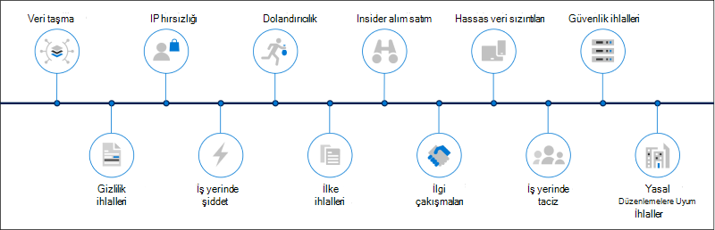

# Microsoft 365'te içerden risk çözümleri

Modern çalışma alanı güvenlik ve uyumluluk uzmanlarının en önemli kaygılarından biri Insider riskleridir. Sektör çalışmalarında, insider risklerinin çoğunlukla belirli kullanıcı olayları veya etkinlikleriyle ilişkilendiril olduğu gösteriliyor. Belirlemek ve azaltmak zor olmak için, organizasyonlarınızı bu risklere karşı korumak zor olabilir. Insider riskleri, çeşitli alanlardaki güvenlik açıkları içerir ve fikri mülkiyet kaybından iş yeri saldırılarına ve daha birçok kuruluşta büyük sorunlara neden olabilir. Aşağıdaki şekil, sık karşılaşılan Insider risklerini özetler:

Microsoft 365 engelleme özellikleri, insider risk ürün ve çözümlerimiz için tasarlanmıştır ve yerleşik olarak bulunmaktadır. Bu çözümler birlikte çalışır ve risk etkinliğini hızla tanımlamanıza, değerlendirmeniz ve üzerinde eyleme gerek göstermeniz için gelişmiş hizmet ve üçüncü taraf göstergeleri kullanır. Çözümlerin çoğu, veri analistleri ve bilgi olaylarınızı bu risklere en hızlı şekilde müdahale etmek ve en aza indirmek için kullanabileceğiniz kapsamlı bir algılama, uyarı ve düzeltme iş akışı sunar.

| Risk simgesi | Riskler | İletişim uyumluluğu | İçeriden risk yönetimi | Bilgi bariyerleri | Ayrıcalıklı erişim yönetimi |
| :---- | :-------- | :--------------------------- | :-------------------------- |:-------------------------| :--------------------------------|
| | Veri taşma |  |  |  |  |
| | Gizlilik ihlalleri |  |  |  |  |
| | IP hırsızlığı |  |  |  |  |
| | İş yerinde şiddet |  |  |  |  |
| | Dolandırıcılık |  |  |  |  |
| | İlke ihlalleri |  |  |  |  |
| | Insider alım satım |  |  |  |  |
| | İlgi çakışmaları |  |  |  |  |
| | Hassas veri sızıntıları |  |  |  |  |
| | İş yerinde taciz |  |  |  |  |
| | Güvenlik ihlalleri |  |  |  |  |
| | Mevzuat uyumluluğu ihlalleri |  |  |  |  |

## Microsoft 365 içeriden risk çözümleri

Organizasyonlarınızı insider risklerine karşı korumak için bu özellik Microsoft 365 ve özellikleri kullanın.

### İletişim uyumluluğu

İletişim uyumluluğu, kurumda uygunsuz iletileri algılamanıza, yakalamanıza ve bu iletilere eylemde yardımcı olarak iletişim risklerini en aza indirmenize yardımcı olur. İletişim uyumluluğu aşağıdaki aboneliklerde kullanılabilir:

- Microsoft 365 E5/A5/F5/G5 aboneliği (ücretli veya deneme sürümü)
- Microsoft 365 E3/A3/F3/G5 aboneliği + Microsoft 365 E5/A5/F5/G5 Uyumluluk eklentiniz
- Microsoft 365 E3/A3/F3/G5 aboneliği + Microsoft 365 E5/A5/F5/G5 Insider Risk Yönetimi eklentisi
- Office 365 Kurumsal E5 aboneliği (ücretli veya deneme sürümü)
- Office 365 A5 (ücretli veya deneme sürümü)
- Office 365 Kurumsal E3 aboneliği + Office 365 Gelişmiş Uyumluluk eklentiyi içerir (artık yeni abonelikler için kullanılamaz, nota bakın)

### İçeriden risk yönetimi

Insider risk yönetimi, kuruluşta kötü amaçlı ve yanlışlıkla yapılan etkinlikleri algılamanıza, araştırmanıza ve bu etkinliklere yönelik işlem alamanıza olanak sağlayarak dahili riskleri en aza indirmenize yardımcı olur.

Insider risk yönetimi aşağıdaki aboneliklerde kullanılabilir:

- Microsoft 365 E5/A5/F5/G5 aboneliği (ücretli veya deneme sürümü)
- Microsoft 365 E3/A3/F3/G3 aboneliği + Microsoft 365 E5/A5/F5/G5 Uyumluluk eklentiniz
- Microsoft 365 E3/A3/F3/G3 aboneliği + Microsoft 365 E5/A5/F5/G5 Insider Risk Yönetimi eklentisi
- Office 365 E3 + Enterprise Mobil Kullanım ve Güvenlik E3 + Microsoft 365 E5 Uyumluluk eklenti

### Bilgi engelleri

Bilgi engelleri, iki iç grup arasındaki iletişimi ve işbirliğini kısıtlar ve kuruluş içinde herhangi bir ilgi çakışması yaşanması için bunu engeller.

Bilgi engelleri aşağıdaki aboneliklerde kullanılabilir:

- Microsoft 365 E5/A5 aboneliği (ücretli veya deneme sürümü)
- Office 365 E5/A5/A3/A1 aboneliği (ücretli veya deneme sürümü)
- Office 365 Gelişmiş Uyumluluk eklenti (artık yeni abonelikler için kullanılamaz)
- Microsoft 365 E3/A3/A1 aboneliği + Microsoft 365 E5/A5 Uyumluluk eklentisi
- Microsoft 365 E3/A3/A1 aboneliği + Microsoft 365 E5/A5 Insider Risk Yönetimi eklentisi

### Ayrıcalıklı erişim yönetimi

Ayrıcalıklı erişim yönetimi, aynı konumdaki ayrıcalıklı yönetici görevleri Exchange Online ayrıntılı erişim Office 365. Bu, hassas verilere ayakta erişim veya kritik yapılandırma ayarlarına erişimle, var olan ayrıcalıklı yönetici hesaplarının kullanımına yönelik ihlallere karşı kuruluşu korumaya yardımcı olabilir.

Ayrıcalıklı erişim yönetimi aşağıdaki aboneliklerde kullanılabilir:

- Microsoft 365 E5 (ücretli veya deneme sürümü)
- Microsoft 365 A5 (ücretli veya deneme sürümü)
- Office 365 Kurumsal E5 aboneliği (ücretli veya deneme sürümü)
- Office 365 A5 (ücretli veya deneme sürümü)
- Microsoft 365 E3 + Microsoft 365 E5 Uyumluluk eklenti
- Microsoft 365 E3 + Microsoft 365 E5 Information Protection ve Yönetim eklentisi
- Microsoft 365 A3 + Uyumluluk Microsoft 365 A5 eklentiyi ekleme
- Microsoft 365 A3 + Microsoft 365 A5 Information Protection ve Yönetim eklentisi

## Insider risk Microsoft 365 dağıtma

Organizasyonlarınızı Insider risklerine karşı korumak için aşağıdaki olası çözümleri ayarlayın Microsoft 365 dağıtın:

1. İletişim uyumluluk ilkelerini [yapılandırarak ve oluşturun](communication-compliance-solution-overview.md).
2. [Insider risk yönetimi ilkelerini yapılandırma ve oluşturma](insider-risk-management-solution-overview.md).
3. İsteğe bağlı: Bilgi engeli [ilkelerini yapılandırma ve oluşturma](information-barriers-solution-overview.md).
4. İsteğe bağlı: Ayrıcalıklı erişim [yönetimini etkinleştirin ve yapılandırarak](privileged-access-management-solution-overview.md).

## Örnekli çizimler

Daha insider risk özelliklerini uygulamaya Microsoft 365 tümleşik bir strateji planlamanıza yardımcı olmak için, Microsoft 365 koruma ve uyumluluk özellikleri kümelerini  indirin. Insider risk özellikleri için 5-7 mimari çizim sayfalarına bakın. Bu çizimleri kendi kullanımınız için uyarlamak sizin için özgürce olur.

| Öğe | Açıklama |
|:-----|:------------|
|   [PDF olarak indirme](https://download.microsoft.com/download/3/a/6/3a6ab1a3-feb0-4ee2-8e77-62415a772e53/m365-compliance-illustrations.pdf)\| [Dosya olarak Visio](https://download.microsoft.com/download/3/a/6/3a6ab1a3-feb0-4ee2-8e77-62415a772e53/m365-compliance-illustrations.vsdx)     Ekim 2020'de güncelleştirildi|Şunları içerir: <ul><li>  Microsoft bilgi koruması ve veri kaybını önleme</li><li>Bekletme ilkeleri ve bekletme etiketleri </li><li>Bilgi engelleri</li><li>İletişim uyumluluğu</li><li>İçeriden risk yönetimi</li><li>Üçüncü taraf veri alımı</li>|

## Eğitim

Her insider risk çözümünün temelleri hakkında yöneticilerinizi ve uyumluluk ekibinizi eğitime almak, dağıtım ve uygulama çabalarınız ile organizasyonsunuz daha hızlı bir şekilde çalışmaya başlamanıza yardımcı olabilir. 

Microsoft 365, bu kullanıcıları bilgilendirmeye ve eğit etmeye yardımcı olmak için aşağıdaki kaynakları sağlar:

| Çözüm/Alan | Kaynaklar |
|:------------------|:--------------|
| Insider risklerini iş Microsoft 365 |[Tam öğrenme yolu](/learn/paths/m365-compliance-insider)   Bu öğrenme yolu, iletişim uyumluluğu, insider risk yönetimi, bilgi engelleri ve ayrıcalıklı erişim yönetimi için tek tek tüm çözüm modüllerini içerir. Tüm modülleri tamamlamak için bu öğrenme yolunu seçin. |
| İletişim uyumluluğu | [Learning modülü: E-Microsoft 365'de iletişim uyumluluğunu hazırlama](/learn/modules/m365-compliance-insider-prepare-communication-compliance)   Bu modül, iletişim uyumluluğuyla ilgili yürütme kodu ihlallerini tanımlama ve düzeltme, iletişim uyumluluk ilkeleri oluşturmadan önce gereken önkoşulları kapsama ve iletişim uyumluluğu için yerleşik, önceden tanımlanmış ilke şablonlarının türleri hakkında bilgi edinme konusunda temel bilgileri öğrenmenize yardımcı olur. |
| İçeriden risk yönetimi | [Learning modülü: Risk yönetiminde Insider Microsoft 365](/learn/modules/m365-compliance-insider-manage-insider-risk)   Bu modül, Microsoft 365'ta insider risk yönetiminin kuruluşta dahili riskleri engellemeye, algılamaya ve içereci nasıl yardımcı olduğunu öğrenmenıza, yerleşik, önceden tanımlanmış ilke şablonları türleri hakkında bilgi edinme ve Insider risk ilkeleri oluşturmadan önce gereken temel önkoşulları anlamanıza yardımcı olur ve Insider risk yönetimi durumlarında gerçekleştirebilecek eylem türlerini açıklamanıza yardımcı olur. |
| Bilgi engelleri | [Learning: Bilgi engellerini planlama](/learn/modules/m365-compliance-insider-plan-information-barriers)   Bu modül, bilgi engeli ilkelerinin ilgili endüstri standartları ve yasal düzenlemelere uyumluluğu korumanıza nasıl yardımcı olduğunu öğrenmenize, bilgi engellerinin uygulan uygulanabildiği durum türlerini listeler, bilgi engeli ilkesi oluşturma sürecini açıklamaya ve bilgi engeli uygulanmaya başladıktan sonra beklenmedik sorunların nasıl giderilmesine yardımcı olduğunu açıklamanıza yardımcı olur. |
| Ayrıcalıklı erişim yönetimi | [Learning modülü: Ayrıcalıklı erişim yönetimini uygulama](/learn/modules/m365-compliance-insider-implement-privileged-access-management)   Bu modül, ayrıcalıklı erişim yönetimiyle ayrıcalıklı kimlik yönetimi arasındaki farkı anlamanıza, ayrıca erişim yönetim süreci akışını anlamanıza ve ayrıca erişim yönetimini yapılandırmanın ve etkinleştirmenin temellerini anlamanıza yardımcı olur. |
