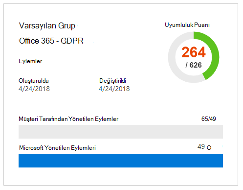

# Microsoft Uyumluluk Yöneticisi (klasik)

> [!IMPORTANT]
> **Uyumluluk Yöneticisi (klasik) yakında Microsoft Hizmet Güveni Portalı'nden kaldırılacaktır.** Gelişmiş kullanıcı deneyimi ve güncelleştirilmiş denetim [eşlemesi sağlayan Microsoft 365 uyumluluk merkezi](https://compliance.microsoft.com/) Uyumluluk Yöneticisi'ne geçişnizi öneririz. Klasik sürümde değerlendirmeleri olan müşterilerin yeni Uyumluluk Yöneticisi'nde yeni değerlendirmeleri oluşturmaları gerekir. Değerlendirmeler, denetimler ve diğer veriler de dahil olmak üzere mevcut veriler yeni Uyumluluk Yöneticisi'ne aktarlanmaz.

*Uyumluluk Yöneticisi 21Vianet tarafından Office 365, Office 365 Almanya, Office 365 ABD Government Community High (GCC High) veya Office 365 Department of Defense tarafından kullanılamaz.*

Microsoft [Hizmet](./get-started-with-service-trust-portal.md) Güveni Portalı'nın iş akışı tabanlı bir risk değerlendirme aracı olan Uyumluluk Yöneticisi, Microsoft Professional Hizmetleri ve Microsoft Office 365, Microsoft Dynamics 365 gibi Microsoft bulut hizmetleriyle ilgili yasal düzenlemelere uyumluluk etkinliklerini izlemenizi, atamanızı ve doğrulamanızı Microsoft Azure .

Uyumluluk Yöneticisi:

- Microsoft tarafından sağlanan ayrıntılı bilgileri, Microsoft'un çeşitli standartlara (örneğin, ISO 27001, ISO 27018 ve NIST) karşı microsoft'un üçüncü taraf denetimlerinin bir parçası olarak denetçiler ve düzenleyiciler ile Microsoft'un düzenlemelere (HIPAA ve AB Genel Veri Koruma Yönetmeliği veya GDPR gibi) şirket içinde bu standartlara ve düzenlemelere uyumluluğu konusunda kendi kendine uygun değerlendirmesiyle derlediği bilgileri bir araya sunar.

- Uyumluluk ve değerlendirmeyle ilgili etkinlikleri atamanıza, izlemenize ve kaydetmenize olanak sağlar ve bu da kurum kuruluşlarının uyumluluk hedeflerine ulaşmak için ekip engellerini aştırmanıza yardımcı olabilir.

- İlerlemenizi izlemenize yardımcı olmak için bir Uyumluluk Puanı sağlar ve kuruluş risklerine maruz kalma süresini azaltmaya yardımcı olacak denetim denetimlerini önceliklendirmenize yardımcı olur.

- Uyumluluk etkinlikleriniz ile ilgili kanıtı ve diğer yapıları karşıya yüklemek ve yönetmek için güvenli bir depo sağlar.

- Microsoft'un ve Microsoft Excel düzenleyicilere, düzenleyicilere ve diğer uyumluluk proje katılımcılarına sağlanacak uyumluluk etkinliklerini belgelene kadar, bu kuruluşta zengin ayrıntılı raporlar üretir.

> [!IMPORTANT]
> Uyumluluk Yöneticisi, veri korumanız ve uyumluluk sürenizin özetini, ayrıca veri korumayı ve uyumluluğu iyileştirme önerileri sağlayan bir panoyu içerir. Uyumluluk Yöneticisi'nde sağlanan Müşteri Eylemleri önerilerdir; bu önerilerin uygulama öncesinde ilgili mevzuat ortamında ne kadar etkili olduğunu değerlendirmeleri her kuruluşa aittir. Öneriler Yöneticisi'nde bulunan her metin uyumluluk garantisi olarak yorumlanmaz.

## Uyumluluk Yöneticisi nedir?

Uyumluluk Yöneticisi, bulutun paylaşılan sorumluluk modeli içinde mevzuat uyumluluğunu yönetmenize yardımcı olmak için tasarlanmış iş akışı tabanlı bir risk değerlendirme aracıdır. Uyumluluk Yöneticisi, Microsoft'un denetim uygulama ayrıntılarıyla test sonuçlarını, müşteri denetim uygulama kılavuzu ve kurum gireni takip bilgilerini içeren standartlarla düzenlemeleri ve değerlendirmeleri içeren bir pano görünümü sağlar. Uyumluluk Yöneticisi denetim uygulama, test durumu ve kanıt yönetimini izlemek için sertifika değerlendirme denetim tanımları, denetimlerin uygulanması ve testi, denetimlerin risk ağırlıklı puanlama, rol tabanlı erişim yönetimi ve yerinde denetim eylemi atama iş akışı sağlar. Uyumluluk Yöneticisi, müşterilerin değerlendirmeleri birlikte mantıksal olarak gruplamalarına ve aynı veya ilgili denetimlere değerlendirme denetimi testi uygulamalarına olanak sağlayarak, başka türlü farklı sertifikalar genelinde aynı denetim gereksinimlerini karşılamak için gereken çabanın tekrarını azaltarak uyumluluk iş yükünü en iyi durumalar.

## Uyumluluk Yöneticisi'nde Değerlendirmeler

Uyumluluk Yöneticisi'nin temel bileşeni, Değerlendirme *olarak adlandırılandır*. Değerlendirme, Microsoft hizmetinin sertifika standardı veya veri koruma yönetmeliğine göre değerlendirmedir (ISO 27001:2013 ve GDPR gibi). Değerlendirmeler, seçilen Microsoft bulut hizmetinin seçili endüstri standardıyla karşıtlıkını, kuruluş veri koruması ve uyumluluk uyumluluğu uyumluluğu üzerinde değerlendirmenize yardımcı olur. Değerlendirmeler, değerlendirilen sertifika standardını eş alan denetimlerin uygulanmasıyla tamamlanır.

Değerlendirmenin yapısı, Microsoft ile organizasyon arasında buluttaki güvenlik ve uyumluluk risklerini değerlendirme ve uyumluluk standardı, veri koruma standardı, düzenleme veya yasalarla belirtilen veri korumalarını uygulamaya yönelik sorumluluklara dayalıdır.

Değerlendirme, şu bileşenlerin bileşenlerinden oluşur:

- **Kapsam Hizmetleri** - Her değerlendirme, Bulut Hizmetleri bölümü Microsoft hizmetleri belirli bir In-Scope için geçerlidir.

- **Microsoft Tarafından Yönetilen Denetimler** - Microsoft her bulut hizmeti için, Microsoft'un çeşitli standartlara ve  düzenlemelere uyumluluğu kapsamında bir dizi denetimi uygulamaya ve yönetir. Bu denetimler,  *Değerlendirmenin*  uygun olduğu ilgili sertifika veya düzenlemeden gelen yapıya uygun denetim aileleri olarak düzenlenmiştir. Uyumluluk Yöneticisi, Microsoft tarafından yönetilen her denetimde, Microsoft'un denetimi nasıl gerçekleştirmiş olduğu ve bu uygulamanın bağımsız bir üçüncü taraf denetçi tarafından nasıl ve ne zaman test edilmiş ve doğrulanmış olduğuyla ilgili ayrıntılar sağlar.

  Burada, Güvenlik denetimi ailesinde yer alan ve Office 365 GDPR Değerlendirmesini alan Microsoft tarafından yönetilen üç denetim örneği ve ve vesyeni ve bir örneği ve kullanımı açık şekildedir.

  

  1. Microsoft tarafından yönetilen denetime eşleyen sertifika veya düzenlemeden aşağıdaki bilgileri belirtir.

     - **Denetim Kimliği** - Denetimin eşleytüğü sertifika veya düzenlemeye ilişkin bölüm veya makale numarası.

     - **Başlık** - İlgili sertifikadan veya düzenlemeden gelen başlık.

     - **Makale Kimliği** - Bu alan yalnızca GDPR değerlendirmelerine dahil edilir ve buna karşılık gelen GDPR makale numarasını belirtir.

     - **Açıklama** - Microsoft tarafından yönetilen seçili denetime eşanan standart veya düzenleme metni.

  1. Denetimin Uyumluluk Puanı, Microsoft tarafından yönetilen her denetimle ilişkili risk düzeyini (uyumluluk dışı veya denetim hatası nedeniyle) gösterir. Daha [fazla bilgi için bkz. Uyumluluk](#understanding-the-compliance-score) Puanını anlama. Uyumluluk Puanları'nın 1 ile 10 arasında derecelendiril olduğunu ve renk kodlu olduğunu unutmayın. Sarı düşük risk denetimlerini, turuncu orta riskli denetimleri ve kırmızı da yüksek riskli denetimleri gösterir.

  1. Bir denetimin uygulama durumu, denetimin test olduğu tarih, testi kimin gerçekleştirmiş olduğu ve test sonucu hakkında bilgiler.

  1. Her denetimde, Microsoft'un  denetimi uygulama ayrıntıları ve denetimin bağımsız bir üçüncü taraf denetçisi tarafından test edilmiş ve doğrulanmasıyla ilgili ayrıntılar gibi ek bilgileri görmek için Diğer'e tıkabilirsiniz.

- **Müşteri Tarafından Yönetilen Denetimler** - Bu, organizasyonu tarafından yönetilen denetimler koleksiyonudur. Bu denetimleri, verilen bir standart veya düzenlemeye uyumluluk sürecinizin bir parçası olarak uygulamak sizin sorumluluğundadır. Müşteri tarafından yönetilen denetimler ilgili sertifika veya düzenleme için de denetim aileleri olarak düzenlenmiştir. Uyumluluk etkinliklerinizin bir parçası olarak Microsoft tarafından önerilen eylemleri uygulamak için müşteri tarafından yönetilen denetimleri kullanın. Organizasyonunız, bu denetime ilişkin uygulama ve değerlendirme sürecini yönetmek için, müşteri tarafından yönetilen her denetimde ön simgeli rehberlik ve önerilen Müşteri Eylemleri'ne sahip olabilir.

  Değerlendirmelerde müşteri tarafından yönetilen denetimler, Değerlendirmeyi tamamlamayla ilgili ilerleme durumunu yönetmek ve izlemek için kullanabileceğiniz yerleşik iş akışı yönetimi işlevselliğine de sahiptir. Örneğin, bir uyumluluk görevlisinin, denetim için önerilen eylemleri gerçekleştirmek için sorumluluğu ve gerekli izinleri olan bir IT yöneticisine Eylem Öğesi atayabilirsiniz. Bu çalışma tamamlandığında, IT yöneticisi uygulama görevleri için kanıt yükleyebilir (örneğin, yapılandırmanın veya ilke ayarlarının ekran görüntülerini) ve sonra toplanan kanıtı değerlendirmek, denetimin uygulanmasını test etmek ve Uyumluluk Yöneticisi'nde uygulama tarihini ve sonuçlarını kaydetmek için Eylem Öğesi'ni Uyumluluk Görevlisi'ne geri atar. Daha fazla bilgi için, [makalenin Değerlendirme sürecini](#managing-the-assessment-process) yönetme bölümüne bakın.

## İzinler ve rol tabanlı erişim denetimi

Uyumluluk Yöneticisi rol tabanlı bir erişim denetimi izin modeli kullanır. Yalnızca kullanıcı rolüne atanan kullanıcılar Uyumluluk Yöneticisi'ne erişebilirsiniz ve her kullanıcı tarafından izin verilen eylemler rol türüne göre kısıtlanır.

Artık varsayılan Konuk erişimi rolü **olmadığını unutmayın** . Uyumluluk Yöneticisi'ne erişmek ve bu yöneticinin içinde çalışmak için her kullanıcıya bir rol atanabilir.

Aşağıdaki tabloda her Uyumluluk Yöneticisi izni ve bu izinler kullanıcının ne yaptığını açıklar. Tabloda ayrıca, her izinin atandığı rol de gösterir.

|İzin|Uyumluluk Yöneticisi Okuyucu|Uyumluluk Yöneticisi Katılımcısı|Uyumluluk Yöneticisi Değerlendiren|Uyumluluk Yöneticisi Yöneticisi|Portal Yöneticisi|
|---|:---:|:---:|:---:|:---:|:---:|
|**Verileri okuma** - Kullanıcılar verileri okuyabilir ancak düzenleyemez.||||||
|**Verileri düzenleme** - Kullanıcılar Sına Sonucu ve Sına Tarihi alanları dışında tüm alanları düzenleyebilir.||||||
|**Test sonuçlarını düzenleme** - Kullanıcılar Test Sonucu ve Test Tarihi alanlarını düzenleyebilir.||||||
|**Değerlendirmeleri yönetme** - Kullanıcılar Değerlendirmeleri oluşturabilir, arşivler ve silebilir.||||||
|**Kullanıcıları yönetme** - Kullanıcılar, kuruluşlarındeki diğer kullanıcıları Okuyucu, Katkıda Bulunan, Değerlendiren ve Yönetici rollerine ekleyebilir. Yalnızca, organizasyonda Genel Yönetici rolüne sahip olan kullanıcılar Portal Yöneticisi rolüne kullanıcı ekleyebilir veya portaldan kullanıcı kaldırabilir.||||||
|

## Uyumluluk Puanı'nın anlaşılması

Pano'da, Uyumluluk Yöneticisi kutucuğun sağ üst Office 365 değerlendirmeleri için toplam puanı görüntüler. Bu, Değerlendirme için toplam Uyumluluk Puanıdır ve Değerlendirmede Uygulanan ve Test Edilen ve Sınanmış olarak işaretlenmiş her denetim değerlendirmesinde alınan puanların toplamıdır. Değerlendirme eklerken, Uyumluluk Puanı'nın tamamlanma yolunda olduğunu fark edersiniz, çünkü Microsoft tarafından uygulanan ve bağımsız üçüncü taraflar tarafından test edilen Microsoft tarafından yönetilen denetimlerin puanları zaten uygulanır.

Geri kalan noktalar, her biri genel uyumluluk puanına katkıda bulunan belirli bir değeri olan müşteri tarafından yönetilen denetimlerin uygulama ve testlerinden, başarılı müşteri denetimi değerlendirmesinden gelir.

Her Değerlendirme, Değerlendirmede yer alan her denetimle ilişkilendirilmiş (hem Microsoft tarafından yönetilen hem de müşteri tarafından yönetilen denetimler dahil) ilişkili risk düzeyini (uyumluluk dışı veya denetim hatası nedeniyle) değerlendirmeniz için risk tabanlı bir Uyumluluk Puanı görüntüler. Her müşteri tarafından yönetilen denetime 1 ile 10 arasında bir ölçekte olası sayıda puan (*önem derecelendirmesi olarak adlandırılan) atanır; burada denetim başarısız olduğunda daha yüksek risk faktörüyle ilişkili denetimler için daha fazla puan verilir ve daha düşük risk denetimleri için daha az puan verilir.

Örneğin, aşağıda gösterilen Kullanıcı Erişimi Yönetimi değerlendirme denetimi çok yüksek önem düzeyine sahip bir risk derecelendirmesine sahip ve atanmış 10 değerini görüntüler.

Karşılaştırmada, aşağıda gösterilen Bilgi Yedekleme değerlendirme denetimi daha düşük önem düzeyi risk derecelendirmesine sahip ve atanmış 3 değerini görüntüler.

Uyumluluk Yöneticisi her denetime bir varsayılan önem derecelendirmesi atar. Risk derecelendirmeleri aşağıdaki ölçütlere göre hesaplanır:

- Denetimin olayları engellemesi (en yüksek derecelendirme), gerçekleşen olayları algılar veya bir olayın etkisini (en düşük derecelendirme) düzelter. Önem derecesi açısından, tehditi önleyen zorunlu bir denetime en yüksek puan atanır; doğru veya düzeltici olan denetimlere (zorunlu veya i İsteğe bağlı olup olmadığı farkılmaksızın) en düşük sayıda puan atanır.

- Bir denetimin (uygulamaya alındıktan sonra) zorunlu olup olmadığı ve bu nedenle kullanıcılar tarafından geçiril olup olmadığı (örneğin, kullanıcıların parolalarını sıfırlaması ve parola uzunluğuyla karakter gereksinimlerini karşılaması) veya imtiyazlı olması ve kullanıcılar (örneğin, kullanıcıların bilgisayarlarında katılımsız olduğunda ekranlarını kilitlemelerini gerektiren iş kuralları) tarafından geçirilebilir.

- Veri gizliliği, bütünlüğü ve kullanılabilirliğiyle ilgili risklerle ilgili denetimleri, bu risklerin iç veya dış tehditlerden gelip gelme riski olmadığını ve tehdidin kötü amaçlı mı yoksa yanlışlıkla mı olduğunu kontrol eder. Örneğin, bir dış saldırganın bu ağı ihlalsini önlemeye ve kişisel olarak tanınmaya neden olan bilgilere erişim kazanmasını önlemeye yardımcı olacak denetimlere, çalışanın yanlışlıkla ağ yönlendiricisi ayarının yanlış yapılandırılmasını ve ağ kesintisi ile sonuçlanan bir yönlendirici ayarını engellemeyle ilgili denetimden daha fazla puan atanabilir.

- Her denetim için sözleşmeler, düzenlemeler ve genel taahhütler gibi yasal ve dış sürücülerle ilgili riskler.

Denetim için görüntülenen Uyumluluk Puanı değerleri, tam olarak Toplam  Uyumluluk Puanı'na geçiş/başarısız temelinde uygulanır; denetim uygulanır ve sonraki değerlendirme testini geçer ya da uygulanmaz; kısmi uygulama için kısmi kredi yoktur. Ancak denetimin Uygulama Durumu değeri Uygulamalandı veya Alternatif  Uygulama olarak ayarlanmış  olduğunda ve **Test** Sonucu Geçirilen değeri, Toplam Uyumluluk  Puanına eklenen atanan puanlardır.

En önemlisi de Uyumluluk Puanı, denetimle ilgili bir hata olması durumunda daha yüksek riskli denetimleri belirterek, hangi denetimlerin uygulamaya odaklanması gerektiğini belirlemede size yardımcı olabilir. Risk tabanlı önceliklendirmeye ek olarak, değerlendirme denetimleri diğer denetimlerle (aynı değerlendirme içinde veya aynı değerlendirme grubunda başka bir değerlendirmede) ilişkili olduğunda, tek bir denetimin başarıyla tamamlanması, denetim testi sonuçlarının eşit eşitle çalışmasına dayalı olarak çabanın önemli ölçüde azaltılmasına neden olabilir.

Örneğin, aşağıdaki resimde Office 365 - GDPR Değerlendirmesi'nin şu anda %46'sı değerlendirilmektedir; 111 değerlendirmeden 51'i, olası 600'den 289'un Toplam Uyumluluk puanı için tamamlanmıştır.

GDPR denetimi içinde 7.5.5, her biri 6 veya 8 ortalama yüksek öneme sahip bir risk derecelendirme puanına sahip 5 diğer denetimle (7.4.1, 7.4.3, 7.4.4, 7.4.8 ve 7.4.9) ilişkilidir. Değerlendirme filtresini kullanarak, bu denetimlerin hepsini seçtik ve bunları değerlendirme görünümünde görünür hale bıraktık ve aşağıda bu denetimlerden hiçbirinin değerlendirilmemiş olduğunu görebiliriz.

 Bu 6 denetim ilişkili olduğu için, denetimlerden herhangi birinin tamamlanması bu değerlendirme içindeki ilgili denetimler genelinde bu test sonuçlarının eşit eşitlenerek sonuçlanmasını sağlar (aynı değerlendirme grubunda yer alan bir değerlendirmede ilgili denetimler için de olduğu gibi). GDPR denetimi 7.5.5'in uygulama ve testlerinin tamamlanmasından sonra, denetim ayrıntı alanı 6 denetimin hepsinin değerlendirildi olduğunu göstermek üzere yenilenir; bu şekilde, değerlendirilen denetimlerin sayısındaki artış 57 ve %51 olarak değerlendirilir ve +40'ın toplam Uyumluluk Puanı'nın değişmesi olur.

İlgili bir denetimin Uygulama Durumunu diğer ilgili denetimleri etkilemeyecek şekilde değiştirmek yakında bu onay güncelleştirmesi iletişim kutusu görüntülenir.

> [!NOTE]
> Şu anda yalnızca Bulut hizmetleri Office 365 değerlendirmeleri Uyumluluk Puanı içerir. Azure ve Dynamics için değerlendirmeler bir değerlendirme durumu gösterir.

## Uyumluluk Puanı metodolojisi

Microsoft Güvenli Puanı gibi Uyumluluk Puanı, diğer davranış tabanlı puanlama sistemlerine benzer; veri koruma, gizlilik ve güvenlikle ilgili etkinlikler gerçekleştirerek, kuruluş etkinliklerinizin Uyumluluk Puanı artabilir.

> [!NOTE]
> Uyumluluk Puanı, belirli herhangi bir standart veya düzenlemeye ilişkin kuruluş uyumluluğu ile ilgili mutlak bir ölçü ifade etmez. Kişisel verilerin ve kişisel gizliliğin risklerini azaltacak denetimleri ne ölçüde benimsemiş olduğunu açıkça ortaya eder. Hiçbir hizmet standart veya düzenlemeyle uyumlu olacağını garanti edilemez ve Uyumluluk Puanı hiçbir şekilde garanti olarak yorumlanmaz.

Uyumluluk Yöneticisi'nde değerlendirmeler bulut bilgi işlem için paylaşılan sorumluluk modeline dayalıdır. Paylaşılan sorumluluk modelinde Microsoft ve her müşteri, bu veriler bizim bulutmizde depolandığı zaman müşterinin verilerini koruma sorumluluğunu üstlenen sorumluluklara sahip olur.

Aşağıdaki GDPR Değerlendirmesi Office 365 gösterildiği gibi, değerlendirmede standart veya düzenlemenin gereksinimlerini karşılamak için tasarlanmış çeşitli Eylemleri gerçekleştirmekle microsoft ve müşteriler sorumludur. Mantıklı olmak ve gerekenleri anlamak için. Uyumluluk Yöneticisi çeşitli standartlarda ve yasal düzenlemeler genelinde 2013'e göre hareket eder ve tüm standartları ve yasal düzenlemeleri denetim çerçeveleri gibi ele almaktadır. Bu nedenle, Microsoft ve müşteriler tarafından her Değerlendirme için gerçekleştirilen Eylemler, çeşitli denetimlerin uygulanmasını ve doğrulanmasını içerir.

İşte tipik bir Eylem için temel iş akışı:

1. Kuruluşun Uyumluluk, Risk, Gizlilik ve/veya Veri Koruma Görevlisi, bir denetimin uygulanması için kuruluşta başka birine görevi atar. Bu kişi şu olabilir:

   - İş ilkesi sahibi

   - Bir IT uygulayıcısı

   - Kuruluşta görevi gerçekleştirme sorumluluğu olan başka bir kişi

2. Bu birey denetimi uygulamak için gereken görevleri gerçekleştirir, uyumluluk Yöneticisi'ne uygulamanın kanıtlarını yükler ve uygulanan eyleme bağlı olan denetimi(ler) işaretler. Bu görevler tamamlandıktan sonra, Eylem'i doğrulama için Bir Değerlendirıcı'ya atarlar. Değerlendirenler şunları olabilir:

   - Kuruluş içindeki denetimlerin doğrulamasını gerçekleştirmek için iç değerlendirenler

   - Microsoft'un bulut hizmetlerini denetleen üçüncü taraf bağımsız kuruluşlar gibi uyumluluğu inceleyen, doğruleyen ve onayleyen dış değerlendirenler

3. Değerlendiren denetimi doğrular, kanıtı inceler ve denetimin(değerlendirildi) ve değerlendirmenin sonuçlarını (ör. geçti) işaretler.

Değerlendirme ile ilişkili tüm denetimler değerlendirilen, Değerlendirme tamamlanmış olarak kabul edilir.

Uyumluluk Yöneticisi'nde her Değerlendirme, Microsoft'un sorumlu olduğu denetimlerin gereksinimlerini karşılamak için Microsoft tarafından  alınan Eylemler hakkında ayrıntılar sağlayan önceden yüklenmiş olarak gelir. Bu bilgiler, Microsoft'un her denetimi nasıl uygulamasına ilişkin ayrıntıları ve Microsoft'un uygulamasını üçüncü taraf bir denetçi tarafından değerlendirilen ve doğrulanan ne zaman ve ne zaman uygulaydığını içerir. Bu nedenle, her Değerlendirme için Microsoft Yönetilen Denetimleri Değerlendirildi olarak işaretlenir ve Değerlendirmenin Uyumluluk Puanı bunu yansıttı.

Her Değerlendirme, paylaşılan sorumluluk modeline dayalı toplam Uyumluluk Puanı içerir. Microsoft'un DENETIMler hakkında uygulama ve Office 365, GDPR değerlendirmesiyle ilişkili toplam olası noktaların bir bölümüne katkıda bulunmaktır. Müşteri her müşteri Eylemlerini uygulayan ve test ettiyken, Değerlendirmenin Uyumluluk Puanı denetime atanan değerle artar.

### Risk tabanlı puanlama yöntemi

Uyumluluk Yöneticisi, denetim başarısız olduğunda veya uyumlu değilken daha yüksek riski temsil eden denetimlere yüksek bir değer atayan, 1-10 arasında ölçeği olan risk tabanlı bir puanlama yöntemi kullanır. Uyumluluk Puanı tarafından kullanılan puanlama sistemi, aşağıdakiler gibi çeşitli önemli faktörlere bağlıdır:

- Denetimin özünü

- Tehdit türlerine dayalı olarak denetimin risk düzeyi

- Denetimin dış sürücüleri

### Denetimin özünü

Denetimin özünü, denetimin Zorunlu mu yoksa İsteğe Bağlı mı ve Engelli, Geç veya Düzeltici olup olmadığını temel alarak olur.

### Zorunlu veya i İsteğe Bağlı

*Zorunlu denetimler*  , bilerek veya yanlışlıkla atlanan denetimlerdir. Ortak bir zorunlu denetim örneği, parola uzunluğu, karmaşıklığı ve süre sonu gereksinimlerini ayaran merkezi olarak yönetilen bir parola ilkesidir. Kullanıcıların sisteme erişmek için bu gereksinimlere uymaları gerekir.

*İsteğe bağlı denetimler*  , kullanıcıların ilkeyi anlıyoruz ve buna uygun hareket eder. Örneğin, kullanıcıların bilgisayarlarından ayrıldıklarında bilgisayarlarını kilitlemelerini gerektiren bir ilke, kullanıcıya dayandırılacağı için i İsteğe bağlı bir denetimdir.

### Preventative, geç veya düzeltici

*Engelleme denetimleri belirli*  riskleri önleyen denetimdir. Örneğin, şifreleme kullanarak yerinde bilgileri korumak saldırılara, ihlallere vb. karşı önleyen bir denetimdir. Görevlerin ayrımı, faiz çakışmasını yönetmek ve sahtekarlığa karşı mücadele etmek için önlem alan bir denetimdir.

*Tercih denetimleri*  , riski temsil eden ya da izinsizleri tespit etmek veya ihlal olup olmadığını saptamak için kullanılmaktadır. Sistem erişimi denetimi ve ayrıcalıklı yönetim eylemleri denetimi, izleme denetim türleridir; mevzuat uyumluluğu denetimleri, süreç sorunlarını bulmak için kullanılan bir denetim t türündedir.

*Düzeltici denetimler*  , güvenlik olaylarının olumsuz etkilerini minimum düzeyde tutmaya çalışan, anında efekti azaltmak ve mümkünse zararları tersine çevirmek için düzeltme önlemleri alan denetimdir. Gizlilik olayı yanıtı, ihlalin ardından hasarları sınırlandıran ve sistemleri faaliyet durumuna geri yüklemek için iyi bir denetimdir.

Her denetimi bu etmenleri kullanarak değerlendirerek, denetimin özünü belirler ve ona temsil ettiği riske göre bir değer ataruz.

**Tehdit**:

|Denetim|Zorunlu|İsteğe Bağlı|
|---|---|----|
|**Preventative**|Yüksek risk|Orta risk|
|**Özel**|Orta risk|Düşük risk|
|**Düzeltici**|Orta risk|Düşük risk|

Tehdit, veriler için CIA üç ayını olarak bilinen temel, evrensel olarak kabul edilen bir güvenlik standardını ele alan her şeye yönelik bir risk ifade eder: Gizlilik, Bütünlük ve Kullanılabilirlik:

- Gizlilik, bilgilerin yalnızca güvenilir, yetkili taraflar tarafından okun ve anlaşılay olduğu anlamına gelir.

- Bütünlük, bilgilerin yetkisiz taraflar tarafından değiştirilmedi veya yok edilmiş olduğu anlamına gelir.

- Kullanılabilirlik, yüksek hizmet kalitesiyle bilgilere hazır bir şekilde erişilil diğer bir anlama gelir.

Bu özelliklerden herhangi bir hatasının sistem güvenliğinin bir bütün olarak tehlikeye atılacağı kabul edilir. Tehdit hem iç hem de dış kaynaklardan gelebilir ve bir actor'in amacı yanlışlıkla veya kötü amaçlı olabilir. Bu etmenler, her senaryo birleşimine Yüksek, Orta veya Düşük tehdit düzeylerini ataan bir tehdit matrisinde tahmin ediliyor.

|Faktör|İç|İç|Dış|Dış|
|---|---|---|---|----|
||*Kötü Amaçlı*|*Yanlışlıkla*|*Kötü Amaçlı*|*Yanlışlıkla*|
|**Gizlilik**|(H, M veya L)|(H, M veya L)|(H, M veya L)|(H, M veya L)|
|**Bütünlük**|(H, M veya L)|(H, M veya L)|(H, M veya L)|(H, M veya L)|
|**Kullanılabilirlik**|(H, M veya L)|(H, M veya L)|(H, M veya L)|(H, M veya L)|
|

**Dış sürücüler**:

|Sözleşmeler|Yasal düzenlemeler|Genel taahhütler|
|---|---|---|
|(H, M veya L)|(H, M veya L)|(H, M veya L)|

Geçerli düzenlemeler, sözleşmeler ve kamu taahhütleri gibi dış etmenler, verileri korumak ve veri ihlallerini önlemek üzere tasarlanmış denetimleri etkileyebilirsiniz ve bu etmenlerin her biri risk değerleri ya da Yüksek, Orta veya Düşük olarak atanır.

CIA/Threat ve Legal/External Drivers'da temsil edilen 15 olası risk senaryosunda bu risk değerlerinin, belirli bir değerde risk tekrarları olasılığını ve sayısını önemli olarak dikkate alan ve denetimin önem derecelendirmesini hesaplarken dikkate alınan risk ağırlık düzeyi sağlamak üzere birleştirilmiştir.

Denetimin önem derecelendirmesine bağlı olarak, denetime uyumluluk puanı değeri atanır ve bu sayı aşağıdaki risk kategorilerine göre gruplu 1 (düşük) ile 10 (yüksek) arasında bir sayıdır:

|Risk düzeyi|Denetim değeri|
|---|:---:|
|Düşük|1-3|
|Orta|6|
|Yüksek|8|
|Ciddi|10|

En yüksek uyumluluk puanı değerlerine sahip değerlendirme denetimlerine öncelik verince, kuruluş en yüksek risk öğelerine uyum sağlar ve tamamlanan her denetim değerlendirmesinde değerlendirmenin toplam uyumluluk puanına daha fazla puan eklenmiş şekilde orantılı olarak daha yüksek pozitif geri bildirim alır.

### Puanlama yöntemi özeti

Uyumluluk Puanı, Uyumluluk Yöneticisi'nin kuruluşların uyumluluğu anlarına ve yönetmelerine yardımcı olduğu temel bir bileşendir. Değerlendirmenin Uyumluluk Puanı, şirketin bir sayı olarak verilen standart veya düzenlemeyle uyumluluğunun ifadesidir; burada puanın ne kadar yüksek olduğu (Değerlendirme için ayrılan puan sayısı üst oranına kadar), şirketin uyumluluk uyumluluğu o kadar iyi olur. Değerlendirme denetimlerine 1 - 10 (düşük - yüksek) arasında risk önem derecesi değerleri atandığı uyumluluk puanlama metodolojisini anlamak ve tamamlanmış denetim değerlendirmelerinin toplam uyumluluk puanına nasıl ekli olduğunu anlamak, kuruluşların eylemlerini önceliklendirmek açısından çok önemlidir.

## Değerlendirmeleri Gruplama

Yeni bir Değerlendirme  oluşturmaktayken, Değerlendirme'ye atamak veya Var olan bir gruba Değerlendirme'ye atamak için bir grup oluşturmanız istenir. Gruplar, Değerlendirmeleri mantıksal olarak düzenlemenize ve müşteri tarafından yönetilen aynı veya ilgili denetimlere sahip Değerlendirmeler arasında ortak bilgileri ve iş akışı görevlerini paylaşmanızı sağlar.

Örneğin, Değerlendirmeleri yıllara ya da ekiplere, departmanlara veya kuruluşlara göre gruplandırma veya bunları yıla göre gruplayma. Burada gruplarla ve içer içererken buluna Değerlendirmelere bazı örnekler verilmiştir.

- GDPR Değerlendirmeleri — 2018

  - Office 365 + GDPR

  - Azure + GDPR

  - Dynamics + GDPR

- Azure Değerlendirmeleri — 2018

  - Azure + GDPR

  - Azure + ISO 27001:2013

  - Azure + ISO 27018:2014

- Veri Güvenliği ve Gizlilik Değerlendirmeleri

  - Office 365 + ISO 27001:2013

  - Office 365 + ISO 27018:2014

  - Azure + ISO 27001:2013

  - Azure + ISO 27018:2014

> [!TIP]
> Yeni değerlendirmeleri eklemeden önce, organizasyonunız için bir gruplama stratejisi belirlemenizi öneririz.

Değerlendirmeleri gruplamayla ilgili gereksinimler bunlardır:

- Grup adları (*Grup Kimlikleri olarak da adlandırılan) kuruluş içinde benzersiz olmalıdır.

- Gruplar aynı sertifika/düzenleme için Değerlendirmeler içerebilir, ancak her grup belirli bir bulut hizmeti/sertifika çifti için yalnızca bir Değerlendirme içerebilir. Örneğin, bir grup Office 365 GDPR için iki Değerlendirme içere gelir. Benzer şekilde, her biri için ilgili sertifika/düzenleme farklı olduğu sürece, bir grup aynı bulut hizmeti için birden çok Değerlendirme içerebilir.

Değerlendirme grubuna bir değerlendirme eklenmiştir ve gruplama değiştirilemez. Değerlendirme grubunu yeniden adlandırarak, bu grupla ilişkilendirilmiş tüm değerlendirmeler için değerlendirme grubunun adını değiştirir. Bir değerlendirme ve yeni değerlendirme grubu oluşturabilir ve var olan bir değerlendirmeden bilgi kopyalayıp, farklı bir değerlendirme grubunda bu değerlendirmenin bir yinelemesini etkili bir şekilde oluşturabilirsiniz. Bir değerlendirmenin arşivlenmesi, bu değerlendirmeyle değerlendirme grubu arasındaki ilişkiyi bozar. Diğer ilgili değerlendirmelerde yapılan bundan sonraki güncelleştirmeler artık arşivlenen değerlendirmeye yansıtıcı olmaz.

Grupları kullanmanın en önemli avantajı, aynı gruptaki iki farklı Değerlendirmenin aynı müşteri tarafından yönetilen denetimi paylaşması (ve dolayısıyla her denetimde müşteri eylemlerinin aynı olması) durumunda, uygulama ayrıntılarının tamamlanması, test bilgileri ve bir Değerlendirmede denetimin durumunun, gruptaki diğer tüm Değerlendirmelerde aynı denetimle eşitlenmesidir. Başka bir deyişle, Değerlendirmeler aynı denetimi paylaşıyorsa ve bu Değerlendirmeler aynı grupta yer paylaşıyorsa, yalnızca bir Değerlendirmede denetim için değerlendirme sürecini yönetmeniz gerekir. Bu denetimin sonuçları diğer Değerlendirmeler ile otomatik olarak eşitlenir. Örneğin, ISO 27001 ve ISO 27018'in parola ilkeleriyle ilgili bir denetimi olur. Denetimin Test Durumu, bir Değerlendirmede "Geçti" olarak ayarlanmışsa, her iki değerlendirme de aynı Değerlendirme Grubunun bir parçası olduğu sürece, denetim diğer Değerlendirmede de güncelleştirilir (ve "Geçti" olarak işaretlenir).

Buna örnek olarak, her biri genel ağlarda verilerin şifresini ele alan, Office 365'ta 6.10.1.2'nin 6.10.1.2'de kontrolüne sahip olan ve Office 365'nde (NIST 800-53 değerlendirmesi) SC-13'ü denetlemesi gereken bu iki ilgili değerlendirme denetimlerini ele alalım. Bunlar, Varsayılan Gruptaki iki farklı değerlendirmede yer alan ilgili değerlendirme denetimleridir. İlk başta, bu iki Değerlendirmeyi gösteren Uyumluluk Yöneticisi Panosunda görüntülendiğinde olduğu gibi, herhangi bir müşteri denetimi değerlendirmesini tamamlamış değil.

**OFFICE 365 — GDPR** değerlendirmesine tıklar ve GDPR denetimi 6.10.1.2'sini görüntülemek için filtre denetimlerini kullanarak, SC-13 NIST 800-53 denetimin ilgili denetim olarak listelenmiş olduğunu görüyoruz.

BURADA GDPR denetimi 6.10.1.2'nin uygulama ve testlerinin tamamlanmasını gösteriyoruz.

Grupla değerlendirmede ilgili denetime giderek, nist 800-53 SC-13'in de aynı tarih ve saatle tamamlandı olarak işaretlenen, başka bir uygulama veya test çalışması olmadığını görüyoruz.

Pano'ya dönüp her değerlendirmenin tek bir denetim değerlendirmesini tamamlamış olduğunu ve her değerlendirme için toplam Uyumluluk Puanı'nın 8 artmış olduğunu görebiliriz (bu paylaşılan denetimin uyumluluk puanı değeri).

## Yönetim işlevleri

Yalnızca kiracı yönetici hesabında kullanılabilen ve yalnızca genel yönetici olarak oturum açtığında görülebilecek belirli yönetim işlevleri vardır.

> [!NOTE]
> Açılan listede Kısıtlanmış Belgelere Erişim izni, yöneticilerin kullanıcılara Hizmet Güveni Portalı'ta Microsoft'un paylaştığı kısıtlanmış belgelere erişim vermelerine olanak sağlayacaktır. Kısıtlanmış Belgeler özelliği kullanılamaz ancak çok yakında kullanılabilir olacak.

### Kullanıcılara Uyumluluk Yöneticisi rolleri atama

Her Uyumluluk Yöneticisi rolünün izinleri biraz farklıdır. Her role atanmış olan izinleri ekleyebilirsiniz, hangi kullanıcıların hangi rollerde yer alan olduğunu görebilir ve Hizmet Güveni Portalı aracılığıyla Hizmet Güveni Portalı aracılığıyla bu role kullanıcı ekleyebilir veya  kaldırabilirsiniz **. Bunun** için, Yönetici menü öğesini ve sonra da Ayarlar.

Uyumluluk Yöneticisi rollerine kullanıcı eklemek veya bu rollerden kullanıcı kaldırmak için.

1. [https://servicetrust.microsoft.com](https://servicetrust.microsoft.com) adımına gidin.

2. Azure Active Directory genel yönetici hesabınızla oturum açın.

3. Hizmet Güveni Portalı'nın üst menü çubuğunda **Yönetici'ye tıklayın** ve sonra Güven Merkezi'Ayarlar.

4. Rol **Seç** açılan listesinde, yönetmek istediğiniz role tıklayın.

5. Her role eklenen kullanıcılar Rol Seç **sayfasında listelenir** .

6. Bu role kullanıcı eklemek için Ekle'ye **tıklayın**. Kullanıcı **Ekle iletişim** kutusunda kullanıcı alanına tıklayın. Kullanılabilir kullanıcılar listesini kaydırarak ilerleyebilirsiniz veya arama teriminize göre listeyi filtrelemek için kullanıcı adını yazmaya başlayabilirsiniz. Bu role sahip olmak için, o **hesabı Kullanıcı** Ekle listesine eklemek için kullanıcıya tıklayın. Eşzamanlı olarak birden çok kullanıcı eklemek için, listeyi filtrelemek üzere bir kullanıcı adı yazmaya başlayın ve sonra listeye eklemek istediğiniz kullanıcıya tıklayın. Seçili **rolü bu** kullanıcılara sağlanması için Kaydet'e tıklayın.

   

7. Bu rolden kullanıcıları kaldırmak için, kullanıcıları seçin ve Sil'e **tıklayın**.

   

## Kullanıcı Gizliliği ayarları

Bazı düzenlemeler, kuruluşun kullanıcı geçmişi verilerini sileme gerektirmektedir. Bunu etkinleştirmek için, Uyumluluk Yöneticisi **yöneticilerin şunları Ayarlar** Kullanıcı Gizliliği Güvenlik Bilgileri işlevlerini sağlar:

- [Kullanıcı arama](#search-for-a-user)

- [Hesap veri geçmişinin raporunu dışarı aktarma](#export-a-report-of-account-data-history)

- [Eylem öğelerini yeniden atama](#reassign-action-items)

- [Kullanıcı veri geçmişini silme](#delete-user-data-history)

### Kullanıcı arama

Kullanıcı hesabı aramak için:

1. Diğer adı (@ simgesinin sol bilgi) yazarak ve sağ tarafta etki alanı son ek listesine tıklayarak etki alanı adını seçerek kullanıcı e-posta adresini girin. Bu, birden çok kayıtlı etki alanı içeren bir kiracıysa, doğru olduğundan emin olmak için e-posta adresi etki alanı adı son ekını bir kez daha denetleyin.

2. Kullanıcı adını doğru şekilde girdiyken Ara'yı **tıklatın**.

3. Kullanıcı hesabı bulunamıyorsa sayfada 'Kullanıcı bulunamadı' hata iletisi görüntülenir. Kullanıcının e-posta adresi bilgilerini kontrol edin, düzeltmeleri gereken şekilde yapın ve yeniden denemek **için Ara'ya** tıklayın.

4. Kullanıcı hesabı bulunursa, düğme metni Ara yerine Temizle olarak değişir ve  **bu, döndürülen** kullanıcı hesabının aşağıda görüntülenecek olan ek işlevlerin işletim bağlamı olduğunu ve bu işlevleri çalıştırmanın bu kullanıcı hesabına uygulan olacağını gösterir.

5. Arama sonuçlarını temizlemek ve farklı bir kullanıcı aramak için Temizle'ye **tıklayın**.

### Hesap veri geçmişinin raporunu dışarı aktarma

Kullanıcı hesabı tanımlandıktan sonra, bu hesaba bağlı olan bağımlılıkların bir raporunu oluşturmak iyi olabilir. Bu bilgiler açık eylem öğelerini yeniden atamanıza veya önceden karşıya yüklenen kanıta erişiminizi sağlar.

 Rapor oluşturmak ve dışarı aktarma için:

1. Döndürülen **kullanıcı** hesabına atanmış durumdaki Uyumluluk Yöneticisi eylem öğelerinin raporunu ve bu kullanıcı tarafından karşıya yüklenen belgelerin listesini oluşturmak ve indirmek için Dışarı Aktar'a tıklayın. Atanmış eylem veya karşıya yüklenen belge yoksa, bir hata iletisi "Bu kullanıcı için veri yok" iletisini görüntüler.

2. Rapor etkin tarayıcı penceresinin arka planına indirilir. Tarayıcı indirme geçmişinizi kontrol etmek istediğiniz bir indirme açılan kutusu görmüyorsanız.

3. Rapor verilerini gözden geçirmek için belgeyi açın.

> [!NOTE]
> Bu, eylem öğesi atama geçmişinde durum değişikliklerini görüntüleyen ve görüntüleyen geçmiş bir rapor değildir. Oluşturulan rapor, raporun çalıştırıldığı zamanda atanan denetim eylem öğelerinin anlık görüntüsüdir (rapora tarih ve saat damgası yazılır). Örneğin, eylem öğelerinin sonraki tüm yeniden atamaları, aynı kullanıcı için bu rapor yeniden oluşturulursa, farklı anlık görüntü raporu verilerine neden olur.

### Eylem öğelerini yeniden atama

Bu işlev, kuruluşun, döndürülen kullanıcı hesabından tüm eylem öğesi sahipliğini (hem etkin hem de tamamlanmış eylem öğelerini içerir) aşağıda seçilen yeni bir kullanıcıya yeniden asınarak, kullanıcı hesabı üzerinde etkin veya bekleyen bağımlılıkları kaldırmasını sağlar. Bu eylem, döndürülen kullanıcı hesabı için belge karşıya yükleme geçmişini değiştirmez.

 Eylem öğelerini başka bir kullanıcıya yeniden atama:

1. Kuruluş içinde, döndürülen kullanıcının eylem öğelerinin atandığı başka bir kullanıcıya göz atmak ve bu kullanıcı için seçim yapmak için giriş kutusuna tıklayın.

2. Döndürülen **kullanıcıdan** yeni seçilen kullanıcıya tüm denetim eylem öğelerini yeniden asın için Değiştir'i seçin.

3. "Bu, geçerli kullanıcıdan tüm denetim eylem öğelerini seçili kullanıcıya yeniden asınacak" ifadesinin yer alıyor olduğu bir onay iletişim kutusu görüntülenir. Bu eylem geri alınamaz. Devam etmek istediğinizden emin misiniz?"

4. Devam etmek için **Tamam'a tıklayın**, aksi takdirde **İptal'e tıklayın**.

> [!NOTE]
> Tüm eylem öğeleri (hem etkin hem de tamamlanmış) yeni seçilen kullanıcıya atanır. Öte yandan, bu eylem belge karşıya yükleme geçmişini etkilemez; Daha önce atanan kullanıcı tarafından karşıya yüklenen tüm belgeler, daha önce atanan kullanıcının tarih/saat ve adını göstermeye devam ediyor.

Daha önce atanan kullanıcıdan kaldırmak için belge karşıya yükleme geçmişini değiştirmek için bu işlemi el ile yapmak gerekir. Bu durumda, yöneticinin şunları ihtiyacı olur:

1. Daha önce indirilen Dışarı aktarma raporunu açın.

2. İstediğiniz denetim eylem öğesini seçin ve bu öğeye gidin.

3. Bu **denetimin** kanıt deposuna gitmek için Belgeleri Yönet'e tıklayın.

4. Belgeyi indirin.

5. Kanıt deposundaki belgeyi silin.

6. Belgeyi yeniden karşıya yükleyin. Artık belgede yeni bir karşıya yükleme tarihi, zamanı ve Kullanıcı adı Ile Karşıya Yüklendi olur.

### Kullanıcı veri geçmişini silme

Bu, döndürülen kullanıcıya atanan tüm eylem öğeleri için denetim öğelerini 'atanmamış' olarak ayarlar. Bu aynı zamanda, döndürülen kullanıcı tarafından karşıya yüklenen tüm belgeler için değere göre 'kullanıcı kaldırıldı' olarak da ayarlar

 Kullanıcı hesabı eylem öğesini ve belge karşıya yükleme geçmişini silmek için:

1. **Sil**'e tıklayın.

    "Bu işlem tüm denetim eylem öğesi atamalarını ve seçili kullanıcının belge karşıya yükleme geçmişini kaldırır. Bu eylem geri alınamaz. Devam etmek istediğinizden emin misiniz?"

2. Devam etmek için **Tamam'a tıklayın**, aksi takdirde **İptal'e tıklayın**.

## Uyumluluk Yöneticisi'ni kullanma

Uyumluluk Yöneticisi, uyumluluk ve değerlendirmeyle ilgili etkinlikleri atamanız, izlemeniz, kaydetmeniz ve ayrıca kuruma ilişkin uyumluluk hedeflerine ulaşmak için ekibin engellerini aşacak araçlar sağlar.

## Uyumluluk Yöneticisi'ne erişme

Hizmet Güveni Portalı'nın Uyumluluk Yöneticisi'ne erişebilirsiniz. Microsoft hesabı veya kurumsal hesabı Azure Active Directory herkes Uyumluluk Yöneticisi'ne erişim iznine sahip olabilir.

1. [https://servicetrust.microsoft.com](https://servicetrust.microsoft.com/) adımına gidin.

2. Azure Active Directory (Azure AD) kullanıcı hesabınızla oturum açın.

3. Hizmet Güveni Portalı'nde Uyumluluk **Yöneticisi'ne tıklayın**.

4. Gizlilik Sözleşmesi görüntülendiğinde, bu sözleşmeyi okuyun ve devam etmek için **Kabul'e** tıklayın. Bunu tek bir kez yapmak zorunda olursanız, Uyumluluk Yöneticisi panosu görüntülenir.

   Başlamanız için aşağıdaki Değerlendirmeleri varsayılan olarak ekledik:

   

5. Uyumluluk Yöneticisi'nde  **Uyumluluk** Yöneticisi'nde kısa bir tur için yardım.

## Eylem öğelerini görüntüleme

Uyumluluk Yöneticisi, atanmış tüm değerlendirme değerlendirme öğelerinizin kullanışlı bir görünümünü sağlayarak bu öğeler üzerinde hızlı ve kolay bir şekilde işlem alamanıza olanak sağlar. Tüm eylem öğelerini  görüntüleyebilirsiniz veya bu değerlendirmeyle ilişkili sekmeye tıklayarak belirli bir sertifikaya karşılık gelen eylem öğelerini seçin. Örneğin, aşağıdaki resimde GDPR sekmesi seçilmiştir ve GDPR değerlendirmesiyle ilgili denetimleri gösterir.

Eylem öğelerinizi görüntülemek için:

1. Uyumluluk Yöneticisi panosuna gidin

2. Eylem **Öğeleri bağlantısına** tıklayın; sayfa size atanmış olan eylem öğelerini gösterecek şekilde yenilenir.

   Varsayılan olarak, tüm eylem öğeleri gösterilir. Birden çok sertifika üzerinde eylem öğeleriniz varsa, değerlendirme denetimin üst kısmında yer alan sekmelerde sertifikaların adları listelenir. Belirli bir sertifikanın eylem öğelerini görmek için bu sekmeye tıklayın.

## Değerlendirme Ekleme

Uyumluluk Yöneticisi'ne Değerlendirme eklemek için:

1. Uyumluluk Yöneticisi panosunda Simge Ekle'ye  **Değerlendirme ekleyin**.

2. Değerlendirme **Ekle penceresinde** , Değerlendirmeyi eklemek için yeni bir grup oluşturabilir veya bunu var olan bir gruba eklersiniz (yerleşik grubun adı "İlk Grup" olur.) Seçtiğiniz seçene bağlı olarak, yeni bir grubun adını yazın veya açılan listeden var olan bir grubu seçin. Daha fazla bilgi için bkz [. Değerlendirmeleri Gruplama](#grouping-assessments).

   Grup sanız, var olan bir gruptaki bilgileri yeni Değerlendirme'ye kopyalama seçeneğiniz de vardır. Başka bir ifadeyle, kopyalamadan önce kopyalanan gruptaki Değerlendirmeler'den müşteri tarafından yönetilen denetimlerin Uygulama Ayrıntıları ve Test Planı ve Yönetim Yanıtı alanlarına eklenen tüm bilgiler, yeni Değerlendirmede müşteri tarafından yönetilen aynı denetimlere (veya ilgili) kopyalanır. Var olan bir gruba yeni bir Değerlendirme ekliyorsanız, bu gruptaki Değerlendirmeler'den genel bilgiler yeni Değerlendirme'ye kopyalanır. Daha fazla bilgi için bkz [. Var olan Değerlendirmelerden bilgi kopyalama](#copying-information-from-existing-assessments).

3. **Sonraki'ne** tıklayın ve şunları yapın:

   1. Ürün seçin açılan listesinde uyumluluğu değerlendirmek için bir Microsoft **bulut** hizmeti seçin.

   1. Sertifika seçin açılan listesinden, seçili bulut hizmetini **değerlendirmeye yönelik bir** sertifika seçin.

4. **Değerlendirmeyi oluşturmak için Panoya** Ekle'ye tıklayın; değerlendirme Uyumluluk Yöneticisi panosuna, var olan kutucuklar listesinin sonuna yeni bir kutucuk olarak eklenir.

   Uyumluluk  Yöneticisi panosunda Değerlendirme Kutucuğu, değerlendirme grubunu, değerlendirmenin adını (Hizmet adı ve sertifikanın bir bileşimi olarak otomatik olarak oluşturulur), oluşturulma tarihini ve en son ne zaman değiştirildiğinde, Toplam Uyumluluk Puanı'nda (uygulanan tüm atanmış denetim risk değerlerinin toplamıdır) görüntüler.  sınanmış ve geçmiş) ve alttaki ilerleme göstergeleridir ve değerlendirilen denetimlerin sayısını gösterir.

5. Açmak için Değerlendirme adına tıklayın ve Değerlendirme'nin ayrıntılarını görüntüleme.

6. Atanmış eylem **öğelerinizi** görüntülemek, değerlendirme grubunu yeniden adlandırmak, değerlendirme raporunu dışarı aktarmak veya değerlendirmeyi arşivlemek için Eylemler menüsüne tıklayın.

   

## Var olan Değerlendirmelerden bilgi kopyalama

Daha önce de belirtildiği gibi, bir değerlendirme grubu musunuz? Var olan bir gruptaki Değerlendirmeler'den yeni gruptaki yeni Değerlendirme'ye bilgi kopyalama seçeneğiniz vardır. Bu, yeni Değerlendirme'de müşteri tarafından yönetilen aynı denetimlere tamamlanmış olan değerlendirme ve test çalışmalarını uygulamana olanak sağlar. Örneğin, kurumuzda GDPR ile ilgili tüm Değerlendirmeler için bir grubunuz varsa, gruba yeni bir Değerlendirme eklerken var olan değerlendirme çalışmalarından genel bilgileri kopyaebilirsiniz.

Müşteriden yeni bir Değerlendirme'ye aşağıdaki bilgileri kopyaebilirsiniz:

- Değerlendirme Kullanıcıları. Değerlendirme kullanıcısı, denetimin atandığı kullanıcıdır.

- Durum, Test Tarihi ve Sonuçları Test.

- Uygulama ayrıntıları ve test planı bilgileri.

Benzer şekilde, aynı Değerlendirme grubu içinde müşteri tarafından yönetilen paylaşılan denetimlerden bilgiler de eşitlenir. Ayrıca, aynı Değerlendirme içindeki müşteri tarafından yönetilen ilgili denetimlerde bulunan bilgiler de eşitlenir.

## Değerlendirmeleri Görüntüleme

1. Görüntülemek istediğiniz değerlendirmeye karşılık gelen Değerlendirme Kutucuğunu bulun, ardından açmak için değerlendirme adına tıklayın ve Değerlendirme ile ilişkili Microsoft ve müşteri tarafından yönetilen denetimleri ve Değerlendirme kapsamındaki bulut hizmetlerinin bir listesiyle birlikte görüntüleme. İşte OFFICE 365 GDPR Değerlendirme örneği.

   

2. Bu bölümde Değerlendirme Grubu, Ürün, Değerlendirme adı, Değerlendirme denetimlerinin sayısı gibi Değerlendirme özet bilgileri yer almaktadır

3. Bu bölümde Değerlendirme Filtresi denetimleri yer almaktadır. Değerlendirme Filtresi denetimlerini kullanmanın daha ayrıntılı bir açıklaması için Değerlendirme [işlemini yönetme bölümüne](#managing-the-assessment-process) bakın.

4. Bu bölümde, değerlendirme kapsamı içinde olan tek tek bulut hizmetleri yer almaktadır.

5. Bu bölüm Microsoft tarafından yönetilen denetimleri içerir. İlgili denetimler denetim ailesine göre düzenlenmiştir. Bir denetim ailesini genişletmek ve tek tek denetimleri görüntülemek için tıklayın.

6. Bu bölüm, denetim ailesi tarafından da düzenlenen müşteri tarafından yönetilen denetimleri içerir. Bir denetim ailesini genişletmek ve tek tek denetimleri görüntülemek için tıklayın.

7. Denetim ailesinde toplam denetim sayısını ve bu denetimlerin kaç kez değerlendirildiklerini görüntüler. Uyumluluk Yöneticisi'nin önemli bir özelliği, kuruluşun müşteri tarafından yönetilen denetimleri değerlendirmeyle ilgili ilerlemesini izlemektir. Daha fazla bilgi için Uyumluluk [Puanı'nın anlama bölümüne](#understanding-the-compliance-score) bakın.

## Değerlendirme sürecini yönetme

Değerlendirmeyi oluşturan, başlangıçta tek Değerlendirme Kullanıcısıdır. Müşteri tarafından yönetilen her denetim için, bir Eylem Öğesi'ne kuruluşta yer alan bir kişiye atayabilirsiniz; böylelikle bu kişi önerilen Müşteri Eylemlerini gerçekleştirecek bir Değerlendirme Kullanıcısı olur ve kanıtı toplayıp karşıya yükleyebilir. Eylem Öğesi atarken, önerilen Müşteri Eylemleri ve Eylem Öğesi önceliği gibi ayrıntıları içeren kişiye e-posta göndermeyi seçebilirsiniz. E-posta bildirimi, Eylem Öğeleri **panosunun bir bağlantısını** içerir ve bu panoda o kişiye atanan tüm Eylem Öğeleri'nin listesi yer alır.

Uyumluluk Yöneticisi'nin iş akışı özelliklerini kullanarak gerçekleştirebilirsiniz.

1. **Belirli değerlendirme denetimlerini** bulmak için Filtre Seçenekleri'ni kullanın - Uyumluluk Yöneticisi, değerlendirme denetimlerini görüntülemek için son derece ayrıntılı seçim ölçütleri vererek uyumluluk çabalarınızı tam olarak belirli alanları hedeflemenize yardımcı olan Filtre Seçenekleri'ni sağlar.

   Filtre Seçenekleri denetimlerini göstermek veya gizlemek için sayfanın sağ tarafındaki huni **simgesine** tıklayın. Bu denetimler filtre ölçütlerini belirtmenize olanak sağlar ve yalnızca bu ölçütlere uyan değerlendirme denetimleri aşağıda görüntülenir. 

   - **Makaleler** - makalenin adına göre filtreler ve bu makaleyle ilişkili değerlendirme denetimlerini döndürür. Örneğin, "Makale (5)" yazın, adı bu dizeyi içeren bir makalenin seçim listesini döndürür. Örneğin, Makale (5)(1)(a), Makale (5)(1)(b), Makale (5)(1)(c), vb. Makale (5)(1)(c) öğesini seçmek, Makale (5)(1)(c) ile ilişkilendirilmiş denetimleri geri dönecektir. Bu, birden çok değere sahip OR işleci kullanan çok seçimli alandır; örneğin, Makale (5)(1)(a) öğesini seçer ve sonra da Makale (5)(1)(c) eklersanız, filtre Makale (5)(1)(a) veya Makale (5)(1)(c) ile ilişkili denetimleri geri dönecektir.

     

   - **Denetimler** - adları filtreye uygun olan denetimlerin listesini döndürür (örneğin, 7.3 yazmak 7.3.1, 7.3.4, 7.3.5, vb.) gibi öğelerin seçim listesini döndürür. Bu, birden çok değere sahip OR işleci kullanan çok seçim alanıdır; örneğin, 7.3.1'i seçer ve 7.3.4 eklersanız, filtre 7.3.1 veya 7.3.4 ile ilişkili denetimleri döndürür.

     

   - **Atanan Kullanıcılar** - seçili kullanıcıya atanan denetimlerin listesini döndürür.

   - **Durum** : seçili durumdaki denetimlerin listesini verir.

   - **Sınama Sonucu** - seçili test sonucuyla birlikte denetim listesini döndürür.

   Siz filtre koşullarını uygula ettiyken, geçerli denetimlerin görünümü filtre koşullarınıza karşılık gelecektir. Aşağıdaki denetim ayrıntılarını göstermek için denetim ailesi bölümlerini genişletin.

   

2. İstenen filtreleri belirttikten sonra hiçbir sonuç gösterilmezse, bu durum belirtilen filtre koşullarına karşılık gelen hiçbir denetim yok demektir. Örneğin, belirli bir Atanan Kullanıcı'ya  ve sonra da o kullanıcıya atanan  denetime karşılık gelen bir Denetim adı seçerseniz, aşağıdaki sayfada hiçbir değerlendirme gösterilmez.

3. **Kullanıcıya Eylem** Öğesi atama - Sertifika/düzenleme gereksinimlerini hayata geçirecek bir kişiye Eylem Öğesi atayabilirsiniz ya da kuruma ait uygulama gereksinimlerini test etmek, doğrulamak ve belge uygulamak için. Eylem Öğesi atarken, önerilen Müşteri Eylemleri ve Eylem Öğesi önceliği gibi ayrıntıları içeren kişiye e-posta göndermeyi seçebilirsiniz. Ayrıca, Eylem Öğesi'nin atamasını veya yeniden atamasını farklı bir kişiye de sebilirsiniz.

4. **Belgeleri yönetme** - Müşteri tarafından yönetilen denetimlerin uygulama görevlerini gerçekleştirme ve test ve doğrulama görevlerini gerçekleştirmeyle ilgili belgeleri yönetecek bir yeri vardır. Uyumluluk Yöneticisi'nde verileri düzenleme izni olan herkes, Belgeleri Yönet'e tıklayarak **belgeleri karşıya yükleyebilir**. Belge yüklendikten sonra, belgeleri görüntülemek ve indirmek **için Belgeleri** Yönet'i tıklatın.

5. **Uygulama** ve test ayrıntıları sağlama - Her müşteri tarafından yönetilen her denetimin, kullanıcıların sertifika/düzenleme gereksinimlerini karşılamak, kurum tarafından bu gereksinimlere uygun olarak gereksinimlerini karşılamak için gereksinimlerini belgelayan uygulama ayrıntılarını ekleyemezler ve bu gereksinimleri doğrulamaları için düzenlenebilir bir alan vardır.

6. **Durumu Ayarla** - Değerlendirme işleminin bir parçası olarak her öğenin Durumunu ayarlayın. Kullanılabilir durum değerleri **Uygulanır**, **Alternatif Uygulama**, **Planlı** ve **Kapsamda Değil**.

7. **Test tarihi ve test** sonucu girin - Uyumluluk Yöneticisi Değerlendiren rolüne sahip olan kişi doğru test gerçekleştirdikten sonra uygulama ayrıntılarını gözden geçirebilirsiniz, test planı, test sonuçları ve karşıya yüklenen kanıtlardan herhangi birini yükleyebilir ve sonra Test Tarihi ve Test Sonucu'ni ayarlayın. Kullanılabilir test sonucu değerleri **Geçirildi**, **Başarısız-Düşük Risk**, **Başarısız Orta Risk** ve **Başarısız Yüksek Risk.**

## Eylem öğelerini yönetme

Değerlendirme sürecinde yer alan kişiler, kullanıcılarının yer almaları gereken tüm Değerlendirmelerin müşteri tarafından yönetilen denetimlerini gözden geçirmek için Uyumluluk Yöneticisi'ni kullanabilir. Kullanıcı Uyumluluk Yöneticisi'nde oturum açtığında ve Eylem Öğeleri  panosu açtığında, onlara atanmış Eylem Öğeleri listesi görüntülenir. Kullanıcıya atanan Uyumluluk Yöneticisi rolüne bağlı olarak, uygulama veya test ayrıntıları sabilir, Durumu güncelleştirabilir veya Eylem Öğeleri ataabilir.

Sertifika denetimleri genel olarak bir kişi tarafından ve başka biri tarafından test edildiklerinden, denetim eylem öğesi başlangıçta uygulama için bir kişiye atanabilir ve bu tamamlandıktan sonra, bu kişi denetim eylemi öğesini denetim testi ve kanıt yüklemesi için bir sonraki kişiye yeniden ataabilir. Denetim eylemlerinin bu ataması/yeniden ataması, yeterli izinlere sahip bir Uyumluluk Yöneticisi rolüne sahip olan tüm kullanıcılar tarafından yapılabilir; bu da denetim atamalarının merkezi yönetimine veya denetim eylem öğelerinin, uygulayandan sınanıcıya uygun şekilde makul bir şekilde yönlendirilmine olanak sağlar.

Eylem öğesi atamak için:

1. Uyumluluk Yöneticisi panosunda, üzerinde çalışmak istediğiniz değerlendirmenin değerlendirme kutucuğunu bulun ve değerlendirme ayrıntıları sayfasına gitmek için değerlendirmenin adına tıklayın.

2. Filtre'ye **tıklar** ve filtre denetimlerini kullanarak atamak istediğiniz belirli değerlendirme denetimlerini bulabilir veya

3. Denetimler bölümüne Customer-Managed, denetim ailesini genişletin ve atanacak değerlendirme denetimi bulunana kadar denetim listesinde ilerleyin

4. Atanan Kullanıcı **sütununun altında** Ata'ya **tıklayın**.

5. Eylem Öğesi Ata iletişim kutusunda, **eylem atanabilir** kullanıcıların listesini doldurmak için Ata alanına tıklayın. Listede ilerleyerek hedef kullanıcıyı bulabilir veya kullanıcı adını aramak için bu alana yazmaya başlayabilirsiniz.

6. Bu eylem öğesini atamak için kullanıcıya tıklayın.

7. Kullanıcıya bunu bildiren bir e-posta bildirimi göndermek isterseniz, E-posta Bildirimi Gönder onay kutusunun **işaretli** olduğundan emin olun.

8. O kullanıcıya görüntülenebilir notlarınızı yazın ve Ata'ya **tıklayın**.

   Kullanıcı, eylem öğesi ataması bildirimini ve sizin sağladıklarınızı alır.

Eylem öğesiyle ilişkili notlar, eylem öğesinin bir sonraki atanma zamanı için kullanılabilir olan notlar bölümünde kalıcıdır. Bu notlar salt okunur değildir, eylem öğesini ataan kişi tarafından düzenlenebilir, değiştirilebilir veya kaldırılabilir.

## Değerlendirme'den bilgileri dışarı aktarma

Bir Değerlendirmeyi, Excel uyumluluk paydaşları tarafından gözden geçirülen, denetçilere ve düzenleyicilere sağlanacak bir çalışma dosyasına aktarabilirsiniz. Bu değerlendirme raporu, raporun oluşturulma tarihi ve saatiyle birlikte değerlendirmenin anlık görüntüsüdir ve denetim uygulama durumu, test tarihi ve test sonuçları da dahil olmak üzere bu değerlendirme için hem Microsoft tarafından yönetilen denetimlerin hem de müşteri tarafından yönetilen denetimlerin ayrıntılarını içerir ve karşıya yüklenen kanıt belgelerinin bağlantılarını sağlar. Bir değerlendirmeyi arşivlemeden önce değerlendirme raporunu dışarı aktarmaniz önerilir, çünkü arşivlenmiş değerlendirmeler, karşıya yüklenen belgelere olan bağlantılarını korumaz.

Değerlendirme raporunu dışarı aktarma:

- Uyumluluk Yöneticisi panosunda **, dışarı aktarma** yapmak istediğiniz değerlendirmenin kutucuğunun Eylemler'ine tıklayın ve sonra da Dışarı Aktar:**Excel**

  Veya

- Değerlendirme ayrıntıları sayfasını görüntü alıyorsanız, değerlendirmenin Uyumluluk Puanı'nın üzerinde, sayfanın sağ üst köşesinde yer alan Excel'e Aktar düğmesine tıklayın.

Değerlendirme raporu tarayıcınızın oturumunda indirilir. Sizi bu konuda bilgilendiren bir açılan pencere görmüyorsanız, tarayıcınızın indirmeler klasörünü kontrol etmekebilirsiniz.

## Değerlendirmeyi Arşivleme

Bir Değerlendirmeyi tamamlamış ve uyumluluk amacıyla artık buna gerek kalmadan, bu değerlendirmeyi arşivebilirsiniz. Değerlendirme arşivlenirken, Değerlendirmeler panosundan kaldırılır.

> [!NOTE]
> Değerlendirme Arşivlenirken, 'arşivlenemez' veya devam eden bir okuma durumuna geri yüklenebilir. Arşivlenen Değerlendirmelerin karşıya yüklenen kanıt belgeleriyle ilgili bağlantıları tutmaz, bu nedenle dışarı aktarıldı değerlendirme raporu kanıt belgelerinin bağlantılarını içerdiği için, arşivlemeden önce Değerlendirmeyi Dışarı Aktarma işlemini gerçekleştirmeniz kesinlikle önerilir. Bu şekilde belgelere erişmeye devam edersiniz.

Değerlendirmeyi arşivlemek için:

1. İstediğiniz değerlendirmenin pano kutucuğunun üzerinde Eylemler'e **tıklayın**.

2. Arşiv **Değerlendirme'yi seçin**.

   **Değerlendirmeyi arşivlemek** istediğinize onay istemeniz için Değerlendirmeleri Arşivle iletişim kutusu görüntülenir.

3. Arşivlemeye devam etmek için Arşiv'e veya **İptal'e** **tıklayın**.

Arşivlenen Değerlendirmeleri görüntülemek için:

1. Uyumluluk Yöneticisi panosunda **Arşivleneni Göster onay kutusunu** işaretleyin.

   Arşivlenen değerlendirmeler, diğer etkin değerlendirmelerin altındaki yeni görünür bölümde Arşivlenmiş Değerlendirmeler başlıklı bir **çubukta görüntülenir**.

2. Görüntülemek istediğiniz değerlendirmenin adına tıklayın.

Arşivlenmiş bir değerlendirmeyi görüntülerken, normalde düzenlenebilir denetimler (Uygulama, Test Sonuçları gibi) etkin değildir ve Yönetilen Belgeler düğmesi yok olur.

## Arama kullanma

Sayfanın sağ üst köşesindeki büyüteci tıklatın ve Ara giriş alanını genişletin, arama terimlerinizi girin ve Enter tuşuna basın. Arama denetimi gösterilir; arama terimi arama bölmesi giriş alanındadır ve arama sonuçları altta görünür.

Varsayılan olarak, Arama Belge sonuçları döndürür ve görüntülenen belge listesini iyileştirmek, görünümde arama sonuçları eklemek veya kaldırmak için Filtre Ölçüt açılan listelerini kullanabilirsiniz. Döndürülen belgeleri belirli bulut hizmetleri, uyumluluk veya güvenlik uygulamaları kategorileri, dünyanın bölgeleri veya endüstrilere göre daraltmak için aynı anda birden çok filtre özniteliği kullanabilirsiniz. Belgeyi indirmek için belge adı bağlantısına tıklayın.

Uyumluluk Yöneticisi değerlendirme denetimleri için Arama sonuçlarını görüntülemek için Uyumluluk Yöneticisi bağlantısına tıklayın. Listelenen arama sonuçlarında değerlendirmenin oluşturulma tarihi, değerlendirme grubunun adı, ilgili bulut hizmeti ve denetimlerin Microsoft mu yoksa Müşteri Tarafından Yönetilen mi olduğu gösterilir.

> [!NOTE]
> Hizmet Güveni Portalı raporları ve belgeleri, yayımlandıktan sonra en az on iki ay boyunca veya belgenin yeni bir sürümü kullanılabilir duruma gelene kadar indirilebilir.

## Yerelleştirme desteği

Hizmet Güveni Portalı sayfa içeriğini farklı dillerde görüntülemenizi sağlar. Sayfa dilini değiştirmek için, sayfanın sol alt köşesindeki küre simgesine tıklayın ve istediğiniz dili seçin.

## Denetimler için Customer-Managed değiştirme

Uyumluluk Yöneticisi, yasal düzenlemelere ve bulut hizmetlerimizde yapılan değişikliklere ayak uydurmak için düzenli olarak güncelleştirilacak şekilde tasarlanmıştır. Bu güncelleştirmeler, Yeni Denetimler Customer-Managed içerir. Eklenen veya değiştirilen içeriğin ayrıntıları ve değişikliklerin var olan Değerlendirmeler üzerindeki etkisiyle ilgili rehberlik de dahil olmak üzere bu değişikliklerin etkisini anlamanıza yardımcı olmak için bir Değişiklik Günlüğü sağlanır. Genel olarak, iki tür değişiklik vardır:

- Önemli **bir** değişiklik, müşteri Eyleminde bir denetimin veya belirli numaralara sahip adımların ek ya da kaldırılması ya da sorumluluklar, öneriler veya kanıtlarla ilgili kılavuzda yapılan değişiklikler gibi önemli bir değişikliktir. Önemli değişiklikler için, etkilenen denetimle ilgili uygulama ve/veya değerlendirmenizi yeniden değerlendirmenizi öneririz.

- Küçük **bir** değişiklik, bir Müşteri Eylemlerine yapılan, yazım ya da biçimlendirme sorunlarını düzeltme ya da köprüleri güncelleştirme ya da düzeltme gibi önemsiz bir değişikliktir. Küçük değişiklikler genellikle denetimin yeniden değerlendirilmesini gerektirmez; bununla birlikte, güncelleştirilmiş Müşteri Eylemlerini gözden geçirmenizi öneririz.

### Müşteri tarafından yönetilen denetimler - Temmuz 2018 Değişiklik Günlüğü

|Denetim Kimliği|Değerlendirme|Değişiklik türü|Değişiklik açıklaması|Müşteriler için önerilen eylemler|
|---|---|---|---|---|---|---|---|---|
|45 C.F.R. § 164.308(a)(7)(ii)(A)|Office 365: HIPAA|Major|HiTECH denetimi HIPAA Değerlendirme sistemine Office 365 |Eklenen denetimi ve önerilen Müşteri Eylemlerini gözden geçirme|
|45 C.F.R.  164.312(a)(6)(ii)|Office 365: HIPAA|Major|HiTECH denetimi HIPAA Değerlendirme sistemine Office 365|Eklenen denetimi ve önerilen Müşteri Eylemlerini gözden geçirme|
45 C.F.R. § 164.312(c)(1)| Office 365: HIPAA|Major| HiTECH denetimi HIPAA Değerlendirme sistemine Office 365 |Eklenen denetimi ve önerilen Müşteri Eylemlerini gözden geçirme|
45 C.F.R.  § 164.316(b)(2)(iii)| Office 365: HIPAA|Major|HiTECH denetimi HIPAA Değerlendirme sistemine Office 365|Eklenen denetimi ve önerilen Müşteri Eylemlerini gözden geçirme|
|

### Müşteri tarafından yönetilen denetimler - Nisan 2018 Değişiklik Günlüğü

|GDPR|HIPAA|ISO 27001|ISO 27018|NIST 800-53|NIST 800-171|Değişiklik türü|Değişiklik açıklaması|Müşteriler için önerilen eylemler|
|---|---|---|---|---|---|---|---|---|
|6.13.2|||C.16.1.1|||Major|Daha önce 6.12.1.1 olarak numaralandı. 
 Önerilere ayrıntılar eklendi.|Denetimi yeniden değerlendirin: Müşteri Eylemleri'nin güncelleştirilmiş yönergeleri gözden geçirme ve denetimi uygulama ve değerlendirme için önerilen adımları izleyin.|
||||||3.1.6|Major|Denetim ve arama denetim günlüklerini etkinleştirmeyi içeren kılavuza adımlar eklendi.|Müşteri Eylemleri'nin güncelleştirilmiş önerilerini gözden geçirme.|
|6.8.2|||A.10.2|||Major|Daha önce 6.7.2.9 olarak numaralandı. 
 Ek öneriler ve eylem öğeleri ile güncelleştirilmiş kılavuz.|Denetimi yeniden değerlendirin: Müşteri Eylemleri'nin güncelleştirilmiş yönergeleri gözden geçirme ve denetimi uygulama ve değerlendirme için önerilen adımları izleyin.|
|6.6.4|45 C.F.R. § 164.312(a)(2)(i) 
 45 C.F.R. § 164.312(d)|A.9.4.2||IA-2|3.5.1|Major|Daha önce 6.5.2.3 olarak numaralandı. 
 Ek öneriler ve eylem öğeleri ile güncelleştirilmiş kılavuz.|Denetimi yeniden değerlendirin: Müşteri Eylemleri'nin güncelleştirilmiş yönergeleri gözden geçirme ve denetimi uygulama ve değerlendirme için önerilen adımları izleyin.|
|6.13.1|45 C.F.R. § 164.308(a)(1)(i)|A.16.1|C.16.1|IR-4(a)|3.6.1|Major|Daha önce 6.12.1 olarak numaralandı. 
 Ek öneriler ve eylem öğeleri ile güncelleştirilmiş kılavuz.|Denetimi yeniden değerlendirin: Müşteri Eylemleri'nin güncelleştirilmiş yönergeleri gözden geçirme ve denetimi uygulama ve değerlendirme için önerilen adımları izleyin.|
|6.7||||||Major|Daha önce 6.6.1.1 olarak numaralandı.
 Ek öneriler ve eylem öğeleri ile güncelleştirilmiş kılavuz.|Denetimi yeniden değerlendirin: Müşteri Eylemleri'nin güncelleştirilmiş yönergeleri gözden geçirme ve denetimi uygulama ve değerlendirme için önerilen adımları izleyin.|
|6.6.5|||A.10.8|IA-3|3.5.2|Major|Daha önce 6.5.4.2 olarak numaralandı. 
 Ek öneriler ve eylem öğeleri ile güncelleştirilmiş kılavuz.|Denetimi yeniden değerlendirin: Müşteri Eylemleri'nin güncelleştirilmiş yönergeleri gözden geçirme ve denetimi uygulama ve değerlendirme için önerilen adımları izleyin.|
|6.15.1||||||Major|Daha önce 6.14.1.3 olarak numaralandı. 
 Ek öneriler ve eylem öğeleri ile güncelleştirilmiş kılavuz.|Denetimi yeniden değerlendirin: Müşteri Eylemleri'nin güncelleştirilmiş yönergeleri gözden geçirme ve denetimi uygulama ve değerlendirme için önerilen adımları izleyin.|
|||||AC-2(s)(2)||Küçük|Denetim blade'ini etkinleştir bağlantısı eklendi.|Herhangi bir işlem gerekmez.|
|||||AC-2(7)(b)||Küçük|Denetim blade'ini etkinleştir bağlantısı eklendi.|Herhangi bir işlem gerekmez.|
|||||AC-2(s)(1)||Küçük|Denetim blade'ini etkinleştir bağlantısı eklendi.|Herhangi bir işlem gerekmez.|
||45 C.F.R. § 164.308(a)(5)(ii)(C)|||AC-2(g)||Küçük|Denetim blade'ini etkinleştir bağlantısı eklendi.|Herhangi bir işlem gerekmez.|
|||||AC-2(12)||Küçük|Denetim blade'ini etkinleştir bağlantısı eklendi.|Herhangi bir işlem gerekmez.|
||45 C.F.R. § 164.312(b)|A.12.4.3||AU-2(d)||Küçük|Denetim blade'ini etkinleştir bağlantısı eklendi.|Herhangi bir işlem gerekmez.|
|||||AC-2(4)||Küçük|Denetim blade'ini etkinleştir bağlantısı eklendi.|Herhangi bir işlem gerekmez.|
||||||3.1.7|Küçük|Denetim blade'ini etkinleştir bağlantısı eklendi.|Herhangi bir işlem gerekmez.|
|||A.16.1.7|C.12.4.2, Bölüm 2|||Küçük|Denetim blade'ini etkinleştir bağlantısı eklendi.|Herhangi bir işlem gerekmez.|
|||||AC-2(s)(3)||Küçük|Denetim blade'ini etkinleştir bağlantısı eklendi.|Herhangi bir işlem gerekmez.|
|||A.12.4.2||||Küçük|Denetim blade'ini etkinleştir bağlantısı eklendi.|Herhangi bir işlem gerekmez.|
|||A.7.2.8||||Küçük|İçerik Arama blade ve DSR portalına bağlantılar eklendi.|Herhangi bir işlem gerekmez.|
||45 C.F.R. § 164.308(a)(3)(ii)(C)|||||Küçük|Denetim blade'ini etkinleştirme ve yönetici rolü Office 365 konularını destekleme bağlantıları eklendi.|Herhangi bir işlem gerekmez.|
|5.2.1||||||Küçük|Daha önce 5.2.2 olarak numaralandı. 
 Kılavuz içinde müşteri sorumluluklarını açıklama.|Müşteri Eylemleri'nin güncelleştirilmiş önerilerini gözden geçirme.|
|6.11.1|45 C.F.R. § 164.312(e)(2)(ii)|A.10.1.1   A.10.1.2   A.18.1.5|C.10.1.1|SC-13|3.13.11|Küçük|Daha önce 6.10.1.2 olarak numaralandı. 
 Yazım hatası düzeltildi.|Herhangi bir işlem gerekmez.|
|7.5.1||||||Küçük|Daha önce A.7.4.1 olarak numaralandı. 
 Yazım hatası düzeltildi.|Herhangi bir işlem gerekmez.|
|||A.8.2.3|||3.1.3|Küçük|Fazladan gereksiz tümce kaldırıldı.|Herhangi bir işlem gerekmez.|
||45 C.F.R. § 164.308(a)(4)(i)|A.6.1.2||AC-5(a)|3.1.2    3.1.4|Küçük|Ek öneriler ve eylem öğeleri ile güncelleştirilmiş kılavuz.|Müşteri Eylemleri'nin güncelleştirilmiş önerilerini gözden geçirme.|
||45 C.F.R. § 164.308(a)(7)(ii)(E)|||RA-2(a)||Küçük|FWLink kullanmak için güncelleştirilmiş içeri aktarma hizmeti yardım konu bağlantısı.|Herhangi bir işlem gerekmez.|
|

### GDPR Değerlendirme Denetim Kimliği Değişiklik Başvurusu - Şubat 2018 Değişiklik Günlüğü

|Önceki Denetim Kimliği (Kasım 2017 Önizlemesi)|Yeni Denetim Kimliği (Şubat 2018 GA sürümü)|
|---|---|
|5.2.2|5.2.1|
|5.2.3|5.2.2|
|5.2.4|5.2.3|
|6.1.1.1|6.2|
|6.10.1.2|6.11.1|
|6.10.2.5|6.11.2|
|6.11.1.2|6.12|
|6.12.1|6.13.1|
|6.12.1.1|6.13.2|
|6.12.1.5|6.13.3|
|6.14.1.3|6.15.1|
|6.14.2.1|6.15.2|
|6.14.2.3|6.15.3|
|6.2.1.1|6.3|
|6.3.2.2|6.4|
|6.4.3.1|6.5.2|
|6.4.3.2|6.8.1|
|6.4.3.3|6.5.3|
|6.5.2|6.6.1|
|6.5.2.1|6.6.2|
|6.5.2.2|6.6.3|
|6.5.2.3|6.6.4|
|6.5.4.2|6.6.5|
|6.6.1.1|6.7|
|6.7.2.7|6.8.1|
|6.7.2.9|6.8.2|
|6.8.1.4|6.9.1|
|6.8.4.1|6.9.3|
|6.8.4.2|6.9.4|
|6.9.2.1|6.10.1|
|6.9.2.3|6.10.2|
|A.7.1.1|7.2.1|
|A.7.1.2|7.2.2|
|A.7.1.3|7.2.3|
|A.7.1.4|7.2.4|
|A.7.1.5|7.2.5|
|A.7.1.6|7.2.6|
|A.7.1.7|7.2.7|
|A.7.2.1|7.3.1|
|A.7.2.10|7.3.9|
|A.7.2.11|7.3.10|
|A.7.2.2|7.3.2|
|A.7.2.3|7.3.3|
|A.7.2.4|7.3.4|
|A.7.2.5|7.3.5|
|A.7.2.6|7.3.6|
|A.7.2.7|7.3.7|
|A.7.2.8|7.3.8|
|A.7.3.1|7.4.1|
|A.7.3.10|7.4.10|
|A.7.3.2|7.4.2|
|A.7.3.3|7.4.3|
|A.7.3.4|7.4.4|
|A.7.3.5|7.4.5|
|A.7.3.6|7.4.6|
|A.7.3.7|7.4.7|
|A.7.3.8|7.4.8|
|A.7.3.9|7.4.9|
|A.7.4.1|7.5.1|
|A.7.4.2|7.5.2|
|A.7.4.3|7.5.3|
|A.7.4.4|7.5.4|
|A.7.4.5|7.5.5|
|B.8.1.1|8.2.1|
|B.8.1.2|8.2.2|
|B.8.1.3|8.2.3|
|B.8.1.4|8.2.4|
|B.8.1.5|8.2.5|
|B.8.1.6|8.2.6|
|B.8.2.1|8.3.1|
|B.8.3.1|8.4.1|
|B.8.3.2|8.4.2|
|B.8.3.3|8.4.3|
|B.8.4.1|8.5.1|
|B.8.4.2|8.5.2|
|B.8.4.3|8.5.4|
|B.8.4.4|8.5.5|
|B.8.4.5|8.5.3|
|B.8.4.6|8.5.6|
|B.8.4.7|8.5.7|
|B.8.4.8|8.5.8|
|