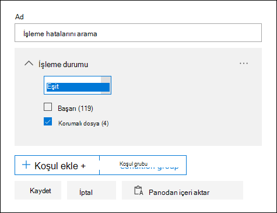
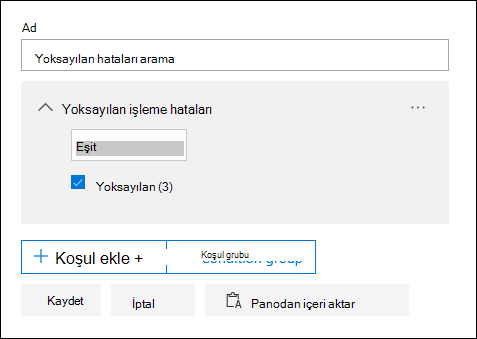

# eBulma'da tek öğe hatası düzeltmesi (Premium)

Hata düzeltme, Microsoft Purview eKeşif (Premium) kullanıcılara eKeşif'in (Premium) içeriği düzgün bir şekilde işlemesini engelleyen veri sorunlarını düzeltme olanağı sağlar. Örneğin, parola korumalı dosyalar kilitli veya şifrelenmiş olduğundan işlenemez. Daha önce bu [iş akışını](error-remediation-when-processing-data-in-advanced-ediscovery.md) kullanarak hataları yalnızca toplu olarak düzeltebiliyorsunuz. Ancak bazen, bu dosyalardan herhangi birinin araştırdığınız olaya yanıt vermediğinden emin olmadığınız durumlarda birden çok dosyadaki hataları düzeltmek mantıklı değildir. Yanıt verme konusunda önceden karar vermenize yardımcı olmak için dosya meta verilerini (dosya konumu veya erişimi olan kişiler gibi) gözden geçirme fırsatınız olmadan önce hataları düzeltmeniz de mantıklı olmayabilir. *Tek öğe hatasını düzeltme* adlı yeni bir özellik, eBulma yöneticilerine işleme hatası olan dosyaların meta verilerini görüntüleme ve gerekirse hatayı doğrudan gözden geçirme kümesinde düzeltme olanağı sağlar. Makalede, bir gözden geçirme kümesindeki işleme hatalarıyla dosyaları tanımlama, yoksayma ve düzeltme işlemleri açıklanır.

## Hataları olan belgeleri tanımlama

Gözden geçirme kümesinde işleme hataları olan belgeler artık tanımlanır (başlıkla). Hatayı düzeltebilir veya yoksayabilirsiniz. Aşağıdaki ekran görüntüsünde, parola korumalı bir gözden geçirme kümesindeki bir Word belgesinin işleme hatası başlığı gösterilmektedir. Ayrıca, işleme hataları olan belgelerin dosya meta verilerini görüntüleyebileceğinize de dikkat edin.

Ayrıca, [bir gözden geçirme kümesindeki belgeleri sorgularken](review-set-search.md) **İşleme durumu** koşulunu kullanarak işleme hataları olan belgeleri de arayabilirsiniz.

### Hataları yoksay

İşleme hatası başlığında Yoksay'a tıklayarak bir işleme hatasını **yoksayabilirsiniz** . Bir hatayı yoksaydığınızda, belge [toplu hata düzeltme iş akışından](error-remediation-when-processing-data-in-advanced-ediscovery.md) kaldırılır. Bir hata yoksayıldıktan sonra, belge başlığı rengi değişir ve işleme hatasının yoksayıldığını gösterir. İstediğiniz zaman Geri Al'a tıklayarak hatayı yoksayma kararını **geri alabilirsiniz**.

Ayrıca, gözden geçirme kümesindeki belgeler sorgulanırken *Yoksayılan işleme hataları koşulu kullanılarak yoksayılan işleme hatası* olan tüm belgeleri de arayabilirsiniz.

## Belgeyi hatalarla düzeltme

Bazen belgelerdeki bir işleme hatasını düzeltmeniz (parolayı kaldırarak, şifrelenmiş bir dosyanın şifresini çözerek veya bozuk bir belgeyi kurtararak) ve ardından düzeltilen belgeyi gözden geçirme kümesine eklemeniz gerekebilir. Bu, hata belgesini gözden geçirmenize ve gözden geçirme kümesindeki diğer belgelerle birlikte dışarı aktarmanıza olanak tanır. 

Tek bir belgeyi düzeltmek için şu adımları izleyin:

1. Dosyanın bir kopyasını yerel bir bilgisayara indirmek için **Özgün dosyayı** **indir'e** >  tıklayın.

   

2. Dosyadaki hatayı çevrimdışı olarak düzeltin. Şifre çözme yazılımı gerektiren şifrelenmiş dosyalar için parola korumasını kaldırmak için parolayı sağlayın ve dosyayı kaydedin veya parola cracker kullanın. Dosyayı düzeltdikten sonra sonraki adıma geçin.

3. Gözden geçirme kümesinde, düzeltmiş olduğunuz işleme hatasını içeren dosyayı seçin ve ardından **Düzeltme'ye** tıklayın.

   

4. **Gözat'a** tıklayın, düzeltilmiş dosyanın yerel bilgisayarınızdaki konumuna gidin ve dosyayı seçin.

   

    Düzeltilen dosya seçtikten sonra, otomatik olarak gözden geçirme kümesine yüklenir. Dosyanın işleme durumunu izleyebilirsiniz.

    

   İşlem tamamlandıktan sonra, düzeltilmiş belgeyi görüntüleyebilirsiniz.

    

Belge düzeltildiğinde ne olacağı hakkında daha fazla bilgi için bkz. [Dosyalar düzeltildiğinde ne olur](error-remediation-when-processing-data-in-advanced-ediscovery.md#what-happens-when-files-are-remediated)?

## Düzeltilmiş belgeleri arama

**Anahtar Sözcükler** koşulu kullanılarak ve şu özellik:değer çifti belirtilerek düzeltilen bir gözden geçirme kümesindeki tüm belgeleri arayabilirsiniz: **IsFromErrorRemediation:true**. Bu özellik, belgeleri bir gözden geçirme kümesinden dışarı aktardığınızda dışarı aktarma yükleme dosyasında da kullanılabilir.
