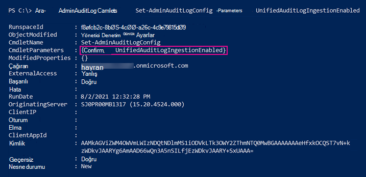
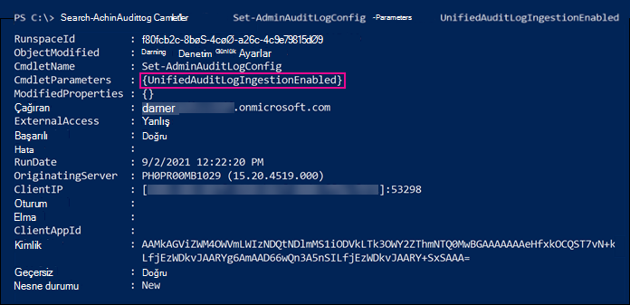

# <a name="turn-auditing-on-or-off"></a>Denetimi açma veya kapatma

[!include[Purview banner](../includes/purview-rebrand-banner.md)]

Microsoft 365 ve Office 365 kurumsal kuruluşlar için denetim günlüğü varsayılan olarak açılır. Ancak yeni bir Microsoft 365 veya Office 365 kuruluş ayarlarken kuruluşunuzun denetim durumunu doğrulamanız gerekir. Yönergeler için bu [makalenin Kuruluşunuzun denetim durumunu doğrulama](#verify-the-auditing-status-for-your-organization) bölümüne bakın. 

Microsoft Purview uyumluluk portalında denetim açıkken, kuruluşunuzdaki kullanıcı ve yönetici etkinlikleri denetim günlüğüne kaydedilir ve kullanıcılara atanan lisansa bağlı olarak 90 gün boyunca ve bir yıla kadar saklanır. Ancak, kuruluşunuzun denetim günlüğü verilerini kaydetmek ve tutmak istememesi için nedenleri olabilir. Bu gibi durumlarda, genel yönetici Microsoft 365 denetimi kapatmaya karar verebilir.

> [!IMPORTANT]
> Microsoft 365 denetimi kapatırsanız, kuruluşunuzun denetim verilerine erişmek için Office 365 Yönetim Etkinliği API'sini veya Microsoft Sentinel'i kullanamazsınız. Bu makaledeki adımları izleyerek denetimi kapatmak, uyumluluk portalını kullanarak denetim günlüğünde arama yaptığınızda veya Exchange Online PowerShell'de **Search-UnifiedAuditLog** cmdlet'ini çalıştırdığınızda hiçbir sonuç döndürülmeyecek anlamına gelir. Bu, denetim günlüklerinin Office 365 Yönetim Etkinliği API'si veya Microsoft Sentinel aracılığıyla kullanılamayacağı anlamına da gelir.
  
## <a name="before-you-turn-auditing-on-or-off"></a>Denetimi açmadan veya kapatmadan önce

- Microsoft 365 kuruluşunuzda denetimi açmak veya kapatmak için Exchange Online'da Denetim Günlükleri rolüne atanmış olmanız gerekir. Varsayılan olarak, bu rol Exchange yönetim merkezindeki **İzinler** sayfasındaki Uyumluluk Yönetimi ve Kuruluş Yönetimi rol gruplarına atanır. Microsoft 365'deki genel yöneticiler, Exchange Online'deki Kuruluş Yönetimi rol grubunun üyeleridir.

    > [!NOTE]
    > Denetimi açmak veya kapatmak için kullanıcılara Exchange Online izinleri atanmalıdır. Kullanıcılara uyumluluk portalındaki **İzinler sayfasında Denetim Günlükleri** rolünü atarsanız, denetimi açamaz veya kapatamaz. Bunun nedeni, temel alınan cmdlet'in Exchange Online bir PowerShell cmdlet'i olmasıdır.

- Denetim günlüğünde arama yapma hakkında adım adım yönergeler için bkz. [Denetim günlüğünde arama](search-the-audit-log-in-security-and-compliance.md) yapma. Microsoft 365 Yönetim Etkinliği API'si hakkında daha fazla bilgi için bkz. [Microsoft 365 Yönetim API'leriyle Kullanmaya başlayın](/office/office-365-management-api/get-started-with-office-365-management-apis).

## <a name="verify-the-auditing-status-for-your-organization"></a>Kuruluşunuz için denetim durumunu doğrulama

Kuruluşunuzda denetimin açık olduğunu doğrulamak için [Exchange Online PowerShell'de](/powershell/exchange/connect-to-exchange-online-powershell) aşağıdaki komutu çalıştırabilirsiniz:

```powershell
Get-AdminAuditLogConfig | FL UnifiedAuditLogIngestionEnabled
```

_UnifiedAuditLogIngestionEnabled_ özelliği için değeri`True`, denetimin açık olduğunu gösterir. değeri `False` , denetimin açık olmadığını gösterir.

> [!NOTE]
> PowerShell Exchange Online de önceki komutu çalıştırdığınızdan emin olun. Bu komutu çalıştırmak için Güvenlik & Uyumluluk PowerShell'i kullanamazsınız.

## <a name="turn-on-auditing"></a>Denetimi açma

Kuruluşunuzda denetim açık değilse uyumluluk portalında veya powershell Exchange Online kullanarak bu özelliği açabilirsiniz. Denetim günlüğünde arama yaparken sonuçları döndürebilmeniz için denetimi açmanız birkaç saat sürebilir.
  
### <a name="use-the-compliance-center-to-turn-on-auditing"></a>Denetimi açmak için uyumluluk merkezini kullanma

1. <https://compliance.microsoft.com> adresine gidin ve oturum açın.

2. Uyumluluk portalının sol gezinti bölmesinde **Denetim'e** tıklayın.

   Kuruluşunuzda denetim açık değilse, kullanıcı ve yönetici etkinliğini kaydetmeye başlamanızı isteyen bir başlık görüntülenir.

   

3. **Kullanıcı ve yönetici etkinliği kaydını başlat** başlığına tıklayın.

   Değişikliğin geçerli olması 60 dakika kadar sürebilir.

### <a name="use-powershell-to-turn-on-auditing"></a>Denetimi açmak için PowerShell kullanma

1. [PowerShell'i Exchange Online Bağlan](/powershell/exchange/connect-to-exchange-online-powershell).

2. Denetimi açmak için aşağıdaki PowerShell komutunu çalıştırın.

    ```powershell
    Set-AdminAuditLogConfig -UnifiedAuditLogIngestionEnabled $true
    ```

    Değişikliğin geçerlilik kazanmasının 60 dakika kadar sürebileceğini belirten bir ileti görüntülenir.
  
## <a name="turn-off-auditing"></a>Denetimi kapatma

Denetimi kapatmak için Exchange Online PowerShell kullanmanız gerekir.
  
1. [PowerShell'i Exchange Online Bağlan](/powershell/exchange/connect-to-exchange-online-powershell).

2. Denetimi kapatmak için aşağıdaki PowerShell komutunu çalıştırın.

    ```powershell
    Set-AdminAuditLogConfig -UnifiedAuditLogIngestionEnabled $false
    ```

3. Bir süre sonra denetimin kapalı (devre dışı) olduğunu doğrulayın. Bunu yapmanın iki yolu vardır:

    - Exchange Online PowerShell'de aşağıdaki komutu çalıştırın:

      ```powershell
      Get-AdminAuditLogConfig | FL UnifiedAuditLogIngestionEnabled
      ```

      _UnifiedAuditLogIngestionEnabled_ özelliğinin değeri`False`, denetimin kapalı olduğunu gösterir.

    - Uyumluluk portalında **Denetim** sayfasına gidin.

      Kuruluşunuzda denetim açık değilse, kullanıcı ve yönetici etkinliğini kaydetmeye başlamanızı isteyen bir başlık görüntülenir.

## <a name="audit-records-when-auditing-status-is-changed"></a>Denetim durumu değiştirildiğinde kayıtları denetleme

Kuruluşunuzdaki denetim durumundaki değişiklikler kendileri denetleniyor. Bu, denetim açık veya kapalı olduğunda denetim kayıtlarının günlüğe kaydedildiğini gösterir. Exchange yönetici denetim günlüğünde bu denetim kayıtlarını arayabilirsiniz.

Denetimi açar veya kapatırken oluşturulan denetim kayıtlarını Exchange yönetici denetim günlüğünde aramak için [PowerShell'Exchange Online](/powershell/exchange/connect-to-exchange-online-powershell) aşağıdaki komutu çalıştırın:

```powershell
Search-AdminAuditLog -Cmdlets Set-AdminAuditLogConfig -Parameters UnifiedAuditLogIngestionEnabled
```

Bu olaylar için denetim kayıtları, denetim durumunun ne zaman değiştirildiği, değiştiren yönetici ve değişikliği yapmak için kullanılan bilgisayarın IP adresi hakkında bilgi içerir. Aşağıdaki ekran görüntüleri, kuruluşunuzdaki denetim durumunu değiştirmeye karşılık gelen denetim kayıtlarını gösterir.

### <a name="audit-record-for-turning-on-auditing"></a>Denetimi açmak için denetim kaydı



*CmdletParameters* özelliğindeki değeri`Confirm`, uyumluluk merkezinde veya **Set-AdminAuditLogConfig -UnifiedAuditLogIngestionEnabled $true cmdlet'ini** çalıştırarak birleşik denetim günlüğünün açık olduğunu gösterir.

### <a name="audit-record-for-turning-off-auditing"></a>Denetimi kapatmak için denetim kaydı



değeri `Confirm` *CmdletParameters* özelliğine dahil edilmez. Bu, **Set-AdminAuditLogConfig -UnifiedAuditLogIngestionEnabled $false** komutu çalıştırılarak birleşik denetim günlüğünün kapatıldığını gösterir.

Exchange yönetici denetim günlüğünde arama yapma hakkında daha fazla bilgi için bkz[. Search-AdminAuditLog](/powershell/module/exchange/search-adminauditlog).
