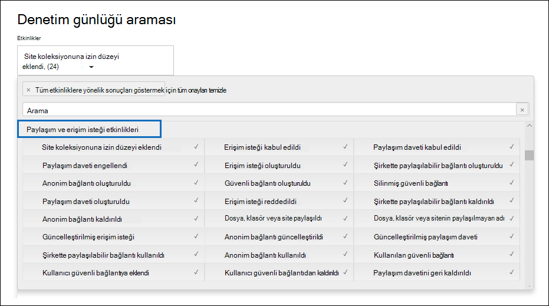

# Denetim günlüğünde paylaşım denetimini kullanma

[!include[Purview banner](../includes/purview-rebrand-banner.md)]

Paylaşım, SharePoint Online ve OneDrive İş'da önemli bir etkinliktir ve kuruluşlarda yaygın olarak kullanılır. Yöneticiler, kuruluşlarında paylaşımın nasıl kullanıldığını belirlemek için denetim günlüğündeki paylaşım denetimini kullanabilir. 
  
## SharePoint Paylaşımı şeması

Paylaşım olayları (paylaşım ilkesi ve paylaşım bağlantıları ile ilgili olaylar dahil değildir), dosya ve klasörle ilgili olaylardan birincil bir şekilde farklıdır: bir kullanıcı başka bir kullanıcı üzerinde etkisi olan bir eylem gerçekleştiriyor. Örneğin, A Kullanıcısı bir kaynak B Kullanıcısına bir dosyaya erişim verdiğinde. Bu örnekte, A kullanıcısı  *rol alan kullanıcı*  , B kullanıcısı ise  *hedef kullanıcıdır*. SharePoint Dosya şemasında, hareket eden kullanıcının eylemi yalnızca dosyanın kendisini etkiler. A Kullanıcısı bir dosyayı açtığında, **FileAccessed** olayında gereken tek bilgi, eyleme geçen kullanıcıdır. Bu farkı gidermek için, paylaşım olayları hakkında daha fazla bilgi yakalayan *SharePoint Paylaşımı şeması* adlı ayrı bir şema vardır. Bu, yöneticilerin kaynağı kimin paylaştığını ve kaynağın paylaşıldığı kullanıcıyı görünür olmasını sağlar. 
  
Paylaşım şeması, bir denetim kaydında paylaşım olaylarıyla ilgili iki ek alan sağlar: 
  
- **TargetUserOrGroupType:** Hedef kullanıcının veya grubun Üye, Konuk, SharePointGroup, SecurityGroup veya İş Ortağı olup olmadığını tanımlar.

- **TargetUserOrGroupName:** Bir kaynağın paylaşıldığı hedef kullanıcı veya grubun UPN'sini veya adını depolar (Önceki örnekte B kullanıcısı). 

Bu iki alan, denetim günlüğü şemasındaki Kullanıcı, İşlem ve Tarih gibi diğer özelliklere ek olarak  *, hangi*  kullanıcının  *hangi*  kaynağı  *kim*  ve  *ne zaman* paylaştığı hakkında tam bir hikaye anlatabilir. 
  
Paylaşım hikayesi için önemli olan başka bir şema özelliği vardır. Denetim günlüğü arama sonuçlarını dışarı aktardığınızda, dışarı aktarılan CSV dosyasındaki **AuditData** sütunu paylaşım olayları hakkındaki bilgileri depolar. Örneğin, bir kullanıcı bir siteyi başka bir kullanıcıyla paylaştığında bu, hedef kullanıcıyı bir SharePoint grubuna ekleyerek gerçekleştirilir. **AuditData** sütunu, yöneticilere bağlam sağlamak için bu bilgileri yakalar. **AuditData** sütunundaki bilgileri ayrıştırma yönergeleri için [2. Adıma](#step-2-use-the-powerquery-editor-to-format-the-exported-audit-log) bakın.

## Olayları paylaşma SharePoint

Paylaşım, bir kullanıcı ( *hareket eden* kullanıcı) bir kaynağı başka bir kullanıcıyla ( *hedef* kullanıcı) paylaşmak istediğinde tanımlanır. Bir kaynağı dış kullanıcıyla (kuruluşunuzun dışında olan ve kuruluşunuzun Azure Active Directory konuk hesabı olmayan bir kullanıcı) paylaşmayla ilgili denetim kayıtları, denetim günlüğüne kaydedilen aşağıdaki olaylarla tanımlanır:

- **SharingInvitationCreated:** Kuruluşunuzdaki bir kullanıcı bir kaynağı (büyük olasılıkla bir site) dış kullanıcıyla paylaşmayı denedi. Bu, hedef kullanıcıya gönderilen bir dış paylaşım davetine neden olur. Bu noktada kaynağa erişim verilmez.

- **SharingInvitationAccepted:** Dış kullanıcı, hareket eden kullanıcı tarafından gönderilen paylaşım davetini kabul etti ve artık kaynağa erişimi var.

- **AnonymousLinkCreated:** Bir kaynak için anonim bir bağlantı ("Herkes" bağlantısı olarak da adlandırılır) oluşturulur. Anonim bağlantı oluşturulup kopyalanabildiği için, anonim bağlantı içeren tüm belgelerin hedef kullanıcıyla paylaşıldığını varsaymak mantıklıdır.

- **AnonymousLinkUsed:** Adından da anlaşılacağı gibi, bir kaynağa erişmek için anonim bir bağlantı kullanıldığında bu olay günlüğe kaydedilir. 

- **SecureLinkCreated:** Kullanıcı, bir kaynağı belirli bir kişiyle paylaşmak için "belirli kişiler bağlantısı" oluşturmuştur. Bu hedef kullanıcı, kuruluşunuzun dışında olan biri olabilir. Kaynağın paylaşıldığı kişi **, AddedToSecureLink** olayının denetim kaydında tanımlanır. Bu iki olayın zaman damgaları neredeyse aynıdır.

- **AddedToSecureLink:** Belirli bir kişi bağlantısına bir kullanıcı eklendi. İlgili belirli kişiler bağlantısına eklenen kullanıcıyı tanımlamak için bu olaydaki **TargetUserOrGroupName** alanını kullanın. Bu hedef kullanıcı, kuruluşunuzun dışında olan biri olabilir.

## Denetim iş akışını paylaşma
  
Kullanıcı (hareket eden kullanıcı) bir kaynağı başka bir kullanıcıyla (hedef kullanıcı) paylaşmak istediğinde, SharePoint (veya OneDrive İş) önce hedef kullanıcının e-posta adresinin kuruluşun dizinindeki bir kullanıcı hesabıyla zaten ilişkili olup olmadığını denetler. Hedef kullanıcı dizindeyse (ve buna karşılık gelen bir konuk kullanıcı hesabı varsa), SharePoint aşağıdakileri yapar:
  
-  Hedef kullanıcıyı uygun SharePoint grubuna ekleyerek kaynağa erişmek için hedef kullanıcı izinlerini hemen atar ve bir **AddedToGroup** olayını günlüğe kaydeder. 
    
- Hedef kullanıcının e-posta adresine bir paylaşım bildirimi gönderir.
    
- **SharingSet** olayını günlüğe kaydeder. Bu olay, denetim günlüğü arama aracının etkinlik seçicisindeki **Paylaşım ve erişim isteği etkinlikleri** altında "Paylaşılan dosya, klasör veya site" kolay adına sahiptir. [1. Adım'daki ekran görüntüsüne](#step-1-search-for-sharing-events-and-export-the-results-to-a-csv-file) bakın. 
    
Hedef kullanıcının kullanıcı hesabı dizinde değilse, SharePoint aşağıdakileri yapar: 
    
   - Kaynağın nasıl paylaşıldığından yola çıkarak aşağıdaki olaylardan birini günlüğe kaydeder:
   
      - **AnonymousLinkCreated**
   
      - **SecureLinkCreated**
   
      - **AddedToSecureLink** 

      - **SharingInvitationCreated** (bu olay yalnızca paylaşılan kaynak bir site olduğunda günlüğe kaydedilir)
    
   - Hedef kullanıcı kendilerine gönderilen paylaşım davetini kabul ettiğinde (davetteki bağlantıya tıklayarak), SharePoint bir **SharingInvitationAccepted** olayını günlüğe kaydeder ve kaynağa erişmek için hedef kullanıcı izinlerini atar. Hedef kullanıcıya anonim bir bağlantı gönderilirse, hedef kullanıcı kaynağa erişmek için bağlantıyı kullandıktan sonra **AnonymousLinkUsed** olayı günlüğe kaydedilir. Güvenli bağlantılar için, dış kullanıcı kaynağa erişmek için bağlantıyı kullandığında **FileAccessed** olayı günlüğe kaydedilir.

Hedef kullanıcıyla ilgili ek bilgiler de günlüğe kaydedilir. Örneğin, davetin olduğu kullanıcının kimliği ve daveti kabul eden kullanıcı. Bazı durumlarda, bu kullanıcılar (veya e-posta adresleri) farklı olabilir. 

## Dış kullanıcılarla paylaşılan kaynakları tanımlama

Yöneticiler için yaygın bir gereksinim, kuruluş dışındaki kullanıcılarla paylaşılan tüm kaynakların listesini oluşturmaktır. Yöneticiler, Office 365'da paylaşım denetimini kullanarak bu listeyi oluşturabilir. Şöyle yapılır:
  
### 1. Adım: Paylaşım olaylarını arama ve sonuçları CSV dosyasına aktarma

İlk adım, olay paylaşımı için denetim günlüğünde arama yapmaktır. Denetim günlüğünde arama yapma hakkında daha fazla bilgi (gerekli izinler dahil) için bkz. [Denetim günlüğünde arama](search-the-audit-log-in-security-and-compliance.md) yapma.
  
1. <https://compliance.microsoft.com> adresine gidin.

2. İş veya okul hesabınızı kullanarak oturum açın.

3. Microsoft Purview uyumluluk portalının sol bölmesinde **Denetim'e** tıklayın.

    **Denetim** sayfası görüntülenir.

4. **Paylaşımla** ilgili olayları aramak için Etkinlikler'in altında **Paylaşım ve erişim isteği etkinlikleri'ne** tıklayın. 

    
  
5. Bu dönemde gerçekleşen paylaşım olaylarını bulmak için bir tarih ve saat aralığı seçin. 

6. Aramayı çalıştırmak için **Ara'ya** tıklayın. 

7. Aramanın çalışması bittiğinde ve sonuçlar görüntülendiğinde Sonuçları \> **dışarı aktar** **Tüm sonuçları indir'e** tıklayın.

    Dışarı aktarma seçeneğini seçtikten sonra, pencerenin alt kısmındaki bir ileti CSV dosyasını açmanızı veya kaydetmenizi ister.

8. **Farklı Kaydet'e** \> tıklayın ve CSV dosyasını yerel bilgisayarınızdaki bir klasöre kaydedin. 

### 2. Adım: Dışarı aktarılan denetim günlüğünü biçimlendirmek için PowerQuery Düzenleyicisi'ni kullanma

Sonraki adım, **AuditData** sütunundaki her özelliği (çok özellikli bir JSON nesnesinden oluşan) kendi sütununa bölmek için Excel'daki Power Query Düzenleyicisi JSON dönüştürme özelliğini kullanmaktır. Bu, paylaşımla ilgili kayıtları görüntülemek için sütunları filtrelemenize olanak tanır

Adım adım yönergeler için, denetim günlüğü kayıtlarını dışarı aktarma[, yapılandırma ve görüntüleme](export-view-audit-log-records.md#step-2-format-the-exported-audit-log-using-the-power-query-editor) başlığı altındaki "2. Adım: Power Query Düzenleyicisi kullanarak dışarı aktarılan denetim günlüğünü biçimlendirme" bölümüne bakın.

### 3. Adım: Dış kullanıcılarla paylaşılan kaynaklar için CSV dosyasını filtreleme

Sonraki adım, daha önce SharePoint paylaşım olayları bölümünde açıklanan paylaşımla ilgili farklı olaylar için CSV'yi [filtrelemektir](#sharepoint-sharing-events). Alternatif olarak, **TargetUserOrGroupType** sütununu filtreleyerek bu özelliğin değerinin **Guest** olduğu tüm kayıtları görüntüleyebilirsiniz. 

PowerQuery düzenleyicisini kullanarak CSV dosyasını hazırlamak için önceki adımda yer alan yönergeleri izledikten sonra aşağıdakileri yapın:
    
1. 2. Adımda oluşturduğunuz Excel dosyasını açın. 

2. **Giriş** sekmesinde **, Filtre & Sırala'ya** ve ardından **Filtre'ye** tıklayın.
    
3. **İşlemler** sütunundaki **Sıralama & Filtresi** açılan listesinde tüm seçimleri temizleyin, ardından aşağıdaki paylaşımla ilgili olaylardan birini veya daha fazlasını seçin ve **tamam'a** tıklayın.
 
   - **SharingInvitationCreated**
   
   - **AnonymousLinkCreated**
   
   - **SecureLinkCreated**
   
   - **AddedToSecureLink** 
    
    Excel seçtiğiniz olayların satırlarını görüntüler.
    
4. **TargetUserOrGroupType** adlı sütuna gidin ve seçin. 
    
5. **Sıralama & Filtre** açılan listesinde tüm seçimleri temizleyin, ardından **TargetUserOrGroupType:Guest'ı** seçin ve **Tamam'a** tıklayın.
    
    Şimdi Excel, dış kullanıcılar **TargetUserOrGroupType:Guest** değeriyle tanımlandığından, olayları paylaşma ve hedef kullanıcının kuruluşunuzun dışında olduğu satırları görüntüler. 
  
> [!TIP]
> Görüntülenen denetim kayıtları için **ObjectId** sütunu hedef kullanıcıyla paylaşılan kaynağı tanımlar; örneğin  `ObjectId:https:\/\/contoso-my.sharepoint.com\/personal\/sarad_contoso_com\/Documents\/Southwater Proposal.docx`, .
