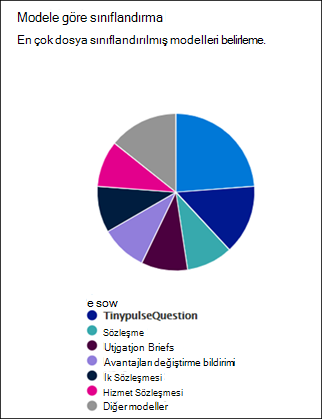

# Microsoft SharePoint Syntex'ta belge anlama modeli kullanım SharePoint Syntex

 

> [!VIDEO https://www.microsoft.com/videoplayer/embed/RE4GnhX]  

 

SharePoint Syntex merkeziniz, içerik merkezinden yayımlanmış modellerinizi nasıl kullandığı hakkında daha fazla bilgi sağlamak için model kullanım analizi sağlar. İçerik <b>merkezinin son 30</b> gün içinde modellerinin performansı, aşağıdaki grafik ve listelerde sağlanan 30 günlük kullanım analizi verilerini içerir:

- Modele göre sınıflandırma
- Kitaplı sınıflandırma
- Model kullanımı 

   

### Varsayılan içerik merkezinde model kullanım verilerini toplama

Varsayılan SharePoint Syntex, kurulum sırasında varsayılan içerik merkezi oluşturulur. Gerektiğinde başka içerik merkezleri de oluşturulabilir. Örneğin, departmanlar modellerini oluşturmak ve yönetmek için kendi içerik merkezleri oluşturabilir. 

Model kullanım analiziyle ilgili olarak, şunları unutmayın:

- Varsayılan içerik merkeziniz, ek içerik merkezlerinde oluşturulanlar da dahil olmak üzere, kuruluş dahil olmak üzere tüm içerik merkezleri ve modelleri için model kullanım çözümlemelerini gösterir. Bu, içerik yöneticilerine ve diğer proje katılımcılarına şirket genelinde içerik merkezlerini ve modellerini yönetmek ve denetlemek için merkezi bir portal sağlar.  
- Diğer içerik merkezleri yalnızca içinde oluşturulan modeller için model kullanım çözümlemelerini gösterir. Bu, içerik yöneticilerine yalnızca ilgili modellerin kullanım verileriyle ilgili içgörüler sağlar.

## Modele göre sınıflandırma

     

Model **pastası modeline göre** sınıflandırma grafiği, en çok dosya sınıflandırılmış modelleri görüntüler. Yayımlanmış her modeli, içerik merkezinde tüm yayımlanan modeller tarafından işlenen toplam dosyaların yüzdesi olarak gösterir.

Ayrıca her model, **karşıya yüklenen dosyaların** model tarafından başarıyla analiz edilen yüzdesini Tamlık Oranı olarak gösterir. Düşük tamlık oranı, model veya analize alınan dosyalarla ilgili sorunlar olduğu anlamına gelir.

## Kitaplı sınıflandırma

     

Kitaplık **çubuğuna göre sınıflandırma** çubuğu grafiği, kuruluş içinde içeriğin daha etkili anlaşılmasını belirlemenize yardımcı olur.  Size yalnızca her model için zaman içinde işlenen dosyaların sayısını değil, grafikte bir sütun seçerek de modelin uygulandığı belge kitaplıklarını gösterir.

## Model kullanımı

Model Kullanımı listesinde, içerik merkezi aracılığıyla oluşturulan modellerin kullanım çözümlemeleri görüntülenir.  

> [!NOTE]
> Varsayılan içerik merkezindeysiniz ve kuruluş içinde ek içerik merkezleriniz varsa, model kullanım listesi içerik merkezine göre gruplanacak.

Model kullanım listesinde yer alan her modelde kullanım verileri görüntülenir:

- Sınıflandırılmış öğe sayısı: Model tarafından işlenen dosya sayısı.
- Ortalama güven puanı: Dosyalar üzerinde çalıştırlarda modelin ortalama doğruluk puanı.
- Hedef liste URL'si: SharePoint uygulandığı belge kitaplığının adı.

## Ayrıca Bkz
[Sınıflandırıcı oluşturma](create-a-classifier.md)

[Ayıklaıcı oluşturma](create-an-extractor.md)

[Belge Anlama'ya genel bakış](document-understanding-overview.md)

[Form işleme modeli oluşturma](create-a-form-processing-model.md)  
