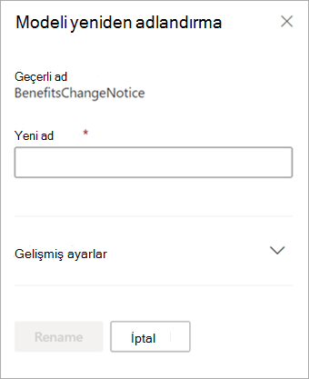

# Microsoft SharePoint Syntex'da modeli yeniden adlandırma

Bir noktada, belge anlama modelini yeniden adlandırmak iyi olabilir. Bunun yaygın bir örneği, modelin ilk taslağını  hazırlarken son adı iyi iyi düşünemeyebileceksiniz (örneğin, buna "AlexWilburModel1" adını verdiysiniz). Modelin sonlandırılması ve kullanımının ne kadar yakın olduğunu fark ettiyken, daha doğru bir adın "Sözleşme Yenilemeleri" olduğunu fark etti ve adını yeniden adlandırmak istiyor oldu.  

Diğer bir örnek de, kuruluş bir işlem veya belge türüne farklı bir adla başvurarak karar vermesindedir. Örneğin, modelinizi oluşturduk ve bunu uygulamaya hazır olduktan sonra, organizasyonunız tüm "Sözleşmeler" için artık resmi olarak "Sözleşmeler" olarak adlandırılan velilerde yer almaktadır. Gerekirse modelinizi "Sözleşme Yenilemeleri" olan modelinizi "Sözleşme Yenilemeleri" olarak yeniden adlandırmayı seçebilirsiniz.

> [!IMPORTANT]
> Belge anlama modelini yalnızca belge kitaplığına uygulanmadı olarak yeniden adlandırabilirsiniz. 

Modeli yeniden adlandırmak, modelle [ilişkilendirilmiş içerik](/sharepoint/governance/content-type-and-workflow-planning#content-type-overview) türünü de yeniden adlandırıyor.

## Modeli yeniden adlandırma

Belge anlama modelini yeniden adlandırmak için bu adımları izleyin.

1. Model listenizi görmek için içerik **merkezinde** Modeller'i seçin.

2. Modeller **sayfasında** , yeniden adlandırmak istediğiniz modeli seçin.

3. Şeridi veya Eylemleri göster düğmesini **kullanarak** (model adının yanında) Yeniden Adlandır'ı **seçin**.  

      

4. Modeli yeniden **adlandır panelinde** :

   a. Yeni **ad'ın** altında, yeniden adlandırmak istediğiniz modelin yeni adını girin. 

      

   b. (İsteğe bağlı) Gelişmiş **ayarlar'ın** altında, var olan bir içerik türünü ilişkilendirmek isteyip [istemiyorsanız bunu seçin](/sharepoint/governance/content-type-and-workflow-planning#content-type-overview). Varolan bir **içerik türünü kullan'ı seçerseniz** model, seçilen içerik türüyle eş olacak şekilde yeniden adlandırılır.

5. Yeniden **Adlandır'ı seçin**.

## Ayrıca Bkz
[Sınıflandırıcı oluşturma](create-a-classifier.md)

[Ayıklaıcı oluşturma](create-an-extractor.md)

[Ayıklayı yeniden adlandırma](rename-an-extractor.md)

[Belge Anlama'ya genel bakış](document-understanding-overview.md)

[Açıklama türleri](explanation-types-overview.md)

[Model uygulama](apply-a-model.md) 
