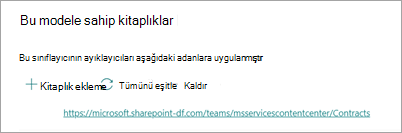

# Adım 1. Sözleşme SharePoint Syntex tanımlamak ve veri ayıklamak için veri ayıklamayı kullanma

Kurumuz, tüm sözleşme belgelerini, size gelen birçok dosyadan belirleyecek ve sınıflandıracak bir yol bu şekilde sınıflandırmak için bir yol sunar. Ayrıca, tanımlanan sözleşme dosyalarının her biri (örneğin *İstemci, Yüklenici* ve Ücret tutarı) ile bazı önemli *öğeleri hızla* *görüntüleyebiliyor olmak da istiyor olun*. Bunu, Belge Anlama [modeli SharePoint Syntex](index.md) bir belge kitaplığına uygulamak için Belge Kitaplığı'SharePoint Syntex kullanarak, bunuabilirsiniz.

## Işleme genel bakış

[Belge kullanımı](document-understanding-overview.md) yapay zeka (AI) modellerini, dosyaların sınıflandırması ve bilgi ayıklamayı otomatikleştirmek için kullanır. Belge anlama modelleri, ihtiyacınız olan bilgilerin sözleşmeler gibi tablo veya formlarda yer alamaması gereken yapılandırılmamış ve yarı yapılandırılmış belgelerden bilgileri ayıklamak için de en uygun durumdadır. 

Modelleri anlama belgelerinde, hem örnek dosyalar olan bir modeli eğitme hem de modeli belge kitaplığında dosyalar için çalıştırmanız gerekir; PDF'leri, resimleri ve TIFF dosyalarını taramak için Optik Karakter Tanıma (OCR) teknolojisi kullanılır.

1. İlk olarak, tanımlamak istediğiniz içerik türüne (sözleşme) özgü özellikleri aramak üzere modeli "eğitmek" için kullanabileceğiniz en az beş örnek dosya bulun. 

2. Belge SharePoint Syntex kullanarak yeni bir belge anlama modeli oluşturun. Örnek dosyalarınızı kullanarak bir [sınıflandırıcı oluşturmanız gerekir](create-a-classifier.md). Örnek dosyalarınız ile sınıflandırıcıyı eğiterek, ona şirketinizin sözleşmelerde göreceğiniz özelliklere özgü özellikleri aramalarını öğretebilirsiniz. Örneğin, Hizmet [Sözleşmesi, Sözleşme](create-a-classifier.md#create-an-explanation) Koşulları ve Telafi gibi sözleşmeler kapsamındaki belirli dizeleri aramaları *için* bir "açıklama" *oluşturun*. Hatta açıklamanızı, belgenin belirli bölümlerinde veya diğer dizelerin yanında yer alan dizeleri araması için eğitebilirsiniz. Sınıflandırıcınızı gereken bilgilerle eğitmiş olduğunuz zaman, ne kadar verimli olduğunu görmek için modelinizi örnek bir dosya kümesi üzerinde test edin. Test sonrasında, gerekirse açıklamaları daha verimli hale getirirken açıklamalarda değişiklik yapabilirsiniz. 

3. Modelinize göre, her [sözleşmeden belirli veri](create-an-extractor.md) parçalarını çıkarmak için bir ayıklaıcı oluşturabilirsiniz. Örneğin, her sözleşme için en çok kaygılandıkiniz bilgiler müşterinin kim olduğu, yüklenicinin adı ve toplam maliyetidir.

4. Modelinizi başarıyla oluşturdukktan sonra, [modeli SharePoint kitaplığına uygulayabilirsiniz](apply-a-model.md). Belgeleri belge kitaplığına yükledikten sonra, belge anlama modeliniz de kullanılır ve modeliniz içinde tanımlandığı sözleşme içerik türüyle aynı olan tüm dosyaları tanımlayabilir ve sınıflandıracak. Sözleşme olarak sınıflandırılmış tüm dosyalar özel bir kitaplık görünümünde görüntülenir. Dosyalar, ayıklaıcıda tanımlandığı her sözleşmeden değerleri de görüntüler.

   

5. Sözleşmelerinizi tutma ya da güvenlik gereksinimleriniz varsa, modelinizi kullanarak belirli bir süre için sözleşmelerinizi silmenizi önleyen bir  bekletme etiketi veya duyarlılık etiketi uygulayabilir ya da sözleşmelere kimlerin eriş erişeni kısıtlayabilirsiniz.

## Modelinizi oluşturma ve eğitma adımları

> [!NOTE]
> Bu adımlar için Sözleşme Yönetimi Çözümü Varlıkları deposundaki [örnek dosyaları kullanabilirsiniz](https://github.com/pnp/syntex-samples/tree/main/scenario%20assets/Contracts%20Management). Bu deponun örnekleri, hem belge anlama modeli dosyalarını hem de modeli eğitmek için kullanılan dosyaları içerir.

### Sözleşme modeli oluşturma

İlk adım Sözleşme modelinizi oluşturmaktır.

1. İçerik merkezinde Yeni'yi **ve ardından** Model **oluştur'a seçin**.

2. Yeni **belge anlama modeli bölmesindeki** **Ad alanına** modelin adını yazın. Bu sözleşme yönetim çözümü için, modeli Sözleşme olarak *adlayır.*

4. **Oluştur**'u seçin. Bu işlem model için bir giriş sayfası oluşturur. 

    

### Modelinizi bir dosya türünü sınıflandırmak için eğitin

#### Modeliniz için örnek dosyalar ekleme

Sözleşme belgesi olan en az beş örnek dosya ve bir sözleşme belgesi (örneğin, iş bildirimi) olmadığınız bir örnek dosya eklemeniz gerekir. 

1. Modeller ve **Sözleşme >,** Anahtar **eylemleriHizli** >  **dosyalar ekle'nin altında Dosya** **ekle'yi seçin**.

   

2. **Modeliniz için örnek dosyaları seçin sayfasında**, Sözleşme klasörünü açın, kullanmak istediğiniz dosyaları seçin ve ardından Ekle'yi **seçin**. Burada örnek dosyalarınız yoksa, eklemek **için Upload** Seç'i seçin.

#### Dosyaları pozitif veya negatif örnekler olarak etiketleme

1. Modeller Ve **Sözleşme >,** Tuş  >  eylemleri **Altında Dosyaları sınıflandır ve eğitimi çalıştır,** **Sınıflandırıcıyı eğit'i seçin**.

   

2. Modeller **> Sözleşme >** Sözleşme sınıflandırıcısı sayfasında, ilk örnek dosyanın en üstünde yer alan görüntüleyicide, dosyanın oluşturduğunuz Sözleşme modeline bir örnek olup olduğunu soran metin görebilirsiniz. Bu pozitif bir örnekse Evet'i **seçin**. Bu negatif bir örnekse Hayır'ı **seçin**.

3. Sol **tarafta etiketli** örnekler listesinde, örnek olarak kullanmak istediğiniz diğer dosyaları seçin ve bunları etiketlenin. 

     

#### Sınıflandırıcıyı eğitmek için en az bir açıklama ekleme 

1. Model > **Sözleşme > sınıflandırıcısı** sayfasında, Eğitim **sekmesini** seçin.

2. Eğitim **dosyaları bölümünde** , daha önce etiketlemiş olduğunuz örnek dosyaların listesini bulabilirsiniz. Listeden pozitif dosyalardan birini seçerek bu dosyaları görüntüleyicide görüntüleyebilirsiniz.

3. Açıklamalar bölümünde **Yeni'yi** ve **sonra Boş'a** **tıklayın**.

4. Açıklama **oluştur sayfasında** :

    a. Ad **alanına** açıklamanın adını ("Sözleşme" gibi) yazın.

    b. Açıklama türü **alanında** Tümcecik **listesi'ne tıklayın** çünkü bir metin dizesi ekleyin.

    c. **Tümcecik liste** kutusuna dizeyi ("SÖZLEŞME" gibi) yazın. Dizenin büyük **/büyük/harfe** duyarlı olması gerekirse Büyük/harfe duyarlı'ı seçin.

    d. Kaydet ve **eğit'i seçin**.

     

#### Modelinizi test etmek

Sözleşme modelinizi daha önce hiç görülmemiş örnek dosyalar üzerinde testebilirsiniz. Bu isteğe bağlıdır, ancak yararlı bir uygulama olabilir.

1. Model > **Sözleşme > Sınıflandırıcısı sayfasında** Test **sekmesini** seçin. Bu, modeli etiketsiz örnek dosyalarında çalıştırır.

2. Dosyaları **Sına listesinde** , örnek dosyalarınız görüntülenir ve modelin bunları pozitif veya negatif olarak tahmin verip öngördüğü gösterilir. Belgelerinizi belirlemede sınıflandırıcının ne kadar etkili olduğunu belirlemenize yardımcı olması için bu bilgileri kullanın.

     

3. Bitirin ve Eğitimden **Çık'ı seçin**.

### Ayıklaıcı oluşturma ve eğitin

1. Modeller Ve **Sözleşme > Tuş**  > **eylemleriSorları oluşturma ve eğitin seçeneğinin** altında Ayıklaıcı **oluştur'a tıklayın**.

   

2. Yeni **varlık ayıkla panelinde** , Yeni **ad alanına** ayıklaıcının adını yazın. Örneğin, her *sözleşmeden* müşteri adını ayıklamak için İstemci olarak ad girin.

3. Bitirerek Oluştur'a **seçin**.

#### Ayıklamak istediğiniz varlığı etiketle

Ayıklaıcıyı  oluşturduktan sonra, ayıkla sayfası açılır. Burada, örnek dosyalarınızın listesini ve listede ilk dosyanın görüntüleyicide görüntülendiğinden emin olun.

 

Varlığı etiketlemek için:

1. Görüntüleyiciden, dosyalardan ayıklamak istediğiniz verileri seçin. Örneğin, İstemci'yi ayıklamak *için ilk* dosyada istemci değerini vurgularsanız (bu *örnekte, Organik* Ürünleriniz için En İyi) ve ardından Kaydet'i **seçin**. Etiketli örnekler listesinde, Etiket sütununu altında **dosyadan** gelen **değerin görüntüleniyor.**

2. Otomatik **kaydetme için** Sonraki dosya'ya tıklayın ve görüntüleyicide listede bir sonraki dosyayı açın. Ya da **Kaydet'i** seçin ve etiketli örnekler **listesinden başka bir dosya** seçin.

3. Görüntüleyicide, 1. ve 2. adımları yinelayın, ardından etiketi tüm dosyalara kaydedene kadar tekrar edin.

Dosyaları etiketledikten sonra, eğitime devam etme konusunda sizi bilgilendiren bir bildirim başlığı görüntülenir. Daha fazla belge etiketlemeyi veya eğitime ilerlemeyi seçebilirsiniz.

#### Açıklama ekleme

Varlık biçiminin kendisini ve örnek dosyalarda sahip olabileceği değişimleri hakkında ipucu veren bir açıklama oluşturabilirsiniz. Örneğin, tarih değeri aşağıdakiler gibi birçok farklı biçimde olabilir:

- 10/14/2019
- 14 Ekim 2019
- 14 Ekim 2019 Pazartesi

Sözleşme Başlangıç Tarihini *belirlemeye yardımcı olmak* için bir desen açıklaması oluşturabilirsiniz.

1. Açıklamalar bölümünde **Yeni'yi** ve **sonra Boş'a** **tıklayın**.

2. Açıklama **oluştur sayfasında** :

    a. Ad **alanına** açıklamanın adını (örneğin Tarih) *yazın*.

    b. Açıklama türü **alanında Desen** **listesi'ne tıklayın**.

    c. Değer **alanında** , örnek dosyalarda görünecekleri tarih çeşitleleni girin. Örneğin, 00.00.0000 olarak görünen tarih biçimleriniz varsa, belgelerinize görünen çeşitlemeleri girin; örneğin:

    - 0/0/0000
    - 0/00/0000
    - 00/0/0000
    - 00/00/0000

4. Kaydet ve **eğit'i seçin**.

#### Modelinizi yeniden test etmek

Sözleşme modelinizi daha önce hiç görülmemiş örnek dosyalar üzerinde testebilirsiniz. Bu isteğe bağlıdır, ancak yararlı bir uygulama olabilir.

1. Model > **Sözleşme > Sınıflandırıcısı sayfasında** Test **sekmesini** seçin. Bu, modeli etiketsiz örnek dosyalarında çalıştırır.

2. Dosyaları **test edin** listesinde, örnek dosyalarınız görüntülenir ve modelin ihtiyacınız olan bilgileri ayıklayalıp ayıklayamayali olduğunu gösterir. Belgelerinizi belirlemede sınıflandırıcının ne kadar etkili olduğunu belirlemenize yardımcı olması için bu bilgileri kullanın.

3. Bitirin ve Eğitimden **Çık'ı seçin**.

### Modelinizi belge kitaplığına uygulama

Modelinizi belge kitaplığına SharePoint için:

1. Modeller Ve **Sözleşme >,** Anahtar **eylemleriSerkilere** >  **model uygulama'nın altında** Modeli **uygula'ya tıklayın**.

   

2. Sözleşme **Ekle panelinde**, SharePoint uygulamak istediğiniz belge kitaplığını içeren belge kitaplığını içeren belge kitaplığını seçin. Site listede göster yoksa, bulmak için arama kutusunu kullanın. **Ekle**'yi seçin.

    > [!NOTE]
    > Modeli *uygulamakta olduğu belge* *kitaplığında* Liste Yönetme izinlerine veya Düzenleme haklarına sahip olmak gerekir.

3. Siteyi seçin ve modeli uygulamak istediğiniz belge kitaplığını seçin.

4. Model bir içerik türüyle ilişkili olduğundan, bunu kitaplı kitaplı kitaplara uygulayan içerik türü ve görünümünü, sütun olarak göstererek ayıklamış olduğunuz etiketlerle birlikte ekler. Bu görünüm varsayılan olarak kitaplığın varsayılan görünümü olur, ancak isteğe bağlı olarak Gelişmiş ayarlar'ı seçerek ve Bu yeni görünümü varsayılan olarak ayarla onay  kutusunu temizerek bunun varsayılan görünüm  olmadığını seçebilirsiniz.

5. Modeli **kitaplı** kitaplıya uygulamak için Ekle'yi seçin.

6. Modeller **> Sözleşme sayfasında**, Bu **modele** sahip kitaplıklar bölümünde, listelenen sitenin URL'sini SharePoint görebilirsiniz.

    

7.  >  Ayarlar **Library ayarları altında**:

   - Durum adlı bir sütun **ekleyin** ve sütun **türü olarak** Seçim'i seçin.
   - In **gözden geçirme**, **Onaylandı** ve **Reddedildi değerlerini** uygulama.

Modeli belge kitaplığına uyguladikten sonra, belgeleri siteye yüklemeye başlayabilir ve sonuçları görüntüebilirsiniz.

## Sonraki adım

[2. Adım. Sözleşme Microsoft Teams kanalınızı oluşturmak için Sözleşmeler'i kullanma](solution-manage-contracts-step2.md)