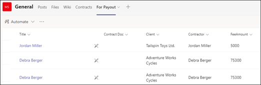

# <a name="step-3-use-power-automate-to-create-the-flow-to-process-your-contracts"></a>Adım 3. Sözleşmelerinizi Power Automate akışı oluşturmak için Sözleşmelerinizi kullanma

Sözleşme Yönetimi kanalınızı oluşturdunız ve belge kitaplığınıza SharePoint ekleyebilirsiniz. Sonraki adım, sözleşmelerinizi işlemeye Power Automate bir akış oluşturmak, SharePoint Syntex modelinizin tanımını ve sınıflarını oluşturmasıdır. Bu adımı, belge [kitaplığınıza bir Power Automate akışı oluşturarak SharePoint ebilirsiniz](https://support.microsoft.com/office/create-a-flow-for-a-list-or-library-in-sharepoint-or-onedrive-a9c3e03b-0654-46af-a254-20252e580d01).

Sözleşme yönetimi çözümünüz için, aşağıdaki eylemleri Power Automate bir sözleşme akışı oluşturmak istiyoruz:

-  Bir sözleşme, sınıf modeliniz tarafından SharePoint Syntex sonra, sözleşme durumunu Gözden geçirmede **olarak değiştirebilirsiniz**.
- Sözleşme daha sonra gözden geçirilir ve onaylanır veya reddedilir.
- Onaylanan sözleşmeler için sözleşme bilgileri, ödeme işlemeye ilişkin bir sekmeye yayınlanır.
- Reddedilen sözleşmeler için, ekip daha fazla çözümleme yapmak için bu durumu bilgilemektedir. 

Aşağıdaki diyagramda sözleşme yönetim Power Automate akış akışlarını gösterir.


## <a name="prepare-your-contract-for-review"></a>Sözleşmenizi gözden geçirme için hazırlama

Bir sözleşme, belgenizi anlama modelinize göre tanımlandı SharePoint Syntex sınıflandırılmışsa, Power Automate akışı önce durumu Gözden geçirmede **olarak değiştirir**.


Dosyayı gözden geçirdikten sonra, durum değerini Gözden geçirildi **olarak değiştirebilirsiniz**.


Sonraki adım, sözleşmenin gözden geçirmeyi bekleyen ve Sözleşme Yönetimi kanalına göndererek, uyarlanabilir bir kart oluşturmaktır.


Aşağıdaki kod, iş akışında bu adım için kullanılan JSON Power Automate dir.

```JSON
{
"$schema": "http://adaptivecards.io/schemas/adaptive-card.json",
"type": "AdaptiveCard",
"version": "1.0",
"body": [
    {
    "type": "TextBlock",
    "text": "Contract approval request",
    "size": "large",
    "weight": "bolder",
     "wrap": true
    },
        {
            "type": "Container",
            "items": [
                {
                    "type": "FactSet",
                    "spacing": "Large",
                    "facts": [
                        {
                            "title": "Client",
                            "value": "@{triggerOutputs()?['body/Client']}"
                        },
                        {
                            "title": "Contractor",
                            "value": "@{triggerOutputs()?['body/Contractor']}"
                        },
                        {
                            "title": "Fee amount",
                            "value": "@{triggerOutputs()?['body/FeeAmount']}"
                        },
                        {
                            "title": "Date created",
                            "value": "@{triggerOutputs()?['body/Modified']} "
                        },
                        {
                            "title": "Link",
                            "value": "[@{triggerOutputs()?['body/{FilenameWithExtension}']}](@{triggerOutputs()?['body/{Link}']})"
                        }
                    ]
                }
            ]
         },
    {
    "type": "TextBlock",
    "text": "Comment:"
    },
        {
            "type": "Input.Text",
            "placeholder": "Enter comments",
            "id": "acComments"
        }
],
"actions": [
    {
    "type": "Action.Submit",
    "title": "Approve",
    "data": {
        "x": "Approve"
    }
    },
    {
    "type": "Action.Submit",
    "title": "Reject",
    "data": {
        "x": "Reject"
    }
    }
]
}
```


## <a name="conditional-context"></a>Koşullu bağlam

Akışınıza göre, bundan sonra sözleşmenizin onaylandırılacak veya reddedilecek bir  [koşul oluşturmanız](#if-the-contract-is-approved) [gerekir](#if-the-contract-is-rejected).


## <a name="if-the-contract-is-approved"></a>Sözleşme onaylanırsa

Bir sözleşme onaylandıktan sonra aşağıdakiler gerçekleşir:

- Sözleşmeler **sekmesinde** , sözleşme kartının durumu Onaylandı olarak **değişir**.

   

- Akışınız içinde durum Onaylandı olarak **değiştirilir**.

   

- Bu çözümde, sözleşme verileri Ödeme için sekmesine **eklenir ve böylelikle** ödemelerin yönetilebilirsiniz. Bu işlem, akışın üçüncü taraf bir mali uygulama (örneğin, Dynamics CRM) ile ödeme sözleşmelerini göndermesine olanak verecek şekilde uzatılabilir.

   

- Akış içinde, onaylanan sözleşmeleri Ödeme sekmesine taşımak için aşağıdaki **öğeyi oluşturun** .

   

    Yeni karttan gereken bilgilerle ilgili ifadeleri Teams aşağıdaki tabloda gösterilen değerleri kullanın.
 
    |Name     |Expression |
    |---------|-----------|
    | Onay durumu  | body('Post_an_Adaptive_Card_to_a_Teams_channel_and_wait_for_a_response)? ['submitActionId']         |
    | Onaylandı     | body('Post_an_Adaptive_Card_to_a_Teams_channel_and_wait_for_a_response)? ['yanıtlayan'] ['displayName']        |
    | Onay tarihi     | body('Post_an_Adaptive_Card_to_a_Teams_channel_and_wait_for_a_response)? ['responseTime']         |
    | Açıklama ekleme     | body('Post_an_Adaptive_Card_to_a_Teams_channel_and_wait_for_a_response)? ['data']? ['acComments']         |
    
    Aşağıdaki örnekte, formül kutusunun bir ifade yazmak için Power Automate şekilde olduğu görüntülenir.

       

- Sözleşmenin onaylandıktan sonra bir uyarlamalı kart oluşturulur ve Sözleşme Yönetimi kanalına gönderilen bir kart.

   

   


   Aşağıdaki kod, iş akışında bu adım için kullanılan JSON Power Automate dir.

```JSON
{ 
    "type": "AdaptiveCard",
    "body": [
        {
            "type": "Container",
            "style": "emphasis",
            "items": [
                {
                    "type": "ColumnSet",
                    "columns": [
                        {
                            "type": "Column",
                            "items": [
                                {
                                    "type": "TextBlock",
                                    "size": "Large",
                                    "weight": "Bolder",
                                    "text": "CONTRACT APPROVED"
                                }
                            ],
                            "width": "stretch"
                        }
                    ]
                }
            ],
            "bleed": true
        },
        {
            "type": "Container",
            "items": [
                {
                    "type": "FactSet",
                    "spacing": "Large",
                    "facts": [
                        {
                            "title": "Client",
                            "value": "@{triggerOutputs()?['body/Client']}"
                        },
                        {
                            "title": "Contractor",
                            "value": "@{triggerOutputs()?['body/Contractor']}"
                        },
                        {
                            "title": "Fee amount",
                            "value": "@{triggerOutputs()?['body/FeeAmount']}"
                        },
                        {
                            "title": "Approval by",
                            "value": "@{body('Post_an_Adaptive_Card_to_a_Teams_channel_and_wait_for_a_response')?['responder']['displayName']}"
                        },
                        {
                            "title": "Approved date",
                            "value": "@{body('Post_an_Adaptive_Card_to_a_Teams_channel_and_wait_for_a_response')?['responseTime']}"
                        },
                        {
                            "title": "Approval comment",
                            "value": "@{body('Post_an_Adaptive_Card_to_a_Teams_channel_and_wait_for_a_response')?['data']?['acComments']}"
                        },
                        {
                            "title": " ",
                            "value": " "
                        },
                        {
                            "title": "Status",
                            "value": "Ready for payout"
                        }
                    ]
                }
            ]
        }
    ],
    "$schema": "http://adaptivecards.io/schemas/adaptive-card.json",
    "version": "1.2",
    "fallbackText": "This card requires Adaptive Cards v1.2 support to be rendered properly."
}
```

## <a name="if-the-contract-is-rejected"></a>Sözleşme reddedilirse

Bir sözleşme reddedilirse, aşağıdakiler gerçekleşir:

- Sözleşmeler **sekmesinde** , sözleşme kartının durumu Reddedildi olarak **değişir**.

   

- Akışınıza göre, sözleşme dosyasını iade edin, durumu Reddedildi olarak **değiştirir ve sonra** da dosyayı yeniden iade edin.

   

- Akışınız içinde, sözleşmenin reddedilmiş olduğunu belirten uyarlanabilir bir kart oluşturun.

   

Aşağıdaki kod, iş akışında bu adım için kullanılan JSON Power Automate dir.

```JSON
{ 
    "type": "AdaptiveCard",
    "body": [
        {
            "type": "Container",
            "style": "attention",
            "items": [
                {
                    "type": "ColumnSet",
                    "columns": [
                        {
                            "type": "Column",
                            "items": [
                                {
                                    "type": "TextBlock",
                                    "size": "Large",
                                    "weight": "Bolder",
                                    "text": "CONTRACT REJECTED"
                                }
                            ],
                            "width": "stretch"
                        }
                    ]
                }
            ],
            "bleed": true
        },
        {
            "type": "Container",
            "items": [
                {
                    "type": "FactSet",
                    "spacing": "Large",
                    "facts": [
                        {
                            "title": "Client",
                            "value": "@{triggerOutputs()?['body/Client']}"
                        },
                        {
                            "title": "Contractor",
                            "value": "@{triggerOutputs()?['body/Contractor']}"
                        },
                        {
                            "title": "Fee amount",
                            "value": "@{triggerOutputs()?['body/FeeAmount']}"
                        },
                        {
                            "title": "Rejected by",
                            "value": "@{body('Post_an_Adaptive_Card_to_a_Teams_channel_and_wait_for_a_response')?['responder']['displayName']}"
                        },
                        {
                            "title": "Rejected date",
                            "value": "@{body('Post_an_Adaptive_Card_to_a_Teams_channel_and_wait_for_a_response')?['responseTime']}"
                        },
                        {
                            "title": "Comment",
                            "value": "@{body('Post_an_Adaptive_Card_to_a_Teams_channel_and_wait_for_a_response')?['data']?['acComments']}"
                        },
                        {
                            "title": " ",
                            "value": " "
                        },
                        {
                            "title": "Status",
                            "value": "Needs review"
                        }
                    ]
                }
            ]
        }
    ],
    "$schema": "http://adaptivecards.io/schemas/adaptive-card.json",
    "version": "1.2",
    "fallbackText": "This card requires Adaptive Cards v1.2 support to be rendered properly."
}
```

- Kart Sözleşme Yönetimi kanalına gönderildi.

   
