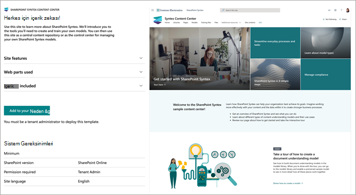

# Microsoft SharePoint Syntex için İçerik Merkezi site SharePoint Syntex

İçerik SharePoint Syntex Merkezi sitesi, kullanıcı özelliklerini daha iyi anlamanıza yardımcı SharePoint tasarlanmış, kullanıma hazır bir site SharePoint Syntex şablonudur.

Kendi modellerinizi oluşturmak ve eğitmek için ihtiyacınız olan araçlar ve bilgiler size tanıtıldı. Bundan sonra bu siteyi merkezi bir içerik deposu olarak veya kendi içerik modellerinizi yönetmek için denetim merkezi SharePoint Syntex kullanabilirsiniz.

Bu sitede, modeller kendi içeriğinizi kullanarak eğitilmiş ve değerlendirilmiş olabilir. Ancak, modelleri kitaplıklara uygulamak için kitaplık lisansı SharePoint Syntex gereklidir.  

## Siteyi sağlama

İçerik Merkezi sitesi, kitap gibi SharePoint [sağlandı](https://lookbook.microsoft.com/).

> [!NOTE]
> Siteyi sağlanması için, SharePoint genel yönetici Microsoft 365 yönetici veya Microsoft 365 yönetici olmak gerekir.

1. Görünümün ana sayfasındaki [SharePoint Tasarımlarını](https://lookbook.microsoft.com/) görüntüle menüsünde, Görünüm'e veya  İçerik **Merkezi'SharePoint Syntex** >  **SharePoint Syntex seçin**.

2. İçerik Merkezi **sayfasında Kiracınıza** **ekle'yi seçin**.

    

3. E-posta adresinizi girin (siteniz kullanıma hazır olduğunda bildirim almak için), kullanmak istediğiniz site URL'sini ve siteniz için kullanmak istediğiniz başlığı girin. 

    

4. **Sağlama'yi** seçin, kısa bir süre içinde siteniz kullanıma hazır olur. İçerik Merkezi site şablonunu sağlama isteğinizin tamamlanmıştır. (sağlanıyor olan e-posta adresine gönderilen) bir e-posta alırsınız.

5. **Siteyi aç'ı** seçin; İçerik Merkezi sitesinizi burada bulabilirsiniz. Buradan, siteyi inceler ve site hakkında daha fazla SharePoint Syntex. 

Kitap gibi bir hizmetten sağlama SharePoint için bkz. [Yeni öğrenme yolları çözümü sağlama](/office365/customlearning/custom_provision).

## Siteyi keşfedin

İçerik Merkezi sitesi, önceden doldurulmuş sayfalar içerir ve bu sayfalar, SharePoint Syntex başlama adımlarında size yol sağlar. 

### SharePoint Syntex'i SharePoint Syntex

Yeni e-SharePoint Syntex öğrenin ve bunu organizasyonunız için nasıl kullanabileceğinizi öğrenin. Videoya genel bir bakış için videoyu SharePoint Syntex ve başlamanıza yardımcı olacak eğitimleri bulun.

### Model türleri hakkında bilgi

Üç model türü hakkında bilgi edinin ve arama, iş süreçleri, uyumluluk ve daha birçok konudaki iş sorunlarını çözmek için bunları nasıl kullanabileceğinize bakın.

### Etkileşimli bir tur atarak model oluşturma

Modeller kitaplığında belge anlama modeli oluşturma ve ardından kısıtlanmış bir örnek modeli etkinleştirme hakkında bilgi edinebilirsiniz.

### SharePoint Syntex adımda tamamlayın

Bir içerik merkeziyle başlayacak ve ardından ihtiyacınız olan bilgileri tanımlanacak, sınıflandıracak ve ayıklanacak modellerin nasıl oluşturulacaklarını adım adım öğrenin.

### Günlük işlemleri ve görevleri kolaylaştırma

El ile yapılan SharePoint Syntex için e-SharePoint Syntex kullanmayı ve bunu organizasyonunız için otomatik ve kolaylaştırılmış bir hale nasıl dönüştür teslim etmeyi öğrenin.

### Uyumluluğu yönetme

Riskleri azaltmaya ve kuruma alınan verilerle bilgilerin güvenli ve iyi düşünebilirsiniz.

### Model etkinliğini görüntüle

İçeriklerin model etkinliğini göstermek ve modellerinizi nasıl kullandığı hakkında daha fazla bilgi sağlamak için nasıl kullanılır olduğunu bakın.

### Ek kaynaklar bulma

Çalışmanız hakkında daha fazla bilgi edinmek için ek kaynakları ve senaryoları SharePoint Syntex.

