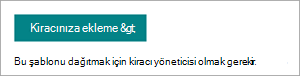

# Microsoft SharePoint Syntex için Sözleşme Yönetimi site SharePoint Syntex

Sözleşme Yönetimi sitesi, kuruluş değerini en üst düzeye çıkarmanıza yardımcı SharePoint, kullanıma hazır ve özelleştirilebilir bir site SharePoint Syntex. Bu site, kurumda sözleşmelerinin durumunu yönetmek, işlemek ve izlemek için profesyonel bir site oluşturmanıza izin vermenizi sağlar.

## Sitenin özellikleri

Sözleşme Yönetimi sitesi önceden doldurulmuş sayfaları, web bölümlerini ve site gezintisini içerir. Site, kendi markasını, çalışan bilgilerini, ilke ve planlama bilgilerini, iş akışını, kişilerini ve kaynaklarını bir olacak şekilde özelleştirilebilir.

Site, belgeleri sınıflandırmak ve meta SharePoint Syntex ayıklamak için belge kitaplıklarında çalışan bir SharePoint Syntex modelinin gücünü kullanır. Site, hızla başlamanız için önceden oluşturulmuş belge kitaplıkları sağlar, ancak gerektiğinde kendi kitaplıklarınızı da oluşturabilirsiniz. Site aşağıdaki öne çıkan kitaplıkları içerir:

- **Bölgeler** – Sözleşme belgelerini coğrafi bölgeye, ülkeye veya bölgeye göre sınıflandırın.

- **Şablonlar** – Gizlilik sözleşmesi, hizmet sözleşmesi ve iş bildirimi gibi sözleşme türü için uygun sözleşme şablonunu seçin.

- **Sözleşme istekleri** – Sözleşmeler ekibinize doğrudan bir sözleşme isteği başlatabilirsiniz.

- **İstemciler** – Müşteri bilgilerini tek bir uygun konumda bulun.

- **Modeller** – Belgeleri sınıflandırmak ve meta verileri ayıklamak için bu model kitaplığını kullanın. Kullanıcılar ihtiyaçlarına uygun olarak kendi modellerini oluşturabilir ve bunları bu kitaplara ekleyebilir.

- **Örnek sözleşme kitaplığı** – Sınıflandırılmış ve SharePoint Syntex modeli kullanılarak ayıklanan meta SharePoint Syntex bulun. 

Kitaplıkta, durum gibi başka meta verileri izleyebilirsiniz ve bu görünüm daha görsel bir şekilde göstermek için belge kitaplığı biçimlendirmesi kullanan ayrı bir görünüm içerir.

## Siteyi sağlama

Sözleşme Yönetimi sitesi, sözleşmeli müşteri SharePoint [olarak sağlandı](https://lookbook.microsoft.com/).

> [!NOTE]
> Siteyi sağlanması için, SharePoint genel yönetici Microsoft 365 yönetici veya Microsoft 365 yönetici olmak gerekir. Bu site şablonunu SharePoint Syntex için de bir lisansa sahip olmak gerekir.

1. Görünümün ana sayfasındaki [SharePoint Tasarımlarını](https://lookbook.microsoft.com/) görüntüle  >  menüsünde Sözleşme Yönetimi'SharePoint Syntex **SharePoint Syntex seçin**.

2. Sözleşme Yönetimi **sayfasında Kiracınıza** **ekle'yi seçin**.

    

3. E-posta adresinizi girin (siteniz kullanıma hazır olduğunda bildirim almak için), kullanmak istediğiniz site URL'sini ve siteniz için kullanmak istediğiniz başlığı girin. 

    

4. **Sağlama'yi** seçin, kısa bir süre içinde siteniz kullanıma hazır olur. Sözleşme Yönetimi site şablonunu hazırlama talebinizin tamamlanmıştır. (sağlanıyor olan e-posta adresine gönderilen) bir e-posta alırsınız.

5. **Siteyi aç'ı** seçin, Sözleşmeler Yönetim sitenizi seçin. Buradan siteyi inceler, sayfaları ve içeriği özelleştirebilirsiniz. 

Kitap gibi bir hizmetten sağlama SharePoint için bkz. [Yeni öğrenme yolları çözümü sağlama](/office365/customlearning/custom_provision).

## Siteyi özelleştirme

Sözleşme Yönetimi sitesini diğer kullanıcılarla paylaşmadan önce, siteyi gereksinimlerinizi karşılayacak şekilde özelleştirmeniz gerekir. 

### Sitenizin görünümünü ve görünümünü özelleştirme

Sitenizin aşağıdaki öğelerini, kurum gereksinimlerine uygun olarak özelleştirin:

- Sözleşme Yönetimi [sitesinde markayı](https://support.microsoft.com/office/customize-your-sharepoint-site-320b43e5-b047-4fda-8381-f61e8ac7f59b) , organizasyonuyla uyumlu olacak şekilde güncelleştirin.
- Hero [web bölümünü, mümkün](https://support.microsoft.com/office/use-the-hero-web-part-d57f449b-19a0-4b0d-8ce3-be5866430645) olduğunca kuruluşta gerçek sitelerin görüntülerini içerecek şekilde özelleştirin.
- Sözleşme [yöneticilerine veya diğer yöneticilere](https://support.microsoft.com/office/show-people-profiles-on-your-page-with-the-people-web-part-7e52c5f6-2d72-48fa-a9d3-d2750765fa05) yönelik kişi bilgilerini eklemek için Kişiler web bölümünü özelleştirin.
- Metin web [bölümünü özelleştirerek](https://support.microsoft.com/office/add-text-and-tables-to-your-page-with-the-text-web-part-729c0aa1-bc0d-41e3-9cde-c60533f2c801) paragraf ekleyin ve stiller, madde işaretleri, girintiler, vurgulama ve bağlantılar gibi biçimlendirme seçenekleri ekleyin.
- Sayfaya [resim eklemek için](https://support.microsoft.com/office/use-the-image-web-part-a63b335b-ad0a-4954-a65d-33c6af68beb2) Resim web bölümünü özelleştirin.
- Diğer [kaynaklara bağlantıları düzenlemek ve](https://support.microsoft.com/office/use-the-quick-links-web-part-e1df7561-209d-4362-96d4-469f85ab2a82) görüntülemek için Hızlı Bağlantılar web bölümünü özelleştirin.
- [Sitenize gereken diğer](https://support.microsoft.com/office/using-web-parts-on-sharepoint-pages-336e8e92-3e2d-4298-ae01-d404bbe751e0) web bölümlerini ekleyin.
- Sayfa [düzenlerini gereken](https://support.microsoft.com/office/add-sections-and-columns-on-a-sharepoint-modern-page-fc491eb4-f733-4825-8fe2-e1ed80bd0899) şekilde özelleştirin.
- Ek [destek veya](https://support.microsoft.com/office/create-and-use-modern-pages-on-a-sharepoint-site-b3d46deb-27a6-4b1e-87b8-df851e503dec) bilgi kaynakları eklemek için yeni sayfalar ekleyin.

### Site gezintilerini özelleştirme

Sözleşmeler Yönetimi sitesi için site gezintisi sizin denetiminiz var. Aşağıdaki kaynakları kullanarak, organizasyonuyla uyumlu değişiklikler yapabilirsiniz:

- Site [gezintisi'ni özelleştirme](https://support.microsoft.com/office/customize-the-navigation-on-your-sharepoint-site-3cd61ae7-a9ed-4e1e-bf6d-4655f0bf25ca).
- [Bu siteyi bir merkez sitesi ile ilişkilendirme](https://support.microsoft.com/office/associate-a-sharepoint-site-with-a-hub-site-ae0009fd-af04-4d3d-917d-88edb43efc05).
- Belirli [kullanıcılara yönelik belirli](https://support.microsoft.com/office/target-navigation-news-and-files-to-specific-audiences-33d84cb6-14ed-4e53-a426-74c38ea32293) gezinti bağlantılarını hedeflemek için hedef kitle hedeflemeyi kullanın. 
- [Gerekirse istenmeyen](https://support.microsoft.com/office/delete-a-page-from-a-sharepoint-site-1d4197b8-31b6-460d-906b-3fb492a51db1) sayfaları silin.

## Siteyi başkalarla paylaşma

[Sitenizi başkalarını paylaşın](https://support.microsoft.com/office/share-a-site-958771a8-d041-4eb8-b51c-afea2eae3658). Sözleşme Yönetimi sitenin yaygın olarak tanınması ve benimsenmiş olduğundan emin olmak için, organizasyonum'daki diğer çalışanlarla ortak çalışmanız.

Sözleşme Yönetimi sitesini yönetmede önemli başarı etmenleri:

- Sözleşme Yönetimi sitesi lansmanını kutlayın.
- Yeni kaynağın adı olan haberleri oluşturun ve yayınlayın.
- Kullanıcıların soru ve geri bildirim için prize sahip olduğundan emin olun.
- Giriş sayfasındaki [içeriği geliştirmek](https://support.microsoft.com/office/view-usage-data-for-your-sharepoint-site-2fa8ddc2-c4b3-4268-8d26-a772dc55779e) , gezintiyi güncelleştirmek veya netlik için içeriği yeniden yazmak için site analizinden içgörüleri kullanın.
- İçeriğin yeni ve hala ilgili olduğundan emin olmak için Sözleşme Yönetimi sitesini gereken şekilde gözden geçirebilirsiniz.

## Ayrıca bkz.

[Yeni bir çözüm kullanarak Microsoft 365 yönetin](solution-manage-contracts-in-microsoft-365.md)