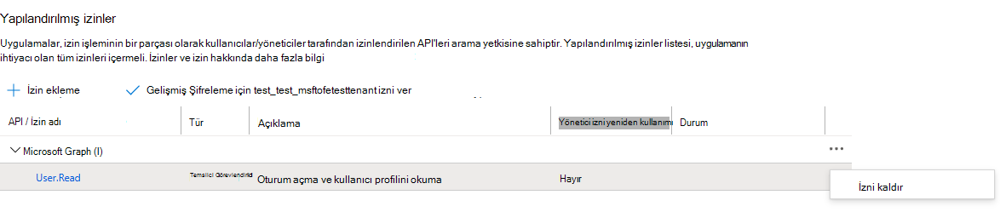

# <a name="cross-tenant-mailbox-migration-preview"></a>Kiracılar arası posta kutusu geçişi (önizleme)

Şirket birleşmeleri veya şirket birleşmeleri sırasında, kullanıcı posta kutunuzu veya kiracınızı Exchange Online kiracıya taşımanız gerekir. Kiracılar arası posta kutusu geçişi, kiracı yöneticilerinin kullanıcıları yeni kuruluşlarına geçirmesi için Remote PowerShell ve MRS gibi iyi bilinen arabirimleri kullanmasına olanak sağlar.

Yöneticiler, kiracılar arası New-MigrationBatch yürütmek için Posta Kutularını Taşı yönetim rolü aracılığıyla kullanılabilen New-MigrationBatch cmdlet'ini kullanabilir.

Geçiş yapılan kullanıcıların, kiracılar arası hareketleri etkinleştirmek Exchange Online belirli özniteliklerle işaretlenen MailUsers olarak hedef kiracı Exchange Online sisteminde olması gerekir. Sistem, hedef kiracıda düzgün bir şekilde ayarlanmazken başarısız olur.

Hareketler tamamlandığında, kaynak kullanıcı posta kutusu MailUser'a dönüştürülür ve targetAddress (Exchange'te ExternalEmailAddress olarak gösterilir) hedef kiracıya yönlendirme adresiyle damgalanır. Bu işlem, eski MailUser'i kaynak kiracıda bırakır ve birlikte kullanılabilirlik ve posta yönlendirmeye olanak verir. İş süreçleri izin veri olduğunda, kaynak kiracı MailUser kaynağını kaldırabilir veya bunları bir posta kişisine dönüştürebilirsiniz.

Kiracılar arası Exchange kutusu geçişleri, yalnızca karma veya buluttaki kiracılar için veya bu ikinin herhangi bir bileşiminde destekler.

Bu makalede kiracılar arası posta kutusu taşınırken ilen süreç açıklanmıştır ve kaynak ve hedef kiracıların posta kutusu içeriği taşırken nasıl hazır Exchange Online kılavuz sağlanmıştır.

   > [!NOTE]
   > Kiracılar arası posta kutusu geçişini artık Azure posta kutusu gerektirmeyecek şekilde etkinleştirmek için kurulum adımlarımızı Key Vault! Bu önizlemeye ilk kez geliyorsanız herhangi bir işlem gerekmez ve bu belgede ayrıntılı olarak bulunan adımları izleyebilirsiniz. Önceki AKV yöntemini kullanarak kiracılarınızı yapılandırmaya başladıysanız, bu yeni yöntemi kullanmaya başlamak için bu yapılandırmayı durdurmanızı veya kaldırmanızı kesinlikle öneririz. Önceki AKV yöntemiyle devam eden posta kutusu geçişleri varsa, lütfen var olan geçişlerinizi tamamlayana kadar bekleyin ve yeni basitleştirilmiş yöntemi etkinleştirmek için aşağıdaki adımları izleyin. Azure Key Vault gerekli kurulum adımları arşivlenir, ancak başvuru için **[burada](https://github.com/microsoft/cross-tenant/wiki/V1-Content#cross-tenant-mailbox-migration-preview)** bulabilirsiniz.

## <a name="preparing-source-and-target-tenants"></a>Kaynak ve hedef kiracıları hazırlama

### <a name="prerequisites-for-source-and-target-tenants"></a>Kaynak ve hedef kiracıların önkoşulları

Başlamadan önce, Azure, EXO Geçiş Uç Noktası ve EXO Kuruluş İlişkisi'nden Posta Kutusunu Taşı uygulamasını yapılandırmak için gerekli izinlere sahip olduğundan emin olun.

Buna ek olarak, kaynak kiracıda en az bir posta etkin güvenlik grubu gereklidir. Bu gruplar, kaynak kiracıdan (veya bazen kaynak olarak da adlandırılır) hedef kiracıya taşınabiliyor posta kutularının listesinin kapsamını alır. Bu, kaynak kiracı yöneticisinin, taşınması gereken belirli posta kutusu kümelerini kısıtlamasına veya kapsamını sınırlamasına ve bu kümenin, postasız kullanıcıların geçişinin önlenmesine olanak sağlar. İç içe gruplar desteklanmaz.

Ayrıca, bu kişinin kiracı kimliğini almak için güvenilir iş ortağı şirketiyle (posta kutularını birlikte taşınacak olan şirketle) iletişim Microsoft 365 gerekir. Bu kiracı kimliği Kuruluş İlişkisi Etki AlanıAdı alanında kullanılır.

Aboneliğin kiracı kimliğini almak için abonelik oturum Microsoft 365 yönetim merkezi gidin.[](https://go.microsoft.com/fwlink/p/?linkid=2024339) [https://aad.portal.azure.com/\#blade/Microsoft_AAD_IAM/ActiveDirectoryMenuBlade/Properties](https://aad.portal.azure.com/#blade/Microsoft_AAD_IAM/ActiveDirectoryMenuBlade/Properties) Panoya kopyalamak için Kiracı Kimliği özelliğinin kopyala simgesine tıklayın.

### <a name="configuration-steps-to-enable-your-tenants-for-cross-tenant-mailbox-migrations"></a>Kiracılarınızı kiracılar arası posta kutusu geçişleri için etkinleştirmenin yapılandırma adımları

   > [!NOTE]
   > Önce hedefi (hedef) yapılandırmanız gerekir. Bu adımları tamamlamak için, hem kaynak hem de hedef kiracı için kiracı yöneticisi kimlik bilgilerine sahip olmak veya bunları bilmek zorunda değildir. Adımlar, farklı yöneticiler tarafından her kiracı için ayrı ayrı gerçekleştiriliyor.

### <a name="prepare-the-target-destination-tenant-by-creating-the-migration-application-and-secret"></a>Geçiş uygulamasını ve gizliyi oluşturarak hedef (hedef) kiracıyı hazırlama

1. Hedef kiracı yöneticisi kimlik bilgilerinizle Azure AD portalınıza (<https://portal.azure.com>) giriş yapın

   

2. Posta Görünümlerini Yönet'in altında Azure Active Directory.

   

3. Sol gezinti çubuğunda, Gezinti Çubuğu'Uygulama kayıtları.

4. Yeni kayıt'ı seçin

   

5. Uygulama kaydetme sayfasında, Desteklenen hesap türleri'nin altında Herhangi bir kuruluş dizininde hesaplar 'ı seçin (Herhangi bir Azure AD dizini - Multitenant). Ardından, Yeniden Yönlendirme URI'si (isteğe bağlı) altında Web'i seçin ve <https://office.com> Son olarak, Kaydol'a tıklayın.

   

6. Sayfanın sağ üst köşesinde, uygulamanın başarıyla oluşturulmuş olduğunu haberen bir bildirim açılır penceresini görebilirsiniz.

7. Geri dön'e Azure Active Directory'e tıklayın ve Sonra'Uygulama kayıtları.

8. Sahip olunan uygulamalar'ın altında oluşturduğunuz uygulamayı bulun ve uygulamaya tıklayın.

9. ^Essentials altında, daha sonra hedef kiracı için bir URL oluşturmak için ihtiyacınız olacak şekilde Uygulama (istemci) kimliğini kopyalamanız gerekir.

10. Şimdi, uygulamanıza atanan izinleri görüntülemek için sol gezinti çubuğunda API izinlerine tıklayın.

11. Varsayılan olarak, Kullanıcı. Oluşturduğunuz uygulamaya okuma izinleri atanır, ancak posta kutusu geçişleri için bu izinleri kaldırabilirsiniz.

    

12. Şimdi posta kutusu geçişi için izin eklememiz gerekiyor, İzin ekle'yi seçerek

13. API izinleri isteği pencerelerde Kuruluşumda kullandığı API'ler'i seçin, API'yi Office 365 Exchange Online ve seçin.

    

14. Ardından, Uygulama izinleri'ne tıklayın

15. Ardından, İzinleri seçin'in altında Posta Kutusu'nda genişletin ve Mailbox.Migration'i denetleyin ve ekranın alt kısmında İzin ekle'yi seçin.

    

16. Şimdi, & gezinti çubuğunda Sertifikalar'ı veya gizli belgeleri seçin.

17. Müşteri sırrı altından yeni müşteri sırrı'ı seçin.

    

18. İstemci gizlisi ekle penceresinde bir açıklama girin ve istediğiniz süre sonu ayarlarını yapılandırın.

      > [!NOTE]
      > Bu, geçiş uç noktanızı oluştururken kullanılacak paroladır. Bu parolayı panoya kopyalamanız veya güvenli/gizli parola güvenli konumu için bu parolayı kopyalamanız son derece önemlidir. Bu parolayı yalnızca bu kez görmek mümkün! Herhangi bir şekilde kaybeder veya sıfırlamanız gerekirse, Azure portal'mızda oturum açın, Uygulama kayıtları'e gidin, geçiş uygulamanızı bulun, Secrets & sertifikalarını seçin ve uygulamanız için yeni bir parola oluşturun.

19. Artık geçiş uygulamasını başarıyla ve gizli olarak oluşturduğunuza göre, uygulamayı kabul etmek zorunda kalacaksınız. Uygulamayı kabul etmek için Azure Active Directory giriş sayfasına gidin, sol gezinti bölmesinde Enterprise uygulamalarına tıklayın, oluşturduğunuz geçiş uygulamasını bulun, seçin ve sol gezinti bölmesinde İzinler'i seçin.

20. [Kiracınız] için yönetici izni ver düğmesine tıklayın.

21. Yeni bir tarayıcı penceresi açılır ve Kabul Et'i seçin.

22. Portal pencerenize geri dönüp kabullerinizi onaylamak için Yenile'yi seçin.

23. Güvenilir iş ortağınıza (kaynak kiracı yöneticisi) göndermek için URL'yi formüle ekleyin, böylece onlar da posta kutusu geçişini etkinleştirmek için uygulamayı kabul eder. İşte onlara sağlayacak URL örneği, oluşturduğunuz uygulamanın uygulama kimliğine ihtiyacınız olacak:

    ```powershell
    https://login.microsoftonline.com/sourcetenant.onmicrosoft.com/adminconsent?client_id=[application_id_of_the_app_you_just_created]&redirect_uri=https://office.com
    ```

    > [!NOTE]
    > Yeni oluşturduğunuz posta kutusu geçiş uygulamasının uygulama kimliği gerekir.
    >
    > Yukarıdaki örnekte yer alan sourcetenant.onmicrosoft.com kaynak kiracılar tarafından doğru ad ile onmicrosoft.com gerekir.
    >
    > Ayrıca[posta kutusu] application_id_of_the_app_you_just_created] yerine yeni oluşturduğunuz posta kutusu geçiş uygulamasının uygulama kimliği de gerekir.

### <a name="prepare-the-target-tenant-by-creating-the-exchange-online-migration-endpoint-and-organization-relationship"></a>Exchange Online geçiş uç noktasını ve kuruluş ilişkisini oluşturarak hedef kiracıyı hazırlama

1. Hedef veri kiracısına Uzak PowerShell Exchange Online oluşturun.

2. Kiracılar arası posta kutusu taşımaları için yeni geçiş uç noktası oluşturma

   > [!NOTE]
   > Az önce oluşturduğunuz posta kutusu geçiş uygulamasının uygulama kimliğine ve bu işlem sırasında yapılandırılan parolaya (gizli) ihtiyacınız olur. Ayrıca, bulut örneğine Microsoft 365 uç noktanızı kullandığınız farklı olabilir. Lütfen Microsoft 365 [uç noktaları](/microsoft-365/enterprise/microsoft-365-endpoints) sayfasına bakın ve kiracınız için doğru örneği seçin ve En İyi Duruma Exchange Online ve uygun şekilde değiştirin.

   ```powershell
   
   # Enable customization if tenant is dehydrated
     $dehydrated=Get-OrganizationConfig | fl isdehydrated
     if ($dehydrated -eq $true) {Enable-OrganizationCustomization}
     
   $AppId = "[guid copied from the migrations app]"

   $Credential = New-Object -TypeName System.Management.Automation.PSCredential -ArgumentList $AppId, (ConvertTo-SecureString -String "[this is your secret password you saved in the previous steps]" -AsPlainText -Force)

   New-MigrationEndpoint -RemoteServer outlook.office.com -RemoteTenant "sourcetenant.onmicrosoft.com" -Credentials $Credential -ExchangeRemoteMove:$true -Name "[the name of your migration endpoint]" -ApplicationId $AppId
   ```

3. Kaynak kiracınıza yönelik yeni bir kuruluş ilişkisi nesnesi oluşturun veya bu nesneyi düzenleyin.

   ```powershell
   $sourceTenantId="[tenant id of your trusted partner, where the source mailboxes are]"
   $orgrels=Get-OrganizationRelationship
   $existingOrgRel = $orgrels | ?{$_.DomainNames -like $sourceTenantId}
   If ($null -ne $existingOrgRel)
   {
       Set-OrganizationRelationship $existingOrgRel.Name -Enabled:$true -MailboxMoveEnabled:$true -MailboxMoveCapability Inbound
   }
   If ($null -eq $existingOrgRel)
   {
       New-OrganizationRelationship "[name of the new organization relationship]" -Enabled:$true -MailboxMoveEnabled:$true -MailboxMoveCapability Inbound -DomainNames $sourceTenantId
   }
   ```

### <a name="prepare-the-source-current-mailbox-location-tenant-by-accepting-the-migration-application-and-configuring-the-organization-relationship"></a>Geçiş uygulamasını kabul etmek ve kuruluş ilişkisini yapılandırarak kaynak (geçerli posta kutusu konumu) kiracısını hazırlama

1. Tarayıcıdan, posta kutusu geçiş uygulamasına izin almak için güvenilir iş ortağınız tarafından sağlanan URL bağlantısına gidin. URL şuna benzer:

   ```powershell
   https://login.microsoftonline.com/sourcetenant.onmicrosoft.com/adminconsent?client_id=[application_id_of_the_app_you_just_created]&redirect_uri=https://office.com
   ```

   > [!NOTE]
   > Yeni oluşturduğunuz posta kutusu geçiş uygulamasının uygulama kimliği gerekir.
   > Yukarıdaki örnekte yer alan sourcetenant.onmicrosoft.com kaynak kiracılar tarafından doğru ad ile onmicrosoft.com gerekir.
   > Ayrıca[posta kutusu] application_id_of_the_app_you_just_created] yerine yeni oluşturduğunuz posta kutusu geçiş uygulamasının uygulama kimliği de gerekir.

2. Açılır pencere görüntülendiğinde uygulamayı kabul etme. Ayrıca, Azure Active Directory portalında oturum açabilirsiniz ve uygulamayı Enterprise bulabilirsiniz.

3. Bir Uzak PowerShell penceresinden hedef (hedef) kiracınıza yönelik yeni bir kuruluş ilişkisi Exchange Online oluşturun veya düzenleyin.

   ```powershell
   $targetTenantId="[tenant id of your trusted partner, where the mailboxes are being moved to]"
   $appId="[application id of the mailbox migration app you consented to]"
   $scope="[name of the mail enabled security group that contains the list of users who are allowed to migrate]"
   $orgrels=Get-OrganizationRelationship
   $existingOrgRel = $orgrels | ?{$_.DomainNames -like $targetTenantId}
   If ($null -ne $existingOrgRel)
   {
       Set-OrganizationRelationship $existingOrgRel.Name -Enabled:$true -MailboxMoveEnabled:$true -MailboxMoveCapability RemoteOutbound -OAuthApplicationId $appId -MailboxMovePublishedScopes $scope
   }
   If ($null -eq $existingOrgRel)
   {
       New-OrganizationRelationship "[name of your organization relationship]" -Enabled:$true -MailboxMoveEnabled:$true -MailboxMoveCapability RemoteOutbound -DomainNames $targetTenantId -OAuthApplicationId $appId -MailboxMovePublishedScopes $scope
   }
   ```
   
> [!NOTE]
> Etki alanı adı olarak ve kullanıcı $sourceTenantId $targetTenantId, kiracı etki alanı adı değil GUID kimliğidir. Kiracı kimliği örneği ve kiracı kimliğinizi bulma hakkında bilgi için bkz. [Kiracı Microsoft 365 bulma](/onedrive/find-your-office-365-tenant-id).
   
### <a name="how-do-i-know-this-worked"></a>Nasıl yaparım? çalıştığını biliyor musunuz?

Hedef kiracıda oluşturduğunuz kiracılar arası geçiş uç noktasına [Test-MigrationServerAvailability](/powershell/module/exchange/Test-MigrationServerAvailability) cmdlet'ini çalıştırarak kiracılar arası posta kutusu geçiş yapılandırmasını doğruabilirsiniz.

   > [!NOTE]
   >
   > - Hedef kiracı:
   > 
   > Test-MigrationServerAvailability -Endpoint "[kiracılar arası geçiş uç noktanın adı]"
   >
   > Get-OrganizationRelationship | fl name, DomainNames, MailboxMoveEnabled, MailboxMoveCapability
   >
   > - Kaynak kiracı:
   > 
   > Get-OrganizationRelationship | fl name, DomainNames, MailboxMoveEnabled, MailboxMoveCapability 

### <a name="move-mailboxes-back-to-the-original-source"></a>Posta kutularını özgün kaynağına geri taşıma

Özgün kaynak kiracıya geri dönmek için bir posta kutusu gerekirse, aynı adım ve betik kümelerinin hem yeni kaynak hem de yeni hedef kiracılarda çalıştırılması gerekir. Var olan Kuruluş İlişkisi nesnesi güncelleştirilecek veya eklenecek, yeniden oluşturulmayacak

## <a name="prepare-target-user-objects-for-migration"></a>Hedef kullanıcı nesnelerini geçiş için hazırlama

Kiracılar arası hareketleri etkinleştirmek için, geçişin belirli özniteliklerle işaretlenen hedef kiracıda ve Exchange Online sisteminde (MailUsers olarak) olması gerekir. Sistem, hedef kiracıda düzgün bir şekilde ayarlanmazken başarısız olur. Aşağıdaki bölümde, hedef kiracı için MailUser nesne gereksinimleri ayrıntılarıyla gereksinimlerini bulabilirsiniz.

### <a name="prerequisites-for-target-user-objects"></a>Hedef kullanıcı nesneleri için önkoşullar

Hedef kuruluşta aşağıdaki nesnelerin ve özniteliklerin ayarlanmış olduğundan emin olmak.

1. Kaynak kuruluştan gelen tüm posta kutuları için, Hedef kuruluşta bir MailUser nesnesi sağlamalıdır:

   - Target MailUser, kaynak posta kutusundan bu özniteliklerin atanmış veya yeni User nesnesine atanmış olması gerekir:
      - ExchangeGUID (kaynaktan hedefe doğrudan akış): Posta kutusu GUID eşleşmesi gerekir. Bu hedef nesnede yoksa, taşıma işlemi devam etmez.
      - ArşivGUID (doğrudan kaynaktan hedefe akış): Arşiv GUID eşleşmesi gerekir. Hedef nesnede yoksa, taşıma işlemi devam etmez. (Bu yalnızca kaynak posta kutusu Arşiv etkinleştirilmişse gereklidir).
      - LegacyExchangeDN (proxyAddress, "x500:\<LegacyExchangeDN>") olarak akış: LegacyExchangeDN, hedef MailUser'da x500: proxyAddress olarak mevcut olması gerekir. Ayrıca, tüm x500 adreslerini kaynak posta kutusundan hedef posta kullanıcıya da kopyalamanız gerekir. Bunlar hedef nesnede yoksa, taşıma işlemleri ilerlemez.
      - UserPrincipalName: UPN, kullanıcının Yenİ kimliğine veya hedef şirketine (örneğin, Kullanıcı User@northwindtraders.onmicrosoft.com).
      - Birincil SMTPAdresi: Birincil SMTP adresi, kullanıcının Yenİ şirketiyle (örneğin, Yeni Şirket) user@northwind.com.
      - TargetAddress/ExternalEmailAddress: MailUser, kullanıcının kaynak kiracıda barındırılan geçerli posta kutusuna başvuracak (örneğin, user@contoso.onmicrosoft.com). Bu değeri atarken, PrimarySMTPAddress'e sahipsiniz/aynı zamanda primarySMTPAddress atadığınız doğrulayın veya bu değer taşıma hatalara neden olacak PrimarySMTPAddress'i ayarlatır.
      - Kaynak posta kutusundan hedef MailUser'a eski smtp ara sunucu adreslerini ekamazsiniz. Örneğin, kiracı nesnelerini contoso.com içinde MEU'da fabrikam.onmicrosoft.com koruyamazsınız). Etki alanları yalnızca tek bir Azure AD veya Exchange Online kiracıyla ilişkilendirildi.

     Örnek **hedef** MailUser nesnesi:

     | Öznitelik            | Değer                                                                                                                   |
     | -------------------- | ----------------------------------------------------------------------------------------------------------------------- |
     | Diğer Ad                | LaraN                                                                                                                   |
     | RecipientType        | MailUser                                                                                                                |
     | RecipientTypeDetails | MailUser                                                                                                                |
     | UserPrincipalName    | LaraN@northwintraders.onmicrosoft.com                                                                                   |
     | PrimarySmtpAddress   | Lara.Newton@northwind.com                                                                                               |
     | ExternalEmailAddress | SMTP:LaraN@contoso.onmicrosoft.com                                                                                      |
     | ExchangeGuid         | 1ec059c7-8396-4d0b-af4e-d6bd4c12a8d8                                                                                    |
     | LegacyExchangeDN     | /o=First Organization/ou=Exchange Administrative Group                                                                  |
     |                      | (FYDIBOHF23SPDLT)/cn=Recipients/cn=74e5385fce4b46d19006876949855035Lara                                                 |
     | EmailAddresses       | x500:/o=First Organization/ou=Exchange Yönetim Grubu (FYDIBOHF23SPDLT)/cn=Recipients/cn=d11ec1a2cacd4f81858c8190 |
     |                      | 7273f1f9-Lara                                                                                                           |
     |                      | smtp:LaraN@northwindtraders.onmicrosoft.com                                                                             |
     |                      | SMTP:Lara.Newton@northwind.com                                                                                          |
     |                      |                                                                                                                         |

     Örnek **kaynak Posta** Kutusu nesnesi:

     | Öznitelik            | Değer                                                                   |
     | -------------------- | ----------------------------------------------------------------------- |
     | Diğer Ad                | LaraN                                                                   |
     | RecipientType        | UserMailbox                                                             |
     | RecipientTypeDetails | UserMailbox                                                             |
     | UserPrincipalName    | LaraN@contoso.onmicrosoft.com                                           |
     | PrimarySmtpAddress   | Lara.Newton@contoso.com                                                 |
     | ExchangeGuid         | 1ec059c7-8396-4d0b-af4e-d6bd4c12a8d8                                    |
     | LegacyExchangeDN     | /o=First Organization/ou=Exchange Administrative Group                  |
     |                      | (FYDIBOHF23SPDLT)/cn=Recipients/cn=d11ec1a2cacd4f81858c81907273f1f9Lara |
     | EmailAddresses       | smtp:LaraN@contoso.onmicrosoft.com                                      |
     |                      | SMTP:Lara.Newton@contoso.com                                            |
     |                      |                                                                         |

   - Karma geri yazma özelliğine önceden Exchange öznitelikler dahil olabilir. Yoksa, bunların da dahil olması gerekir.
   - msExchBlockedSendersHash – yeniden çevrimiçi olarak güvenli ve engellenen gönderen verilerini istemcilerden şirket içi Active Directory.
   - msExchSafeRecipientsHash – İstemcilerden güvenli ve engellenen gönderen verilerini yeniden çevrimiçi olarak şirket içi Active Directory.
   - msExchSafeSendersHash – yeniden çevrimiçi olarak güvenli ve engellenen gönderen verilerini istemcilerden postalara şirket içi Active Directory.

2. Kaynak posta kutusu MahkemeHold üzerinde ise ve kaynak posta kutusunun Kurtarılabilir Öğeler boyutu veritabanı varsayılan değerden (30 GB) büyükse, hedef kota kaynak posta kutusu boyutundan küçük olduğu için, geçişler devamamaz. HEDEF MailUser nesnesini güncelleştirerek ELC posta kutusu bayraklarını kaynak ortamdan hedefe geçebilirsiniz ve bu da MailUser kotasını 100 GB'a kadar genişletmesi hedef sistemi tetikler ve böylece hedefe geçebilirsiniz. ELC bayraklarını damgalama komutları kiracı yöneticilerine açıklanmaz Bağlan, bu yönergeler yalnızca Azure AD Bağlan çalıştıran karma kimlikte çalışır.

    > [!NOTE]
    > ÖRNEK – OLDUĞU GIBI, GARANTİ YOKTUR
    >
    > Bu betikte, hem kaynak posta kutusuna (kaynak değerleri almak için) hem de hedef posta kutusuna (ADUser nesnesini damgalama) şirket içi Active Directory bir bağlantı olduğu varsayıldı. Kaynakta mahkeme veya tek öğe kurtarma etkinse bunu hedef hesapta ayarlayın.  Bu, hedef hesabın dökümü boyutunu 100 GB'a artıracaktır.

    ```powershell
    $ELCValue = 0
    if ($source.LitigationHoldEnabled) {$ELCValue = $ELCValue + 8} if ($source.SingleItemRecoveryEnabled) {$ELCValue = $ELCValue + 16} if ($ELCValue -gt 0) {Set-ADUser -Server $domainController -Identity $destination.SamAccountName -Replace @{msExchELCMailboxFlags=$ELCValue}}
    ```

3. Karma olmayan hedef kiracılar, Geçiş öncesinde MailUsers'ın Kurtarılabilir Öğeler klasöründe kotayı değiştirerek, MailUser nesnesini Mahkeme Olarak Tutma'ya olanak sağlayan ve kotayı 100 GB'a artıran aşağıdaki komutu çalıştırabilir: `Set-MailUser -EnableLitigationHoldForMigration`. Bu, karma kiracılarda işe yaramadı.

4. Hedef kuruluşta yer alan kullanıcıların, kuruluş için uygun Exchange Online abonelikleriyle lisansları olması gerekir. Posta kutusu taşıma öncesinde lisans uygulayabilirsiniz, ancak hedef MailUser Yalnızca bir kez ExchangeGUID ve proxy adresleriyle düzgün bir şekilde ayarlanırsa. ExchangeGUID uygulanmadan önce lisans uygulanması, hedef kuruluşta sağlanan yeni bir posta kutusuna neden olur.

    > [!NOTE]
    > Posta Kutusu veya MailUser nesnesine lisans uygulamanız, yalnızca doğrulanmış etki alanlarının Exchange EmailAddresses dizinine dahil olduğundan emin olmak için tüm SMTP türü proxyAddresses temizlir.

5. Hedef MailUser'ın, Kaynak ExchangeGuid ile eşleşmez önceki ExchangeGuid'ı olduğundan emin olun. Hedef MEU daha önce Lisans lisansına sahipse ve bir posta Exchange Online bu durum ortaya çıkabilir. Hedef MailUser daha önce Kaynak ExchangeGuid ile eşleşmezse veya bir ExchangeGuid lisansına sahipse, bulut MEU'nun temizlenmesini gerçekleştirmeniz gerekir. Bu bulut MEUs'ları çalıştırabilirsiniz `Set-User <identity> -PermanentlyClearPreviousMailboxInfo`.

    > [!CAUTION]
    > Bu işlem geri alınamaz. Nesnenin softDeleted posta kutusu varsa, bu noktadan sonra geri alınamaz. Bununla birlikte, temizlenen doğru ExchangeGuid'ı hedef nesneye eşitebilirsiniz ve MRS kaynak posta kutusunu yeni oluşturulan hedef posta kutusuna bağlar. (Yeni parametrede BAŞVURU EHLO blogu.)

    Daha önce posta kutusu olan nesneleri bu komutu kullanarak bulun.

    ```powershell
    Get-User <identity> | select Name, *recipient* | Format-Table -AutoSize
    ```

    İşte bir örnek.

    ```powershell
    Get-User John@northwindtraders.com |select name, *recipient*| Format-Table -AutoSize

    Name       PreviousRecipientTypeDetails     RecipientType RecipientTypeDetails
    ----       ---------------------------- ------------- --------------------
    John       UserMailbox                  MailUser      MailUser
    ```

    Bu komutu kullanarak yumuşak silinmiş posta kutusunu temizleme.

    ```powershell
    Set-User <identity> -PermanentlyClearPreviousMailboxInfo
    ```

    İşte bir örnek.

    ```powershell
    Set-User John@northwindtraders.com -PermanentlyClearPreviousMailboxInfo -Confirm
    
    Are you sure you want to perform this action?
    Delete all existing information about user "John@northwindtraders.com"?. This operation will clear existing values from Previous home MDB and Previous Mailbox GUID of the user. After deletion, reconnecting to the previous mailbox that existed in the cloud will not be possible and any content it had will be unrecoverable PERMANENTLY.
    Do you want to continue?
    [Y] Yes  [A] Yes to All  [N] No  [L] No to All  [?] Help (default is "Y"): Y
    ```

### <a name="perform-mailbox-migrations"></a>Posta kutusu geçişlerini gerçekleştirme

Kiracılar arası Exchange kutusu geçişleri, hedef kiracıdan geçiş toplu işlemleri olarak başlatılır. Bu, şirket içi geçiş toplu işlemleri şirket içi bir şirket içi geçiş Exchange geçişte olduğu gibi Microsoft 365.

### <a name="create-migration-batches"></a>Geçiş toplu işlemleri oluşturma

Burada, taşımaların nasıl başlatıldıklarına örnek bir geçiş toplu işlemi cmdlet'i ve bir örnek ve daha sonra açık ve açık bir şekilde vemektedir.

```powershell
New-MigrationBatch -Name T2Tbatch -SourceEndpoint target_source_7977 -CSVData ([System.IO.File]::ReadAllBytes('users.csv')) -Autostart -TargetDeliveryDomain target.onmicrosoft.com

Identity                   Status  Type               TotalCount
--------                   ------  ----               ----------
T2Tbatch                   Syncing ExchangeRemoteMove 1
```

> [!NOTE]
> CSV dosyasındaki e-posta adresi, kaynak kiracıda değil hedef kiracıda belirtilen adrestir.
>
> [cmdlet hakkında daha fazla bilgi için buraya tıklayın](/powershell/module/exchange/new-migrationbatch)
>
> [Örnek CSV dosyası için buraya tıklayın](/exchange/csv-files-for-mailbox-migration-exchange-2013-help)

Geçiş toplu işlemi gönderimi, kiracılar <a href="https://go.microsoft.com/fwlink/p/?linkid=2059104" target="_blank">Exchange yönetim</a> merkezinden de de destekleniyor.

### <a name="update-on-premises-mailusers"></a>Şirket içi MailUsers güncelleştirme

Posta kutusu bir kaynaktan hedefe bir kez taşınırsa, hem kaynak hem de hedefte şirket içi posta kullanıcılarının yeni targetAddress ile güncelleştiril ettiğinden emin olun. Örneklerde, taşımada kullanılan targetDeliveryDomain **doğru contoso.onmicrosoft.com.** Posta kullanıcılarını bu targetAddress ile güncelleştirin.

## <a name="frequently-asked-questions"></a>Sık sorulan sorular

**Taşımadan sonra şirket içi kaynakta RemoteMailboxes'i güncelleştirmemiz gerekiyor mu?**

Evet, kaynak kiracı posta kutusu hedef kiracıya taşınırken kaynak şirket içi kullanıcıların targetAddress (RemoteRoutingAddress/ExternalEmailAddress) hedef kullanıcılarını güncelleştirmeniz gerekir.  Posta yönlendirme farklı targetAddresses olan birden çok posta kullanıcısı arasında referansları takip eterken, posta kullanıcıları için Serbest/Meşgul aramaları posta kutusu kullanıcılarının konumunu hedeflemeLIDIR. Serbest/Meşgul aramaları birden çok yönlendirmeyi takip aramaz.

**Toplantıların Teams kiracılar arasında geçiş yapmaları gerekir mi?**

Toplantılar taşınsa da, Teams kiracılar arasında geçiş yaptığımızda toplantı URL'si güncelleştirililmez. Hedef kiracıda URL geçersiz olduğu için bu url'yi kaldırmanız ve Teams gerekir.

**Sohbet Teams içeriği kiracılar arasında geçirilir mi?**

Hayır, Teams klasörü içeriği kiracılar arasında geçirilmez.

**Ekleme ve çıkarımı değil kiracılar arası taşır olan hareketleri nasıl görebilirim?**

_Flags parametresini_ kullanın. İşte bir örnek.

```powershell
Get-MoveRequest -Flags "CrossTenant"
```

**Testte kullanılan öznitelikleri kopyalamak için örnek betikler s biliyor musunuz?**

> [!NOTE]
> ÖRNEK – OLDUĞU GIBI, GARANTİ YOK Bu betikte, hem kaynak posta kutusuna (kaynak değerleri almak için şirket içi Active Directory) hem de hedef Etki Alanı Hizmetleri'ne (ADUser nesnesini damgalama) yönelik bir bağlantı olduğu varsayıldı. Kaynakta mahkeme veya tek öğe kurtarma etkinse bunu hedef hesapta ayarlayın.  Bu, hedef hesabın dökümü boyutunu 100 GB'a artıracaktır.


   ```powershell
   # This will export users from the source tenant with the CustomAttribute1 = "Cross-Tenant-Project"
   # These are the 'target' users to be moved to the Northwind org tenant
   $outFileUsers = "$home\desktop\UsersToMigrate.txt"
   $outFileUsersXML = "$home\desktop\UsersToMigrate.xml"
   Get-Mailbox -Filter "CustomAttribute1 -like 'Cross-Tenant-Project'" -ResultSize Unlimited | Select-Object -ExpandProperty  Alias | Out-File $outFileUsers
   $mailboxes = Get-Content $outFileUsers
   $mailboxes | ForEach-Object {Get-Mailbox $_} | Select-Object PrimarySMTPAddress,Alias,SamAccountName,FirstName,LastName,DisplayName,Name,ExchangeGuid,ArchiveGuid,LegacyExchangeDn,EmailAddresses | Export-Clixml $outFileUsersXML
   ```

   ```powershell
   # Copy the file $outfile to the desktop of the target on-premises then run the below to create MEU in Target
   $mailboxes = Import-Clixml $home\desktop\UsersToMigrate.xml
   add-type -AssemblyName System.Web
   foreach ($m in $mailboxes) {
       $organization = "@contoso.onmicrosoft.com"
       $mosi = $m.Alias+$organization
       $Password = [System.Web.Security.Membership]::GeneratePassword(16,4) | ConvertTo-SecureString -AsPlainText -Force
       $x500 = "x500:" +$m.LegacyExchangeDn
       $tmpUser = New-MailUser -MicrosoftOnlineServicesID $mosi -PrimarySmtpAddress $mosi -ExternalEmailAddress $m.PrimarySmtpAddress -FirstName $m.FirstName -LastName $m.LastName -Name $m.Name -DisplayName $m.DisplayName -Alias $m.Alias -Password $Password
       $tmpUser | Set-MailUser -EmailAddresses @{add=$x500} -ExchangeGuid $m.ExchangeGuid -ArchiveGuid $m.ArchiveGuid -CustomAttribute1 "Cross-Tenant-Project"
       $tmpx500 = $m.EmailAddresses | ?{$_ -match "x500"}
       $tmpx500 | %{Set-MailUser $m.Alias -EmailAddresses @{add="$_"}}
       }
   ```

   ```powershell
   # Now sync the changes from On-Premises to Azure and Exchange Online in the Target tenant
   # This action should create the target mail enabled users (MEUs) in the Target tenant
   Start-ADSyncCycle
   ```

**Kullanım posta kutusu taşındıktan Outlook 1 Gün'de posta kutularına nasıl erişebilirsiniz?**

Etki alanına yalnızca bir kiracı sahip olabilir, çünkü posta kutusu taşıma tamamlandığında eski birincil SMTPAddress hedef kiracıda kullanıcıyla ilişkilendirilz; yalnızca yeni kiracıyla ilişkilendirilmiş etki alanları. Outlook kullanıcıların yeni UPN'lerini kullanarak hizmette kimlik doğrulaması yapmalarını sağlar ve Outlook profili hedef sistemde posta kutusuyla eşecek eski birincil SMTPAddress'i bulmasını bekler. Eski adres hedef Sistem'de yer almadan Outlook profili yeni taşınan posta kutusunu bulmak için bağlanmaz.

Bu ilk dağıtımda, kullanıcıların profillerini yeni UPN, birincil SMTP adresleriyle yeniden oluşturmaları ve OST içeriğini yeniden eşitlemeleri gerekir.

> [!NOTE]
> Kullanıcılarınız için tamamlanma için toplu işlem ilerlerken buna uygun planlama. İstemci profilleri oluşturulduğunda ağ kullanımını ve Outlook, izleyen OST ve OAB dosyaları istemcilere indirilir.

**Kiracılar Exchange taşımak için hangi RBAC rollerinin üyesi ihtiyacım var?**

Posta kutusu taşımayı yürütürken temsili görevlerin varsayımlarına dayalı bir roller matrisi vardır. Şu anda iki rol gereklidir:

- İlk rol, içeriği kiracı/kuruluş sınırınıza veya bu sınırın içine veya dışarı taşıma yetkisine sahip olan bir defalık kurulum görevidir. Verileri kuruluş denetiminizin dışından almak tüm şirketler için kritik öneme sahip olduğu için Kuruluş Yöneticisi'nin (OrgAdmin) en yüksek atanmış rolünü tercih ettiyiz. Bu rol, -MailboxMoveCapability'i uzak kuruluşla tanımlayan yeni bir OrganizationRelationship değiştirmeli veya ayarlasın. Yalnızca OrgAdmin MailboxMoveCapability ayarını değiştirebilir, Ancak OrganizationRelationship'in diğer öznitelikleri Federasyon Paylaşımı yöneticisi tarafından yönetilebilir.

- Gerçek taşıma komutlarını yürütmenin rolü, daha düşük düzeyli bir işleve temsilci olarak devred olabilir. Posta Kutularını Taşıma rolü, posta kutularını kuruluş içinde veya kuruluş dışında taşıma özelliğine atanır.

**Dönüştürülen posta kutusunda (MailUser dönüşümüne) targetAddress (TargetDeliveryDomain) için hangi SMTP adresinin seçileceklerini nasıl hedefleyiz?**

Exchange posta kutusu, MRS kullanarak hareket ettiğinde hedef nesnede bir e-posta adresi (proxyAddress) eşleştirerek, MailUser'a dönüştürürken orijinal kaynak posta kutusunda targetAddress'i hazırlayın. İşlem, taşıma komutuna geçirilen -TargetDeliveryDomain değerini alır, ardından hedef tarafta bu etki alanı için eşleşen bir ara sunucu denetler. Eşleşme bulursak, eşleşen proxyAddress, dönüştürülmüş posta kutusu (now MailUser) nesnesine ExternalEmailAddress (targetAddress) ayarlamak için kullanılır.

**Posta kutusu izinleri geçişi nasıl musunuz?**

Posta kutusu izinleri, Adına Gönder ve Posta Kutusu Erişimi'ne dahildir:

- Adına Gönder (AD:publicDelegates), kullanıcının posta kutusuna temsilci olarak erişimi olan alıcıların DN'lerini depolar. Bu değer Active Directory'de depolanır ve şu anda posta kutusu geçişinin bir parçası olarak taşınmaz. Kaynak posta kutusunda publicDelegates ayarlanmışsa, hedef ortamda MEU'dan Posta Kutusuna dönüştürme tamamlandıktan sonra publicDelegates'i hedef Posta Kutusu'nda yeniden örneklemeniz gerekir `Set-Mailbox <principle> -GrantSendOnBehalfTo <delegate>`.

- Hem sorumlu hem de temsilci hedef sisteme taşındığında, posta kutusunda depolanan Posta Kutusu İzinleri de posta kutusuyla birlikte taşınır. Örneğin, kullanıcıya TestUser_7 posta kutusu posta kutusuna FullAccess TestUser_8 erişim izni SourceCompany.onmicrosoft.com. Posta kutusu başka bir klasöre TargetCompany.onmicrosoft.com, hedef dizinde de aynı izinler ayarlanır. Hem kaynak *hem de hedef kiracılarda posta TestUser_7 için Get-MailboxPermission* kullanımı örnekleri aşağıda gösterilmektedir. Exchange cmdlet'lere kaynak ve buna göre hedef ekleri vardır.

Taşımadan önce posta kutusu izninin çıkışına bir örnek şu şekildedir.

```powershell
Get-SourceMailboxPermission TestUser_7 | Format-Table -AutoSize User, AccessRights, IsInherited, Deny

User                                             AccessRights                         IsInherited Deny
----                                             ------------                         ----------- ----
NT AUTHORITY\SELF                                {FullAccess, ReadPermission}         False       False
TestUser_8@SourceCompany.onmicrosoft.com         {FullAccess}                         False       False
```

Taşımadan sonra posta kutusu izninin çıkışına bir örnek şu şekildedir.

```powershell
Get-TargetMailboxPermission TestUser_7 | Format-Table -AutoSize User, AccessRights, IsInherited, Deny

User                                             AccessRights                         IsInherited Deny
----                                             ------------                         ----------- ----
NT AUTHORITY\SELF                                {FullAccess, ReadPermission}         False       False
TestUser_8@TargetCompany.onmicrosoft.com         {FullAccess}                         False       False
```

> [!NOTE]
> Kiracılar arası posta kutusu ve takvim izinleri desteklenmiyor. Anaparaları ve temsilcileri birleştirilmiş taşıma toplu işlemleri olarak düzenlemeli ve böylelikle bu bağlantılı posta kutularının kaynak kiracıdan aynı anda geçişlerini s çalışabilirsiniz.

**Geçişi etkinleştirmek için hedef MailUser ara sunucu adreslerine hangi X500 ara sunucusu ekleniyor?**

Kiracılar arası posta kutusu geçişi için, kaynak posta kutusu nesnesinin LegacyExchangeDN değerinin hedef MailUser nesnesinde x500 e-posta adresi olarak damgalı olması gerekir.

Örneğin:

```powershell
LegacyExchangeDN value on source mailbox is:
/o=First Organization/ou=Exchange Administrative Group(FYDIBOHF23SPDLT)/cn=Recipients/cn=d11ec1a2cacd4f81858c81907273f1f9Lara

so, the x500 email address to be added to target MailUser object would be:
x500:/o=First Organization/ou=Exchange Administrative Group (FYDIBOHF23SPDLT)/cn=Recipients/cn=d11ec1a2cacd4f81858c81907273f1f9-Lara
```

> [!NOTE]
> Bu X500 proxy'lerine ek olarak, tüm X500 proxy'lerini kaynak posta kutusundan hedef posta kutusuna kopyalamanız gerekir.

**Kaynak ve hedef kiracı aynı etki alanı adını mı kullanır?**

Hayır. Kaynak ve hedef kiracı etki alanı adlarının benzersiz olması gerekir. Örneğin, etki alanının kaynak contoso.com ve hedef etki alanı fourthcoffee.com.

**Paylaşılan posta kutuları taşınacak ve çalışmaya devam eder mi?**

Evet, ancak yalnızca şu makalelerde açıklandığı gibi mağaza izinlerini tutabilirsiniz:

- [Microsoft Docs | E-postada alıcıların izinlerini Exchange Online](/exchange/recipients-in-exchange-online/manage-permissions-for-recipients)

- [Microsoft Desteği | Özel olarak ayrılmış Exchange posta Outlook kutusu izinleri Office 365.](https://support.microsoft.com/topic/how-to-grant-exchange-and-outlook-mailbox-permissions-in-office-365-dedicated-bac01b2c-08ff-2eac-e1c8-6dd01cf77287)

**Toplu işler için önerileriniz var mı?**

Toplu işlem başına 2000 posta kutusunu geçme. Eşitleme sırasında son kullanıcıları hiçbir şekilde etkilemey sürece, kesin teslim tarihinden iki hafta önce toplu işlemleri göndermenizi kesinlikle öneririz. 50.000'den fazla posta kutusu için kılavuza ihtiyacınız varsa, yakın zaman içinde Mühendislik Geri Bildirimi Dağıtım Listesi'ne crosstenantmigrationpreview@service.microsoft.com.

**Müşteri Anahtarı ile Hizmet şifrelemesi kullanırsanız ne olur?**

Taşımadan önce posta kutusunun şifresi çözülmüş olur. Yine de gerekirse, hedef kiracıda Müşteri Anahtarının yapılandırıldığından emin olur. Daha [fazla bilgi](/microsoft-365/compliance/customer-key-overview) için buraya bakın.

**Tahmini geçiş süresi nedir?**

Burada yer alan tabloda, toplu posta kutusu geçişlerini [](/exchange/mailbox-migration/office-365-migration-best-practices#estimated-migration-times) veya tek tek geçişlerin ne zaman tamamlanacaklarını gösteren yönergeler yer alır. Bu tahminler, önceki müşteri geçişlerinin veri çözümlemelerine dayalıdır. Her ortam benzersiz olduğundan, tam geçiş hızınız farklılık gösterebilir.

Bu özelliğin şu anda önizlemede ve SLA'da olduğunu ve geçerli Hizmet Düzeylerinin, bu özelliğin önizleme durumu sırasında herhangi bir performans veya kullanılabilirlik sorunu için geçerli olmadığını unutmayın.

**Kaynak kiracıda hedef kiracıda kullanıcılar tarafından tüketilebilir belgeleri koruma.**

Kiracılar arası geçiş yalnızca posta kutusu verilerini geçirir ve başka hiçbir şey geçirmez. Aşağıdaki blog gönderisinde belgelenmiş olan ve size yardımcı olacak birden çok seçenek daha vardır: <https://techcommunity.microsoft.com/t5/security-compliance-and-identity/mergers-and-spinoffs/ba-p/910455>

**Hedef kiracıda, kaynak kiracıda sahip olduğu gibi aynı etiketlere sahip olabilir mi? Tek etiket kümesi veya geçirilen kullanıcılar için, kuruluşlar arasındaki hizalamaya bağlı olarak ek bir etiket kümesi olabilir.**

Çünkü, kiracılar arası geçişler etiketleri dışarı aktarmaz ve kiracılar arasında etiketleri paylaşmanın hiçbir yolu yoktur, ancak bunu yalnızca hedef kiracıda etiketleri yeniden kullanarak gerçekleştirin.

**Başkalarını taşımayı destekliyor Microsoft 365 Grupları?**

Şu anda Kiracılar Arası Posta Kutusu geçişleri özelliği posta kutusu geçişini Microsoft 365 Grupları.

**Posta kutusu yeni/hedef kiracıya geçirildikten sonra kaynak kiracı yöneticisi posta kutusunda eBulma araması gerçekleştire mi?**

Hayır, kiracılar arası posta kutusu geçişi sonrasında, geçirilen kullanıcının kaynak posta kutusunda eKbulma çalışmıyor. Bunun nedeni, posta kutusunun hedef kiracıya geçirilirken şimdi hedef kiracıya ait olması nedeniyle kaynakta artık arama yapmak için bir posta kutusu olmadığıdır. eBulma, posta kutusu sonrası geçişi yalnızca hedef kiracıda (artık posta kutusunun bulunduğu) yapılabilir. Geçiş sonrasında kaynak posta kutusunun bir kopyasının kaynak kiracıda kalıcı olması gerekirse, kaynak yönetici gelecekteki eKbulma işlemleri için içeriği alternatif bir posta kutusu geçiş öncesi geçişe kopyalayıp verilerde bu içeriği kopyalayıp geri ödeme işlemini geri adede.

## <a name="known-issues"></a>Bilinen sorunlar

- **Sorun: Geçiş Teams kaynak kiracının tüm işlevselliği sınırlı olacaktır.** Posta kutusu hedef kiracıya geçirildikten sonra, Teams kiracıda yer alan kullanıcı artık kullanıcının posta kutusuna erişmeyecektir. Dolayısıyla, kullanıcı Teams'da kaynak kiracı kimlik bilgileriyle oturum açtığında profil resminizi güncelleştirilamama, takvim uygulaması ekleme gibi işlevlerde bir kayıp ve genel takımlar için arama ve katılmada bir veri kaybı olur.

- **Sorun: Otomatik Genişletilmiş arşivler taşınamaz.** Kiracılar arası geçiş özelliği, belirli bir kullanıcı için birincil posta kutusu ve arşiv posta kutusu geçişlerini destekler. Bununla birlikte kaynak kullanıcıda otomatik genişletilmiş bir arşiv varsa , yani birden çok arşiv posta kutusu varsa, özellik ek arşivleri geçiremiyor ve başarısız olacaktır.

- **Sorun: Sahipsiz smtp proxyAddress'e sahip olan Cloud MailUsers, MRS hareketleri arka planını engeller.** Hedef kiracı MailUser nesnelerini oluştururken, tüm SMTP ara sunucu adreslerinin hedef kiracı kuruluşuna ait olduğundan emin olmak gerekir. Yerel kiracıya ait olmayan hedef posta kullanıcıda bir SMTP proxyAddress varsa, MailUser'ın Posta Kutusu'nu dönüştürmesi engellenebilir. Bunun nedeni, posta kutusu nesnelerinin yalnızca kiracının yetkili olduğu etki alanlarından (kiracı tarafından talep ettiği etki alanları) posta göndereme güvencesidir:

  - Azure AD Bağlan kullanarak şirket içi kullanıcıları eşitlerken, Posta kutusunun bulunduğu kaynak kiracıya (LaraN@contoso.onmicrosoft.com) işaret eden ExternalEmailAddress ile şirket içi MailUser nesnelerini sağlar ve PrimarySMTPAddress'i hedef kiracıda (Lara.Newton@northwind.com) bulunan bir etki alanı olarak damgalarsınız. Bu değerler kiracıya eşitlenir ve uygun bir posta kullanıcısı sağlandı ve geçişe hazır olur. Burada örnek bir nesne gösterilmektedir.

    ```powershell
    Get-MailUser LaraN | select ExternalEmailAddress, EmailAddresses

    ExternalEmailAddress               EmailAddresses
    --------------------               --------------
    SMTP:LaraN@contoso.onmicrosoft.com {SMTP:lara.newton@northwind.com}
    ```

   > [!NOTE]
   > Adres *contoso.onmicrosoft.com* EmailAddresses / proxyAddresses dizisinde yok.

- **Sorun: "dış" birincil SMTP adreslerine sahip MailUser nesneleri değiştirildi / şirketin ilerideki etki alanları "iç" durumuna sıfırlandı**

  MailUser nesneleri, yerel olmayan posta kutularının işaretçileridir. Kiracılar arası posta kutusu geçişleri için, MailUser nesnelerini kaynak posta kutusunu (hedef kuruluşun perspektifinden) veya hedef posta kutusunu (kaynak kuruluşun perspektifinden) temsil etmek için kullanıruz. MailUsers'da, asıl posta kutusunun smtp adresini (ProxyTest@fabrikam.onmicrosoft.com) gösteren bir ExternalEmailAddress (targetAddress) ve dizinde posta kutusu kullanıcılarının SMTP adresini gösteren bir birincil SMTP adresi olur. Bazı kuruluşlar birincil SMTP adresini, yerel kiracı tarafından sahip olunan/doğrulanmış bir adres olarak değil (örneğin, fabrikam.com SMTP adresi olarak) görüntülemeyi contoso.com.  Bununla birlikte, lisans işlemleri Exchange MailUser'a bir Exchange hizmet planı nesnesi uygulandıktan sonra, birincil SMTP adresi yerel kuruluş tarafından doğrulanmış bir etki alanı (kullanıcı) olarak contoso.com. İki olası nedeni vardır:

  - MailUser'a herhangi bir Exchange hizmet planı uygulandığında, Azure AD süreci yerel kuruluşun başka bir kiracıdan posta gönderemi, kimlik e-postası veya posta gönderemiye olduğundan emin olmak için ara sunucu temizleme işlemini zorlamaya başlar. Bu hizmet planları ile alıcı nesnelerinde yer alan tüm SMTP adresleri, adres yerel kuruluş tarafından doğrulanmadısa kaldırılır. Örnekte olduğu gibi, etki Fabikam.com etki alanı contoso.onmicrosoft.com KIRACı TARAFıNDAN DOĞRULANMAZ; dolayısıyla temizleme, o etki fabrikam.com kaldırır. Bu dış etki alanlarını geçiş öncesinde veya geçiş sonrasında MailUser'da kalıcı olarak sağlamak isterseniz, kullanıcıların beklenen dış markalamanın uygulandığını garanti etmek için, geçiş işlemlerinizi değiştirerek taşıma tamamlandıktan sonra veya taşıma öncesinde lisansları şeridine geçirmeniz gerekir. Posta kutusu nesnesinin posta hizmetini etkilememası için uygun lisansa sahip olduğundan emin olun.
  - Kiracının posta dosyasındaki MailUser hizmet planlarını kaldırmak için contoso.onmicrosoft.com betik burada gösterilir.

    ```powershell
    $LO = New-MsolLicenseOptions -AccountSkuId "contoso:ENTERPRISEPREMIUM" DisabledPlans "LOCKBOX_ENTERPRISE","EXCHANGE_S_ENTERPRISE","INFORMATION_BARRIERS","MIP_S_CLP2","MIP_S_CLP1","MYANALYTICS_P2","EXCHANGE_ANALYTICS","EQUIVIO_ANALYTICS","THREAT_INTELLIGENCE","PAM_ENTERPRISE","PREMIUM_ENCRYPTION"
    Set-MsolUserLicense -UserPrincipalName ProxyTest@contoso.com LicenseOptions $lo
    ```

       Atanan Hizmet Planlarının sonuçları burada gösterilir.

    ```powershell
    (Get-MsolUser -UserPrincipalName ProxyTest@contoso.com).licenses | Select-Object -ExpandProperty ServiceStatus |sort ProvisioningStatus -Descending

    ServicePlan           ProvisioningStatus
    -----------           ------------------
    ATP_ENTERPRISE        PendingProvisioning
    MICROSOFT_SEARCH      PendingProvisioning
    INTUNE_O365           PendingActivation
    PAM_ENTERPRISE        Disabled
    EXCHANGE_ANALYTICS    Disabled
    EQUIVIO_ANALYTICS     Disabled
    THREAT_INTELLIGENCE   Disabled
    LOCKBOX_ENTERPRISE    Disabled
    PREMIUM_ENCRYPTION    Disabled
    EXCHANGE_S_ENTERPRISE Disabled
    INFORMATION_BARRIERS  Disabled
    MYANALYTICS_P2        Disabled
    MIP_S_CLP1            Disabled
    MIP_S_CLP2            Disabled
    ADALLOM_S_O365        PendingInput
    RMS_S_ENTERPRISE      Success
    YAMMER_ENTERPRISE     Success
    PROJECTWORKMANAGEMENT Success
    BI_AZURE_P2           Success
    WHITEBOARD_PLAN3      Success
    SHAREPOINTENTERPRISE  Success
    SHAREPOINTWAC         Success
    KAIZALA_STANDALONE    Success
    OFFICESUBSCRIPTION    Success
    MCOSTANDARD           Success
    Deskless              Success
    STREAM_O365_E5        Success
    FLOW_O365_P3          Success
    POWERAPPS_O365_P3     Success
    TEAMS1                Success
    MCOEV                 Success
    MCOMEETADV            Success
    BPOS_S_TODO_3         Success
    FORMS_PLAN_E5         Success
    SWAY                  Success
    ```

    Kullanıcının PrimarySMTPAddress artık temizli değil. Etki fabrikam.com etki alanı contoso.onmicrosoft.com kiracıya ait değildir ve dizinde gösterilen birincil SMTP adresi olarak kalıcı olur.

    İşte bir örnek.

    ```powershell
    Get-Recipient ProxyTest | Format-Table -AutoSize UserPrincipalName, PrimarySmtpAddress, ExternalEmailAddress, ExternalDirectoryObjectId
    UserPrincipalName               PrimarySmtpAddress              ExternalEmailAddress                 ExternalDirectoryObjectId
    -----------------               ------------------              --------------------                 -------------------------
    ProxyTest@fabrikam.com          ProxyTest@fabrikam.com          SMTP:ProxyTest@fabrikam.com          e2513482-1d5b-4066-936a-cbc7f8f6f817
    ```

    - msExchRemoteRecipientType 8 (DeprovisionMailbox) olarak ayarlanıyorsa, hedef kiracıya geçirilen şirket içi MailUsers için Azure'daki ara sunucu temizleme mantığı, sahip olmayan etki alanlarını kaldırır ve birincilSMTP'yi sahip olunan bir etki alanına sıfırlar. Şirket içi MailUser'da msExchRemoteRecipientType temizlenerek, ara sunucu temizleme mantığı artık geçerli olmaz.

      Aşağıda, geçerli hizmet planlarının tam kümesi verilmiştir ve planlar Exchange Online.

      | Name                                             |
      | ------------------------------------------------ |
      | Advanced eDiscovery Depolama (500 GB)              |
      | Müşteri Kasası                                 |
      | Veri Kaybını Önleme                             |
      | Exchange Enterprise CAL Hizmetleri (EOP, DLP)      |
      | Exchange Essentials                              |
      | Exchange Foundation                              |
      | Exchange Online (P1)                             |
      | Exchange Online (Plan 1)                         |
      | Exchange Online (Plan 2)                         |
      | Exchange Online için Exchange Online Arşivleme    |
      | Exchange Server için Exchange Online Arşivleme    |
      | Exchange Online Etkin Olmayan Kullanıcı Eklenti'yi seçin             |
      | Exchange Online Kiosk                            |
      | Exchange Online Multi-Geo                        |
      | Exchange Online Plan 1                           |
      | Exchange Online POP                              |
      | Exchange Online Protection                       |
      | Bilgi Engelleri                             |
      | Information Protection için Office 365 - Premium  |
      | Information Protection için Office 365 - Standart |
      | Analizler:MyAnalytics                          |
      | Microsoft 365 Denetim'i denetleme                  |
      | Microsoft Kayıtları                               |
      | Microsoft Business Center                        |
      | Microsoft MyAnalytics (Tam)                     |
      | Office 365 Gelişmiş eKeşif                    |
      | Office 365 için Microsoft Defender (Plan 1)       |
      | Office 365 için Microsoft Defender (Plan 2)       |
      | Office 365 Ayrıcalıklı Erişim Yönetimi          |
      | Premium'de Office 365                 |
      |                                                  |
