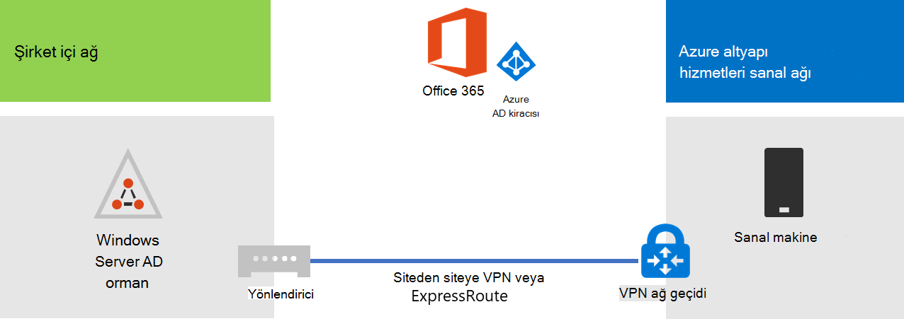

# Dizin Microsoft 365 Eşitlemeyi Başka Bir Microsoft Azure

Azure Active Directory (Azure AD) Bağlan (eski adı Dizin Eşitleme aracı, Dizin Eşitleme aracı veya DirSync.exe aracı), şirket içi Active Directory Etki Alanı Hizmetleri (AD DS) kullanıcılarınızı Microsoft 365 aboneliğinizin Azure AD kiracısına eşitlemek için etki alanına katılmış bir sunucuya yüklemiş olacağınız uygulamadır. Microsoft 365 dizin hizmeti için Azure AD'i kullanır. Microsoft 365 aboneliğiniz bir Azure AD kiracısı içerir. Bu kiracı, Azure'daki diğer SaaS uygulamaları ve uygulamaları dahil olmak üzere diğer bulut iş yükleriyle birlikte kuruluş kimliklerinin yönetimi için de kullanılabilir.

Azure AD Bağlan'i şirket içi bir sunucuya yükleyebilirsiniz, ancak azure'daki bir sanal makineye şu nedenlerle de yükleyebilirsiniz:
  
- Bulut tabanlı sunucuları daha hızlı hazırlar ve yapılandırarak hizmetleri kullanıcılarınıza daha çabuk sebilirsiniz.
- Azure daha az çabayla daha iyi bir site kullanılabilirliği sunar.
- Kurum içi sunucu sayısını azaltabilirsiniz.

Bu çözüm için, şirket içi ağınız ile Azure sanal ağınız arasında bağlantı gerekir. Daha fazla bilgi için [Bağlan ağı kendi sanal ağına Microsoft Azure bakın](connect-an-on-premises-network-to-a-microsoft-azure-virtual-network.md). 
  
> [!NOTE]
> Bu makalede, tek bir orman içinde tek bir etki alanının eşit eşitlemesi açıklanmıştır. Azure AD Bağlan, Active Directory ormanınız içinde yer alan tüm AD DS etki alanlarını otomatik Microsoft 365. Birden çok Active Directory ormanıyla eşitlenecek birden çok Microsoft 365 varsa bkz. Tek Ormanlı [DizinLe Çok Ormanlı Sign-On Senaryosu](/azure/active-directory/hybrid/whatis-hybrid-identity). 
  
## Azure'da dizin Microsoft 365 dağıtımına genel bakış

Aşağıdaki diyagramda, Azure ad Bağlan bir şirket içi AD DS ormanının bir Microsoft 365 aboneliğiyle eşitlenmesi için Azure'da (dizin eşitleme sunucusu) çalışan bir sanal makinede çalıştırabilirsiniz.
  

  
Diyagramda, siteden siteye VPN veya ExpressRoute bağlantısıyla bağlı iki ağ vardır. AD DS etki alanı denetleyicilerinin bulunduğu şirket içi bir ağ vardır ve dizin eşitleme sunucusunun bulunduğu bir Azure sanal ağı vardır ve bu, Azure AD etki alanı denetleyicisini çalıştıran sanal [bir Bağlan](https://www.microsoft.com/download/details.aspx?id=47594). Dizin eşitleme sunucusundan kaynaklanan iki ana trafik akışı vardır:
  
-  Azure AD Bağlan hesaplarda ve parolalarda yapılan değişiklikler için şirket içi ağ üzerinde bir etki alanı denetleyicisi sorgular.
-  Azure AD Bağlan, hesaplarda ve parolalarda yapılan değişiklikleri, azure ad aboneliğinizin Azure AD örneğine Microsoft 365 gönderir. Dizin eşitleme sunucusu şirket içi ağın genişletilmiş bir kısmında yer olduğundan, bu değişiklikler şirket içi ağın ara sunucusu üzerinden gönderilir.
    
> [!NOTE]
> Bu çözüm, tek bir Active Directory ormanı içinde tek bir Active Directory etki alanının eşitlemesini açıklar. Azure AD Bağlan, Active Directory ormanınıza yönelik tüm Active Directory etki alanlarını otomatik olarak Microsoft 365. Birden çok Active Directory ormanıyla eşitlenecek birden çok Microsoft 365 varsa bkz. Tek Ormanlı [DizinLe Çok Ormanlı Sign-On Senaryosu](/azure/active-directory/hybrid/whatis-hybrid-identity). 
  
Bu çözümü dağıtırken başlıca iki adım vardır:
  
1. Azure sanal ağı oluşturun ve şirket içi ağınıza siteden siteye VPN bağlantısı oluşturun. Daha fazla bilgi için [Bağlan ağı kendi sanal ağına Microsoft Azure bakın](connect-an-on-premises-network-to-a-microsoft-azure-virtual-network.md).
    
2. [Azure AD Bağlan](https://www.microsoft.com/download/details.aspx?id=47594) etki alanına katılmış bir sanal makineye Azure AD DS'i yükleyin ve ardından şirket içi AD DS'yi etki alanıyla Microsoft 365. Bu şunları içerir:
    
    Azure AD kullanıcılarını çalıştırmak için Azure Sanal Bağlan.
    
    [Azure AD etki alanlarını yükleme ve Bağlan](https://www.microsoft.com/download/details.aspx?id=47594).
    
    Azure AD yönetim Bağlan, Azure AD yönetici hesabının ve AD DS kurumsal yönetici hesabının kimlik bilgilerini (kullanıcı adı ve parola) gerektirir. Azure AD Bağlan, şirket içi AD DS ormanının otomatik olarak eşitlenmesi için hemen ve sürekli Microsoft 365.
    
Üretimde bu çözümü dağıtmadan önce, benzetimi yapılan kurumsal temel yapılandırmada verilen yönergeleri kullanarak bu yapılandırmayı kavram kanıtı, gösterim veya deneme amaçlı olarak ayarlayın.
  
> [!IMPORTANT]
> Azure AD Bağlan tamamlandıktan sonra, AD DS kurumsal yönetici hesap kimlik bilgilerini kaydetmez. 
  
> [!NOTE]
> Bu çözümde, tek bir AD DS ormanının eşitlenmesi Microsoft 365. Bu makalede ele alınan topoloji, bu çözümü uygulamanın tek bir yolunu temsil eder. Benzersiz ağ gereksinimlerinize ve güvenlikle ilgili dikkat edilmesi gerekenlere bağlı olarak, kuruluş topolojisi farklılık gösterebilir. 
  
## Azure'da iş için dizin eşitleme Microsoft 365 barındırmayı planlama

### Önkoşullar

Başlamadan önce, bu çözümün aşağıdaki önkoşullarını gözden geçirin:
  
- Azure sanal a sağlayıcınızı planlama [içinde ilgili planlama içeriğini gözden geçirebilirsiniz](connect-an-on-premises-network-to-a-microsoft-azure-virtual-network.md#plan-your-azure-virtual-network).
    
- Azure sanal ağına yapılandırmanın [tüm önkoşullarını](connect-an-on-premises-network-to-a-microsoft-azure-virtual-network.md#prerequisites) karşılarken emin olun.
    
- Active Directory Microsoft 365 özelliğini içeren bir kullanıcı aboneliğine sahip olun. Abonelikler hakkında Microsoft 365 için abonelik sayfasına [Microsoft 365 gidin](https://products.office.com/compare-all-microsoft-office-products?tab=2).
    
- Şirket içi AD DS ormanınızı diğer Bağlan eşitlemek için Azure AD Bağlan'i çalıştıran bir Azure Sanal Makine Microsoft 365.
    
    Ad DS kurumsal yönetici hesabı ve Azure AD Yöneticisi hesabının kimlik bilgilerine (adlar ve parolalar) sahip olmak gerekir.
    
### Çözüm mimarisi tasarım varsayımları

Aşağıdaki listede, bu çözüm için yapılan tasarım seçimleri açık almaktadır.
  
- Bu çözüm, siteden siteye VPN bağlantısı olan tek bir Azure sanal ağı kullanır. Azure sanal ağı, tek bir sunucusu, Azure AD Eşitleme Hizmeti'ni çalıştıran dizin eşitleme sunucusuna sahip tek bir alt Bağlan. 
    
- Şirket içi ağda, bir etki alanı denetleyicisi ve DNS sunucuları vardır.
    
- Azure AD Bağlan, çoklu oturum açma yerine parola karması eşitlemesi gerçekleştirir. Active Directory Federasyon Hizmetleri (AD FS) altyapısını dağıtmaya gerek yok. Parola karma eşitlemesi ve çoklu oturum açma seçenekleri hakkında daha fazla bilgi edinmek için bkz. Karma kimlik çözümünüz [için Azure Active Directory seçme](/azure/active-directory/hybrid/choose-ad-authn).
    
Ortamınıza bu çözümü dağıtırken göz önünde bulundurabilirsiniz ek tasarım seçenekleri vardır. Bunlar şunlardır:
  
- Var olan bir Azure sanal ağına varolan DNS sunucuları varsa, dizin eşitleme sunucularının şirket içi ağ üzerinde DNS sunucuları yerine ad çözümlemesi için bunları kullanmasını isteyip istemeyebilirsiniz.
    
- Var olan bir Azure sanal ağına etki alanı denetleyicileri varsa, Active Directory Siteleri ve Hizmetleri'nin yapılandırılmanın sizin için daha iyi bir seçenek olup olmadığını belirleyin. Dizin eşitleme sunucusu, şirket içi ağ üzerinde etki alanı denetleyicileri yerine Azure sanal ağına etki alanı denetleyicilerinde yapılan değişiklikleri sorgular.
    
## Dağıtım yol haritası

Azure AD Bağlan Azure'da sanal bir makineye dağıtmak üç aşamadan oluşur:
  
- Aşama 1: Azure sanal ağına oluşturma ve yapılandırma
    
- Aşama 2: Azure sanal makinesi oluşturma ve yapılandırma
    
- Aşama 3: Azure AD E-postasını yükleme ve Bağlan
    
Dağıtımdan sonra, aynı zamanda dağıtım kaynaklarında yeni kullanıcı hesapları için konumlar ve lisanslar Microsoft 365.

### Aşama 1: Azure sanal ağına oluşturma ve yapılandırma

Azure sanal ağına oluşturmak ve yapılandırmak için, Aşama [1:](connect-an-on-premises-network-to-a-microsoft-azure-virtual-network.md#phase-1-prepare-your-on-premises-network) Şirket içi ağına hazırlama ve Aşama [2: Azure'da](connect-an-on-premises-network-to-a-microsoft-azure-virtual-network.md#phase-2-create-the-cross-premises-virtual-network-in-azure) şirket içi bir ağa Bağlan ağının dağıtım yol haritasında şirket içi sanal ağı Microsoft Azure [oluşturun.](connect-an-on-premises-network-to-a-microsoft-azure-virtual-network.md)
  
Sonuçta elde edilen yapılandırmanızdır.
  

  
Bu şekil, bir siteden siteye VPN veya ExpressRoute bağlantısı aracılığıyla Azure sanal ağına bağlı şirket içi ağı gösterir.
  
### Aşama 2: Azure sanal makinesi oluşturma ve yapılandırma

Azure portalda ilk sanal makinenizi oluşturma [yönergelerini Windows sanal makinenizi oluşturun](https://go.microsoft.com/fwlink/p/?LinkId=393098). Aşağıdaki ayarları kullanın:
  
- Temel **Bilgiler bölmesinde** , sanal ağınız ile aynı aboneliği, konumu ve kaynak grubunu seçin. Kullanıcı adı ve parolayı güvenli bir konuma kaydetme. Sanal makineye bağlanmak için daha sonra bunlara ihtiyacınız olacak.
    
- Boyut **seçin bölmesinde A2** Standart **boyutunu** seçin.
    
- Standart **Ayarlar** Standart depolama **Depolama** seçin. Ağ **bölümünde,** dizin eşitleme sunucusunu (GatewaySubnet'i değil) barındırmak için sanal ağ ve alt ağın adını seçin. Diğer tüm ayarları varsayılan değerlerinde bırakın.
    
Dizin eşitleme sunucularının, IP adresiyle birlikte sanal makine için bir Adres (A) kaydının eklendiklerinden emin olmak için iç DNS'inizi kontrol ederek DNS'yi doğru bir şekilde kullanıyor olduğundan emin olun. 
  
Sanal makineye Bağlan [yönergeleri kullanın ve](/azure/virtual-machines/windows/connect-logon) Uzak Masaüstü Bağlantısı ile dizin eşitleme sunucusuna bağlanmak için oturum açın. Oturum katıldıktan sonra, sanal makineye şirket içi AD DS etki alanıyla katılın.
  
Azure AD Bağlan İnternet kaynaklarına erişim kazanmak için, dizin eşitleme sunucusunu şirket içi ağın ara sunucusunu kullanmak üzere yapılandırmanız gerekir. Ek yapılandırma adımlarını gerçekleştirmek için ağ yöneticinize başvurabilirsiniz.
  
Sonuçta elde edilen yapılandırmanızdır.
  

  
Bu şekil, şirket içi Azure sanal ağının dizin eşitleme sunucusu sanal makinesi'ni gösterir.
  
### Aşama 3: Azure AD E-postasını yükleme ve Bağlan

Aşağıdaki yordamı tamamlama:
  
1. Bağlan yönetici ayrıcalıklarına sahip bir AD DS etki alanı hesabıyla Uzak Masaüstü Bağlantısı kullanarak dizin eşitleme sunucusuna bağlanabilirsiniz. Sanal [Bağlan oturum açma hakkında bilgi için bkz](/azure/virtual-machines/windows/connect-logon).
    
2. Dizin eşitleme sunucusunda, Eşitleme için dizin eşitlemesini ayarla [makalesini Microsoft 365](set-up-directory-synchronization.md) parola karması eşitlemesi ile dizin eşitlemesi yönergelerini izleyin.
    
> [!CAUTION]
> Kurulum, **AAD_xxxxxxxxxxxx** Yerel Kullanıcılar kuruluş biriminde (OU) kullanıcı hesabını oluşturur. Bu hesabı taşıma veya kaldırma ya da eşitleme başarısız olur.
  
Sonuçta elde edilen yapılandırmanızdır.
  

  
Bu şekil, şirket içi Azure sanal ağına azure ad Bağlan dizin eşitleme sunucusunu gösterir.
  
### Aynı konumdaki kullanıcılara konum ve lisans Microsoft 365

Azure AD Bağlan, hesapları şirket içi AD DS'den Microsoft 365 aboneliğinize ekler, ancak kullanıcıların Microsoft 365'te oturum açması ve hizmetlerini kullanması için hesapların bir konum ve lisanslarla yapılandırılması gerekir. Konum eklemek ve uygun kullanıcı hesaplarının lisanslarını etkinleştirmek için şu adımları kullanın:
  
1. Oturum açma sayfasında oturum [Microsoft 365 yönetim merkezi](https://admin.microsoft.com) Yönetici'ye **tıklayın**.
    
2. Sol gezintide **UsersActive** >  <a href="https://go.microsoft.com/fwlink/p/?linkid=834822" target="_blank">**users öğesini tıklatın**</a>.
3. Kullanıcı hesapları listesinde, etkinleştirmek istediğiniz kullanıcının yanındaki onay kutusunu seçin.
    
4. Kullanıcı sayfasında Ürün lisansları için **Düzenle'ye tıklayın**.
    
5. Ürün **lisansları sayfasında** , Konum için kullanıcı **için bir konum** seçin ve kullanıcı için uygun lisansları etkinleştirin.
    
6. Tamamlandığında Kaydet'e **tıklayın ve** sonra iki kez **Kapat'a** tıklayın.
    
7. Diğer kullanıcılar için 3. adıma geri dönme.
    
## Ayrıca bkz.

[Microsoft 365 çözüm ve mimari merkezi](../solutions/index.yml)
  
[Bağlan ağına şirket içi ağı Microsoft Azure ağı](connect-an-on-premises-network-to-a-microsoft-azure-virtual-network.md)

[Azure AD Bağlan](https://www.microsoft.com/download/details.aspx?id=47594)
  
[Etki alanı için dizin eşitlemesini Microsoft 365](set-up-directory-synchronization.md)
