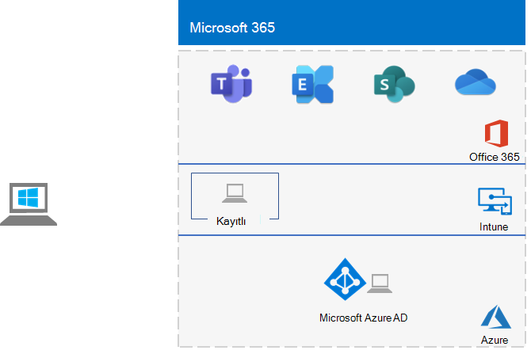

# <a name="the-lightweight-base-configuration"></a>Basit temel yapılandırma

*Bu Test Laboratuvarı Kılavuzu hem kurumsal hem de Office 365 Kurumsal test ortamları için Microsoft 365 için kullanılabilir.*

Bu makalede, Microsoft 365 E5 aboneliği ve Windows 10 Enterprise çalıştıran bir bilgisayar ile basitleştirilmiş bir ortamın nasıl oluşturulacağı açıklanır.



Basit bir test ortamı oluşturmak beş aşamayı içerir:
- [1. Aşama: Microsoft 365 E5 aboneliğinizi oluşturma](#phase-1-create-your-microsoft-365-e5-subscription)
- [2. Aşama: Office 365 deneme aboneliğinizi yapılandırma](#phase-2-configure-your-office-365-trial-subscription)
- [3. Aşama: Microsoft 365 E5 deneme aboneliği ekleme](#phase-3-add-a-microsoft-365-e5-trial-subscription)
- [4. Aşama: Windows 10 Enterprise bilgisayar oluşturma](#phase-4-create-a-windows-10-enterprise-computer)
- [5. Aşama: Windows 10 bilgisayarınızı Azure AD'ye ekleme](#phase-5-join-your-windows-10-computer-to-azure-ad)

[Kuruluş için Microsoft 365](https://www.microsoft.com/microsoft-365/enterprise) özelliklerini ve işlevselliğini test etmek için sonuçta elde edilen ortamı kullanın.


  
> [!TIP]
> Kurumsal Test Laboratuvarı Kılavuzu yığınının Microsoft 365 tüm makalelere yönelik görsel bir harita için bkz. [Kurumsal Test Laboratuvarı Kılavuz Yığını için Microsoft 365](../downloads/Microsoft365EnterpriseTLGStack.pdf).

>[!NOTE]
>Office 365 deneme aboneliğinin 30 günü boyunca bu ortam için ihtiyacınız olacak belirli bilgileri kaydetmek için bu makaleyi yazdırmak isteyebilirsiniz. İz aboneliğini kolayca 30 gün daha uzatabilirsiniz. Kalıcı bir test ortamı için ayrı bir Azure AD kiracısı ve az sayıda lisans ile yeni bir ücretli abonelik oluşturun.

## <a name="phase-1-create-your-microsoft-365-e5-subscription"></a>1. Aşama: Microsoft 365 E5 aboneliğinizi oluşturma

bir Microsoft 365 E5 deneme aboneliğiyle başlayacağız ve ardından Microsoft 365 E5 aboneliğini bu aboneliğe ekleyeceğiz.

>[!NOTE]
>Test ortamınızın şu anda sahip olduğunuz ücretli aboneliklerden ayrı bir Azure AD kiracısı olması için Office 365 deneme aboneliği oluşturmanızı öneririz. Bu ayrım, üretim aboneliklerinizi etkilemeden test kiracısına kullanıcı ve grup ekleyip kaldırabileceğiniz anlamına gelir.

Microsoft 365 E5 deneme aboneliğinizi başlatmak için önce kurgusal bir şirket adı ve yeni bir Microsoft hesabı gerekir.
  
1. Microsoft örnek içeriğinde kullanılan kurgusal bir şirket olan şirket adınız için Contoso adlı bir çeşitleme kullanmanızı öneririz, ancak bu gerekli değildir. Kurgusal şirketinizin adını buraya kaydedin: 
    
2. Yeni bir Microsoft hesabına kaydolmak için adresine gidin [https://outlook.com](https://outlook.com) ve yeni bir e-posta hesabı ve adresi olan bir hesap oluşturun. Office 365 kaydolmak için bu hesabı kullanacaksınız.
    
    - Yeni hesabınızın adını ve soyadını buraya kaydedin: 
    
    - Yeni e-posta hesabı adresini buraya kaydedin: @outlook.com
    
### <a name="sign-up-for-an-office-365-e5-trial-subscription"></a>Office 365 E5 deneme aboneliğine kaydolma

1. Tarayıcınızda adresine [https://aka.ms/e5trial](https://aka.ms/e5trial)gidin.
    
2. **Office 365 E5 seçtiğiniz için teşekkür ederiz** sayfasının 1. adımında yeni e-posta hesabı adresinizi girin.
3. İz abonelik işleminin 2. adımında, istenen bilgileri girin ve doğrulamayı gerçekleştirin.
4. 3. adımda, bir kuruluş adı ve ardından aboneliğin genel yöneticisi olacak bir hesap adı girin.
5. 4. adım için oturum açma sayfasını buraya kaydedin (seçin ve kopyalayın): 
6. Kullanıcı kimliğini buraya kaydedin: . onmicrosoft.com  
   Girdiğiniz parolayı güvenli bir konuma kaydedin.
   Bu değer genel **yönetici adı** olarak adlandırılır.
7. **Kuruluma Git'i** seçin.
8. kurulum Office 365 E5, **e-posta ve oturum açma için *kuruluşunuzu* kullanmaya devam et.onmicrosoft.com'ı** seçin ve ardından **Çıkış'ı seçin ve daha sonra devam edin**.

Microsoft 365 yönetim merkezi görmeniz gerekir.
    
## <a name="phase-2-configure-your-office-365-trial-subscription"></a>2. Aşama: Office 365 deneme aboneliğinizi yapılandırma

Bu aşamada, aboneliğinizi ek kullanıcılarla yapılandırıp bu kullanıcılara Office 365 E5 lisans atarsınız.
  
Bilgisayarınızdan Graph için Azure Active Directory PowerShell modülüyle aboneliğinize bağlanmak için[, powershell ile Microsoft 365 için Bağlan yönergelerini](connect-to-microsoft-365-powershell.md#connect-with-the-azure-active-directory-powershell-for-graph-module) kullanın.
    
**Windows PowerShell Kimlik Bilgisi İsteği** iletişim kutusunda genel yönetici adını (örneğin, *jdoe@contosotoycompany.onmicrosoft.com*) ve parolayı girin.
  
Kuruluşunuzun adını (örneğin *, contosotoycompany*), konumunuz için iki karakterli ülke kodunu, ortak bir hesap parolasını girin ve ardından PowerShell isteminden aşağıdaki komutları çalıştırın:

```powershell
$orgName="<organization name>"
$loc="<two-character country code, such as US>"
$commonPW="<common user account password>"
$PasswordProfile=New-Object -TypeName Microsoft.Open.AzureAD.Model.PasswordProfile
$PasswordProfile.Password=$commonPW

$License = New-Object -TypeName Microsoft.Open.AzureAD.Model.AssignedLicense
$License.SkuId = (Get-AzureADSubscribedSku | Where-Object -Property SkuPartNumber -Value "ENTERPRISEPREMIUM" -EQ).SkuID
$LicensesToAssign = New-Object -TypeName Microsoft.Open.AzureAD.Model.AssignedLicenses
$LicensesToAssign.AddLicenses = $License

for($i=2;$i -le 4; $i++) {
    $userUPN= "user$($i)@$($orgName).onmicrosoft.com"
    New-AzureADUser -DisplayName "User $($i)" -GivenName User -SurName $i -UserPrincipalName $userUPN -UsageLocation $loc -AccountEnabled $true -PasswordProfile $PasswordProfile -MailNickName "user$($i)"
    $userObjectID = (Get-AzureADUser -SearchString $userupn).ObjectID
    Set-AzureADUserLicense -ObjectId $userObjectID -AssignedLicenses $LicensesToAssign
}
```
> [!NOTE]
> Burada yaygın bir parolanın kullanımı, bir test ortamı için otomasyon ve yapılandırma kolaylığına yöneliktir. Açıkçası, üretim abonelikleri için bu kesinlikle önerilmez. 

### <a name="record-key-information-for-future-reference"></a>Gelecekte başvurmak için önemli bilgileri kaydedin

Bu değerleri henüz kaydetmediyseniz, şimdi kaydedin:
  
- Genel yönetici adı: .onmicrosoft.com (1. Aşamanın 6. adımından)
    
    Ayrıca bu hesabın parolasını güvenli bir konuma kaydedin.
    
- Deneme aboneliği kuruluşunuzun adı:  (1. Aşama'nın 4. adımından itibaren)
    
- Kullanıcı 2, Kullanıcı 3, Kullanıcı 4 ve Kullanıcı 5 hesaplarını listelemek için, Windows PowerShell istemi için Windows Azure Active Directory Modülü'nden aşağıdaki komutu çalıştırın:
    
  ```powershell
  Get-AzureADUser | Sort UserPrincipalName | Select UserPrincipalName
  ```

    Hesap adlarını buraya kaydedin:
    
  - Kullanıcı 2 hesap adı: kullanıcı2 @.onmicrosoft.com
    
  - Kullanıcı 3 hesap adı: user3 @.onmicrosoft.com
    
  - Kullanıcı 4 hesap adı: kullanıcı4 @.onmicrosoft.com
    
  - Kullanıcı 5 hesap adı: user5 @.onmicrosoft.com
    
    Ayrıca bu hesaplar için ortak parolayı güvenli bir konuma kaydedin.
   
### <a name="using-an-office-365-test-environment"></a>Office 365 test ortamı kullanma

Yalnızca bir Office 365 test ortamına ihtiyacınız varsa, bu makalenin geri kalanını okumanız gerekmez.

Hem Office 365 hem de Microsoft 365 için geçerli olan ek [Test Laboratuvarı Kılavuzları için bkz. Kurumsal Test Laboratuvarı Kılavuzları için Microsoft 365](m365-enterprise-test-lab-guides.md).
  
## <a name="phase-3-add-a-microsoft-365-e5-trial-subscription"></a>3. Aşama: Microsoft 365 E5 deneme aboneliği ekleme

Bu aşamada, Microsoft 365 E5 deneme aboneliğine kaydolup Office 365 E5 deneme aboneliğinizle aynı kuruluşa eklersiniz.
  
İlk olarak, Microsoft 365 E5 deneme aboneliğini ekleyin ve yeni Microsoft 365 lisansını genel yönetici hesabınıza atayın.
  
1. İnternet tarayıcısı özel penceresinde, konumundaki Microsoft 365 yönetim merkezi [https://admin.microsoft.com](https://admin.microsoft.com)oturum açmak için genel yönetici hesabı kimlik bilgilerinizi kullanın.
    
2. **Microsoft 365 yönetim merkezi** sayfasındaki sol gezinti bölmesinde <a href="https://go.microsoft.com/fwlink/p/?linkid=868433" target="_blank">**FaturalamaHizmetler'i**</a> >  seçin.
    
3. **Hizmetleri satın al** sayfasında **Microsoft 365 E5'ı** ve ardından **Ücretsiz deneme sürümünü al'ı** seçin.

4. **Microsoft 365 E5 Deneme** sayfasında, kısa mesaj veya telefon araması almaya karar verin, telefon numaranızı girin ve ardından **Bana mesaj at** veya **Beni ara'yı** seçin. Doğrulamayı gerçekleştirin.

5. **Siparişinizi onaylayın** sayfasında **Şimdi deneyin'i** seçin.

6. **Sipariş makbuzu** sayfasında **Devam'ı** seçin.

7. Microsoft 365 yönetim merkezi <a href="https://go.microsoft.com/fwlink/p/?linkid=834822" target="_blank">**KullanıcılarEtkin**</a> >  kullanıcılar'ı seçin.

8. **Etkin kullanıcılar'da** yönetici hesabınızı seçin.

9. **Lisanslar ve uygulamalar'ı** seçin.

10. Office 365 Kurumsal E5 lisansını devre dışı bırakın ve Microsoft 365 E5 lisansını etkinleştirin.

11. **Değişiklikleri kaydet'i** seçin ve ardından kullanıcı hesabı bilgileri bölmesini kapatın.

Ardından, önceki yordamın 8 ile 11 arasındaki adımlarını diğer tüm hesaplarınız (Kullanıcı 2, Kullanıcı 3, Kullanıcı 4 ve Kullanıcı 5) için yineleyin.
  
> [!NOTE]
> Microsoft 365 E5 deneme aboneliğinin süresi 30 gündür. Kalıcı bir test ortamı için bu deneme aboneliğini az sayıda lisansa sahip ücretli bir aboneliğe dönüştürün.
  
Test ortamınızda artık aşağıdakiler vardır:
  
- Microsoft 365 E5 deneme aboneliği.
- Tüm uygun kullanıcı hesaplarınız (yalnızca genel yönetici veya beş kullanıcı hesabının tümü) Microsoft 365 E5 kullanmak üzere etkinleştirilir.
    
Microsoft 365 E5 ekleyen sonuçta elde edilen yapılandırmanız şöyle görünür:
  

  
## <a name="phase-4-create-a-windows-10-enterprise-computer"></a>4. Aşama: Windows 10 Enterprise bilgisayar oluşturma

Bu aşamada, fiziksel bilgisayar, sanal makine veya Azure sanal makinesi olarak Windows 10 Enterprise çalıştıran tek başına bir bilgisayar oluşturursunuz.
  
### <a name="physical-computer"></a>Fiziksel bilgisayar

Kişisel bir bilgisayara Windows 10 Enterprise yükleyin. Windows 10 Enterprise deneme sürümünü [buradan](https://www.microsoft.com/evalcenter/evaluate-windows-10-enterprise) indirebilirsiniz.
  
### <a name="virtual-machine"></a>Sanal makine

Sanal makine oluşturmak için seçtiğiniz hiper yöneticiyi kullanın ve ardından Windows 10 Enterprise yükleyin. Windows 10 Enterprise deneme sürümünü [buradan](https://www.microsoft.com/evalcenter/evaluate-windows-10-enterprise) indirebilirsiniz.
  
### <a name="virtual-machine-in-azure"></a>Azure'da sanal makine

Microsoft Azure'da Windows 10 bir sanal makine oluşturmak için, Windows 10 Enterprise için görüntüye erişimi olan ***Visual Studio tabanlı bir aboneliğiniz olmalıdır***. Deneme ve ücretli abonelikler gibi diğer Azure abonelik türlerinin bu görüntüye erişimi yoktur. En son bilgiler için bkz. [Geliştirme ve test senaryoları için Azure'da Windows istemcisini kullanma](/azure/virtual-machines/windows/client-images).
  
> [!NOTE]
> Aşağıdaki komut kümeleri Azure PowerShell en son sürümünü kullanır. Bkz. [Azure PowerShell cmdlet'lerle Kullanmaya başlayın](/powershell/azureps-cmdlets-docs/). Bu komut kümeleri WIN10 adlı Windows 10 Enterprise bir sanal makine ve kaynak grubu, depolama hesabı ve sanal ağ da dahil olmak üzere gerekli tüm altyapıyı oluşturur. Azure altyapı hizmetlerini zaten biliyorsanız, bu yönergeleri şu anda dağıtılan altyapınıza uyacak şekilde uyarlarsınız.
  
İlk olarak bir Microsoft PowerShell istemi başlatın.
  
Bu komutla Azure hesabınızda oturum açın.
  
```powershell
Connect-AzAccount
```

Bu komutu kullanarak abonelik adınızı alın.
  
```powershell
Get-AzSubscription | Sort Name | Select Name
```

Azure aboneliğinizi ayarlayın. Tırnak işaretleri içindeki karakterler de dahil olmak üzere \< and > her şeyi doğru adla değiştirin.
  
```powershell
$subscr="<subscription name>"
Get-AzSubscription -SubscriptionName $subscr | Select-AzSubscription
```

Ardından yeni bir kaynak grubu oluşturun. Benzersiz bir kaynak grubu adı belirlemek için bu komutu kullanarak mevcut kaynak gruplarınızı listeleyin.
  
```powershell
Get-AzResourceGroup | Sort ResourceGroupName | Select ResourceGroupName
```

Bu komutlarla yeni kaynak grubunuzu oluşturun. Tırnak işaretleri içindeki karakterler de dahil olmak üzere \< and > her şeyi doğru adlarla değiştirin.
  
```powershell
$rgName="<resource group name>"
$locName="<location name, such as West US>"
New-AzResourceGroup -Name $rgName -Location $locName
```

Ardından, bu komutlarla yeni bir sanal ağ ve WIN10 sanal makinesi oluşturun. İstendiğinde, WIN10 için yerel yönetici hesabının adını ve parolasını girin ve bunları güvenli bir konumda depolayın.
  
```powershell
$corpnetSubnet=New-AzVirtualNetworkSubnetConfig -Name Corpnet -AddressPrefix 10.0.0.0/24
New-AzVirtualNetwork -Name "M365Ent-TestLab" -ResourceGroupName $rgName -Location $locName -AddressPrefix 10.0.0.0/8 -Subnet $corpnetSubnet
$rule1=New-AzNetworkSecurityRuleConfig -Name "RDPTraffic" -Description "Allow RDP to all VMs on the subnet" -Access Allow -Protocol Tcp -Direction Inbound -Priority 100 -SourceAddressPrefix Internet -SourcePortRange * -DestinationAddressPrefix * -DestinationPortRange 3389
New-AzNetworkSecurityGroup -Name Corpnet -ResourceGroupName $rgName -Location $locName -SecurityRules $rule1
$vnet=Get-AzVirtualNetwork -ResourceGroupName $rgName -Name "M365Ent-TestLab"
$nsg=Get-AzNetworkSecurityGroup -Name Corpnet -ResourceGroupName $rgName
Set-AzVirtualNetworkSubnetConfig -VirtualNetwork $vnet -Name Corpnet -AddressPrefix "10.0.0.0/24" -NetworkSecurityGroup $nsg
$vnet | Set-AzVirtualNetwork
$pip=New-AzPublicIpAddress -Name WIN10-PIP -ResourceGroupName $rgName -Location $locName -AllocationMethod Dynamic
$nic=New-AzNetworkInterface -Name WIN10-NIC -ResourceGroupName $rgName -Location $locName -SubnetId $vnet.Subnets[0].Id -PublicIpAddressId $pip.Id
$vm=New-AzVMConfig -VMName WIN10 -VMSize Standard_A2_V2
$cred=Get-Credential -Message "Type the name and password of the local administrator account for WIN10."
$vm=Set-AzVMOperatingSystem -VM $vm -Windows -ComputerName WIN10 -Credential $cred -ProvisionVMAgent -EnableAutoUpdate
$vm=Set-AzVMSourceImage -VM $vm -PublisherName MicrosoftWindowsDesktop -Offer Windows-10 -Skus RS3-Pro -Version "latest"
$vm=Add-AzVMNetworkInterface -VM $vm -Id $nic.Id
$vm=Set-AzVMOSDisk -VM $vm -Name WIN10-TestLab-OSDisk -DiskSizeInGB 128 -CreateOption FromImage
New-AzVM -ResourceGroupName $rgName -Location $locName -VM $vm
```

## <a name="phase-5-join-your-windows-10-computer-to-azure-ad"></a>5. Aşama: Windows 10 bilgisayarınızı Azure AD'ye ekleme

Windows 10 Enterprise içeren fiziksel veya sanal makine oluşturulduktan sonra yerel yönetici hesabıyla oturum açın.
  
> [!NOTE]
> Azure'daki bir sanal makineye bağlanmak için  [bu yönergeleri](/azure/virtual-machines/windows/connect-logon) kullanın.
  
Ardından WIN10 bilgisayarını Microsoft 365 E5 aboneliğinizin Azure AD kiracısına ekleyin.
  
1. WIN10 bilgisayarının masaüstünde, **İş veya okul > Bağlan erişim > Hesapları başlat > Ayarlar >'ı** seçin.
    
2. **İş veya okul hesabı ayarla** iletişim kutusunda, **Azure Active Directory için Bu cihaza katıl'ı** seçin.
    
3. **İş veya okul hesabı** bölümünde, Microsoft 365 E5 aboneliğinizin genel yönetici hesabı adını girin ve **İleri'yi** seçin.
    
4. **Parola girin** alanına genel yönetici hesabınızın parolasını girin ve oturum **aç'ı** seçin.
    
5. Bunun kuruluşunuz olduğundan emin olmak isteyip istemediğiniz sorulduğunda **Katıl'ı** ve ardından **Bitti'yi** seçin.
    
6. Ayarlar penceresini kapatın.
    
Ardından, WIN10 bilgisayarına Kurumlar için Microsoft 365 Uygulamaları yükleyin:
  
1. Microsoft Edge tarayıcısını açın ve genel yönetici hesabı kimlik bilgilerinizle [Microsoft 365 yönetim merkezi](https://admin.microsoft.com) oturum açın.
    
2. **Microsoft Office Giriş** sekmesinde **Office Yükle'yi** seçin.
    
3. Ne yapmanız istendiğinde **Çalıştır'ı** ve ardından **Kullanıcı Hesabı Denetimi** için **Evet'i** seçin.
    
4. Office yüklemesini tamamlanmasını bekleyin. **Hazırsınız!** ifadesini gördüğünüzde iki kez **Kapat'ı** seçin.
    
Sonuçta elde edilen ortamınız şöyle görünür:


Bu, aşağıdakilere sahip WIN10 bilgisayarı içerir:

- Microsoft 365 E5 aboneliğinizin Azure AD kiracıya katıldı.
- Microsoft Intune'de (EMS) Azure AD cihazı olarak kaydedilir.
- Kurumlar için Microsoft 365 Uygulamaları yüklü.
  
Artık [kurumsal Microsoft 365](https://www.microsoft.com/microsoft-365/enterprise) ek özellikleriyle deneme yapmaya hazırsınız.
  
## <a name="next-steps"></a>Sonraki adımlar

Bu ek Test Laboratuvarı Kılavuzları kümelerini keşfedin:
  
- [Kimlik](m365-enterprise-test-lab-guides.md#identity)
- [Mobil cihaz yönetimi](m365-enterprise-test-lab-guides.md#mobile-device-management)
- [Bilgi koruması](m365-enterprise-test-lab-guides.md#information-protection)
   

## <a name="see-also"></a>Ayrıca bkz.

[Kurumsal Test Laboratuvarı Kılavuzları için Microsoft 365](m365-enterprise-test-lab-guides.md)

[Microsoft 365 Kurumsal’a genel bakış](microsoft-365-overview.md)

[Kurumsal belgeler için Microsoft 365](/microsoft-365-enterprise/)
