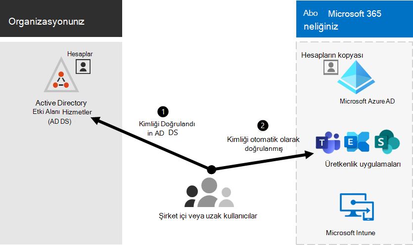

# Microsoft 365 ortamlarla tümleştirmeyi sağlar

*Bu makale hem son hem de Microsoft 365 Kurumsal hem de Office 365 Kurumsal.*

Microsoft 365'i mevcut şirket içi Active Directory Etki Alanı Hizmetleri (AD DS) ile tümleştirebilirsiniz ve Exchange Server, Skype Kurumsal Sunucu 2015 veya SharePoint Server şirket içi yüklemeleriyle tümleştirebilirsiniz.
  
 - AD DS'i tümleştirin, her iki ortam için de kullanıcı hesaplarını eşitler ve yönetirsiniz. Ayrıca, parola karma eşitlemesi (PHS) veya çoklu oturum açma (SSO) ekleyebilir, böylelikle kullanıcıların şirket içi kimlik bilgileriyle her iki ortamda da oturum açabilirsiniz.
 - Şirket içi sunucu ürünleriyle tümleştiriyken, karma bir ortam oluşturabilirsiniz. Karma ortam, kullanıcıları veya bilgileri Microsoft 365 geçirilirken size yardımcı olabilir ya da bazı kullanıcıları veya bazı bilgileri şirket içinde ve bazıları da bulutta olmaya devam edebilir. Karma ortamlar hakkında daha fazla bilgi için bkz. [karma bulut](../solutions/cloud-architecture-models.md#hybrid).

Aşağıdaki bağlantıda özelleştirilmiş kurulum Azure Active Directory için Azure AD) danışmanlarını da kullanabilirsiniz (Microsoft 365 yönetim merkezi'de oturum Microsoft 365:

- [Azure AD kurulum kılavuzu](https://aka.ms/aadpguidance)
- [Kullanıcıları kuruluş dizininden eşitleme](https://aka.ms/aadconnectpwsync)
- [Active Directory Federasyon Hizmetleri (AD FS) dağıtım danışmanı](https://aka.ms/adfsguidance)
   
## Başlamadan önce

Şirket içi Microsoft 365 ortamı tümleştiremeden önce ağ planlaması ve [performans ayarı da gerekir](network-planning-and-performance.md). Ayrıca, kullanılabilir kimlik modellerini de anlamak [gerekir](deploy-identity-solution-identity-model.md). 

Kullanıcı [Microsoft 365 yönetmek için](manage-microsoft-365-accounts.md) kullanabileceğiniz araçların listesi için bkz. Microsoft 365 hesapları yönetme. 
  
## Ad DS Microsoft 365 bütünleştirin

AD DS'de mevcut kullanıcı hesaplarınız varsa, bu hesapların hepsini aynı anda yeniden oluşturmak ve ortamlar arasında farklılıklar veya hatalar Microsoft 365 riskler oluşturmak istemiyorsanız. Dizin eşitlemesi, bu hesapları şirket içi ve çevrimiçi ortamlar arasında yansıtmanıza yardımcı olur. Dizin eşitlemeyle, kullanıcılarınız her ortamla ilgili yeni bilgileri anımsamanıza ve hesapları iki kez oluşturmanıza veya güncelleştirmenize gerek değildir. Şirket içi [dizininizi dizin eşitlemesi için](prepare-for-directory-synchronization.md) hazırlamanız gerekir.
  

  
Kullanıcıların kendi şirket içi kimlik bilgileriyle Microsoft 365 oturum açabileceklerini varsa, SSO'nun da yapılandırabilirsiniz. SSO ile Microsoft 365, kullanıcı kimlik doğrulaması için şirket içi ortama güvenacak şekilde yapılandırılmıştır.
  

### Parola karması eşitlemesi veya geçişli kimlik doğrulaması (PTA) ile veya bu eşitleme olmadan dizin eşitlemesi

Kullanıcı, kendi şirket içi ortamında kendi kullanıcı hesabıyla (etkialanı\kullanıcıadı) oturum açtığında. Microsoft 365'a gideceklerinde, iş veya okul hesaplarıyla (iş veya okul hesabıyla) yeniden oturum user@domain.com. Kullanıcı adı her iki ortamda da aynıdır. PHS veya PTA eklerken, kullanıcı her iki ortam için de aynı parolaya sahip olur, ancak kullanıcı oturum aken bu kimlik bilgilerini yeniden Microsoft 365. PHS ile dizin eşitlemesi, en sık kullanılan dizin eşitlemesidir.

Dizin eşitlemesini ayarlamak için Azure AD eşitlemesini Bağlan. Yönergeler için bkz. [Hızlı ayarlarla Microsoft 365](set-up-directory-synchronization.md) [Azure AD Bağlan eşitlemeyi ayarlama](/azure/active-directory/hybrid/how-to-connect-install-express).

Eşitlemeyi [eşitlemeye hazırlanma hakkında daha fazla bilgi Microsoft 365](prepare-for-directory-synchronization.md).

### SSO ile dizin eşitlemesi

Kullanıcı, kendi şirket içi ortamında kendi kullanıcı hesabıyla oturum açtığında. Microsoft 365'a gideceklerinde, oturumları otomatik olarak açılır veya şirket içi ortamında kendi şirket içi ortamında (etkialanı\kullanıcıadı) kendi kimlik bilgileriyle oturum açılır.

SSO'nun kullanımını ayarlamak için Azure AD Hizmet Hizmetleri'Bağlan. Yönergeler için bkz. [Azure AD'nin özel yüklemesi Bağlan](/azure/active-directory/hybrid/how-to-connect-install-custom).

Daha fazla bilgi için [bkz. çoklu oturum açma](/azure/active-directory/manage-apps/what-is-single-sign-on).

## Azure AD Connect

Azure AD Bağlan DirSync ve Eşitleme gibi kimlik tümleştirme araçlarının eski sürümlerinin yerine Azure AD Eşitleme. Azure Active Directory Azure AD Bağlan'den güncelleştirmek Bağlan [yönergelerine bakın](/azure/active-directory/hybrid/how-to-dirsync-upgrade-get-started). 

## Ayrıca bkz.

[Microsoft 365 Kurumsal genel bakış](microsoft-365-overview.md)